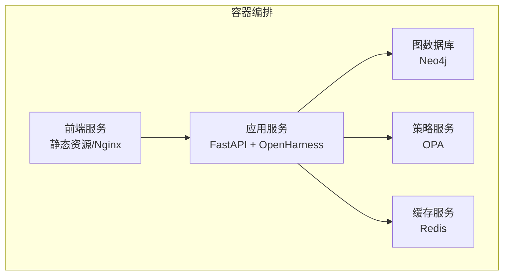
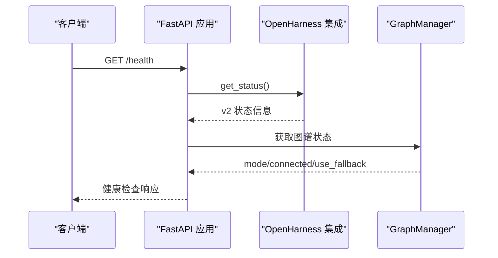
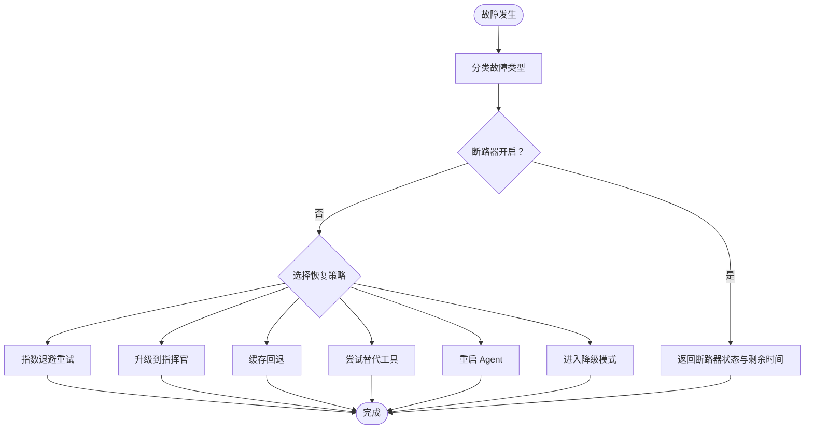
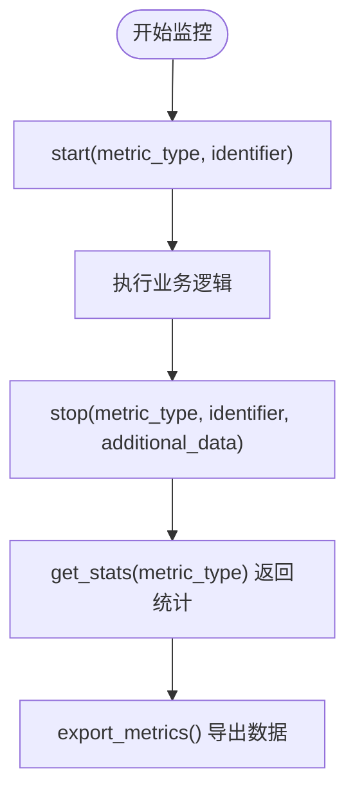
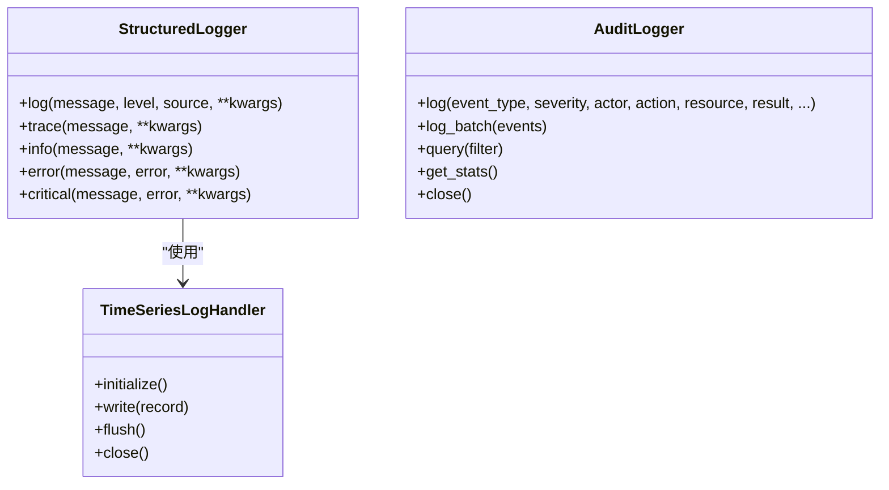
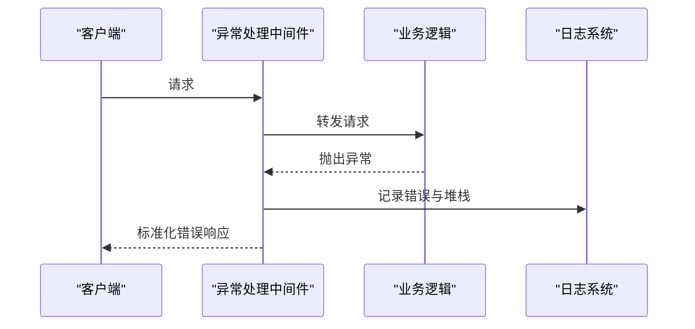
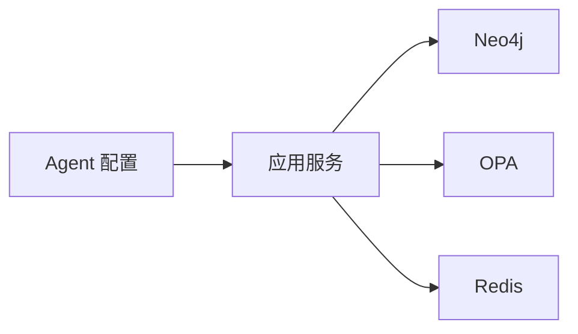

# 故障排除

<cite>
**本文引用的文件**
- [README.md](file://README.md)
- [main.py](file://main.py)
- [odap/web/app.py](file://odap/web/app.py)
- [odap/infra/logging/structured_logging.py](file://odap/infra/logging/structured_logging.py)
- [odap/infra/monitoring/performance_monitor.py](file://odap/infra/monitoring/performance_monitor.py)
- [odap/infra/resilience/health_monitor.py](file://odap/infra/resilience/health_monitor.py)
- [odap/infra/resilience/fault_tolerance.py](file://odap/infra/resilience/fault_tolerance.py)
- [odap/infra/security/audit_logger.py](file://odap/infra/security/audit_logger.py)
- [odap/infra/middleware/exception_handler.py](file://odap/infra/middleware/exception_handler.py)
- [docker/docker-compose.yml](file://docker/docker-compose.yml)
- [config/agent_config.yaml](file://config/agent_config.yaml)
</cite>

## 目录
1. [简介](#简介)
2. [项目结构](#项目结构)
3. [核心组件](#核心组件)
4. [架构总览](#架构总览)
5. [详细组件分析](#详细组件分析)
6. [依赖分析](#依赖分析)
7. [性能考虑](#性能考虑)
8. [故障排除指南](#故障排除指南)
9. [结论](#结论)
10. [附录](#附录)

## 简介
本指南面向 ODAP（本体驱动分析与决策平台）运维与开发人员，聚焦于常见故障的诊断与解决，覆盖服务启动失败、数据库连接异常、性能瓶颈、内存泄漏、健康检查失败、网络连接问题、权限配置问题、依赖服务异常等场景。同时提供日志分析技巧、错误定位方法、系统性能调优建议以及故障恢复与应急响应流程。

## 项目结构
ODAP 采用模块化分层架构：后端基于 FastAPI，前端基于 React，核心能力包括统一查询服务、本体管理、Agent 协同、策略治理（OPA）、安全审计、韧性系统与性能监控。系统通过 Docker Compose 编排多个服务，包含应用、前端、Neo4j、OPA、Redis 等。

**图表来源**
- [docker/docker-compose.yml:1-97](file://docker/docker-compose.yml#L1-L97)

**章节来源**
- [README.md:1-241](file://README.md#L1-L241)
- [docker/docker-compose.yml:1-97](file://docker/docker-compose.yml#L1-L97)

## 核心组件
- Web 应用与路由：FastAPI 应用负责注册各业务路由、CORS、异常处理与健康检查端点。
- 日志系统：结构化日志记录器，支持时序数据库落盘与内存回退。
- 性能监控：统一的性能指标采集与统计，支持 LLM 调用、数据库查询、API 请求、工具执行等维度。
- 健康监控：Swarm 组件健康度量与告警，支持降级与恢复策略。
- 故障恢复：断路器模式、故障分类与自动恢复策略。
- 审计日志：统一审计通道，支持 SQLite 与异步写入。
- 异常处理：全局中间件统一捕获未处理异常，输出标准化错误响应。

**章节来源**
- [odap/web/app.py:1-262](file://odap/web/app.py#L1-L262)
- [odap/infra/logging/structured_logging.py:1-403](file://odap/infra/logging/structured_logging.py#L1-L403)
- [odap/infra/monitoring/performance_monitor.py:1-184](file://odap/infra/monitoring/performance_monitor.py#L1-L184)
- [odap/infra/resilience/health_monitor.py:1-216](file://odap/infra/resilience/health_monitor.py#L1-L216)
- [odap/infra/resilience/fault_tolerance.py:1-309](file://odap/infra/resilience/fault_tolerance.py#L1-L309)
- [odap/infra/security/audit_logger.py:1-378](file://odap/infra/security/audit_logger.py#L1-L378)
- [odap/infra/middleware/exception_handler.py:1-137](file://odap/infra/middleware/exception_handler.py#L1-L137)

## 架构总览
ODAP 的健康检查与监控贯穿应用生命周期，启动时进行默认工作空间与场景初始化，运行时暴露 /health 端点，集成 OpenHarness v1/v2 状态，并提供性能监控端点。

**图表来源**
- [odap/web/app.py:221-242](file://odap/web/app.py#L221-L242)

**章节来源**
- [odap/web/app.py:68-120](file://odap/web/app.py#L68-L120)
- [odap/web/app.py:221-242](file://odap/web/app.py#L221-L242)

## 详细组件分析

### 健康监控与故障恢复
- 健康监控器周期性检查 Swarm 组件状态，记录指标并生成告警；支持获取健康报告与最近指标。
- 故障恢复管理器对不同故障类型（超时、OPA 拒绝、图谱不可用、网络错误、工具执行错误、意外异常）实施断路器与恢复策略（重试、升级、缓存回退、替代工具、重启、降级模式）。

**图表来源**
- [odap/infra/resilience/health_monitor.py:90-148](file://odap/infra/resilience/health_monitor.py#L90-L148)
- [odap/infra/resilience/fault_tolerance.py:69-100](file://odap/infra/resilience/fault_tolerance.py#L69-L100)

**章节来源**
- [odap/infra/resilience/health_monitor.py:1-216](file://odap/infra/resilience/health_monitor.py#L1-L216)
- [odap/infra/resilience/fault_tolerance.py:1-309](file://odap/infra/resilience/fault_tolerance.py#L1-L309)

### 性能监控与指标统计
- 性能监控器支持四类指标：LLM 调用、数据库查询、API 请求、工具执行；提供均值、中位数、最小/最大、P95/P99 等统计。
- 提供装饰器与手动 start/stop 接口，便于在关键路径埋点。

**图表来源**
- [odap/infra/monitoring/performance_monitor.py:30-140](file://odap/infra/monitoring/performance_monitor.py#L30-L140)

**章节来源**
- [odap/infra/monitoring/performance_monitor.py:1-184](file://odap/infra/monitoring/performance_monitor.py#L1-L184)

### 结构化日志与审计
- 结构化日志系统支持多种后端（InfluxDB/TimescaleDB/内存），记录 trace/span、工作空间、用户、实体、操作、耗时、元数据与错误信息。
- 审计日志系统提供异步/同步写入、批量写入、查询与统计接口，支持 SQLite 通道与多通道输出。

**图表来源**
- [odap/infra/logging/structured_logging.py:287-403](file://odap/infra/logging/structured_logging.py#L287-L403)
- [odap/infra/security/audit_logger.py:19-270](file://odap/infra/security/audit_logger.py#L19-L270)

**章节来源**
- [odap/infra/logging/structured_logging.py:1-403](file://odap/infra/logging/structured_logging.py#L1-L403)
- [odap/infra/security/audit_logger.py:1-378](file://odap/infra/security/audit_logger.py#L1-L378)

### 全局异常处理与错误定位
- 全局中间件捕获未处理异常，区分验证错误、权限错误与服务器内部错误，统一输出标准化响应，并记录请求 ID 与堆栈信息。
- 建议结合审计日志与结构化日志定位问题根因。

**图表来源**
- [odap/infra/middleware/exception_handler.py:14-68](file://odap/infra/middleware/exception_handler.py#L14-L68)

**章节来源**
- [odap/infra/middleware/exception_handler.py:1-137](file://odap/infra/middleware/exception_handler.py#L1-L137)

## 依赖分析
- 应用服务依赖 Neo4j（图谱）、OPA（策略）、Redis（缓存），并通过健康检查端点对外暴露状态。
- Agent 配置文件提供 LLM 提供商与模型参数，影响性能与可用性。

**图表来源**
- [docker/docker-compose.yml:11-22](file://docker/docker-compose.yml#L11-L22)
- [config/agent_config.yaml:1-23](file://config/agent_config.yaml#L1-L23)

**章节来源**
- [docker/docker-compose.yml:1-97](file://docker/docker-compose.yml#L1-L97)
- [config/agent_config.yaml:1-23](file://config/agent_config.yaml#L1-L23)

## 性能考虑
- 使用性能监控器在关键路径埋点，定期导出指标并分析 P95/P99 耗时。
- 对 LLM 调用、数据库查询、工具执行进行分类统计，识别热点与瓶颈。
- 在高并发场景下，合理配置断路器阈值与重试策略，避免雪崩效应。

[本节为通用指导，无需“章节来源”]

## 故障排除指南

### 服务启动失败
- 症状：容器无法启动、端口占用、依赖服务未就绪。
- 排查步骤：
  - 检查容器日志：使用 compose 健康检查与日志命令定位启动失败原因。
  - 确认环境变量与挂载卷：核对 .env.docker 与 docker-compose 中的环境变量。
  - 依赖服务状态：确认 Neo4j、OPA、Redis 是否正常启动。
- 解决方案：
  - 修复配置文件中的连接参数与凭据。
  - 调整健康检查间隔与超时，确保依赖服务有足够启动时间。
  - 如需本地开发，参考 README 的本地启动方式，逐项验证端口与依赖。

**章节来源**
- [docker/docker-compose.yml:28-34](file://docker/docker-compose.yml#L28-L34)
- [README.md:139-173](file://README.md#L139-L173)

### 数据库连接异常（Neo4j）
- 症状：健康检查失败、图谱查询超时、写入失败。
- 排查步骤：
  - 检查 Neo4j 容器日志与端口映射（7474/7687）。
  - 核对应用侧连接字符串、认证信息与网络连通性。
  - 使用健康检查端点查看图谱状态（mode/connected/use_fallback）。
- 解决方案：
  - 修正连接参数与凭据，确保网络互通。
  - 在故障恢复模块中启用缓存回退策略，降低对图谱的强依赖。

**章节来源**
- [odap/web/app.py:227-234](file://odap/web/app.py#L227-L234)
- [odap/infra/resilience/fault_tolerance.py:153-165](file://odap/infra/resilience/fault_tolerance.py#L153-L165)

### 性能瓶颈与内存泄漏
- 症状：接口响应缓慢、CPU/内存持续增长、工具执行耗时异常。
- 排查步骤：
  - 通过性能监控端点获取各类指标统计，关注 P95/P99。
  - 结合结构化日志与审计日志，定位耗时操作与异常错误。
  - 使用装饰器或手动埋点，标记关键路径。
- 解决方案：
  - 优化热点逻辑，减少不必要的工具调用与数据库查询。
  - 合理设置断路器与重试策略，避免级联故障。
  - 对长时间运行的任务进行拆分与异步化。

**章节来源**
- [odap/web/app.py:244-261](file://odap/web/app.py#L244-L261)
- [odap/infra/monitoring/performance_monitor.py:107-140](file://odap/infra/monitoring/performance_monitor.py#L107-L140)
- [odap/infra/logging/structured_logging.py:163-195](file://odap/infra/logging/structured_logging.py#L163-L195)

### 健康检查失败
- 症状：/health 返回非 healthy 或字段缺失。
- 排查步骤：
  - 检查 OpenHarness v1/v2 初始化状态与可用工具数量。
  - 核对图谱状态（core 安装、模式、连接、回退）。
  - 查看健康监控器的最近指标与告警。
- 解决方案：
  - 修复 OpenHarness 初始化超时或失败问题。
  - 通过降级模式维持基本功能，逐步恢复依赖服务。

**章节来源**
- [odap/web/app.py:221-242](file://odap/web/app.py#L221-L242)
- [odap/infra/resilience/health_monitor.py:175-197](file://odap/infra/resilience/health_monitor.py#L175-L197)

### 网络连接问题
- 症状：跨服务通信失败、域名解析错误、CORS 阻断。
- 排查步骤：
  - 检查容器网络与端口映射，确认服务间可达。
  - 核对 CORS 配置与允许来源列表。
  - 使用健康检查端点验证服务可达性。
- 解决方案：
  - 修正网络配置与防火墙规则。
  - 更新 CORS 允许来源，确保前端与后端域名一致。

**章节来源**
- [docker/docker-compose.yml:18-46](file://docker/docker-compose.yml#L18-L46)
- [odap/web/app.py:129-139](file://odap/web/app.py#L129-L139)

### 权限配置问题（OPA）
- 症状：写操作被拒绝、策略拦截导致失败。
- 排查步骤：
  - 检查 OPA 服务状态与策略加载情况。
  - 查看审计日志中的权限相关事件。
  - 确认角色与工作空间权限配置。
- 解决方案：
  - 调整策略规则或提升角色权限。
  - 在故障恢复模块中采用“升级到指挥官”的策略，必要时降级处理。

**章节来源**
- [docker/docker-compose.yml:65-75](file://docker/docker-compose.yml#L65-L75)
- [odap/infra/resilience/fault_tolerance.py:141-151](file://odap/infra/resilience/fault_tolerance.py#L141-L151)

### 依赖服务异常（Redis/OPA/前端）
- 症状：缓存不可用、策略服务异常、前端静态资源加载失败。
- 排查步骤：
  - 检查 Redis/OPA 容器日志与端口映射。
  - 确认前端构建产物与静态服务配置。
- 解决方案：
  - 重启异常服务或重建镜像。
  - 校验缓存连接参数与 OPA 策略路径。

**章节来源**
- [docker/docker-compose.yml:48-97](file://docker/docker-compose.yml#L48-L97)

### 故障恢复与应急响应流程
- 标准流程：
  - 快速定位：结合健康检查、性能监控与日志系统确定故障范围。
  - 降级策略：启用断路器与缓存回退，维持基本功能。
  - 恢复执行：修复依赖服务、调整配置、重试失败任务。
  - 复盘总结：通过审计日志与结构化日志分析根因，完善监控与告警。
- 应急预案：
  - 服务不可用：优先启用降级模式，保障只读能力。
  - 性能骤降：限制并发、启用断路器、清理缓存。
  - 权限异常：临时放宽策略或提升角色，快速恢复业务。

**章节来源**
- [odap/infra/resilience/health_monitor.py:46-76](file://odap/infra/resilience/health_monitor.py#L46-L76)
- [odap/infra/resilience/fault_tolerance.py:236-276](file://odap/infra/resilience/fault_tolerance.py#L236-L276)

## 结论
通过健康监控、性能监控、结构化日志与审计日志的协同，ODAP 能够快速定位与恢复各类故障。建议在生产环境中启用断路器与降级策略，完善监控告警与应急预案，持续优化关键路径性能，确保系统稳定与可维护性。

[本节为总结，无需“章节来源”]

## 附录

### 常用命令与端点
- 启动与管理：参考 README 的 Docker 一键命令与本地开发方式。
- 健康检查：访问 /health 获取系统整体状态。
- 性能监控：/api/v1/monitoring/performance 与 /api/v1/monitoring/performance/reset。

**章节来源**
- [README.md:139-173](file://README.md#L139-L173)
- [odap/web/app.py:221-242](file://odap/web/app.py#L221-L242)
- [odap/web/app.py:244-259](file://odap/web/app.py#L244-L259)