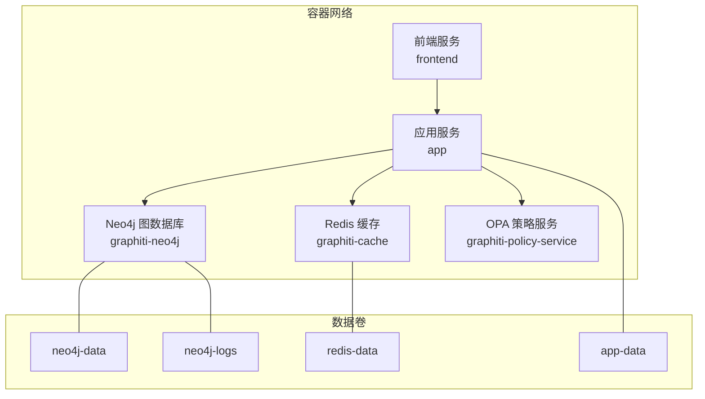
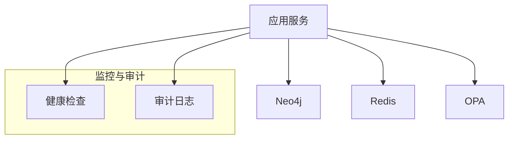
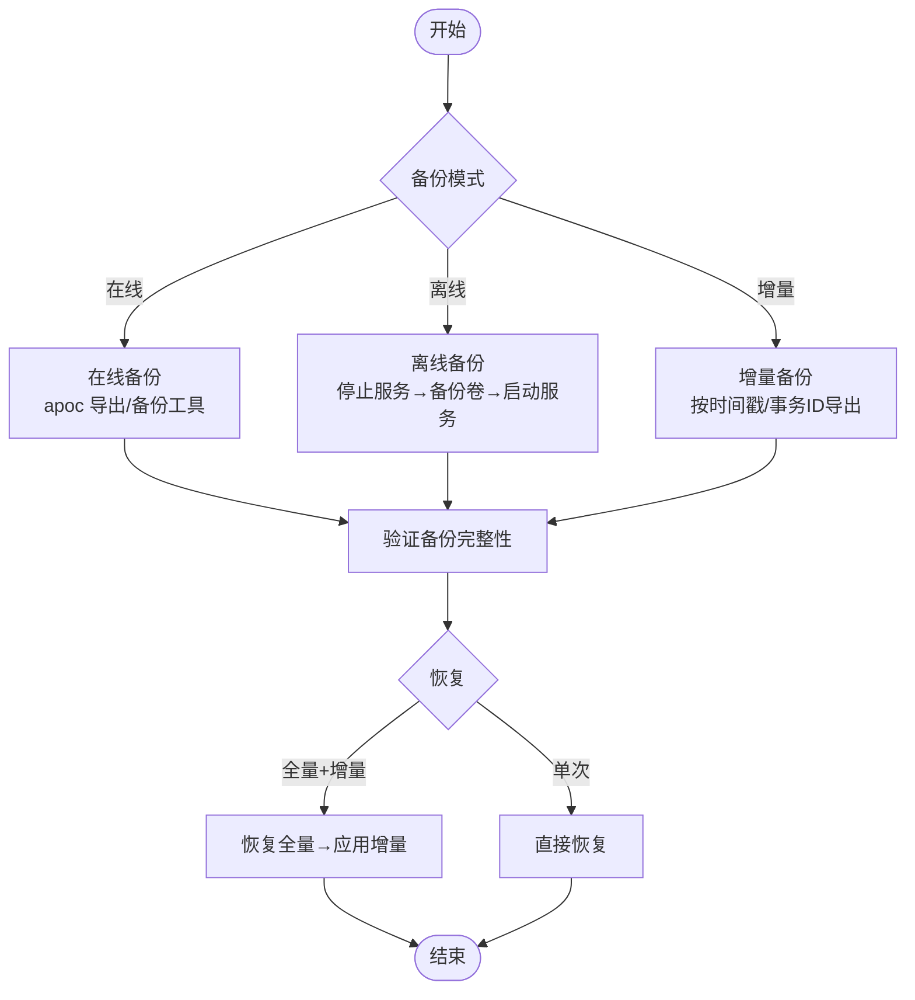
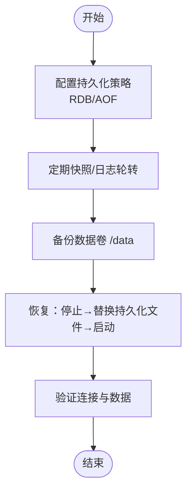
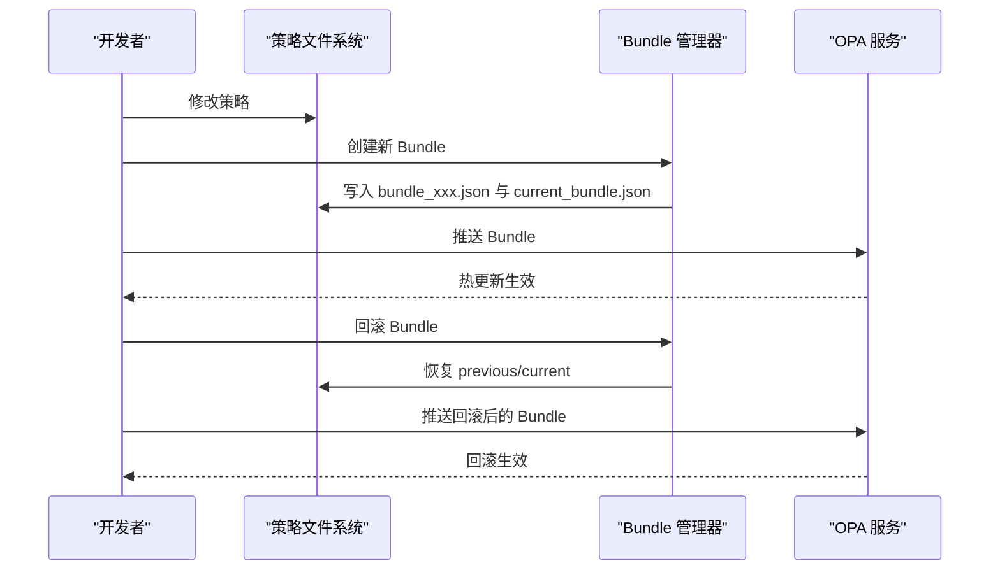
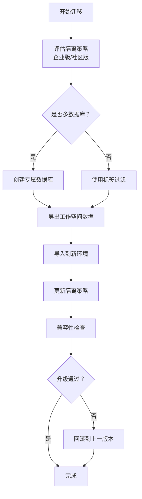
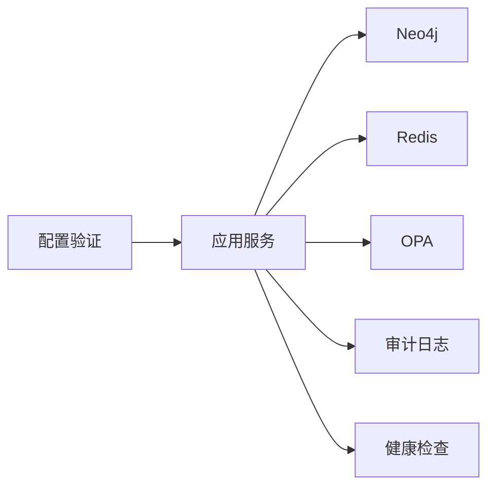
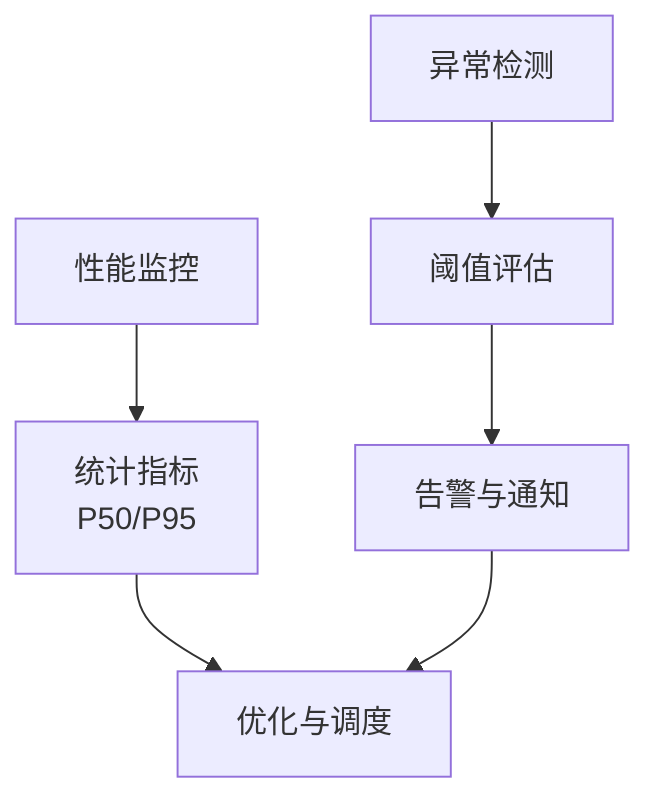
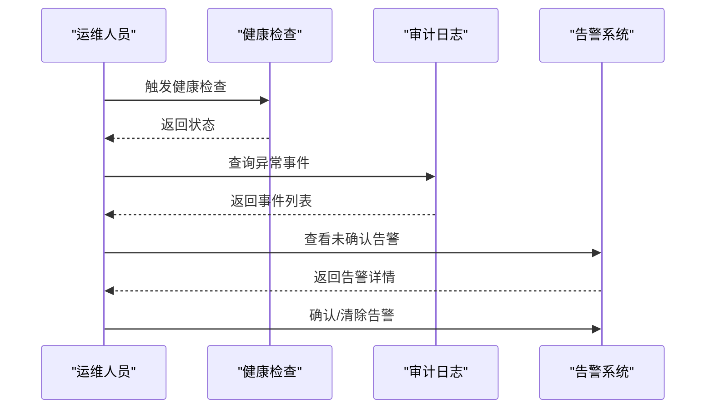

# 数据库备份

<cite>
**本文引用的文件**
- [docker-compose.yml](file://docker/docker-compose.yml)
- [opa_service.py](file://odap/infra/opa/opa_service.py)
- [config.py](file://odap/infra/security/config.py)
- [AUDIT.md](file://docs/03-modules/audit_log/GRAPHITI_INTEGRATION.md)
- [ARCHITECTURE.md](file://docs/02-architecture/ARCHITECTURE.md)
- [ADR-041.md](file://docs/07-adr/ADR-041_workspace_resource_isolation.md)
- [performance_monitor.py](file://odap/infra/monitoring/performance_monitor.py)
- [anomaly_detector.py](file://docs/02-architecture/ARCHITECTURE_FULL_CHAIN_DEEP.md)
- [test_hook_system.py](file://tests/unit/test_hook_system.py)
</cite>

## 目录
1. [简介](#简介)
2. [项目结构](#项目结构)
3. [核心组件](#核心组件)
4. [架构总览](#架构总览)
5. [详细组件分析](#详细组件分析)
6. [依赖分析](#依赖分析)
7. [性能考量](#性能考量)
8. [故障排查指南](#故障排查指南)
9. [结论](#结论)
10. [附录](#附录)

## 简介
本文件面向 ODAP 平台的数据库备份与恢复，聚焦以下目标：
- 明确 Neo4j 图数据库的在线/离线/增量备份策略与恢复流程
- 解释 Redis 缓存的数据持久化与备份方法
- 说明 OPA 策略文件的版本管理与备份恢复
- 提供数据库迁移与升级的完整流程（含数据格式转换、兼容性检查、回滚策略）
- 给出备份验证、恢复测试、灾难恢复演练的方法
- 提供自动化备份脚本与监控告警配置思路

## 项目结构
ODAP 在容器编排中使用 Neo4j、Redis、OPA 服务，并通过应用服务访问这些后端。关键服务与卷挂载如下：
- Neo4j：数据卷与日志卷分离，便于备份与恢复
- Redis：数据卷持久化，支持 RDB/AOF 策略（由镜像默认行为决定）
- OPA：策略文件挂载至 /policies，支持热更新与版本管理

**图表来源**
- [docker-compose.yml:1-97](file://docker/docker-compose.yml#L1-L97)

**章节来源**
- [docker-compose.yml:1-97](file://docker/docker-compose.yml#L1-L97)

## 核心组件
- Neo4j 图数据库：提供图数据存储与查询能力，支持在线备份与离线备份
- Redis 缓存：提供高性能读写与会话存储，结合持久化策略实现数据保护
- OPA 策略服务：提供策略热更新与版本管理，支持 Bundle 管理与回滚

**章节来源**
- [docker-compose.yml:48-86](file://docker/docker-compose.yml#L48-L86)
- [opa_service.py:227-314](file://odap/infra/opa/opa_service.py#L227-L314)

## 架构总览
ODAP 的数据库与缓存组件通过容器编排统一管理，应用服务通过环境变量与服务名访问各后端。审计日志与健康检查贯穿系统，便于监控与故障定位。

**图表来源**
- [docker-compose.yml:28-33](file://docker/docker-compose.yml#L28-L33)
- [AUDIT.md:367-406](file://docs/03-modules/audit_log/GRAPHITI_INTEGRATION.md#L367-L406)

**章节来源**
- [docker-compose.yml:28-33](file://docker/docker-compose.yml#L28-L33)
- [AUDIT.md:367-406](file://docs/03-modules/audit_log/GRAPHITI_INTEGRATION.md#L367-L406)

## 详细组件分析

### Neo4j 图数据库备份与恢复
- 在线备份
  - 使用 Neo4j 内置的备份工具或 apoc 库导出工作空间隔离的数据
  - 建议在低峰时段执行，避免写入高峰
  - 备份文件应包含图数据与索引元数据
- 离线备份
  - 停止应用与写入，进入容器停止 Neo4j，备份数据卷与日志卷
  - 恢复时先还原数据卷，再启动 Neo4j，最后启动应用
- 增量备份
  - 基于时间戳或事务 ID 的增量导出，结合工作空间隔离策略选择性备份
  - 恢复时先恢复全量，再按顺序应用增量

**章节来源**
- [ADR-041.md:35-80](file://docs/07-adr/ADR-041_workspace_resource_isolation.md#L35-L80)
- [docker-compose.yml:48-63](file://docker/docker-compose.yml#L48-L63)

### Redis 缓存持久化与备份
- 持久化策略
  - 使用 RDB 快照或 AOF 日志，结合镜像默认配置
  - 生产建议开启 AOF 以降低数据丢失风险
- 备份方法
  - 备份数据卷（/data），包含持久化文件
  - 通过命令导出当前状态（谨慎使用，避免阻塞）
- 恢复流程
  - 停止 Redis，替换持久化文件，启动服务，验证连接

**章节来源**
- [docker-compose.yml:77-86](file://docker/docker-compose.yml#L77-L86)

### OPA 策略文件版本管理与备份
- 版本管理
  - 使用 Bundle 管理器创建版本与历史，支持热更新与回滚
  - Bundle 包含版本号、校验和与策略集合
- 备份与恢复
  - 备份策略文件与 current_bundle.json
  - 恢复时先恢复策略文件，再恢复 Bundle 历史，最后回滚到目标版本

**图表来源**
- [opa_service.py:227-314](file://odap/infra/opa/opa_service.py#L227-L314)
- [opa_service.py:452-717](file://odap/infra/opa/opa_service.py#L452-L717)

**章节来源**
- [opa_service.py:227-314](file://odap/infra/opa/opa_service.py#L227-L314)
- [opa_service.py:452-717](file://odap/infra/opa/opa_service.py#L452-L717)

### 数据库迁移与升级流程
- 迁移策略
  - 采用“混合隔离”：企业版优先多数据库隔离，社区版回退标签过滤
  - 切换时自动迁移：创建专属数据库、导出导入、更新隔离策略
- 升级流程
  - 兼容性检查：核对工作空间隔离、策略路径前缀、依赖版本
  - 数据格式转换：根据工作空间维度进行数据映射与转换
  - 回滚策略：保留上一版本配置与数据，快速回退

**章节来源**
- [ADR-041.md:35-80](file://docs/07-adr/ADR-041_workspace_resource_isolation.md#L35-L80)

## 依赖分析
- 应用服务依赖 Neo4j、Redis、OPA 服务
- 审计日志与健康检查贯穿系统，便于监控与故障定位
- 配置验证确保关键密钥与参数有效

**图表来源**
- [docker-compose.yml:1-97](file://docker/docker-compose.yml#L1-L97)
- [AUDIT.md:367-406](file://docs/03-modules/audit_log/GRAPHITI_INTEGRATION.md#L367-L406)
- [config.py:55-79](file://odap/infra/security/config.py#L55-L79)

**章节来源**
- [docker-compose.yml:1-97](file://docker/docker-compose.yml#L1-L97)
- [AUDIT.md:367-406](file://docs/03-modules/audit_log/GRAPHITI_INTEGRATION.md#L367-L406)
- [config.py:55-79](file://odap/infra/security/config.py#L55-L79)

## 性能考量
- 性能监控：提供 P50/P95 等指标统计，便于识别瓶颈
- 异常检测：基于阈值的异常检测与告警，支持关键指标的持续监控
- 建议：备份与恢复操作安排在低峰时段，避免影响在线服务

**图表来源**
- [performance_monitor.py:63-116](file://odap/infra/monitoring/performance_monitor.py#L63-L116)
- [anomaly_detector.py:4763-4883](file://docs/02-architecture/ARCHITECTURE_FULL_CHAIN_DEEP.md#L4763-L4883)

**章节来源**
- [performance_monitor.py:63-116](file://odap/infra/monitoring/performance_monitor.py#L63-L116)
- [anomaly_detector.py:4763-4883](file://docs/02-architecture/ARCHITECTURE_FULL_CHAIN_DEEP.md#L4763-L4883)

## 故障排查指南
- 健康检查
  - 应用服务健康检查通过后方可进行备份与恢复
- 审计日志
  - 通过审计日志定位异常与失败原因
- 告警与确认
  - 使用告警系统记录与确认异常，必要时清除告警并复盘

**图表来源**
- [docker-compose.yml:28-33](file://docker/docker-compose.yml#L28-L33)
- [AUDIT.md:367-406](file://docs/03-modules/audit_log/GRAPHITI_INTEGRATION.md#L367-L406)
- [test_hook_system.py:470-507](file://tests/unit/test_hook_system.py#L470-L507)

**章节来源**
- [docker-compose.yml:28-33](file://docker/docker-compose.yml#L28-L33)
- [AUDIT.md:367-406](file://docs/03-modules/audit_log/GRAPHITI_INTEGRATION.md#L367-L406)
- [test_hook_system.py:470-507](file://tests/unit/test_hook_system.py#L470-L507)

## 结论
- 通过容器编排与独立数据卷，Neo4j 与 Redis 的备份与恢复具备良好可操作性
- OPA 的 Bundle 管理提供了完善的版本控制与回滚能力
- 建议将备份与恢复纳入自动化流程，并结合性能监控与异常检测，确保在低峰时段执行并及时验证

## 附录
- 自动化备份脚本建议
  - Neo4j：使用 apoc 导出或容器内备份命令，结合定时任务与校验
  - Redis：备份 /data 卷，记录快照时间戳与校验和
  - OPA：备份策略文件与 current_bundle.json，记录版本与校验和
- 监控告警配置
  - 健康检查：应用服务健康端点
  - 异常检测：关键指标阈值与告警通道
  - 告警确认：提供告警确认与清除接口，便于故障闭环