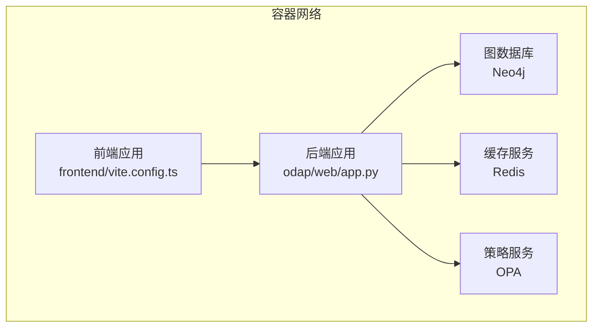
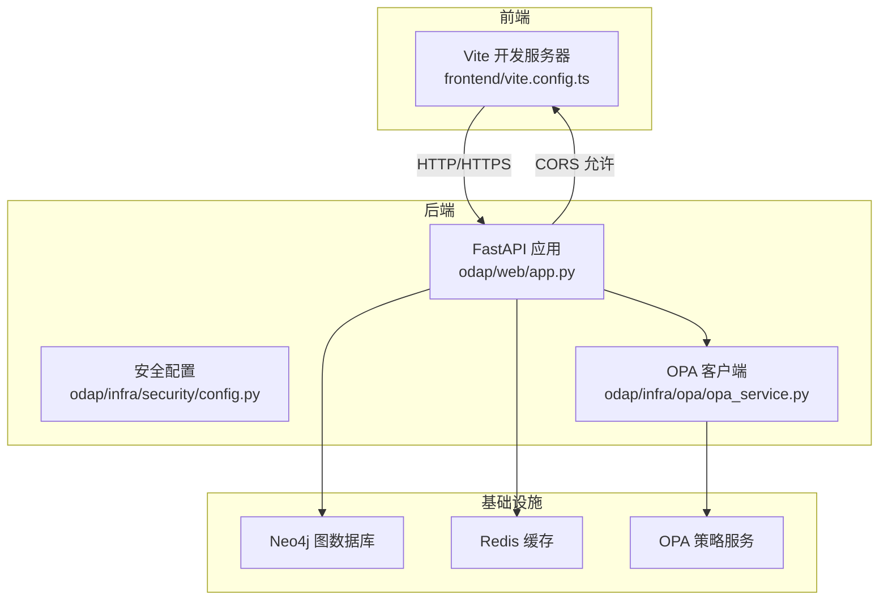
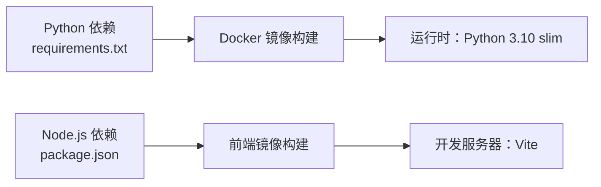

# 环境配置

<cite>
**本文引用的文件**
- [docker-compose.yml](file://docker/docker-compose.yml)
- [docker-compose.override.yml](file://docker/docker-compose.override.yml)
- [Dockerfile](file://docker/Dockerfile)
- [Dockerfile.dev](file://docker/Dockerfile.dev)
- [requirements.txt](file://requirements.txt)
- [pyproject.toml](file://pyproject.toml)
- [odap/web/app.py](file://odap/web/app.py)
- [odap/infra/security/config.py](file://odap/infra/security/config.py)
- [odap/infra/opa/opa_service.py](file://odap/infra/opa/opa_service.py)
- [frontend/package.json](file://frontend/package.json)
- [frontend/vite.config.ts](file://frontend/vite.config.ts)
- [main.py](file://main.py)
</cite>

## 目录
1. [简介](#简介)
2. [项目结构](#项目结构)
3. [核心组件](#核心组件)
4. [架构总览](#架构总览)
5. [详细组件分析](#详细组件分析)
6. [依赖分析](#依赖分析)
7. [性能考虑](#性能考虑)
8. [故障排除指南](#故障排除指南)
9. [结论](#结论)
10. [附录](#附录)

## 简介
本文件面向ODAP平台的环境配置，覆盖开发与生产环境的准备、Python与Node.js依赖安装、数据库与缓存连接、OPA策略服务集成、CORS跨域配置、环境变量优先级与覆盖规则、部署模板与示例、自动化脚本与初始化步骤、以及配置验证与故障排除方法。内容以仓库中的实际配置文件与代码为依据，帮助读者快速搭建稳定可靠的运行环境。

## 项目结构
ODAP平台由后端FastAPI应用、前端React应用、Neo4j图数据库、Redis缓存、OpenPolicyAgent策略服务组成，并通过Docker Compose进行容器化编排。开发与生产环境通过不同的Compose配置与Docker镜像实现隔离与差异化行为。

**图表来源**
- [docker-compose.yml:1-97](file://docker/docker-compose.yml#L1-L97)
- [odap/web/app.py:122-191](file://odap/web/app.py#L122-L191)

**章节来源**
- [docker-compose.yml:1-97](file://docker/docker-compose.yml#L1-L97)
- [docker-compose.override.yml:1-73](file://docker/docker-compose.override.yml#L1-L73)
- [Dockerfile:1-34](file://docker/Dockerfile#L1-L34)
- [Dockerfile.dev:1-34](file://docker/Dockerfile.dev#L1-L34)

## 核心组件
- 后端Web应用：基于FastAPI，负责API路由、CORS配置、健康检查、性能监控等。
- 安全与配置：集中读取环境变量，提供Neo4j、Redis、JWT、CORS等配置。
- OPA权限管理：封装OPA客户端，支持ABAC策略评估、策略热更新、缓存与沙箱。
- 前端应用：基于Vite+React，通过代理访问后端API。
- 容器编排：Docker Compose定义服务、网络、卷与健康检查。

**章节来源**
- [odap/web/app.py:122-191](file://odap/web/app.py#L122-L191)
- [odap/infra/security/config.py:29-79](file://odap/infra/security/config.py#L29-L79)
- [odap/infra/opa/opa_service.py:373-450](file://odap/infra/opa/opa_service.py#L373-L450)
- [frontend/vite.config.ts:10-45](file://frontend/vite.config.ts#L10-L45)

## 架构总览
下图展示了ODAP平台在容器化环境中的组件交互与数据流向，包括CORS设置、数据库与缓存连接、OPA策略服务集成，以及前端代理到后端API的路径。

**图表来源**
- [odap/web/app.py:129-139](file://odap/web/app.py#L129-L139)
- [odap/infra/security/config.py:37-48](file://odap/infra/security/config.py#L37-L48)
- [odap/infra/opa/opa_service.py:378-450](file://odap/infra/opa/opa_service.py#L378-L450)
- [docker-compose.yml:13-18](file://docker/docker-compose.yml#L13-L18)

## 详细组件分析

### Python后端环境与依赖
- 运行时与容器镜像
  - 生产镜像：基于自定义Python基础镜像，预装FastAPI、Uvicorn、Neo4j、Redis、OPA客户端等核心依赖。
  - 开发镜像：在生产镜像基础上增加文件监控工具，支持热重载。
- 依赖安装
  - 通过requirements.txt声明核心依赖，Dockerfile中显式安装FastAPI、Uvicorn、Neo4j、Redis、OPA客户端、OpenAI、Pydantic、HTTPX等。
  - pytest系列测试依赖仅在开发/CI环境中使用。
- 环境变量
  - 通过odap/infra/security/config.py集中读取环境变量，包括LLM、Neo4j、JWT、CORS、日志级别等。
  - 在odap/web/app.py中读取CORS_ORIGINS并配置CORSMiddleware。
- 健康检查
  - Docker Compose定义健康检查，调用后端/health端点验证服务可用性。

**章节来源**
- [Dockerfile:1-34](file://docker/Dockerfile#L1-L34)
- [Dockerfile.dev:1-34](file://docker/Dockerfile.dev#L1-L34)
- [requirements.txt:1-48](file://requirements.txt#L1-L48)
- [odap/infra/security/config.py:29-79](file://odap/infra/security/config.py#L29-L79)
- [odap/web/app.py:129-139](file://odap/web/app.py#L129-L139)
- [docker/docker-compose.yml:28-33](file://docker/docker-compose.yml#L28-L33)

### Node.js前端环境与代理
- 依赖与构建
  - package.json声明React、Ant Design、OpenHarness React组件、Vite等依赖。
- 开发代理
  - Vite配置PROXY_TARGET或VITE_API_BASE，将/api与/health代理至后端应用，便于前后端联调。
- 开发与生产差异
  - 开发覆盖文件中为前端服务挂载源码卷并暴露5173端口，生产环境通过Nginx反向代理对外提供服务。

**章节来源**
- [frontend/package.json:1-55](file://frontend/package.json#L1-L55)
- [frontend/vite.config.ts:10-45](file://frontend/vite.config.ts#L10-L45)
- [docker-compose.override.yml:44-72](file://docker/docker-compose.override.yml#L44-L72)

### 数据库与缓存连接
- Neo4j
  - 通过NEO4J_URI、NEO4J_USER、NEO4J_PASSWORD配置连接参数；Compose中提供默认凭据与内存参数。
- Redis
  - 通过REDIS_URL配置连接；Compose中提供默认端口与数据卷。
- 连接字符串与驱动
  - Python侧使用neo4j与redis客户端库；Dockerfile中明确安装对应依赖。

**章节来源**
- [odap/infra/security/config.py:37-40](file://odap/infra/security/config.py#L37-L40)
- [docker-compose.yml:13-18](file://docker/docker-compose.yml#L13-L18)
- [docker/Dockerfile:18-21](file://docker/Dockerfile#L18-L21)

### OPA策略服务集成
- OPA服务地址
  - 通过OPA_URL配置，默认指向本地策略服务容器。
- 客户端封装
  - OPAClient封装REST调用，支持权限检查、批量检查、策略上传/删除、健康检查。
- 策略加载与回退
  - 若OPA不可达，OPAManager自动降级为Mock模式，保证系统可用性。
- 策略热更新与沙箱
  - 支持策略Bundle热更新、版本管理、回滚与What-If沙箱模拟。

**章节来源**
- [odap/infra/opa/opa_service.py:378-450](file://odap/infra/opa/opa_service.py#L378-L450)
- [odap/infra/opa/opa_service.py:482-500](file://odap/infra/opa/opa_service.py#L482-L500)
- [docker-compose.yml](file://docker/docker-compose.yml#L16)

### CORS跨域配置
- 后端CORS
  - 从CORS_ORIGINS读取允许的源列表，配置FastAPI的CORSMiddleware。
- 前端代理
  - Vite代理将/api与/health转发至后端，避免浏览器跨域限制。
- 开发覆盖
  - 开发Compose覆盖中提供常见前端开发域名与端口，便于本地联调。

**章节来源**
- [odap/web/app.py:129-139](file://odap/web/app.py#L129-L139)
- [frontend/vite.config.ts:23-43](file://frontend/vite.config.ts#L23-L43)
- [docker-compose.override.yml:66-69](file://docker/docker-compose.override.yml#L66-L69)

### 环境变量与配置优先级
- 环境变量来源与顺序
  - Docker环境：优先加载.env.docker，覆盖默认值。
  - 本地环境：优先加载.env.local，再加载.env。
- 关键变量
  - IN_DOCKER、ENVIRONMENT、NEO4J_*、OPA_URL、REDIS_URL、CORS_ORIGINS、JWT_*、LOG_LEVEL等。
- 验证与告警
  - 安全配置模块在加载后进行有效性验证，对敏感默认值给出告警提示。

**章节来源**
- [odap/infra/security/config.py:9-26](file://odap/infra/security/config.py#L9-L26)
- [odap/infra/security/config.py:54-79](file://odap/infra/security/config.py#L54-L79)
- [docker-compose.yml:9-18](file://docker/docker-compose.yml#L9-L18)
- [docker-compose.override.yml:12-22](file://docker/docker-compose.override.yml#L12-L22)

### 部署场景与配置模板
- 开发环境
  - 使用docker-compose.override.yml启用开发镜像与源码挂载，前端暴露5173端口，后端启用reload。
  - 前端代理目标通过PROXY_TARGET或VITE_API_BASE配置。
- 生产环境
  - 使用默认docker-compose.yml，后端以多worker方式运行，健康检查验证/health端点。
  - 前端通过Nginx反向代理对外提供服务（Compose中未直接暴露前端端口，需结合反向代理）。
- 数据持久化
  - Neo4j、Redis、应用数据均通过命名卷持久化，避免容器重建丢失数据。

**章节来源**
- [docker-compose.override.yml:1-73](file://docker/docker-compose.override.yml#L1-L73)
- [docker-compose.yml:1-97](file://docker/docker-compose.yml#L1-L97)
- [Dockerfile](file://docker/Dockerfile#L33)
- [Dockerfile.dev](file://docker/Dockerfile.dev#L33)

### 配置验证与初始化步骤
- 健康检查
  - 后端提供/health端点，返回系统关键组件状态（OpenHarness、Graphiti、OPA等）。
  - Docker Compose定义健康检查命令，定时探测/health。
- 初始化流程
  - 应用启动时自动创建默认工作空间与场景，便于首次体验。
- 配置验证
  - 安全配置模块在加载后输出关键配置项的验证结果与告警。

**章节来源**
- [odap/web/app.py:221-242](file://odap/web/app.py#L221-L242)
- [docker/docker-compose.yml:28-33](file://docker/docker-compose.yml#L28-L33)
- [odap/web/app.py:88-116](file://odap/web/app.py#L88-L116)
- [odap/infra/security/config.py:54-79](file://odap/infra/security/config.py#L54-L79)

## 依赖分析
- Python依赖
  - 核心：FastAPI、Uvicorn、Pydantic、HTTPX、Redis、Neo4j、OPA客户端、OpenAI、AIOHTTP等。
  - 开发：pytest系列、黑、flake8等。
- Node.js依赖
  - React、Ant Design、@openharness/react、Vite、TypeScript等。
- 运行时与容器
  - Python 3.10 slim镜像，预装gcc/g++以支持部分C扩展包安装。

**图表来源**
- [requirements.txt:1-48](file://requirements.txt#L1-L48)
- [frontend/package.json:15-33](file://frontend/package.json#L15-L33)
- [Dockerfile:1-34](file://docker/Dockerfile#L1-L34)
- [Dockerfile.dev:1-34](file://docker/Dockerfile.dev#L1-L34)

**章节来源**
- [requirements.txt:1-48](file://requirements.txt#L1-L48)
- [frontend/package.json:15-33](file://frontend/package.json#L15-L33)
- [Dockerfile:9-27](file://docker/Dockerfile#L9-L27)
- [Dockerfile.dev:9-27](file://docker/Dockerfile.dev#L9-L27)

## 性能考虑
- 后端并发
  - 生产镜像以多worker方式启动Uvicorn，提升并发处理能力。
- 缓存与降级
  - OPA权限检查具备缓存与Mock降级机制，降低外部依赖故障影响。
- 健康检查
  - 定时探测/health端点，及时发现服务异常。

**章节来源**
- [Dockerfile](file://docker/Dockerfile#L33)
- [odap/infra/opa/opa_service.py:473-489](file://odap/infra/opa/opa_service.py#L473-L489)
- [docker/docker-compose.yml:28-33](file://docker/docker-compose.yml#L28-L33)

## 故障排除指南
- 健康检查失败
  - 检查后端/health端点响应，确认OpenHarness、Graphiti、OPA状态。
- CORS跨域错误
  - 确认CORS_ORIGINS包含前端访问域名与端口；开发环境下检查Vite代理配置。
- OPA连接异常
  - 确认OPA_URL可达；若OPA不可用，系统将自动降级为Mock模式。
- Neo4j/Redis连接失败
  - 检查NEO4J_URI/REDIS_URL与容器网络连通性；核对Compose中暴露端口与凭据。
- 前端无法访问后端
  - 确认PROXY_TARGET/VITE_API_BASE正确指向后端服务；检查代理规则与容器网络。

**章节来源**
- [odap/web/app.py:221-242](file://odap/web/app.py#L221-L242)
- [odap/web/app.py:129-139](file://odap/web/app.py#L129-L139)
- [odap/infra/opa/opa_service.py:482-500](file://odap/infra/opa/opa_service.py#L482-L500)
- [docker-compose.yml:13-18](file://docker/docker-compose.yml#L13-L18)
- [frontend/vite.config.ts:23-43](file://frontend/vite.config.ts#L23-L43)

## 结论
通过Docker Compose与环境变量的组合，ODAP平台实现了开发与生产的清晰分离与可复现部署。后端以FastAPI为核心，结合OPA策略、Neo4j图数据库与Redis缓存，形成完整的权限治理与数据处理链路。前端通过Vite代理与后端联通，配合CORS配置实现跨域访问。建议在生产环境中严格管理环境变量与密钥，启用健康检查与日志监控，并根据业务规模调整并发与缓存策略。

## 附录

### 环境变量清单与作用
- IN_DOCKER：指示是否在Docker环境中运行，决定dotenv加载策略。
- ENVIRONMENT：运行环境标识（production/development）。
- NEO4J_URI/NEO4J_USER/NEO4J_PASSWORD：Neo4j连接参数。
- OPA_URL：OPA策略服务地址。
- REDIS_URL：Redis连接地址。
- CORS_ORIGINS：允许的前端源列表，逗号分隔。
- JWT_SECRET/JWT_ALGORITHM/JWT_EXPIRATION：JWT签名与过期配置。
- LOG_LEVEL/LOG_FILE：日志级别与输出文件。
- OPENAI_API_KEY/OPENAI_API_BASE/OPENAI_MODEL：LLM服务配置。
- PROXY_TARGET/VITE_API_BASE：前端代理目标地址。

**章节来源**
- [odap/infra/security/config.py:32-52](file://odap/infra/security/config.py#L32-L52)
- [docker-compose.yml:9-18](file://docker/docker-compose.yml#L9-L18)
- [docker-compose.override.yml:12-22](file://docker/docker-compose.override.yml#L12-L22)
- [frontend/vite.config.ts:5-8](file://frontend/vite.config.ts#L5-L8)

### 配置文件优先级与覆盖规则
- Docker环境优先加载.env.docker，本地环境优先加载.env.local，再加载.env。
- Compose覆盖文件中的environment与env_file会覆盖默认配置。
- 前端开发覆盖中通过挂载源码卷实现热重载，同时设置NODE_ENV与代理目标。

**章节来源**
- [odap/infra/security/config.py:9-26](file://odap/infra/security/config.py#L9-L26)
- [docker-compose.yml:9-12](file://docker/docker-compose.yml#L9-L12)
- [docker-compose.override.yml:12-36](file://docker/docker-compose.override.yml#L12-L36)

### 自动化脚本与初始化步骤
- 初始化默认工作空间与场景：应用启动时自动创建默认工作空间与场景。
- 健康检查：/health端点返回系统关键组件状态。
- 测试与质量门禁：pytest配置位于pyproject.toml，支持标记与并行执行。

**章节来源**
- [odap/web/app.py:88-116](file://odap/web/app.py#L88-L116)
- [odap/web/app.py:221-242](file://odap/web/app.py#L221-L242)
- [pyproject.toml:1-17](file://pyproject.toml#L1-L17)