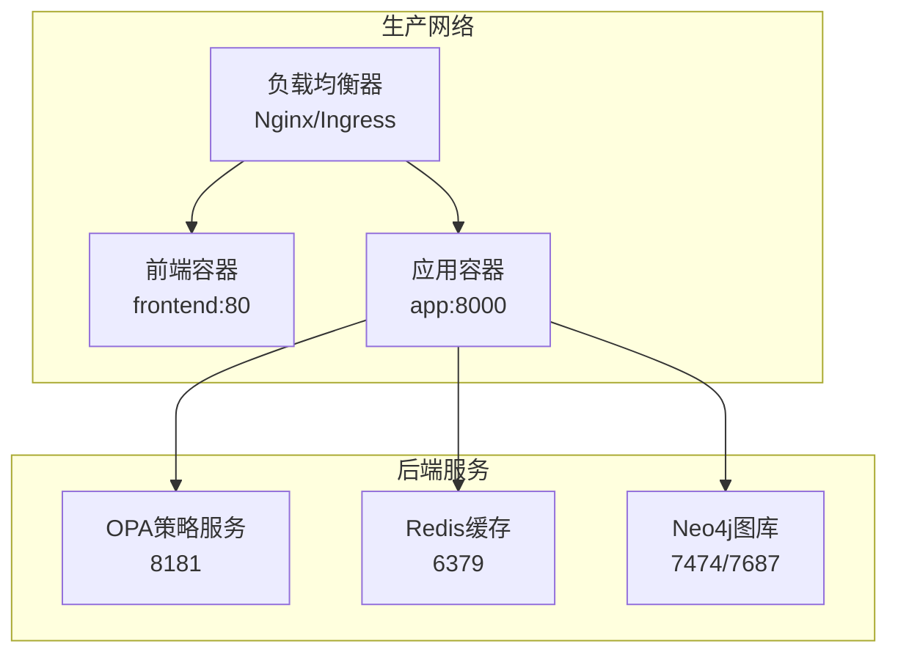
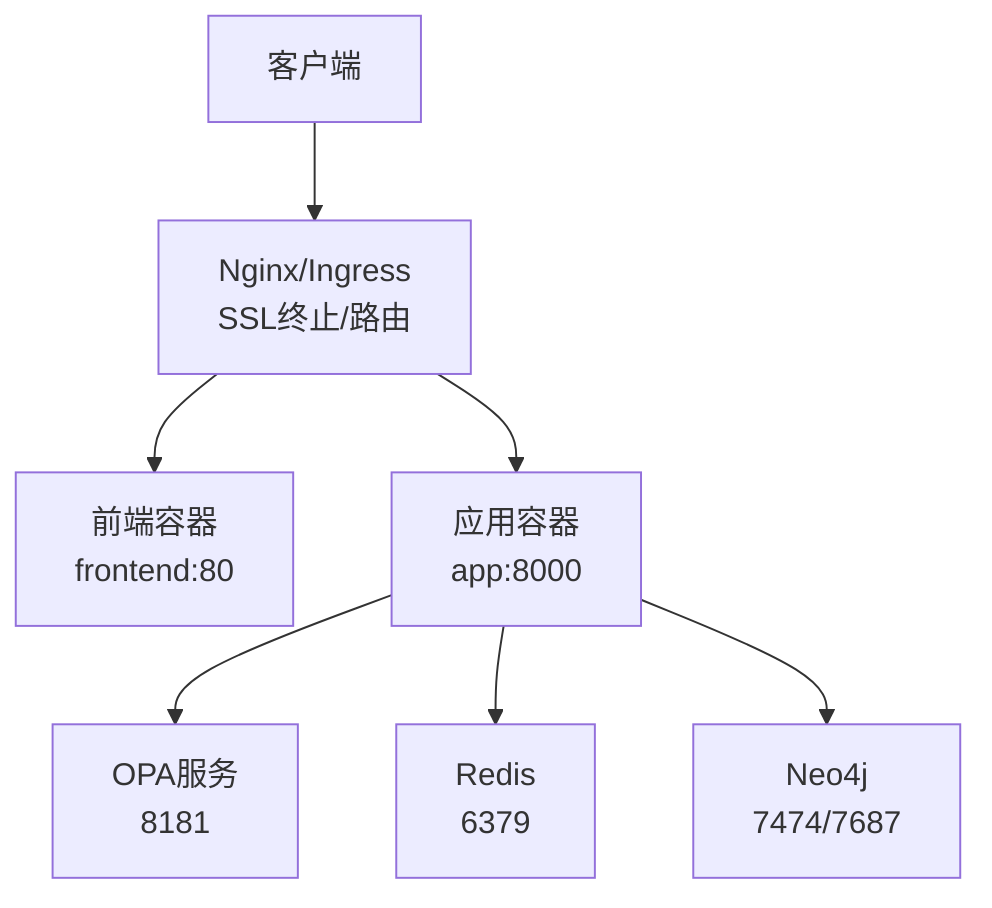
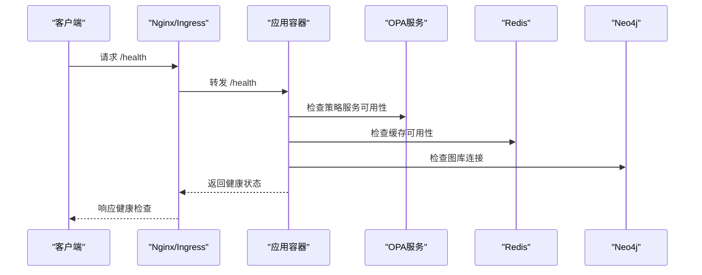
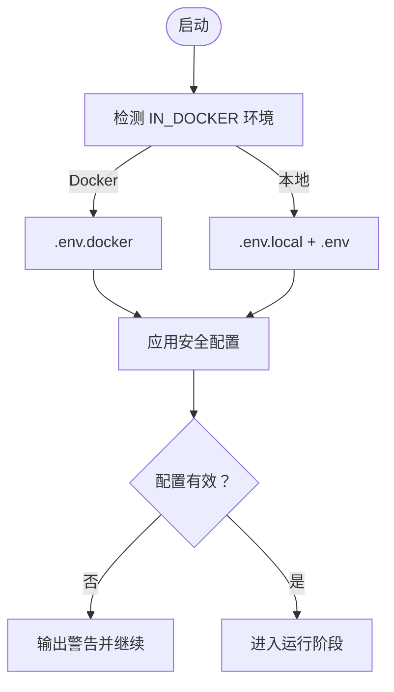
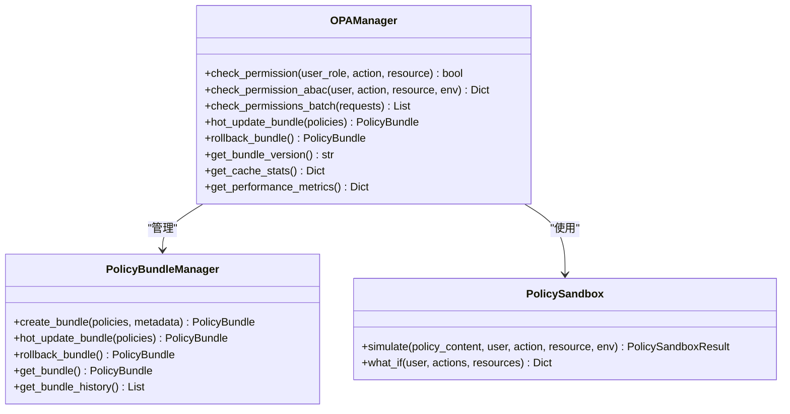
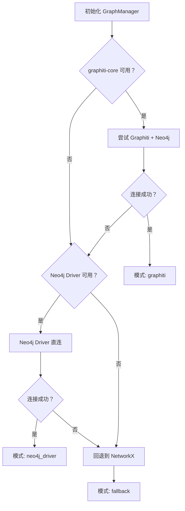
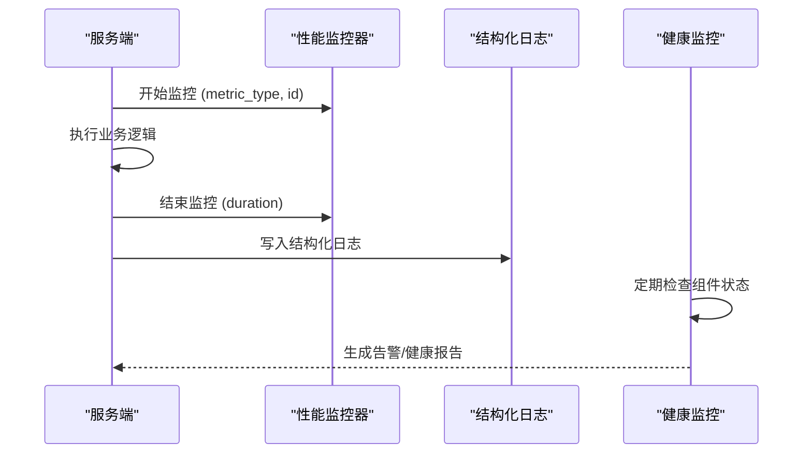
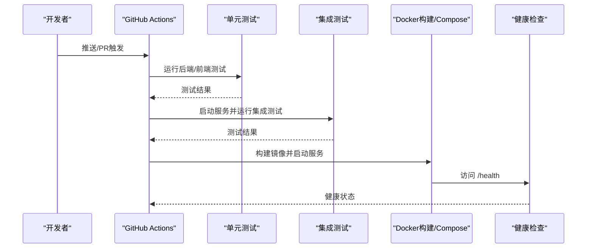
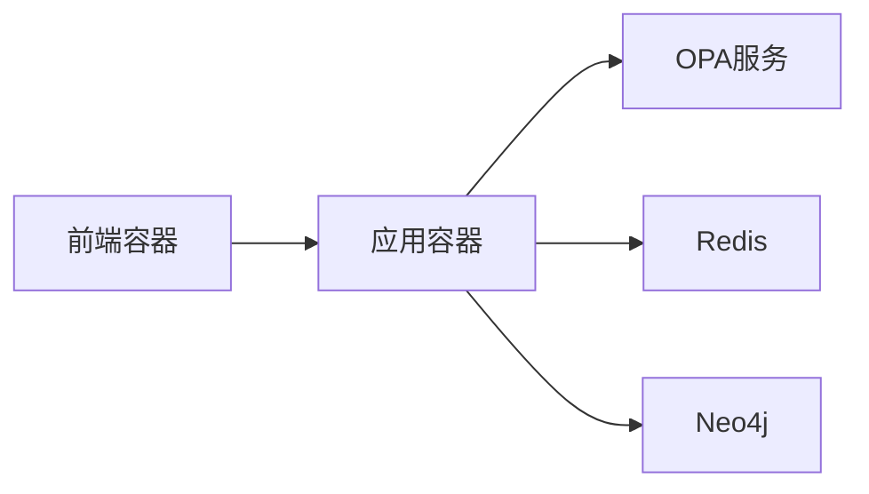

# 生产部署

<cite>
**本文引用的文件**
- [docker-compose.yml](file://docker/docker-compose.yml)
- [Dockerfile](file://docker/Dockerfile)
- [ci.yml](file://.github/workflows/ci.yml)
- [test.yml](file://.github/workflows/test.yml)
- [app.py](file://odap/web/app.py)
- [config.py](file://odap/infra/security/config.py)
- [performance_monitor.py](file://odap/infra/monitoring/performance_monitor.py)
- [structured_logging.py](file://odap/infra/logging/structured_logging.py)
- [health_monitor.py](file://odap/infra/resilience/health_monitor.py)
- [opa_service.py](file://odap/infra/opa/opa_service.py)
- [graph_service.py](file://odap/infra/graph/graph_service.py)
- [docker-compose.test.yml](file://docker/docker-compose.test.yml)
- [agent_config.yaml](file://config/agent_config.yaml)
</cite>

## 目录
1. [简介](#简介)
2. [项目结构](#项目结构)
3. [核心组件](#核心组件)
4. [架构总览](#架构总览)
5. [详细组件分析](#详细组件分析)
6. [依赖分析](#依赖分析)
7. [性能考虑](#性能考虑)
8. [故障排查指南](#故障排查指南)
9. [结论](#结论)
10. [附录](#附录)

## 简介
本文件面向ODAP平台的生产部署，提供从架构设计、高可用与负载均衡、SSL/TLS配置、CI/CD流水线、安全加固、容量规划与性能优化、监控与日志、备份与恢复到验收标准的完整方案。内容基于仓库中的容器编排、应用入口、安全配置、监控与日志、健康监控、权限策略与图谱服务等关键文件进行提炼与落地。

## 项目结构
ODAP平台采用多服务容器化部署，核心由Web应用、前端静态资源、Neo4j图数据库、Redis缓存、OPA策略服务组成，并通过Docker Compose进行编排。应用入口为FastAPI服务，提供统一API网关能力；安全配置集中于安全配置模块；监控与日志分别通过性能监控器与结构化日志系统实现；健康监控负责Swarm与Agent状态；权限策略通过OPA实现；图谱服务支持多模式降级。

**图示来源**
- [docker-compose.yml:1-97](file://docker/docker-compose.yml#L1-L97)
- [app.py:122-191](file://odap/web/app.py#L122-L191)

**章节来源**
- [docker-compose.yml:1-97](file://docker/docker-compose.yml#L1-L97)
- [Dockerfile:1-34](file://docker/Dockerfile#L1-L34)

## 核心组件
- 应用服务（FastAPI）：提供统一API、CORS中间件、审计中间件、健康检查与性能监控端点。
- 安全配置：集中管理LLM、Neo4j、JWT、CORS与日志级别等配置项。
- 权限策略（OPA）：支持ABAC策略、策略热更新Bundle、策略沙箱与批量权限检查。
- 图谱服务：三层降级（Graphiti+Neo4j → Neo4j Driver直连 → NetworkX回退）。
- 监控与日志：性能监控器、结构化日志系统（支持InfluxDB/TimescaleDB时序存储）、健康监控。
- CI/CD流水线：GitHub Actions工作流，包含单元/集成测试、Docker镜像构建与健康检查。

**章节来源**
- [app.py:122-191](file://odap/web/app.py#L122-L191)
- [config.py:29-79](file://odap/infra/security/config.py#L29-L79)
- [opa_service.py:455-714](file://odap/infra/opa/opa_service.py#L455-L714)
- [graph_service.py:71-144](file://odap/infra/graph/graph_service.py#L71-L144)
- [performance_monitor.py:12-144](file://odap/infra/monitoring/performance_monitor.py#L12-L144)
- [structured_logging.py:287-403](file://odap/infra/logging/structured_logging.py#L287-L403)
- [health_monitor.py:28-76](file://odap/infra/resilience/health_monitor.py#L28-L76)
- [ci.yml:1-99](file://.github/workflows/ci.yml#L1-L99)
- [test.yml:1-122](file://.github/workflows/test.yml#L1-L122)

## 架构总览
ODAP生产部署采用“应用+前端+Nginx反向代理”的三层架构，后端依赖OPA、Redis与Neo4j。应用通过健康检查端点暴露运行状态，支持性能监控与审计日志。

**图示来源**
- [docker-compose.yml:1-97](file://docker/docker-compose.yml#L1-L97)
- [app.py:221-242](file://odap/web/app.py#L221-L242)

## 详细组件分析

### 应用服务（FastAPI）
- 路由注册：涵盖本体管理、工作空间、角色、审计、技能、Hook、MCP、事件模拟、Agent、知识库、查询、感知、决策、仿真、会话记忆、数据仓库、语义地图、运行时、蓝图、思维图、状态机、消解图、共识等。
- 中间件：CORS、异常处理、审计。
- 健康检查：/health端点返回OpenHarness状态、图谱连接状态与版本信息。
- 性能监控端点：/api/v1/monitoring/performance与重置接口。

**图示来源**
- [app.py:221-242](file://odap/web/app.py#L221-L242)
- [docker-compose.yml:65-75](file://docker/docker-compose.yml#L65-L75)

**章节来源**
- [app.py:122-191](file://odap/web/app.py#L122-L191)
- [app.py:221-261](file://odap/web/app.py#L221-L261)

### 安全配置与访问控制
- 环境检测：优先加载.env.docker或.env.local，支持Docker与本地环境切换。
- 关键配置：LLM API密钥与基础地址、Neo4j连接参数、JWT密钥算法与过期时间、CORS白名单、日志级别与文件。
- 建议：JWT密钥不得使用默认值；CORS白名单按生产域名配置；Neo4j凭据与Redis凭据需加密存储。

**图示来源**
- [config.py:8-26](file://odap/infra/security/config.py#L8-L26)

**章节来源**
- [config.py:29-79](file://odap/infra/security/config.py#L29-L79)

### 权限策略（OPA）
- 模型：支持RBAC/ABAC/PBAC/CBAC，提供ABAC评估器与策略沙箱。
- Bundle：支持策略Bundle热更新与回滚，记录版本历史。
- 缓存：权限检查结果缓存，支持命中率统计与清理。
- 客户端：REST API封装，支持批量权限检查与健康检查。

**图示来源**
- [opa_service.py:455-714](file://odap/infra/opa/opa_service.py#L455-L714)

**章节来源**
- [opa_service.py:455-714](file://odap/infra/opa/opa_service.py#L455-L714)

### 图谱服务（多模式降级）
- 三层降级：Graphiti+Neo4j → Neo4j Driver直连 → NetworkX回退。
- 连接池与断路器：连接池大小、超时、空闲回收与失败阈值、恢复超时。
- 性能监控：查询耗时队列、缓存命中统计。
- 数据迁移：Neo4j直连模式下批量加载模拟数据。

**图示来源**
- [graph_service.py:145-185](file://odap/infra/graph/graph_service.py#L145-L185)

**章节来源**
- [graph_service.py:71-144](file://odap/infra/graph/graph_service.py#L71-L144)
- [graph_service.py:299-443](file://odap/infra/graph/graph_service.py#L299-L443)

### 监控与日志
- 性能监控器：记录LLM调用、数据库查询、API请求、工具执行的耗时统计与百分位。
- 结构化日志：支持InfluxDB/TimescaleDB时序存储，提供异步写入、批处理与缓冲刷新。
- 健康监控：Swarm组件健康状态、指标阈值与告警生成、健康报告与推荐。

**图示来源**
- [performance_monitor.py:147-183](file://odap/infra/monitoring/performance_monitor.py#L147-L183)
- [structured_logging.py:363-390](file://odap/infra/logging/structured_logging.py#L363-L390)
- [health_monitor.py:46-76](file://odap/infra/resilience/health_monitor.py#L46-L76)

**章节来源**
- [performance_monitor.py:12-184](file://odap/infra/monitoring/performance_monitor.py#L12-L184)
- [structured_logging.py:287-403](file://odap/infra/logging/structured_logging.py#L287-L403)
- [health_monitor.py:28-76](file://odap/infra/resilience/health_monitor.py#L28-L76)

### CI/CD流水线与自动化部署
- 单元/集成测试：Python后端与前端分别执行，集成测试包含Neo4j、Redis、OPA服务。
- Docker构建与Compose：构建镜像并启动服务，进行健康检查。
- 测试环境：独立Compose用于集成测试，包含Neo4j、OPA、Redis与测试应用。

**图示来源**
- [ci.yml:9-99](file://.github/workflows/ci.yml#L9-L99)
- [test.yml:14-122](file://.github/workflows/test.yml#L14-L122)

**章节来源**
- [ci.yml:1-99](file://.github/workflows/ci.yml#L1-L99)
- [test.yml:1-122](file://.github/workflows/test.yml#L1-L122)
- [docker-compose.test.yml:6-91](file://docker/docker-compose.test.yml#L6-L91)

## 依赖分析
- 应用对后端服务的依赖：OPA（权限）、Redis（缓存）、Neo4j（图谱）。
- 容器编排：Docker Compose定义服务间依赖与网络隔离。
- 环境变量：应用通过环境变量读取安全配置与服务地址。

**图示来源**
- [docker-compose.yml:1-97](file://docker/docker-compose.yml#L1-L97)

**章节来源**
- [docker-compose.yml:1-97](file://docker/docker-compose.yml#L1-L97)

## 性能考虑
- 连接池与断路器：图谱服务实现连接池与断路器，避免雪崩效应。
- 缓存策略：OPA权限检查结果缓存，降低策略服务压力。
- 性能监控：统一采集关键指标，支持百分位统计与重置。
- 健康监控：定期检查Swarm与Agent状态，及时告警。

**章节来源**
- [graph_service.py:299-443](file://odap/infra/graph/graph_service.py#L299-L443)
- [opa_service.py:538-598](file://odap/infra/opa/opa_service.py#L538-L598)
- [performance_monitor.py:107-140](file://odap/infra/monitoring/performance_monitor.py#L107-L140)
- [health_monitor.py:175-198](file://odap/infra/resilience/health_monitor.py#L175-L198)

## 故障排查指南
- 健康检查失败：检查应用容器的健康检查端点与依赖服务可达性。
- 权限策略异常：确认OPA服务可用、策略Bundle版本与缓存状态。
- 图谱连接问题：查看连接池与断路器状态，必要时触发重连。
- 日志与监控：检查结构化日志写入与性能指标导出，定位瓶颈。

**章节来源**
- [app.py:221-242](file://odap/web/app.py#L221-L242)
- [opa_service.py:444-450](file://odap/infra/opa/opa_service.py#L444-L450)
- [graph_service.py:186-213](file://odap/infra/graph/graph_service.py#L186-L213)
- [structured_logging.py:163-196](file://odap/infra/logging/structured_logging.py#L163-L196)

## 结论
ODAP平台具备完善的容器化部署基础与多层安全与监控能力。生产部署应重点强化负载均衡与高可用、SSL/TLS终端、CI/CD自动化与回滚、安全配置与访问控制、容量规划与性能优化、监控与日志、备份与恢复以及验收标准，确保系统稳定、安全、可观测与可维护。

## 附录

### 生产部署架构与最佳实践
- 负载均衡与高可用
  - 使用Nginx或Ingress作为前置负载均衡器，启用健康检查与会话亲和。
  - 应用容器至少部署2副本以上，结合滚动升级与蓝绿发布。
  - 前端静态资源通过CDN分发，开启压缩与缓存。
- SSL/TLS配置
  - 在Nginx/Ingress层终止TLS，证书由外部CA签发并定期轮换。
  - 强制HTTPS重定向，禁用弱密码套件与协议版本。
- CI/CD流水线
  - 保持现有工作流，增加覆盖率阈值与安全扫描步骤。
  - 引入回滚机制：镜像标签与版本号管理，支持一键回滚。
- 安全加固
  - 环境变量与密钥集中管理（如Vault/KMS），禁止硬编码。
  - 网络隔离：后端服务置于私有子网，仅开放必要端口。
  - 访问控制：CORS白名单严格限制，JWT密钥定期轮换。
  - 数据加密：传输加密（TLS）、静态加密（KMS），敏感字段脱敏。
- 容量规划与性能优化
  - 基于性能监控器统计的P95/P99指标设定资源上限与扩缩容阈值。
  - Redis持久化策略与主从复制，OPA策略缓存命中率优化。
  - Neo4j参数调优（堆大小、页面缓存、插件）与备份策略。
- 监控、日志与备份恢复
  - 结构化日志写入时序数据库，建立查询与可视化面板。
  - 健康监控持续告警，结合自动扩容与自愈脚本。
  - 备份：Neo4j快照与增量备份、Redis RDB/AOF、OPA策略Bundle版本化存储。
- 部署检查清单与验收标准
  - 基础设施：负载均衡、DNS、证书、防火墙规则。
  - 应用：容器镜像、环境变量、健康检查、日志输出。
  - 服务：OPA可用性、Redis连接、Neo4j连通性与索引。
  - 安全：最小权限、密钥轮换、访问审计、渗透测试。
  - 性能：QPS、P95延迟、缓存命中率、CPU/内存使用率。
  - 可靠性：故障演练、回滚验证、灾备切换。