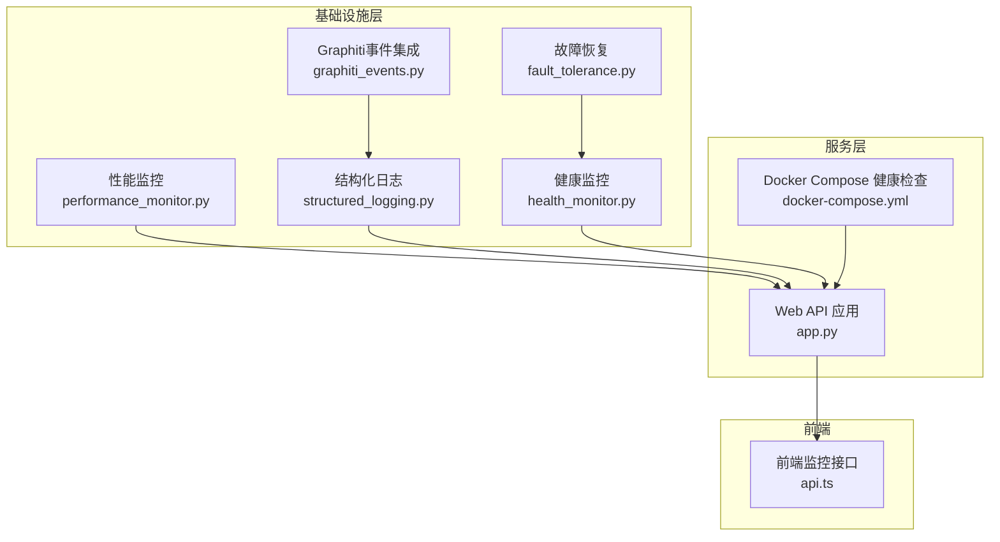
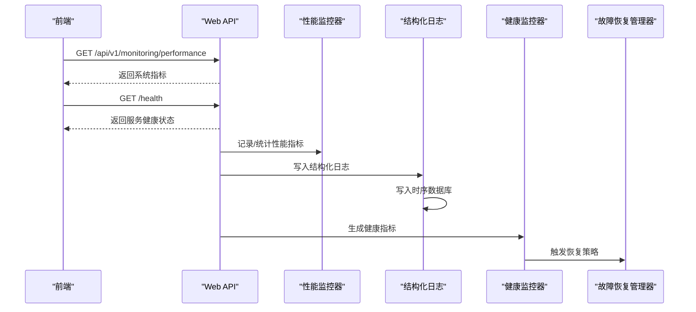
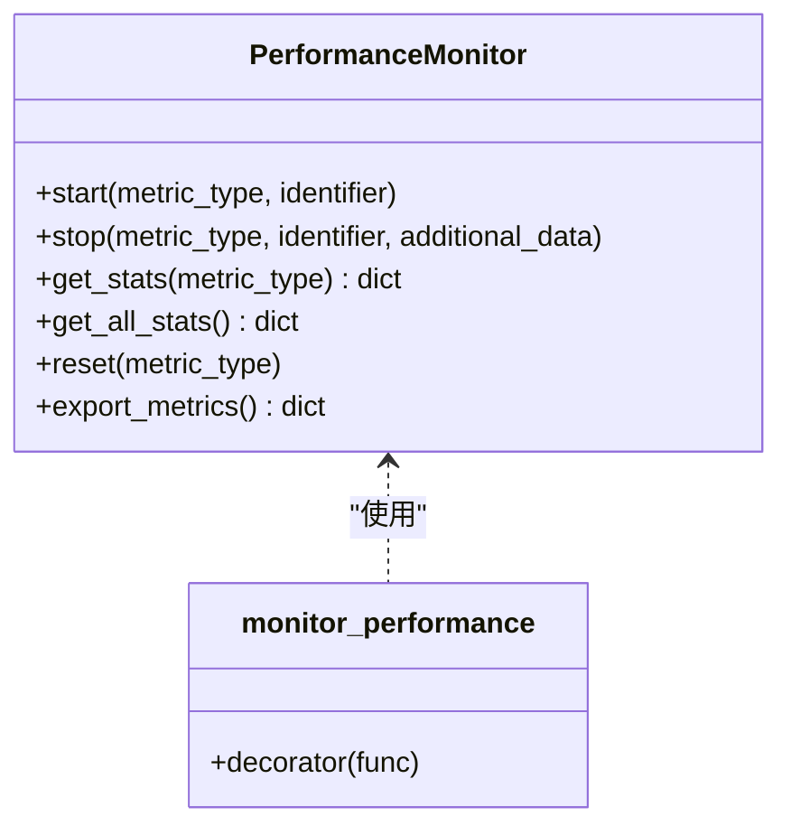
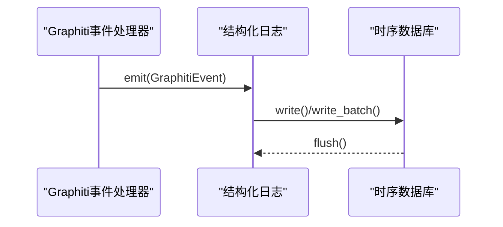
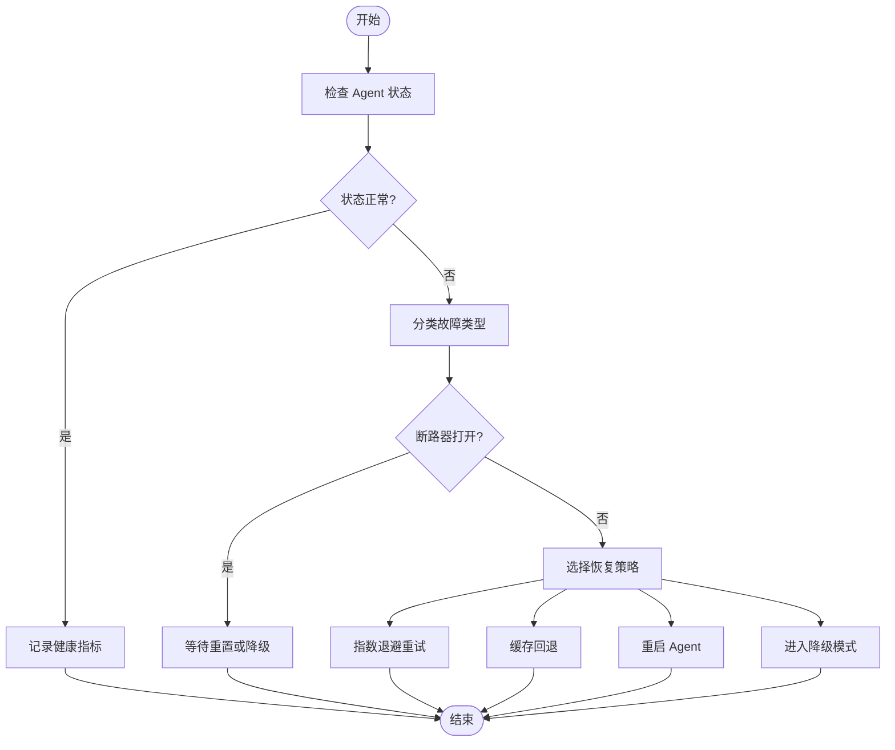
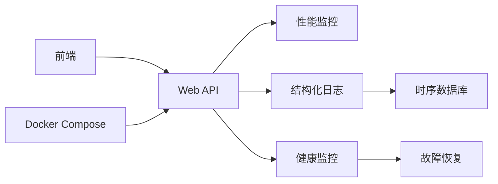

# 监控告警

<cite>
**本文引用的文件**
- [performance_monitor.py](file://odap/infra/monitoring/performance_monitor.py)
- [structured_logging.py](file://odap/infra/logging/structured_logging.py)
- [graphiti_events.py](file://odap/infra/logging/graphiti_events.py)
- [health_monitor.py](file://odap/infra/resilience/health_monitor.py)
- [fault_tolerance.py](file://odap/infra/resilience/fault_tolerance.py)
- [app.py](file://odap/web/api/app.py)
- [docker-compose.yml](file://docker/docker-compose.yml)
- [CHECKLIST_v2.md](file://docs/09-checklists/CHECKLIST_v2.md)
- [spec.md](file://specs/001-odap-platform/spec.md)
- [ARCHITECTURE_FULL_CHAIN_DEEP.md](file://docs/02-architecture/ARCHITECTURE_FULL_CHAIN_DEEP.md)
- [api.ts](file://frontend/src/modules/shared/services/api.ts)
</cite>

## 目录
1. [简介](#简介)
2. [项目结构](#项目结构)
3. [核心组件](#核心组件)
4. [架构总览](#架构总览)
5. [详细组件分析](#详细组件分析)
6. [依赖分析](#依赖分析)
7. [性能考量](#性能考量)
8. [故障排查指南](#故障排查指南)
9. [结论](#结论)
10. [附录](#附录)

## 简介
本文件面向 ODAP 平台的监控与告警体系，系统化阐述性能监控指标设计与实现、日志收集与分析配置、健康检查机制与自动恢复策略，并给出告警规则与通知渠道建议、监控仪表板搭建思路以及监控数据存储与查询优化要点。目标是帮助运维与开发团队快速理解并落地可观测性能力。

## 项目结构
ODAP 平台的监控与告警涉及基础设施层与业务层的多个模块：
- 性能监控：基于内存队列的采样与统计，支持装饰器与手工埋点
- 结构化日志：统一日志格式、时序数据库落盘、事件驱动转发
- 健康监控：Swarm 组件与 Agent 状态、指标阈值与告警
- 故障恢复：断路器、重试、降级与自动重启策略
- 健康检查：容器健康探针与服务端 /health 接口
- 前端监控接口：系统指标与健康状态查询

**图表来源**
- [performance_monitor.py:12-184](file://odap/infra/monitoring/performance_monitor.py#L12-L184)
- [structured_logging.py:1-403](file://odap/infra/logging/structured_logging.py#L1-L403)
- [graphiti_events.py:1-282](file://odap/infra/logging/graphiti_events.py#L1-L282)
- [health_monitor.py:1-216](file://odap/infra/resilience/health_monitor.py#L1-L216)
- [fault_tolerance.py:1-309](file://odap/infra/resilience/fault_tolerance.py#L1-L309)
- [app.py:547-549](file://odap/web/api/app.py#L547-L549)
- [docker-compose.yml:28-34](file://docker/docker-compose.yml#L28-L34)
- [api.ts:1442-1462](file://frontend/src/modules/shared/services/api.ts#L1442-L1462)

**章节来源**
- [performance_monitor.py:12-184](file://odap/infra/monitoring/performance_monitor.py#L12-L184)
- [structured_logging.py:1-403](file://odap/infra/logging/structured_logging.py#L1-L403)
- [graphiti_events.py:1-282](file://odap/infra/logging/graphiti_events.py#L1-L282)
- [health_monitor.py:1-216](file://odap/infra/resilience/health_monitor.py#L1-L216)
- [fault_tolerance.py:1-309](file://odap/infra/resilience/fault_tolerance.py#L1-L309)
- [app.py:547-549](file://odap/web/api/app.py#L547-L549)
- [docker-compose.yml:28-34](file://docker/docker-compose.yml#L28-L34)
- [api.ts:1442-1462](file://frontend/src/modules/shared/services/api.ts#L1442-L1462)

## 核心组件
- 性能监控器：提供 LLM 调用、数据库查询、API 请求、工具执行等指标的采样、统计与导出
- 结构化日志系统：统一字段、支持 InfluxDB/TimescaleDB 时序落盘、事件驱动转发
- 健康监控器：周期性检查 Swarm 组件与 Agent 状态，生成健康报告与告警
- 故障恢复管理器：断路器、重试、降级与自动重启策略
- 健康检查：容器健康探针与服务端 /health 接口
- 前端监控接口：系统指标与健康状态查询

**章节来源**
- [performance_monitor.py:12-184](file://odap/infra/monitoring/performance_monitor.py#L12-L184)
- [structured_logging.py:1-403](file://odap/infra/logging/structured_logging.py#L1-L403)
- [graphiti_events.py:1-282](file://odap/infra/logging/graphiti_events.py#L1-L282)
- [health_monitor.py:1-216](file://odap/infra/resilience/health_monitor.py#L1-L216)
- [fault_tolerance.py:1-309](file://odap/infra/resilience/fault_tolerance.py#L1-L309)
- [app.py:547-549](file://odap/web/api/app.py#L547-L549)
- [api.ts:1442-1462](file://frontend/src/modules/shared/services/api.ts#L1442-L1462)

## 架构总览
ODAP 的监控与告警以“指标采集—日志归集—健康监测—故障恢复—告警通知—仪表板呈现”为主线，形成闭环。

**图表来源**
- [app.py:547-549](file://odap/web/api/app.py#L547-L549)
- [performance_monitor.py:147-184](file://odap/infra/monitoring/performance_monitor.py#L147-L184)
- [structured_logging.py:163-285](file://odap/infra/logging/structured_logging.py#L163-L285)
- [health_monitor.py:175-216](file://odap/infra/resilience/health_monitor.py#L175-L216)
- [fault_tolerance.py:69-101](file://odap/infra/resilience/fault_tolerance.py#L69-L101)
- [api.ts:1442-1462](file://frontend/src/modules/shared/services/api.ts#L1442-L1462)

## 详细组件分析

### 性能监控指标设计与实现
- 指标类型：LLM 调用、数据库查询、API 请求、工具执行
- 采样方式：开始/结束计时，记录时长与附加信息
- 统计维度：计数、均值、中位数、最小/最大、P95/P99
- 导出能力：支持导出原始记录，便于离线分析
- 装饰器模式：对函数进行自动埋点，区分同步/异步

**图表来源**
- [performance_monitor.py:12-184](file://odap/infra/monitoring/performance_monitor.py#L12-L184)

**章节来源**
- [performance_monitor.py:12-184](file://odap/infra/monitoring/performance_monitor.py#L12-L184)

### 日志收集与分析系统
- 结构化日志格式：统一字段（时间戳、级别、来源、trace/span、实体/用户/工作区、操作、耗时、元数据、错误）
- 日志级别：trace/debug/info/warning/error/critical
- 日志来源：graphiti_core/ontology/workspace/agent/decision/audit/system
- 存储后端：InfluxDB 或 TimescaleDB（PostgreSQL），内存回退
- 事件集成：Graphiti 事件订阅与转发，异步处理，支持注册处理器

**图表来源**
- [graphiti_events.py:101-158](file://odap/infra/logging/graphiti_events.py#L101-L158)
- [structured_logging.py:163-285](file://odap/infra/logging/structured_logging.py#L163-L285)

**章节来源**
- [structured_logging.py:1-403](file://odap/infra/logging/structured_logging.py#L1-L403)
- [graphiti_events.py:1-282](file://odap/infra/logging/graphiti_events.py#L1-L282)

### 健康检查机制与自动恢复
- 服务健康：/health 接口返回服务状态
- 容器健康：Docker Compose 健康探针定期探测 /health
- Swarm/Agent 健康：周期性检查 Agent 状态与活动任务数，生成健康指标与告警
- 故障恢复：断路器、指数退避重试、降级模式、缓存回退、重启 Agent

**图表来源**
- [health_monitor.py:90-156](file://odap/infra/resilience/health_monitor.py#L90-L156)
- [fault_tolerance.py:69-234](file://odap/infra/resilience/fault_tolerance.py#L69-L234)

**章节来源**
- [app.py:547-549](file://odap/web/api/app.py#L547-L549)
- [docker-compose.yml:28-34](file://docker/docker-compose.yml#L28-L34)
- [health_monitor.py:1-216](file://odap/infra/resilience/health_monitor.py#L1-L216)
- [fault_tolerance.py:1-309](file://odap/infra/resilience/fault_tolerance.py#L1-L309)

### 告警规则配置与通知渠道
- 告警规则示例（基于现有阈值与指标）：
  - Agent 状态异常：degraded/critical
  - 指标阈值：健康分数、活动任务数
  - 异常检测：基于统计的异常检测（如 QA 差评率、Skill 失败率、更新积压）
- 通知渠道：可结合现有通知服务（如 Slack/Discord/邮件），在异常检测模块中集成
- 建议：为关键阈值设定分级（warning/critical），并记录告警历史以便回溯

**章节来源**
- [health_monitor.py:140-174](file://odap/infra/resilience/health_monitor.py#L140-L174)
- [ARCHITECTURE_FULL_CHAIN_DEEP.md:4763-4883](file://docs/02-architecture/ARCHITECTURE_FULL_CHAIN_DEEP.md#L4763-L4883)

### 监控仪表板搭建与关键指标解读
- 前端反馈仪表盘：展示 QA 好评率、Skill 成功率、回答可信度、负面标记与活跃告警
- 关键指标解读：
  - 好评率：反映问答质量；持续下降需关注模型/提示词/检索
  - Skill 成功率与 P95 延迟：衡量工具链稳定性与性能
  - 可信度与负面标记：辅助定位回答偏差与错误
  - 活跃告警：指导紧急处置优先级

**章节来源**
- [ARCHITECTURE_FULL_CHAIN_DEEP.md:4885-4990](file://docs/02-architecture/ARCHITECTURE_FULL_CHAIN_DEEP.md#L4885-L4990)
- [api.ts:1442-1462](file://frontend/src/modules/shared/services/api.ts#L1442-L1462)

### 监控数据存储与查询优化
- 存储后端：InfluxDB（点写入、标签与字段分离）或 TimescaleDB（SQL 扩展）
- 缓冲与批处理：批量写入、定时刷新，降低写放大
- 查询优化建议：
  - 为高频查询建立索引（时间、来源、级别、工作区）
  - 使用分区策略（按天/周）提升扫描效率
  - 对热点指标建立物化视图或缓存

**章节来源**
- [structured_logging.py:197-267](file://odap/infra/logging/structured_logging.py#L197-L267)

## 依赖分析
- 组件耦合：
  - Web API 依赖性能监控与日志系统输出指标与日志
  - 健康监控依赖故障恢复管理器进行策略决策
  - 前端通过 API 获取系统指标与健康状态
- 外部依赖：
  - InfluxDB/ TimescaleDB 时序数据库
  - Docker Compose 健康探针
  - 前端 React 查询与展示

**图表来源**
- [app.py:547-549](file://odap/web/api/app.py#L547-L549)
- [performance_monitor.py:12-184](file://odap/infra/monitoring/performance_monitor.py#L12-L184)
- [structured_logging.py:163-285](file://odap/infra/logging/structured_logging.py#L163-L285)
- [health_monitor.py:1-216](file://odap/infra/resilience/health_monitor.py#L1-L216)
- [fault_tolerance.py:1-309](file://odap/infra/resilience/fault_tolerance.py#L1-L309)
- [docker-compose.yml:28-34](file://docker/docker-compose.yml#L28-L34)
- [api.ts:1442-1462](file://frontend/src/modules/shared/services/api.ts#L1442-L1462)

**章节来源**
- [app.py:547-549](file://odap/web/api/app.py#L547-L549)
- [docker-compose.yml:28-34](file://docker/docker-compose.yml#L28-L34)

## 性能考量
- 指标采样：使用滑动窗口与百分位统计，避免高基数导致内存膨胀
- 日志写入：批量缓冲与异步刷新，减少 I/O 抖动
- 健康检查：合理间隔与超时，避免对业务造成额外压力
- 前端查询：缓存与节流，避免频繁拉取

## 故障排查指南
- 健康状态异常：
  - 检查 /health 接口返回与容器健康探针
  - 查看健康监控器生成的健康报告与最近指标
- 日志缺失或异常：
  - 检查时序数据库连接与权限
  - 核对日志级别与来源过滤
- 性能指标异常：
  - 对比 P95/P99 与基线，定位瓶颈环节
  - 结合结构化日志中的 trace/span 进行端到端追踪

**章节来源**
- [app.py:547-549](file://odap/web/api/app.py#L547-L549)
- [docker-compose.yml:28-34](file://docker/docker-compose.yml#L28-L34)
- [health_monitor.py:175-198](file://odap/infra/resilience/health_monitor.py#L175-L198)
- [structured_logging.py:127-196](file://odap/infra/logging/structured_logging.py#L127-L196)

## 结论
ODAP 平台已具备完善的监控与告警基础：性能监控、结构化日志、健康监控与故障恢复协同工作，配合容器健康探针与前端仪表板，形成从数据采集到可视化的闭环。建议在此基础上进一步完善告警规则与通知渠道，强化异常检测与根因分析能力，持续优化存储与查询性能，以支撑平台稳定与高质量运营。

## 附录
- 监控目标与验收标准（摘自项目规格与检查清单）：
  - 问答响应时间 P95 < 3 秒，图谱查询延迟 P95 < 500ms
  - 系统可用性目标与性能指标纳入质量保证检查

**章节来源**
- [spec.md:213-225](file://specs/001-odap-platform/spec.md#L213-L225)
- [CHECKLIST_v2.md:657-663](file://docs/09-checklists/CHECKLIST_v2.md#L657-L663)