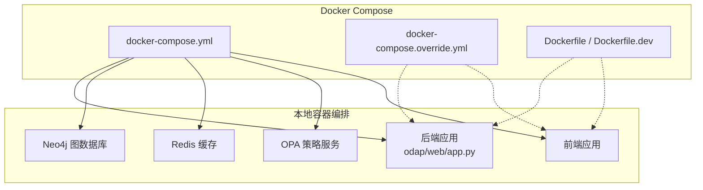
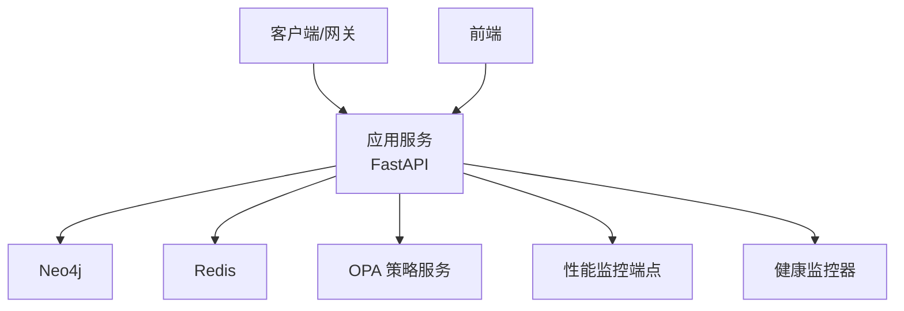
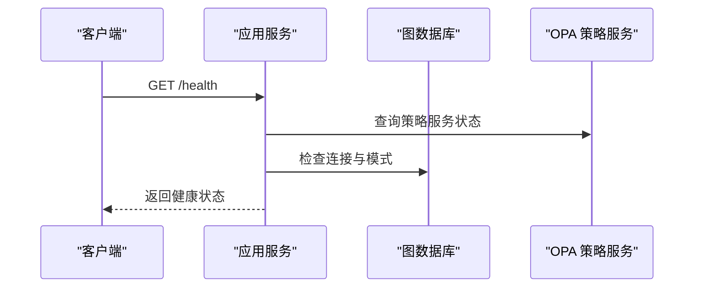
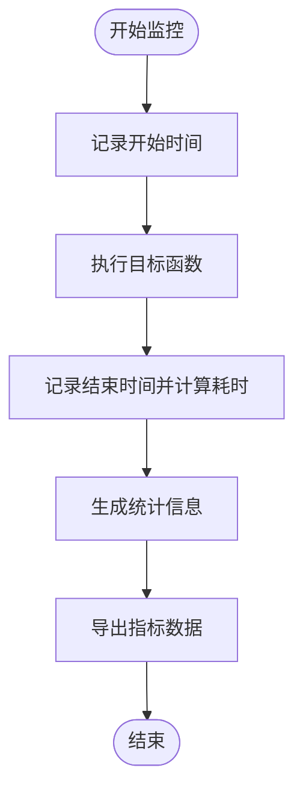
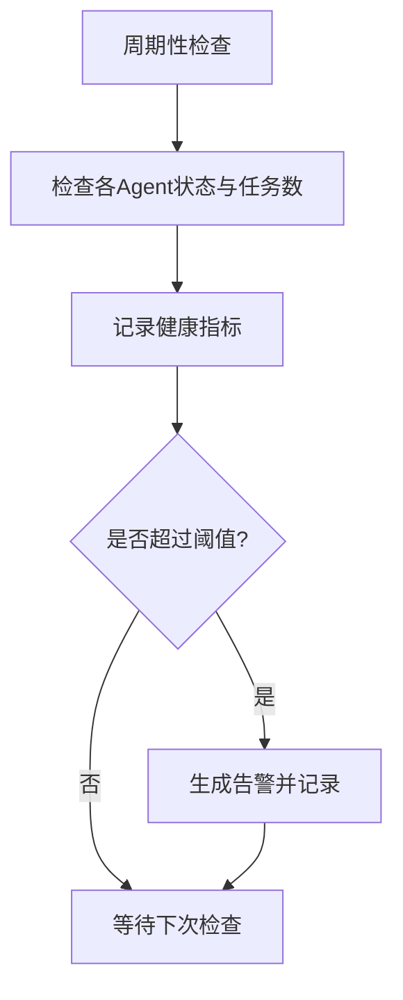
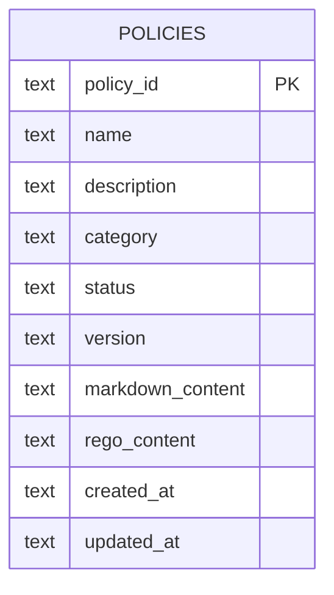
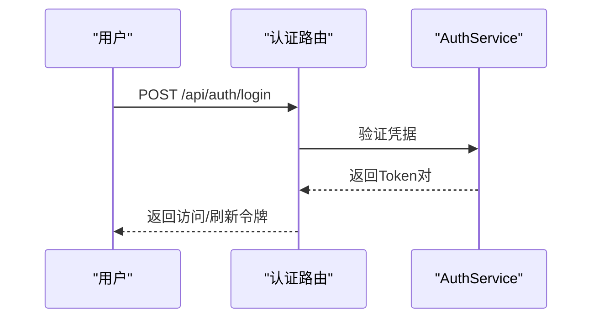
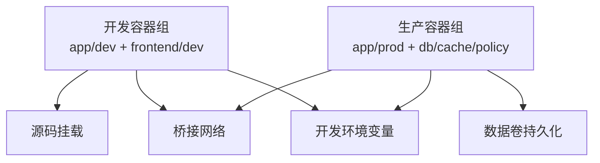
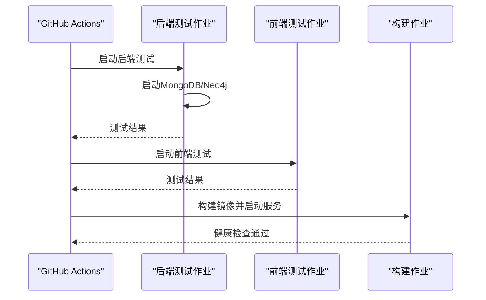
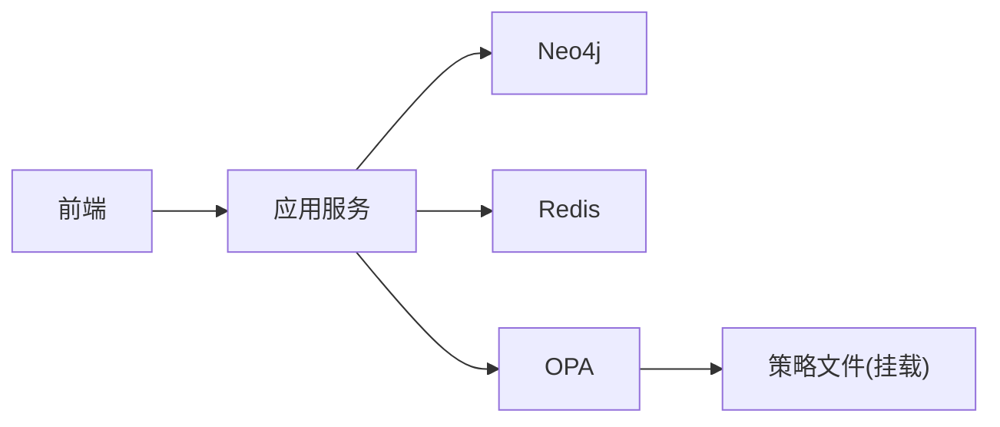

# 部署运维

<cite>
**本文引用的文件**   
- [Dockerfile](file://docker/Dockerfile)
- [docker-compose.yml](file://docker/docker-compose.yml)
- [docker-compose.override.yml](file://docker/docker-compose.override.yml)
- [Dockerfile.dev](file://docker/Dockerfile.dev)
- [ci.yml](file://.github/workflows/ci.yml)
- [app.py](file://odap/web/app.py)
- [performance_monitor.py](file://odap/infra/monitoring/performance_monitor.py)
- [health_monitor.py](file://odap/infra/resilience/health_monitor.py)
- [routes.py](file://odap/infra/opa/routes.py)
- [auth_routes.py](file://odap/infra/security/auth_routes.py)
- [requirements.txt](file://requirements.txt)
- [agent_config.yaml](file://config/agent_config.yaml)
</cite>

## 目录
1. [简介](#简介)
2. [项目结构](#项目结构)
3. [核心组件](#核心组件)
4. [架构总览](#架构总览)
5. [详细组件分析](#详细组件分析)
6. [依赖分析](#依赖分析)
7. [性能考虑](#性能考虑)
8. [故障排除指南](#故障排除指南)
9. [结论](#结论)
10. [附录](#附录)

## 简介
本文件面向ODAP平台的部署与运维工程师，提供从容器化到生产级部署的完整指南。内容涵盖：
- Docker容器化与服务编排
- Kubernetes部署策略与集群管理建议
- 生产环境最佳实践：负载均衡、高可用、安全加固
- 监控告警：性能指标、日志采集、健康检查
- 数据库备份恢复、版本升级与回滚策略
- 故障排除、常见问题与性能调优
- CI/CD流水线与自动化部署脚本

## 项目结构
ODAP平台由后端FastAPI应用、Neo4j图数据库、Redis缓存、OpenPolicyAgent策略服务以及前端组成。仓库提供了基于Docker的本地编排与开发覆盖配置，并在CI中完成镜像构建与健康检查。

**图表来源**
- [docker-compose.yml:1-97](file://docker/docker-compose.yml#L1-L97)
- [docker-compose.override.yml:1-73](file://docker/docker-compose.override.yml#L1-L73)
- [Dockerfile:1-34](file://docker/Dockerfile#L1-L34)
- [Dockerfile.dev:1-34](file://docker/Dockerfile.dev#L1-L34)

**章节来源**
- [docker-compose.yml:1-97](file://docker/docker-compose.yml#L1-L97)
- [docker-compose.override.yml:1-73](file://docker/docker-compose.override.yml#L1-L73)
- [Dockerfile:1-34](file://docker/Dockerfile#L1-L34)
- [Dockerfile.dev:1-34](file://docker/Dockerfile.dev#L1-L34)

## 核心组件
- 应用服务：基于FastAPI的主应用，提供统一API入口与健康检查端点，内置性能监控路由。
- 数据与缓存：Neo4j用于图数据存储；Redis用于缓存与会话。
- 策略引擎：OpenPolicyAgent提供策略管理与决策日志。
- 安全认证：JWT认证与用户管理接口。
- 监控与韧性：性能监控器与健康监控器，支持指标统计与告警。
- 构建与测试：requirements.txt声明依赖；CI工作流负责后端/前端测试与镜像构建。

**章节来源**
- [app.py:122-262](file://odap/web/app.py#L122-L262)
- [routes.py:11-422](file://odap/infra/opa/routes.py#L11-L422)
- [auth_routes.py:1-143](file://odap/infra/security/auth_routes.py#L1-L143)
- [performance_monitor.py:12-184](file://odap/infra/monitoring/performance_monitor.py#L12-L184)
- [health_monitor.py:28-216](file://odap/infra/resilience/health_monitor.py#L28-L216)
- [requirements.txt:1-48](file://requirements.txt#L1-L48)

## 架构总览
ODAP平台采用“应用+数据库+缓存+策略服务”的多容器架构。应用通过健康检查端点暴露运行状态，性能监控端点提供指标聚合，策略服务以独立容器运行并通过挂载策略目录实现热更新。

**图表来源**
- [app.py:221-242](file://odap/web/app.py#L221-L242)
- [app.py:248-261](file://odap/web/app.py#L248-L261)
- [health_monitor.py:46-76](file://odap/infra/resilience/health_monitor.py#L46-L76)

**章节来源**
- [app.py:122-262](file://odap/web/app.py#L122-L262)
- [health_monitor.py:28-216](file://odap/infra/resilience/health_monitor.py#L28-L216)

## 详细组件分析

### 应用服务（FastAPI）
- 路由组织：集中注册多个业务路由模块，便于统一管理与扩展。
- 中间件：CORS、审计中间件与异常处理注册，保障跨域与可观测性。
- 生命周期：启动阶段初始化OpenHarness v1/v2，创建默认工作空间与场景。
- 健康检查：/health返回应用、策略、图数据库模式等状态。
- 性能监控：/api/v1/monitoring提供性能指标查询与重置。

**图表来源**
- [app.py:221-242](file://odap/web/app.py#L221-L242)

**章节来源**
- [app.py:122-262](file://odap/web/app.py#L122-L262)

### 性能监控（PerformanceMonitor）
- 指标类型：LLM调用、数据库查询、API请求、工具执行。
- 统计维度：均值、中位数、最小/最大、P95/P99。
- 接口：装饰器自动埋点，支持同步/异步函数；提供导出与重置能力。

**图表来源**
- [performance_monitor.py:30-184](file://odap/infra/monitoring/performance_monitor.py#L30-L184)

**章节来源**
- [performance_monitor.py:12-184](file://odap/infra/monitoring/performance_monitor.py#L12-L184)
- [app.py:248-261](file://odap/web/app.py#L248-L261)

### 健康监控（HealthMonitor）
- 监控对象：Swarm Agent状态与活动任务数量。
- 阈值与告警：分级阈值触发warning/critical告警，记录最近指标与告警。
- 报告：汇总整体健康状态与改进建议。

**图表来源**
- [health_monitor.py:78-156](file://odap/infra/resilience/health_monitor.py#L78-L156)

**章节来源**
- [health_monitor.py:28-216](file://odap/infra/resilience/health_monitor.py#L28-L216)

### 策略服务（OPA）
- 存储：使用SQLite存储策略元数据与内容，支持分类、状态、版本管理。
- 能力：策略列表、创建、查询、更新、启停、Markdown转Rego转换。
- 默认策略：提供访问控制、数据隐私、合规审计三类默认策略。

**图表来源**
- [routes.py:20-33](file://odap/infra/opa/routes.py#L20-L33)

**章节来源**
- [routes.py:11-422](file://odap/infra/opa/routes.py#L11-L422)

### 认证与授权（JWT）
- 登录/刷新/用户管理：提供登录、当前用户信息、令牌刷新、用户列表、创建、更新、删除。
- 角色映射：全局角色到内部ID映射，便于前端展示。

**图表来源**
- [auth_routes.py:40-80](file://odap/infra/security/auth_routes.py#L40-L80)

**章节来源**
- [auth_routes.py:1-143](file://odap/infra/security/auth_routes.py#L1-L143)

### 容器化与编排
- 生产镜像：基于自定义Python基础镜像，安装FastAPI、Neo4j、Redis、OPA、Celery等依赖，暴露8000端口，使用多进程Uvicorn启动。
- 开发镜像：启用热重载与watchdog，挂载源码目录，便于本地调试。
- Compose编排：定义应用、Neo4j、Redis、OPA四类服务，设置网络、卷、环境变量与健康检查。
- 覆盖配置：开发环境启用热重载与源码挂载，前端服务暴露5173端口。

**图表来源**
- [Dockerfile:1-34](file://docker/Dockerfile#L1-L34)
- [Dockerfile.dev:1-34](file://docker/Dockerfile.dev#L1-L34)
- [docker-compose.yml:1-97](file://docker/docker-compose.yml#L1-L97)
- [docker-compose.override.yml:1-73](file://docker/docker-compose.override.yml#L1-L73)

**章节来源**
- [Dockerfile:1-34](file://docker/Dockerfile#L1-L34)
- [Dockerfile.dev:1-34](file://docker/Dockerfile.dev#L1-L34)
- [docker-compose.yml:1-97](file://docker/docker-compose.yml#L1-L97)
- [docker-compose.override.yml:1-73](file://docker/docker-compose.override.yml#L1-L73)

### CI/CD流水线
- 触发条件：push到main/develop，pull_request到main。
- 后端测试：使用MongoDB与Neo4j服务，运行单元与集成测试。
- 前端测试：Node.js环境，类型检查、Linter与单元测试。
- 构建与健康检查：构建Docker镜像并使用Compose启动，最后进行健康检查。

**图表来源**
- [ci.yml:1-99](file://.github/workflows/ci.yml#L1-L99)

**章节来源**
- [.github/workflows/ci.yml:1-99](file://.github/workflows/ci.yml#L1-L99)

## 依赖分析
- 应用依赖：graphiti-core、neo4j、networkx、redis、pydantic、httpx、aiohttp、openai、celery、opa-python等。
- 关键耦合：应用与Neo4j/Redis/OPA之间通过环境变量配置连接；健康检查依赖OPA与图数据库状态。
- 外部集成：前端通过代理访问后端API；OPA策略目录挂载实现策略热更新。

**图表来源**
- [requirements.txt:1-48](file://requirements.txt#L1-L48)
- [docker-compose.yml:13-18](file://docker/docker-compose.yml#L13-L18)
- [docker-compose.yml:70-72](file://docker/docker-compose.yml#L70-L72)

**章节来源**
- [requirements.txt:1-48](file://requirements.txt#L1-L48)
- [docker-compose.yml:1-97](file://docker/docker-compose.yml#L1-L97)

## 性能考虑
- 并发与进程：生产镜像使用多进程Uvicorn，提升并发处理能力。
- 缓存策略：Redis作为缓存与会话存储，建议合理设置TTL与淘汰策略。
- 监控指标：利用性能监控器统计关键路径耗时，结合P95/P99定位瓶颈。
- 数据库优化：Neo4j内存参数与索引策略需根据数据规模调整。
- 策略评估：OPA策略复杂度直接影响决策延迟，建议拆分策略并缓存结果。

[本节为通用指导，无需具体文件引用]

## 故障排除指南
- 健康检查失败
  - 现象：/health返回异常或容器重启频繁。
  - 排查：检查Neo4j/Redis/OPA连通性与挂载卷；查看应用日志与健康监控告警。
  - 参考：健康检查端点与健康监控器。
- 性能抖动
  - 现象：响应时间波动大。
  - 排查：使用性能监控端点获取指标，关注LLM调用与数据库查询的P95/P99。
- 策略不生效
  - 现象：权限判断不符合预期。
  - 排查：确认策略文件挂载路径与版本，检查OPA策略转换与加载日志。
- 认证问题
  - 现象：登录失败或令牌无效。
  - 排查：核对JWT密钥、过期时间与用户角色映射。

**章节来源**
- [app.py:221-242](file://odap/web/app.py#L221-L242)
- [health_monitor.py:157-197](file://odap/infra/resilience/health_monitor.py#L157-L197)
- [performance_monitor.py:107-140](file://odap/infra/monitoring/performance_monitor.py#L107-L140)
- [routes.py:166-239](file://odap/infra/opa/routes.py#L166-L239)
- [auth_routes.py:40-80](file://odap/infra/security/auth_routes.py#L40-L80)

## 结论
本指南提供了ODAP平台从容器化到生产部署的全栈运维参考。通过Docker Compose快速搭建开发与测试环境，借助CI/CD保证交付质量，并以健康监控与性能监控为核心，持续优化系统稳定性与性能。建议在生产环境中进一步完善Kubernetes编排、负载均衡与高可用配置、安全加固与备份恢复策略。

[本节为总结，无需具体文件引用]

## 附录

### A. 生产环境部署最佳实践
- 负载均衡与高可用
  - 使用反向代理（如Nginx/Traefik）前置，开启健康检查与会话亲和。
  - 应用服务横向扩展，共享Redis与策略服务，避免状态耦合。
- 安全加固
  - 强制HTTPS与TLS终止；限制CORS白名单；启用JWT刷新与黑名单。
  - 对OPA策略目录进行只读挂载与权限控制。
- 配置管理
  - 将敏感配置放入环境变量或密钥管理服务；区分环境配置文件。
- 日志与审计
  - 统一结构化日志输出，接入集中式日志系统；审计路由记录关键操作。

[本节为通用指导，无需具体文件引用]

### B. 监控告警系统搭建
- 指标采集
  - 应用内指标：性能监控端点与健康监控报告。
  - 外部指标：容器资源、数据库连接数、Redis命中率、OPA决策耗时。
- 告警策略
  - 基于阈值与趋势的分级告警；结合健康监控器的最近告警与推荐。
- 可视化
  - 使用Prometheus/Grafana或类似方案聚合指标并创建仪表盘。

**章节来源**
- [app.py:248-261](file://odap/web/app.py#L248-L261)
- [health_monitor.py:175-198](file://odap/infra/resilience/health_monitor.py#L175-L198)

### C. 数据库备份与恢复
- Neo4j
  - 使用快照与备份策略，定期导出图数据；验证恢复流程。
- Redis
  - 开启RDB/AOF持久化；定期备份RDB文件；验证主从切换。
- OPA策略
  - 策略文件纳入版本控制；变更前先在测试环境验证。

**章节来源**
- [docker-compose.yml:58-62](file://docker/docker-compose.yml#L58-L62)
- [docker-compose.yml:82-86](file://docker/docker-compose.yml#L82-L86)
- [routes.py:17-33](file://odap/infra/opa/routes.py#L17-L33)

### D. 版本升级与回滚
- 升级步骤
  - 在非高峰时段进行；先升级策略服务与缓存，再滚动升级应用。
  - 升级后执行健康检查与性能回归测试。
- 回滚策略
  - 保留上一个镜像版本；回滚时恢复配置与数据卷；回滚后继续监控。

**章节来源**
- [ci.yml:87-99](file://.github/workflows/ci.yml#L87-L99)

### E. CI/CD流水线配置要点
- 分层测试：后端与前端分别测试，确保质量门禁。
- 构建产物：镜像标签按分支/版本管理；健康检查作为最终门禁。
- 自动化部署：结合Kubernetes部署策略（见下节）实现蓝绿/金丝雀发布。

**章节来源**
- [.github/workflows/ci.yml:1-99](file://.github/workflows/ci.yml#L1-L99)

### F. Kubernetes部署策略与集群管理
- 集群规划
  - 使用命名空间隔离环境；为应用、数据库、缓存与策略服务分别创建Deployment/StatefulSet。
- 服务发现与网关
  - 使用Service暴露应用；Ingress/NLB实现外部访问与TLS终止。
- 滚动更新与回滚
  - 设置合理的副本数与滚动更新参数；失败时自动回滚。
- 存储与持久化
  - 为Neo4j与Redis配置持久卷；策略服务挂载只读配置卷。
- 安全
  - Pod安全上下文、RBAC、网络策略；Secret管理敏感配置。

[本节为概念性内容，无需具体文件引用]

### G. 运维自动化工具与脚本
- 镜像构建
  - 使用Dockerfile构建生产镜像；在CI中完成多阶段构建与扫描。
- 健康检查
  - 在Compose/K8s中配置探针；结合健康监控器输出综合报告。
- 日志与审计
  - 统一日志格式与采集；审计路由与事件处理器协同记录关键动作。
- 备份与恢复
  - 编写备份脚本并纳入定时任务；定期演练恢复流程。

**章节来源**
- [Dockerfile:1-34](file://docker/Dockerfile#L1-L34)
- [docker-compose.yml:28-33](file://docker/docker-compose.yml#L28-L33)
- [routes.py:166-239](file://odap/infra/opa/routes.py#L166-L239)

### H. 常见问题与解答
- Q：为什么健康检查总是失败？
  - A：检查Neo4j/Redis/OPA容器日志与网络连通性；确认环境变量与挂载卷正确。
- Q：性能监控指标为空？
  - A：确认应用已启用性能监控端点；检查装饰器埋点是否覆盖关键路径。
- Q：OPA策略未生效？
  - A：确认策略文件挂载路径与权限；检查Markdown到Rego转换逻辑与包名。

**章节来源**
- [app.py:221-242](file://odap/web/app.py#L221-L242)
- [performance_monitor.py:107-140](file://odap/infra/monitoring/performance_monitor.py#L107-L140)
- [routes.py:242-421](file://odap/infra/opa/routes.py#L242-L421)