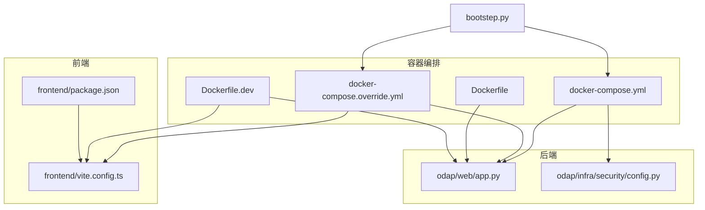
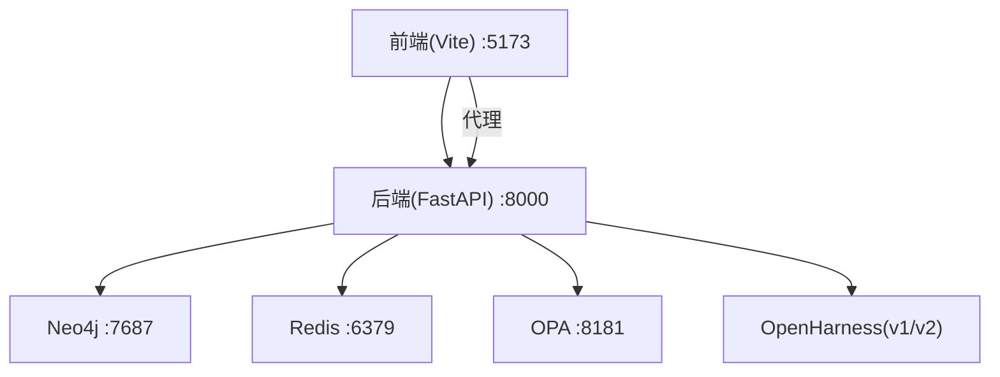
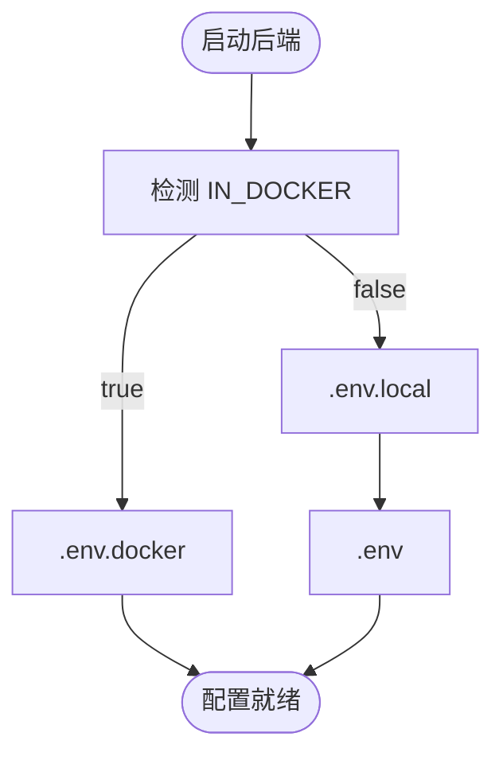
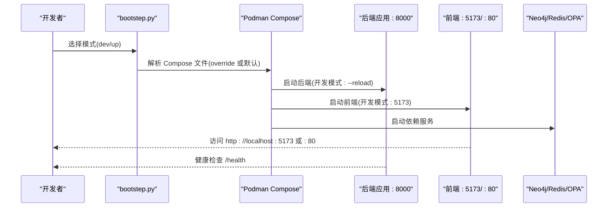
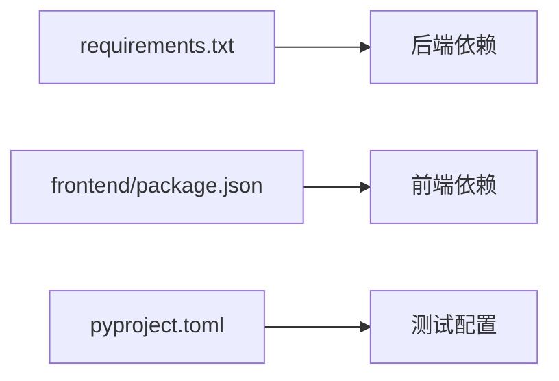

# 快速开始

<cite>
**本文引用的文件**
- [README.md](file://README.md)
- [bootstep.py](file://bootstep.py)
- [docker-compose.yml](file://docker/docker-compose.yml)
- [docker-compose.override.yml](file://docker/docker-compose.override.yml)
- [Dockerfile](file://docker/Dockerfile)
- [Dockerfile.dev](file://docker/Dockerfile.dev)
- [podman-compose-win-fix.py](file://docker/podman-compose-win-fix.py)
- [requirements.txt](file://requirements.txt)
- [pyproject.toml](file://pyproject.toml)
- [package.json](file://frontend/package.json)
- [vite.config.ts](file://frontend/vite.config.ts)
- [odap/web/app.py](file://odap/web/app.py)
- [odap/infra/security/config.py](file://odap/infra/security/config.py)
- [main.py](file://main.py)
</cite>

## 目录
1. [简介](#简介)
2. [项目结构](#项目结构)
3. [核心组件](#核心组件)
4. [架构概览](#架构概览)
5. [详细组件分析](#详细组件分析)
6. [依赖分析](#依赖分析)
7. [性能考虑](#性能考虑)
8. [故障排查指南](#故障排查指南)
9. [结论](#结论)
10. [附录](#附录)

## 简介
本指南面向首次接触 ODAP（本体驱动分析与决策平台）的新用户，帮助你在约 30 分钟内完成环境准备、Docker 部署与本地开发启动，并掌握服务访问地址与常见问题的解决方法。平台采用容器化编排，后端基于 Python 3.11+、FastAPI，前端基于 React 19，集成 Neo4j/Redis/OPA 等基础设施。

## 项目结构
- 后端核心位于 odap/，包含业务域、基础设施、工具与 Web 服务入口
- 前端位于 frontend/，采用 React + Vite
- 容器化与编排位于 docker/，包含生产与开发模式的 Compose 配置
- 一键启动脚本位于根目录 bootstep.py，封装 Podman 命令与镜像管理

**图示来源**
- [docker-compose.yml:1-97](file://docker/docker-compose.yml#L1-L97)
- [docker-compose.override.yml:1-73](file://docker/docker-compose.override.yml#L1-L73)
- [Dockerfile:1-34](file://docker/Dockerfile#L1-L34)
- [Dockerfile.dev:1-34](file://docker/Dockerfile.dev#L1-L34)
- [odap/web/app.py:1-262](file://odap/web/app.py#L1-L262)
- [odap/infra/security/config.py:1-44](file://odap/infra/security/config.py#L1-L44)
- [frontend/vite.config.ts:1-46](file://frontend/vite.config.ts#L1-L46)
- [frontend/package.json:1-55](file://frontend/package.json#L1-L55)
- [bootstep.py:1-401](file://bootstep.py#L1-L401)

**章节来源**
- [README.md:124-186](file://README.md#L124-L186)
- [docker/docker-compose.yml:1-97](file://docker/docker-compose.yml#L1-L97)
- [docker/docker-compose.override.yml:1-73](file://docker/docker-compose.override.yml#L1-L73)
- [bootstep.py:1-401](file://bootstep.py#L1-L401)

## 核心组件
- 容器编排与服务发现：后端应用、前端、Neo4j、Redis、OPA 通过 Compose 管理，网络桥接互通
- 后端 Web 服务：FastAPI 应用，注册多领域路由，提供健康检查与性能监控接口
- 前端开发服务器：Vite 热重载，代理后端 API，开发模式下自动转发 /api 与 /health
- 环境变量加载：根据 IN_DOCKER 自动选择 .env.docker 或 .env.local，支持 LLM、数据库、JWT 等配置
- 一键启动脚本：封装镜像拉取、构建、启动、日志查看、状态查询与资源清理

**章节来源**
- [odap/web/app.py:122-192](file://odap/web/app.py#L122-L192)
- [odap/infra/security/config.py:9-26](file://odap/infra/security/config.py#L9-L26)
- [frontend/vite.config.ts:17-44](file://frontend/vite.config.ts#L17-L44)
- [bootstep.py:143-341](file://bootstep.py#L143-L341)

## 架构概览
ODAP 采用“容器化 + 多服务”架构：后端提供统一 API；前端负责交互；Neo4j 存储图数据；Redis 提供缓存；OPA 提供策略治理；OpenHarness 集成 Agent 能力。

**图示来源**
- [docker/docker-compose.yml:7-26](file://docker/docker-compose.yml#L7-L26)
- [odap/web/app.py:122-192](file://odap/web/app.py#L122-L192)

## 详细组件分析

### 环境准备与前置条件
- 容器运行时：Podman 或 Docker（Windows 用户可使用 bootstep.py 提供的路径修复脚本）
- Python：3.11+（推荐 3.11.x），用于本地开发与测试
- Node.js：18+（前端开发与构建）

提示：README 已明确列出所需版本与基本命令，建议先阅读快速开始部分。

**章节来源**
- [README.md:126-131](file://README.md#L126-L131)

### 环境变量配置
- Docker 环境：IN_DOCKER=true 时，后端从 .env.docker 加载配置
- 本地环境：默认从 .env.local 加载，若不存在则回退 .env
- 关键变量（示例）：OPENAI_API_KEY、NEO4J_URI/USER/PASSWORD、JWT_SECRET、CORS_ORIGINS 等

**图示来源**
- [odap/infra/security/config.py:9-26](file://odap/infra/security/config.py#L9-L26)

**章节来源**
- [odap/infra/security/config.py:9-44](file://odap/infra/security/config.py#L9-L44)

### Docker 部署（开发模式与生产模式）
- 开发模式（热重载）：使用 docker-compose.override.yml，前端挂载源码至 :5173，后端启用 --reload
- 生产模式：使用 docker-compose.yml，前端通过 Nginx 对外提供静态服务，访问 :80
- 一键启动脚本：bootstep.py 封装 up/dev/down/rebuild/status/logs/clean/pull 等常用命令

**图示来源**
- [bootstep.py:113-122](file://bootstep.py#L113-L122)
- [docker/docker-compose.override.yml:4-42](file://docker/docker-compose.override.yml#L4-L42)
- [docker/docker-compose.yml:28-33](file://docker/docker-compose.yml#L28-L33)
- [odap/web/app.py:221-242](file://odap/web/app.py#L221-L242)

**章节来源**
- [README.md:139-157](file://README.md#L139-L157)
- [bootstep.py:188-246](file://bootstep.py#L188-L246)
- [docker/docker-compose.yml:1-97](file://docker/docker-compose.yml#L1-L97)
- [docker/docker-compose.override.yml:1-73](file://docker/docker-compose.override.yml#L1-L73)

### 本地开发环境搭建
- 安装后端依赖：pip install -r requirements.txt
- 安装前端依赖：cd frontend && npm install
- 启动后端：python main.py --web（或 odap.web.app:app）
- 启动前端：cd frontend && npm run dev
- 访问地址：后端 http://localhost:8765/docs，前端 http://localhost:5173（以实际为准）

注意：README 中提供了本地开发的完整命令与端口说明。

**章节来源**
- [README.md:159-173](file://README.md#L159-L173)
- [requirements.txt:1-48](file://requirements.txt#L1-L48)
- [frontend/package.json:6-14](file://frontend/package.json#L6-L14)
- [main.py:208-246](file://main.py#L208-L246)

### 服务访问地址说明
- 前端（开发）：http://localhost:5173
- 前端（生产）：http://localhost:80
- 后端 API：http://localhost:8000
- API 文档：http://localhost:8000/docs
- 健康检查：http://localhost:8000/health
- Neo4j Browser：http://localhost:7474
- OPA：http://localhost:8181
- Redis：localhost:6379

**章节来源**
- [README.md:175-186](file://README.md#L175-L186)
- [odap/web/app.py:221-242](file://odap/web/app.py#L221-L242)

## 依赖分析
- 后端依赖：graphiti-core、neo4j、networkx、redis、pydantic、httpx、aiohttp、openai、uvicorn、fastapi 等
- 前端依赖：React 19、Ant Design、@openharness/react、@antv/g6、leaflet 等
- 测试配置：pytest 集成标记与异步模式配置

**图示来源**
- [requirements.txt:1-48](file://requirements.txt#L1-L48)
- [frontend/package.json:15-53](file://frontend/package.json#L15-L53)
- [pyproject.toml:1-17](file://pyproject.toml#L1-L17)

**章节来源**
- [requirements.txt:1-48](file://requirements.txt#L1-L48)
- [frontend/package.json:1-55](file://frontend/package.json#L1-L55)
- [pyproject.toml:1-17](file://pyproject.toml#L1-L17)

## 性能考虑
- 生产模式建议使用 Nginx 提供静态资源，减少前端开发服务器压力
- 健康检查与性能监控端点可用于运行时观测
- Dockerfile 中设置了多进程 Uvicorn workers，生产环境可按 CPU 核心数调整

**章节来源**
- [docker/Dockerfile:33-34](file://docker/Dockerfile#L33-L34)
- [odap/web/app.py:248-261](file://odap/web/app.py#L248-L261)

## 故障排查指南
- Windows 下使用 Podman：若遇到 Compose 路径识别错误，可使用 podman-compose-win-fix.py 替代 podman-compose
- 镜像拉取与缓存：通过 bootstep.py pull 拉取基础镜像，必要时使用 clean 清理重复镜像
- 日志查看：bootstep.py logs 支持查看后端、前端、Neo4j、Redis、OPA 等服务日志
- 端口冲突：确认宿主机端口占用情况，必要时修改 Compose 映射端口
- 环境变量：确保 .env.docker/.env.local/.env 配置正确，尤其是 LLM 与数据库连接参数

**章节来源**
- [docker/podman-compose-win-fix.py:1-73](file://docker/podman-compose-win-fix.py#L1-L73)
- [bootstep.py:297-341](file://bootstep.py#L297-L341)
- [odap/infra/security/config.py:9-26](file://odap/infra/security/config.py#L9-L26)

## 结论
按照本指南，你可以在 30 分钟内完成 ODAP 的环境准备、Docker 部署与本地开发启动。建议优先使用开发模式进行日常调试，生产模式用于最终部署与测试。遇到问题时，可借助 bootstep.py 的状态、日志与清理能力快速定位与恢复。

## 附录
- 一键启动脚本用法与模式差异：详见 bootstep.py 输出的帮助信息与模式说明
- 健康检查与性能监控：/health 与 /api/v1/monitoring/performance
- 代理配置：前端 Vite 代理默认指向后端 API，可通过环境变量调整

**章节来源**
- [bootstep.py:343-370](file://bootstep.py#L343-L370)
- [odap/web/app.py:221-261](file://odap/web/app.py#L221-L261)
- [frontend/vite.config.ts:23-44](file://frontend/vite.config.ts#L23-L44)