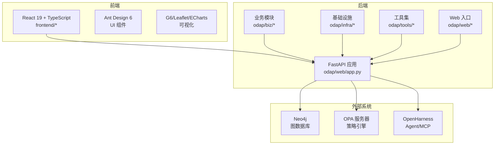
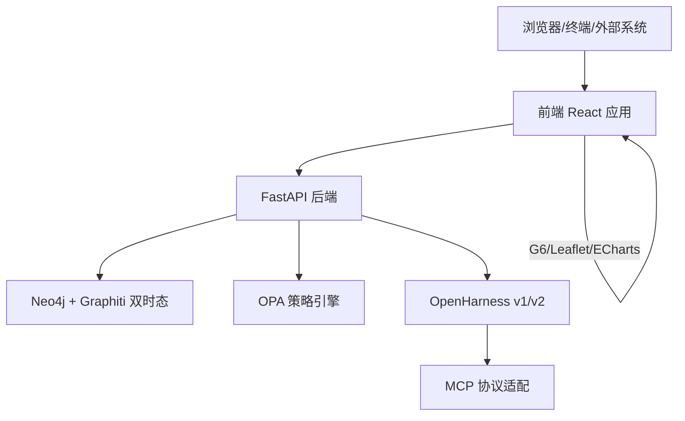
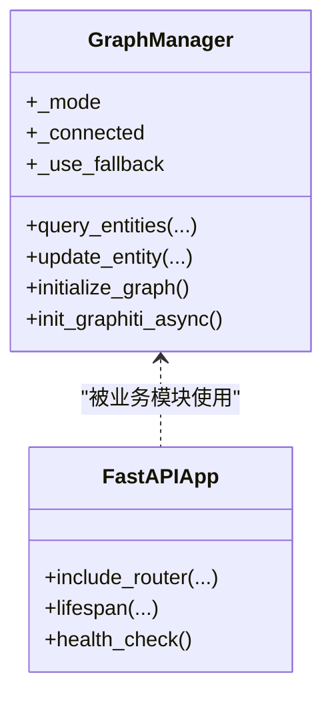
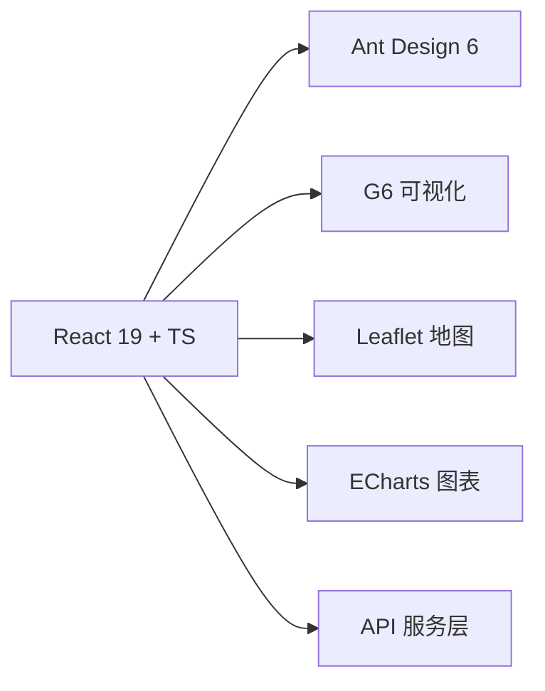
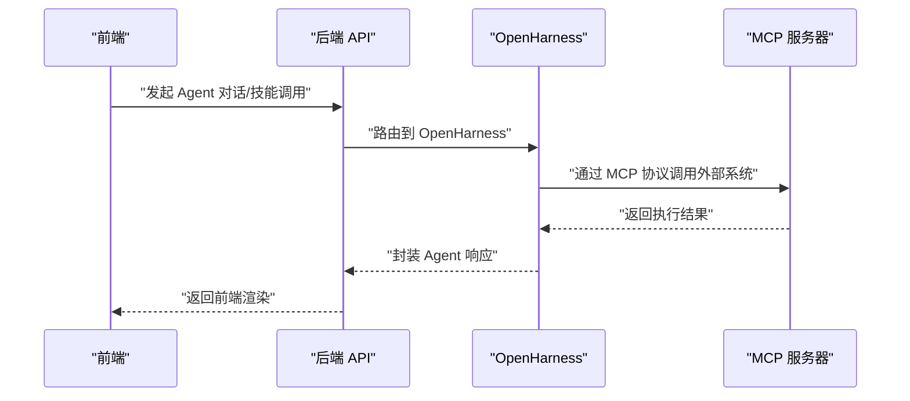
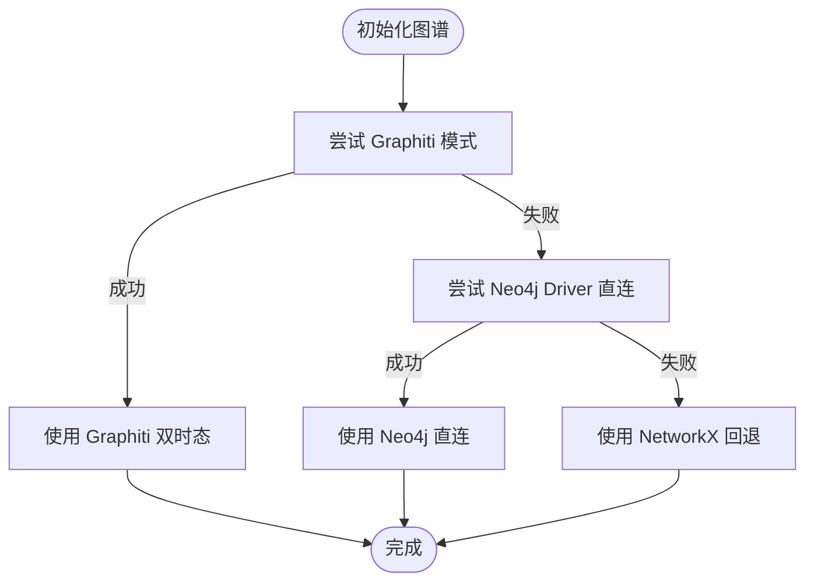
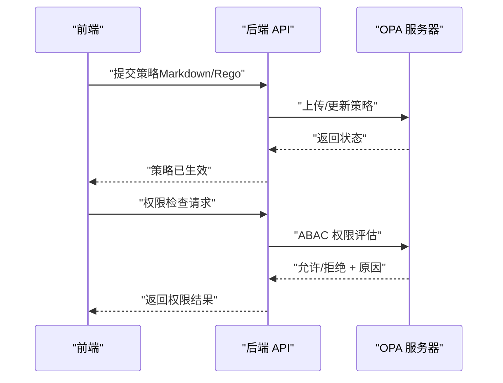
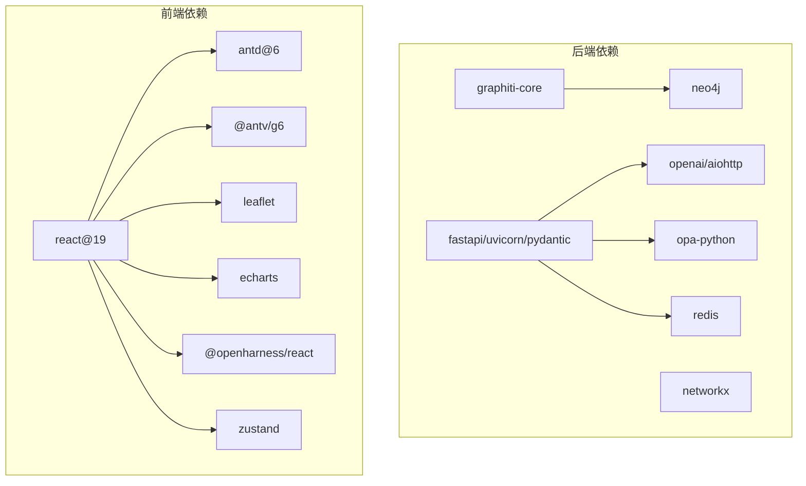

# 技术栈

<cite>
**本文引用的文件**
- [requirements.txt](file://requirements.txt)
- [package.json](file://frontend/package.json)
- [docker-compose.yml](file://docker/docker-compose.yml)
- [agent_config.yaml](file://config/agent_config.yaml)
- [AGENTS.md](file://AGENTS.md)
- [odap/web/app.py](file://odap/web/app.py)
- [odap/infra/graph/graph_service.py](file://odap/infra/graph/graph_service.py)
- [odap/infra/opa/opa_service.py](file://odap/infra/opa/opa_service.py)
- [odap/infra/opa/routes.py](file://odap/infra/opa/routes.py)
- [odap/infra/opa/opa_policy.rego](file://odap/infra/opa/opa_policy.rego)
- [odap/infra/openharness/v2_adapter.py](file://odap/infra/openharness/v2_adapter.py)
- [odap/integration/openharness_agent/api/routes.py](file://odap/integration/openharness_agent/api/routes.py)
- [odap/tools/visualization/plotting.py](file://odap/tools/visualization/plotting.py)
- [frontend/src/modules/ontology/components/GraphCanvas.tsx](file://frontend/src/modules/ontology/components/GraphCanvas.tsx)
- [frontend/src/modules/ontology/pages/OntologySemanticNetwork.tsx](file://frontend/src/modules/ontology/pages/OntologySemanticNetwork.tsx)
- [frontend/src/modules/shared/services/api.ts](file://frontend/src/modules/shared/services/api.ts)
- [docs/03-modules/qa_engine/DESIGN.md](file://docs/03-modules/qa_engine/DESIGN.md)
- [docs/04-ui/Frontend_Component_Design.md](file://docs/04-ui/Frontend_Component_Design.md)
- [docs/07-adr/ADR-009_markdown_编写_opa_策略.md](file://docs/07-adr/ADR-009_markdown_编写_opa_策略.md)
- [specs/001-odap-platform/spec.md](file://specs/001-odap-platform/spec.md)
</cite>

## 目录
1. [简介](#简介)
2. [项目结构](#项目结构)
3. [核心组件](#核心组件)
4. [架构总览](#架构总览)
5. [详细组件分析](#详细组件分析)
6. [依赖分析](#依赖分析)
7. [性能考量](#性能考量)
8. [故障排查指南](#故障排查指南)
9. [结论](#结论)
10. [附录](#附录)

## 简介
本文件面向 ODAP 平台，系统性梳理并解释技术栈选型与协作关系，涵盖后端（Python 3.11+、FastAPI、Neo4j/NetworkX）、前端（React 19、TypeScript、Ant Design、G6、Leaflet）、Agent 技术栈（OpenHarness、Agent Loop、Swarm、MCP）、知识图谱技术（Graphiti 双时态知识图谱）、策略治理（OPA 开放策略代理）、LLM 集成（OpenAI/Anthropic/DeepSeek）。文档同时给出技术选型原因、组件协作关系、优势与局限性，并提供可视化图示帮助读者快速把握整体架构。

## 项目结构
ODAP 采用“模块化单体”后端与“前端独立工程”的组织方式：
- 后端：以 FastAPI 为核心，按业务域划分模块（biz/infra/tools/web），统一在应用入口集中注册路由。
- 前端：React 19 + TypeScript，Ant Design 6 为基础 UI 组件库，结合 G6、Leaflet、ECharts 等可视化库。
- Agent 与 MCP：通过 OpenHarness v1/v2 适配层与后端集成，提供编排、工具注册、会话记忆、沙箱等能力。
- 策略治理：OPA 作为策略引擎，支持 Markdown 编写策略并通过 Bundle 热更新。
- 知识图谱：Graphiti 双时态能力为核心，Neo4j 为图数据库，NetworkX 作为回退方案。

**图示来源**
- [odap/web/app.py:122-191](file://odap/web/app.py#L122-L191)
- [frontend/package.json:15-33](file://frontend/package.json#L15-L33)
- [docker/docker-compose.yml:1-97](file://docker/docker-compose.yml#L1-L97)

**章节来源**
- [odap/web/app.py:122-191](file://odap/web/app.py#L122-L191)
- [frontend/package.json:15-33](file://frontend/package.json#L15-L33)
- [docker/docker-compose.yml:1-97](file://docker/docker-compose.yml#L1-L97)

## 核心组件
- 后端框架与路由
  - FastAPI：统一 API 入口，集中注册 30+ 路由模块，提供健康检查与性能监控端点。
  - 路由注册：业务模块路由在应用启动时统一 include，便于集中管理与扩展。
- 图谱与存储
  - Graphiti 双时态知识图谱：核心能力，支持 valid_time + transaction_time 的时序推理与版本管理。
  - Neo4j：生产图数据库，Graphiti 依赖其进行索引与约束构建、Cypher 查询与写入。
  - NetworkX：回退方案，无外部依赖时使用纯内存图谱。
- 策略治理
  - OPA：ABAC 策略评估、策略 Bundle 热更新、策略沙箱、批量权限检查与缓存。
  - Markdown → Rego 转换：降低策略编写门槛，支持版本化与评审。
- Agent 与 MCP
  - OpenHarness v1/v2：提供 Agent 编排、Swarm、工具注册、会话记忆、MCP 协议适配。
  - MCP：标准化外部仿真系统接入，支持运行时动态添加/移除 MCP Server。
- 前端技术栈
  - React 19 + TypeScript：类型安全与现代化生态。
  - Ant Design 6：企业级 UI 组件库。
  - G6/Leaflet/ECharts：图谱、地图、图表等可视化渲染。
- LLM 集成
  - 支持 OpenAI/Anthropic/DeepSeek，配置文件中提供多提供商示例与自定义 base_url。

**章节来源**
- [odap/web/app.py:146-191](file://odap/web/app.py#L146-L191)
- [odap/infra/graph/graph_service.py:71-143](file://odap/infra/graph/graph_service.py#L71-L143)
- [odap/infra/opa/opa_service.py:455-717](file://odap/infra/opa/opa_service.py#L455-L717)
- [docs/07-adr/ADR-009_markdown_编写_opa_策略.md:19-37](file://docs/07-adr/ADR-009_markdown_编写_opa_策略.md#L19-L37)
- [odap/infra/openharness/v2_adapter.py](file://odap/infra/openharness/v2_adapter.py)
- [odap/integration/openharness_agent/api/routes.py](file://odap/integration/openharness_agent/api/routes.py)
- [frontend/package.json:15-33](file://frontend/package.json#L15-L33)
- [agent_config.yaml:1-23](file://config/agent_config.yaml#L1-L23)

## 架构总览
ODAP 采用“后端 API + 多种前端可视化 + Agent/MCP + 策略治理 + 双时态图谱”的整体架构。后端通过 FastAPI 提供统一 API，前端通过 Ant Design 与可视化库进行交互，Agent 通过 OpenHarness 与 MCP 协议接入外部系统，策略治理通过 OPA 实现细粒度权限控制，知识图谱通过 Graphiti 提供双时态能力支撑本体与问答。

**图示来源**
- [odap/web/app.py:122-191](file://odap/web/app.py#L122-L191)
- [odap/infra/graph/graph_service.py:540-602](file://odap/infra/graph/graph_service.py#L540-L602)
- [odap/infra/opa/opa_service.py:373-450](file://odap/infra/opa/opa_service.py#L373-L450)
- [odap/infra/openharness/v2_adapter.py](file://odap/infra/openharness/v2_adapter.py)
- [frontend/package.json:15-33](file://frontend/package.json#L15-L33)

## 详细组件分析

### 后端技术栈（Python/FastAPI/Neo4j/NetworkX）
- 选型原因
  - Python 3.11+：兼顾性能与生态，支持异步与类型注解。
  - FastAPI：自动生成 OpenAPI 文档、高性能、类型安全。
  - Neo4j：成熟图数据库，支持大规模图谱与复杂关系查询。
  - NetworkX：回退方案，保障在无外部依赖时仍可运行。
- 协作关系
  - GraphManager 作为三层降级策略的统一入口：Graphiti → Neo4j Driver → NetworkX fallback。
  - 应用启动时初始化 OpenHarness v1/v2，注册大量业务路由。
- 优势与局限性
  - 优势：三层降级保障可用性；双时态能力支撑本体版本管理与时序推理。
  - 局限性：Graphiti 依赖 Neo4j，若 Neo4j 不可用则降级影响部分能力。

**图示来源**
- [odap/infra/graph/graph_service.py:71-143](file://odap/infra/graph/graph_service.py#L71-L143)
- [odap/web/app.py:68-120](file://odap/web/app.py#L68-L120)

**章节来源**
- [odap/infra/graph/graph_service.py:71-143](file://odap/infra/graph/graph_service.py#L71-L143)
- [odap/web/app.py:68-120](file://odap/web/app.py#L68-L120)

### 前端技术栈（React 19/TypeScript/Ant Design/G6/Leaflet）
- 选型原因
  - React 19：最新稳定版本，具备良好性能与生态。
  - TypeScript：类型安全，提升大型前端项目的可维护性。
  - Ant Design 6：企业级 UI 组件库，统一设计语言。
  - G6/Leaflet/ECharts：针对图谱、地图、图表的高效渲染。
- 协作关系
  - 前端模块化组织，Ontology/Agent/QA 等模块分别承载不同业务。
  - API 服务层统一管理后端接口，支持会话、状态管理与可视化组件。
- 优势与局限性
  - 优势：组件化程度高、路由清晰、可视化丰富。
  - 局限性：复杂交互与状态管理需谨慎设计，避免过度耦合。

**图示来源**
- [frontend/package.json:15-33](file://frontend/package.json#L15-L33)
- [docs/04-ui/Frontend_Component_Design.md:12-24](file://docs/04-ui/Frontend_Component_Design.md#L12-L24)

**章节来源**
- [frontend/package.json:15-33](file://frontend/package.json#L15-L33)
- [docs/04-ui/Frontend_Component_Design.md:12-24](file://docs/04-ui/Frontend_Component_Design.md#L12-L24)

### Agent 技术栈（OpenHarness/Agent Loop/Swarm/MCP）
- 选型原因
  - OpenHarness：提供 Agent 编排、Swarm、工具注册、会话记忆、MCP 协议适配等能力。
  - Agent Loop：基于 OODA 循环的编排模型，支持按意图自动规划 subAgent。
  - MCP：标准化外部仿真系统接入，支持运行时动态管理。
- 协作关系
  - OpenHarness v1/v2 适配层与后端集成，Agent 路由与工具注册通过 OpenHarness 管理。
  - 前端通过 OpenHarness React 组件与 Agent 交互。
- 优势与局限性
  - 优势：Agent 编排灵活、工具与技能可热插拔、MCP 支持外部系统接入。
  - 局限性：依赖 OpenHarness 的稳定性与升级节奏，需避免深度定制破坏升级路径。

**图示来源**
- [odap/infra/openharness/v2_adapter.py](file://odap/infra/openharness/v2_adapter.py)
- [odap/integration/openharness_agent/api/routes.py](file://odap/integration/openharness_agent/api/routes.py)
- [frontend/package.json:22](file://frontend/package.json#L22)

**章节来源**
- [odap/infra/openharness/v2_adapter.py](file://odap/infra/openharness/v2_adapter.py)
- [odap/integration/openharness_agent/api/routes.py](file://odap/integration/openharness_agent/api/routes.py)
- [frontend/package.json:22](file://frontend/package.json#L22)

### 知识图谱技术（Graphiti 双时态知识图谱）
- 选型原因
  - Graphiti：双时态能力（valid_time + transaction_time）满足本体版本管理与时序推理需求。
  - Neo4j：作为底层图数据库，提供高性能索引与查询能力。
  - NetworkX：回退方案，保障在无外部依赖时仍可运行。
- 协作关系
  - GraphManager 作为统一入口，按需选择 Graphiti/Neo4j/NetworkX 模式。
  - 前端通过 G6/Leaflet/ECharts 渲染图谱与地图。
- 优势与局限性
  - 优势：双时态能力完善、可与 LLM/嵌入向量结合。
  - 局限性：Graphiti 依赖 Neo4j，部署与运维成本较高。

**图示来源**
- [odap/infra/graph/graph_service.py:145-184](file://odap/infra/graph/graph_service.py#L145-L184)

**章节来源**
- [odap/infra/graph/graph_service.py:145-184](file://odap/infra/graph/graph_service.py#L145-L184)

### 策略治理（OPA 开放策略代理）
- 选型原因
  - OPA：支持 ABAC 模型、策略热更新 Bundle、策略沙箱、批量权限检查与缓存。
  - Markdown → Rego 转换：降低策略编写门槛，便于版本化与评审。
- 协作关系
  - 后端通过 OPAManager 调用 OPA REST API 或本地评估，支持 fail-closed 与缓存。
  - 前端提供策略管理页面，支持 Markdown 编写与查看 Rego 内容。
- 优势与局限性
  - 优势：策略可热更新、可模拟、可审计。
  - 局限性：复杂策略编写仍需一定门槛，依赖 OPA 服务可用性。

**图示来源**
- [odap/infra/opa/opa_service.py:373-450](file://odap/infra/opa/opa_service.py#L373-L450)
- [odap/infra/opa/routes.py](file://odap/infra/opa/routes.py)
- [frontend/src/modules/shared/services/api.ts:1357-1395](file://frontend/src/modules/shared/services/api.ts#L1357-L1395)

**章节来源**
- [odap/infra/opa/opa_service.py:373-450](file://odap/infra/opa/opa_service.py#L373-L450)
- [frontend/src/modules/shared/services/api.ts:1357-1395](file://frontend/src/modules/shared/services/api.ts#L1357-L1395)

### LLM 集成（OpenAI/Anthropic/DeepSeek）
- 选型原因
  - 支持多家 LLM 提供商，便于在不同场景下切换与优化。
  - 配置文件提供多提供商示例，包括自定义 base_url。
- 协作关系
  - 后端通过 LLM 客户端与 OpenAI/Anthropic/DeepSeek 交互，用于嵌入向量与对话。
  - 前端通过 Agent 页面与 LLM 进行交互。
- 优势与局限性
  - 优势：多提供商支持、可配置性强。
  - 局限性：成本与稳定性取决于外部服务。

**章节来源**
- [agent_config.yaml:1-23](file://config/agent_config.yaml#L1-L23)
- [odap/infra/graph/graph_service.py:445-476](file://odap/infra/graph/graph_service.py#L445-L476)

## 依赖分析
- 后端依赖
  - 核心：graphiti-core、neo4j、networkx、fastapi、uvicorn、pydantic、httpx、redis、openai、aiohttp。
  - 权限：opa-python。
  - 开发：pytest、black、flake8。
- 前端依赖
  - React 19、Ant Design 6、@antv/g6、leaflet、echarts、@openharness/react、zustand、react-router-dom。
- 外部服务
  - Neo4j、OPA 服务器、Redis。

**图示来源**
- [requirements.txt:5-42](file://requirements.txt#L5-L42)
- [frontend/package.json:15-33](file://frontend/package.json#L15-L33)

**章节来源**
- [requirements.txt:5-42](file://requirements.txt#L5-L42)
- [frontend/package.json:15-33](file://frontend/package.json#L15-L33)

## 性能考量
- 图查询性能
  - GraphManager 实现连接池、断路器与查询时间监控，保障在高并发下的稳定性。
- 策略评估性能
  - OPAManager 提供缓存与批量权限检查，减少 OPA 服务压力。
- 前端渲染性能
  - G6/Leaflet/ECharts 针对大数据量提供缩放、LOD、最小化等优化策略。
- 部署与资源
  - Docker Compose 编排 Neo4j、OPA、Redis，合理设置内存与端口映射。

**章节来源**
- [odap/infra/graph/graph_service.py:299-443](file://odap/infra/graph/graph_service.py#L299-L443)
- [odap/infra/opa/opa_service.py:473-537](file://odap/infra/opa/opa_service.py#L473-L537)
- [frontend/src/modules/ontology/components/GraphCanvas.tsx:1004-1031](file://frontend/src/modules/ontology/components/GraphCanvas.tsx#L1004-L1031)

## 故障排查指南
- 健康检查
  - 后端提供 /health 端点，检查 OpenHarness v1/v2、Graphiti、OPA 等状态。
- 图谱连接问题
  - GraphManager 支持三层降级与重连，若 Neo4j 不可用则自动切换至 NetworkX。
- 策略评估异常
  - OPAManager 支持 fail-closed 与本地回退，出现异常时返回拒绝并记录原因。
- 前端可视化渲染失败
  - G6 渲染失败时进行销毁与重试，避免内存泄漏。

**章节来源**
- [odap/web/app.py:221-242](file://odap/web/app.py#L221-L242)
- [odap/infra/graph/graph_service.py:186-213](file://odap/infra/graph/graph_service.py#L186-L213)
- [odap/infra/opa/opa_service.py:538-558](file://odap/infra/opa/opa_service.py#L538-L558)
- [frontend/src/modules/ontology/components/GraphCanvas.tsx:991-1002](file://frontend/src/modules/ontology/components/GraphCanvas.tsx#L991-L1002)

## 结论
ODAP 技术栈围绕“双时态知识图谱 + Agent 编排 + 策略治理 + 多样化可视化”构建，后端以 FastAPI 为核心，前端以 React 19 为基础，配合 OpenHarness 与 MCP 实现智能体与外部系统的标准化对接。Graphiti 的双时态能力与 OPA 的策略治理共同保障了平台在复杂业务场景下的可追溯性与合规性。建议在部署与运维中重点关注 Neo4j 与 OPA 的可用性与性能监控，确保系统稳定运行。

## 附录
- 技术栈清单与版本参考
  - 后端：Python 3.11+、FastAPI、Neo4j、NetworkX、OPA、OpenHarness v1/v2、Redis、Pydantic、httpx、openai、aiohttp。
  - 前端：React 19、TypeScript、Ant Design 6、@antv/g6、leaflet、echarts、@openharness/react、zustand、react-router-dom。
  - 策略：OPA（Rego + Bundle + Markdown 转换）。
  - 知识图谱：Graphiti（valid_time + transaction_time）。
  - LLM：OpenAI/Anthropic/DeepSeek（含自定义 base_url）。

**章节来源**
- [AGENTS.md:3-4](file://AGENTS.md#L3-L4)
- [frontend/package.json:15-33](file://frontend/package.json#L15-L33)
- [requirements.txt:5-42](file://requirements.txt#L5-L42)
- [docs/07-adr/ADR-009_markdown_编写_opa_策略.md:19-37](file://docs/07-adr/ADR-009_markdown_编写_opa_策略.md#L19-L37)
- [specs/001-odap-platform/spec.md:140-141](file://specs/001-odap-platform/spec.md#L140-L141)