# 架构概览

<cite>
**本文档引用的文件**
- [ARCHITECTURE.md](file://docs/02-architecture/ARCHITECTURE.md)
- [ARCHITECTURE_FULL_CHAIN.md](file://docs/02-architecture/ARCHITECTURE_FULL_CHAIN.md)
- [ARCHITECTURE_EVOLVE.md](file://docs/02-architecture/ARCHITECTURE_EVOLVE.md)
- [ARCHITECTURE_BIZ.md](file://docs/02-architecture/ARCHITECTURE_BIZ.md)
- [ARCHITECTURE_WEB.md](file://docs/02-architecture/ARCHITECTURE_WEB.md)
- [app.py](file://odap/web/app.py)
- [graph_service.py](file://odap/infra/graph/graph_service.py)
- [opa_service.py](file://odap/infra/opa/opa_service.py)
- [object_service.py](file://odap/infra/object_service/object_service.py)
- [tools/__init__.py](file://odap/tools/__init__.py)
- [biz/core/ontology/__init__.py](file://odap/biz/core/ontology/__init__.py)
- [docker-compose.yml](file://docker/docker-compose.yml)
</cite>

## 目录
1. [简介](#简介)
2. [项目结构](#项目结构)
3. [核心组件](#核心组件)
4. [架构总览](#架构总览)
5. [详细组件分析](#详细组件分析)
6. [依赖关系分析](#依赖关系分析)
7. [性能考虑](#性能考虑)
8. [故障排除指南](#故障排除指南)
9. [结论](#结论)
10. [附录](#附录)

## 简介

ODAP（本体驱动分析决策平台）是一个基于本体知识图谱的智能决策系统，采用四层架构设计，支持多智能体协同、本体驱动推理和统一查询服务。该平台以"感知-理解-决策-执行"（OADP）业务语义为核心，通过OpenHarness Agent基础设施、Graphiti双时态知识图谱、Python Skills领域工具和OPA策略治理引擎，构建了一个完整的智能决策闭环。

### 核心设计理念

1. **本体驱动**：以Ontology为核心，实现语义级别的理解和推理
2. **工作空间隔离**：多场景数据完全隔离，通过命名空间实现
3. **统一查询服务**：Query First原则，禁止散落的域读取端点
4. **Agent安全默认**：通过OpenHarness Hook机制实现安全边界
5. **可视化配置管理**：各类规则/策略/逻辑统一定义，支持热生效

### OADP业务语义体系

平台采用独特的OADP（Observe-Analyze-Decide-Perform）闭环体系：

- **Observe（感知）**：数据采集与外部情报获取
- **Analyze（理解）**：本体驱动分析与知识图谱推理  
- **Decide（决策）**：策略校验与方案推荐
- **Perform（执行）**：行动实施与闭环反馈

## 项目结构

ODAP项目采用模块化分层架构，主要分为以下层次：

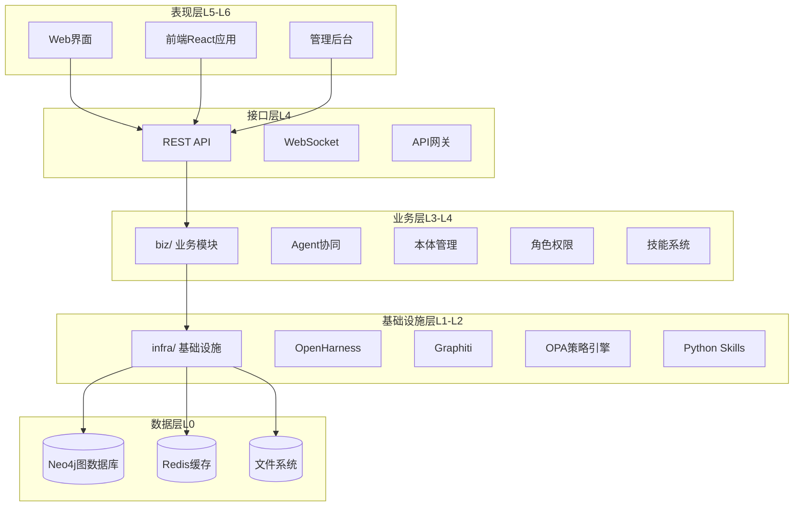

**图表来源**
- [ARCHITECTURE.md: 392-446:392-446](file://docs/02-architecture/ARCHITECTURE.md#L392-L446)
- [ARCHITECTURE_EVOLVE.md: 585-764:585-764](file://docs/02-architecture/ARCHITECTURE_EVOLVE.md#L585-L764)

### 四层组件职责定位

| 层次 | 组件 | 职责 | 核心价值 |
|------|------|------|---------|
| **L1** | OpenHarness | Agent Loop + Swarm + 工具调度 | 减少90% Agent基础设施代码 |
| **L2** | Graphiti | 双时态知识图谱 + 时序推理 | 支撑"当时发生了什么"的历史回溯 |
| **L3** | Python Skills | 领域特定工具（情报、决策），原生Tool接口 | 可插拔的领域能力 |
| **L4** | OPA | 策略治理 + 权限校验 | fail-close安全边界 |

**章节来源**
- [ARCHITECTURE.md: 448-456:448-456](file://docs/02-architecture/ARCHITECTURE.md#L448-L456)

## 核心组件

### 统一查询服务（QueryService）

统一查询服务是ODAP架构的重要创新，借鉴阿里巴巴UModel的Query Surface设计模式：

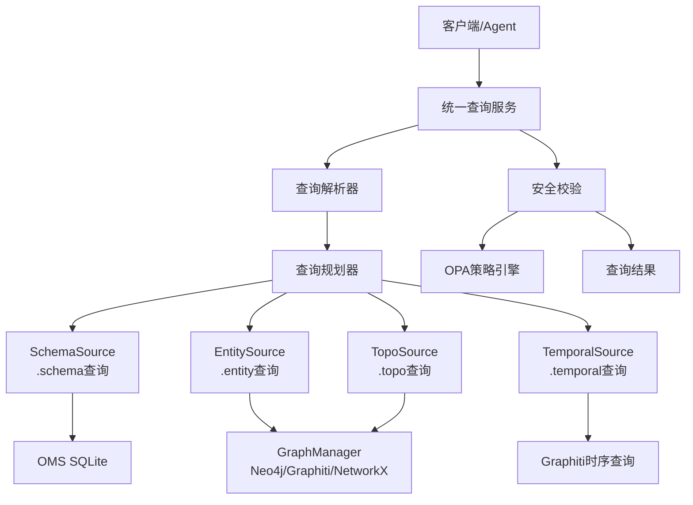

**图表来源**
- [ARCHITECTURE.md: 482-509:482-509](file://docs/02-architecture/ARCHITECTURE.md#L482-L509)

### 三Agent协同编排

ODAP采用三Agent协作模式，每个Agent都有明确的角色定位：

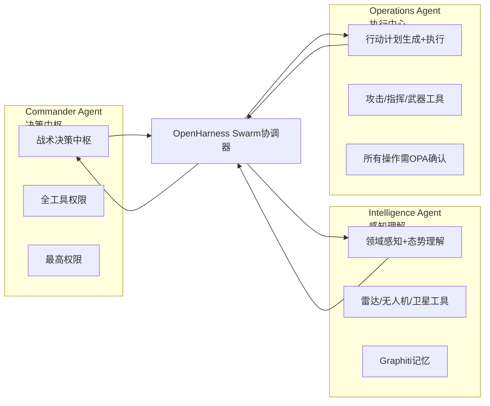

**图表来源**
- [ARCHITECTURE_BIZ.md: 39-90:39-90](file://docs/02-architecture/ARCHITECTURE_BIZ.md#L39-L90)

### 工作空间隔离机制

ODAP实现了严格的工作空间隔离，确保多场景数据的完全独立：

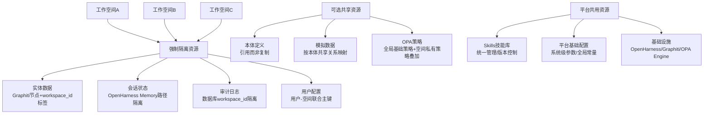

**图表来源**
- [ARCHITECTURE.md: 144-287:144-287](file://docs/02-architecture/ARCHITECTURE.md#L144-L287)

**章节来源**
- [ARCHITECTURE.md: 144-297:144-297](file://docs/02-architecture/ARCHITECTURE.md#L144-L297)

## 架构总览

ODAP的整体架构采用分层设计，从表现层到基础设施层逐层抽象：

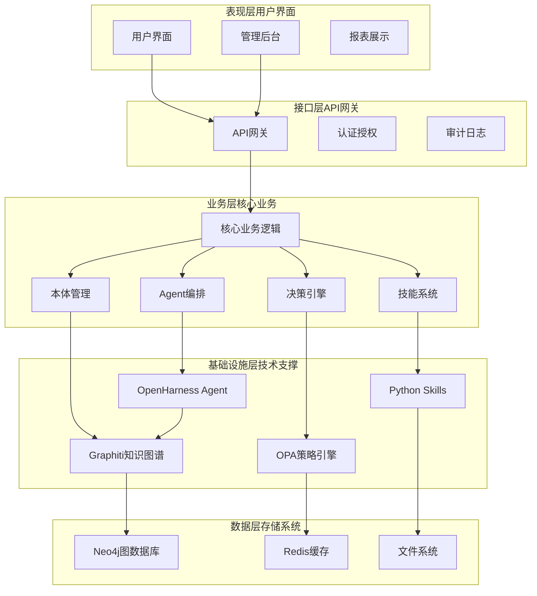

**图表来源**
- [ARCHITECTURE.md: 394-446:394-446](file://docs/02-architecture/ARCHITECTURE.md#L394-L446)
- [ARCHITECTURE_EVOLVE.md: 589-764:589-764](file://docs/02-architecture/ARCHITECTURE_EVOLVE.md#L589-L764)

### 数据流总览

ODAP的数据流遵循统一的处理模式：

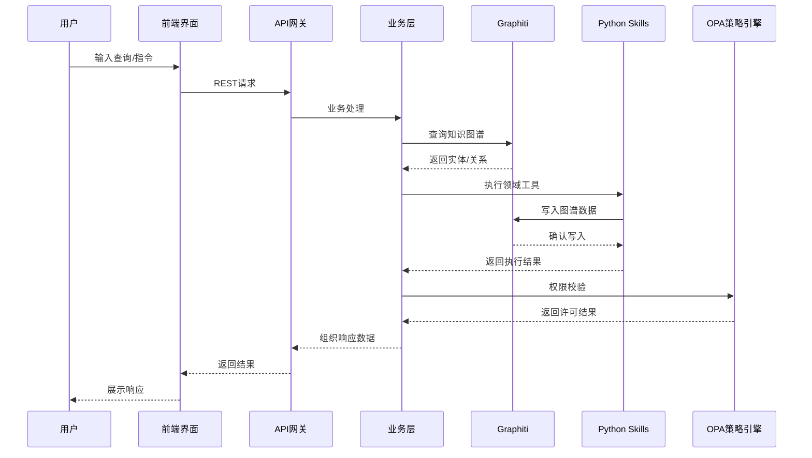

**图表来源**
- [ARCHITECTURE.md: 563-588:563-588](file://docs/02-architecture/ARCHITECTURE.md#L563-L588)

## 详细组件分析

### Graphiti知识图谱服务

Graphiti作为双时态知识图谱，提供了强大的时序推理能力：

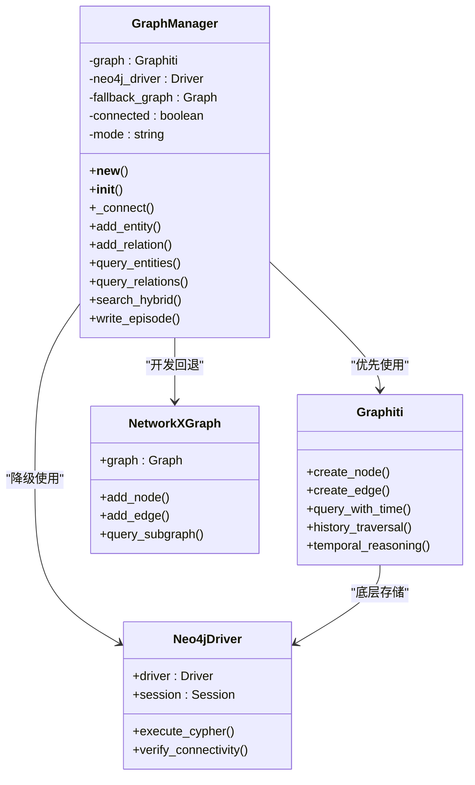

**图表来源**
- [graph_service.py: 71-200:71-200](file://odap/infra/graph/graph_service.py#L71-L200)

Graphiti服务采用三层降级策略：

1. **Graphiti模式**：双时态知识图谱，支持时序推理和历史回溯
2. **Neo4j直连模式**：无graphiti-core时的降级方案
3. **NetworkX回退模式**：纯内存图谱，用于开发和测试

**章节来源**
- [graph_service.py: 1-200:1-200](file://odap/infra/graph/graph_service.py#L1-L200)

### OPA策略治理引擎

OPA（Open Policy Agent）提供细粒度的权限控制和策略管理：

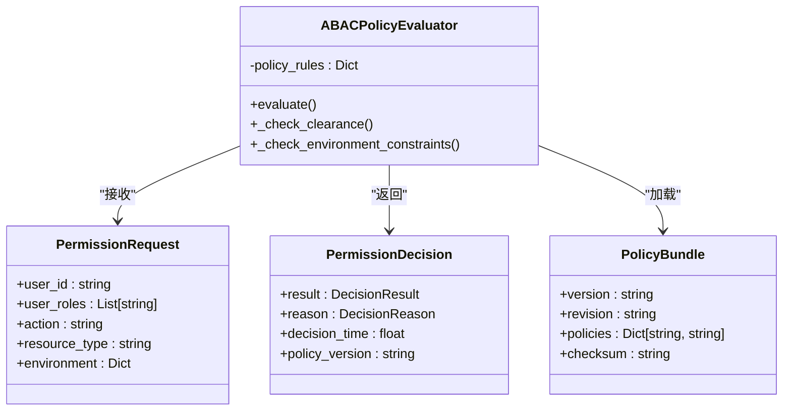

**图表来源**
- [opa_service.py: 114-200:114-200](file://odap/infra/opa/opa_service.py#L114-L200)

OPA支持多种访问控制模型：
- **RBAC**：基于角色的访问控制
- **ABAC**：基于属性的访问控制（默认）
- **PBAC**：基于属性的访问控制
- **CBAC**：基于上下文的访问控制

**章节来源**
- [opa_service.py: 1-200:1-200](file://odap/infra/opa/opa_service.py#L1-L200)

### Python Skills技能系统

ODAP采用双层技能体系，支持领域特定工具和通用工具：

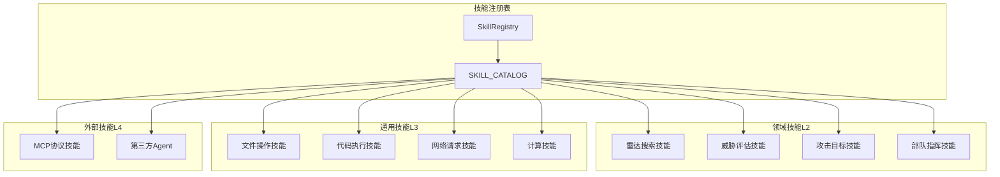

**图表来源**
- [tools/__init__.py: 1-35:1-35](file://odap/tools/__init__.py#L1-L35)

技能系统特点：
- **原生Tool接口**：Python Skills直接接入OpenHarness
- **热插拔机制**：技能注册无需重启，配置变更热生效
- **分层管理**：领域技能、通用技能、外部技能三级架构

**章节来源**
- [tools/__init__.py: 1-35:1-35](file://odap/tools/__init__.py#L1-L35)

### 对象虚拟化层（OSv2）

OSv2提供逻辑统一、物理解耦的对象访问层：

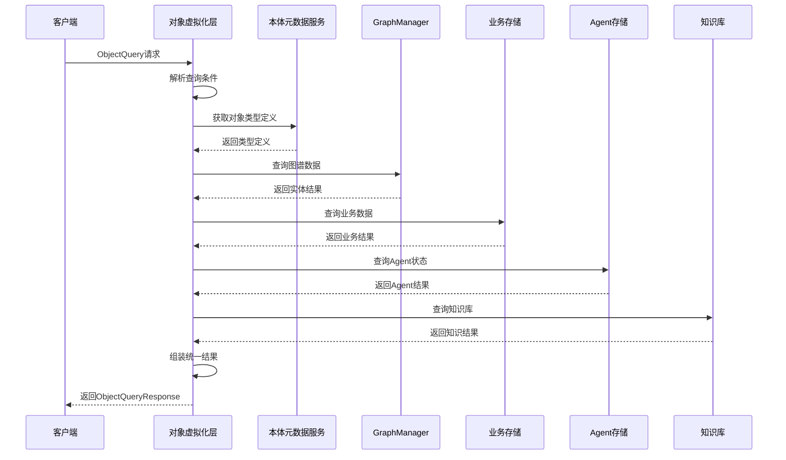

**图表来源**
- [object_service.py: 52-93:52-93](file://odap/infra/object_service/object_service.py#L52-L93)

**章节来源**
- [object_service.py: 1-200:1-200](file://odap/infra/object_service/object_service.py#L1-L200)

## 依赖关系分析

### 模块依赖图

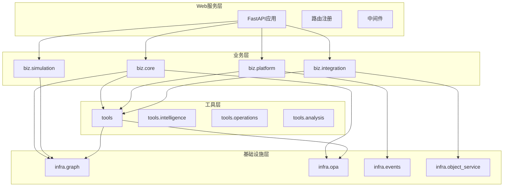

**图表来源**
- [ARCHITECTURE_EVOLVE.md: 766-771:766-771](file://docs/02-architecture/ARCHITECTURE_EVOLVE.md#L766-L771)

### 外部依赖关系

ODAP的主要外部依赖包括：

| 依赖组件 | 版本 | 用途 | 配置方式 |
|----------|------|------|----------|
| **Neo4j** | 5.x | 图数据库存储 | 环境变量配置 |
| **OpenHarness** | 2.x | Agent基础设施 | CLI初始化 |
| **OPA** | 0.58.0 | 策略治理引擎 | Docker卷挂载 |
| **Redis** | 6.x | 缓存存储 | Docker服务依赖 |
| **React** | 19.x | 前端框架 | Vite构建 |
| **FastAPI** | 0.100.x | 后端框架 | Python包管理 |

**章节来源**
- [docker-compose.yml: 1-97:1-97](file://docker/docker-compose.yml#L1-L97)

## 性能考虑

### 查询性能优化

1. **缓存策略**：Redis缓存热点查询结果
2. **连接池管理**：GraphManager连接池复用
3. **异步处理**：大量使用asyncio提升并发性能
4. **分页查询**：默认限制查询结果数量

### 系统监控

ODAP提供全面的性能监控能力：

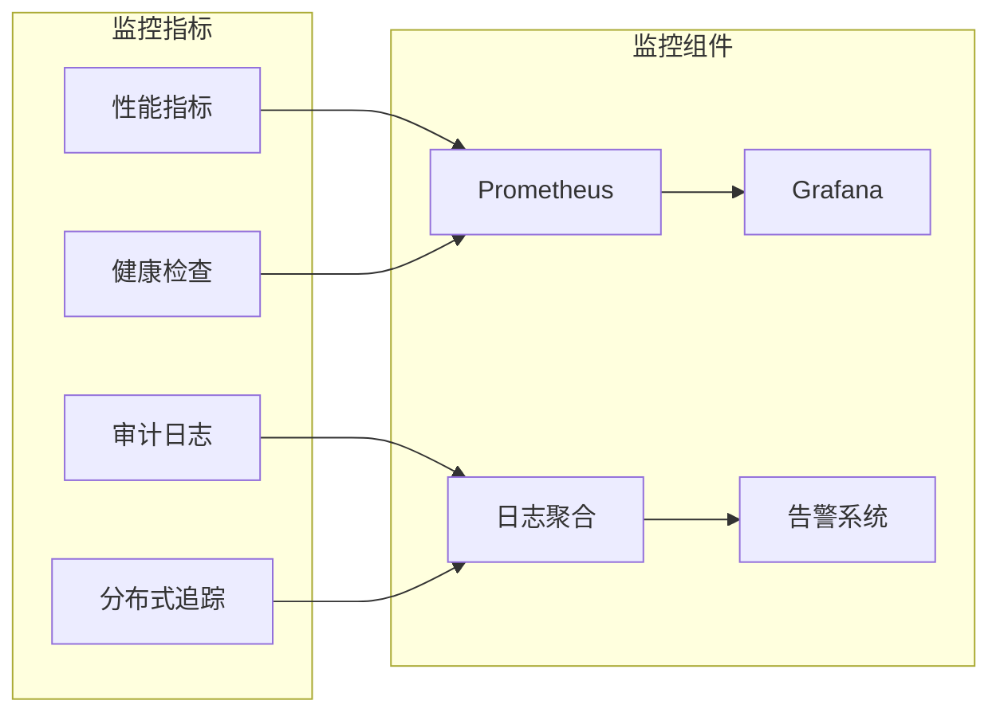

### 部署拓扑

ODAP支持多种部署模式：

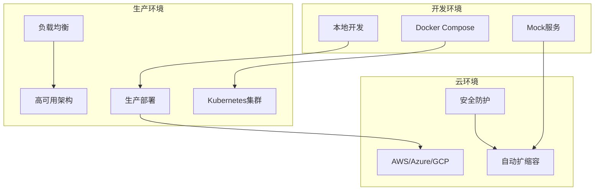

**图表来源**
- [docker-compose.yml: 1-97:1-97](file://docker/docker-compose.yml#L1-L97)

## 故障排除指南

### 常见问题诊断

1. **Graphiti连接失败**
   - 检查Neo4j服务状态
   - 验证连接凭据配置
   - 查看连接池状态

2. **OPA策略拒绝**
   - 检查用户角色权限
   - 验证策略规则配置
   - 查看策略执行日志

3. **Agent初始化失败**
   - 检查OpenHarness服务状态
   - 验证模型配置
   - 查看工具注册状态

### 健康检查端点

系统提供完整的健康检查机制：

```python
@app.get("/health")
async def health_check():
    """健康检查端点"""
    return {
        "status": "healthy",
        "openharness_v1": harness is not None,
        "openharness_v2": status_info,
        "graphiti": graphiti_status,
        "version": "2.0.0"
    }
```

**章节来源**
- [app.py: 221-242:221-242](file://odap/web/app.py#L221-L242)

## 结论

ODAP平台通过四层架构设计，成功实现了本体驱动的智能决策系统。其核心优势包括：

1. **架构清晰**：四层分离，职责明确，便于维护和扩展
2. **安全可靠**：OPA策略治理，Agent安全默认，工作空间隔离
3. **性能优异**：统一查询服务，缓存优化，异步处理
4. **可扩展性强**：技能热插拔，模块化设计，多Agent协同

平台采用的OADP业务语义体系和统一查询服务设计，为复杂场景下的智能决策提供了坚实的技术基础。通过持续的架构演进和优化，ODAP能够适应不断变化的业务需求，为用户提供可靠的本体驱动分析决策服务。

## 附录

### 技术选型决策

| 组件 | 选项A | 选项B | 选项C | 决策 | 权衡 |
|------|-------|-------|-------|------|------|
| **Agent框架** | LangGraph | OpenHarness | AutoGen | **OpenHarness** | 开源+生产级+多Agent内置，节省90%代码 |
| **知识图谱** | Neo4j | Amazon Neptune | Graphiti | **Graphiti** | 双时态原生支持，支撑历史回溯 |
| **策略引擎** | OPA | Cedar | Casbin | **OPA** | Rego语言灵活+生态丰富+生产验证 |
| **图数据库** | Neo4j | NetworkX | Memgraph | **Neo4j** | 向量检索+时序+ACID，成熟稳定 |
| **Agent LLM** | Claude | GPT-4 | DeepSeek | **混合** | Commander用强推理，Intelligence用快速 |

### 架构演进路线图

平台按照Phase划分进行演进：

- **Phase 0**：基础设施搭建（已完成）
- **Phase 1**：单Agent闭环（已完成）  
- **Phase 2**：三Agent协同（已完成）
- **Phase 3**：生产化（已完成）
- **Phase 4**：高级特性（进行中）

**章节来源**
- [ARCHITECTURE_EVOLVE.md: 441-581:441-581](file://docs/02-architecture/ARCHITECTURE_EVOLVE.md#L441-L581)