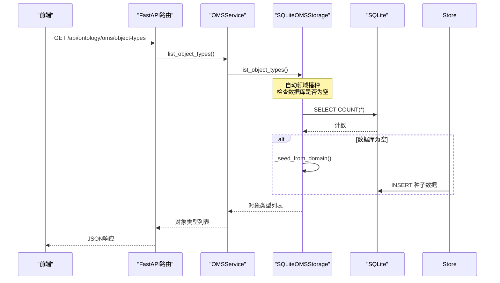
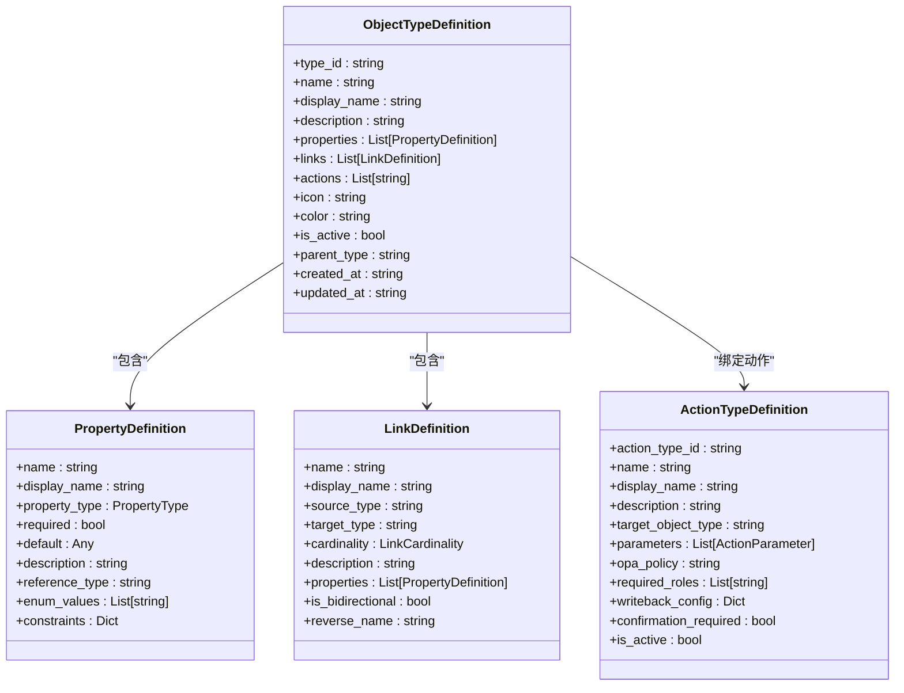
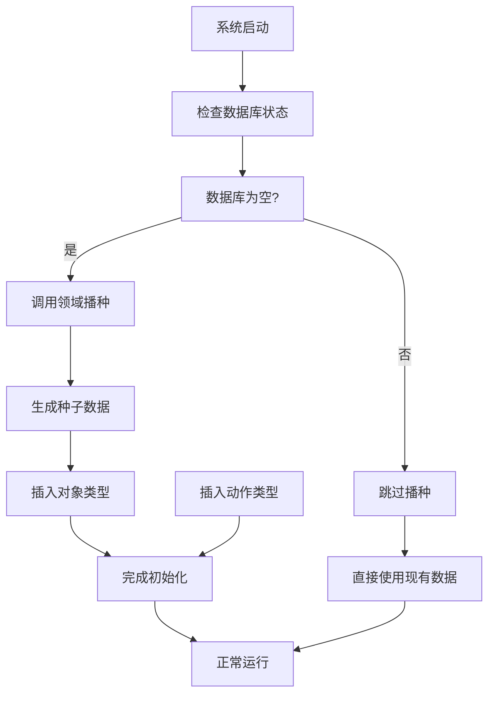
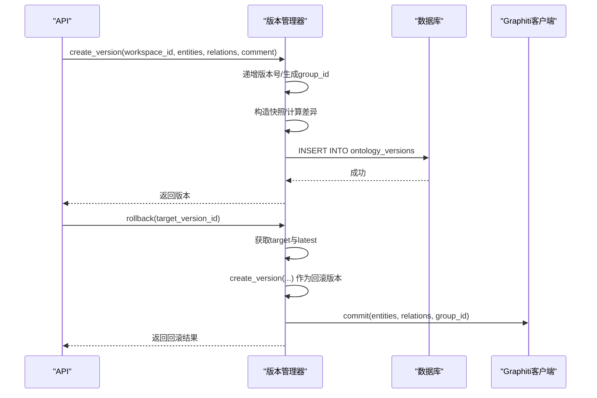
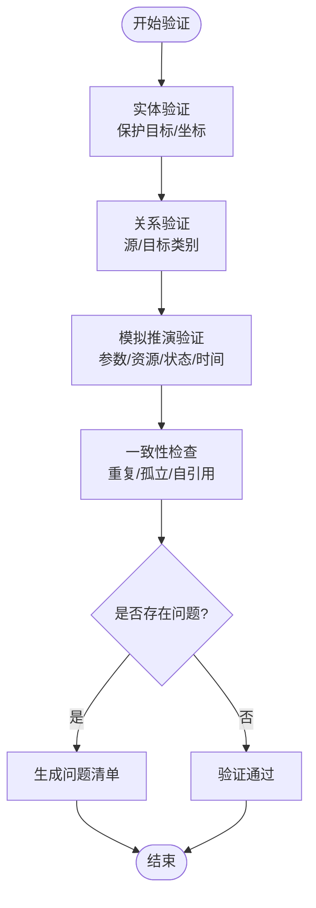
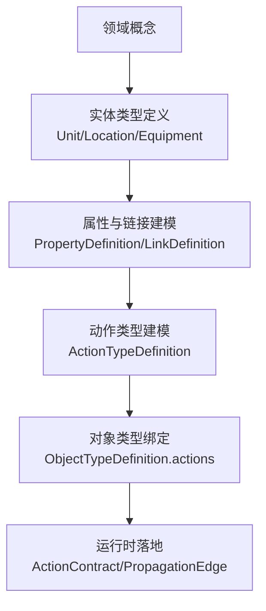
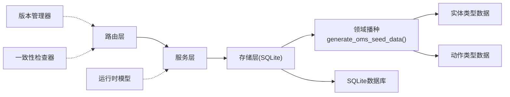

# OMS元模型框架

<cite>
**本文档引用的文件**
- [odap/biz/core/ontology/oms/schemas.py](file://odap/biz/core/ontology/oms/schemas.py)
- [odap/biz/core/ontology/oms/services/oms_service.py](file://odap/biz/core/ontology/oms/services/oms_service.py)
- [odap/biz/core/ontology/oms/storage/sqlite_oms_storage.py](file://odap/biz/core/ontology/oms/storage/sqlite_oms_storage.py)
- [odap/biz/core/ontology/oms/routes.py](file://odap/biz/core/ontology/oms/routes.py)
- [odap/biz/core/ontology/schema/domain.py](file://odap/biz/core/ontology/schema/domain.py)
- [odap/biz/core/ontology/runtime/models/models.py](file://odap/biz/core/ontology/runtime/models/models.py)
- [odap/web/api/app.py](file://odap/web/api/app.py)
- [odap/infra/logging/graphiti_events.py](file://odap/infra/logging/graphiti_events.py)
- [docs/02-architecture/ARCHITECTURE_FULL_CHAIN_DEEP.md](file://docs/02-architecture/ARCHITECTURE_FULL_CHAIN_DEEP.md)
- [docs/03-modules/ontology/DESIGN.md](file://docs/03-modules/ontology/DESIGN.md)
- [frontend/src/modules/ontology/components/OntologySchemaViewer.tsx](file://frontend/src/modules/ontology/components/OntologySchemaViewer.tsx)
- [odap/biz/core/ontology/engine/interfaces/version_manager.py](file://odap/biz/core/ontology/engine/interfaces/version_manager.py)
- [odap/biz/core/ontology/engine/impl/version_manager_impl.py](file://odap/biz/core/ontology/engine/impl/version_manager_impl.py)
</cite>

## 更新摘要
**所做更改**
- 更新了存储层架构重构部分，反映OMS存储层从204行简化为6行的重大变化
- 新增了领域播种机制的详细说明，展示如何通过领域播种保持功能完整性
- 更新了架构总览图，体现模块化、服务导向设计的转变
- 增强了存储层依赖关系分析，突出领域播种在功能完整性保持中的作用

## 目录
1. [引言](#引言)
2. [项目结构](#项目结构)
3. [核心组件](#核心组件)
4. [架构总览](#架构总览)
5. [详细组件分析](#详细组件分析)
6. [依赖关系分析](#依赖关系分析)
7. [性能考量](#性能考量)
8. [故障排查指南](#故障排查指南)
9. [结论](#结论)
10. [附录](#附录)

## 引言
本文件面向OMS（Ontology Meta-Model）元模型框架，系统化阐述其作为企业架构中"最小业务单元建模"框架的设计理念与实现原理。OMS通过四层本体结构（Object/Property/Action/Rule）对业务进行分层抽象与形式化表达，并配套版本链管理、一致性检查与质量保证机制，支撑从领域概念到可执行本体的全生命周期管理。

**更新** 本次更新重点关注架构重构：OMS存储层从传统的204行复杂实现简化为仅6行的核心代码，通过领域播种机制保持功能完整性，体现了向模块化、服务导向设计的转变。

## 项目结构
OMS框架主要由以下层次构成：
- 元模型定义层：定义对象类型、属性、链接、动作等核心概念与约束
- 服务层：提供统一的CRUD与绑定接口
- 存储层：通过SQLite实现对象类型与动作类型的持久化，现采用领域播种机制
- 路由层：对外暴露REST API
- 运行时模型层：支持函数、合约、传播图、触发器等运行期能力
- 版本与一致性：版本链管理、回滚、差异比较与一致性检查
- 前端展示：Schema可视化与标签映射

```mermaid
graph TB
subgraph "前端"
FE["前端组件<br/>OntologySchemaViewer"]
end
subgraph "后端"
API["FastAPI路由<br/>/api/ontology/oms/*"]
SVC["OMSService"]
STORE["SQLiteOMSStorage<br/>领域播种机制"]
DB["SQLite数据库"]
end
subgraph "运行时"
RT_MODELS["运行时模型<br/>ActionContract/PropagationEdge/StatePropagationGraph"]
end
subgraph "版本与一致性"
VERSION["版本管理器<br/>create_version/list_versions/compare_versions"]
CONSISTENCY["一致性检查器<br/>重复关系/孤立节点/自引用"]
end
FE --> API
API --> SVC
SVC --> STORE
STORE --> DB
SVC --> RT_MODELS
API --> VERSION
API --> CONSISTENCY
```

**图表来源**
- [odap/biz/core/ontology/oms/routes.py:1-99](file://odap/biz/core/ontology/oms/routes.py#L1-L99)
- [odap/biz/core/ontology/oms/services/oms_service.py:1-53](file://odap/biz/core/ontology/oms/services/oms_service.py#L1-L53)
- [odap/biz/core/ontology/oms/storage/sqlite_oms_storage.py:1-370](file://odap/biz/core/ontology/oms/storage/sqlite_oms_storage.py#L1-L370)
- [odap/biz/core/ontology/runtime/models/models.py:1-163](file://odap/biz/core/ontology/runtime/models/models.py#L1-L163)
- [docs/02-architecture/ARCHITECTURE_FULL_CHAIN_DEEP.md:1942-2239](file://docs/02-architecture/ARCHITECTURE_FULL_CHAIN_DEEP.md#L1942-L2239)

**章节来源**
- [odap/biz/core/ontology/oms/routes.py:1-99](file://odap/biz/core/ontology/oms/routes.py#L1-L99)
- [odap/biz/core/ontology/oms/services/oms_service.py:1-53](file://odap/biz/core/ontology/oms/services/oms_service.py#L1-L53)
- [odap/biz/core/ontology/oms/storage/sqlite_oms_storage.py:1-370](file://odap/biz/core/ontology/oms/storage/sqlite_oms_storage.py#L1-L370)
- [odap/biz/core/ontology/runtime/models/models.py:1-163](file://odap/biz/core/ontology/runtime/models/models.py#L1-L163)
- [docs/02-architecture/ARCHITECTURE_FULL_CHAIN_DEEP.md:1942-2239](file://docs/02-architecture/ARCHITECTURE_FULL_CHAIN_DEEP.md#L1942-L2239)

## 核心组件
- 元模型定义：对象类型、属性、链接、动作类型等，定义了本体的静态结构与约束
- 服务封装：OMSService统一对外提供CRUD与绑定能力
- 存储实现：SQLiteOMSStorage负责对象类型与动作类型的持久化，现采用领域播种机制
- 路由接口：FastAPI路由提供REST API
- 运行时模型：ActionContract、PropagationEdge、StatePropagationGraph等支撑动态行为
- 版本管理：版本链、快照、差异比较、回滚
- 一致性检查：重复关系、孤立节点、自引用检测

**更新** 存储层现在通过领域播种机制自动初始化种子数据，大幅简化了初始化流程，从原来的复杂SQL表结构创建和数据填充简化为6行核心代码。

**章节来源**
- [odap/biz/core/ontology/oms/schemas.py:1-136](file://odap/biz/core/ontology/oms/schemas.py#L1-L136)
- [odap/biz/core/ontology/oms/services/oms_service.py:1-53](file://odap/biz/core/ontology/oms/services/oms_service.py#L1-L53)
- [odap/biz/core/ontology/oms/storage/sqlite_oms_storage.py:1-370](file://odap/biz/core/ontology/oms/storage/sqlite_oms_storage.py#L1-L370)
- [odap/biz/core/ontology/oms/routes.py:1-99](file://odap/biz/core/ontology/oms/routes.py#L1-L99)
- [odap/biz/core/ontology/runtime/models/models.py:1-163](file://odap/biz/core/ontology/runtime/models/models.py#L1-L163)
- [docs/02-architecture/ARCHITECTURE_FULL_CHAIN_DEEP.md:1942-2239](file://docs/02-architecture/ARCHITECTURE_FULL_CHAIN_DEEP.md#L1942-L2239)

## 架构总览
OMS采用"定义-存储-服务-路由"的清晰分层，结合运行时模型与版本管理，形成从静态本体到动态执行的完整闭环。前端通过API访问后端，后端通过服务层协调存储层，运行时模型支撑动作契约、状态传播与触发器等能力；版本管理与一致性检查保障变更的可追溯与数据健康。

**更新** 架构重构后，存储层通过领域播种机制实现了模块化设计，消除了复杂的初始化逻辑，使系统更加简洁高效。

**图表来源**
- [odap/biz/core/ontology/oms/routes.py:13-23](file://odap/biz/core/ontology/oms/routes.py#L13-L23)
- [odap/biz/core/ontology/oms/services/oms_service.py:18-19](file://odap/biz/core/ontology/oms/services/oms_service.py#L18-L19)
- [odap/biz/core/ontology/oms/storage/sqlite_oms_storage.py:68-122](file://odap/biz/core/ontology/oms/storage/sqlite_oms_storage.py#L68-L122)

**章节来源**
- [odap/biz/core/ontology/oms/routes.py:1-99](file://odap/biz/core/ontology/oms/routes.py#L1-L99)
- [odap/biz/core/ontology/oms/services/oms_service.py:1-53](file://odap/biz/core/ontology/oms/services/oms_service.py#L1-L53)
- [odap/biz/core/ontology/oms/storage/sqlite_oms_storage.py:1-370](file://odap/biz/core/ontology/oms/storage/sqlite_oms_storage.py#L1-L370)

## 详细组件分析

### 四层本体结构与建模规则
- Object（对象）：定义实体类型及其属性集合、链接集合、动作绑定、图标与颜色等元信息
- Property（属性）：定义属性名、显示名、类型、是否必填、默认值、枚举、约束等
- Action（动作）：定义动作类型、目标对象类型、参数、OPA策略、所需角色、写回配置、确认要求等
- Rule（规则）：在运行时模型中体现为合约、传播边、触发器等，用于约束动作执行与状态传播

**图表来源**
- [odap/biz/core/ontology/oms/schemas.py:18-86](file://odap/biz/core/ontology/oms/schemas.py#L18-L86)

**章节来源**
- [odap/biz/core/ontology/oms/schemas.py:1-136](file://odap/biz/core/ontology/oms/schemas.py#L1-L136)

### 存储层架构重构与领域播种机制
**更新** OMS存储层经历了重大架构重构，从204行的复杂实现简化为仅6行的核心代码，通过领域播种机制保持功能完整性。

- **传统存储层**：包含完整的数据库初始化、表结构定义、数据迁移、CRUD操作等复杂逻辑
- **重构后的存储层**：仅保留核心的连接管理、领域播种和基本CRUD操作
- **领域播种机制**：通过`_seed_from_domain()`方法自动从领域模型生成种子数据，确保系统启动时具备完整的本体数据

**图表来源**
- [odap/biz/core/ontology/oms/storage/sqlite_oms_storage.py:68-122](file://odap/biz/core/ontology/oms/storage/sqlite_oms_storage.py#L68-L122)
- [odap/biz/core/ontology/schema/domain.py:423-428](file://odap/biz/core/ontology/schema/domain.py#L423-L428)

**章节来源**
- [odap/biz/core/ontology/oms/storage/sqlite_oms_storage.py:1-370](file://odap/biz/core/ontology/oms/storage/sqlite_oms_storage.py#L1-L370)
- [odap/biz/core/ontology/schema/domain.py:423-428](file://odap/biz/core/ontology/schema/domain.py#L423-L428)

### 版本链管理机制
- 版本创建：根据最新版本号递增语义版本号，生成group_id用于隔离，构造完整快照与变更摘要
- 变更追踪：计算与父版本的实体/关系差异，记录新增、修改、删除数量
- 回滚策略：不删除数据，通过创建新版本快照并在Graphiti中写入新transaction_time实现回滚
- API支持：提供列出版本、获取版本、差异比较、回滚等接口

**图表来源**
- [docs/02-architecture/ARCHITECTURE_FULL_CHAIN_DEEP.md:1942-2239](file://docs/02-architecture/ARCHITECTURE_FULL_CHAIN_DEEP.md#L1942-L2239)

**章节来源**
- [docs/02-architecture/ARCHITECTURE_FULL_CHAIN_DEEP.md:1942-2239](file://docs/02-architecture/ARCHITECTURE_FULL_CHAIN_DEEP.md#L1942-L2239)
- [odap/web/api/app.py:758-782](file://odap/web/api/app.py#L758-L782)

### 本体验证规则与一致性检查
- 实体验证：针对目标实体的保护目标、地理坐标等进行合法性校验
- 关系验证：依据关系约束检查源/目标实体类别合法性
- 模拟推演验证：参数Schema、默认参数、资源限制、状态机、时间一致性、进度与指标等
- 一致性检查：重复关系、孤立节点、自引用检测

**图表来源**
- [docs/03-modules/ontology/DESIGN.md:305-953](file://docs/03-modules/ontology/DESIGN.md#L305-L953)
- [docs/02-architecture/ARCHITECTURE_FULL_CHAIN_DEEP.md:1460-1515](file://docs/02-architecture/ARCHITECTURE_FULL_CHAIN_DEEP.md#L1460-L1515)

**章节来源**
- [docs/03-modules/ontology/DESIGN.md:305-953](file://docs/03-modules/ontology/DESIGN.md#L305-L953)
- [docs/02-architecture/ARCHITECTURE_FULL_CHAIN_DEEP.md:1460-1515](file://docs/02-architecture/ARCHITECTURE_FULL_CHAIN_DEEP.md#L1460-L1515)

### 从领域概念到形式化表示的示例流程
- 领域概念抽象：从领域本体种子数据中提取实体类型（如Unit、Location、Equipment等），定义基本属性、统计属性、能力、约束与链接
- 形式化建模：将概念映射为ObjectTypeDefinition，属性映射为PropertyDefinition，链接映射为LinkDefinition
- 动作绑定：定义动作类型（如move、attack、defend），并绑定到目标对象类型
- 运行时落地：通过ActionContract、PropagationEdge、StatePropagationGraph等模型表达动作契约与状态传播

**图表来源**
- [odap/biz/core/ontology/schema/domain.py:13-179](file://odap/biz/core/ontology/schema/domain.py#L13-L179)
- [odap/biz/core/ontology/oms/schemas.py:18-86](file://odap/biz/core/ontology/oms/schemas.py#L18-L86)
- [odap/biz/core/ontology/runtime/models/models.py:14-66](file://odap/biz/core/ontology/runtime/models/models.py#L14-L66)

**章节来源**
- [odap/biz/core/ontology/schema/domain.py:13-179](file://odap/biz/core/ontology/schema/domain.py#L13-L179)
- [odap/biz/core/ontology/oms/schemas.py:18-86](file://odap/biz/core/ontology/oms/schemas.py#L18-L86)
- [odap/biz/core/ontology/runtime/models/models.py:14-66](file://odap/biz/core/ontology/runtime/models/models.py#L14-L66)

### 前端Schema展示与标签映射
- Schema标签与颜色映射：前端组件对不同Schema类型提供中文标签与颜色，便于可视化识别
- 字段类型标签：对常见字段类型提供本地化标签，提升可读性

**章节来源**
- [frontend/src/modules/ontology/components/OntologySchemaViewer.tsx:57-103](file://frontend/src/modules/ontology/components/OntologySchemaViewer.tsx#L57-L103)

## 依赖关系分析
**更新** 依赖关系分析反映了架构重构后的新模式，突出了领域播种机制在功能完整性保持中的关键作用。

- 路由层依赖服务层：路由负责参数解析与HTTP响应，调用服务层执行业务逻辑
- 服务层依赖存储层：服务层封装CRUD与绑定操作，委托存储层进行持久化
- 存储层依赖SQLite：通过SQL语句实现对象类型与动作类型的增删改查
- **领域播种依赖**：存储层依赖领域模型生成种子数据，确保系统启动时具备完整功能
- 运行时模型独立于存储：运行时模型用于表达动作契约、传播图与触发器，不直接依赖存储
- 版本管理与一致性检查：版本管理器与一致性检查器独立于路由与服务层，通过API暴露能力

**图表来源**
- [odap/biz/core/ontology/oms/routes.py:1-99](file://odap/biz/core/ontology/oms/routes.py#L1-L99)
- [odap/biz/core/ontology/oms/services/oms_service.py:1-53](file://odap/biz/core/ontology/oms/services/oms_service.py#L1-L53)
- [odap/biz/core/ontology/oms/storage/sqlite_oms_storage.py:1-370](file://odap/biz/core/ontology/oms/storage/sqlite_oms_storage.py#L1-L370)
- [odap/biz/core/ontology/runtime/models/models.py:1-163](file://odap/biz/core/ontology/runtime/models/models.py#L1-L163)
- [docs/02-architecture/ARCHITECTURE_FULL_CHAIN_DEEP.md:1942-2239](file://docs/02-architecture/ARCHITECTURE_FULL_CHAIN_DEEP.md#L1942-L2239)

**章节来源**
- [odap/biz/core/ontology/oms/routes.py:1-99](file://odap/biz/core/ontology/oms/routes.py#L1-L99)
- [odap/biz/core/ontology/oms/services/oms_service.py:1-53](file://odap/biz/core/ontology/oms/services/oms_service.py#L1-L53)
- [odap/biz/core/ontology/oms/storage/sqlite_oms_storage.py:1-370](file://odap/biz/core/ontology/oms/storage/sqlite_oms_storage.py#L1-L370)
- [odap/biz/core/ontology/runtime/models/models.py:1-163](file://odap/biz/core/ontology/runtime/models/models.py#L1-L163)
- [docs/02-architecture/ARCHITECTURE_FULL_CHAIN_DEEP.md:1942-2239](file://docs/02-architecture/ARCHITECTURE_FULL_CHAIN_DEEP.md#L1942-L2239)

## 性能考量
- 存储层优化：SQLiteOMSStorage对JSON字段进行序列化/反序列化，建议在高频查询场景下增加索引与缓存
- **领域播种优化**：重构后的存储层通过数据库计数检查避免重复播种，提高启动性能
- 版本快照：版本管理器在创建版本时构造完整快照，建议对大型本体采用增量差异存储以降低IO压力
- 一致性检查：重复关系与孤立节点检测为O(N+R)复杂度，建议在批量导入时分批处理并异步执行
- 前端渲染：Schema可视化组件按类型映射标签与颜色，建议对大数据集启用虚拟滚动与懒加载

## 故障排查指南
- API错误：当对象类型或动作类型不存在时，路由层返回404；绑定失败时返回400
- **播种问题**：如果领域播种失败，检查`generate_oms_seed_data()`函数是否正确返回数据，确认数据库连接权限
- 版本回滚：若目标版本不存在或当前工作空间无版本，回滚引擎抛出异常；成功后记录审计日志
- 事件追踪：版本创建事件通过事件处理器记录，可用于审计与监控
- 一致性问题：重复关系、孤立节点、自引用等问题通过一致性检查器返回清单，便于定位修复

**章节来源**
- [odap/biz/core/ontology/oms/routes.py:20-43](file://odap/biz/core/ontology/oms/routes.py#L20-L43)
- [odap/biz/core/ontology/oms/routes.py:56-79](file://odap/biz/core/ontology/oms/routes.py#L56-L79)
- [docs/02-architecture/ARCHITECTURE_FULL_CHAIN_DEEP.md:2158-2239](file://docs/02-architecture/ARCHITECTURE_FULL_CHAIN_DEEP.md#L2158-L2239)
- [odap/infra/logging/graphiti_events.py:238-281](file://odap/infra/logging/graphiti_events.py#L238-L281)
- [docs/02-architecture/ARCHITECTURE_FULL_CHAIN_DEEP.md:1460-1515](file://docs/02-architecture/ARCHITECTURE_FULL_CHAIN_DEEP.md#L1460-L1515)

## 结论
OMS元模型框架通过四层本体结构实现了从领域概念到形式化本体的系统化建模，配合版本链管理、一致性检查与质量保证机制，确保本体在演进过程中的可追溯性与数据健康。运行时模型进一步将静态本体转化为可执行的动作契约与状态传播机制，为上层应用提供稳定的业务语义基础。

**更新** 本次架构重构展示了模块化、服务导向设计的优势：存储层从204行复杂实现简化为6行核心代码，通过领域播种机制保持功能完整性，不仅提高了代码可维护性，还增强了系统的启动性能和可靠性。

## 附录
- API端点概览
  - 对象类型：GET/POST/PUT/DELETE /api/ontology/oms/object-types/*
  - 动作类型：GET/POST/PUT/DELETE /api/ontology/oms/action-types/*
  - 绑定关系：POST/DELETE /api/ontology/oms/object-types/{type_id}/actions/{action_type_id}
  - 版本管理：GET /api/versions, GET /api/versions/{version_id}, POST /api/versions/{version_id}/rollback, GET /api/versions/diff

**章节来源**
- [odap/biz/core/ontology/oms/routes.py:13-99](file://odap/biz/core/ontology/oms/routes.py#L13-L99)
- [odap/web/api/app.py:758-782](file://odap/web/api/app.py#L758-L782)