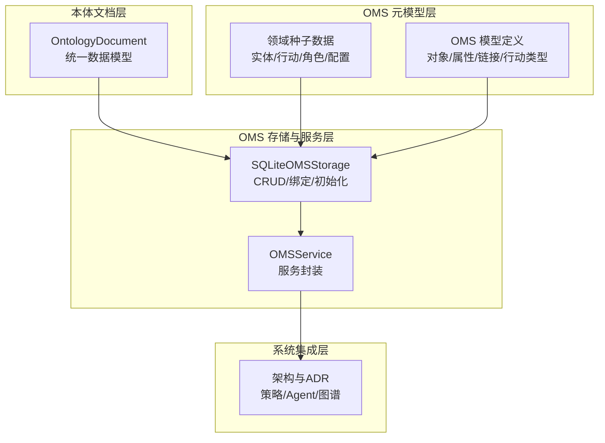
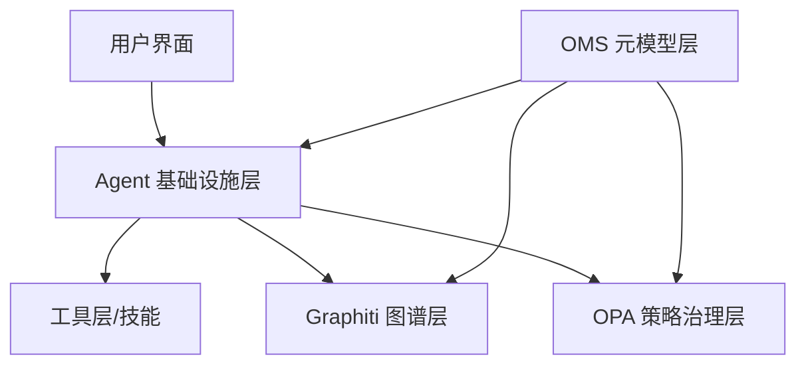
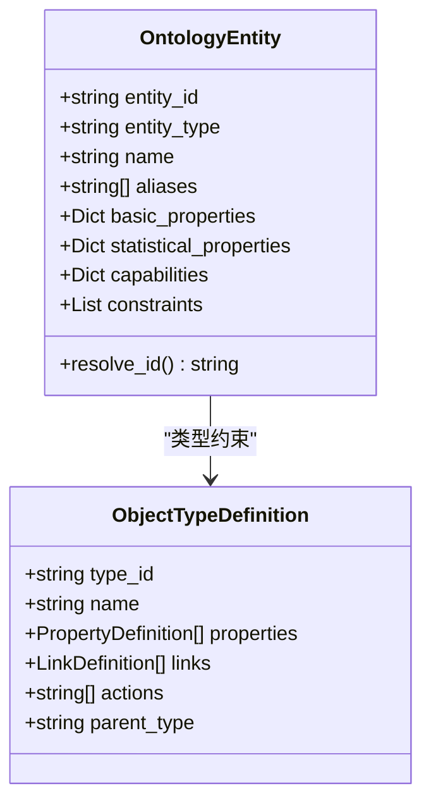
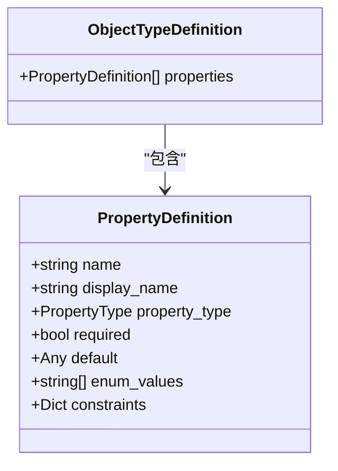
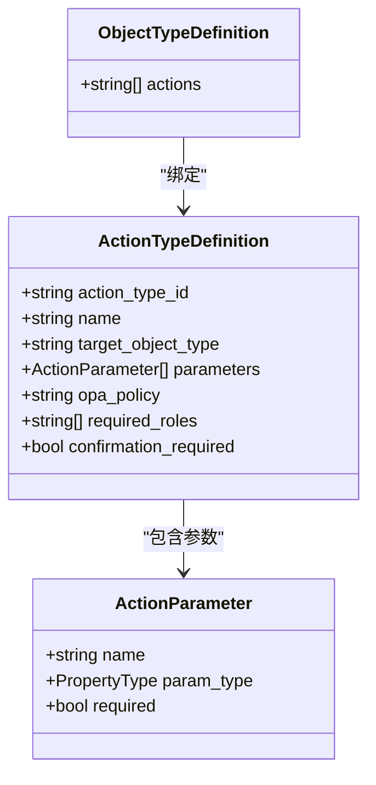
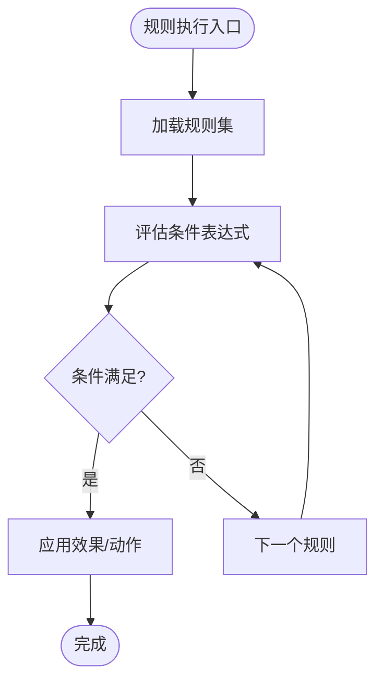
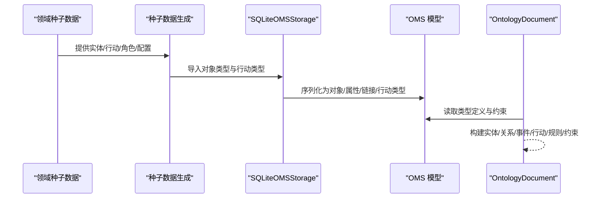
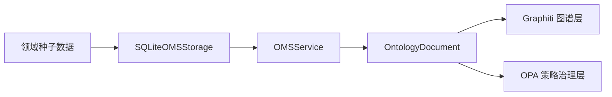

# 四层本体结构

<cite>
**本文引用的文件**
- [odap/biz/core/ontology/schema/document.py](file://odap/biz/core/ontology/schema/document.py)
- [odap/biz/core/ontology/oms/schemas.py](file://odap/biz/core/ontology/oms/schemas.py)
- [odap/biz/core/ontology/oms/storage/sqlite_oms_storage.py](file://odap/biz/core/ontology/oms/storage/sqlite_oms_storage.py)
- [odap/biz/core/ontology/oms/services/oms_service.py](file://odap/biz/core/ontology/oms/services/oms_service.py)
- [odap/biz/core/ontology/schema/domain.py](file://odap/biz/core/ontology/schema/domain.py)
- [docs/07-adr/ADR-036_palantir_ontology_reference.md](file://docs/07-adr/ADR-036_palantir_ontology_reference.md)
- [docs/02-architecture/ARCHITECTURE_BIZ.md](file://docs/02-architecture/ARCHITECTURE_BIZ.md)
- [docs/02-architecture/ARCHITECTURE.md](file://docs/02-architecture/ARCHITECTURE.md)
- [docs/07-adr/ADR-056-语义层修正.md](file://docs/07-adr/ADR-056-语义层修正.md)
- [docs/02-architecture/ARCHITECTURE_FULL_CHAIN_DEEP.md](file://docs/02-architecture/ARCHITECTURE_FULL_CHAIN_DEEP.md)
</cite>

## 目录
1. [引言](#引言)
2. [项目结构](#项目结构)
3. [核心组件](#核心组件)
4. [架构总览](#架构总览)
5. [详细组件分析](#详细组件分析)
6. [依赖分析](#依赖分析)
7. [性能考虑](#性能考虑)
8. [故障排查指南](#故障排查指南)
9. [结论](#结论)
10. [附录](#附录)

## 引言
本文件面向“四层本体结构”的技术文档，系统阐述 OMS 元模型框架中的四层建模：Object（对象层）、Property（属性层）、Action（行为层）、Rule（规则层）。文档从数据模型、存储与服务、领域本体种子数据、以及与整体架构的集成角度，解释每层的建模规则、语义含义、层次关系与依赖约束，并给出从领域概念到形式化表示的转换路径与一致性保障机制。

## 项目结构
围绕四层本体结构的关键代码分布在如下模块：
- 标准化本体文档模型：定义实体、关系、事件、行动、规则、约束等统一数据结构，支撑跨模块的输入输出与持久化。
- OMS（Ontology Meta Schema）：定义对象类型、属性、链接、行动类型等元模型，提供类型系统与约束。
- OMS 存储与服务：SQLite 持久化与服务封装，提供类型 CRUD、绑定与查询。
- 领域本体种子数据：提供实体类型、行动类型、角色与领域配置，作为 OMS 初始化数据源。
- 架构与 ADR：说明四层本体与系统其他层（Agent、Graphiti、OPA 等）的集成方式与策略层次。

**图表来源**
- [odap/biz/core/ontology/schema/document.py:212-400](file://odap/biz/core/ontology/schema/document.py#L212-L400)
- [odap/biz/core/ontology/oms/schemas.py:18-136](file://odap/biz/core/ontology/oms/schemas.py#L18-L136)
- [odap/biz/core/ontology/oms/storage/sqlite_oms_storage.py:18-122](file://odap/biz/core/ontology/oms/storage/sqlite_oms_storage.py#L18-L122)
- [odap/biz/core/ontology/oms/services/oms_service.py:6-53](file://odap/biz/core/ontology/oms/services/oms_service.py#L6-L53)
- [odap/biz/core/ontology/schema/domain.py:13-179](file://odap/biz/core/ontology/schema/domain.py#L13-L179)
- [docs/02-architecture/ARCHITECTURE.md:392-446](file://docs/02-architecture/ARCHITECTURE.md#L392-L446)

**章节来源**
- [odap/biz/core/ontology/schema/document.py:1-575](file://odap/biz/core/ontology/schema/document.py#L1-L575)
- [odap/biz/core/ontology/oms/schemas.py:1-136](file://odap/biz/core/ontology/oms/schemas.py#L1-L136)
- [odap/biz/core/ontology/oms/storage/sqlite_oms_storage.py:1-370](file://odap/biz/core/ontology/oms/storage/sqlite_oms_storage.py#L1-L370)
- [odap/biz/core/ontology/oms/services/oms_service.py:1-53](file://odap/biz/core/ontology/oms/services/oms_service.py#L1-L53)
- [odap/biz/core/ontology/schema/domain.py:1-428](file://odap/biz/core/ontology/schema/domain.py#L1-L428)
- [docs/02-architecture/ARCHITECTURE.md:392-446](file://docs/02-architecture/ARCHITECTURE.md#L392-L446)

## 核心组件
- 统一本体文档模型（OntologyDocument）：承载实体、关系、事件、行动、规则、约束等，支持序列化/反序列化、版本链、构建历史与转换状态。
- OMS 模型定义：定义对象类型、属性、链接、行动类型等，提供类型系统与约束字段。
- OMS 存储与服务：SQLite 持久化与服务封装，负责类型 CRUD、绑定关系、初始化种子数据。
- 领域种子数据：提供实体类型、行动类型、角色与领域配置，作为 OMS 初始化数据源。
- 架构与 ADR：说明四层本体与系统其他层的集成方式与策略层次。

**章节来源**
- [odap/biz/core/ontology/schema/document.py:104-195](file://odap/biz/core/ontology/schema/document.py#L104-L195)
- [odap/biz/core/ontology/oms/schemas.py:18-136](file://odap/biz/core/ontology/oms/schemas.py#L18-L136)
- [odap/biz/core/ontology/oms/storage/sqlite_oms_storage.py:18-122](file://odap/biz/core/ontology/oms/storage/sqlite_oms_storage.py#L18-L122)
- [odap/biz/core/ontology/oms/services/oms_service.py:6-53](file://odap/biz/core/ontology/oms/services/oms_service.py#L6-L53)
- [odap/biz/core/ontology/schema/domain.py:13-179](file://odap/biz/core/ontology/schema/domain.py#L13-L179)
- [docs/07-adr/ADR-036_palantir_ontology_reference.md:46-99](file://docs/07-adr/ADR-036_palantir_ontology_reference.md#L46-L99)

## 架构总览
四层本体结构在系统中的定位与集成如下：
- 用户交互层：态势可视化、命令下发、结果展示。
- Agent 基础设施层：决策中枢、情报中心、执行中心及其协调器。
- 工具层与图谱层：Python Skills、Graphiti（双时态图谱）。
- 策略治理层：OPA（权限校验、规则执行、合规检查）。
- 与 OMS 的关系：OMS 提供类型定义与约束，驱动运行时实体与行动的合法性校验；与 Graphiti 的集成支撑实体/关系/事件/行动的持久化与查询；与 OPA 的集成用于策略执行与权限检查。

**图表来源**
- [docs/02-architecture/ARCHITECTURE.md:392-446](file://docs/02-architecture/ARCHITECTURE.md#L392-L446)
- [docs/02-architecture/ARCHITECTURE.md:469-478](file://docs/02-architecture/ARCHITECTURE.md#L469-L478)

**章节来源**
- [docs/02-architecture/ARCHITECTURE.md:392-446](file://docs/02-architecture/ARCHITECTURE.md#L392-L446)
- [docs/02-architecture/ARCHITECTURE.md:469-478](file://docs/02-architecture/ARCHITECTURE.md#L469-L478)

## 详细组件分析

### 对象层（Object Layer）
- 语义与职责：对象层用于描述业务实体类型及其基本属性集合。在本体文档中体现为实体四层属性：basic_properties、statistical_properties、capabilities、constraints。
- 数据模型要点：
  - 实体类包含实体标识、类型、名称、别名及四层属性字典。
  - 提供确定性 ID 生成与解析逻辑，保证同名同类型的实体具有稳定标识。
- 与 OMS 的关系：
  - OMS 的 ObjectTypeDefinition 描述对象类型及其属性、链接、行动绑定。
  - 领域种子数据中的实体类型作为 OMS 初始化数据源，经存储层导入。
- 与图谱层的集成：
  - 本体文档被转换为 Graphiti Episode 文本，写入图谱以支持可视化与推理。

**图表来源**
- [odap/biz/core/ontology/schema/document.py:104-123](file://odap/biz/core/ontology/schema/document.py#L104-L123)
- [odap/biz/core/ontology/oms/schemas.py:72-86](file://odap/biz/core/ontology/oms/schemas.py#L72-L86)

**章节来源**
- [odap/biz/core/ontology/schema/document.py:104-123](file://odap/biz/core/ontology/schema/document.py#L104-L123)
- [odap/biz/core/ontology/oms/schemas.py:72-86](file://odap/biz/core/ontology/oms/schemas.py#L72-L86)
- [odap/biz/core/ontology/schema/domain.py:13-179](file://odap/biz/core/ontology/schema/domain.py#L13-L179)

### 属性层（Property Layer）
- 语义与职责：属性层用于刻画对象类型的特征，包括基本属性、统计属性、能力属性与约束属性。属性具备类型、是否必填、默认值、枚举值、描述与可选约束等元信息。
- 数据模型要点：
  - 属性类型覆盖字符串、整数、浮点、布尔、时间戳、地理点、JSON、引用等。
  - 属性定义支持枚举值与通用约束字典，便于扩展。
- 与对象层的绑定：
  - ObjectTypeDefinition 的 properties 列表即为该对象类型的属性集合。
- 与存储层的映射：
  - 存储层将属性集合序列化为 JSON 字段存入数据库，读取时反序列化还原。

**图表来源**
- [odap/biz/core/ontology/oms/schemas.py:18-28](file://odap/biz/core/ontology/oms/schemas.py#L18-L28)
- [odap/biz/core/ontology/oms/schemas.py:72-86](file://odap/biz/core/ontology/oms/schemas.py#L72-L86)

**章节来源**
- [odap/biz/core/ontology/oms/schemas.py:7-28](file://odap/biz/core/ontology/oms/schemas.py#L7-L28)
- [odap/biz/core/ontology/oms/schemas.py:72-86](file://odap/biz/core/ontology/oms/schemas.py#L72-L86)
- [odap/biz/core/ontology/oms/storage/sqlite_oms_storage.py:124-147](file://odap/biz/core/ontology/oms/storage/sqlite_oms_storage.py#L124-L147)

### 行为层（Action Layer）
- 语义与职责：行为层用于描述对象类型可执行的操作，包括参数、目标对象类型、所需角色、是否需要确认、OPA 策略等。
- 数据模型要点：
  - 行动类型定义包含标识、名称、显示名、描述、目标对象类型、参数列表、OPA 策略、所需角色、写回配置、确认需求等。
  - 行动参数定义包含名称、类型、是否必填、默认值与描述。
- 与对象层的绑定：
  - ObjectTypeDefinition 的 actions 字段维护该类型可执行的行动类型标识列表。
- 与服务层的交互：
  - 服务层提供绑定/解绑行动到对象类型的接口，便于动态装配类型能力。

**图表来源**
- [odap/biz/core/ontology/oms/schemas.py:49-70](file://odap/biz/core/ontology/oms/schemas.py#L49-L70)
- [odap/biz/core/ontology/oms/schemas.py:58-69](file://odap/biz/core/ontology/oms/schemas.py#L58-L69)
- [odap/biz/core/ontology/oms/schemas.py:72-86](file://odap/biz/core/ontology/oms/schemas.py#L72-L86)

**章节来源**
- [odap/biz/core/ontology/oms/schemas.py:49-70](file://odap/biz/core/ontology/oms/schemas.py#L49-L70)
- [odap/biz/core/ontology/oms/schemas.py:58-69](file://odap/biz/core/ontology/oms/schemas.py#L58-L69)
- [odap/biz/core/ontology/oms/schemas.py:72-86](file://odap/biz/core/ontology/oms/schemas.py#L72-L86)
- [odap/biz/core/ontology/oms/services/oms_service.py:48-52](file://odap/biz/core/ontology/oms/services/oms_service.py#L48-L52)
- [odap/biz/core/ontology/schema/domain.py:187-282](file://odap/biz/core/ontology/schema/domain.py#L187-L282)

### 规则层（Rule Layer）
- 语义与职责：规则层用于表达本体中的约束与推导逻辑，如交战规则、合规检查、状态流转等。规则通常包含条件、效果、优先级与来源等。
- 与系统集成：
  - 规则可与 OPA 策略治理层集成，实现权限校验、合规检查与 Fail-Close 策略。
  - 策略层次结构支持系统级、项目级、资源级、数据级的多层控制。
- 与本体文档的映射：
  - 本体文档提供规则与约束两类结构，分别承载规则与约束信息。

**图表来源**
- [odap/biz/core/ontology/schema/document.py:171-182](file://odap/biz/core/ontology/schema/document.py#L171-L182)
- [docs/07-adr/ADR-028_permission_checker_opa_integration.md:167-201](file://docs/07-adr/ADR-028_permission_checker_opa_integration.md#L167-L201)

**章节来源**
- [odap/biz/core/ontology/schema/document.py:171-182](file://odap/biz/core/ontology/schema/document.py#L171-L182)
- [docs/07-adr/ADR-028_permission_checker_opa_integration.md:167-201](file://docs/07-adr/ADR-028_permission_checker_opa_integration.md#L167-L201)

### 从领域概念到形式化表示的转换示例
- 领域概念：单位（Unit）具备阵营、单位类型、状态、位置、坐标等基本属性，具备战斗能力、射程、防空等能力属性，具备最大速度、最低补给等约束属性，并与位置、上级单位、交战单位等建立 N:1、N:N 等链接关系。
- 行动类型：移动、攻击、防御、增援、撤退、观察、通信等，每个行动定义参数、目标对象类型、所需角色、是否需要确认、OPA 策略等。
- 形式化表示：上述概念在领域种子数据中以字典形式定义，经存储层导入为 OMS 的对象类型与行动类型；在本体文档中以实体四层属性与关系、事件、行动、规则、约束等形式出现，最终写入图谱与策略系统。

**图表来源**
- [odap/biz/core/ontology/schema/domain.py:423-428](file://odap/biz/core/ontology/schema/domain.py#L423-L428)
- [odap/biz/core/ontology/oms/storage/sqlite_oms_storage.py:68-122](file://odap/biz/core/ontology/oms/storage/sqlite_oms_storage.py#L68-L122)
- [odap/biz/core/ontology/oms/schemas.py:72-86](file://odap/biz/core/ontology/oms/schemas.py#L72-L86)
- [odap/biz/core/ontology/schema/document.py:212-279](file://odap/biz/core/ontology/schema/document.py#L212-L279)

**章节来源**
- [odap/biz/core/ontology/schema/domain.py:13-179](file://odap/biz/core/ontology/schema/domain.py#L13-L179)
- [odap/biz/core/ontology/schema/domain.py:187-282](file://odap/biz/core/ontology/schema/domain.py#L187-L282)
- [odap/biz/core/ontology/oms/storage/sqlite_oms_storage.py:68-122](file://odap/biz/core/ontology/oms/storage/sqlite_oms_storage.py#L68-L122)
- [odap/biz/core/ontology/schema/document.py:212-279](file://odap/biz/core/ontology/schema/document.py#L212-L279)

## 依赖分析
- 组件耦合与内聚：
  - 本体文档模型与 OMS 模型之间通过统一字段与序列化/反序列化保持高内聚。
  - 存储层与服务层解耦，服务层仅依赖存储接口，便于替换实现。
  - 领域种子数据与 OMS 存储层耦合，用于初始化与迁移。
- 外部依赖与集成点：
  - 与 Graphiti 的集成体现在三源查询模型（schema/entity/topo/temporal），支撑类型定义、运行时实体与拓扑关系的统一查询。
  - 与 OPA 的集成体现在策略层次结构与权限校验流程。
- 潜在循环依赖：
  - 当前模块间为单向依赖（种子数据→存储→服务→应用），未见循环依赖迹象。

**图表来源**
- [odap/biz/core/ontology/schema/domain.py:423-428](file://odap/biz/core/ontology/schema/domain.py#L423-L428)
- [odap/biz/core/ontology/oms/storage/sqlite_oms_storage.py:18-122](file://odap/biz/core/ontology/oms/storage/sqlite_oms_storage.py#L18-L122)
- [odap/biz/core/ontology/oms/services/oms_service.py:6-53](file://odap/biz/core/ontology/oms/services/oms_service.py#L6-L53)
- [odap/biz/core/ontology/schema/document.py:212-279](file://odap/biz/core/ontology/schema/document.py#L212-L279)
- [docs/02-architecture/ARCHITECTURE.md:469-478](file://docs/02-architecture/ARCHITECTURE.md#L469-L478)

**章节来源**
- [odap/biz/core/ontology/schema/domain.py:423-428](file://odap/biz/core/ontology/schema/domain.py#L423-L428)
- [odap/biz/core/ontology/oms/storage/sqlite_oms_storage.py:18-122](file://odap/biz/core/ontology/oms/storage/sqlite_oms_storage.py#L18-L122)
- [odap/biz/core/ontology/oms/services/oms_service.py:6-53](file://odap/biz/core/ontology/oms/services/oms_service.py#L6-L53)
- [odap/biz/core/ontology/schema/document.py:212-279](file://odap/biz/core/ontology/schema/document.py#L212-L279)
- [docs/02-architecture/ARCHITECTURE.md:469-478](file://docs/02-architecture/ARCHITECTURE.md#L469-L478)

## 性能考虑
- 存储层优化：
  - 使用 JSON 字段存储属性、链接、参数等集合，便于灵活扩展但需注意查询性能；可通过索引与分区策略优化常用查询。
  - 初始化种子数据仅在首次启动时执行，避免重复导入。
- 服务层优化：
  - 服务层提供按目标类型筛选行动类型的能力，减少不必要的全量扫描。
- 文档模型优化：
  - 序列化/反序列化采用批量处理与延迟计算，降低内存占用与 CPU 开销。
- 架构层面：
  - 与 Graphiti 的三源查询模型配合，利用缓存与增量更新提升查询效率。

[本节为通用性能讨论，无需具体文件分析]

## 故障排查指南
- 类型定义与运行时实例之间的“桥”断裂：
  - 现状：实体类型未在 OMS 注册、属性值类型/约束未校验、链接基数约束未执行、行动类型 OPA 策略未集成、约束执行引擎缺失。
  - 建议：在类型校验执行化与模型统一方面进行修复，确保运行时实例严格遵循 OMS 定义。
- 关系类型兼容性问题：
  - 使用关系验证器检查关系类型与源/目标实体类型的兼容性，及时发现并记录错误。
- OMS 初始化与迁移：
  - 确保种子数据正确导入，避免重复初始化；检查 JSON 字段的序列化/反序列化是否一致。

**章节来源**
- [docs/07-adr/ADR-056-语义层修正.md:8-28](file://docs/07-adr/ADR-056-语义层修正.md#L8-L28)
- [docs/02-architecture/ARCHITECTURE_FULL_CHAIN_DEEP.md:1376-1458](file://docs/02-architecture/ARCHITECTURE_FULL_CHAIN_DEEP.md#L1376-L1458)
- [odap/biz/core/ontology/oms/storage/sqlite_oms_storage.py:68-122](file://odap/biz/core/ontology/oms/storage/sqlite_oms_storage.py#L68-L122)

## 结论
四层本体结构通过标准化的本体文档模型与 OMS 元模型，实现了从领域概念到形式化表示的清晰映射。对象层、属性层、行为层与规则层相互依存、层次分明：对象层承载业务实体，属性层刻画实体特征，行为层建模业务活动，规则层表达业务约束。OMS 的类型系统与约束、与 Graphiti 的集成以及与 OPA 的策略治理共同构成了完整的本体运行时环境。通过种子数据导入、服务封装与关系验证等机制，系统在保证一致性与完整性的同时，提供了良好的扩展性与可维护性。

[本节为总结性内容，无需具体文件分析]

## 附录
- 四层本体与 Palantir 概念的映射参考，可帮助理解标准术语与字段含义。
- 架构中的三源查询模型（schema/entity/topo/temporal）为统一查询与推理提供基础。

**章节来源**
- [docs/07-adr/ADR-036_palantir_ontology_reference.md:230-268](file://docs/07-adr/ADR-036_palantir_ontology_reference.md#L230-L268)
- [docs/02-architecture/ARCHITECTURE.md:469-478](file://docs/02-architecture/ARCHITECTURE.md#L469-L478)