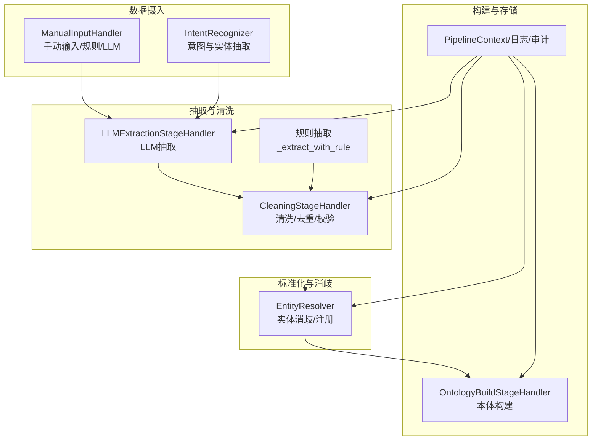
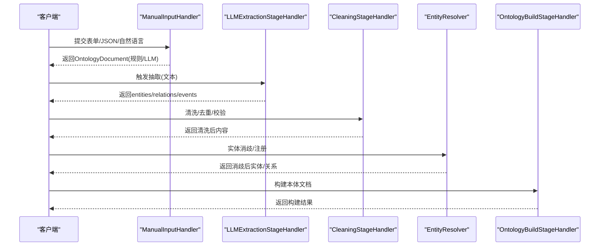
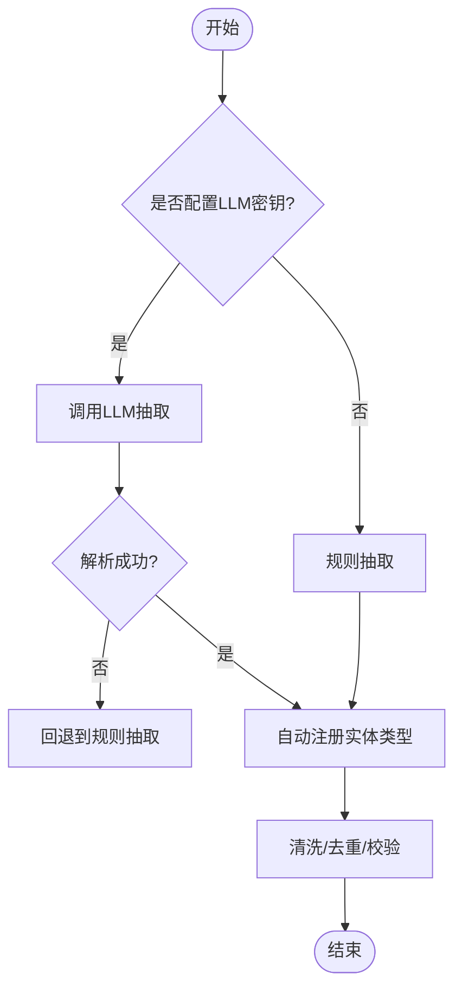
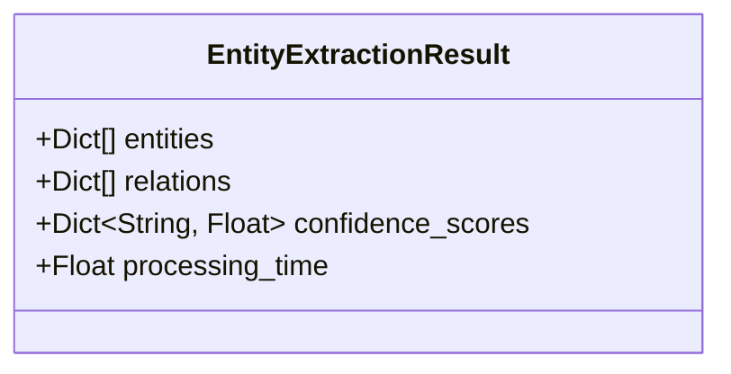
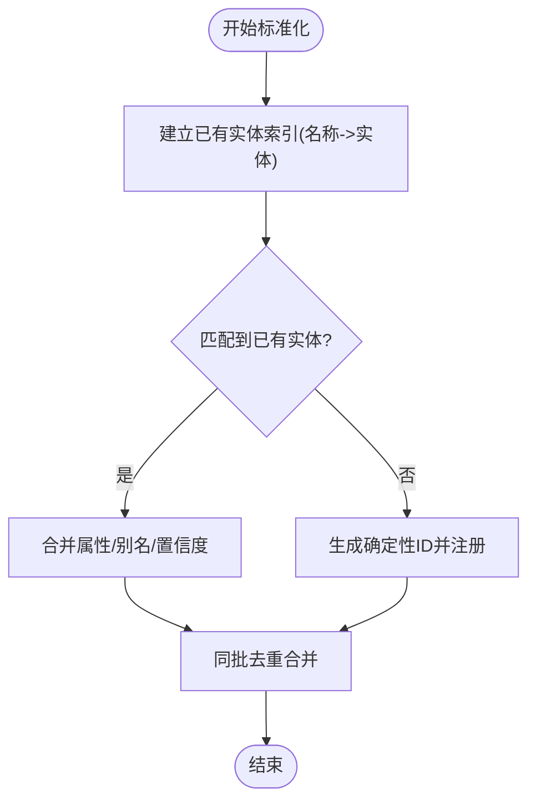
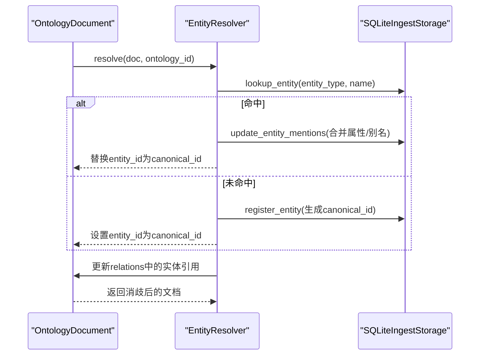
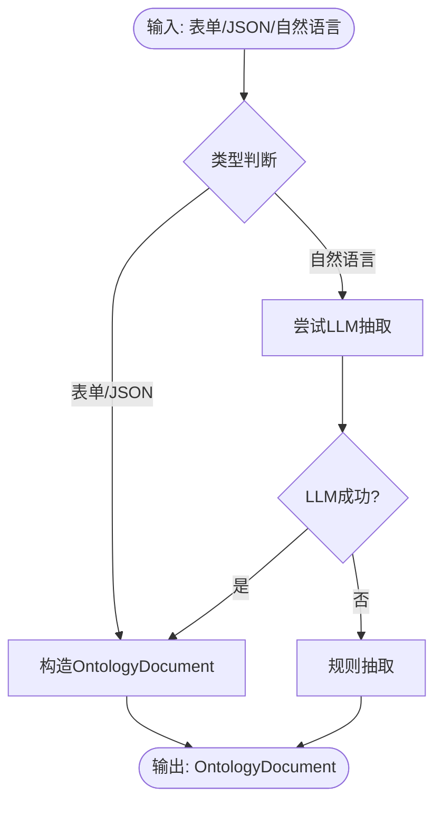
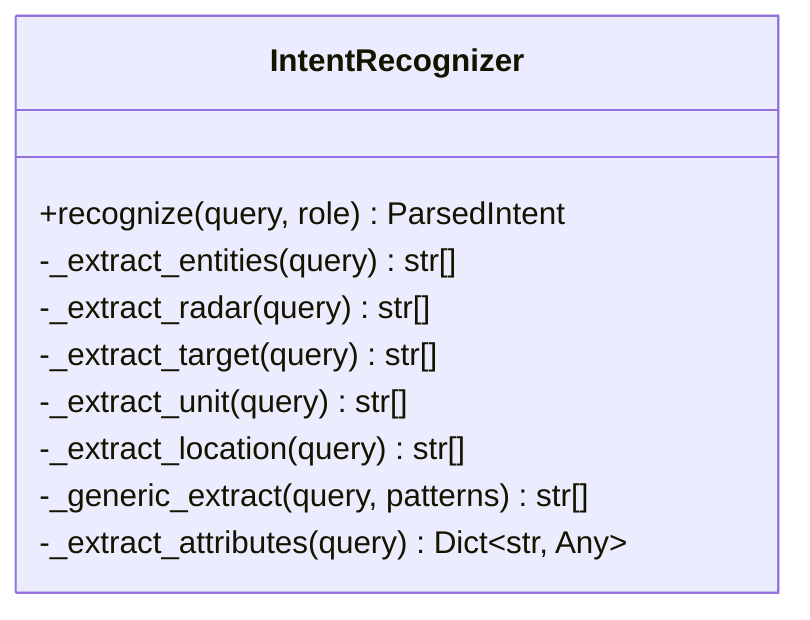
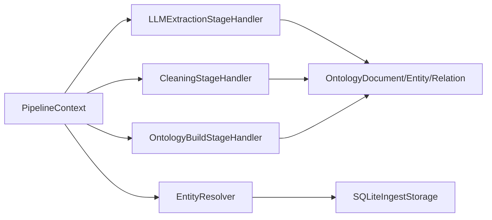

# 实体抽取与处理

<cite>
**本文引用的文件**
- [pipeline_service.py](file://odap/biz/core/ontology/services/pipeline_service.py)
- [user_cognition_engine.py](file://odap/biz/core/cognition/user_cognition_engine.py)
- [entity_resolver.py](file://odap/biz/core/ontology/impl/entity_resolver.py)
- [manual_input.py](file://odap/biz/core/ontology/ingestion_split/manual_input.py)
- [ontology.py](file://odap/biz/core/ontology/models/ontology.py)
- [ARCHITECTURE_FULL_CHAIN_DEEP.md](file://docs/02-architecture/ARCHITECTURE_FULL_CHAIN_DEEP.md)
- [ARCHITECTURE_FULL_CHAIN.md](file://docs/02-architecture/ARCHITECTURE_FULL_CHAIN.md)
- [test_cognition.py](file://tests/unit/test_cognition.py)
- [test_api_integration.py](file://tests/integration/test_api_integration.py)
</cite>

## 目录
1. [简介](#简介)
2. [项目结构](#项目结构)
3. [核心组件](#核心组件)
4. [架构总览](#架构总览)
5. [详细组件分析](#详细组件分析)
6. [依赖分析](#依赖分析)
7. [性能考量](#性能考量)
8. [故障排查指南](#故障排查指南)
9. [结论](#结论)
10. [附录](#附录)

## 简介
本文件围绕“实体抽取与处理”主题，系统梳理本体构建流水线中的实体识别、抽取、标准化、消歧与关联策略，结合代码实现与架构文档，给出从原始数据到本体图谱的完整处理链路说明。重点涵盖：
- 实体抽取算法与处理流程
- EntityExtractionResult 模型结构与字段含义
- 实体标准化与去重机制
- 实体消歧与关联策略
- 不同数据源的处理示例
- 性能优化与大规模处理最佳实践
- 错误处理与异常数据应对方案

## 项目结构
实体抽取与处理涉及多层模块协同：
- 数据摄入与预处理：规则/LLM抽取、清洗、去重
- 实体标准化与消歧：注册表匹配、别名合并、确定性ID生成
- 关联与本体构建：关系抽取、事件抽取、文档归档
- 错误处理与可观测性：日志、审计、异常捕获

**图表来源**
- [pipeline_service.py](file://odap/biz/core/ontology/services/pipeline_service.py)
- [manual_input.py](file://odap/biz/core/ontology/ingestion_split/manual_input.py)
- [user_cognition_engine.py](file://odap/biz/core/cognition/user_cognition_engine.py)
- [entity_resolver.py](file://odap/biz/core/ontology/impl/entity_resolver.py)

**章节来源**
- [pipeline_service.py](file://odap/biz/core/ontology/services/pipeline_service.py)
- [manual_input.py](file://odap/biz/core/ontology/ingestion_split/manual_input.py)
- [user_cognition_engine.py](file://odap/biz/core/cognition/user_cognition_engine.py)
- [entity_resolver.py](file://odap/biz/core/ontology/impl/entity_resolver.py)

## 核心组件
- 实体抽取与处理流水线：负责从原始文本中抽取实体、关系、事件，并进行清洗与标准化。
- 实体消歧解析器：对重复或近似实体进行合并与规范化，保证图谱一致性。
- 手动输入处理器：支持表单、JSON、自然语言三种输入模式，内置规则与LLM降级方案。
- 意图识别器：从用户查询中抽取实体与意图，辅助后续知识导航与解释。

**章节来源**
- [pipeline_service.py](file://odap/biz/core/ontology/services/pipeline_service.py)
- [entity_resolver.py](file://odap/biz/core/ontology/impl/entity_resolver.py)
- [manual_input.py](file://odap/biz/core/ontology/ingestion_split/manual_input.py)
- [user_cognition_engine.py](file://odap/biz/core/cognition/user_cognition_engine.py)

## 架构总览
实体抽取与处理贯穿“数据采集—清洗—LLM/规则抽取—标准化—消歧—本体构建”的完整链路。系统支持多种数据源（文件上传、文本粘贴、数据库连接、API数据源），并通过统一的处理上下文与审计日志保障可追溯性。

**图表来源**
- [manual_input.py](file://odap/biz/core/ontology/ingestion_split/manual_input.py)
- [pipeline_service.py](file://odap/biz/core/ontology/services/pipeline_service.py)
- [entity_resolver.py](file://odap/biz/core/ontology/impl/entity_resolver.py)

**章节来源**
- [ARCHITECTURE_FULL_CHAIN.md](file://docs/02-architecture/ARCHITECTURE_FULL_CHAIN.md)
- [ARCHITECTURE_FULL_CHAIN_DEEP.md](file://docs/02-architecture/ARCHITECTURE_FULL_CHAIN_DEEP.md)

## 详细组件分析

### 实体抽取与处理流水线
- LLM抽取阶段：根据环境变量决定是否启用LLM，否则回退至规则抽取。抽取内容包括实体、关系、事件，并自动注册实体类型。
- 规则抽取回退：针对特定关键词与模式进行实体/关系识别，保证在无LLM时仍可产出结构化结果。
- 清洗阶段：去除特殊字符、标准化空白、检测重复与缺失信息，提升后续抽取质量。

**图表来源**
- [pipeline_service.py](file://odap/biz/core/ontology/services/pipeline_service.py)

**章节来源**
- [pipeline_service.py](file://odap/biz/core/ontology/services/pipeline_service.py)

### EntityExtractionResult 模型
EntityExtractionResult 是抽取结果的标准化载体，字段含义如下：
- entities：抽取到的实体列表，包含实体ID、类型、名称、别名、属性、置信度、来源chunk等。
- relations：抽取到的关系列表，包含关系ID、类型、源/目标实体ID、属性、置信度、来源chunk等。
- confidence_scores：实体级别的置信度映射，便于后续筛选与排序。
- processing_time：本次抽取处理耗时，用于性能监控与优化。

**图表来源**
- [ontology.py](file://odap/biz/core/ontology/models/ontology.py)

**章节来源**
- [ontology.py](file://odap/biz/core/ontology/models/ontology.py)

### 实体标准化与去重机制
- 标准化策略：基于名称的精确匹配、模糊相似度匹配（阈值0.85）、别名匹配，将新实体映射到既有实体并合并属性。
- 同批去重：在同一处理批次内，对同名同类型的实体进行别名、属性、来源chunk、置信度的合并，避免重复记录。
- 与图谱集成：标准化后实体ID统一，便于后续写入图数据库与查询。

**图表来源**
- [ARCHITECTURE_FULL_CHAIN_DEEP.md](file://docs/02-architecture/ARCHITECTURE_FULL_CHAIN_DEEP.md)

**章节来源**
- [ARCHITECTURE_FULL_CHAIN_DEEP.md](file://docs/02-architecture/ARCHITECTURE_FULL_CHAIN_DEEP.md)

### 实体消歧与关联策略
- 精确/别名匹配：优先通过实体类型+名称或别名在注册表中查找，若未命中则生成确定性ID并注册。
- 属性合并：基础属性、统计属性、能力属性分别浅合并，别名取并集，确保信息不丢失。
- 关系同步：当实体ID被替换为规范ID后，同步更新关系中的源/目标实体引用，保持图结构一致性。
- 关联推断：基于上下文规则推断成员关系、婚姻关系、亲属关系等，补充显式抽取遗漏的联系。

**图表来源**
- [entity_resolver.py](file://odap/biz/core/ontology/impl/entity_resolver.py)

**章节来源**
- [entity_resolver.py](file://odap/biz/core/ontology/impl/entity_resolver.py)

### 不同数据源的处理示例
- 表单/JSON：ManualInputHandler 直接构造 OntologyDocument，支持结构化数据快速入库。
- 自然语言：优先使用 LLM 将自由文本转换为结构化实体/关系/事件；若 LLM 不可用，则回退到规则抽取。
- 规则抽取：针对中文人名、组织、地点、物品等进行识别与关系推断，覆盖常见叙事场景。

**图表来源**
- [manual_input.py](file://odap/biz/core/ontology/ingestion_split/manual_input.py)

**章节来源**
- [manual_input.py](file://odap/biz/core/ontology/ingestion_split/manual_input.py)

### 意图识别与实体抽取（用户认知引擎）
- 意图识别：基于关键词模式识别查询意图（查询、行动、解释、推荐、导航、比较、分析），并计算置信度。
- 实体抽取：针对雷达、目标、单位、位置等实体类型构建正则模式，统一去重后返回。
- 单元测试验证：包含实体去重、空查询、时间属性抽取等测试用例，确保稳定性。

**图表来源**
- [user_cognition_engine.py](file://odap/biz/core/cognition/user_cognition_engine.py)

**章节来源**
- [user_cognition_engine.py](file://odap/biz/core/cognition/user_cognition_engine.py)
- [test_cognition.py](file://tests/unit/test_cognition.py)

## 依赖分析
- 组件耦合：抽取阶段依赖 LLM 客户端或规则引擎；清洗阶段依赖通用清洗逻辑；消歧阶段依赖注册表存储；构建阶段依赖本体文档模型。
- 外部依赖：LLM 提供商配置（密钥、基础URL、模型名）、图数据库连接池、审计日志系统。
- 可能的循环依赖：当前模块间通过服务接口与数据模型传递，未见直接循环导入。

**图表来源**
- [pipeline_service.py](file://odap/biz/core/ontology/services/pipeline_service.py)
- [entity_resolver.py](file://odap/biz/core/ontology/impl/entity_resolver.py)

**章节来源**
- [pipeline_service.py](file://odap/biz/core/ontology/services/pipeline_service.py)
- [entity_resolver.py](file://odap/biz/core/ontology/impl/entity_resolver.py)

## 性能考量
- LLM调用优化：通过环境变量控制模型与超时，必要时回退规则抽取；批量评估与缓存策略可降低调用成本。
- 清洗与去重：在抽取前进行清洗与去重，减少无效重复处理；同批去重合并降低存储与查询压力。
- 并发与资源：合理配置并发与连接池，避免LLM与数据库成为瓶颈；对大规模数据采用分块与流式处理。
- 监控指标：关注实体抽取准确率、处理耗时、LLM调用次数、队列积压、并发饱和度等关键指标。

**章节来源**
- [ARCHITECTURE_FULL_CHAIN_DEEP.md](file://docs/02-architecture/ARCHITECTURE_FULL_CHAIN_DEEP.md)
- [ARCHITECTURE_FULL_CHAIN.md](file://docs/02-architecture/ARCHITECTURE_FULL_CHAIN.md)

## 故障排查指南
- LLM不可用或超时：检查密钥、基础URL、模型名配置；设置合理超时；启用规则抽取回退。
- Schema校验失败：检查输入数据结构与字段类型，确保符合本体文档Schema。
- 空输入或异常数据：增加边界条件测试，对空payload、畸形JSON、超大数据量进行健壮性处理。
- 审计与日志：利用统一审计日志与处理上下文记录，定位失败阶段与错误详情。

**章节来源**
- [manual_input.py](file://odap/biz/core/ontology/ingestion_split/manual_input.py)
- [pipeline_service.py](file://odap/biz/core/ontology/services/pipeline_service.py)
- [test_api_integration.py](file://tests/integration/test_api_integration.py)

## 结论
本系统通过“规则+LLM”的混合抽取策略、完善的清洗与去重、严格的实体标准化与消歧机制，实现了从多源异构数据到一致化本体图谱的高效转换。配合可观测性与性能优化策略，可在大规模场景下稳定运行并持续迭代。

## 附录
- 支持的输入源与API：文档上传（PDF/DOCX/Markdown/TXT/XLSX）、文本粘贴、数据库连接（PostgreSQL/MySQL/SQLite）、API数据源（REST/GraphQL）。
- 前端摄入流程：采用分步向导模式，包含数据源选择、文件上传、文档解析、实体抽取预览、审核确认等步骤。

**章节来源**
- [ARCHITECTURE_FULL_CHAIN.md](file://docs/02-architecture/ARCHITECTURE_FULL_CHAIN.md)
- [ARCHITECTURE_FULL_CHAIN_DEEP.md](file://docs/02-architecture/ARCHITECTURE_FULL_CHAIN_DEEP.md)