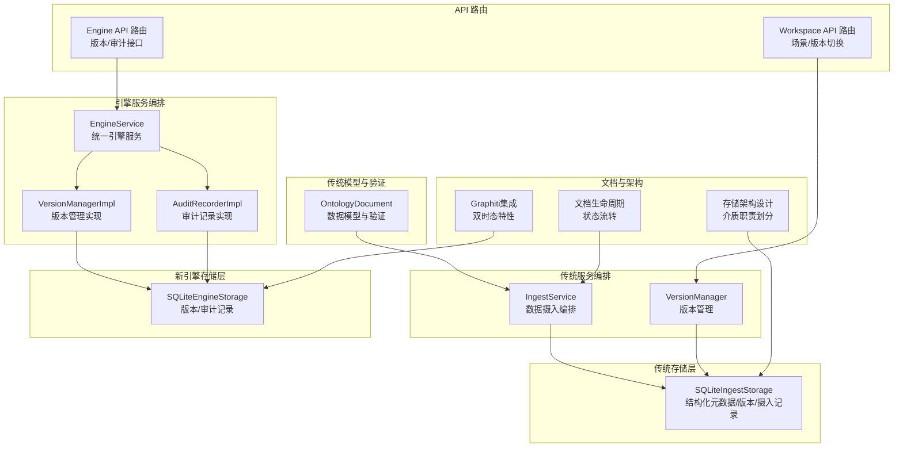
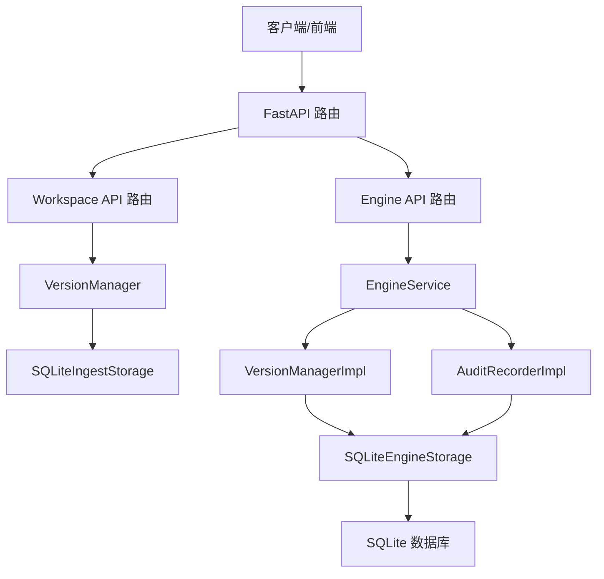
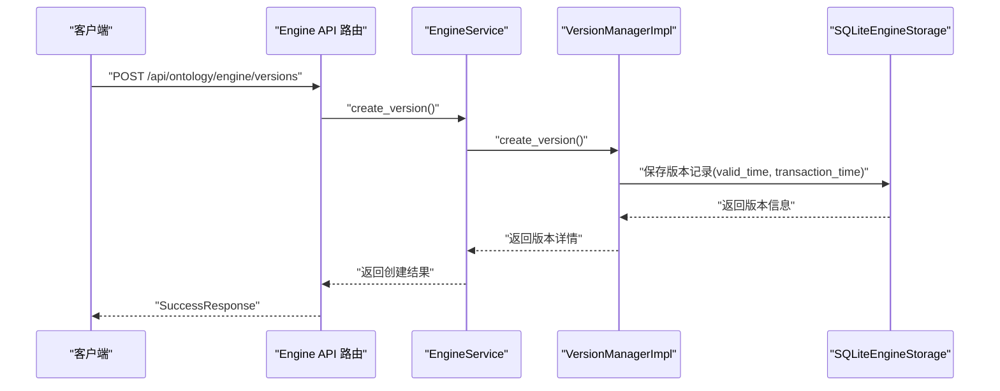
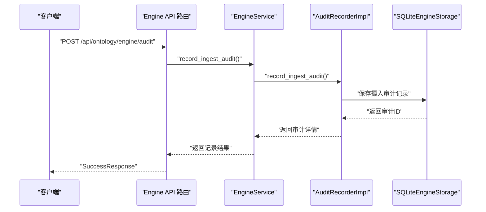
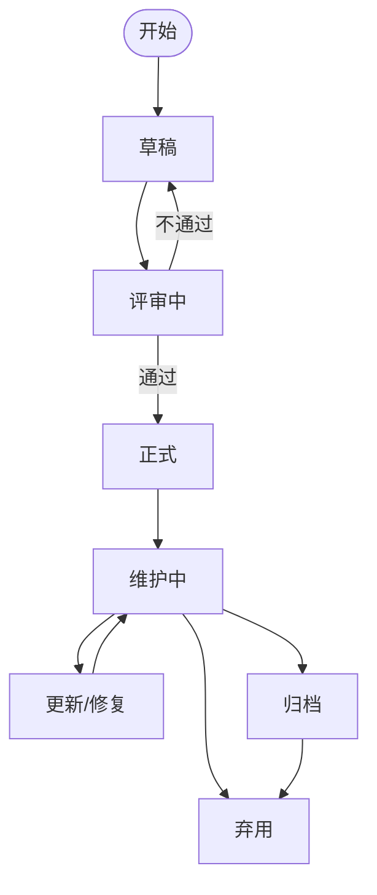
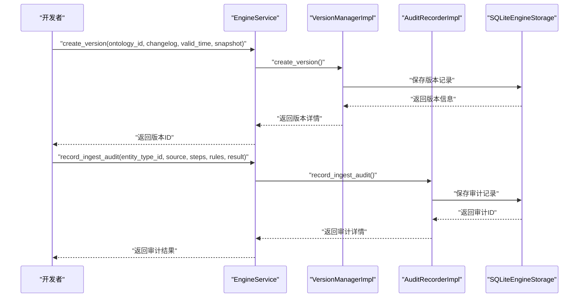
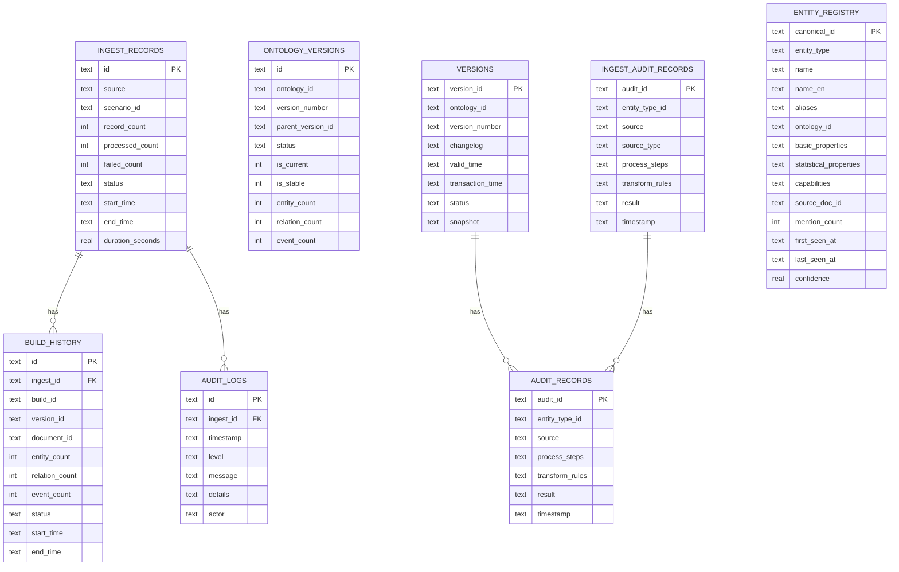
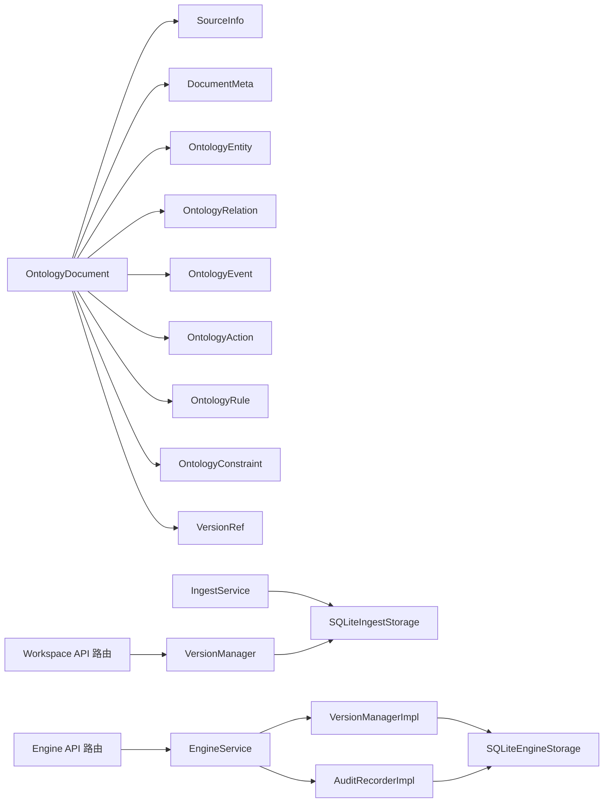

# 本体文档管理

<cite>
**本文引用的文件**
- [document.py](file://odap/biz/core/ontology/schema/document.py)
- [sqlite_ingest_storage.py](file://odap/biz/core/ontology/storage/sqlite_ingest_storage.py)
- [ingest_service.py](file://odap/biz/core/ontology/services/ingest_service.py)
- [version_service.py](file://odap/biz/core/ontology/services/version_service.py)
- [routes.py](file://odap/biz/platform/workspace/api/routes.py)
- [sqlite_engine_storage.py](file://odap/biz/core/ontology/engine/storage/sqlite_engine_storage.py)
- [version_manager_impl.py](file://odap/biz/core/ontology/engine/impl/version_manager_impl.py)
- [audit_recorder_impl.py](file://odap/biz/core/ontology/engine/impl/audit_recorder_impl.py)
- [engine_service.py](file://odap/biz/core/ontology/engine/services/engine_service.py)
- [version.py](file://odap/biz/core/ontology/engine/models/version.py)
- [version_manager.py](file://odap/biz/core/ontology/engine/interfaces/version_manager.py)
- [audit_recorder.py](file://odap/biz/core/ontology/engine/interfaces/audit_recorder.py)
- [routes.py](file://odap/biz/core/ontology/engine/api/routes.py)
- [schemas.py](file://odap/biz/core/ontology/engine/api/schemas.py)
- [DOCUMENT_MANAGEMENT.md](file://docs/DOCUMENT_MANAGEMENT.md)
- [ARCHITECTURE_FULL_CHAIN_DEEP.md](file://docs/02-architecture/ARCHITECTURE_FULL_CHAIN_DEEP.md)
- [spec.md](file://docs/11-archive/specs/storage-architecture-redesign/spec.md)
- [tasks.md](file://docs/11-archive/specs/storage-architecture-redesign/tasks.md)
- [GRAPHITI_INTEGRATION.md](file://docs/03-modules/audit_log/GRAPHITI_INTEGRATION.md)
- [test_api_integration.py](file://tests/integration/test_api_integration.py)
- [test_ontology_engine_v2.py](file://tests/unit/test_ontology_engine_v2.py)
</cite>

## 更新摘要
**变更内容**
- 新增本体引擎存储系统集成说明
- 增强版本管理功能，支持Graphiti双时态特性
- 完善审计功能实现细节
- 更新API接口和数据模型
- 增加新存储架构的性能优化方案

## 目录
1. [简介](#简介)
2. [项目结构](#项目结构)
3. [核心组件](#核心组件)
4. [架构总览](#架构总览)
5. [详细组件分析](#详细组件分析)
6. [依赖关系分析](#依赖关系分析)
7. [性能考量](#性能考量)
8. [故障排查指南](#故障排查指南)
9. [结论](#结论)
10. [附录](#附录)

## 简介
本文件面向"本体文档管理"子系统，系统化梳理本体文档的生命周期管理（创建、更新、查询、删除）、OntologyDocument 模型字段与约束、版本控制机制（版本号生成、版本比较、版本切换）、API 使用示例、存储策略与索引设计、以及错误处理与异常处置方案。特别增加了对新引擎存储系统的集成说明，包括版本管理、审计功能的实现细节。

## 项目结构
围绕本体文档管理的关键代码分布在如下模块：
- 数据模型与验证：odap/biz/core/ontology/schema/document.py
- 传统存储层：odap/biz/core/ontology/storage/sqlite_ingest_storage.py
- 引擎存储层：odap/biz/core/ontology/engine/storage/sqlite_engine_storage.py
- 服务编排：odap/biz/core/ontology/services/ingest_service.py、odap/biz/core/ontology/services/version_service.py
- 引擎服务编排：odap/biz/core/ontology/engine/services/engine_service.py
- 版本管理实现：odap/biz/core/ontology/engine/impl/version_manager_impl.py
- 审计记录实现：odap/biz/core/ontology/engine/impl/audit_recorder_impl.py
- API 路由：odap/biz/platform/workspace/api/routes.py、odap/biz/core/ontology/engine/api/routes.py
- 文档与架构参考：docs/DOCUMENT_MANAGEMENT.md、docs/02-architecture/ARCHITECTURE_FULL_CHAIN_DEEP.md、docs/11-archive/specs/storage-architecture-redesign/spec.md、docs/11-archive/specs/storage-architecture-redesign/tasks.md、docs/03-modules/audit_log/GRAPHITI_INTEGRATION.md
- 测试与错误处理：tests/integration/test_api_integration.py、tests/unit/test_ontology_engine_v2.py

**图表来源**
- [document.py:212-275](file://odap/biz/core/ontology/schema/document.py#L212-L275)
- [sqlite_ingest_storage.py:52-265](file://odap/biz/core/ontology/storage/sqlite_ingest_storage.py#L52-L265)
- [sqlite_engine_storage.py:7-279](file://odap/biz/core/ontology/engine/storage/sqlite_engine_storage.py#L7-L279)
- [ingest_service.py:330-353](file://odap/biz/core/ontology/services/ingest_service.py#L330-L353)
- [version_service.py:84-112](file://odap/biz/core/ontology/services/version_service.py#L84-L112)
- [engine_service.py:8-83](file://odap/biz/core/ontology/engine/services/engine_service.py#L8-L83)
- [version_manager_impl.py:9-76](file://odap/biz/core/ontology/engine/impl/version_manager_impl.py#L9-L76)
- [audit_recorder_impl.py:9-70](file://odap/biz/core/ontology/engine/impl/audit_recorder_impl.py#L9-L70)
- [routes.py:655-681](file://odap/biz/platform/workspace/api/routes.py#L655-L681)
- [routes.py:1-44](file://odap/biz/core/ontology/engine/api/routes.py#L1-L44)

**章节来源**
- [document.py:1-575](file://odap/biz/core/ontology/schema/document.py#L1-L575)
- [sqlite_ingest_storage.py:1-800](file://odap/biz/core/ontology/storage/sqlite_ingest_storage.py#L1-L800)
- [sqlite_engine_storage.py:1-279](file://odap/biz/core/ontology/engine/storage/sqlite_engine_storage.py#L1-L279)
- [ingest_service.py:1-972](file://odap/biz/core/ontology/services/ingest_service.py#L1-L972)
- [version_service.py:1-503](file://odap/biz/core/ontology/services/version_service.py#L1-L503)
- [engine_service.py:1-83](file://odap/biz/core/ontology/engine/services/engine_service.py#L1-L83)
- [version_manager_impl.py:1-76](file://odap/biz/core/ontology/engine/impl/version_manager_impl.py#L1-L76)
- [audit_recorder_impl.py:1-70](file://odap/biz/core/ontology/engine/impl/audit_recorder_impl.py#L1-L70)
- [routes.py:620-681](file://odap/biz/platform/workspace/api/routes.py#L620-L681)
- [routes.py:1-44](file://odap/biz/core/ontology/engine/api/routes.py#L1-L44)

## 核心组件
- OntologyDocument：标准化本体文档数据模型，承载实体、关系、事件、行动、规则、约束等，支持序列化/反序列化与校验。
- SQLiteIngestStorage：负责结构化元数据、摄入记录、版本、构建历史、审计日志等的持久化，提供索引与迁移能力。
- SQLiteEngineStorage：新引擎存储系统，专门用于版本管理和审计记录的持久化，支持Graphiti双时态特性。
- IngestService：统一的数据摄入服务，封装多种摄入入口（URL、新闻搜索、手动输入、JSON、自然语言、随机事件生成），并协调文档处理与版本构建。
- VersionManager：版本管理器，支持追加（append）与提交（commit）两种模式，生成版本ID与语义版本号，维护版本链与差异对比。
- VersionManagerImpl：新引擎版本管理实现，基于SQLiteEngineStorage，支持Graphiti双时态特性。
- AuditRecorderImpl：审计记录实现，提供摄入审计和通用审计功能。
- EngineService：统一引擎服务，协调版本管理、审计记录和验证引擎。
- Workspace API 路由：提供场景与版本切换的后端接口，支撑前端版本管理组件。
- 引擎API路由：提供版本管理和审计查询的后端接口。

**章节来源**
- [document.py:212-275](file://odap/biz/core/ontology/schema/document.py#L212-L275)
- [sqlite_ingest_storage.py:52-265](file://odap/biz/core/ontology/storage/sqlite_ingest_storage.py#L52-L265)
- [sqlite_engine_storage.py:7-279](file://odap/biz/core/ontology/engine/storage/sqlite_engine_storage.py#L7-L279)
- [ingest_service.py:330-353](file://odap/biz/core/ontology/services/ingest_service.py#L330-L353)
- [version_service.py:84-112](file://odap/biz/core/ontology/services/version_service.py#L84-L112)
- [version_manager_impl.py:9-76](file://odap/biz/core/ontology/engine/impl/version_manager_impl.py#L9-L76)
- [audit_recorder_impl.py:9-70](file://odap/biz/core/ontology/engine/impl/audit_recorder_impl.py#L9-L70)
- [engine_service.py:8-83](file://odap/biz/core/ontology/engine/services/engine_service.py#L8-L83)
- [routes.py:655-681](file://odap/biz/platform/workspace/api/routes.py#L655-L681)
- [routes.py:1-44](file://odap/biz/core/ontology/engine/api/routes.py#L1-L44)

## 架构总览
本体文档管理采用"模型-服务-存储-路由"的分层架构，新增了引擎存储系统的集成：
- 模型层：统一的 OntologyDocument 与子模型（实体、关系、事件、行动、规则、约束、版本引用）。
- 服务层：IngestService 负责摄入编排；VersionManager 负责版本管理；EngineService 协调新引擎功能；二者均依赖相应的存储层。
- 存储层：SQLite 负责传统结构化元数据与版本；SQLiteEngineStorage 负责新引擎的版本和审计记录；文档内容以 JSON 文本形式存储于结构化表中；审计日志与实体注册表支持查询与去重。
- 路由层：Workspace API 提供场景与版本切换接口；引擎API提供版本管理和审计查询接口，配合前端版本管理组件。

**图表来源**
- [routes.py:655-681](file://odap/biz/platform/workspace/api/routes.py#L655-L681)
- [routes.py:1-44](file://odap/biz/core/ontology/engine/api/routes.py#L1-L44)
- [ingest_service.py:330-353](file://odap/biz/core/ontology/services/ingest_service.py#L330-L353)
- [version_service.py:84-112](file://odap/biz/core/ontology/services/version_service.py#L84-L112)
- [engine_service.py:8-83](file://odap/biz/core/ontology/engine/services/engine_service.py#L8-L83)
- [sqlite_ingest_storage.py:52-265](file://odap/biz/core/ontology/storage/sqlite_ingest_storage.py#L52-L265)
- [sqlite_engine_storage.py:7-279](file://odap/biz/core/ontology/engine/storage/sqlite_engine_storage.py#L7-L279)

## 详细组件分析

### OntologyDocument 模型与字段定义
- 核心字段
  - schema、version：文档模式与版本标识
  - doc_id、doc_type：文档唯一标识与类型（事件/实体/场景/批处理）
  - source、meta：来源信息与文档元数据（标题、描述、标签、语言、分类）
  - entities、relations、events、actions、rules、constraints：本体内容体
  - ontology_version：版本引用（version_id、parent_version、commit_message、schema_version）
  - transformation_status、transformation_steps、transformation_errors：转换过程状态
  - build_history：构建历史
  - scenario_id、ontology_id：场景与本体归属
- 数据类型与约束
  - doc_id 非空且全局唯一
  - doc_type 限定枚举值
  - entities、relations、events 等集合为空时仍可序列化
  - 版本引用 VersionRef 包含父版本指针，支持版本链
- 序列化与反序列化
  - to_dict()/to_json() 输出标准化 JSON
  - from_dict()/from_json() 支持从字典/JSON恢复
- 校验器
  - OntologyDocumentSchema.validate() 校验必填字段、实体ID唯一性、关系端点一致性等
  - 返回 SchemaValidationResult，包含错误与警告列表

**图表来源**
- [document.py:212-275](file://odap/biz/core/ontology/schema/document.py#L212-L275)
- [document.py:66-195](file://odap/biz/core/ontology/schema/document.py#L66-L195)

**章节来源**
- [document.py:212-275](file://odap/biz/core/ontology/schema/document.py#L212-L275)
- [document.py:418-486](file://odap/biz/core/ontology/schema/document.py#L418-L486)

### 版本控制机制
- 两种操作模式
  - append：将新文档追加到当前版本快照，版本ID不变，适合热写入自动触发
  - commit：锁定当前版本并创建新版本，语义版本号 minor 递增
- 新引擎版本管理
  - VersionManagerImpl：基于SQLiteEngineStorage的版本管理实现
  - 支持Graphiti双时态特性：valid_time（业务时间）和 transaction_time（系统时间）
  - create_version()：创建新版本，记录双时态信息
  - query_at_time()：查询指定时间点的本体状态
- 版本ID与版本号
  - 版本ID：v{YYYYMMDD}-{seq:03d}，保证同日递增序列
  - 版本号：语义版本 {major}.{minor}.{patch}，初始 1.0.0
- 版本链
  - 通过 parent_version_id 指针形成单向链表
- 存储与统计
  - SQLite 表 versions 存放版本元数据与统计（实体/关系/事件数量）
  - 当前版本标记 is_current，稳定版本标记 is_stable
- 差异对比
  - diff() 基于实体/关系/事件ID集合差集计算差异

**图表来源**
- [routes.py:11-21](file://odap/biz/core/ontology/engine/api/routes.py#L11-L21)
- [engine_service.py:24-26](file://odap/biz/core/ontology/engine/services/engine_service.py#L24-L26)
- [version_manager_impl.py:13-27](file://odap/biz/core/ontology/engine/impl/version_manager_impl.py#L13-L27)
- [sqlite_engine_storage.py:70-91](file://odap/biz/core/ontology/engine/storage/sqlite_engine_storage.py#L70-L91)

**章节来源**
- [version_service.py:84-112](file://odap/biz/core/ontology/services/version_service.py#L84-L112)
- [version_service.py:114-128](file://odap/biz/core/ontology/services/version_service.py#L114-L128)
- [version_service.py:206-277](file://odap/biz/core/ontology/services/version_service.py#L206-L277)
- [version_service.py:402-425](file://odap/biz/core/ontology/services/version_service.py#L402-L425)
- [version_manager_impl.py:9-76](file://odap/biz/core/ontology/engine/impl/version_manager_impl.py#L9-L76)
- [sqlite_engine_storage.py:20-30](file://odap/biz/core/ontology/engine/storage/sqlite_engine_storage.py#L20-L30)

### 审计功能实现
- 审计记录类型
  - 通用审计：record_ingest() - 标准摄入审计
  - 摄入审计：record_ingest_audit() - 带源类型和详细步骤的摄入审计
- 审计数据结构
  - audit_id：审计记录唯一标识
  - entity_type_id：实体类型标识
  - source：数据来源
  - source_type：源类型（仅摄入审计）
  - process_steps：处理步骤列表
  - transform_rules：转换规则列表
  - result：处理结果
  - timestamp：时间戳
- 存储实现
  - audit_records：通用审计记录表
  - ingest_audit_records：摄入审计记录表（带源类型）
  - 支持按实体类型、源类型、时间等条件查询
- 查询功能
  - get_audit()：按ID获取审计记录
  - list_audits()：分页列出审计记录
  - list_audits_filtered()：按条件过滤列出审计记录

**图表来源**
- [routes.py:1-44](file://odap/biz/core/ontology/engine/api/routes.py#L1-L44)
- [engine_service.py:67-68](file://odap/biz/core/ontology/engine/services/engine_service.py#L67-L68)
- [audit_recorder_impl.py:27-57](file://odap/biz/core/ontology/engine/impl/audit_recorder_impl.py#L27-L57)
- [sqlite_engine_storage.py:206-227](file://odap/biz/core/ontology/engine/storage/sqlite_engine_storage.py#L206-L227)

**章节来源**
- [audit_recorder_impl.py:9-70](file://odap/biz/core/ontology/engine/impl/audit_recorder_impl.py#L9-L70)
- [sqlite_engine_storage.py:35-66](file://odap/biz/core/ontology/engine/storage/sqlite_engine_storage.py#L35-L66)
- [test_ontology_engine_v2.py:72-125](file://tests/unit/test_ontology_engine_v2.py#L72-L125)

### 文档生命周期管理
- 状态流转：草稿 → 评审中 → 正式 → 维护中 → 归档 → 弃用
- 新建流程：确定类型/位置 → 使用模板 → 填写元数据 → 编写内容 → 更新索引 → 标记"评审中" → 团队评审 → 标记"正式"
- 评审与维护：按文档保真年限定期审查与更新

**图表来源**
- [DOCUMENT_MANAGEMENT.md:88-116](file://docs/DOCUMENT_MANAGEMENT.md#L88-L116)

**章节来源**
- [DOCUMENT_MANAGEMENT.md:88-116](file://docs/DOCUMENT_MANAGEMENT.md#L88-L116)

### API 使用示例（编程方式）
- 数据摄入（多种来源）
  - URL 抓取：ingest_from_url(...)
  - 新闻搜索：ingest_from_news(...)、ingest_from_tavily(...)
  - 手动输入：ingest_from_manual(...)
  - JSON 导入：ingest_from_json(...)
  - 自然语言：ingest_from_natural_language(...)
  - 随机事件：generate_random_events(...)
- 版本管理
  - 追加：append(ontology_id, doc, message)
  - 提交：commit(ontology_id, message)
  - 创建版本：create_version(ontology_id, changelog, valid_time, snapshot)
  - 获取版本：get_version(ontology_id, version_id)
  - 列出版本：list_versions(ontology_id, page, page_size)
  - 回滚版本：rollback_version(ontology_id, target_version_id)
  - 时间查询：query_at_time(ontology_id, timestamp)
  - 版本对比：compare_versions(ontology_id, v1_id, v2_id)
- 审计功能
  - 通用审计：record_ingest(entity_type_id, source, process_steps, transform_rules, result)
  - 摄入审计：record_ingest_audit(entity_type_id, source, process_steps, transform_rules, result, source_type, process_details, transform_details)
  - 获取审计：get_audit(audit_id)
  - 列出审计：list_audits(entity_type_id, page, page_size)
  - 过滤审计：list_audits_filtered(entity_type_id, source, source_type, page, page_size)
- 场景与版本切换
  - POST /{workspace_id}/scenarios/{scenario_id}/switch-version

**图表来源**
- [engine_service.py:24-68](file://odap/biz/core/ontology/engine/services/engine_service.py#L24-L68)
- [version_manager_impl.py:13-27](file://odap/biz/core/ontology/engine/impl/version_manager_impl.py#L13-L27)
- [audit_recorder_impl.py:27-57](file://odap/biz/core/ontology/engine/impl/audit_recorder_impl.py#L27-L57)
- [sqlite_engine_storage.py:70-227](file://odap/biz/core/ontology/engine/storage/sqlite_engine_storage.py#L70-L227)

**章节来源**
- [ingest_service.py:373-595](file://odap/biz/core/ontology/services/ingest_service.py#L373-L595)
- [version_service.py:152-204](file://odap/biz/core/ontology/services/version_service.py#L152-L204)
- [engine_service.py:24-82](file://odap/biz/core/ontology/engine/services/engine_service.py#L24-L82)
- [routes.py:655-681](file://odap/biz/platform/workspace/api/routes.py#L655-L681)
- [routes.py:11-44](file://odap/biz/core/ontology/engine/api/routes.py#L11-L44)

### 存储策略、索引设计与查询优化
- 存储介质职责划分
  - SQLite：工作空间、场景、摄入记录、版本元数据、实体注册表、审计日志
  - SQLiteEngineStorage：新引擎版本记录、审计记录（通用和摄入）
  - MongoDB：本体文档（entities/relations/events 等完整定义）
  - Neo4j（Graphiti）：图谱实例、审计日志（时序/关系）
- SQLite 表与索引
  - 结构化表：ingest_records、ontology_versions、ontology_documents、build_history、audit_logs、entity_registry
  - 新引擎表：versions、audit_records、ingest_audit_records
  - 索引：实体注册表按 (entity_type, name) 与 (ontology_id) 建立复合索引
  - 新引擎索引：versions表按ontology_id索引，ingest_audit_records按source_type、source、entity_type_id建立索引
- 查询优化建议
  - 为常用过滤字段（scenario_id、created_at、doc_id）建立索引
  - 使用 JSON 函数统计数组长度（如事件数量）以避免应用侧聚合
  - 批量写入与 WAL 模式提升吞吐
  - 新引擎支持双时态查询，利用valid_time和transaction_time进行时间维度分析

**图表来源**
- [sqlite_ingest_storage.py:62-265](file://odap/biz/core/ontology/storage/sqlite_ingest_storage.py#L62-L265)
- [sqlite_engine_storage.py:19-66](file://odap/biz/core/ontology/engine/storage/sqlite_engine_storage.py#L19-L66)
- [spec.md:23-56](file://docs/11-archive/specs/storage-architecture-redesign/spec.md#L23-L56)

**章节来源**
- [sqlite_ingest_storage.py:52-265](file://odap/biz/core/ontology/storage/sqlite_ingest_storage.py#L52-L265)
- [sqlite_engine_storage.py:7-279](file://odap/biz/core/ontology/engine/storage/sqlite_engine_storage.py#L7-L279)
- [spec.md:13-56](file://docs/11-archive/specs/storage-architecture-redesign/spec.md#L13-L56)
- [tasks.md:52-116](file://docs/11-archive/specs/storage-architecture-redesign/tasks.md#L52-L116)

## 依赖关系分析
- 模型依赖：OntologyDocument 依赖 SourceInfo、DocumentMeta、OntologyEntity/Relation/Event/Action/Rule/Constraint、VersionRef
- 服务依赖：IngestService 依赖 SQLiteIngestStorage、构建服务；VersionManager 依赖 SQLiteIngestStorage 与实体解析器；EngineService 依赖 VersionManagerImpl 和 AuditRecorderImpl
- 存储依赖：SQLiteEngineStorage 依赖 SQLite 引擎；VersionManagerImpl 依赖 SQLiteEngineStorage；AuditRecorderImpl 依赖 SQLiteEngineStorage
- 路由依赖：Workspace API 路由依赖场景服务与版本管理服务；Engine API 路由依赖 EngineService

**图表来源**
- [document.py:212-275](file://odap/biz/core/ontology/schema/document.py#L212-L275)
- [ingest_service.py:330-353](file://odap/biz/core/ontology/services/ingest_service.py#L330-L353)
- [version_service.py:84-112](file://odap/biz/core/ontology/services/version_service.py#L84-L112)
- [engine_service.py:8-22](file://odap/biz/core/ontology/engine/services/engine_service.py#L8-L22)
- [version_manager_impl.py:9-11](file://odap/biz/core/ontology/engine/impl/version_manager_impl.py#L9-L11)
- [audit_recorder_impl.py:9-11](file://odap/biz/core/ontology/engine/impl/audit_recorder_impl.py#L9-L11)
- [routes.py:655-681](file://odap/biz/platform/workspace/api/routes.py#L655-L681)
- [routes.py:1-44](file://odap/biz/core/ontology/engine/api/routes.py#L1-L44)

**章节来源**
- [document.py:212-275](file://odap/biz/core/ontology/schema/document.py#L212-L275)
- [ingest_service.py:330-353](file://odap/biz/core/ontology/services/ingest_service.py#L330-L353)
- [version_service.py:84-112](file://odap/biz/core/ontology/services/version_service.py#L84-L112)
- [engine_service.py:8-83](file://odap/biz/core/ontology/engine/services/engine_service.py#L8-L83)
- [version_manager_impl.py:1-76](file://odap/biz/core/ontology/engine/impl/version_manager_impl.py#L1-L76)
- [audit_recorder_impl.py:1-70](file://odap/biz/core/ontology/engine/impl/audit_recorder_impl.py#L1-L70)
- [routes.py:655-681](file://odap/biz/platform/workspace/api/routes.py#L655-L681)
- [routes.py:1-44](file://odap/biz/core/ontology/engine/api/routes.py#L1-L44)

## 性能考量
- 存储介质选择：根据查询类型匹配最优存储（结构化/半结构化/图/时序）
- 索引策略：为高频过滤字段建立索引，减少全表扫描
  - 新引擎支持双时态查询：valid_time和transaction_time索引
  - 摄入审计按source_type、source、entity_type_id建立复合索引
- 批量写入：WAL 模式与批量插入降低写放大
- 查询优化：使用 JSON 函数统计数组长度，避免应用侧聚合
- 审计日志：异步通道 + 批量落盘，避免阻塞业务请求
- Graphiti集成：利用Neo4j的高性能图查询能力，支持复杂的本体关系分析
- 双时态支持：Graphiti的valid_time和transaction_time提供精确的时间维度查询能力

**章节来源**
- [spec.md:57-107](file://docs/11-archive/specs/storage-architecture-redesign/spec.md#L57-L107)
- [sqlite_engine_storage.py:31-66](file://odap/biz/core/ontology/engine/storage/sqlite_engine_storage.py#L31-L66)
- [GRAPHITI_INTEGRATION.md:444-476](file://docs/03-modules/audit_log/GRAPHITI_INTEGRATION.md#L444-L476)

## 故障排查指南
- 常见错误与处理
  - 无效场景ID：接口返回 200/404，前端应提示场景不存在
  - 空摄入负载：接口返回 400/422，检查必填字段
  - 畸形JSON：接口返回 400/422，检查 Content-Type 与 JSON 格式
  - 大数据量请求：接口返回 200/201，注意后端限流与超时
  - 版本冲突：Graphiti双时态并发冲突，使用乐观锁机制处理
  - 审计记录缺失：检查audit_id是否正确，区分通用审计和摄入审计
- 建议的错误处理流程
  - 前端捕获错误并显示消息
  - 后端记录审计日志，必要时重试或中止
  - 对网络/服务器/超时错误进行分级处理与用户提示
  - 版本管理：检查valid_time和transaction_time的一致性
  - 审计查询：使用适当的过滤条件和分页参数

**章节来源**
- [test_api_integration.py:695-736](file://tests/integration/test_api_integration.py#L695-L736)
- [ARCHITECTURE_FULL_CHAIN_DEEP.md:899-927](file://docs/02-architecture/ARCHITECTURE_FULL_CHAIN_DEEP.md#L899-L927)
- [test_ontology_engine_v2.py:72-125](file://tests/unit/test_ontology_engine_v2.py#L72-L125)

## 结论
本体文档管理通过统一的数据模型、完善的版本控制、清晰的存储分层与健壮的 API 路由，实现了从创建、更新、查询到删除的全生命周期管理。新增的引擎存储系统集成了Graphiti双时态特性，提供了更强大的版本管理和审计功能。结合文档生命周期规范与存储架构设计，系统具备良好的可维护性与扩展性。建议在实际使用中遵循模型约束、合理设置版本策略、关注查询性能与错误处理，充分利用新引擎的双时态查询能力。

## 附录
- 相关文档与设计
  - 文档生命周期与状态流转：[DOCUMENT_MANAGEMENT.md:88-116](file://docs/DOCUMENT_MANAGEMENT.md#L88-L116)
  - 前端摄入与 API 设计参考：[ARCHITECTURE_FULL_CHAIN_DEEP.md:177-209](file://docs/02-architecture/ARCHITECTURE_FULL_CHAIN_DEEP.md#L177-L209)
  - 存储架构与介质职责：[spec.md:13-56](file://docs/11-archive/specs/storage-architecture-redesign/spec.md#L13-L56)
  - 存储任务与索引策略：[tasks.md:52-116](file://docs/11-archive/specs/storage-architecture-redesign/tasks.md#L52-L116)
  - 审计日志与性能优化：[GRAPHITI_INTEGRATION.md:444-476](file://docs/03-modules/audit_log/GRAPHITI_INTEGRATION.md#L444-L476)
  - 新引擎版本管理：[version_manager_impl.py:9-76](file://odap/biz/core/ontology/engine/impl/version_manager_impl.py#L9-L76)
  - 引擎存储系统：[sqlite_engine_storage.py:7-279](file://odap/biz/core/ontology/engine/storage/sqlite_engine_storage.py#L7-L279)
  - 审计记录实现：[audit_recorder_impl.py:9-70](file://odap/biz/core/ontology/engine/impl/audit_recorder_impl.py#L9-L70)
  - 引擎服务编排：[engine_service.py:8-83](file://odap/biz/core/ontology/engine/services/engine_service.py#L8-L83)