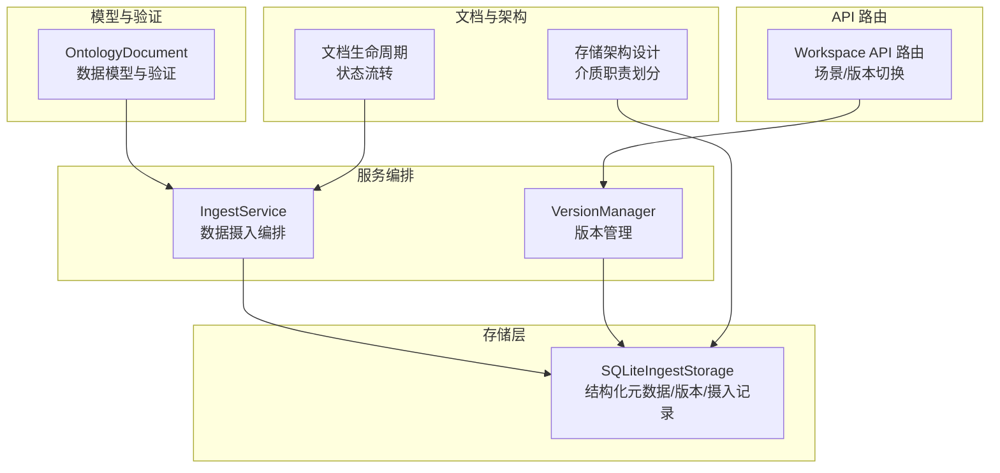
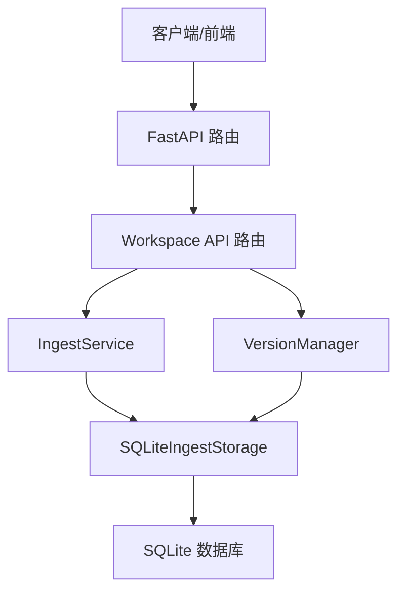
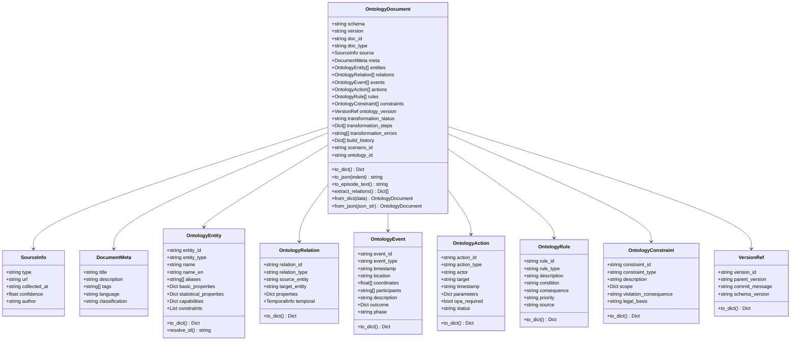
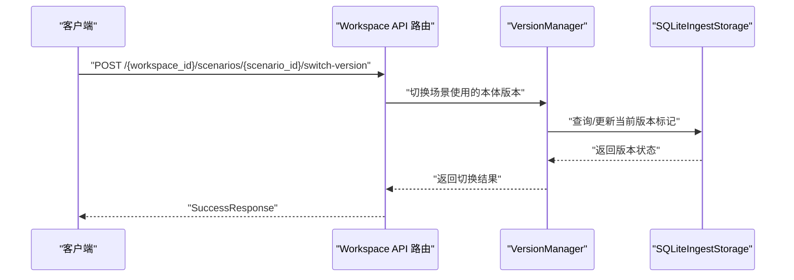
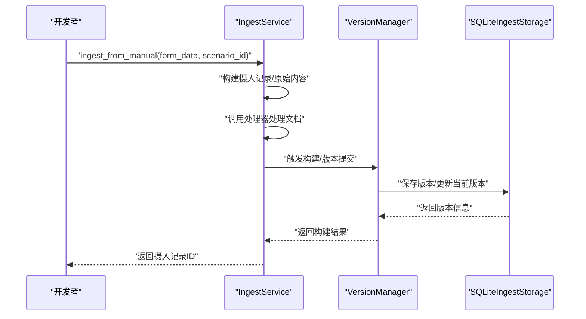
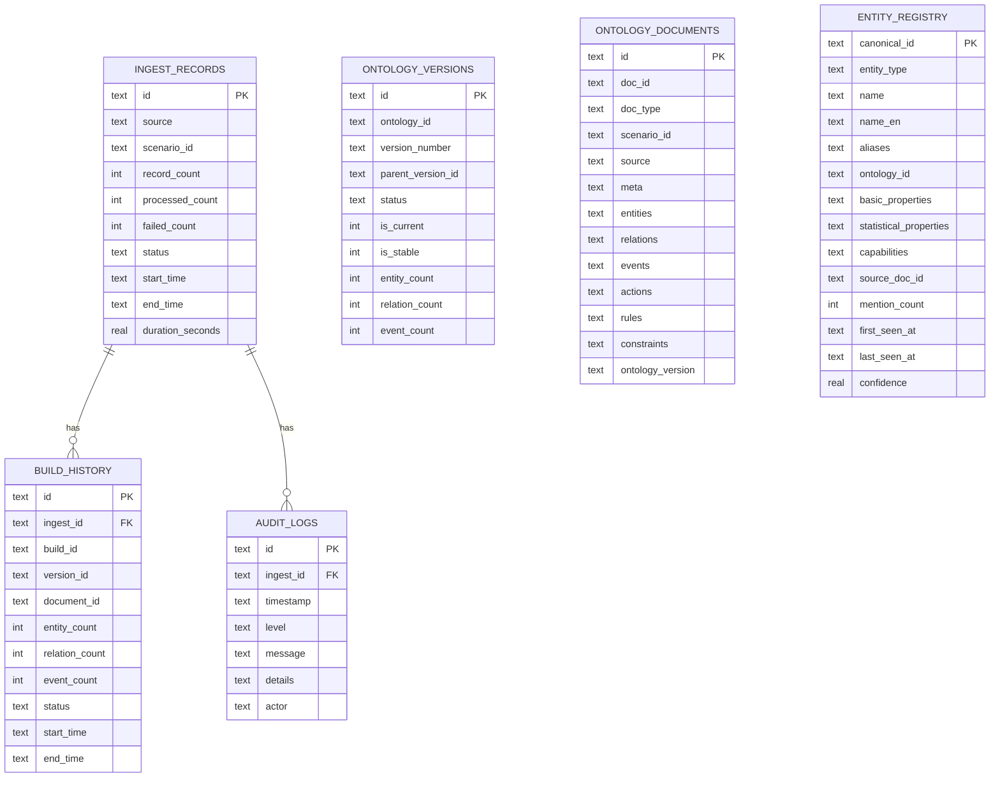

# 本体文档管理

<cite>
**本文引用的文件**
- [document.py](file://odap/biz/core/ontology/schema/document.py)
- [sqlite_ingest_storage.py](file://odap/biz/core/ontology/storage/sqlite_ingest_storage.py)
- [ingest_service.py](file://odap/biz/core/ontology/services/ingest_service.py)
- [version_service.py](file://odap/biz/core/ontology/services/version_service.py)
- [routes.py](file://odap/biz/platform/workspace/api/routes.py)
- [DOCUMENT_MANAGEMENT.md](file://docs/DOCUMENT_MANAGEMENT.md)
- [ARCHITECTURE_FULL_CHAIN_DEEP.md](file://docs/02-architecture/ARCHITECTURE_FULL_CHAIN_DEEP.md)
- [spec.md](file://docs/11-archive/specs/storage-architecture-redesign/spec.md)
- [tasks.md](file://docs/11-archive/specs/storage-architecture-redesign/tasks.md)
- [GRAPHITI_INTEGRATION.md](file://docs/03-modules/audit_log/GRAPHITI_INTEGRATION.md)
- [test_api_integration.py](file://tests/integration/test_api_integration.py)
</cite>

## 目录
1. [简介](#简介)
2. [项目结构](#项目结构)
3. [核心组件](#核心组件)
4. [架构总览](#架构总览)
5. [详细组件分析](#详细组件分析)
6. [依赖关系分析](#依赖关系分析)
7. [性能考量](#性能考量)
8. [故障排查指南](#故障排查指南)
9. [结论](#结论)
10. [附录](#附录)

## 简介
本文件面向“本体文档管理”子系统，系统化梳理本体文档的生命周期管理（创建、更新、查询、删除）、OntologyDocument 模型字段与约束、版本控制机制（版本号生成、版本比较、版本切换）、API 使用示例、存储策略与索引设计、以及错误处理与异常处置方案。目标是帮助开发者与产品人员快速理解并正确使用本体文档管理能力。

## 项目结构
围绕本体文档管理的关键代码分布在如下模块：
- 数据模型与验证：odap/biz/core/ontology/schema/document.py
- 存储层：odap/biz/core/ontology/storage/sqlite_ingest_storage.py
- 服务编排：odap/biz/core/ontology/services/ingest_service.py、odap/biz/core/ontology/services/version_service.py
- API 路由：odap/biz/platform/workspace/api/routes.py
- 文档与架构参考：docs/DOCUMENT_MANAGEMENT.md、docs/02-architecture/ARCHITECTURE_FULL_CHAIN_DEEP.md、docs/11-archive/specs/storage-architecture-redesign/spec.md、docs/11-archive/specs/storage-architecture-redesign/tasks.md、docs/03-modules/audit_log/GRAPHITI_INTEGRATION.md
- 测试与错误处理：tests/integration/test_api_integration.py

**图表来源**
- [document.py:212-275](file://odap/biz/core/ontology/schema/document.py#L212-L275)
- [sqlite_ingest_storage.py:52-265](file://odap/biz/core/ontology/storage/sqlite_ingest_storage.py#L52-L265)
- [ingest_service.py:330-353](file://odap/biz/core/ontology/services/ingest_service.py#L330-L353)
- [version_service.py:84-112](file://odap/biz/core/ontology/services/version_service.py#L84-L112)
- [routes.py:655-681](file://odap/biz/platform/workspace/api/routes.py#L655-L681)
- [DOCUMENT_MANAGEMENT.md:88-116](file://docs/DOCUMENT_MANAGEMENT.md#L88-L116)
- [spec.md:13-56](file://docs/11-archive/specs/storage-architecture-redesign/spec.md#L13-L56)

**章节来源**
- [document.py:1-575](file://odap/biz/core/ontology/schema/document.py#L1-L575)
- [sqlite_ingest_storage.py:1-800](file://odap/biz/core/ontology/storage/sqlite_ingest_storage.py#L1-L800)
- [ingest_service.py:1-972](file://odap/biz/core/ontology/services/ingest_service.py#L1-L972)
- [version_service.py:1-503](file://odap/biz/core/ontology/services/version_service.py#L1-L503)
- [routes.py:620-681](file://odap/biz/platform/workspace/api/routes.py#L620-L681)
- [DOCUMENT_MANAGEMENT.md:88-116](file://docs/DOCUMENT_MANAGEMENT.md#L88-L116)
- [ARCHITECTURE_FULL_CHAIN_DEEP.md:520-927](file://docs/02-architecture/ARCHITECTURE_FULL_CHAIN_DEEP.md#L520-L927)
- [spec.md:13-56](file://docs/11-archive/specs/storage-architecture-redesign/spec.md#L13-L56)
- [tasks.md:52-116](file://docs/11-archive/specs/storage-architecture-redesign/tasks.md#L52-L116)
- [GRAPHITI_INTEGRATION.md:444-476](file://docs/03-modules/audit_log/GRAPHITI_INTEGRATION.md#L444-L476)

## 核心组件
- OntologyDocument：标准化本体文档数据模型，承载实体、关系、事件、行动、规则、约束等，支持序列化/反序列化与校验。
- SQLiteIngestStorage：负责结构化元数据、摄入记录、版本、构建历史、审计日志等的持久化，提供索引与迁移能力。
- IngestService：统一的数据摄入服务，封装多种摄入入口（URL、新闻搜索、手动输入、JSON、自然语言、随机事件生成），并协调文档处理与版本构建。
- VersionManager：版本管理器，支持追加（append）与提交（commit）两种模式，生成版本ID与语义版本号，维护版本链与差异对比。
- Workspace API 路由：提供场景与版本切换的后端接口，支撑前端版本管理组件。

**章节来源**
- [document.py:212-275](file://odap/biz/core/ontology/schema/document.py#L212-L275)
- [sqlite_ingest_storage.py:52-265](file://odap/biz/core/ontology/storage/sqlite_ingest_storage.py#L52-L265)
- [ingest_service.py:330-353](file://odap/biz/core/ontology/services/ingest_service.py#L330-L353)
- [version_service.py:84-112](file://odap/biz/core/ontology/services/version_service.py#L84-L112)
- [routes.py:655-681](file://odap/biz/platform/workspace/api/routes.py#L655-L681)

## 架构总览
本体文档管理采用“模型-服务-存储-路由”的分层架构：
- 模型层：统一的 OntologyDocument 与子模型（实体、关系、事件、行动、规则、约束、版本引用）。
- 服务层：IngestService 负责摄入编排；VersionManager 负责版本管理；二者均依赖 SQLiteIngestStorage。
- 存储层：SQLite 负责结构化元数据与版本；文档内容以 JSON 文本形式存储于结构化表中；审计日志与实体注册表支持查询与去重。
- 路由层：Workspace API 提供场景与版本切换接口，配合前端版本管理组件。

**图表来源**
- [routes.py:655-681](file://odap/biz/platform/workspace/api/routes.py#L655-L681)
- [ingest_service.py:330-353](file://odap/biz/core/ontology/services/ingest_service.py#L330-L353)
- [version_service.py:84-112](file://odap/biz/core/ontology/services/version_service.py#L84-L112)
- [sqlite_ingest_storage.py:52-265](file://odap/biz/core/ontology/storage/sqlite_ingest_storage.py#L52-L265)

## 详细组件分析

### OntologyDocument 模型与字段定义
- 核心字段
  - schema、version：文档模式与版本标识
  - doc_id、doc_type：文档唯一标识与类型（事件/实体/场景/批处理）
  - source、meta：来源信息与文档元数据（标题、描述、标签、语言、分类）
  - entities、relations、events、actions、rules、constraints：本体内容体
  - ontology_version：版本引用（version_id、parent_version、commit_message、schema_version）
  - transformation_status、transformation_steps、transformation_errors：转换过程状态
  - build_history：构建历史
  - scenario_id、ontology_id：场景与本体归属
- 数据类型与约束
  - doc_id 非空且全局唯一
  - doc_type 限定枚举值
  - entities、relations、events 等集合为空时仍可序列化
  - 版本引用 VersionRef 包含父版本指针，支持版本链
- 序列化与反序列化
  - to_dict()/to_json() 输出标准化 JSON
  - from_dict()/from_json() 支持从字典/JSON恢复
- 校验器
  - OntologyDocumentSchema.validate() 校验必填字段、实体ID唯一性、关系端点一致性等
  - 返回 SchemaValidationResult，包含错误与警告列表

**图表来源**
- [document.py:212-275](file://odap/biz/core/ontology/schema/document.py#L212-L275)
- [document.py:66-195](file://odap/biz/core/ontology/schema/document.py#L66-L195)

**章节来源**
- [document.py:212-275](file://odap/biz/core/ontology/schema/document.py#L212-L275)
- [document.py:418-486](file://odap/biz/core/ontology/schema/document.py#L418-L486)

### 版本控制机制
- 两种操作模式
  - append：将新文档追加到当前版本快照，版本ID不变，适合热写入自动触发
  - commit：锁定当前版本并创建新版本，语义版本号 minor 递增
- 版本ID与版本号
  - 版本ID：v{YYYYMMDD}-{seq:03d}，保证同日递增序列
  - 版本号：语义版本 {major}.{minor}.{patch}，初始 1.0.0
- 版本链
  - 通过 parent_version_id 指针形成单向链表
- 存储与统计
  - SQLite 表 ontology_versions 存放版本元数据与统计（实体/关系/事件数量）
  - 当前版本标记 is_current，稳定版本标记 is_stable
- 差异对比
  - diff() 基于实体/关系/事件ID集合差集计算差异

**图表来源**
- [routes.py:655-681](file://odap/biz/platform/workspace/api/routes.py#L655-L681)
- [version_service.py:206-277](file://odap/biz/core/ontology/services/version_service.py#L206-L277)

**章节来源**
- [version_service.py:84-112](file://odap/biz/core/ontology/services/version_service.py#L84-L112)
- [version_service.py:114-128](file://odap/biz/core/ontology/services/version_service.py#L114-L128)
- [version_service.py:206-277](file://odap/biz/core/ontology/services/version_service.py#L206-L277)
- [version_service.py:402-425](file://odap/biz/core/ontology/services/version_service.py#L402-L425)

### 文档生命周期管理
- 状态流转：草稿 → 评审中 → 正式 → 维护中 → 归档 → 弃用
- 新建流程：确定类型/位置 → 使用模板 → 填写元数据 → 编写内容 → 更新索引 → 标记“评审中” → 团队评审 → 标记“正式”
- 评审与维护：按文档保真年限定期审查与更新

**图表来源**
- [DOCUMENT_MANAGEMENT.md:88-116](file://docs/DOCUMENT_MANAGEMENT.md#L88-L116)

**章节来源**
- [DOCUMENT_MANAGEMENT.md:88-116](file://docs/DOCUMENT_MANAGEMENT.md#L88-L116)

### API 使用示例（编程方式）
- 数据摄入（多种来源）
  - URL 抓取：ingest_from_url(...)
  - 新闻搜索：ingest_from_news(...)、ingest_from_tavily(...)
  - 手动输入：ingest_from_manual(...)
  - JSON 导入：ingest_from_json(...)
  - 自然语言：ingest_from_natural_language(...)
  - 随机事件：generate_random_events(...)
- 版本管理
  - 追加：append(ontology_id, doc, message)
  - 提交：commit(ontology_id, message)
  - 获取：get(version_id)、list(limit, offset)、diff(a, b)
- 场景与版本切换
  - POST /{workspace_id}/scenarios/{scenario_id}/switch-version

**图表来源**
- [ingest_service.py:538-595](file://odap/biz/core/ontology/services/ingest_service.py#L538-L595)
- [version_service.py:152-204](file://odap/biz/core/ontology/services/version_service.py#L152-L204)

**章节来源**
- [ingest_service.py:373-595](file://odap/biz/core/ontology/services/ingest_service.py#L373-L595)
- [version_service.py:152-204](file://odap/biz/core/ontology/services/version_service.py#L152-L204)
- [routes.py:655-681](file://odap/biz/platform/workspace/api/routes.py#L655-L681)

### 存储策略、索引设计与查询优化
- 存储介质职责划分
  - SQLite：工作空间、场景、摄入记录、版本元数据、实体注册表、审计日志
  - MongoDB：本体文档（entities/relations/events 等完整定义）
  - Neo4j（Graphiti）：图谱实例、审计日志（时序/关系）
- SQLite 表与索引
  - 结构化表：ingest_records、ontology_versions、ontology_documents、build_history、audit_logs、entity_registry
  - 索引：实体注册表按 (entity_type, name) 与 (ontology_id) 建立复合索引
- 查询优化建议
  - 为常用过滤字段（scenario_id、created_at、doc_id）建立索引
  - 使用 JSON 函数统计数组长度（如事件数量）以避免应用侧聚合
  - 批量写入与 WAL 模式提升吞吐

**图表来源**
- [sqlite_ingest_storage.py:62-265](file://odap/biz/core/ontology/storage/sqlite_ingest_storage.py#L62-L265)
- [spec.md:23-56](file://docs/11-archive/specs/storage-architecture-redesign/spec.md#L23-L56)

**章节来源**
- [sqlite_ingest_storage.py:52-265](file://odap/biz/core/ontology/storage/sqlite_ingest_storage.py#L52-L265)
- [spec.md:13-56](file://docs/11-archive/specs/storage-architecture-redesign/spec.md#L13-L56)
- [tasks.md:52-116](file://docs/11-archive/specs/storage-architecture-redesign/tasks.md#L52-L116)

## 依赖关系分析
- 模型依赖：OntologyDocument 依赖 SourceInfo、DocumentMeta、OntologyEntity/Relation/Event/Action/Rule/Constraint、VersionRef
- 服务依赖：IngestService 依赖 SQLiteIngestStorage、构建服务；VersionManager 依赖 SQLiteIngestStorage 与实体解析器
- 路由依赖：Workspace API 路由依赖场景服务与版本管理服务

```mermaid
graph LR
OD["OntologyDocument"] --> SI["SourceInfo"]
OD --> DM["DocumentMeta"]
OD --> OE["OntologyEntity"]
OD --> OR["OntologyRelation"]
OD --> OEvt["OntologyEvent"]
OD --> OA["OntologyAction"]
OD --> ORu["OntologyRule"]
OD --> OC["OntologyConstraint"]
OD --> VR["VersionRef"]
ISvc["IngestService"] --> SIS["SQLiteIngestStorage"]
VMgr["VersionManager"] --> SIS
API["Workspace API 路由"] --> VMgr
```

**图表来源**
- [document.py:212-275](file://odap/biz/core/ontology/schema/document.py#L212-L275)
- [ingest_service.py:330-353](file://odap/biz/core/ontology/services/ingest_service.py#L330-L353)
- [version_service.py:84-112](file://odap/biz/core/ontology/services/version_service.py#L84-L112)
- [routes.py:655-681](file://odap/biz/platform/workspace/api/routes.py#L655-L681)

**章节来源**
- [document.py:212-275](file://odap/biz/core/ontology/schema/document.py#L212-L275)
- [ingest_service.py:330-353](file://odap/biz/core/ontology/services/ingest_service.py#L330-L353)
- [version_service.py:84-112](file://odap/biz/core/ontology/services/version_service.py#L84-L112)
- [routes.py:655-681](file://odap/biz/platform/workspace/api/routes.py#L655-L681)

## 性能考量
- 存储介质选择：根据查询类型匹配最优存储（结构化/半结构化/图/时序）
- 索引策略：为高频过滤字段建立索引，减少全表扫描
- 批量写入：WAL 模式与批量插入降低写放大
- 查询优化：使用 JSON 函数统计数组长度，避免应用侧聚合
- 审计日志：异步通道 + 批量落盘，避免阻塞业务请求

**章节来源**
- [spec.md:57-107](file://docs/11-archive/specs/storage-architecture-redesign/spec.md#L57-L107)
- [GRAPHITI_INTEGRATION.md:444-476](file://docs/03-modules/audit_log/GRAPHITI_INTEGRATION.md#L444-L476)

## 故障排查指南
- 常见错误与处理
  - 无效场景ID：接口返回 200/404，前端应提示场景不存在
  - 空摄入负载：接口返回 400/422，检查必填字段
  - 畸形JSON：接口返回 400/422，检查 Content-Type 与 JSON 格式
  - 大数据量请求：接口返回 200/201，注意后端限流与超时
- 建议的错误处理流程
  - 前端捕获错误并显示消息
  - 后端记录审计日志，必要时重试或中止
  - 对网络/服务器/超时错误进行分级处理与用户提示

**章节来源**
- [test_api_integration.py:695-736](file://tests/integration/test_api_integration.py#L695-L736)
- [ARCHITECTURE_FULL_CHAIN_DEEP.md:899-927](file://docs/02-architecture/ARCHITECTURE_FULL_CHAIN_DEEP.md#L899-L927)

## 结论
本体文档管理通过统一的数据模型、完善的版本控制、清晰的存储分层与健壮的 API 路由，实现了从创建、更新、查询到删除的全生命周期管理。结合文档生命周期规范与存储架构设计，系统具备良好的可维护性与扩展性。建议在实际使用中遵循模型约束、合理设置版本策略、关注查询性能与错误处理。

## 附录
- 相关文档与设计
  - 文档生命周期与状态流转：[DOCUMENT_MANAGEMENT.md:88-116](file://docs/DOCUMENT_MANAGEMENT.md#L88-L116)
  - 前端摄入与 API 设计参考：[ARCHITECTURE_FULL_CHAIN_DEEP.md:177-209](file://docs/02-architecture/ARCHITECTURE_FULL_CHAIN_DEEP.md#L177-L209)
  - 存储架构与介质职责：[spec.md:13-56](file://docs/11-archive/specs/storage-architecture-redesign/spec.md#L13-L56)
  - 存储任务与索引策略：[tasks.md:52-116](file://docs/11-archive/specs/storage-architecture-redesign/tasks.md#L52-L116)
  - 审计日志与性能优化：[GRAPHITI_INTEGRATION.md:444-476](file://docs/03-modules/audit_log/GRAPHITI_INTEGRATION.md#L444-L476)