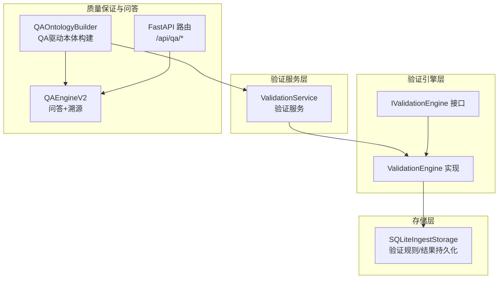
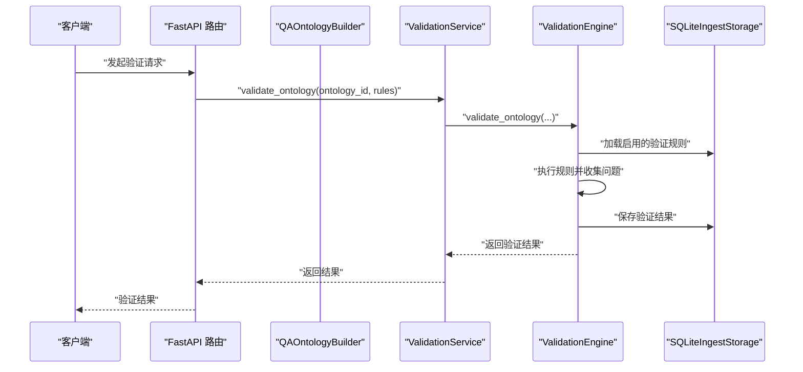
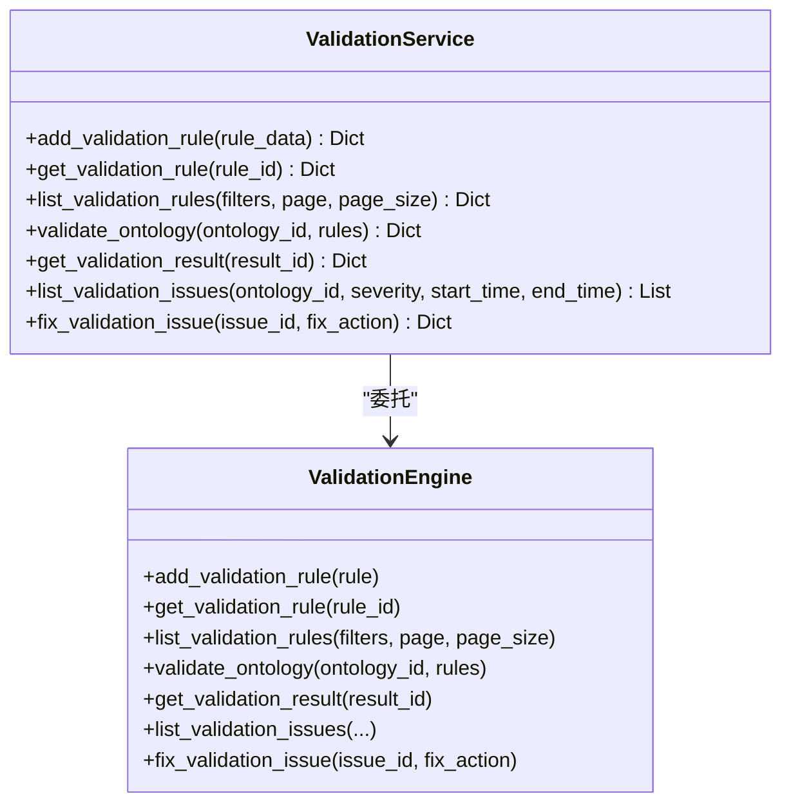
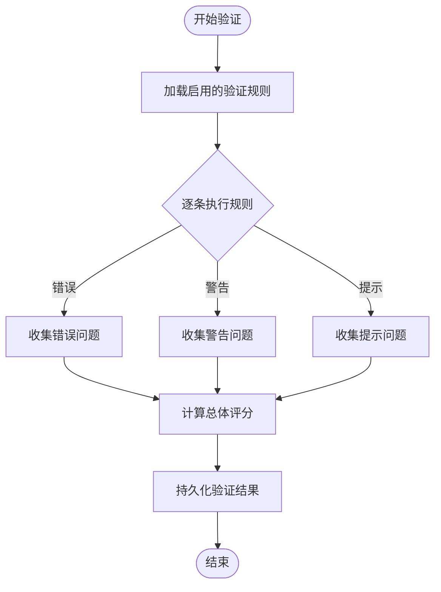
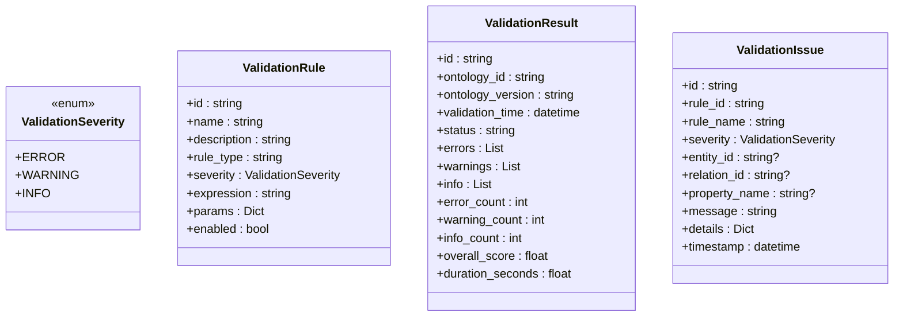
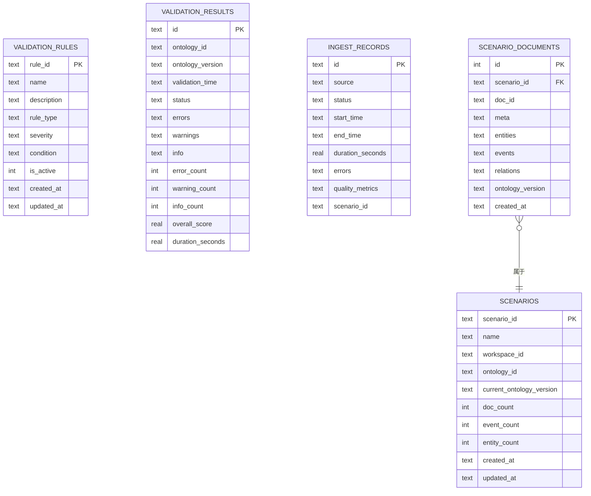
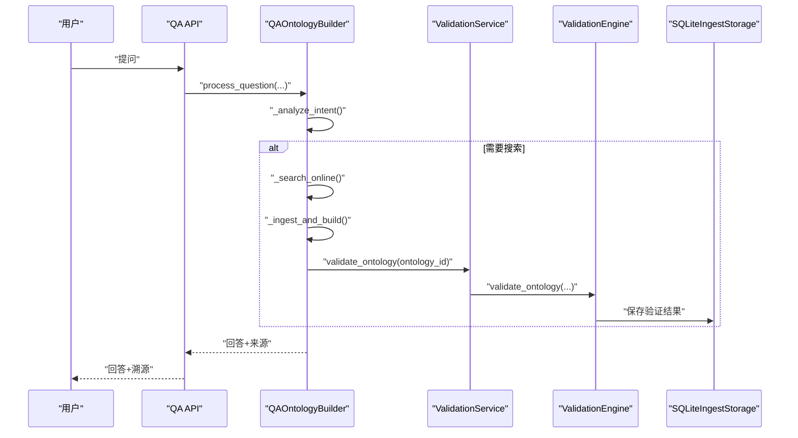
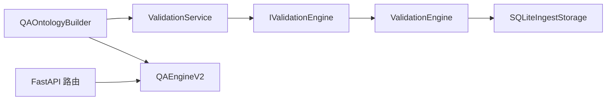

# 本体验证与质量保证

<cite>
**本文引用的文件**
- [validation_service.py](file://odap/biz/core/ontology/services/validation_service.py)
- [validation.py（模型）](file://odap/biz/core/ontology/models/validation.py)
- [validation.py（接口）](file://odap/biz/core/ontology/interfaces/validation.py)
- [validation.py（实现）](file://odap/biz/core/ontology/impl/validation.py)
- [sqlite_ingest_storage.py](file://odap/biz/core/ontology/storage/sqlite_ingest_storage.py)
- [qa_ontology_builder.py](file://odap/biz/core/ontology/services/qa_ontology_builder.py)
- [routes.py（QA API）](file://odap/biz/data/qa/api/routes.py)
- [qa_engine.py](file://odap/biz/data/qa/qa_engine.py)
- [test_ontology_engine.py](file://tests/unit/test_ontology_engine.py)
</cite>

## 目录
1. [简介](#简介)
2. [项目结构](#项目结构)
3. [核心组件](#核心组件)
4. [架构总览](#架构总览)
5. [详细组件分析](#详细组件分析)
6. [依赖分析](#依赖分析)
7. [性能考虑](#性能考虑)
8. [故障排查指南](#故障排查指南)
9. [结论](#结论)
10. [附录](#附录)

## 简介
本文件面向“本体验证与质量保证”主题，系统梳理了本体验证机制的设计原理、实现策略与质量保障流程。内容覆盖语法验证、语义验证与一致性检查的框架设计，验证规则集（实体完整性、关系有效性、约束满足度）的组织方式，以及自动验证、人工审核与质量评分的协同机制。同时提供验证失败的诊断思路、修复建议、性能优化与批量验证策略，并说明验证日志与报告生成的实现要点。

## 项目结构
围绕本体验证与质量保证的关键模块分布如下：
- 验证服务层：对外暴露验证规则管理与验证执行接口
- 验证引擎层：封装验证规则加载、执行与结果持久化
- 存储层：基于SQLite的验证规则与结果持久化
- 质量保证与问答联动：通过QA驱动的本体构建流程，结合实时检索与溯源，形成“验证-反馈-迭代”的闭环

**图表来源**
- [validation_service.py:1-203](file://odap/biz/core/ontology/services/validation_service.py#L1-L203)
- [validation.py（实现）:1-101](file://odap/biz/core/ontology/impl/validation.py#L1-L101)
- [validation.py（接口）:1-106](file://odap/biz/core/ontology/interfaces/validation.py#L1-L106)
- [sqlite_ingest_storage.py:1-800](file://odap/biz/core/ontology/storage/sqlite_ingest_storage.py#L1-L800)
- [qa_ontology_builder.py:1-508](file://odap/biz/core/ontology/services/qa_ontology_builder.py#L1-L508)
- [qa_engine.py:1-800](file://odap/biz/data/qa/qa_engine.py#L1-L800)
- [routes.py（QA API）:1-475](file://odap/biz/data/qa/api/routes.py#L1-L475)

**章节来源**
- [validation_service.py:1-203](file://odap/biz/core/ontology/services/validation_service.py#L1-L203)
- [validation.py（实现）:1-101](file://odap/biz/core/ontology/impl/validation.py#L1-L101)
- [sqlite_ingest_storage.py:1-800](file://odap/biz/core/ontology/storage/sqlite_ingest_storage.py#L1-L800)
- [qa_ontology_builder.py:1-508](file://odap/biz/core/ontology/services/qa_ontology_builder.py#L1-L508)
- [qa_engine.py:1-800](file://odap/biz/data/qa/qa_engine.py#L1-L800)
- [routes.py（QA API）:1-475](file://odap/biz/data/qa/api/routes.py#L1-L475)

## 核心组件
- 验证服务 ValidationService：提供规则增删查改、验证执行、结果查询、问题列表与修复等能力
- 验证引擎 ValidationEngine：负责规则加载、执行验证、聚合结果、持久化与评分计算
- 验证模型 ValidationRule/ValidationResult/ValidationIssue：定义规则、结果与问题的数据结构
- SQLiteIngestStorage：提供验证规则与结果的持久化存储
- QA驱动的本体构建 QAOntologyBuilder：将问答与本体更新结合，形成验证-反馈闭环
- QAEngineV2：提供多轮对话、RAG增强、溯源追踪与复杂问题升级能力

**章节来源**
- [validation_service.py:1-203](file://odap/biz/core/ontology/services/validation_service.py#L1-L203)
- [validation.py（模型）:1-58](file://odap/biz/core/ontology/models/validation.py#L1-L58)
- [validation.py（实现）:1-101](file://odap/biz/core/ontology/impl/validation.py#L1-L101)
- [sqlite_ingest_storage.py:1-800](file://odap/biz/core/ontology/storage/sqlite_ingest_storage.py#L1-L800)
- [qa_ontology_builder.py:1-508](file://odap/biz/core/ontology/services/qa_ontology_builder.py#L1-L508)
- [qa_engine.py:1-800](file://odap/biz/data/qa/qa_engine.py#L1-L800)

## 架构总览
下图展示了从规则管理到验证执行、结果持久化与QA联动的整体流程：

**图表来源**
- [validation_service.py:92-119](file://odap/biz/core/ontology/services/validation_service.py#L92-L119)
- [validation.py（实现）:30-83](file://odap/biz/core/ontology/impl/validation.py#L30-L83)
- [sqlite_ingest_storage.py:246-257](file://odap/biz/core/ontology/storage/sqlite_ingest_storage.py#L246-L257)

**章节来源**
- [validation_service.py:1-203](file://odap/biz/core/ontology/services/validation_service.py#L1-L203)
- [validation.py（实现）:1-101](file://odap/biz/core/ontology/impl/validation.py#L1-L101)
- [sqlite_ingest_storage.py:1-800](file://odap/biz/core/ontology/storage/sqlite_ingest_storage.py#L1-L800)

## 详细组件分析

### 组件A：验证服务 ValidationService
- 职责
  - 规则管理：新增、查询、分页列出验证规则
  - 验证执行：按指定规则或默认启用规则集对本体进行验证
  - 结果管理：获取验证结果、列出问题、修复问题
- 关键方法
  - add_validation_rule、get_validation_rule、list_validation_rules
  - validate_ontology、get_validation_result、list_validation_issues、fix_validation_issue
- 输出结构
  - 验证结果包含：结果ID、本体ID/版本、状态、各类计数、总体评分、耗时、验证时间、问题明细

**图表来源**
- [validation_service.py:8-203](file://odap/biz/core/ontology/services/validation_service.py#L8-L203)
- [validation.py（接口）:8-106](file://odap/biz/core/ontology/interfaces/validation.py#L8-L106)
- [validation.py（实现）:10-101](file://odap/biz/core/ontology/impl/validation.py#L10-L101)

**章节来源**
- [validation_service.py:1-203](file://odap/biz/core/ontology/services/validation_service.py#L1-L203)

### 组件B：验证引擎 ValidationEngine
- 职责
  - 加载验证规则（支持按ID或分页过滤）
  - 执行验证：遍历规则，生成问题并分类（错误/警告/提示）
  - 计算评分：基于规则数量与问题权重计算总体评分
  - 持久化：保存验证结果至SQLite
- 关键点
  - 规则启用控制：仅启用规则参与验证
  - 评分公式：以规则总数与问题权重为基础的归一化评分
  - 问题聚合：按严重级别分类汇总

**图表来源**
- [validation.py（实现）:30-83](file://odap/biz/core/ontology/impl/validation.py#L30-L83)
- [sqlite_ingest_storage.py:191-208](file://odap/biz/core/ontology/storage/sqlite_ingest_storage.py#L191-L208)

**章节来源**
- [validation.py（实现）:1-101](file://odap/biz/core/ontology/impl/validation.py#L1-L101)

### 组件C：验证模型 ValidationRule/ValidationResult/ValidationIssue
- 验证严重级别 ValidationSeverity：错误、警告、提示
- 验证规则 ValidationRule：包含ID、名称、描述、规则类型（实体/关系/属性）、严重级别、表达式、参数、启用状态
- 验证结果 ValidationResult：包含本体ID/版本、验证时间、状态、问题计数、总体评分、耗时
- 验证问题 ValidationIssue：包含规则ID/名称、严重级别、实体/关系/属性定位、消息、详情、时间戳

**图表来源**
- [validation.py（模型）:10-58](file://odap/biz/core/ontology/models/validation.py#L10-L58)

**章节来源**
- [validation.py（模型）:1-58](file://odap/biz/core/ontology/models/validation.py#L1-L58)

### 组件D：存储层 SQLiteIngestStorage
- 职责
  - 初始化数据库与表结构（验证规则、验证结果、摄入记录、审计日志等）
  - 提供验证规则与结果的CRUD操作
  - 支持场景化数据（场景、场景文档）的存取
- 关键表
  - validation_rules：规则元数据
  - validation_results：验证结果与评分
  - ingest_records、audit_logs、build_history：摄入与审计链路

**图表来源**
- [sqlite_ingest_storage.py:246-257](file://odap/biz/core/ontology/storage/sqlite_ingest_storage.py#L246-L257)
- [sqlite_ingest_storage.py:191-208](file://odap/biz/core/ontology/storage/sqlite_ingest_storage.py#L191-L208)
- [sqlite_ingest_storage.py:353-352](file://odap/biz/core/ontology/storage/sqlite_ingest_storage.py#L353-L352)

**章节来源**
- [sqlite_ingest_storage.py:1-800](file://odap/biz/core/ontology/storage/sqlite_ingest_storage.py#L1-L800)

### 组件E：QA驱动的本体构建与质量保证
- QAOntologyBuilder
  - 通过意图分析决定是否需要联网搜索
  - 联网搜索后将结果转换为本体文档并入库
  - 与验证服务协作，对新增/更新的本体进行自动验证
- QAEngineV2
  - 多轮对话、RAG检索、双时态查询、溯源追踪
  - 与验证结果结合，为人工审核提供上下文与证据链

**图表来源**
- [qa_ontology_builder.py:94-187](file://odap/biz/core/ontology/services/qa_ontology_builder.py#L94-L187)
- [validation_service.py:92-119](file://odap/biz/core/ontology/services/validation_service.py#L92-L119)
- [validation.py（实现）:30-83](file://odap/biz/core/ontology/impl/validation.py#L30-L83)
- [sqlite_ingest_storage.py:191-208](file://odap/biz/core/ontology/storage/sqlite_ingest_storage.py#L191-L208)

**章节来源**
- [qa_ontology_builder.py:1-508](file://odap/biz/core/ontology/services/qa_ontology_builder.py#L1-L508)
- [routes.py（QA API）:164-194](file://odap/biz/data/qa/api/routes.py#L164-L194)
- [qa_engine.py:602-783](file://odap/biz/data/qa/qa_engine.py#L602-L783)

## 依赖分析
- 组件耦合
  - ValidationService 依赖 ValidationEngine 接口，便于替换实现
  - ValidationEngine 依赖 SQLiteIngestStorage 进行规则与结果持久化
  - QAOntologyBuilder 依赖 ValidationService 与 QAEngineV2，形成“验证-问答-反馈”的闭环
- 外部依赖
  - FastAPI 路由提供 QA 服务入口
  - LLM 客户端用于生成回答（在 QAEngineV2 中按需加载）

**图表来源**
- [validation_service.py:1-203](file://odap/biz/core/ontology/services/validation_service.py#L1-L203)
- [validation.py（接口）:1-106](file://odap/biz/core/ontology/interfaces/validation.py#L1-L106)
- [validation.py（实现）:1-101](file://odap/biz/core/ontology/impl/validation.py#L1-L101)
- [sqlite_ingest_storage.py:1-800](file://odap/biz/core/ontology/storage/sqlite_ingest_storage.py#L1-L800)
- [qa_ontology_builder.py:1-508](file://odap/biz/core/ontology/services/qa_ontology_builder.py#L1-L508)
- [routes.py（QA API）:1-475](file://odap/biz/data/qa/api/routes.py#L1-L475)

**章节来源**
- [validation_service.py:1-203](file://odap/biz/core/ontology/services/validation_service.py#L1-L203)
- [validation.py（实现）:1-101](file://odap/biz/core/ontology/impl/validation.py#L1-L101)
- [sqlite_ingest_storage.py:1-800](file://odap/biz/core/ontology/storage/sqlite_ingest_storage.py#L1-L800)
- [qa_ontology_builder.py:1-508](file://odap/biz/core/ontology/services/qa_ontology_builder.py#L1-L508)
- [routes.py（QA API）:1-475](file://odap/biz/data/qa/api/routes.py#L1-L475)

## 性能考虑
- 规则加载与执行
  - 仅加载启用规则，减少无效验证开销
  - 评分计算基于规则总数与问题权重，避免复杂度爆炸
- 存储优化
  - SQLite WAL 模式提升并发写入性能
  - 为实体注册表建立索引，加速实体消歧与检索
- 批量验证
  - 建议按场景/版本批量触发验证，避免重复扫描全量规则
  - 对高频规则采用缓存策略（如内存缓存规则表达式）
- I/O 与网络
  - QA引擎的外部检索与LLM调用应设置超时与重试
  - RAG检索结果按置信度排序，减少下游处理负担

[本节为通用性能指导，无需特定文件引用]

## 故障排查指南
- 验证规则缺失或禁用
  - 现象：验证结果为空或评分异常
  - 排查：确认规则是否启用；检查规则表是否存在；核对规则类型与目标对象匹配
  - 修复：启用对应规则或调整规则表达式
- 验证结果未落库
  - 现象：查询不到验证结果
  - 排查：检查存储初始化与表结构迁移；确认保存流程是否抛出异常
  - 修复：重建表或回滚迁移；完善异常捕获与重试
- QA构建流程中断
  - 现象：意图分析失败、搜索无结果、回答为空
  - 排查：查看意图关键词匹配、网络搜索服务可用性、LLM客户端初始化
  - 修复：补充关键词规则、切换备用检索源、检查环境变量与密钥
- 日志与审计
  - 建议开启存储层审计日志，记录摄入与验证关键节点，便于回溯

**章节来源**
- [sqlite_ingest_storage.py:787-800](file://odap/biz/core/ontology/storage/sqlite_ingest_storage.py#L787-L800)
- [validation.py（实现）:85-101](file://odap/biz/core/ontology/impl/validation.py#L85-L101)
- [qa_engine.py:634-651](file://odap/biz/data/qa/qa_engine.py#L634-L651)

## 结论
本体验证与质量保证体系以“规则驱动+存储持久化+QA联动”为核心路径，实现了从规则管理、验证执行到结果反馈的闭环。通过明确的严重级别与评分机制，结合QA引擎的检索与溯源能力，既支持自动化验证，又为人工审核提供了充分上下文。后续可在规则表达式编译缓存、批量验证调度与可视化报告方面进一步优化。

[本节为总结性内容，无需特定文件引用]

## 附录

### 验证规则集与检查维度
- 实体完整性检查
  - 必填字段校验（名称、类型、基本属性）
  - 唯一性约束（实体ID、名称/别名）
  - 消歧一致性（同一实体在不同来源的一致性）
- 关系有效性验证
  - 源/标的存在性与类型匹配
  - 关系方向与语义一致性
  - 循环依赖与环路检测
- 约束条件满足度评估
  - 属性取值范围与格式
  - 时序约束（事件时间、事务时间）
  - 场景/工作空间隔离与可见性

[本节为概念性说明，无需特定文件引用]

### 自动验证、人工审核与质量评分
- 自动验证
  - 基于启用规则集的批处理验证
  - 评分阈值告警（低分自动阻断发布）
- 人工审核
  - 问题列表筛选与优先级排序
  - 溯源追踪辅助定位问题根因
- 质量评分
  - 归一化评分 = max(0, 1 - Σ(问题权重)/规则数)
  - 按严重级别加权（错误>警告>提示）

**章节来源**
- [validation.py（实现）:78-83](file://odap/biz/core/ontology/impl/validation.py#L78-L83)

### 验证日志与报告
- 日志记录
  - 存储层审计日志记录摄入与验证关键事件
  - QA引擎记录检索、生成与溯源过程
- 报告生成
  - 验证结果导出（问题清单、评分、耗时）
  - 场景化报告（按场景/版本聚合统计）

**章节来源**
- [sqlite_ingest_storage.py:787-800](file://odap/biz/core/ontology/storage/sqlite_ingest_storage.py#L787-L800)
- [routes.py（QA API）:345-475](file://odap/biz/data/qa/api/routes.py#L345-L475)

### 单元测试与质量验证
- 数据质量校验
  - 通过转换服务对文档进行质量评估
- 转换统计
  - 统计转换次数、错误数与成功率

**章节来源**
- [test_ontology_engine.py:51-72](file://tests/unit/test_ontology_engine.py#L51-L72)