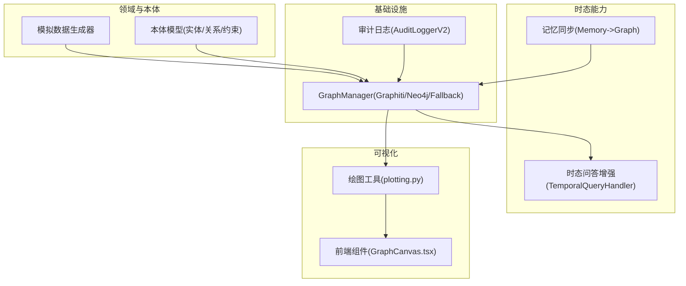
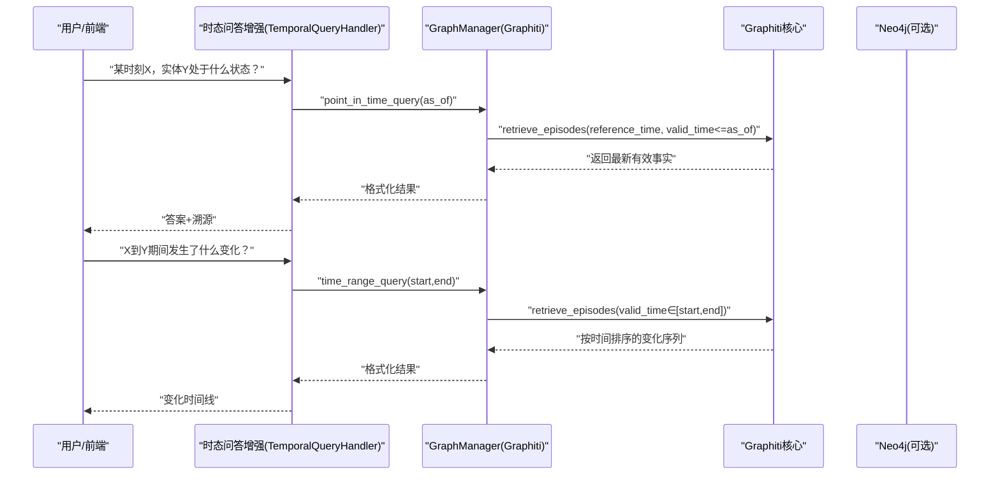
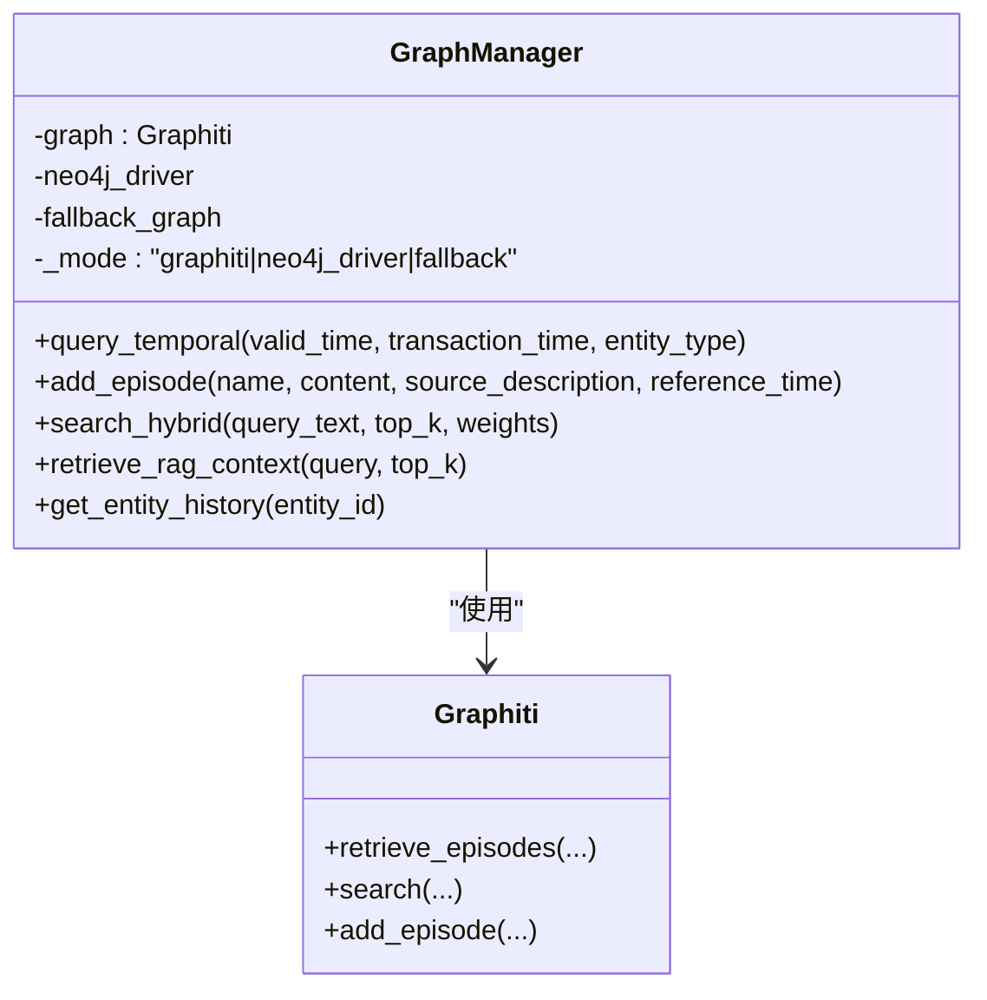
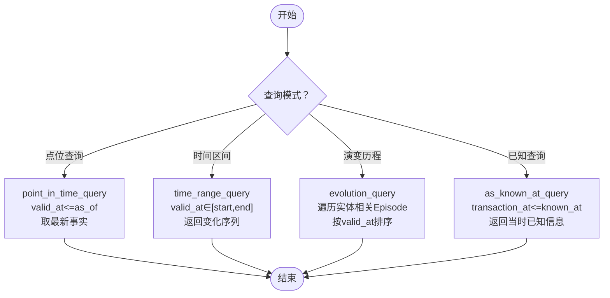
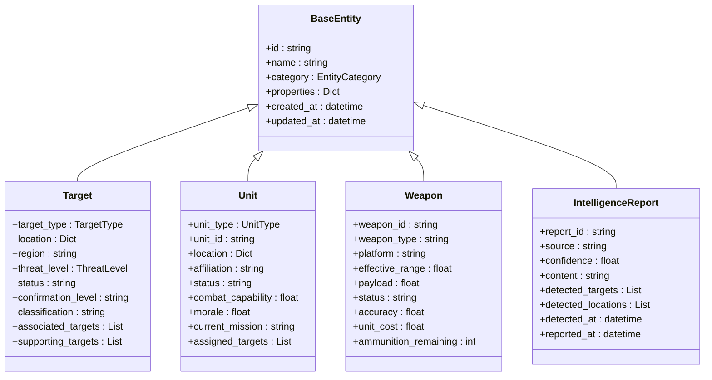
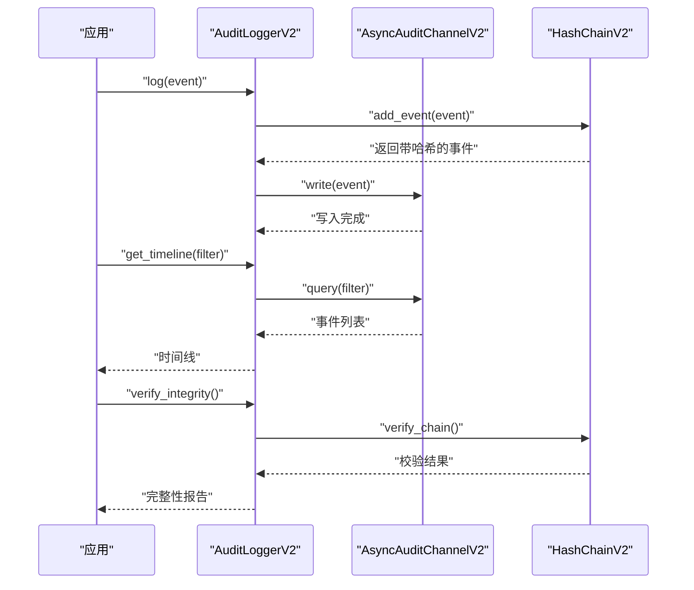
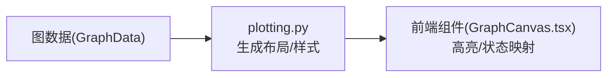
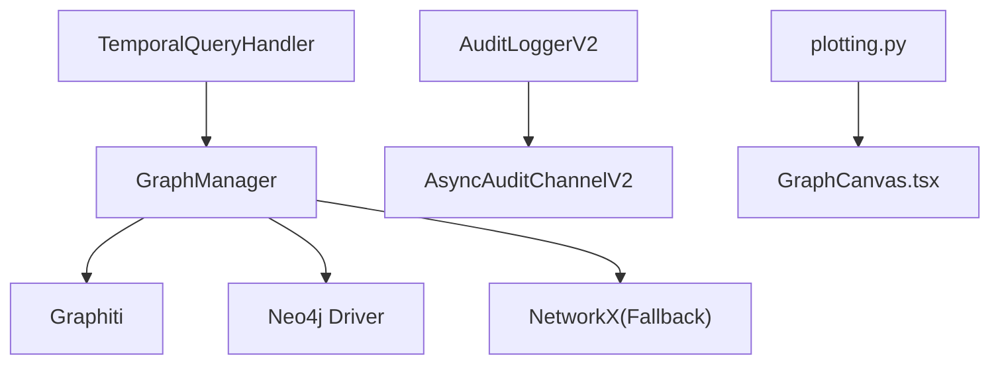

# 双时态知识图谱

<cite>
**本文引用的文件**   
- [graph_service.py](file://odap/infra/graph/graph_service.py)
- [DESIGN.md](file://docs/03-modules/qa_engine/DESIGN.md)
- [ARCHITECTURE_FULL_CHAIN_DEEP.md](file://docs/02-architecture/ARCHITECTURE_FULL_CHAIN_DEEP.md)
- [DFX_DESIGN.md](file://docs/06-dfx/DFX_DESIGN.md)
- [DESIGN.md](file://docs/03-modules/ontology/DESIGN.md)
- [data_generator.py](file://odap/biz/core/ontology/mock_data/data_generator.py)
- [audit_logger_v2.py](file://odap/infra/security/audit_logger_v2.py)
- [memory_graph_sync.py](file://odap/biz/platform/ontology_memory/graph_sync/memory_graph_sync.py)
- [plotting.py](file://odap/tools/visualization/plotting.py)
- [GraphCanvas.tsx](file://frontend/src/modules/ontology/components/GraphCanvas.tsx)
</cite>

## 目录
1. [简介](#简介)
2. [项目结构](#项目结构)
3. [核心组件](#核心组件)
4. [架构总览](#架构总览)
5. [详细组件分析](#详细组件分析)
6. [依赖分析](#依赖分析)
7. [性能考虑](#性能考虑)
8. [故障排查指南](#故障排查指南)
9. [结论](#结论)
10. [附录](#附录)

## 简介
本技术文档围绕“双时态知识图谱”展开，系统阐述 Graphiti 双时态知识图谱的核心概念、时序推理机制、图数据结构设计、存储与查询优化策略，并结合项目现有实现给出可操作的时态查询示例与最佳实践。重点区分 valid_time（有效时间）与 transaction_time（事务时间），解释其在历史数据追溯、时态一致性保障与因果分析中的作用，以及相较传统静态图谱的优势与业务价值。

## 项目结构
该项目采用分层模块化组织，核心围绕“图谱基础设施（Graphiti/Neo4j/Fallback）—本体与领域模型—问答与Agent—可视化与前端”的架构展开。与双时态知识图谱直接相关的模块包括：
- 图谱基础设施：odap/infra/graph/graph_service.py 提供 Graphiti/Neo4j/Fallback 三层降级与双时态查询接口
- 本体与领域模型：docs/03-modules/ontology/DESIGN.md 定义实体类型与关系层次
- 时态问答增强：docs/03-modules/qa_engine/DESIGN.md 提出双时态查询模式与与Agent协作
- 性能与非功能性设计：docs/02-architecture/ARCHITECTURE_FULL_CHAIN_DEEP.md、docs/06-dfx/DFX_DESIGN.md
- 模拟数据：odap/biz/core/ontology/mock_data/data_generator.py 用于加载示例实体与关系
- 审计与时间线：odap/infra/security/audit_logger_v2.py 提供事件时间线与完整性校验
- 图同步与记忆：odap/biz/platform/ontology_memory/graph_sync/memory_graph_sync.py 将记忆以Episode形式写入图谱
- 可视化：odap/tools/visualization/plotting.py 与 frontend/src/modules/ontology/components/GraphCanvas.tsx 支持图数据渲染

**图表来源**
- [graph_service.py:145-185](file://odap/infra/graph/graph_service.py#L145-L185)
- [DESIGN.md:22-55](file://docs/03-modules/ontology/DESIGN.md#L22-L55)
- [DESIGN.md:551-612](file://docs/03-modules/qa_engine/DESIGN.md#L551-L612)
- [audit_logger_v2.py:421-437](file://odap/infra/security/audit_logger_v2.py#L421-L437)
- [memory_graph_sync.py:39-57](file://odap/biz/platform/ontology_memory/graph_sync/memory_graph_sync.py#L39-L57)
- [plotting.py:123-165](file://odap/tools/visualization/plotting.py#L123-L165)
- [GraphCanvas.tsx:1161-1187](file://frontend/src/modules/ontology/components/GraphCanvas.tsx#L1161-L1187)

**章节来源**
- [graph_service.py:145-185](file://odap/infra/graph/graph_service.py#L145-L185)
- [DESIGN.md:22-55](file://docs/03-modules/ontology/DESIGN.md#L22-L55)
- [DESIGN.md:551-612](file://docs/03-modules/qa_engine/DESIGN.md#L551-L612)
- [audit_logger_v2.py:421-437](file://odap/infra/security/audit_logger_v2.py#L421-L437)
- [memory_graph_sync.py:39-57](file://odap/biz/platform/ontology_memory/graph_sync/memory_graph_sync.py#L39-L57)
- [plotting.py:123-165](file://odap/tools/visualization/plotting.py#L123-L165)
- [GraphCanvas.tsx:1161-1187](file://frontend/src/modules/ontology/components/GraphCanvas.tsx#L1161-L1187)

## 核心组件
- GraphManager（图管理器）：封装 Graphiti/Neo4j/Fallback 三层降级，提供实体/关系增删改查、混合检索、RAG上下文检索、双时态查询与Episode批量写入等能力
- TemporalQueryHandler（时态查询处理器）：基于 Graphiti 的 valid_time 与 transaction_time，提供“某时刻状态”“时间区间变化”“实体演变历程”“按某时刻已知信息回答”等查询模式
- AuditLoggerV2（审计日志）：提供事件时间线、完整性校验与统计，支撑时序一致性审计
- 可视化组件：plotting.py 与 GraphCanvas.tsx 支持图数据渲染与交互

**章节来源**
- [graph_service.py:71-144](file://odap/infra/graph/graph_service.py#L71-L144)
- [DESIGN.md:551-612](file://docs/03-modules/qa_engine/DESIGN.md#L551-L612)
- [audit_logger_v2.py:421-437](file://odap/infra/security/audit_logger_v2.py#L421-L437)

## 架构总览
双时态知识图谱在本项目中的落地体现为：
- 有效时间（valid_time）：实体状态在现实世界中有效的时刻或区间，用于“某时刻状态”“时间区间变化”等查询
- 事务时间（transaction_time）：数据被记录到系统中的时刻或区间，用于“按某时刻已知信息回答”“审计溯源”
- Episode（事件）：Graphiti 的核心时态单元，承载实体/关系的变更与事实描述，支持按 valid_time/transaction_time 检索
- 三层降级：Graphiti（核心）→ Neo4j Driver（直连）→ NetworkX Fallback（纯内存）

**图表来源**
- [DESIGN.md:564-611](file://docs/03-modules/qa_engine/DESIGN.md#L564-L611)
- [graph_service.py:1405-1457](file://odap/infra/graph/graph_service.py#L1405-L1457)

**章节来源**
- [DESIGN.md:551-612](file://docs/03-modules/qa_engine/DESIGN.md#L551-L612)
- [graph_service.py:1405-1457](file://odap/infra/graph/graph_service.py#L1405-L1457)

## 详细组件分析

### GraphManager（图管理器）
- 三层降级策略：优先 Graphiti（双时态核心），其次 Neo4j Driver（Cypher 直连），最后 NetworkX Fallback（纯内存）
- 双时态查询接口：query_temporal(valid_time, transaction_time, entity_type)，内部通过 Graphiti 的 retrieve_episodes 按时态参数检索
- Episode 写入：add_episode/add_episodes_batch 将实体/关系变更以自然语言描述写入图谱，形成可检索的历史事实
- 混合检索：search_hybrid 结合 Graphiti 向量检索与 Neo4j 关键词检索，提升召回与效率
- RAG 上下文：retrieve_rag_context 基于向量搜索与 Episode 回忆生成自然语言上下文

**图表来源**
- [graph_service.py:71-144](file://odap/infra/graph/graph_service.py#L71-L144)
- [graph_service.py:1405-1457](file://odap/infra/graph/graph_service.py#L1405-L1457)
- [graph_service.py:1617-1675](file://odap/infra/graph/graph_service.py#L1617-L1675)
- [graph_service.py:1718-1801](file://odap/infra/graph/graph_service.py#L1718-L1801)

**章节来源**
- [graph_service.py:71-144](file://odap/infra/graph/graph_service.py#L71-L144)
- [graph_service.py:1405-1457](file://odap/infra/graph/graph_service.py#L1405-L1457)
- [graph_service.py:1617-1675](file://odap/infra/graph/graph_service.py#L1617-L1675)
- [graph_service.py:1718-1801](file://odap/infra/graph/graph_service.py#L1718-L1801)

### TemporalQueryHandler（时态查询处理器）
- point_in_time_query：按有效时间 as_of 查询实体在某时刻的状态（取 valid_at ≤ as_of 的最新事实）
- time_range_query：查询某时间区间内的变化序列（valid_at ∈ [start,end]）
- evolution_query：按实体 ID 获取其完整演变时间线（遍历该实体相关 Episode 并排序）
- as_known_at_query：按事务时间 known_at 返回“当时已知”的信息（transaction_at ≤ known_at）

**图表来源**
- [DESIGN.md:564-611](file://docs/03-modules/qa_engine/DESIGN.md#L564-L611)

**章节来源**
- [DESIGN.md:551-612](file://docs/03-modules/qa_engine/DESIGN.md#L551-L612)

### 本体与领域模型
- 实体类型层次：Target、Unit、Weapon、IntelligenceReport、StrikeOrder 等，定义属性、状态、关联与验证规则
- 与 Graphiti 集成：本体模型作为数据模式基础，实体/关系经由 GraphManager 写入图谱

**图表来源**
- [DESIGN.md:103-200](file://docs/03-modules/ontology/DESIGN.md#L103-L200)

**章节来源**
- [DESIGN.md:22-55](file://docs/03-modules/ontology/DESIGN.md#L22-L55)
- [DESIGN.md:103-200](file://docs/03-modules/ontology/DESIGN.md#L103-L200)

### 审计与时间线（AuditLoggerV2）
- 提供事件时间线查询与完整性校验（SHA-256 链式校验）
- 支持按工作空间、时间范围过滤，便于审计与溯源

**图表来源**
- [audit_logger_v2.py:421-437](file://odap/infra/security/audit_logger_v2.py#L421-L437)
- [audit_logger_v2.py:438-474](file://odap/infra/security/audit_logger_v2.py#L438-L474)
- [audit_logger_v2.py:358-376](file://odap/infra/security/audit_logger_v2.py#L358-L376)

**章节来源**
- [audit_logger_v2.py:342-490](file://odap/infra/security/audit_logger_v2.py#L342-L490)

### 可视化与前端
- 绘图工具：plotting.py 基于 NetworkX 生成图布局与样式，支持节点/边颜色与尺寸映射
- 前端组件：GraphCanvas.tsx 支持节点/边高亮与状态映射，便于交互式探索图谱

**图表来源**
- [plotting.py:123-165](file://odap/tools/visualization/plotting.py#L123-L165)
- [plotting.py:161-203](file://odap/tools/visualization/plotting.py#L161-L203)
- [GraphCanvas.tsx:1161-1187](file://frontend/src/modules/ontology/components/GraphCanvas.tsx#L1161-L1187)

**章节来源**
- [plotting.py:123-165](file://odap/tools/visualization/plotting.py#L123-L165)
- [plotting.py:161-203](file://odap/tools/visualization/plotting.py#L161-L203)
- [GraphCanvas.tsx:1161-1187](file://frontend/src/modules/ontology/components/GraphCanvas.tsx#L1161-L1187)

## 依赖分析
- GraphManager 依赖 Graphiti（核心时态能力）、Neo4j Driver（降级与辅助检索）、NetworkX（Fallback）
- TemporalQueryHandler 依赖 GraphManager 的 query_temporal 与 Episode 检索
- AuditLoggerV2 与 GraphManager 解耦，通过事件通道与哈希链实现审计与完整性
- 可视化模块与前端组件独立于图谱核心，通过数据格式对接

**图表来源**
- [graph_service.py:52-69](file://odap/infra/graph/graph_service.py#L52-L69)
- [DESIGN.md:551-612](file://docs/03-modules/qa_engine/DESIGN.md#L551-L612)
- [audit_logger_v2.py:421-437](file://odap/infra/security/audit_logger_v2.py#L421-L437)

**章节来源**
- [graph_service.py:52-69](file://odap/infra/graph/graph_service.py#L52-L69)
- [DESIGN.md:551-612](file://docs/03-modules/qa_engine/DESIGN.md#L551-L612)
- [audit_logger_v2.py:421-437](file://odap/infra/security/audit_logger_v2.py#L421-L437)

## 性能考虑
- 查询延迟优化：Neo4j 索引 + 连接池预热 + 查询缓存；Graphiti 客户端三级缓存（内存/Redis/Disk）
- 并发能力：API 网关异步 + 连接池；Graphiti 客户端内置连接池；WebSocket 并发管理
- 检索策略：并行化 RAG 检索 + 流式输出；批量 Episode 写入；关键词检索与向量检索融合
- 非功能性指标：P95 查询延迟 < 500ms、并发用户 > 100、简单问答响应 < 3s、复杂问答响应 < 10s

**章节来源**
- [DFX_DESIGN.md:38-69](file://docs/06-dfx/DFX_DESIGN.md#L38-L69)
- [ARCHITECTURE_FULL_CHAIN_DEEP.md:5091-5136](file://docs/02-architecture/ARCHITECTURE_FULL_CHAIN_DEEP.md#L5091-L5136)

## 故障排查指南
- Graphiti 初始化失败：检查 graphiti-core 与 Neo4j 连通性，查看断路器状态与重连尝试
- 回退模式启用：当 Graphiti 不可用时自动降级，查询接口返回全量实体而非时态结果
- Episode 写入失败：检查名称去重、批处理大小与异常捕获；必要时回退到 Fallback
- 审计时间线异常：使用 verify_integrity 校验完整性，按工作空间/时间范围过滤查询

**章节来源**
- [graph_service.py:145-185](file://odap/infra/graph/graph_service.py#L145-L185)
- [graph_service.py:1417-1421](file://odap/infra/graph/graph_service.py#L1417-L1421)
- [graph_service.py:1744-1801](file://odap/infra/graph/graph_service.py#L1744-L1801)
- [audit_logger_v2.py:342-350](file://odap/infra/security/audit_logger_v2.py#L342-L350)

## 结论
本项目通过 Graphiti 双时态知识图谱实现了有效时间与事务时间的统一建模，结合 Episode 事件机制与三层降级策略，在保证时序一致性的同时兼顾性能与可用性。配合本体模型、时态问答增强、审计与可视化能力，可在复杂业务场景中实现历史状态恢复、变化趋势分析与因果关系挖掘，显著提升知识推理与决策支持能力。

## 附录

### 时态查询示例（基于现有实现）
- 截至某时刻状态
  - 调用 GraphManager.query_temporal(valid_time={"lte": "as_of"}, entity_type=None)
  - 返回满足 valid_at ≤ as_of 的实体事实
- 时间区间变化
  - 调用 GraphManager.query_temporal(valid_time={"gte": "start", "lte": "end"}, entity_type=None)
  - 返回按时间排序的变化序列
- 实体演变历程
  - 调用 GraphManager.get_entity_history(entity_id) 获取该实体相关 Episode
  - 在上层按 valid_at 排序生成演变时间线
- 按某时刻已知信息回答
  - 调用 GraphManager.query_temporal(transaction_time={"lte": "known_at"}, entity_type=None)
  - 返回 transaction_at ≤ known_at 的事实集合

**章节来源**
- [graph_service.py:1405-1457](file://odap/infra/graph/graph_service.py#L1405-L1457)
- [graph_service.py:1369-1403](file://odap/infra/graph/graph_service.py#L1369-L1403)
- [DESIGN.md:564-611](file://docs/03-modules/qa_engine/DESIGN.md#L564-L611)

### 与传统静态图谱的区别与优势
- 区别：传统静态图谱仅记录当前状态；双时态图谱以 Episode 记录状态变更，区分有效时间与事务时间
- 优势：支持历史状态恢复、变化趋势分析、因果关系挖掘、审计溯源与时态一致性保障

**章节来源**
- [DESIGN.md:551-612](file://docs/03-modules/qa_engine/DESIGN.md#L551-L612)
- [audit_logger_v2.py:417-419](file://odap/infra/security/audit_logger_v2.py#L417-L419)