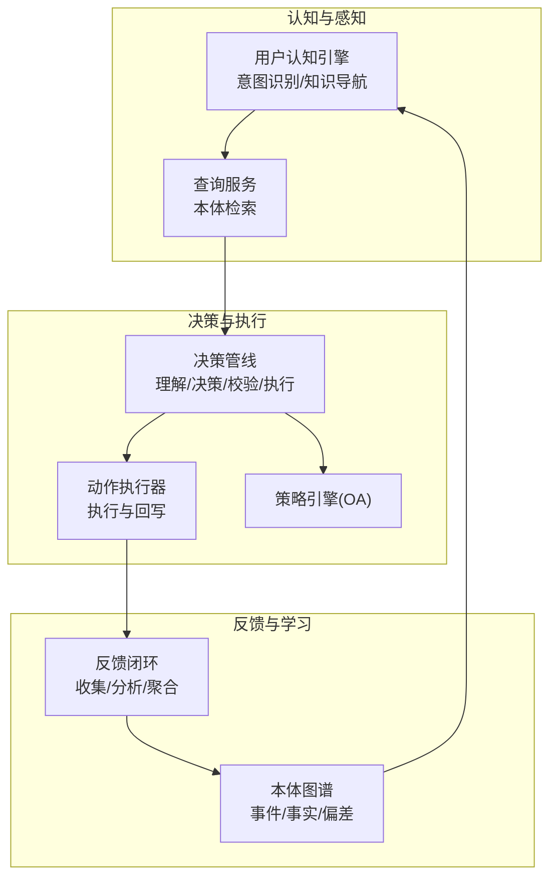
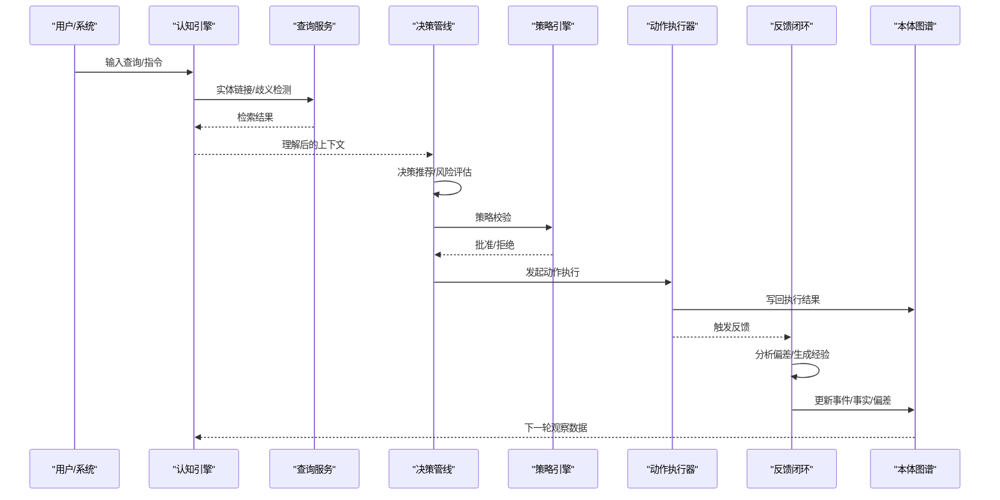
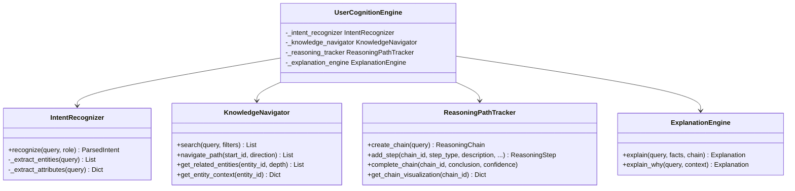
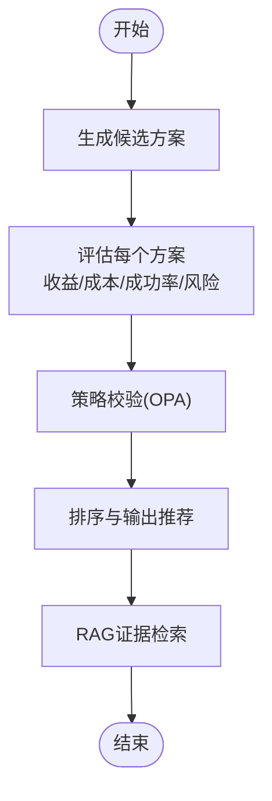
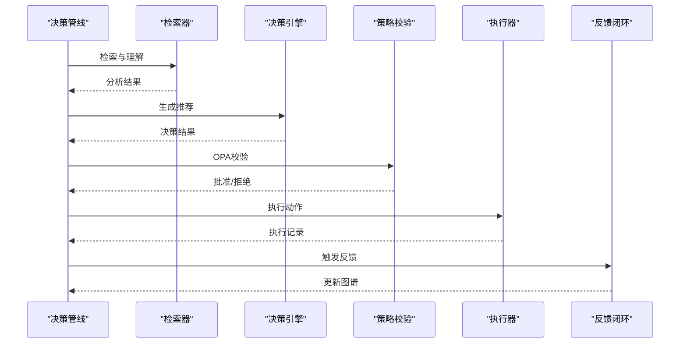
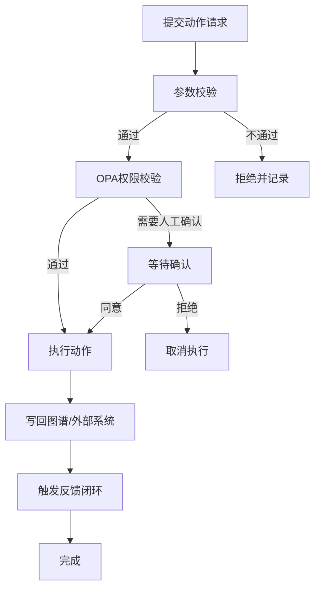
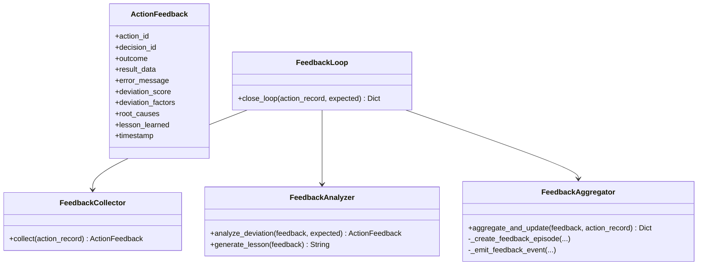
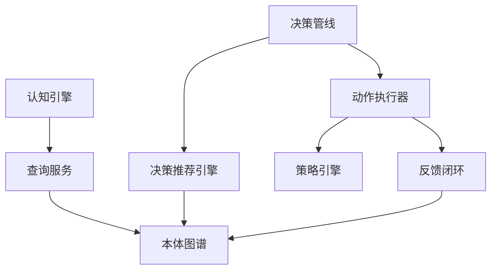

# OODA循环系统

<cite>
**本文引用的文件**
- [ARCHITECTURE_BIZ.md](file://docs/02-architecture/ARCHITECTURE_BIZ.md)
- [ADR-051_闭环反馈机制设计.md](file://docs/07-adr/ADR-051_闭环反馈机制设计.md)
- [ARCHITECTURE_FULL_CHAIN_DEEP.md](file://docs/02-architecture/ARCHITECTURE_FULL_CHAIN_DEEP.md)
- [user_cognition_engine.py](file://odap/biz/core/cognition/user_cognition_engine.py)
- [executor.py](file://odap/biz/decision/action_service/executor.py)
- [feedback_loop.py](file://odap/biz/decision/action_service/feedback_loop.py)
- [pipeline.py](file://odap/biz/decision/decision_pipeline/pipeline.py)
- [engine.py](file://odap/biz/decision/decision_recommendation/engine.py)
- [routes.py](file://odap/biz/core/cognition/api/routes.py)
- [service.py](file://odap/infra/query/service.py)
- [performance_monitor.py](file://odap/infra/monitoring/performance_monitor.py)
- [agent_config.yaml](file://config/agent_config.yaml)
- [test_oadp_loop.py](file://tests/integration/test_oadp_loop.py)
- [test_feedback.py](file://tests/unit/test_feedback.py)
</cite>

## 目录
1. [简介](#简介)
2. [项目结构](#项目结构)
3. [核心组件](#核心组件)
4. [架构总览](#架构总览)
5. [详细组件分析](#详细组件分析)
6. [依赖关系分析](#依赖关系分析)
7. [性能考量](#性能考量)
8. [故障排查指南](#故障排查指南)
9. [结论](#结论)
10. [附录](#附录)

## 简介
本文件为 OODA（观察-判断-决策-行动）循环系统的深入技术文档。系统围绕“感知-理解-决策-执行-反馈”闭环展开，覆盖数据采集、意图识别、推理分析、策略校验、行动执行与效果回写等关键环节，并通过闭环反馈实现持续优化。文档同时给出用户认知引擎的工作原理、反馈循环机制、配置参数、性能监控与优化策略，并提供可复用的应用案例与代码示例路径。

## 项目结构
- 业务架构与闭环反馈机制由架构文档明确：闭环反馈作为“执行→感知”的桥梁，将动作执行结果自动回流到本体图谱，驱动模型进化。
- 认知引擎负责意图识别、知识导航、解释与角色视图，支撑“观察-理解”阶段。
- 决策管线整合“理解-决策-执行-反馈”，并通过策略引擎（OPA）进行合规校验。
- 性能监控与配置贯穿系统各层，保障运行稳定性与可观测性。

**图表来源**
- [ARCHITECTURE_BIZ.md:405-476](file://docs/02-architecture/ARCHITECTURE_BIZ.md#L405-L476)
- [user_cognition_engine.py:787-800](file://odap/biz/core/cognition/user_cognition_engine.py#L787-L800)
- [pipeline.py:13-139](file://odap/biz/decision/decision_pipeline/pipeline.py#L13-L139)
- [executor.py:10-175](file://odap/biz/decision/action_service/executor.py#L10-L175)
- [feedback_loop.py:290-311](file://odap/biz/decision/action_service/feedback_loop.py#L290-L311)

**章节来源**
- [ARCHITECTURE_BIZ.md:405-476](file://docs/02-architecture/ARCHITECTURE_BIZ.md#L405-L476)

## 核心组件
- 用户认知引擎：负责意图识别、实体链接、歧义检测与知识导航，支撑“观察-理解”阶段。
- 决策推荐引擎：基于分析结果生成候选方案，进行风险评估与策略校验，输出推荐结论。
- 决策管线：串联理解、决策、策略校验与执行，并在执行完成后触发反馈闭环。
- 动作执行器：执行具体动作，写回图谱与外部系统，并在成功后触发反馈闭环。
- 反馈闭环：收集执行结果，分析偏差，生成经验教训，更新知识图谱。
- 查询服务：提供本体检索与拓扑查询能力，支撑认知与决策。
- 性能监控：统一采集与统计关键指标，辅助性能优化与告警。

**章节来源**
- [user_cognition_engine.py:140-227](file://odap/biz/core/cognition/user_cognition_engine.py#L140-L227)
- [engine.py:34-124](file://odap/biz/decision/decision_recommendation/engine.py#L34-L124)
- [pipeline.py:13-139](file://odap/biz/decision/decision_pipeline/pipeline.py#L13-L139)
- [executor.py:10-175](file://odap/biz/decision/action_service/executor.py#L10-L175)
- [feedback_loop.py:290-311](file://odap/biz/decision/action_service/feedback_loop.py#L290-L311)
- [service.py:11-126](file://odap/infra/query/service.py#L11-L126)
- [performance_monitor.py:12-184](file://odap/infra/monitoring/performance_monitor.py#L12-L184)

## 架构总览
OODA闭环的关键流程如下：
- 观察（Observe）：通过感知数据采集与查询服务检索，形成初始态势。
- 理解（Orient）：认知引擎进行意图识别与知识导航，结合历史与上下文形成理解。
- 决策（Decide）：决策推荐引擎生成候选方案，进行风险评估与策略校验。
- 行动（Act）：动作执行器执行推荐方案，写回图谱与外部系统。
- 反馈（Feedback）：反馈闭环收集执行结果，分析偏差与根因，沉淀经验，更新知识图谱，驱动下一轮观察。

**图表来源**
- [ARCHITECTURE_BIZ.md:554-641](file://docs/02-architecture/ARCHITECTURE_BIZ.md#L554-L641)
- [user_cognition_engine.py:140-227](file://odap/biz/core/cognition/user_cognition_engine.py#L140-L227)
- [service.py:33-59](file://odap/infra/query/service.py#L33-L59)
- [pipeline.py:64-139](file://odap/biz/decision/decision_pipeline/pipeline.py#L64-L139)
- [executor.py:139-175](file://odap/biz/decision/action_service/executor.py#L139-L175)
- [feedback_loop.py:290-311](file://odap/biz/decision/action_service/feedback_loop.py#L290-L311)

## 详细组件分析

### 用户认知引擎（意图识别与上下文理解）
- 意图识别：基于正则与关键词匹配，识别信息查询、数据分析、决策建议、动作执行等意图类型。
- 实体链接：在本体图谱中模糊搜索匹配实体，支持歧义检测与澄清。
- 知识导航：通过查询服务或图谱客户端进行实体邻接与拓扑查询，形成上下文。
- 推理链追踪与解释：支持推理步骤可视化与解释生成，提升可解释性。

**图表来源**
- [user_cognition_engine.py:140-786](file://odap/biz/core/cognition/user_cognition_engine.py#L140-L786)

**章节来源**
- [user_cognition_engine.py:140-227](file://odap/biz/core/cognition/user_cognition_engine.py#L140-L227)
- [user_cognition_engine.py:305-466](file://odap/biz/core/cognition/user_cognition_engine.py#L305-L466)
- [user_cognition_engine.py:468-561](file://odap/biz/core/cognition/user_cognition_engine.py#L468-L561)
- [user_cognition_engine.py:563-680](file://odap/biz/core/cognition/user_cognition_engine.py#L563-L680)
- [ARCHITECTURE_FULL_CHAIN_DEEP.md:2462-2559](file://docs/02-architecture/ARCHITECTURE_FULL_CHAIN_DEEP.md#L2462-L2559)

### 决策推荐引擎（推理分析与方案生成）
- 候选方案生成：基于分析结果或用户提供的选项，构造决策方案。
- 评估与排序：计算优先级评分、预期收益/成本、成功率与风险，进行综合排序。
- 策略校验：对接 OPA，确保方案符合组织策略。
- RAG 增强：利用图谱检索证据，提升推荐可信度与可解释性。

**图表来源**
- [engine.py:63-124](file://odap/biz/decision/decision_recommendation/engine.py#L63-L124)
- [engine.py:125-196](file://odap/biz/decision/decision_recommendation/engine.py#L125-L196)
- [engine.py:351-396](file://odap/biz/decision/decision_recommendation/engine.py#L351-L396)

**章节来源**
- [engine.py:34-124](file://odap/biz/decision/decision_recommendation/engine.py#L34-L124)
- [engine.py:125-196](file://odap/biz/decision/decision_recommendation/engine.py#L125-L196)
- [engine.py:351-396](file://odap/biz/decision/decision_recommendation/engine.py#L351-L396)

### 决策管线（端到端执行编排）
- 管线阶段：分析、决策、策略校验、执行、反馈。
- 依赖注入：动态获取检索器、决策引擎、执行器与反馈闭环。
- 失败处理：任一阶段失败均记录错误并终止后续阶段。

**图表来源**
- [pipeline.py:64-139](file://odap/biz/decision/decision_pipeline/pipeline.py#L64-L139)
- [pipeline.py:257-272](file://odap/biz/decision/decision_pipeline/pipeline.py#L257-L272)

**章节来源**
- [pipeline.py:13-139](file://odap/biz/decision/decision_pipeline/pipeline.py#L13-L139)
- [pipeline.py:232-256](file://odap/biz/decision/decision_pipeline/pipeline.py#L232-L256)

### 动作执行器（执行与回写）
- 参数校验与目标类型匹配。
- OPA 权限校验，必要时等待人工确认。
- 执行动作并写回图谱与外部系统。
- 成功后触发反馈闭环，写入执行事件与偏差信息。

**图表来源**
- [executor.py:48-175](file://odap/biz/decision/action_service/executor.py#L48-L175)

**章节来源**
- [executor.py:10-175](file://odap/biz/decision/action_service/executor.py#L10-L175)

### 反馈闭环（偏差分析与知识更新）
- 收集：从动作记录提取执行结果，生成反馈对象。
- 分析：对比预期与实际，识别偏差因子与根因，计算偏差分数。
- 聚合：更新图谱实体属性，创建反馈事件节点，触发钩子事件。
- 学习：生成经验教训，沉淀到知识图谱，指导后续决策。

**图表来源**
- [feedback_loop.py:10-311](file://odap/biz/decision/action_service/feedback_loop.py#L10-L311)

**章节来源**
- [ADR-051_闭环反馈机制设计.md:96-258](file://docs/07-adr/ADR-051_闭环反馈机制设计.md#L96-L258)
- [feedback_loop.py:23-311](file://odap/biz/decision/action_service/feedback_loop.py#L23-L311)

### 查询服务（本体检索与拓扑查询）
- 支持模式解析与多源查询：Schema/Entity/Topo/Temporal。
- 提供实体搜索、邻接查询、路径遍历与历史查询。
- 为认知引擎与决策管线提供底层检索能力。

**章节来源**
- [service.py:11-126](file://odap/infra/query/service.py#L11-L126)

## 依赖关系分析
- 认知引擎依赖查询服务与图谱客户端，形成“意图识别→知识导航”的闭环。
- 决策管线依赖检索器、决策引擎与执行器，形成“理解→决策→执行”的闭环。
- 执行器依赖 OPA 与图谱客户端，执行后触发反馈闭环。
- 反馈闭环依赖图谱与钩子系统，实现“执行→反馈→学习”的闭环。

**图表来源**
- [user_cognition_engine.py:305-466](file://odap/biz/core/cognition/user_cognition_engine.py#L305-L466)
- [pipeline.py:13-139](file://odap/biz/decision/decision_pipeline/pipeline.py#L13-L139)
- [executor.py:10-175](file://odap/biz/decision/action_service/executor.py#L10-L175)
- [feedback_loop.py:290-311](file://odap/biz/decision/action_service/feedback_loop.py#L290-L311)

**章节来源**
- [pipeline.py:13-139](file://odap/biz/decision/decision_pipeline/pipeline.py#L13-L139)
- [executor.py:10-175](file://odap/biz/decision/action_service/executor.py#L10-L175)

## 性能考量
- 性能监控：统一采集 LLM 调用、数据库查询、API 请求与工具执行等指标，支持统计与导出。
- 指标与告警：基于黄金信号（延迟、流量、错误、饱和度、业务指标）建立 Prometheus 监控。
- 自适应优化：根据查询复杂度选择 RAG 策略，预热数据库连接池，提升并发与响应时间。
- 配置参数：提供 LLM Provider 配置（模型、温度、最大 token、基础 URL），支持运行时热调。

**章节来源**
- [performance_monitor.py:12-184](file://odap/infra/monitoring/performance_monitor.py#L12-L184)
- [ARCHITECTURE_OPS.md:52-97](file://docs/02-architecture/ARCHITECTURE_OPS.md#L52-L97)
- [ARCHITECTURE_FULL_CHAIN_DEEP.md:5091-5136](file://docs/02-architecture/ARCHITECTURE_FULL_CHAIN_DEEP.md#L5091-L5136)
- [agent_config.yaml:1-23](file://config/agent_config.yaml#L1-L23)

## 故障排查指南
- 意图识别失败：检查查询服务与实体链接逻辑，确认是否存在歧义实体与需要澄清的场景。
- 决策被策略拒绝：检查 OPA 配置与策略规则，确认输入上下文与约束是否满足策略要求。
- 执行失败：查看动作执行器的错误信息与写回状态，确认图谱写入与外部系统回调是否成功。
- 反馈闭环异常：检查反馈收集、分析与聚合流程，确认图谱事件创建与钩子触发是否正常。
- 单元与集成测试：参考测试用例，验证闭环流程与偏差分析逻辑。

**章节来源**
- [test_oadp_loop.py:331-344](file://tests/integration/test_oadp_loop.py#L331-L344)
- [test_feedback.py:430-464](file://tests/unit/test_feedback.py#L430-L464)

## 结论
本 OODA 循环系统通过“认知-决策-执行-反馈”的闭环设计，实现了从感知到行动再到学习的自动化与智能化。用户认知引擎提供意图识别与知识导航，决策推荐引擎进行方案生成与策略校验，动作执行器负责落地执行与回写，反馈闭环将执行结果转化为知识增量。配合完善的性能监控与配置体系，系统具备良好的可扩展性与可运维性。

## 附录

### 配置参数
- LLM Provider 配置（模型、温度、最大 token、基础 URL）：
  - [agent_config.yaml:1-23](file://config/agent_config.yaml#L1-L23)

### API 接口
- 意图识别接口（前端兼容）：
  - [routes.py:1271-1314](file://odap/biz/core/cognition/api/routes.py#L1271-L1314)

### 应用案例与代码示例
- OADP 闭环执行流程（端到端示例）：
  - [ARCHITECTURE_BIZ.md:554-641](file://docs/02-architecture/ARCHITECTURE_BIZ.md#L554-L641)
- 流式 OODA 执行器（异步输出）：
  - [ARCHITECTURE_BIZ.md:644-705](file://docs/02-architecture/ARCHITECTURE_BIZ.md#L644-L705)
- 决策推荐引擎（方案生成与策略校验）：
  - [engine.py:63-124](file://odap/biz/decision/decision_recommendation/engine.py#L63-L124)
- 反馈闭环（偏差分析与知识更新）：
  - [ADR-051_闭环反馈机制设计.md:96-258](file://docs/07-adr/ADR-051_闭环反馈机制设计.md#L96-L258)
- 决策管线（端到端编排）：
  - [pipeline.py:64-139](file://odap/biz/decision/decision_pipeline/pipeline.py#L64-L139)