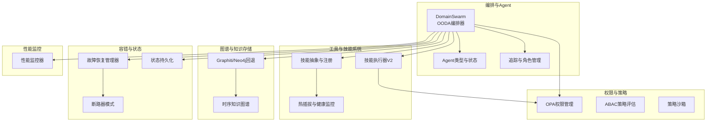
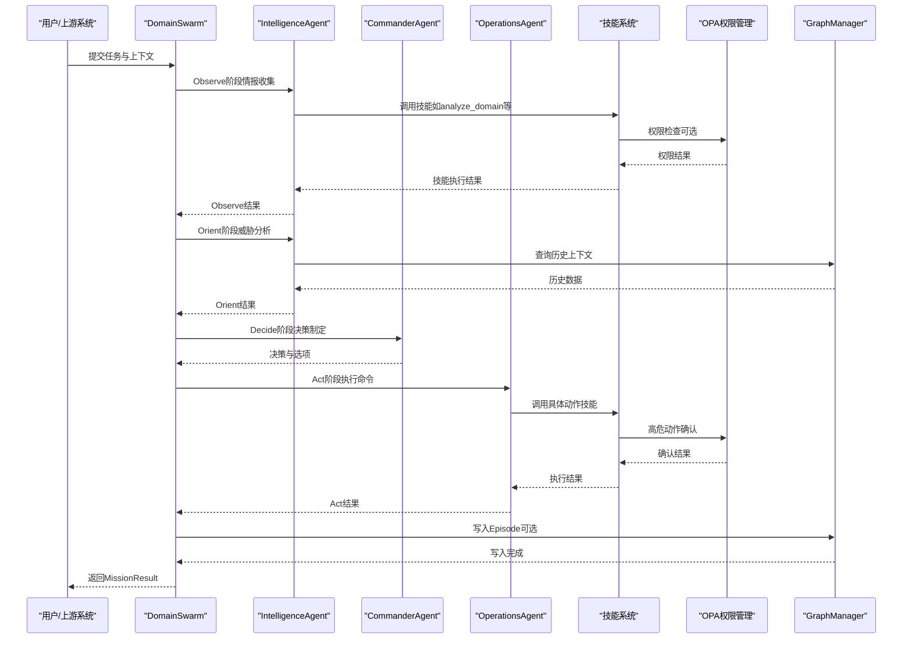
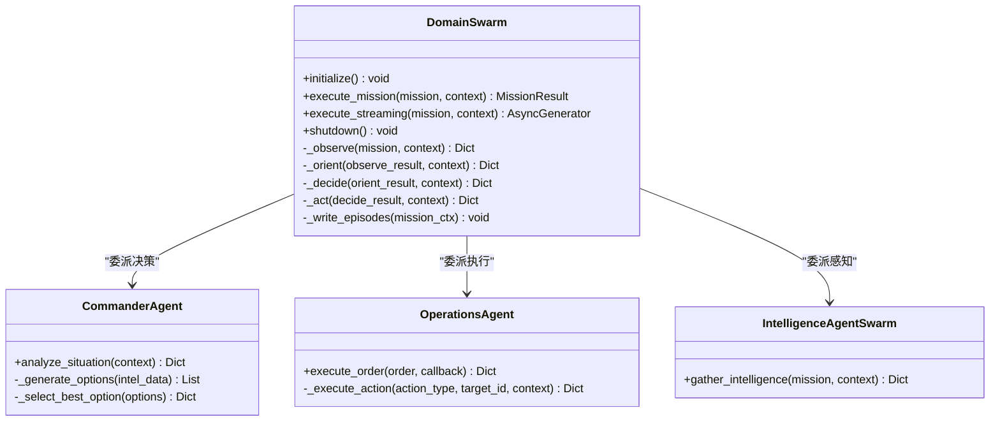
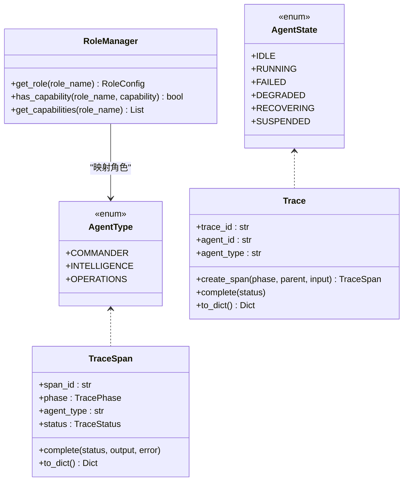
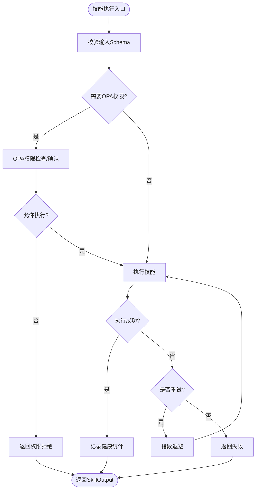
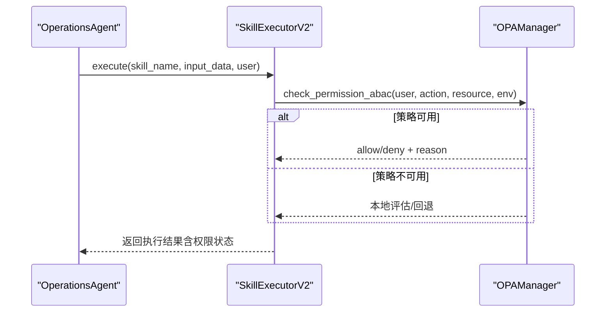
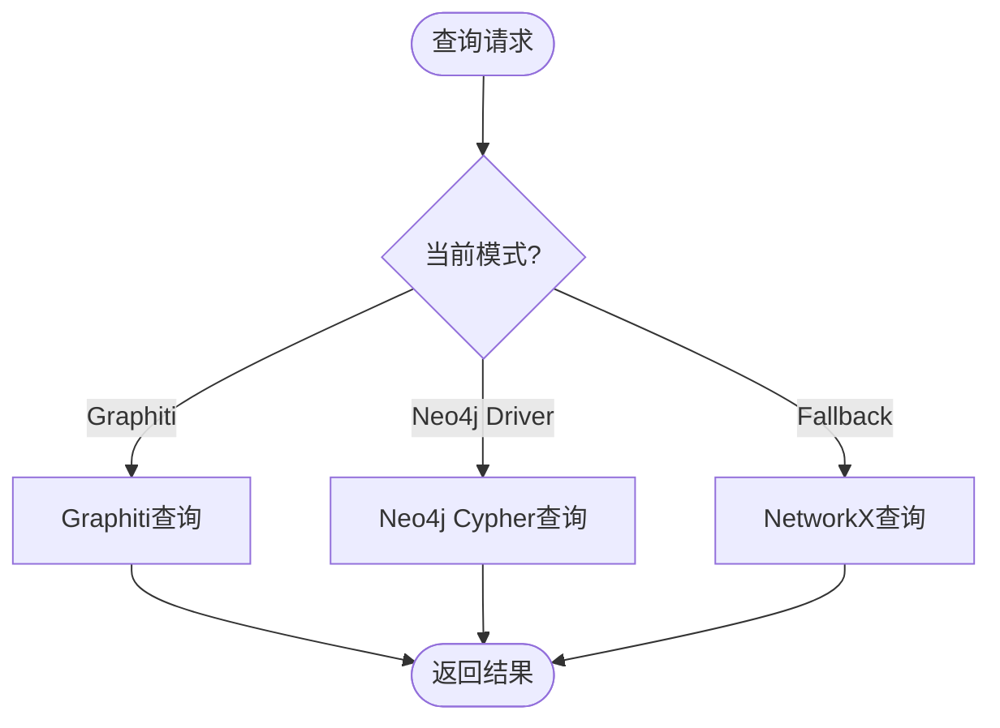
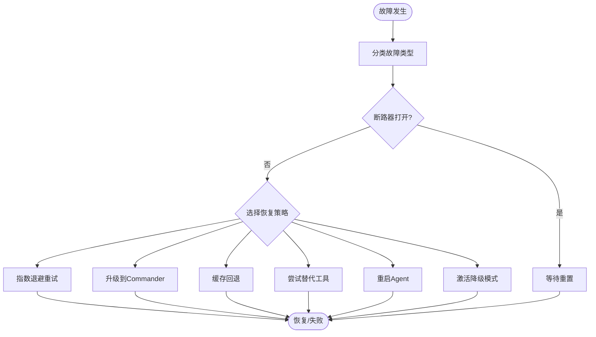
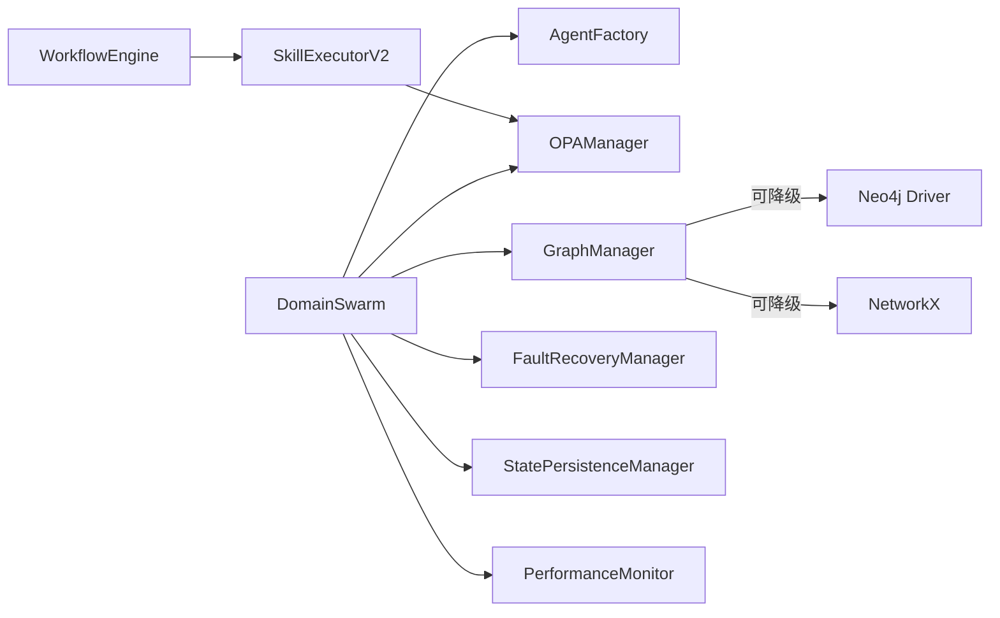

# Swarm协作机制

<cite>
**本文档引用的文件**
- [swarm_orchestrator.py](file://odap/biz/core/agent/swarm_orchestrator.py)
- [agent_factory.py](file://odap/biz/core/agent/agent_factory.py)
- [base.py](file://odap/tools/base.py)
- [opa_service.py](file://odap/infra/opa/opa_service.py)
- [graph_service.py](file://odap/infra/graph/graph_service.py)
- [fault_tolerance.py](file://odap/infra/resilience/fault_tolerance.py)
- [state_persistence.py](file://odap/infra/resilience/state_persistence.py)
- [performance_monitor.py](file://odap/infra/monitoring/performance_monitor.py)
- [DESIGN.md](file://docs/03-modules/swarm_orchestrator/DESIGN.md)
- [__init__.py](file://openharness/src/openharness/swarm/__init__.py)
- [workflow_engine.py](file://odap/biz/platform/skill_system/impl/workflow_engine.py)
</cite>

## 目录
1. [简介](#简介)
2. [项目结构](#项目结构)
3. [核心组件](#核心组件)
4. [架构总览](#架构总览)
5. [详细组件分析](#详细组件分析)
6. [依赖关系分析](#依赖关系分析)
7. [性能考虑](#性能考虑)
8. [故障排查指南](#故障排查指南)
9. [结论](#结论)
10. [附录](#附录)

## 简介
本文件面向Swarm协作机制的技术文档，围绕群体智能算法在多Agent系统中的实现进行深入解析，涵盖信息共享策略、冲突解决机制、决策融合算法；同时系统阐述Swarm编排器的架构设计（Agent间通信协议、状态同步机制、协调策略）、工作流引擎的任务分解与并行执行、配置参数与扩展接口、性能调优方法，并提供可操作的应用场景与实践建议。

## 项目结构
Swarm协作机制主要分布在以下模块：
- 编排与Agent：odap/biz/core/agent（DomainSwarm、Agent类型与状态、追踪与角色管理）
- 工具与技能系统：odap/tools（技能抽象、注册与执行、热插拔与健康监控）
- 权限与策略：odap/infra/opa（ABAC策略、权限检查、策略沙箱）
- 图谱与知识存储：odap/infra/graph（Graphiti/Neo4j回退、时序知识图谱）
- 容错与状态：odap/infra/resilience（故障恢复、断路器、状态持久化）
- 性能监控：odap/infra/monitoring（性能指标采集与统计）
- 设计文档：docs/03-modules/swarm_orchestrator/DESIGN.md（模块设计与配置示例）

**图表来源**
- [swarm_orchestrator.py:288-658](file://odap/biz/core/agent/swarm_orchestrator.py#L288-L658)
- [agent_factory.py:24-442](file://odap/biz/core/agent/agent_factory.py#L24-L442)
- [base.py:64-720](file://odap/tools/base.py#L64-L720)
- [opa_service.py:455-717](file://odap/infra/opa/opa_service.py#L455-L717)
- [graph_service.py:71-800](file://odap/infra/graph/graph_service.py#L71-L800)
- [fault_tolerance.py:41-309](file://odap/infra/resilience/fault_tolerance.py#L41-L309)
- [state_persistence.py:21-187](file://odap/infra/resilience/state_persistence.py#L21-L187)
- [performance_monitor.py:12-184](file://odap/infra/monitoring/performance_monitor.py#L12-L184)

**章节来源**
- [swarm_orchestrator.py:1-687](file://odap/biz/core/agent/swarm_orchestrator.py#L1-L687)
- [DESIGN.md:1-1454](file://docs/03-modules/swarm_orchestrator/DESIGN.md#L1-L1454)

## 核心组件
- DomainSwarm：三Agent（Commander/Intelligence/Operations）的OODA闭环编排器，负责任务初始化、阶段推进、结果聚合与持久化。
- Agent类型与状态：定义AgentType、AgentState，支撑状态机与追踪。
- 技能系统：BaseSkill、SkillRegistryV2、SkillExecutorV2，提供技能注册、执行、权限桥接与健康监控。
- 权限管理：OPAManager，支持ABAC策略、批量权限检查、策略热更新与沙箱。
- 图谱服务：GraphManager，支持Graphiti/Neo4j回退、连接池、断路器与性能监控。
- 容错与状态：FaultRecoveryManager（断路器、降级模式、恢复策略）、StatePersistenceManager（检查点与恢复）。
- 性能监控：PerformanceMonitor，装饰器式指标采集与统计。

**章节来源**
- [swarm_orchestrator.py:288-658](file://odap/biz/core/agent/swarm_orchestrator.py#L288-L658)
- [agent_factory.py:24-442](file://odap/biz/core/agent/agent_factory.py#L24-L442)
- [base.py:64-720](file://odap/tools/base.py#L64-L720)
- [opa_service.py:455-717](file://odap/infra/opa/opa_service.py#L455-L717)
- [graph_service.py:71-800](file://odap/infra/graph/graph_service.py#L71-L800)
- [fault_tolerance.py:41-309](file://odap/infra/resilience/fault_tolerance.py#L41-L309)
- [state_persistence.py:21-187](file://odap/infra/resilience/state_persistence.py#L21-L187)
- [performance_monitor.py:12-184](file://odap/infra/monitoring/performance_monitor.py#L12-L184)

## 架构总览
Swarm协作机制采用“编排器驱动的多Agent协同”架构，DomainSwarm作为核心控制器，按OODA阶段依次委派给各Agent执行。Agent通过技能系统调用工具，权限由OPA统一管控，知识与上下文通过Graphiti/Neo4j持久化，系统具备完善的容错、状态持久化与性能监控能力。

**图表来源**
- [swarm_orchestrator.py:379-658](file://odap/biz/core/agent/swarm_orchestrator.py#L379-L658)
- [base.py:458-597](file://odap/tools/base.py#L458-L597)
- [opa_service.py:538-598](file://odap/infra/opa/opa_service.py#L538-L598)
- [graph_service.py:649-756](file://odap/infra/graph/graph_service.py#L649-L756)

## 详细组件分析

### DomainSwarm编排器
- 职责：初始化三Agent、执行完整OODA循环、流式进度返回、结果聚合与持久化、健康与故障统计。
- OODA阶段：
  - Observe：IntelligenceAgent收集情报并生成威胁级别与建议。
  - Orient：结合历史上下文与图谱查询进行态势理解。
  - Decide：CommanderAgent生成多个行动选项并选择最优方案，必要时要求人工确认。
  - Act：OperationsAgent执行命令，支持确认回调与动作执行。
- 流式接口：execute_streaming按阶段返回进度，便于前端实时展示。
- 持久化：状态检查点与Graphiti Episode写入，支持任务恢复与审计。

**图表来源**
- [swarm_orchestrator.py:288-658](file://odap/biz/core/agent/swarm_orchestrator.py#L288-L658)

**章节来源**
- [swarm_orchestrator.py:288-658](file://odap/biz/core/agent/swarm_orchestrator.py#L288-L658)

### Agent类型与状态管理
- AgentType：COMMANDER、INTELLIGENCE、OPERATIONS。
- AgentState：IDLE、RUNNING、FAILED、DEGRADED、RECOVERING、SUSPENDED。
- TraceSpan/Trace：单步与完整执行追踪，支持状态、时延、错误信息记录与统计。
- RoleManager：内置角色能力矩阵（如Situation Awareness、Target Detection、Decision Making等），支持优先级与自动升级。

**图表来源**
- [agent_factory.py:24-442](file://odap/biz/core/agent/agent_factory.py#L24-L442)

**章节来源**
- [agent_factory.py:24-442](file://odap/biz/core/agent/agent_factory.py#L24-L442)

### 技能系统与工作流引擎
- BaseSkill：标准化输入输出、元数据与执行流程；LegacySkillAdapter兼容旧式裸函数。
- SkillRegistryV2：支持热插拔、版本管理、健康监控、依赖管理与批量发现。
- SkillExecutorV2：集成OPA权限桥接、危险动作确认、重试与健康统计。
- 工作流引擎：支持顺序、并行、条件分支，异步聚合结果，异常处理与日志记录。

**图表来源**
- [base.py:131-161](file://odap/tools/base.py#L131-L161)
- [base.py:458-597](file://odap/tools/base.py#L458-L597)
- [workflow_engine.py:86-117](file://odap/biz/platform/skill_system/impl/workflow_engine.py#L86-L117)

**章节来源**
- [base.py:64-720](file://odap/tools/base.py#L64-L720)
- [workflow_engine.py:86-117](file://odap/biz/platform/skill_system/impl/workflow_engine.py#L86-L117)

### 权限与冲突解决
- OPAManager：ABAC策略评估、批量权限检查、策略热更新、缓存与历史记录。
- 策略沙箱：What-If分析与策略模拟，支持权限影响评估。
- 冲突解决：高危动作（如attack）需管理员确认或人工审批；权限拒绝时可升级至Commander决策。

**图表来源**
- [opa_service.py:538-598](file://odap/infra/opa/opa_service.py#L538-L598)
- [base.py:567-597](file://odap/tools/base.py#L567-L597)

**章节来源**
- [opa_service.py:455-717](file://odap/infra/opa/opa_service.py#L455-L717)
- [base.py:567-597](file://odap/tools/base.py#L567-L597)

### 图谱与知识存储
- GraphManager：三层降级（Graphiti → Neo4j Driver → NetworkX fallback），连接池、断路器、性能监控。
- Episode写入：将任务过程与决策写入Graphiti，支持溯源与审计。

**图表来源**
- [graph_service.py:649-756](file://odap/infra/graph/graph_service.py#L649-L756)

**章节来源**
- [graph_service.py:71-800](file://odap/infra/graph/graph_service.py#L71-L800)

### 容错与状态持久化
- 故障恢复：断路器阈值与重置时间、多种恢复策略（重试、降级、替代工具、重启、升级）。
- 状态持久化：Agent状态与任务检查点JSON/PKL双格式持久化，支持恢复与统计。

**图表来源**
- [fault_tolerance.py:69-277](file://odap/infra/resilience/fault_tolerance.py#L69-L277)
- [state_persistence.py:84-135](file://odap/infra/resilience/state_persistence.py#L84-L135)

**章节来源**
- [fault_tolerance.py:41-309](file://odap/infra/resilience/fault_tolerance.py#L41-L309)
- [state_persistence.py:21-187](file://odap/infra/resiliance/state_persistence.py#L21-L187)

## 依赖关系分析
- DomainSwarm依赖Agent工厂、OPA、图谱服务、故障恢复与状态持久化、性能监控。
- 技能系统依赖OPA进行权限桥接，工作流引擎提供并行与聚合能力。
- 图谱服务在不同部署环境下可降级，保证系统可用性。

**图表来源**
- [swarm_orchestrator.py:294-306](file://odap/biz/core/agent/swarm_orchestrator.py#L294-L306)
- [base.py:458-597](file://odap/tools/base.py#L458-L597)
- [workflow_engine.py:86-117](file://odap/biz/platform/skill_system/impl/workflow_engine.py#L86-L117)
- [graph_service.py:145-184](file://odap/infra/graph/graph_service.py#L145-L184)

**章节来源**
- [swarm_orchestrator.py:294-306](file://odap/biz/core/agent/swarm_orchestrator.py#L294-L306)
- [base.py:458-597](file://odap/tools/base.py#L458-L597)
- [workflow_engine.py:86-117](file://odap/biz/platform/skill_system/impl/workflow_engine.py#L86-L117)
- [graph_service.py:145-184](file://odap/infra/graph/graph_service.py#L145-L184)

## 性能考虑
- 性能监控：通过装饰器自动采集LLM调用、数据库查询、API请求、工具执行等指标，支持均值、中位数、P95/P99统计。
- 图谱访问：连接池与断路器降低外部依赖抖动影响；批量写入与索引约束优化查询性能。
- 技能执行：重试与健康统计避免单点失败扩大；危险动作确认减少误操作风险。
- 并行执行：工作流引擎支持并行步骤聚合，提升吞吐；注意资源竞争与幂等性设计。

**章节来源**
- [performance_monitor.py:12-184](file://odap/infra/monitoring/performance_monitor.py#L12-L184)
- [graph_service.py:299-443](file://odap/infra/graph/graph_service.py#L299-L443)
- [base.py:525-565](file://odap/tools/base.py#L525-L565)

## 故障排查指南
- 断路器状态：检查故障恢复管理器的断路器阈值与重置时间，确认是否处于open/half_open状态。
- 权限问题：核对OPA策略与用户角色，使用策略沙箱进行What-If分析；查看权限历史与缓存命中率。
- 图谱异常：切换到回退模式或Neo4j直连模式，检查连接池与断路器状态；关注查询耗时统计。
- 任务恢复：利用状态持久化检查点恢复未完成任务，核对阶段数据与Agent状态。
- 性能瓶颈：通过性能监控器定位慢环节，结合工作流并行度与技能健康报告优化。

**章节来源**
- [fault_tolerance.py:236-277](file://odap/infra/resilience/fault_tolerance.py#L236-L277)
- [opa_service.py:668-714](file://odap/infra/opa/opa_service.py#L668-L714)
- [graph_service.py:406-443](file://odap/infra/graph/graph_service.py#L406-L443)
- [state_persistence.py:137-155](file://odap/infra/resilience/state_persistence.py#L137-L155)
- [performance_monitor.py:107-140](file://odap/infra/monitoring/performance_monitor.py#L107-L140)

## 结论
Swarm协作机制通过DomainSwarm实现三Agent的OODA闭环，结合技能系统、权限管理、图谱存储与容错机制，形成高可用、可观测、可扩展的多智能体协作平台。设计文档提供了完整的配置示例与演进历史，便于在实际业务中落地与迭代。

## 附录
- 配置参数参考：见Swarm编排模块设计文档中的配置示例增强部分，涵盖Coordinator、Agent、OODA、故障恢复、状态持久化与健康监控等关键参数。
- 扩展接口：技能系统支持BaseSkill与热插拔，工作流引擎支持顺序/并行/条件分支；Agent工厂支持角色能力与追踪统计。
- 应用场景：适用于复杂态势下的情报收集、威胁分析、决策制定与任务执行，支持流式进度展示与审计溯源。

**章节来源**
- [DESIGN.md:1359-1438](file://docs/03-modules/swarm_orchestrator/DESIGN.md#L1359-L1438)