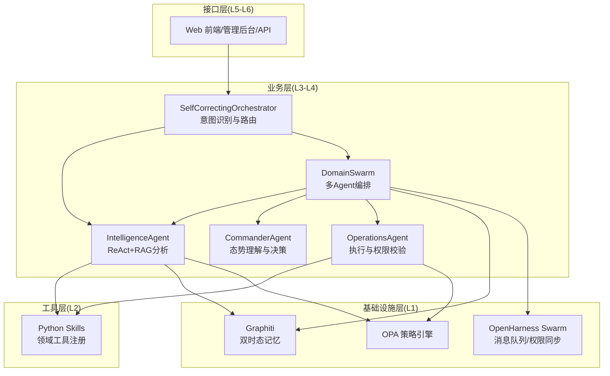
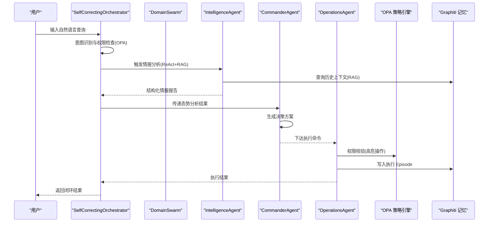
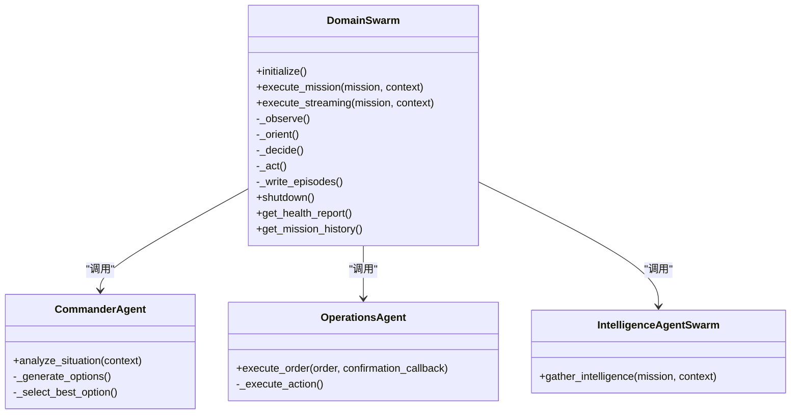
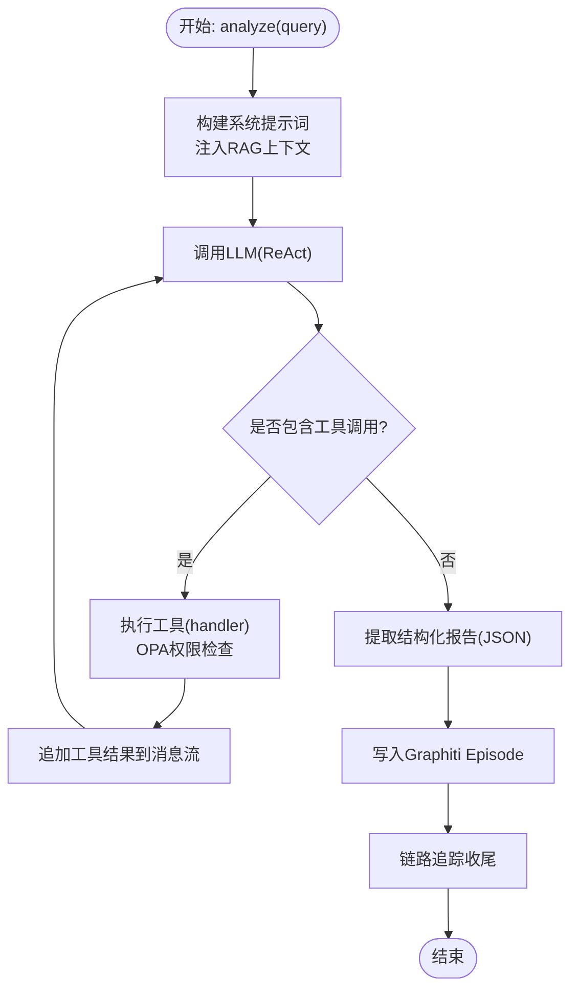
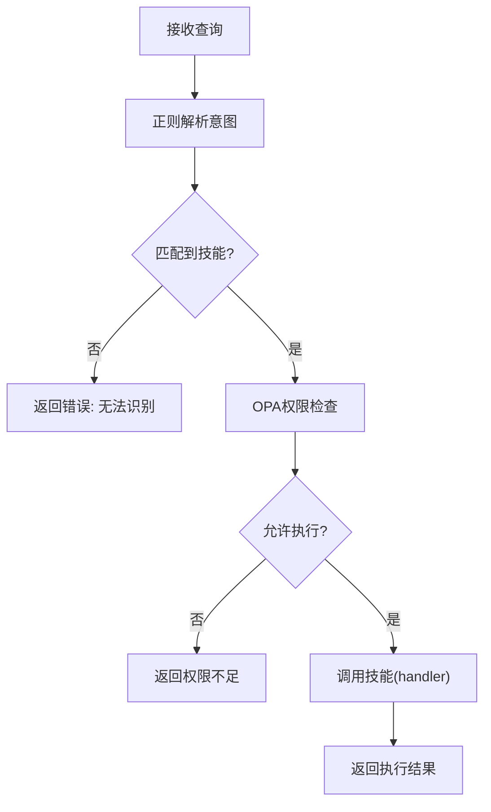
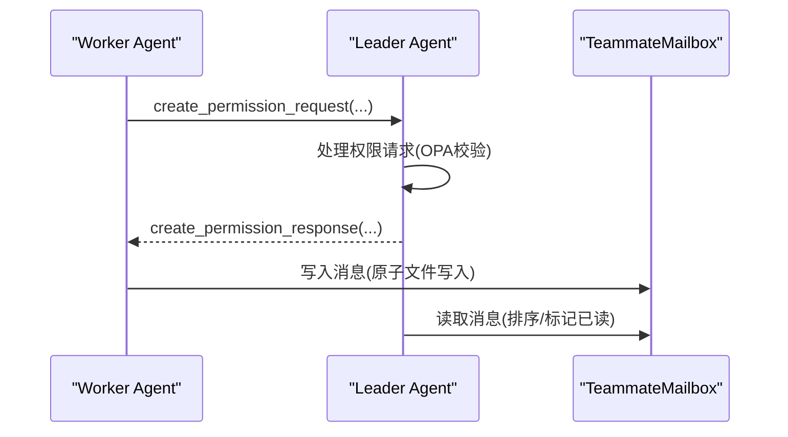
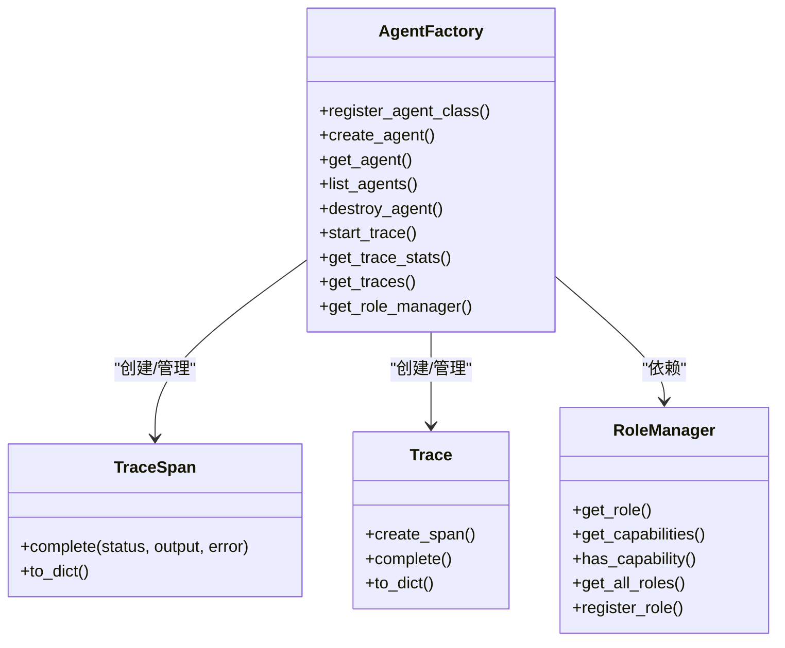
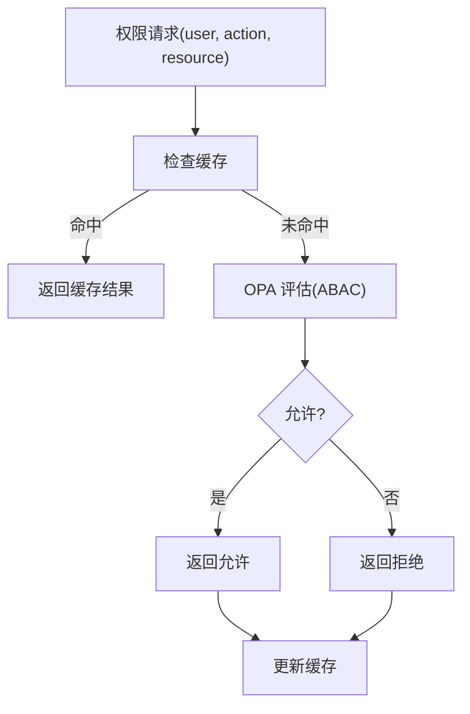
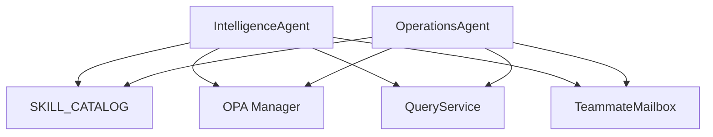

# 多智能体协同系统

<cite>
**本文引用的文件**
- [swarm_orchestrator.py](file://odap/biz/core/agent/swarm_orchestrator.py)
- [orchestrator.py](file://odap/biz/core/agent/orchestrator.py)
- [intelligence_agent.py](file://odap/biz/core/agent/intelligence_agent.py)
- [agent_factory.py](file://odap/biz/core/agent/agent_factory.py)
- [mailbox.py](file://openharness/src/openharness/swarm/mailbox.py)
- [registry.py](file://odap/tools/registry.py)
- [opa_service.py](file://odap/infra/opa/opa_service.py)
- [agent_config.yaml](file://config/agent_config.yaml)
- [DESIGN.md](file://docs/03-modules/agent/DESIGN.md)
- [ARCHITECTURE.md](file://docs/02-architecture/ARCHITECTURE.md)
</cite>

## 目录
1. [简介](#简介)
2. [项目结构](#项目结构)
3. [核心组件](#核心组件)
4. [架构总览](#架构总览)
5. [详细组件分析](#详细组件分析)
6. [依赖关系分析](#依赖关系分析)
7. [性能考虑](#性能考虑)
8. [故障排查指南](#故障排查指南)
9. [结论](#结论)
10. [附录](#附录)

## 简介
本技术文档围绕“多智能体协同系统”展开，重点阐述基于 OpenHarness Agent Loop 与 Swarm 的三 Agent OODA 闭环架构设计与实现原理。系统通过领域多智能体编排器（DomainSwarm）实现 Intelligence-Agent（感知与情报分析）、Commander-Agent（态势理解与决策）、Operations-Agent（执行与权限校验）的协同，形成“观察-判断-决策-行动”的完整闭环。同时，文档深入解析意图识别与路由机制、任务分配与资源协调、状态同步与持久化、群体智能与冲突解决策略，并提供配置示例、扩展方法与性能优化策略。

## 项目结构
本项目采用分层架构与模块化组织，Agent 协同与 OODA 闭环位于业务层（L3-L4），基础设施层（L1）提供 OpenHarness Swarm、Graphiti 记忆与 OPA 策略治理，工具层（L2）提供 Python Skills 领域工具，接口层（L5-L6）提供 Web 前端与 API 网关。Agent 模块包含三大核心组件：SelfCorrectingOrchestrator（自校正编排器）、IntelligenceAgent（情报分析 Agent）、DomainSwarm（多 Agent 协同编排器）。此外，OpenHarness 提供 Swarm 的消息队列与权限同步机制，用于跨 Agent 的通信与授权。

**图表来源**
- [swarm_orchestrator.py:288-360](file://odap/biz/core/agent/swarm_orchestrator.py#L288-L360)
- [intelligence_agent.py:73-125](file://odap/biz/core/agent/intelligence_agent.py#L73-L125)
- [orchestrator.py:16-63](file://odap/biz/core/agent/orchestrator.py#L16-L63)
- [mailbox.py:102-122](file://openharness/src/openharness/swarm/mailbox.py#L102-L122)
- [opa_service.py:455-557](file://odap/infra/opa/opa_service.py#L455-L557)

**章节来源**
- [DESIGN.md:31-50](file://docs/03-modules/agent/DESIGN.md#L31-L50)
- [ARCHITECTURE.md:392-446](file://docs/02-architecture/ARCHITECTURE.md#L392-L446)

## 核心组件
- DomainSwarm：多 Agent 协同编排器，负责 OODA 循环的阶段协调、任务分配、状态同步与结果聚合，内置 Commander-Agent、Intelligence-Agent、Operations-Agent 三种角色。
- IntelligenceAgent：基于 LLM ReAct 模式的单体闭环 Agent，负责 ODA 的 Observe 阶段，结合 RAG 上下文与工具调用生成结构化情报报告。
- SelfCorrectingOrchestrator：自校正编排器，负责意图识别、权限检查与任务路由，支持错误检测与自我修正。
- OpenHarness Swarm：提供基于文件的消息队列（TeammateMailbox）与权限同步机制，支撑跨 Agent 的通信与授权。
- OPA 权限管理：提供 ABAC/策略热更新/沙箱模拟等能力，贯穿 Agent 的工具调用与执行阶段。
- Graphiti 记忆：提供双时态知识图谱与 Episode 写入，支撑历史回溯与闭环反馈。

**章节来源**
- [swarm_orchestrator.py:288-360](file://odap/biz/core/agent/swarm_orchestrator.py#L288-L360)
- [intelligence_agent.py:73-125](file://odap/biz/core/agent/intelligence_agent.py#L73-L125)
- [orchestrator.py:16-63](file://odap/biz/core/agent/orchestrator.py#L16-L63)
- [mailbox.py:102-122](file://openharness/src/openharness/swarm/mailbox.py#L102-L122)
- [opa_service.py:455-557](file://odap/infra/opa/opa_service.py#L455-L557)

## 架构总览
系统采用“语义层架构 + Query First 原则”，通过统一查询服务屏蔽底层图谱差异，Agent 仅通过 QueryService 进行只读查询，写操作经 OpenHarness Hook 与 OPA 校验。DomainSwarm 在 OODA 循环中承担编排职责，将 Intelligence-Agent 的情报分析结果传递给 Commander-Agent 进行态势理解与决策，再由 Operations-Agent 执行并进行权限校验与状态回写。

**图表来源**
- [orchestrator.py:33-62](file://odap/biz/core/agent/orchestrator.py#L33-L62)
- [swarm_orchestrator.py:379-456](file://odap/biz/core/agent/swarm_orchestrator.py#L379-L456)
- [intelligence_agent.py:307-500](file://odap/biz/core/agent/intelligence_agent.py#L307-L500)
- [opa_service.py:538-557](file://odap/infra/opa/opa_service.py#L538-L557)

**章节来源**
- [ARCHITECTURE.md:457-543](file://docs/02-architecture/ARCHITECTURE.md#L457-L543)

## 详细组件分析

### DomainSwarm 多智能体编排器
DomainSwarm 实现三 Agent OODA 闭环，包含以下关键特性：
- OODA 阶段划分：Observe（Intelligence-Agent）、Orient（Intelligence-Agent）、Decide（Commander-Agent）、Act（Operations-Agent）。
- 任务分配与状态同步：通过 MissionResult 与 OODAProgress 记录阶段完成情况、执行时间与错误信息；支持流式进度返回。
- 权限与安全：Operations-Agent 在执行前进行 OPA 权限检查，Critical 级威胁决策可要求人工确认。
- 记忆与回写：将 OODA 过程写入 Graphiti Episode，支持历史回溯与闭环反馈。

**图表来源**
- [swarm_orchestrator.py:288-360](file://odap/biz/core/agent/swarm_orchestrator.py#L288-L360)
- [swarm_orchestrator.py:102-180](file://odap/biz/core/agent/swarm_orchestrator.py#L102-L180)
- [swarm_orchestrator.py:182-237](file://odap/biz/core/agent/swarm_orchestrator.py#L182-L237)
- [swarm_orchestrator.py:239-286](file://odap/biz/core/agent/swarm_orchestrator.py#L239-L286)

**章节来源**
- [swarm_orchestrator.py:288-658](file://odap/biz/core/agent/swarm_orchestrator.py#L288-L658)

### IntelligenceAgent ReAct+RAG 情报分析
IntelligenceAgent 采用 LLM ReAct 模式，结合 RAG 上下文增强推理，实现从自然语言到结构化报告的闭环：
- ReAct 循环：Thought → Action（Skill 调用）→ Observation → 决策输出。
- RAG 上下文：通过 QueryService 从 Graphiti 检索历史情报，注入系统提示词。
- 工具调用：从 SKILL_CATALOG 构建工具描述，支持权限检查与错误处理。
- 链路追踪：TraceSpan 记录每一步执行事件与耗时，支持性能基线与问题定位。

**图表来源**
- [intelligence_agent.py:307-500](file://odap/biz/core/agent/intelligence_agent.py#L307-L500)
- [intelligence_agent.py:277-305](file://odap/biz/core/agent/intelligence_agent.py#L277-L305)
- [intelligence_agent.py:215-250](file://odap/biz/core/agent/intelligence_agent.py#L215-L250)

**章节来源**
- [intelligence_agent.py:73-599](file://odap/biz/core/agent/intelligence_agent.py#L73-L599)

### SelfCorrectingOrchestrator 意图识别与路由
SelfCorrectingOrchestrator 负责将自然语言查询解析为具体技能调用，并进行权限检查与执行：
- 关键词正则路由：根据查询中的关键词（如“雷达”“领域分析”“打击”“力量对比”等）匹配对应技能。
- 权限检查：调用 OPA Manager 进行角色与动作的权限校验。
- 执行与回退：捕获异常并返回错误信息，支持后续自我修正。

**图表来源**
- [orchestrator.py:64-114](file://odap/biz/core/agent/orchestrator.py#L64-L114)
- [opa_service.py:538-557](file://odap/infra/opa/opa_service.py#L538-L557)

**章节来源**
- [orchestrator.py:16-151](file://odap/biz/core/agent/orchestrator.py#L16-L151)

### OpenHarness Swarm 消息与权限同步
OpenHarness Swarm 提供文件型消息队列与权限同步机制，支撑多 Agent 间的通信与授权：
- TeammateMailbox：基于文件的原子写入消息队列，支持用户消息、权限请求/响应、沙箱权限请求/响应、空闲通知与关闭请求。
- 权限消息：支持 permission_request/response 与 sandbox_permission_request/response，实现细粒度权限校验与更新。
- 路由与写入：write_to_mailbox 将消息序列化并写入指定 Agent 的 Inbox，支持类型自动识别。

**图表来源**
- [mailbox.py:237-341](file://openharness/src/openharness/swarm/mailbox.py#L237-L341)
- [mailbox.py:102-230](file://openharness/src/openharness/swarm/mailbox.py#L102-L230)

**章节来源**
- [mailbox.py:1-523](file://openharness/src/openharness/swarm/mailbox.py#L1-L523)

### Agent 工厂与追踪系统
Agent 工厂提供 Agent 生命周期管理与追踪能力：
- AgentFactory：注册与创建 Agent，维护实例与配置，支持链路追踪与统计。
- TraceSpan/Trace：轻量级链路追踪，记录阶段、输入输出、耗时与错误，支持统计与查询。
- RoleManager：角色能力管理，定义 Commander/Intelligence/Operations 的能力与优先级。

**图表来源**
- [agent_factory.py:340-442](file://odap/biz/core/agent/agent_factory.py#L340-L442)
- [agent_factory.py:86-177](file://odap/biz/core/agent/agent_factory.py#L86-L177)
- [agent_factory.py:267-338](file://odap/biz/core/agent/agent_factory.py#L267-L338)

**章节来源**
- [agent_factory.py:1-442](file://odap/biz/core/agent/agent_factory.py#L1-L442)

### OPA 权限管理与策略治理
OPA 提供 ABAC 策略评估、策略热更新与沙箱模拟，贯穿 Agent 的工具调用与执行阶段：
- ABACPolicyEvaluator：基于角色、属性与环境条件的策略评估。
- OPAManager：封装 OPA 客户端，支持缓存、批量检查、策略热更新与回滚。
- PolicySandbox：What-If 权限模拟与策略沙箱执行。

**图表来源**
- [opa_service.py:538-557](file://odap/infra/opa/opa_service.py#L538-L557)
- [opa_service.py:585-598](file://odap/infra/opa/opa_service.py#L585-L598)

**章节来源**
- [opa_service.py:455-750](file://odap/infra/opa/opa_service.py#L455-L750)

## 依赖关系分析
- Agent 与工具层：Intelligence-Agent 与 Operations-Agent 通过 SKILL_CATALOG 调用 Python Skills，支持权限检查与错误处理。
- Agent 与基础设施层：Agent 通过 QueryService 访问 Graphiti，写入 Episode；通过 OpenHarness Hook 与 OPA 进行权限校验。
- Swarm 与 OpenHarness：DomainSwarm 通过 Swarm Mailbox 实现跨 Agent 通信与权限同步。

**图表来源**
- [intelligence_agent.py:126-168](file://odap/biz/core/agent/intelligence_agent.py#L126-L168)
- [swarm_orchestrator.py:222-236](file://odap/biz/core/agent/swarm_orchestrator.py#L222-L236)
- [mailbox.py:102-122](file://openharness/src/openharness/swarm/mailbox.py#L102-L122)
- [registry.py:26-38](file://odap/tools/registry.py#L26-L38)

**章节来源**
- [registry.py:11-53](file://odap/tools/registry.py#L11-L53)
- [swarm_orchestrator.py:222-236](file://odap/biz/core/agent/swarm_orchestrator.py#L222-L236)

## 性能考虑
- LLM 调用优化：IntelligenceAgent 使用 httpx 异步客户端与指数退避重试，限制最大并发连接数，减少超时与连接失败的影响。
- 链路追踪与性能基线：TraceSpan 记录每一步耗时与事件，便于定位瓶颈与建立性能基线。
- 缓存与批量检查：OPA Manager 使用缓存与批量权限检查，降低策略评估开销。
- I/O 优化：OpenHarness Mailbox 使用原子文件写入与锁文件，避免并发写冲突与部分读取。

**章节来源**
- [intelligence_agent.py:112-118](file://odap/biz/core/agent/intelligence_agent.py#L112-L118)
- [intelligence_agent.py:191-213](file://odap/biz/core/agent/intelligence_agent.py#L191-L213)
- [opa_service.py:524-537](file://odap/infra/opa/opa_service.py#L524-L537)
- [mailbox.py:144-151](file://openharness/src/openharness/swarm/mailbox.py#L144-L151)

## 故障排查指南
- OPA 连接异常：OPAManager 在 OPA Server 不可用时自动降级为 Mock 模式，打印异常并继续执行，可通过 get_performance_metrics 查看缓存与版本信息。
- LLM 调用失败：IntelligenceAgent 对 LLM 调用进行指数退避重试，若仍失败抛出异常，可在链路追踪中查看错误事件与重试次数。
- 权限不足：SelfCorrectingOrchestrator 与 Operations-Agent 在执行前进行 OPA 权限检查，若拒绝返回错误信息，可通过 What-If 分析与策略沙箱模拟验证策略。
- Swarm 消息丢失：检查 TeammateMailbox 的 Inbox 目录与锁文件，确认原子写入是否成功；必要时清理损坏消息文件。

**章节来源**
- [opa_service.py:482-500](file://odap/infra/opa/opa_service.py#L482-L500)
- [intelligence_agent.py:191-213](file://odap/biz/core/agent/intelligence_agent.py#L191-L213)
- [mailbox.py:144-151](file://openharness/src/openharness/swarm/mailbox.py#L144-L151)

## 结论
本多智能体协同系统以 DomainSwarm 为核心，结合 OpenHarness Swarm 的消息与权限机制，实现了从自然语言到结构化决策与执行的完整闭环。通过 ODA（Intelligence-Agent）+ ODD（Commander-Agent）+ OA（Operations-Agent）的分工协作，系统在保证安全性与可追溯性的前提下，提供了强大的情报分析、态势理解与任务执行能力。配合统一查询服务与语义层架构，系统具备良好的扩展性与可维护性。

## 附录

### 配置示例
- LLM Provider 配置：在 agent_config.yaml 中配置默认 Provider 与模型参数，支持多 Provider 切换。
- Agent 角色与能力：通过 RoleManager 与 AgentFactory 注册角色与能力，定义优先级与审批需求。
- Swarm 参数：DomainSwarm 支持并发 Agent 数量、任务超时与重试次数等配置项。

**章节来源**
- [agent_config.yaml:1-23](file://config/agent_config.yaml#L1-L23)
- [agent_factory.py:267-338](file://odap/biz/core/agent/agent_factory.py#L267-L338)
- [swarm_orchestrator.py:312-323](file://odap/biz/core/agent/swarm_orchestrator.py#L312-L323)

### 扩展方法
- 自定义 Agent：通过 AgentFactory.register_agent_class 注册自定义 Agent 类，实现特定业务逻辑。
- 新增技能：使用 register_skill 或 SkillRegistry 注册新技能，保持 SKILL_CATALOG 与新注册表同步。
- Swarm 扩展：在 DomainSwarm 中增加新的 Agent 类型或阶段，扩展 OODA 循环。

**章节来源**
- [agent_factory.py:340-442](file://odap/biz/core/agent/agent_factory.py#L340-L442)
- [registry.py:26-38](file://odap/tools/registry.py#L26-L38)
- [swarm_orchestrator.py:325-359](file://odap/biz/core/agent/swarm_orchestrator.py#L325-L359)

### 性能优化策略
- 合理设置 LLM 温度与最大 Token，平衡准确性与延迟。
- 使用链路追踪与缓存统计，定期分析热点与瓶颈。
- 控制 Swarm 并发度与任务超时，避免资源争用。
- 通过策略热更新与回滚机制快速修复策略问题，减少停机时间。

**章节来源**
- [intelligence_agent.py:172-213](file://odap/biz/core/agent/intelligence_agent.py#L172-L213)
- [opa_service.py:668-714](file://odap/infra/opa/opa_service.py#L668-L714)
- [swarm_orchestrator.py:312-323](file://odap/biz/core/agent/swarm_orchestrator.py#L312-L323)