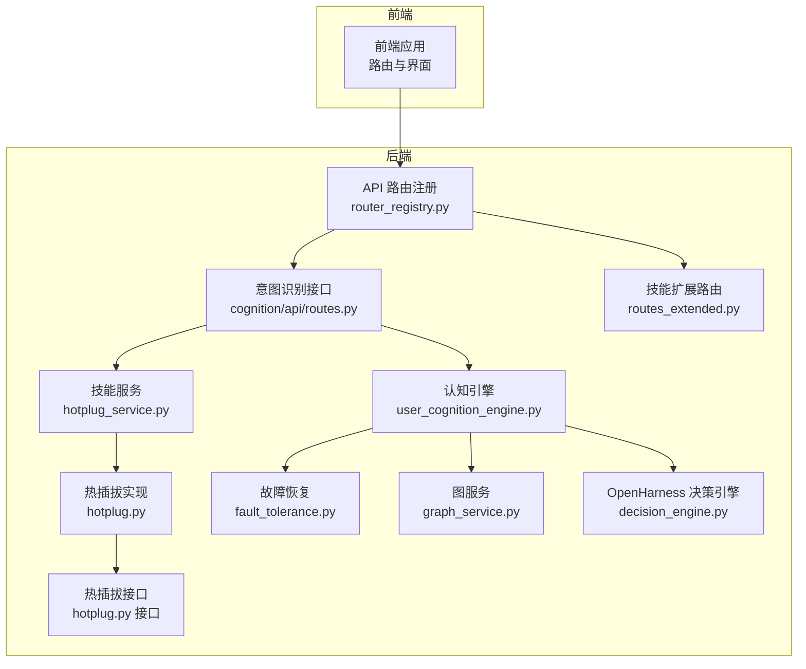
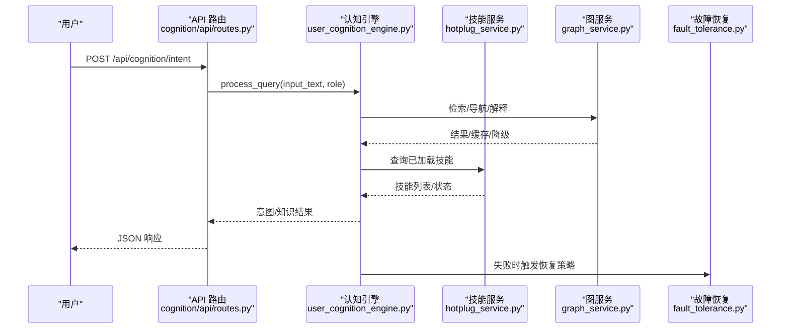
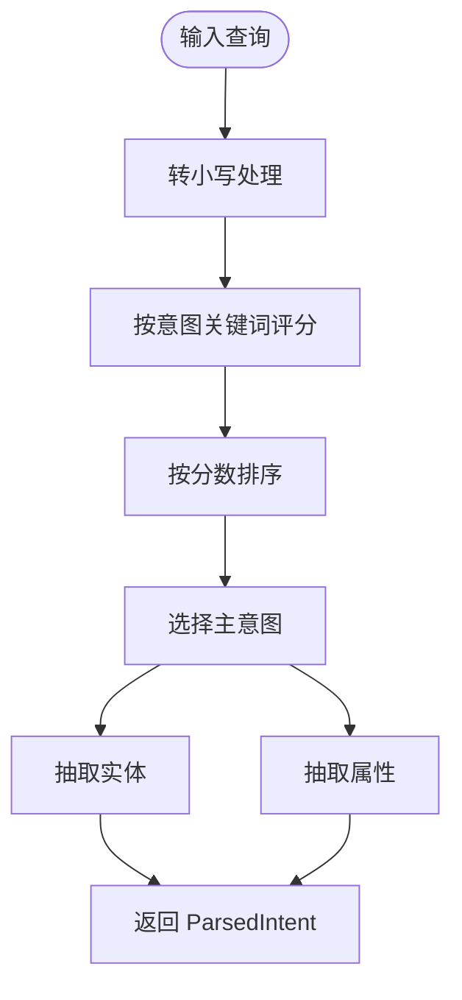
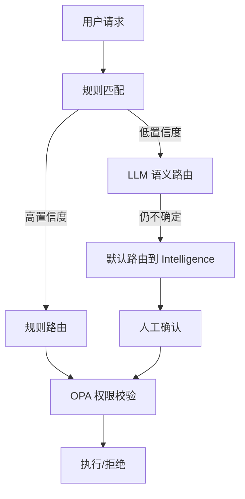
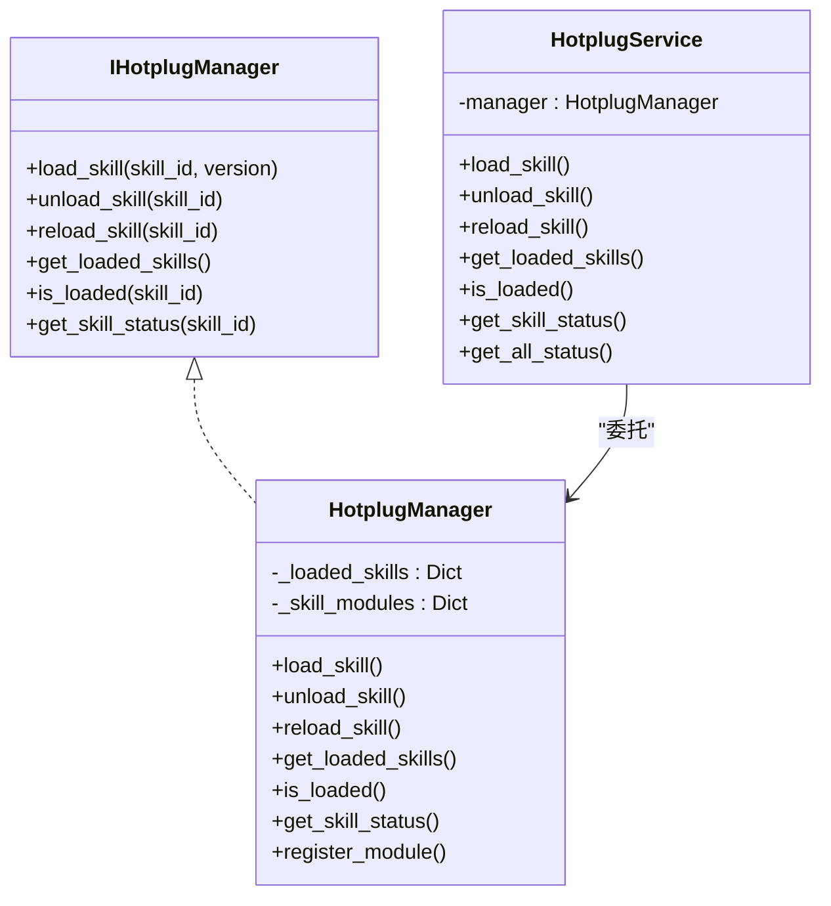
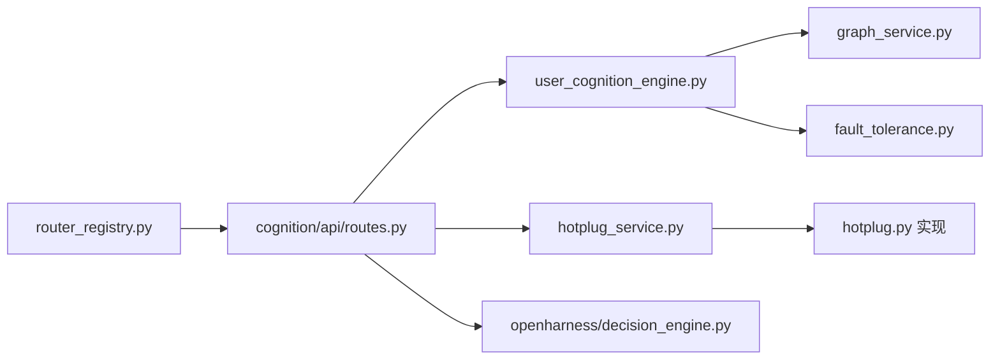

# 意图识别与路由

<cite>
**本文档引用的文件**
- [odap/biz/core/cognition/user_cognition_engine.py](file://odap/biz/core/cognition/user_cognition_engine.py)
- [odap/biz/core/cognition/api/routes.py](file://odap/biz/core/cognition/api/routes.py)
- [odap/biz/core/cognition/thought_graph/api/routes.py](file://odap/biz/core/cognition/thought_graph/api/routes.py)
- [odap/biz/platform/skill_system/services/hotplug_service.py](file://odap/biz/platform/skill_system/services/hotplug_service.py)
- [odap/biz/platform/skill_system/impl/hotplug.py](file://odap/biz/platform/skill_system/impl/hotplug.py)
- [odap/biz/platform/skill_system/interfaces/hotplug.py](file://odap/biz/platform/skill_system/interfaces/hotplug.py)
- [odap/biz/platform/skill_system/api/routes_extended.py](file://odap/biz/platform/skill_system/api/routes_extended.py)
- [odap/web/router_registry.py](file://odap/web/router_registry.py)
- [odap/infra/resilience/fault_tolerance.py](file://odap/infra/resilience/fault_tolerance.py)
- [odap/infra/graph/graph_service.py](file://odap/infra/graph/graph_service.py)
- [odap/infra/openharness/decision_engine.py](file://odap/infra/openharness/decision_engine.py)
- [docs/02-architecture/ARCHITECTURE_FULL_CHAIN_DEEP.md](file://docs/02-architecture/ARCHITECTURE_FULL_CHAIN_DEEP.md)
- [docs/03-modules/decision_recommendation/DESIGN.md](file://docs/03-modules/decision_recommendation/DESIGN.md)
- [docs/07-adr/ADR-043_agent_router_semantic_routing.md](file://docs/07-adr/ADR-043_agent_router_semantic_routing.md)
- [docs/06-dfx/DFX_DESIGN.md](file://docs/06-dfx/DFX_DESIGN.md)
- [config/agent_config.yaml](file://config/agent_config.yaml)
- [tests/unit/test_cognition.py](file://tests/unit/test_cognition.py)
- [tests/unit/test_skill_system.py](file://tests/unit/test_skill_system.py)
</cite>

## 目录
1. [简介](#简介)
2. [项目结构](#项目结构)
3. [核心组件](#核心组件)
4. [架构总览](#架构总览)
5. [详细组件分析](#详细组件分析)
6. [依赖分析](#依赖分析)
7. [性能考量](#性能考量)
8. [故障排查指南](#故障排查指南)
9. [结论](#结论)
10. [附录](#附录)

## 简介
本文件围绕“意图识别与路由系统”构建专业级技术文档，聚焦以下关键目标：
- 自然语言理解：语义解析、意图分类、实体抽取的实现机制
- 路由算法：路径规划、负载均衡与故障转移策略
- 热插拔机制：技能发现、动态加载与版本管理
- 配置选项、扩展接口与性能优化方法
- 实现示例与应用场景：如何准确识别用户意图并进行智能路由

## 项目结构
系统采用模块化分层设计，意图识别与路由贯穿认知引擎、技能系统、路由与故障恢复等多个模块，并通过统一的路由注册工具集中暴露 API。

**图表来源**
- [odap/web/router_registry.py:34-98](file://odap/web/router_registry.py#L34-L98)
- [odap/biz/core/cognition/api/routes.py:63-82](file://odap/biz/core/cognition/api/routes.py#L63-L82)
- [odap/biz/core/cognition/user_cognition_engine.py:787-800](file://odap/biz/core/cognition/user_cognition_engine.py#L787-L800)
- [odap/biz/platform/skill_system/services/hotplug_service.py:7-57](file://odap/biz/platform/skill_system/services/hotplug_service.py#L7-L57)
- [odap/biz/platform/skill_system/impl/hotplug.py:12-109](file://odap/biz/platform/skill_system/impl/hotplug.py#L12-L109)
- [odap/biz/platform/skill_system/interfaces/hotplug.py:7-79](file://odap/biz/platform/skill_system/interfaces/hotplug.py#L7-L79)
- [odap/biz/platform/skill_system/api/routes_extended.py:317-342](file://odap/biz/platform/skill_system/api/routes_extended.py#L317-L342)
- [odap/infra/resilience/fault_tolerance.py:41-101](file://odap/infra/resilience/fault_tolerance.py#L41-L101)
- [odap/infra/graph/graph_service.py:140-153](file://odap/infra/graph/graph_service.py#L140-L153)
- [odap/infra/openharness/decision_engine.py:98-137](file://odap/infra/openharness/decision_engine.py#L98-L137)

**章节来源**
- [odap/web/router_registry.py:34-98](file://odap/web/router_registry.py#L34-L98)

## 核心组件
- 意图识别与认知引擎：负责意图分类、实体抽取、知识导航与解释生成
- 技能热插拔系统：提供技能的动态加载、卸载与版本管理
- 路由与注册：统一暴露认知与技能相关 API
- 故障恢复与降级：断路器、重试与降级策略
- OpenHarness 决策引擎：面向工作空间与目标的意图识别与过滤

**章节来源**
- [odap/biz/core/cognition/user_cognition_engine.py:140-303](file://odap/biz/core/cognition/user_cognition_engine.py#L140-L303)
- [odap/biz/platform/skill_system/services/hotplug_service.py:7-57](file://odap/biz/platform/skill_system/services/hotplug_service.py#L7-L57)
- [odap/biz/platform/skill_system/impl/hotplug.py:12-109](file://odap/biz/platform/skill_system/impl/hotplug.py#L12-L109)
- [odap/infra/resilience/fault_tolerance.py:41-101](file://odap/infra/resilience/fault_tolerance.py#L41-L101)
- [odap/infra/openharness/decision_engine.py:98-137](file://odap/infra/openharness/decision_engine.py#L98-L137)

## 架构总览
系统以“认知引擎 + 技能系统 + 路由与故障恢复”为核心，结合知识图谱与 OpenHarness 决策引擎，形成从意图识别到技能执行的闭环。

**图表来源**
- [odap/biz/core/cognition/api/routes.py:63-82](file://odap/biz/core/cognition/api/routes.py#L63-L82)
- [odap/biz/core/cognition/user_cognition_engine.py:787-800](file://odap/biz/core/cognition/user_cognition_engine.py#L787-L800)
- [odap/biz/platform/skill_system/services/hotplug_service.py:38-48](file://odap/biz/platform/skill_system/services/hotplug_service.py#L38-L48)
- [odap/infra/graph/graph_service.py:140-153](file://odap/infra/graph/graph_service.py#L140-L153)
- [odap/infra/resilience/fault_tolerance.py:69-100](file://odap/infra/resilience/fault_tolerance.py#L69-L100)

## 详细组件分析

### 意图识别与自然语言理解
- 意图分类：基于关键词正则匹配，对查询进行意图打分与排序，输出主意图与备选意图
- 实体抽取：针对雷达、目标、单位、位置等实体类型进行模式匹配
- 属性提取：时间粒度与详情级别等属性识别
- 知识导航：基于查询服务或图客户端进行检索与拓扑导航
- 解释生成：基于推理链与来源证据生成解释

**图表来源**
- [odap/biz/core/cognition/user_cognition_engine.py:188-226](file://odap/biz/core/cognition/user_cognition_engine.py#L188-L226)

**章节来源**
- [odap/biz/core/cognition/user_cognition_engine.py:140-303](file://odap/biz/core/cognition/user_cognition_engine.py#L140-L303)
- [odap/biz/core/cognition/api/routes.py:63-82](file://odap/biz/core/cognition/api/routes.py#L63-L82)
- [tests/unit/test_cognition.py:45-72](file://tests/unit/test_cognition.py#L45-L72)

### 路由算法与语义路由
- 混合路由：高置信度规则优先，低置信度 LLM 兜底，默认路由到 Intelligence 并需人工确认
- 安全约束：OPA 校验与权限控制
- 路由规则表：按意图关键词映射到 Agent 与权限

**图表来源**
- [docs/07-adr/ADR-043_agent_router_semantic_routing.md:80-100](file://docs/07-adr/ADR-043_agent_router_semantic_routing.md#L80-L100)
- [docs/07-adr/ADR-043_agent_router_semantic_routing.md:67-76](file://docs/07-adr/ADR-043_agent_router_semantic_routing.md#L67-L76)

**章节来源**
- [docs/07-adr/ADR-043_agent_router_semantic_routing.md:1-134](file://docs/07-adr/ADR-043_agent_router_semantic_routing.md#L1-L134)

### 热插拔机制：技能发现、动态加载与版本管理
- 接口抽象：定义加载、卸载、重载、状态查询等能力
- 实现细节：基于 importlib 的动态导入与重载，维护模块映射与已加载集合
- 服务封装：对外提供统一的技能服务接口
- 扩展路由：提供技能列表、启用/禁用、热重载等 API

**图表来源**
- [odap/biz/platform/skill_system/interfaces/hotplug.py:7-79](file://odap/biz/platform/skill_system/interfaces/hotplug.py#L7-L79)
- [odap/biz/platform/skill_system/impl/hotplug.py:12-109](file://odap/biz/platform/skill_system/impl/hotplug.py#L12-L109)
- [odap/biz/platform/skill_system/services/hotplug_service.py:7-57](file://odap/biz/platform/skill_system/services/hotplug_service.py#L7-L57)

**章节来源**
- [odap/biz/platform/skill_system/services/hotplug_service.py:7-57](file://odap/biz/platform/skill_system/services/hotplug_service.py#L7-L57)
- [odap/biz/platform/skill_system/impl/hotplug.py:12-109](file://odap/biz/platform/skill_system/impl/hotplug.py#L12-L109)
- [odap/biz/platform/skill_system/api/routes_extended.py:317-342](file://odap/biz/platform/skill_system/api/routes_extended.py#L317-L342)
- [tests/unit/test_skill_system.py:345-383](file://tests/unit/test_skill_system.py#L345-L383)

### OpenHarness 决议引擎与工作空间意图识别
- 基于关键词匹配识别工作空间相关查询
- 提取目标与过滤条件，构造意图对象
- 与认知引擎协同，提供面向工作空间的语义理解

**章节来源**
- [odap/infra/openharness/decision_engine.py:98-137](file://odap/infra/openharness/decision_engine.py#L98-L137)

### 知识图谱与查询服务
- 三层降级连接：Graphiti → Neo4j Driver → NetworkX fallback
- 连接池与断路器：提升稳定性与性能
- 与认知引擎协作，提供实体检索与拓扑导航

**章节来源**
- [odap/infra/graph/graph_service.py:140-153](file://odap/infra/graph/graph_service.py#L140-L153)
- [odap/biz/core/cognition/user_cognition_engine.py:305-466](file://odap/biz/core/cognition/user_cognition_engine.py#L305-L466)

### 故障恢复与降级策略
- 故障分类与恢复策略：超时、权限拒绝、图谱不可用、网络错误、工具执行错误、意外异常
- 指数退避重试、缓存回退、替代工具、重启 Agent、降级模式
- 断路器：阈值触发、半开探测与状态管理

**章节来源**
- [odap/infra/resilience/fault_tolerance.py:41-309](file://odap/infra/resilience/fault_tolerance.py#L41-L309)

## 依赖分析
- 路由注册：统一注册认知、技能、审计、查询等路由
- 认知引擎：依赖图服务与查询协议，提供意图识别、知识导航与解释
- 技能系统：通过服务封装调用实现层，实现动态加载与版本管理
- 路由与安全：混合路由结合 OPA 校验，确保安全与可控

**图表来源**
- [odap/web/router_registry.py:34-98](file://odap/web/router_registry.py#L34-L98)
- [odap/biz/core/cognition/api/routes.py:63-82](file://odap/biz/core/cognition/api/routes.py#L63-L82)
- [odap/biz/core/cognition/user_cognition_engine.py:787-800](file://odap/biz/core/cognition/user_cognition_engine.py#L787-L800)
- [odap/biz/platform/skill_system/services/hotplug_service.py:7-57](file://odap/biz/platform/skill_system/services/hotplug_service.py#L7-L57)
- [odap/biz/platform/skill_system/impl/hotplug.py:12-109](file://odap/biz/platform/skill_system/impl/hotplug.py#L12-L109)
- [odap/infra/graph/graph_service.py:140-153](file://odap/infra/graph/graph_service.py#L140-L153)
- [odap/infra/resilience/fault_tolerance.py:41-101](file://odap/infra/resilience/fault_tolerance.py#L41-L101)
- [odap/infra/openharness/decision_engine.py:98-137](file://odap/infra/openharness/decision_engine.py#L98-L137)

**章节来源**
- [odap/web/router_registry.py:34-98](file://odap/web/router_registry.py#L34-L98)

## 性能考量
- 查询理解缓存、图谱三级缓存、流式输出、检索预取、LLM Provider 路由
- 图谱查询延迟目标与策略：索引优化、连接池、批量查询
- 并发用户容量规划：API 网关、图谱连接池、LLM 速率限制
- 性能调优策略：问答延迟、图谱查询、并发能力、Skill 加载、推演并发与时长

**章节来源**
- [docs/06-dfx/DFX_DESIGN.md:38-69](file://docs/06-dfx/DFX_DESIGN.md#L38-L69)
- [docs/02-architecture/ARCHITECTURE_FULL_CHAIN_DEEP.md:5091-5103](file://docs/02-architecture/ARCHITECTURE_FULL_CHAIN_DEEP.md#L5091-L5103)

## 故障排查指南
- 常见故障类型：Agent 超时、OPA 拒绝、Graphiti 不可用、网络错误、工具执行错误、意外异常
- 恢复策略：指数退避重试、缓存回退、替代工具、重启 Agent、降级模式
- 断路器：阈值触发、重置时间、半开探测
- 日志与状态：故障记录、代理状态、断路器状态

**章节来源**
- [odap/infra/resilience/fault_tolerance.py:20-309](file://odap/infra/resilience/fault_tolerance.py#L20-L309)

## 结论
本系统通过“规则优先 + LLM 兜底”的混合路由策略，在保证安全性与可审计性的前提下，兼顾灵活性与成本控制；借助热插拔机制实现技能的动态扩展与版本管理；配合故障恢复与降级策略，确保在复杂场景下的稳定运行。意图识别与认知引擎为路由与执行提供高质量的语义理解基础，最终形成从意图识别到技能执行的完整闭环。

## 附录
- 配置选项：LLM Provider 选择与参数（如模型、温度、最大 token 数）
- 扩展接口：技能加载/卸载/重载、已加载技能查询、启用/禁用
- 应用场景：工作空间查询、实体导航、解释生成、决策支持

**章节来源**
- [config/agent_config.yaml:1-23](file://config/agent_config.yaml#L1-L23)
- [odap/biz/platform/skill_system/api/routes_extended.py:317-342](file://odap/biz/platform/skill_system/api/routes_extended.py#L317-L342)
- [docs/03-modules/decision_recommendation/DESIGN.md:22-98](file://docs/03-modules/decision_recommendation/DESIGN.md#L22-L98)