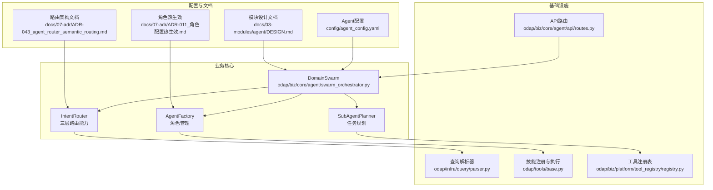
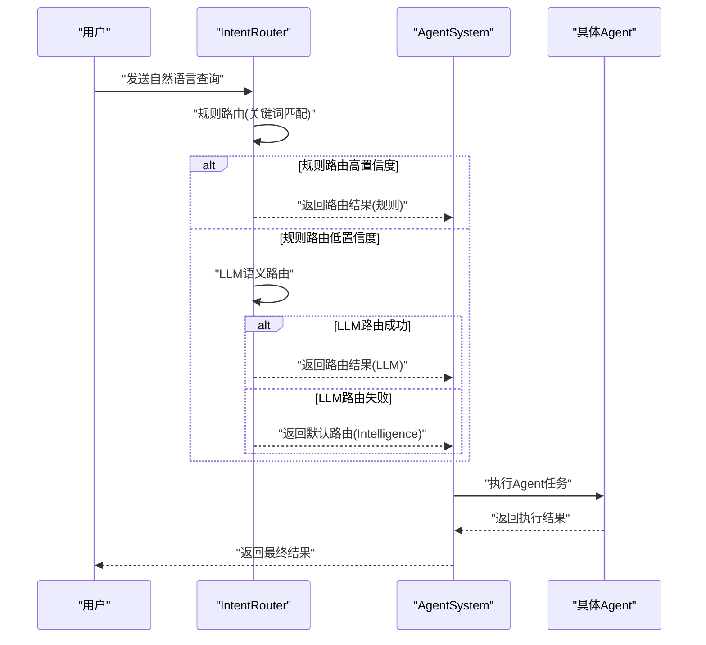
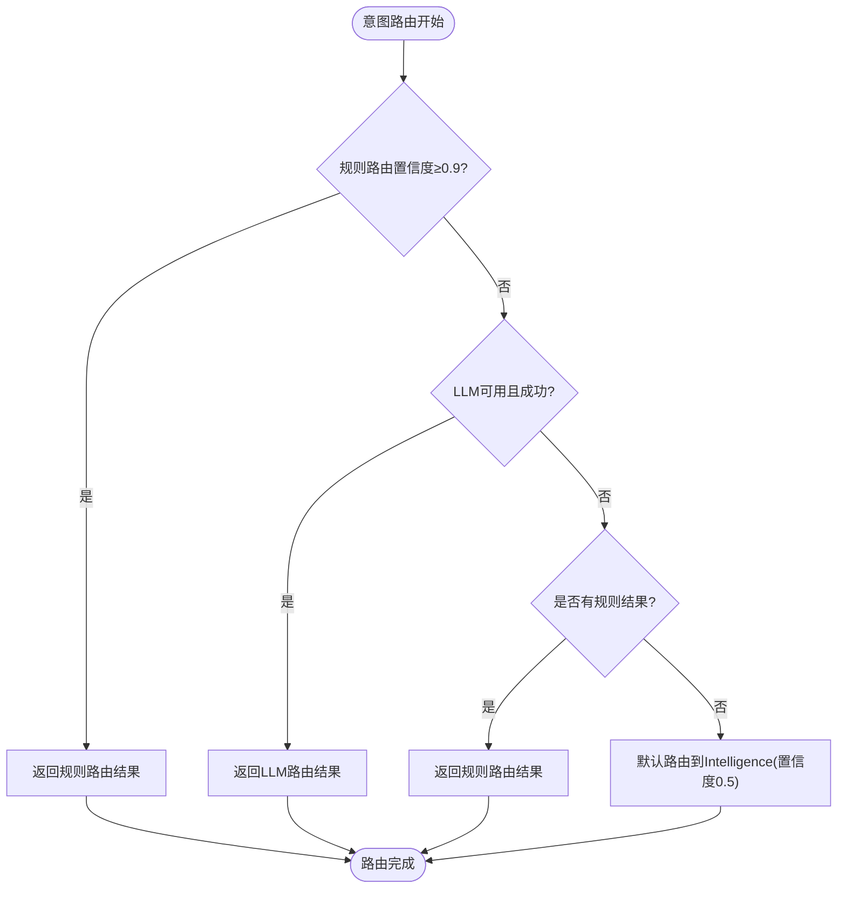
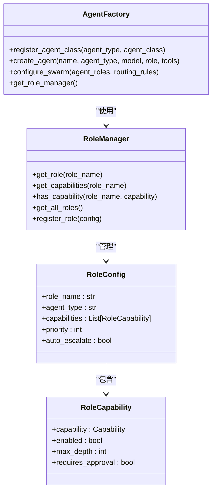
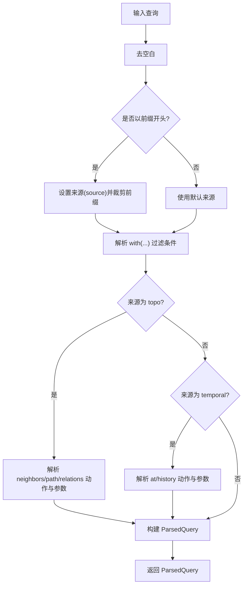
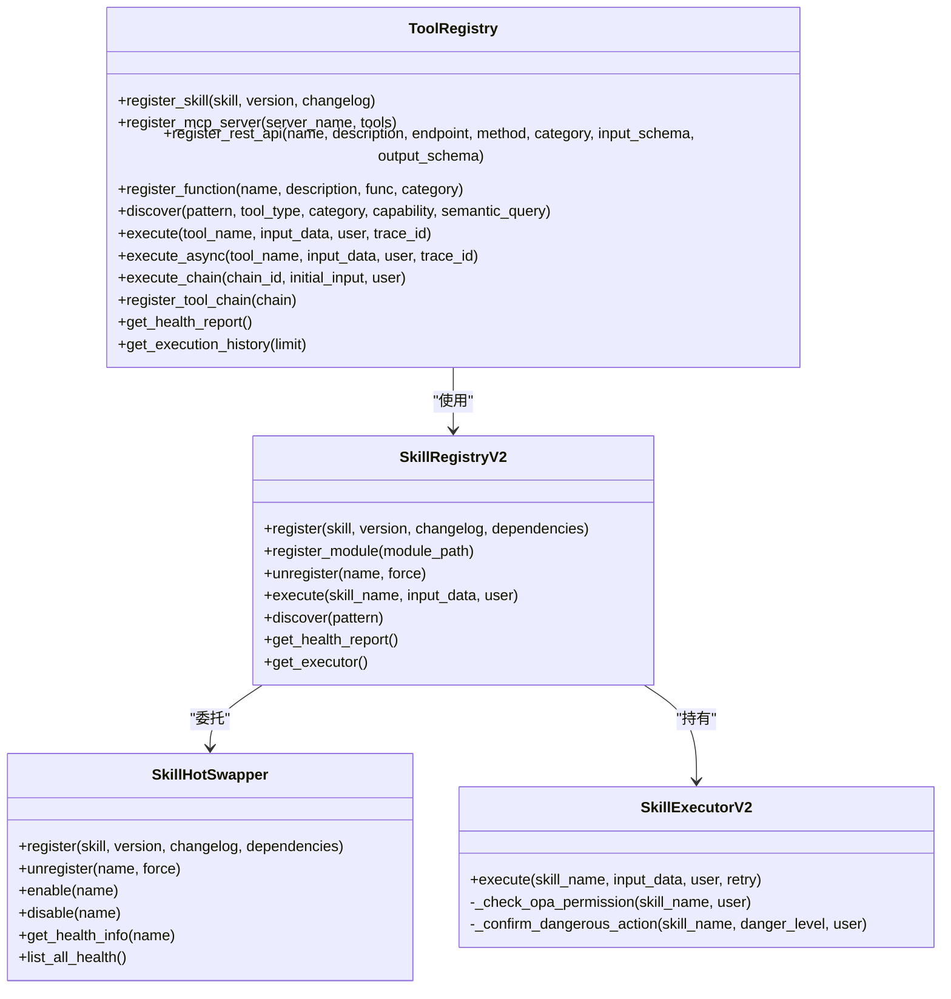
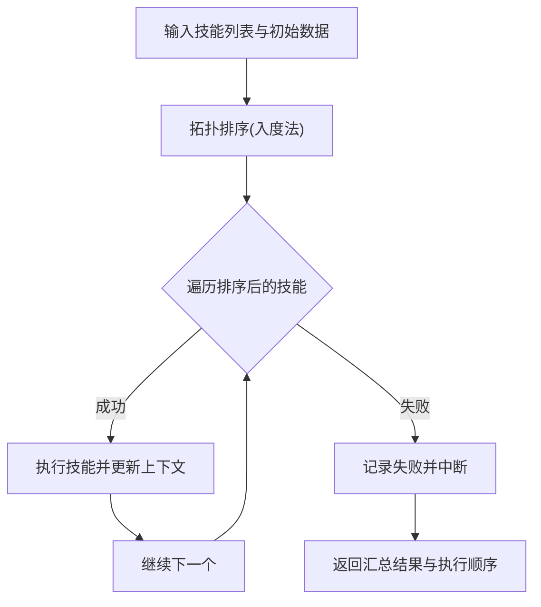
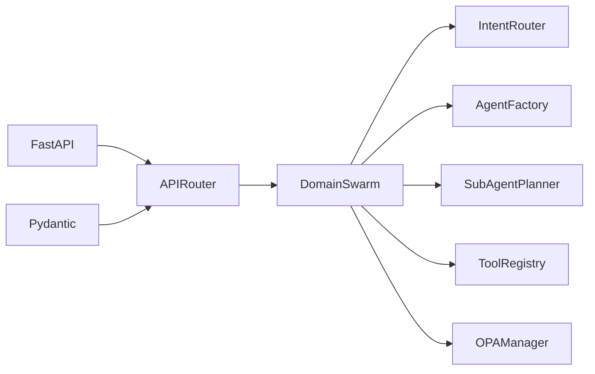

# 智能体编排器

<cite>
**本文档引用的文件**
- [odap/biz/core/agent/swarm_orchestrator.py](file://odap/biz/core/agent/swarm_orchestrator.py)
- [odap/biz/core/agent/agent_factory.py](file://odap/biz/core/agent/agent_factory.py)
- [odap/biz/core/agent/api/routes.py](file://odap/biz/core/agent/api/routes.py)
- [odap/biz/core/agent/api/schemas.py](file://odap/biz/core/agent/api/schemas.py)
- [odap/biz/platform/skill_system/impl/orchestrator.py](file://odap/biz/platform/skill_system/impl/orchestrator.py)
- [odap/infra/query/parser.py](file://odap/infra/query/parser.py)
- [odap/tools/registry.py](file://odap/tools/registry.py)
- [odap/tools/base.py](file://odap/tools/base.py)
- [odap/biz/platform/tool_registry/registry.py](file://odap/biz/platform/tool_registry/registry.py)
- [config/agent_config.yaml](file://config/agent_config.yaml)
- [docs/03-modules/agent/DESIGN.md](file://docs/03-modules/agent/DESIGN.md)
- [docs/02-architecture/ARCHITECTURE_BIZ.md](file://docs/02-architecture/ARCHITECTURE_BIZ.md)
- [docs/07-adr/ADR-043_agent_router_semantic_routing.md](file://docs/07-adr/ADR-043_agent_router_semantic_routing.md)
- [docs/07-adr/ADR-011_角色配置热生效.md](file://docs/07-adr/ADR-011_角色配置热生效.md)
- [openharness/tests/test_skills/test_loader.py](file://openharness/tests/test_skills/test_loader.py)
- [openharness/scripts/test_real_skills_plugins.py](file://openharness/scripts/test_real_skills_plugins.py)
</cite>

## 更新摘要
**所做更改**
- 新增 IntentRouter 三层路由能力（规则路由、LLM路由、智能回退机制）章节
- 新增动态代理角色配置与热生效机制章节
- 更新架构总览图以反映新的路由层
- 新增角色管理与权限配置章节
- 更新配置选项与扩展方法章节
- 新增实际使用场景与API示例

## 目录
1. [简介](#简介)
2. [项目结构](#项目结构)
3. [核心组件](#核心组件)
4. [架构总览](#架构总览)
5. [详细组件分析](#详细组件分析)
6. [依赖分析](#依赖分析)
7. [性能考虑](#性能考虑)
8. [故障排查指南](#故障排查指南)
9. [结论](#结论)
10. [附录](#附录)

## 简介
本文件面向"智能体编排器"的技术文档，重点围绕 DomainSwarm 编排器的设计理念与实现机制展开，涵盖以下主题：
- **三层路由能力**：基于 IntentRouter 的规则路由、LLM语义路由和智能回退机制
- **动态代理角色配置**：支持运行时角色配置更新与热生效
- **任务路由与技能匹配**：基于自然语言查询的意图识别与参数抽取，结合权限与安全策略进行路由
- **执行流程**：从查询解析到技能执行、结果封装与异常处理的完整链路
- **查询解析算法**：自然语言理解、关键词匹配与参数提取的实现要点
- **技能目录管理**：技能注册、权限验证、动态加载与健康监控
- **配置选项、扩展方法与性能优化策略**
- **实际使用场景与代码示例路径**

## 项目结构
本项目采用分层与模块化组织方式，智能体编排器位于业务核心层，底层依赖工具注册表、技能执行器与查询解析器等基础设施模块。



**图表来源**
- [odap/biz/core/agent/swarm_orchestrator.py:287-425](file://odap/biz/core/agent/swarm_orchestrator.py#L287-L425)
- [odap/biz/core/agent/agent_factory.py:267-338](file://odap/biz/core/agent/agent_factory.py#L267-L338)
- [odap/biz/core/agent/api/routes.py:1-71](file://odap/biz/core/agent/api/routes.py#L1-L71)
- [odap/biz/platform/skill_system/impl/orchestrator.py:1-74](file://odap/biz/platform/skill_system/impl/orchestrator.py#L1-L74)
- [odap/infra/query/parser.py:1-113](file://odap/infra/query/parser.py#L1-L113)
- [odap/tools/base.py:1-720](file://odap/tools/base.py#L1-L720)
- [odap/biz/platform/tool_registry/registry.py:1-800](file://odap/biz/platform/tool_registry/registry.py#L1-L800)
- [config/agent_config.yaml:1-23](file://config/agent_config.yaml#L1-L23)
- [docs/07-adr/ADR-043_agent_router_semantic_routing.md:1-134](file://docs/07-adr/ADR-043_agent_router_semantic_routing.md#L1-L134)
- [docs/07-adr/ADR-011_角色配置热生效.md:1-61](file://docs/07-adr/ADR-011_角色配置热生效.md#L1-L61)
- [docs/03-modules/agent/DESIGN.md:122-178](file://docs/03-modules/agent/DESIGN.md#L122-L178)
- [docs/02-architecture/ARCHITECTURE_BIZ.md:1285-1358](file://docs/02-architecture/ARCHITECTURE_BIZ.md#L1285-L1358)

## 核心组件
- **DomainSwarm**：多Agent协同编排器，实现OODA循环（观察-理解-决策-行动）
- **IntentRouter**：三层路由能力，包含规则路由（关键词匹配）、LLM语义路由和智能回退机制
- **AgentFactory**：角色管理与生命周期管理，支持动态角色配置与热生效
- **SubAgentPlanner**：子Agent任务规划，根据路由结果生成具体执行计划
- **查询解析器**：将带前缀与with(...)参数的自然语言查询解析为结构化对象
- **技能注册与执行**：提供BaseSkill抽象、输入输出标准化、OPA权限桥接、健康监控与重试机制
- **工具注册表**：统一管理技能、MCP工具、REST API与原生函数，支持语义发现、健康监控与工具链执行

**章节来源**
- [odap/biz/core/agent/swarm_orchestrator.py:287-425](file://odap/biz/core/agent/swarm_orchestrator.py#L287-L425)
- [odap/biz/core/agent/agent_factory.py:267-338](file://odap/biz/core/agent/agent_factory.py#L267-L338)
- [odap/biz/platform/skill_system/impl/orchestrator.py:8-74](file://odap/biz/platform/skill_system/impl/orchestrator.py#L8-L74)
- [odap/infra/query/parser.py:23-113](file://odap/infra/query/parser.py#L23-L113)
- [odap/tools/base.py:31-161](file://odap/tools/base.py#L31-L161)
- [odap/biz/platform/tool_registry/registry.py:403-800](file://odap/biz/platform/tool_registry/registry.py#L403-L800)

## 架构总览
DomainSwarm 作为入口，串联三层路由层、Agent编排与技能执行。路由层提供确定性规则匹配和语义理解能力，Agent层实现多Agent协同的OODA循环，技能执行通过工具注册表与技能执行器完成。



**图表来源**
- [odap/biz/core/agent/swarm_orchestrator.py:307-320](file://odap/biz/core/agent/swarm_orchestrator.py#L307-L320)
- [odap/biz/core/agent/swarm_orchestrator.py:340-374](file://odap/biz/core/agent/swarm_orchestrator.py#L340-L374)

## 详细组件分析

### IntentRouter 三层路由能力

#### 规则路由（Rule Route）
基于预定义关键词规则进行快速匹配，具有高确定性和零LLM调用成本的特点。

**核心特性**：
- 关键词权重匹配：根据匹配关键词数量计算置信度
- 置信度阈值：≥0.9的规则路由直接返回
- 匹配关键词记录：便于调试和优化

**规则配置示例**：
```python
_RULES = [
    {"keywords": ["分析", "态势", "威胁", "情报", "侦察"], "agent": "intelligence", "confidence": 0.95},
    {"keywords": ["决策", "方案", "指挥", "选择", "判断"], "agent": "commander", "confidence": 0.95},
    {"keywords": ["执行", "行动", "打击", "部署", "调度"], "agent": "operations", "confidence": 0.95},
    {"keywords": ["搜索", "查询", "查找", "检索", "雷达"], "agent": "intelligence", "confidence": 0.90},
]
```

#### LLM语义路由（LLM Route）
当规则路由无法确定时，使用LLM进行语义理解分类。

**实现机制**：
- 动态检测LLM可用性
- 调用OpenAI API进行意图分类
- 支持超时控制（默认10秒）
- 异常自动降级到规则路由

#### 智能回退机制（Smart Fallback）
系统安全兜底策略，确保路由决策的安全性。

**回退策略**：
- LLM路由失败时回退到规则路由结果
- 规则路由也失败时默认路由到Intelligence Agent
- 置信度设置为0.5，确保安全性和可控性



**图表来源**
- [odap/biz/core/agent/swarm_orchestrator.py:307-320](file://odap/biz/core/agent/swarm_orchestrator.py#L307-L320)
- [odap/biz/core/agent/swarm_orchestrator.py:322-338](file://odap/biz/core/agent/swarm_orchestrator.py#L322-L338)
- [odap/biz/core/agent/swarm_orchestrator.py:340-374](file://odap/biz/core/agent/swarm_orchestrator.py#L340-L374)

**章节来源**
- [odap/biz/core/agent/swarm_orchestrator.py:287-375](file://odap/biz/core/agent/swarm_orchestrator.py#L287-L375)
- [docs/07-adr/ADR-043_agent_router_semantic_routing.md:28-100](file://docs/07-adr/ADR-043_agent_router_semantic_routing.md#L28-L100)

### 动态代理角色配置与热生效

#### 角色配置管理
AgentFactory提供完整的角色管理系统，支持运行时动态配置。

**默认角色配置**：
- **Commander（指挥官）**：全局决策中枢，具备态势感知、决策制定、任务规划能力
- **Intelligence（情报）**：情报分析中枢，具备目标检测、威胁分析、图搜索能力  
- **Operations（作战）**：任务执行中枢，具备任务执行、资源分配、任务规划能力

#### 热生效机制
基于OPA策略引擎的角色配置热加载机制，支持无需重启的服务动态更新。

**热加载流程**：
1. 修改角色配置文件（JSON/YAML）
2. 触发reload事件
3. OPA重新加载策略
4. 新权限即时生效



**图表来源**
- [odap/biz/core/agent/agent_factory.py:267-338](file://odap/biz/core/agent/agent_factory.py#L267-L338)
- [odap/biz/core/agent/agent_factory.py:427-442](file://odap/biz/core/agent/agent_factory.py#L427-L442)

**章节来源**
- [odap/biz/core/agent/agent_factory.py:267-338](file://odap/biz/core/agent/agent_factory.py#L267-L338)
- [docs/07-adr/ADR-011_角色配置热生效.md:18-38](file://docs/07-adr/ADR-011_角色配置热生效.md#L18-L38)

### DomainSwarm 多Agent协同编排

#### OODA循环实现
DomainSwarm实现完整的四阶段循环：观察（Observe）、理解（Orient）、决策（Decide）、行动（Act）。

**Agent分工**：
- **Intelligence Agent**：负责情报收集与威胁分析
- **Commander Agent**：负责态势理解和决策制定  
- **Operations Agent**：负责任务执行与资源调度

#### 任务规划与执行
SubAgentPlanner根据路由结果生成具体的子任务序列：

```python
def plan(self, intent: str, agent: str, context: Optional[Dict[str, Any]] = None) -> List[Dict[str, Any]]:
    tasks = []
    if agent == "intelligence":
        tasks.extend([
            {"sub_agent": "intelligence", "action": "gather_intelligence", "params": {"mission": intent, "context": ctx}},
            {"sub_agent": "intelligence", "action": "analyze_patterns", "params": {"mission": intent, "context": ctx}}
        ])
    elif agent == "commander":
        tasks.extend([
            {"sub_agent": "intelligence", "action": "gather_intelligence", "params": {"mission": intent, "context": ctx}},
            {"sub_agent": "commander", "action": "analyze_situation", "params": {"context": ctx}},
            {"sub_agent": "commander", "action": "make_decision", "params": {"context": ctx}}
        ])
    # ... 其他Agent的任务规划
    return tasks
```

**章节来源**
- [odap/biz/core/agent/swarm_orchestrator.py:377-395](file://odap/biz/core/agent/swarm_orchestrator.py#L377-L395)
- [odap/biz/core/agent/swarm_orchestrator.py:398-727](file://odap/biz/core/agent/swarm_orchestrator.py#L398-L727)

### API接口与配置管理

#### 路由配置API
提供运行时动态配置接口：

```python
@router.post("/swarm/configure")
async def configure_swarm(request: SwarmConfigRequest) -> Dict[str, Any]:
    swarm = _get_swarm()
    result = await swarm.configure_swarm(
        agent_roles=request.agent_roles,
        routing_rules=request.routing_rules,
    )
    return result
```

**配置参数**：
- `agent_roles`：动态更新Agent角色配置
- `routing_rules`：添加新的路由规则

#### 任务调度API
提供意图路由和任务执行接口：

```python
@router.post("/dispatch")
async def dispatch_intent(request: DispatchRequest) -> Dict[str, Any]:
    swarm = _get_swarm()
    result = await swarm.dispatch_intent(
        intent=request.intent,
        context=request.context,
        workspace_id=request.workspace_id,
    )
    return result
```

**章节来源**
- [odap/biz/core/agent/api/routes.py:58-71](file://odap/biz/core/agent/api/routes.py#L58-L71)
- [odap/biz/core/agent/api/schemas.py:36-39](file://odap/biz/core/agent/api/schemas.py#L36-L39)

### 查询解析算法
- **目标**：将自然语言查询转换为结构化对象，包含来源（schema/entity/topo/temporal）、过滤条件、动作与参数、限制等
- **关键点**：
  - 前缀识别：根据".schema/.entity/.topo/.temporal"设置查询来源
  - with(...)过滤：解析键值对形式的过滤条件
  - 动作与参数：针对topo与temporal源分别解析neighbors/path/relations/at/history等动作及其参数
  - 参数类型：尝试将数值字符串转换为整型，否则保留为字符串
- **复杂度**：时间复杂度近似O(N)，N为查询长度；空间复杂度与参数数量线性相关



**图表来源**
- [odap/infra/query/parser.py:31-113](file://odap/infra/query/parser.py#L31-L113)

**章节来源**
- [odap/infra/query/parser.py:23-113](file://odap/infra/query/parser.py#L23-L113)

### 技能目录管理机制
- **注册与兼容**：旧式注册：register_skill()同时写入全局技能目录（SKILL_CATALOG）与新式注册表，保证向后兼容
- **新式注册**：BaseSkill子类通过SkillRegistryV2注册，支持热插拔、版本管理与健康监控
- **权限验证**：通过OPA权限桥接，按需检查技能操作权限与高危操作确认
- **动态加载**：支持按模块动态加载技能类，便于扩展与热更新
- **健康监控**：记录调用次数、成功率、平均耗时与最后错误，支持健康状态评估与告警



**图表来源**
- [odap/tools/base.py:599-720](file://odap/tools/base.py#L599-L720)
- [odap/biz/platform/tool_registry/registry.py:403-800](file://odap/biz/platform/tool_registry/registry.py#L403-L800)

**章节来源**
- [odap/tools/registry.py:26-53](file://odap/tools/registry.py#L26-L53)
- [odap/tools/base.py:599-720](file://odap/tools/base.py#L599-L720)
- [odap/biz/platform/tool_registry/registry.py:403-800](file://odap/biz/platform/tool_registry/registry.py#L403-L800)
- [docs/02-architecture/ARCHITECTURE_BIZ.md:1285-1358](file://docs/02-architecture/ARCHITECTURE_BIZ.md#L1285-L1358)

### 多技能执行与拓扑排序
- **面向多技能的串行执行**：先进行拓扑排序确保依赖满足，再逐个执行
- **失败处理**：若某技能执行失败，记录失败原因并中断后续执行
- **结果汇总**：支持返回执行顺序与各技能结果汇总



**图表来源**
- [odap/biz/platform/skill_system/impl/orchestrator.py:12-65](file://odap/biz/platform/skill_system/impl/orchestrator.py#L12-L65)

**章节来源**
- [odap/biz/platform/skill_system/impl/orchestrator.py:8-74](file://odap/biz/platform/skill_system/impl/orchestrator.py#L8-L74)

## 依赖分析
- **DomainSwarm依赖**：
  - IntentRouter：三层路由能力，提供规则、LLM和回退路由
  - AgentFactory：角色管理与生命周期管理
  - SubAgentPlanner：任务规划与执行
  - 查询解析器：自然语言理解与参数提取
  - 技能执行器：通过工具注册表与技能执行器完成权限检查与执行
  - OPA管理器：权限校验与安全控制
- **API层依赖**：
  - FastAPI路由：提供RESTful接口
  - Pydantic模型：请求响应数据验证
  - DomainSwarm实例：业务逻辑执行



**图表来源**
- [odap/biz/core/agent/swarm_orchestrator.py:401-425](file://odap/biz/core/agent/swarm_orchestrator.py#L401-L425)
- [odap/biz/core/agent/api/routes.py:1-71](file://odap/biz/core/agent/api/routes.py#L1-L71)

**章节来源**
- [odap/biz/core/agent/swarm_orchestrator.py:401-425](file://odap/biz/core/agent/swarm_orchestrator.py#L401-L425)
- [odap/biz/core/agent/api/routes.py:1-71](file://odap/biz/core/agent/api/routes.py#L1-L71)

## 性能考虑
- **路由性能**：
  - 规则路由：O(k)时间复杂度，k为关键词数量
  - LLM路由：受网络延迟影响，建议设置合理超时（默认10秒）
  - 回退机制：零额外开销，确保系统稳定性
- **查询解析**：使用正则与字符串匹配，整体为线性复杂度；建议对常见前缀与关键词建立索引以提升命中速度
- **技能执行**：重试机制与健康监控会增加开销，建议根据技能重要性与失败率调整重试次数与延迟
- **并发与扩展**：DomainSwarm支持并行任务执行，可通过配置调整最大并行Agent数量
- **内存管理**：TraceCollector限制最大追踪数量（默认1000），避免内存泄漏

## 故障排查指南
- **路由相关问题**：
  - 规则路由不生效：检查关键词匹配是否正确，置信度阈值设置
  - LLM路由失败：检查OPENAI_API_KEY配置，网络连接状态
  - 回退机制异常：确认Intelligence Agent配置正确
- **角色配置问题**：
  - 热生效失败：检查OPA策略文件是否正确加载
  - 权限变更不生效：确认reload事件是否触发
- **Agent执行问题**：
  - Agent初始化失败：检查Agent配置参数
  - 任务执行超时：调整任务超时配置
- **API接口问题**：
  - 路由配置接口失败：检查请求格式和权限
  - 任务调度接口失败：确认DomainSwarm实例状态

**章节来源**
- [odap/biz/core/agent/swarm_orchestrator.py:307-374](file://odap/biz/core/agent/swarm_orchestrator.py#L307-L374)
- [odap/biz/core/agent/agent_factory.py:32-37](file://odap/biz/core/agent/agent_factory.py#L32-L37)
- [odap/biz/core/agent/api/routes.py:58-71](file://odap/biz/core/agent/api/routes.py#L58-L71)

## 结论
DomainSwarm编排器通过三层路由能力（规则路由、LLM路由、智能回退）实现了高确定性与高灵活性的平衡，结合动态代理角色配置与热生效机制，提供了强大的系统扩展能力。多Agent协同的OODA循环架构确保了复杂任务的有效处理，而完善的权限控制与健康监控机制保障了系统的安全性与可靠性。未来可在路由规则优化、Agent能力扩展与性能监控方面进一步增强。

## 附录

### 配置选项
- **Agent配置示例**：包含默认提供方与多个提供方的启用状态、模型、最大token与温度等参数
- **路由规则配置**：支持动态添加新的意图关键词规则
- **角色配置**：支持运行时动态更新Agent角色与权限级别
- **使用建议**：根据部署环境与性能目标调整模型与并发参数

**章节来源**
- [config/agent_config.yaml:1-23](file://config/agent_config.yaml#L1-L23)
- [odap/biz/core/agent/swarm_orchestrator.py:829-848](file://odap/biz/core/agent/swarm_orchestrator.py#L829-L848)
- [odap/biz/core/agent/agent_factory.py:275-317](file://odap/biz/core/agent/agent_factory.py#L275-L317)

### 扩展方法
- **新增路由规则**：通过configure_swarm接口动态添加新的意图关键词规则
- **新增Agent角色**：通过RoleManager.register_role注册新的角色配置
- **自定义Agent类型**：通过AgentFactory.register_agent_class注册自定义Agent类
- **技能扩展**：通过BaseSkill子类实现execute()，并在模块中注册
- **动态加载**：使用SkillRegistryV2.register_module()按模块动态加载技能类

**章节来源**
- [odap/biz/core/agent/swarm_orchestrator.py:829-848](file://odap/biz/core/agent/swarm_orchestrator.py#L829-L848)
- [odap/biz/core/agent/agent_factory.py:335-338](file://odap/biz/core/agent/agent_factory.py#L335-L338)
- [odap/tools/base.py:616-644](file://odap/tools/base.py#L616-L644)
- [odap/biz/platform/tool_registry/registry.py:705-718](file://odap/biz/platform/tool_registry/registry.py#L705-L718)

### 实际使用场景与示例路径
- **基础用法**：DomainSwarm.execute_mission()的调用与返回结果封装
- **路由配置**：通过API接口动态配置Agent角色与路由规则
- **任务调度**：dispatch_intent接口的使用与任务状态查询
- **技能加载与验证**：开源Harness技能加载与注册验证的测试用例
- **多Agent协作**：OODA循环的完整执行流程与状态跟踪

**章节来源**
- [odap/biz/core/agent/swarm_orchestrator.py:493-570](file://odap/biz/core/agent/swarm_orchestrator.py#L493-L570)
- [odap/biz/core/agent/api/routes.py:14-28](file://odap/biz/core/agent/api/routes.py#L14-L28)
- [odap/biz/core/agent/api/routes.py:58-71](file://odap/biz/core/agent/api/routes.py#L58-L71)
- [openharness/tests/test_skills/test_loader.py:12-34](file://openharness/tests/test_skills/test_loader.py#L12-L34)
- [openharness/scripts/test_real_skills_plugins.py:73-106](file://openharness/scripts/test_real_skills_plugins.py#L73-L106)