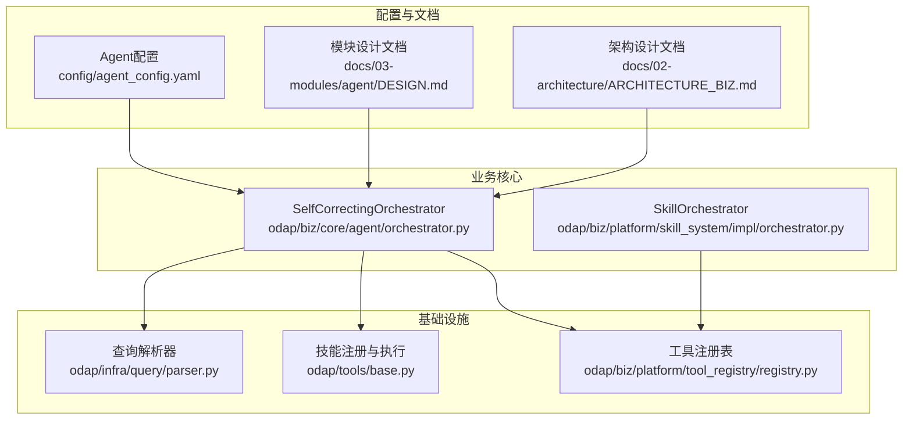
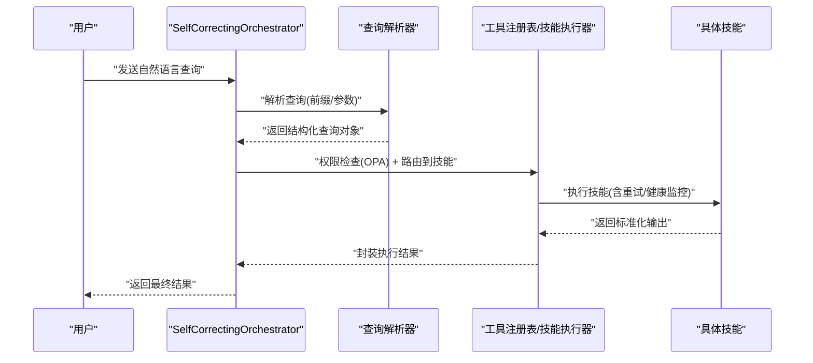
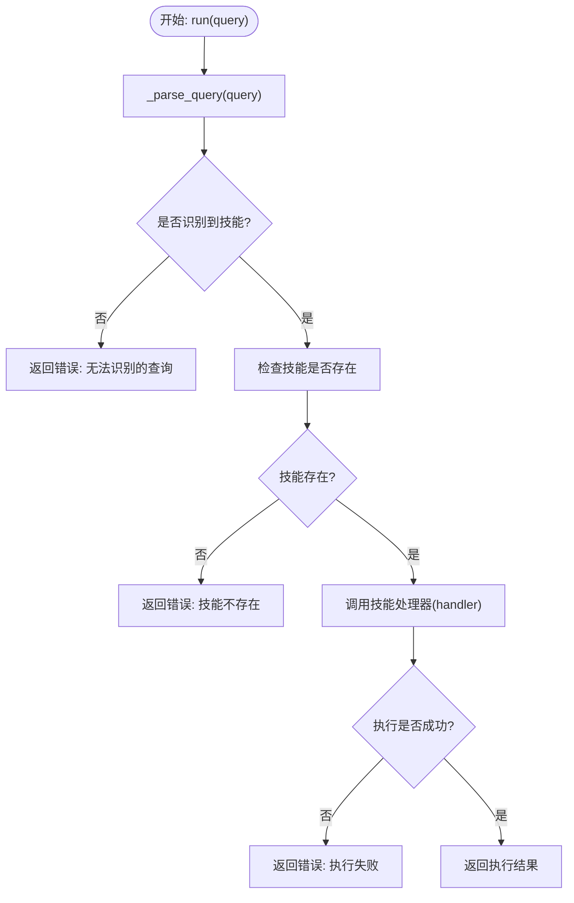
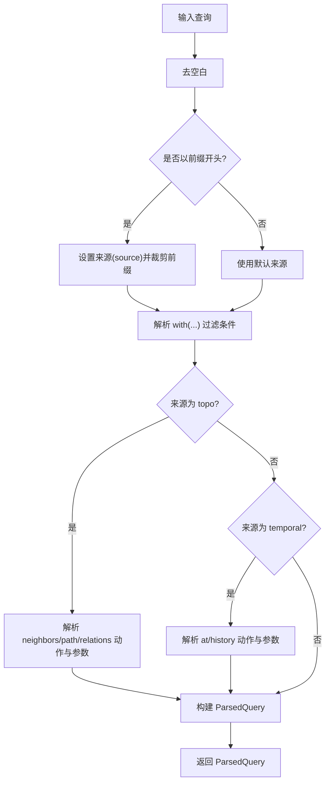
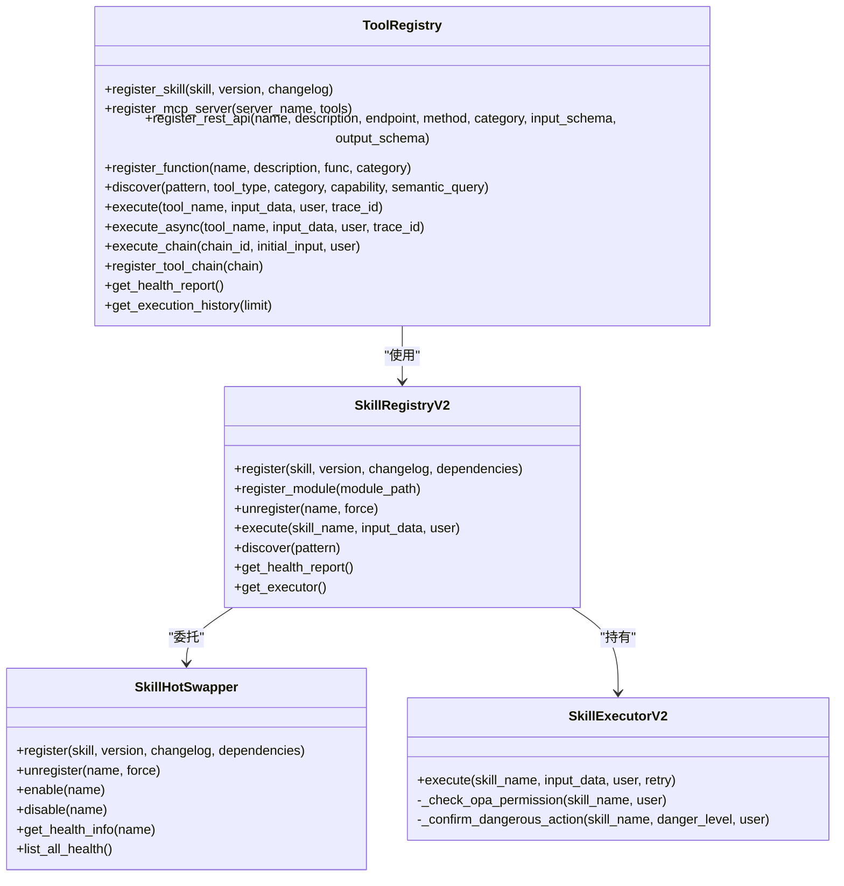
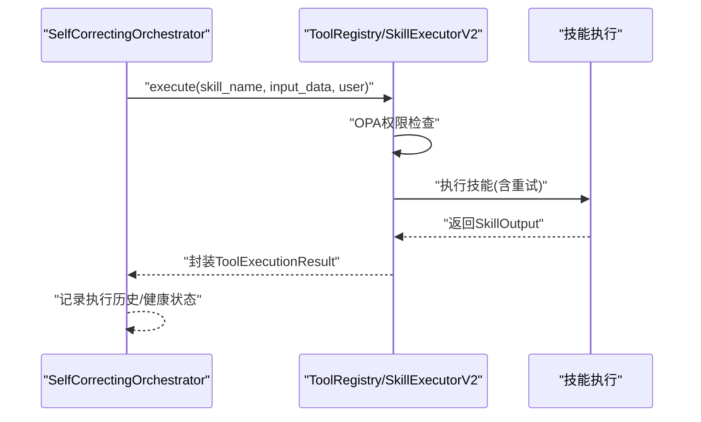
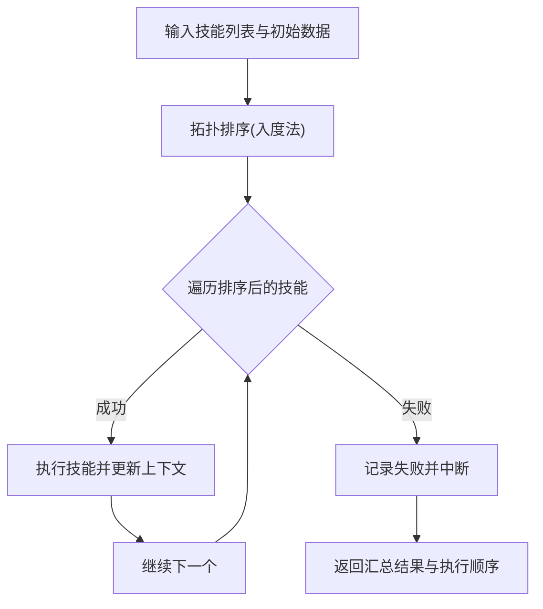
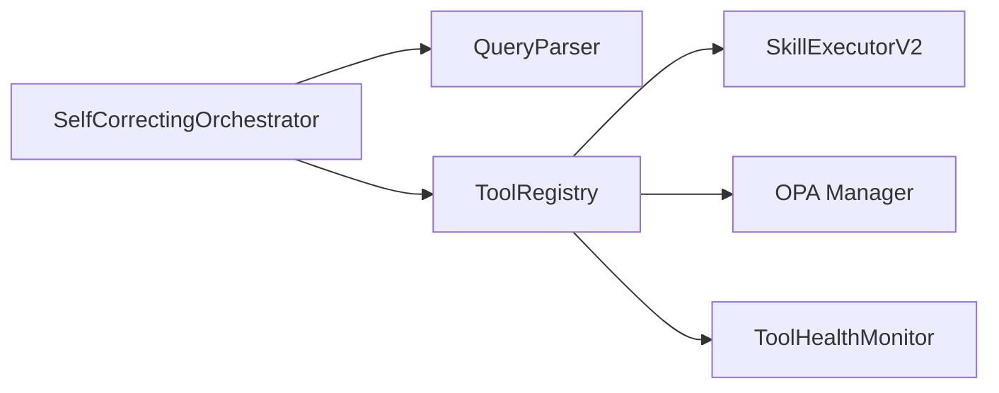

# 智能体编排器

<cite>
**本文档引用的文件**
- [odap/biz/core/agent/orchestrator.py](file://odap/biz/core/agent/orchestrator.py)
- [odap/biz/platform/skill_system/impl/orchestrator.py](file://odap/biz/platform/skill_system/impl/orchestrator.py)
- [odap/infra/query/parser.py](file://odap/infra/query/parser.py)
- [odap/tools/registry.py](file://odap/tools/registry.py)
- [odap/tools/base.py](file://odap/tools/base.py)
- [odap/biz/platform/tool_registry/registry.py](file://odap/biz/platform/tool_registry/registry.py)
- [config/agent_config.yaml](file://config/agent_config.yaml)
- [docs/03-modules/agent/DESIGN.md](file://docs/03-modules/agent/DESIGN.md)
- [docs/02-architecture/ARCHITECTURE_BIZ.md](file://docs/02-architecture/ARCHITECTURE_BIZ.md)
- [openharness/tests/test_skills/test_loader.py](file://openharness/tests/test_skills/test_loader.py)
- [openharness/scripts/test_real_skills_plugins.py](file://openharness/scripts/test_real_skills_plugins.py)
</cite>

## 目录
1. [简介](#简介)
2. [项目结构](#项目结构)
3. [核心组件](#核心组件)
4. [架构总览](#架构总览)
5. [详细组件分析](#详细组件分析)
6. [依赖分析](#依赖分析)
7. [性能考虑](#性能考虑)
8. [故障排查指南](#故障排查指南)
9. [结论](#结论)
10. [附录](#附录)

## 简介
本文件面向“智能体编排器”的技术文档，重点围绕 SelfCorrectingOrchestrator 类的设计理念与实现机制展开，涵盖以下主题：
- 任务路由与技能匹配：基于自然语言查询的意图识别与参数抽取，结合权限与安全策略进行路由。
- 执行流程：从查询解析到技能执行、结果封装与异常处理的完整链路。
- 查询解析算法：自然语言理解、关键词匹配与参数提取的实现要点。
- 技能目录管理：技能注册、权限验证、动态加载与健康监控。
- 配置选项、扩展方法与性能优化策略。
- 实际使用场景与代码示例路径。

## 项目结构
本项目采用分层与模块化组织方式，智能体编排器位于业务核心层，底层依赖工具注册表、技能执行器与查询解析器等基础设施模块。

**图表来源**
- [odap/biz/core/agent/orchestrator.py:1-151](file://odap/biz/core/agent/orchestrator.py#L1-L151)
- [odap/biz/platform/skill_system/impl/orchestrator.py:1-74](file://odap/biz/platform/skill_system/impl/orchestrator.py#L1-L74)
- [odap/infra/query/parser.py:1-113](file://odap/infra/query/parser.py#L1-L113)
- [odap/tools/base.py:1-720](file://odap/tools/base.py#L1-L720)
- [odap/biz/platform/tool_registry/registry.py:1-800](file://odap/biz/platform/tool_registry/registry.py#L1-L800)
- [config/agent_config.yaml:1-23](file://config/agent_config.yaml#L1-L23)
- [docs/03-modules/agent/DESIGN.md:122-178](file://docs/03-modules/agent/DESIGN.md#L122-L178)
- [docs/02-architecture/ARCHITECTURE_BIZ.md:1285-1358](file://docs/02-architecture/ARCHITECTURE_BIZ.md#L1285-L1358)

**章节来源**
- [odap/biz/core/agent/orchestrator.py:1-151](file://odap/biz/core/agent/orchestrator.py#L1-L151)
- [odap/biz/platform/skill_system/impl/orchestrator.py:1-74](file://odap/biz/platform/skill_system/impl/orchestrator.py#L1-L74)
- [odap/infra/query/parser.py:1-113](file://odap/infra/query/parser.py#L1-L113)
- [odap/tools/base.py:1-720](file://odap/tools/base.py#L1-L720)
- [odap/biz/platform/tool_registry/registry.py:1-800](file://odap/biz/platform/tool_registry/registry.py#L1-L800)
- [config/agent_config.yaml:1-23](file://config/agent_config.yaml#L1-L23)
- [docs/03-modules/agent/DESIGN.md:122-178](file://docs/03-modules/agent/DESIGN.md#L122-L178)
- [docs/02-architecture/ARCHITECTURE_BIZ.md:1285-1358](file://docs/02-architecture/ARCHITECTURE_BIZ.md#L1285-L1358)

## 核心组件
- SelfCorrectingOrchestrator：负责接收用户指令、进行权限检查、解析查询、路由到技能并执行，具备基本的错误处理与结果封装能力。
- SkillOrchestrator：面向多技能的拓扑排序与串行执行，支持失败中断与执行顺序记录。
- 查询解析器：将带前缀与 with(...) 参数的自然语言查询解析为结构化对象，便于后续路由与执行。
- 技能注册与执行：提供 BaseSkill 抽象、输入输出标准化、OPA 权限桥接、健康监控与重试机制。
- 工具注册表：统一管理技能、MCP 工具、REST API 与原生函数，支持语义发现、健康监控与工具链执行。

**章节来源**
- [odap/biz/core/agent/orchestrator.py:16-115](file://odap/biz/core/agent/orchestrator.py#L16-L115)
- [odap/biz/platform/skill_system/impl/orchestrator.py:8-74](file://odap/biz/platform/skill_system/impl/orchestrator.py#L8-L74)
- [odap/infra/query/parser.py:23-113](file://odap/infra/query/parser.py#L23-L113)
- [odap/tools/base.py:31-161](file://odap/tools/base.py#L31-L161)
- [odap/biz/platform/tool_registry/registry.py:403-800](file://odap/biz/platform/tool_registry/registry.py#L403-L800)

## 架构总览
SelfCorrectingOrchestrator 作为入口，串联查询解析、权限校验与技能执行。技能执行通过工具注册表与技能执行器完成，支持 OPA 权限检查与健康监控。

**图表来源**
- [odap/biz/core/agent/orchestrator.py:33-62](file://odap/biz/core/agent/orchestrator.py#L33-L62)
- [odap/infra/query/parser.py:31-81](file://odap/infra/query/parser.py#L31-L81)
- [odap/biz/platform/tool_registry/registry.py:579-668](file://odap/biz/platform/tool_registry/registry.py#L579-L668)
- [odap/tools/base.py:458-566](file://odap/tools/base.py#L458-L566)

## 详细组件分析

### SelfCorrectingOrchestrator 设计与实现
- 角色与职责
  - 接收用户指令，进行权限检查（OPA），执行任务并封装结果。
  - 提供基本的错误处理与结果返回。
- 查询解析与路由
  - 基于关键词与正则匹配识别技能类型与参数，例如“雷达”“打击”“攻击”“指挥”等。
  - 对未识别或无效查询返回错误信息。
- 执行与封装
  - 通过全局技能目录（SKILL_CATALOG）定位处理器并调用。
  - 捕获异常并返回标准化错误信息。
- 自校正机制
  - 文档中定义了自校正触发条件与策略（重试、降级、回退、升级），但当前实现主要体现为基础错误处理与结果封装。

**图表来源**
- [odap/biz/core/agent/orchestrator.py:33-115](file://odap/biz/core/agent/orchestrator.py#L33-L115)

**章节来源**
- [odap/biz/core/agent/orchestrator.py:16-115](file://odap/biz/core/agent/orchestrator.py#L16-L115)
- [docs/03-modules/agent/DESIGN.md:122-178](file://docs/03-modules/agent/DESIGN.md#L122-L178)

### 查询解析算法
- 目标
  - 将自然语言查询转换为结构化对象，包含来源（schema/entity/topo/temporal）、过滤条件、动作与参数、限制等。
- 关键点
  - 前缀识别：根据“.schema/.entity/.topo/.temporal”设置查询来源。
  - with(...) 过滤：解析键值对形式的过滤条件。
  - 动作与参数：针对 topo 与 temporal 源分别解析 neighbors/path/relations/at/history 等动作及其参数。
  - 参数类型：尝试将数值字符串转换为整型，否则保留为字符串。
- 复杂度
  - 时间复杂度近似 O(N)，N 为查询长度；空间复杂度与参数数量线性相关。

**图表来源**
- [odap/infra/query/parser.py:31-113](file://odap/infra/query/parser.py#L31-L113)

**章节来源**
- [odap/infra/query/parser.py:23-113](file://odap/infra/query/parser.py#L23-L113)

### 技能目录管理机制
- 注册与兼容
  - 旧式注册：register_skill() 同时写入全局技能目录（SKILL_CATALOG）与新式注册表，保证向后兼容。
  - 新式注册：BaseSkill 子类通过 SkillRegistryV2 注册，支持热插拔、版本管理与健康监控。
- 权限验证
  - 通过 OPA 权限桥接，按需检查技能操作权限与高危操作确认。
- 动态加载
  - 支持按模块动态加载技能类，便于扩展与热更新。
- 健康监控
  - 记录调用次数、成功率、平均耗时与最后错误，支持健康状态评估与告警。

**图表来源**
- [odap/tools/base.py:599-720](file://odap/tools/base.py#L599-L720)
- [odap/biz/platform/tool_registry/registry.py:403-800](file://odap/biz/platform/tool_registry/registry.py#L403-L800)

**章节来源**
- [odap/tools/registry.py:26-53](file://odap/tools/registry.py#L26-L53)
- [odap/tools/base.py:599-720](file://odap/tools/base.py#L599-L720)
- [odap/biz/platform/tool_registry/registry.py:403-800](file://odap/biz/platform/tool_registry/registry.py#L403-L800)
- [docs/02-architecture/ARCHITECTURE_BIZ.md:1285-1358](file://docs/02-architecture/ARCHITECTURE_BIZ.md#L1285-L1358)

### 执行流程与自校正
- 基础执行流程
  - 权限检查（OPA）→ 技能发现与路由 → 执行器执行（含重试）→ 健康监控记录 → 结果封装。
- 自校正策略
  - 文档定义了权限不足、执行错误、结果无效、超时等触发条件与重试/降级/回退/升级等策略。
  - 当前实现侧重于基础错误捕获与结果封装，自校正的自动化触发与策略执行可在此基础上扩展。

**图表来源**
- [odap/biz/platform/tool_registry/registry.py:579-668](file://odap/biz/platform/tool_registry/registry.py#L579-L668)
- [odap/tools/base.py:458-566](file://odap/tools/base.py#L458-L566)

**章节来源**
- [docs/03-modules/agent/DESIGN.md:157-175](file://docs/03-modules/agent/DESIGN.md#L157-L175)
- [odap/biz/platform/tool_registry/registry.py:579-668](file://odap/biz/platform/tool_registry/registry.py#L579-L668)
- [odap/tools/base.py:458-566](file://odap/tools/base.py#L458-L566)

### 多技能执行与拓扑排序
- 面向多技能的串行执行，先进行拓扑排序确保依赖满足，再逐个执行。
- 若某技能执行失败，记录失败原因并中断后续执行。
- 支持返回执行顺序与各技能结果汇总。

**图表来源**
- [odap/biz/platform/skill_system/impl/orchestrator.py:12-65](file://odap/biz/platform/skill_system/impl/orchestrator.py#L12-L65)

**章节来源**
- [odap/biz/platform/skill_system/impl/orchestrator.py:8-74](file://odap/biz/platform/skill_system/impl/orchestrator.py#L8-L74)

## 依赖分析
- SelfCorrectingOrchestrator 依赖：
  - 查询解析器：用于将自然语言转换为结构化查询。
  - 技能执行器：通过工具注册表与技能执行器完成权限检查与执行。
  - OPA 管理器：用于权限校验。
- 工具注册表依赖：
  - 技能执行器：封装执行细节与重试。
  - OPA 管理器：权限桥接。
  - 健康监控器：记录调用统计与健康状态。

**图表来源**
- [odap/biz/core/agent/orchestrator.py:16-32](file://odap/biz/core/agent/orchestrator.py#L16-L32)
- [odap/biz/platform/tool_registry/registry.py:403-425](file://odap/biz/platform/tool_registry/registry.py#L403-L425)

**章节来源**
- [odap/biz/core/agent/orchestrator.py:16-32](file://odap/biz/core/agent/orchestrator.py#L16-L32)
- [odap/biz/platform/tool_registry/registry.py:403-425](file://odap/biz/platform/tool_registry/registry.py#L403-L425)

## 性能考虑
- 查询解析
  - 使用正则与字符串匹配，整体为线性复杂度；建议对常见前缀与关键词建立索引以提升命中速度。
- 技能执行
  - 重试机制与健康监控会增加开销，建议根据技能重要性与失败率调整重试次数与延迟。
  - 对高危或高耗时技能启用超时控制与资源隔离。
- 并发与扩展
  - 工具链执行支持串行步骤，若需并行可引入异步执行器与队列管理。
  - 动态加载模块时注意缓存与去抖，避免频繁 I/O。

[本节为通用指导，无需特定文件引用]

## 故障排查指南
- 常见问题与定位
  - 技能不存在：检查全局技能目录与新式注册表是否一致，确认注册流程是否正确。
  - 权限不足：核对 OPA 策略与技能 opa_action 配置，确认用户角色与权限映射。
  - 执行失败：查看 ToolExecutionResult 中的错误信息与 trace_id，结合健康监控报告定位瓶颈。
  - 自校正未触发：确认是否在编排器中实现了基于触发条件的策略调度。
- 相关实现参考
  - 错误封装与返回：参见工具注册表的执行结果封装与异常捕获。
  - 权限检查：参见技能执行器的 OPA 权限检查与高危操作确认。
  - 健康监控：参见工具健康监控器的记录与告警逻辑。

**章节来源**
- [odap/biz/platform/tool_registry/registry.py:579-668](file://odap/biz/platform/tool_registry/registry.py#L579-L668)
- [odap/tools/base.py:567-596](file://odap/tools/base.py#L567-L596)
- [odap/biz/platform/tool_registry/registry.py:304-401](file://odap/biz/platform/tool_registry/registry.py#L304-L401)

## 结论
SelfCorrectingOrchestrator 提供了清晰的任务路由与执行框架，结合查询解析器与工具注册表，能够稳定地完成从自然语言到技能执行的闭环。技能注册与执行体系支持权限校验、健康监控与动态加载，为扩展与维护提供了良好基础。未来可在自校正策略自动化、执行并发化与性能优化方面进一步增强。

[本节为总结性内容，无需特定文件引用]

## 附录

### 配置选项
- Agent 配置示例：包含默认提供方与多个提供方的启用状态、模型、最大 token 与温度等参数。
- 使用建议：根据部署环境与性能目标调整模型与并发参数。

**章节来源**
- [config/agent_config.yaml:1-23](file://config/agent_config.yaml#L1-L23)

### 扩展方法
- 新增技能
  - 通过 BaseSkill 子类实现 execute()，并在模块中注册；或使用 register_skill() 兼容旧式注册。
  - 参考技能注册与执行器的接口与健康监控。
- 动态加载
  - 使用 SkillRegistryV2.register_module() 按模块动态加载技能类。
- 工具链
  - 通过 ToolRegistry.register_tool_chain() 定义工具链步骤，实现多技能协同。

**章节来源**
- [odap/tools/base.py:616-644](file://odap/tools/base.py#L616-L644)
- [odap/biz/platform/tool_registry/registry.py:705-718](file://odap/biz/platform/tool_registry/registry.py#L705-L718)

### 实际使用场景与示例路径
- 基础用法
  - SelfCorrectingOrchestrator.run() 的调用与返回结果封装。
  - 参考测试用例与示例路径：[odap/biz/core/agent/orchestrator.py:116-151](file://odap/biz/core/agent/orchestrator.py#L116-L151)
- 技能加载与验证
  - 开源 Harness 技能加载与注册验证的测试用例。
  - 参考：[openharness/tests/test_skills/test_loader.py:12-34](file://openharness/tests/test_skills/test_loader.py#L12-L34)
  - 参考：[openharness/scripts/test_real_skills_plugins.py:73-106](file://openharness/scripts/test_real_skills_plugins.py#L73-L106)