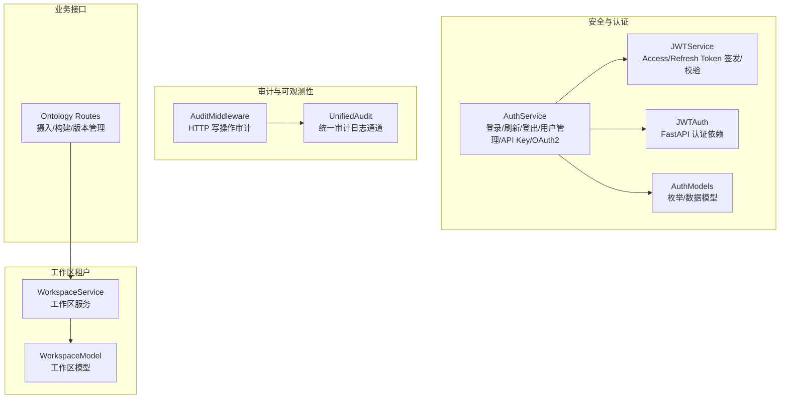
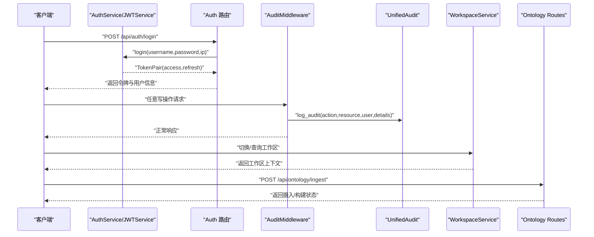
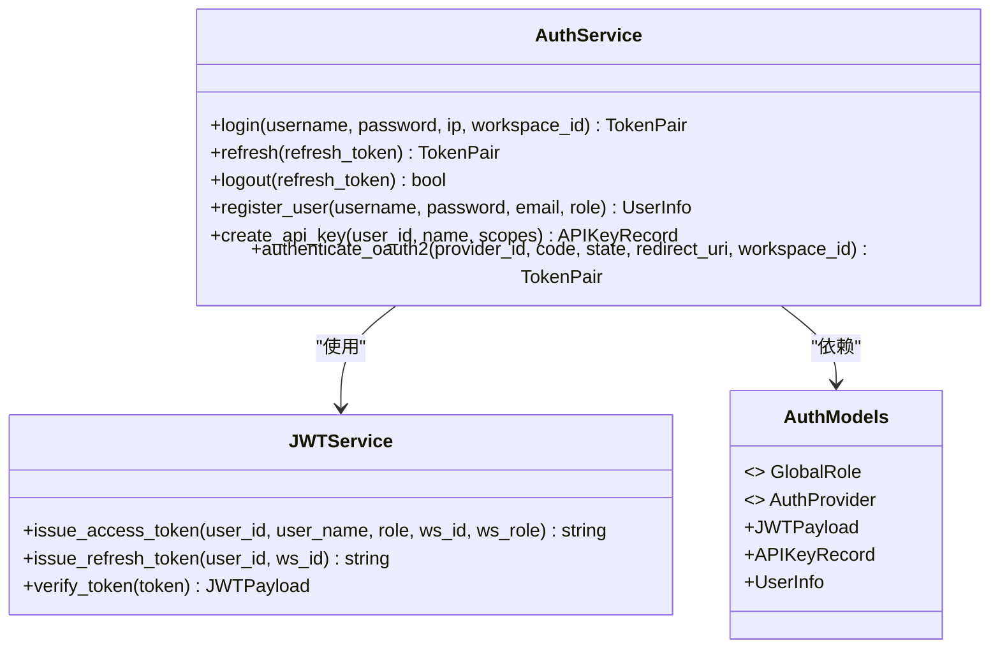
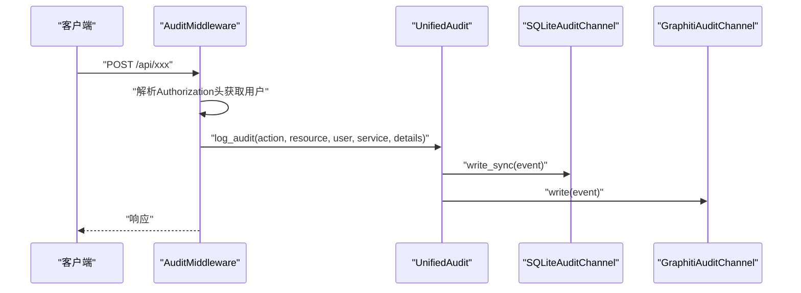
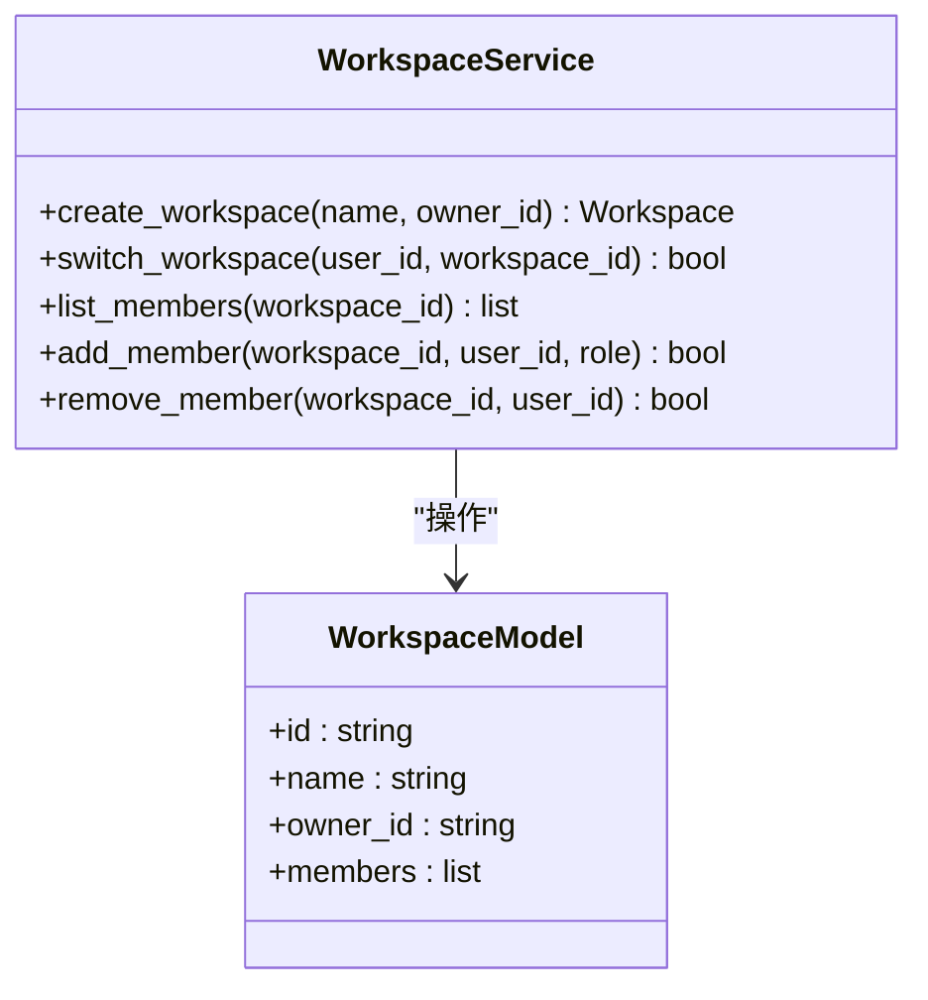
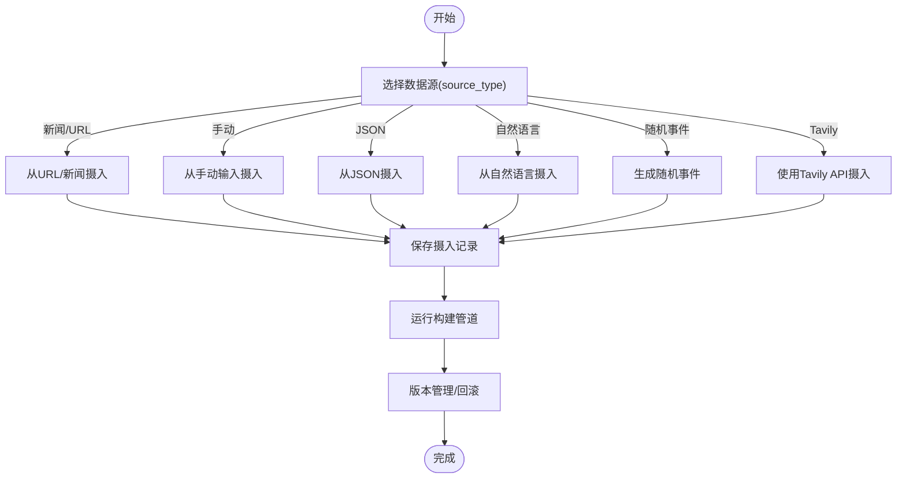
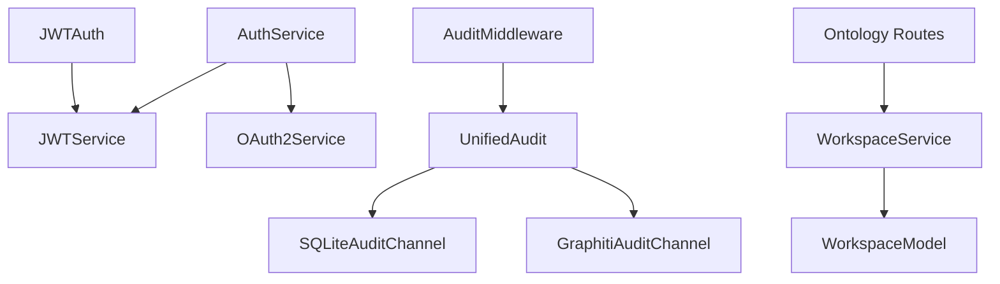

# 多租户支持

<cite>
**本文引用的文件**
- [odap/infra/security/auth_service.py](file://odap/infra/security/auth_service.py)
- [odap/infra/security/auth_routes.py](file://odap/infra/security/auth_routes.py)
- [odap/infra/security/jwt_service.py](file://odap/infra/security/jwt_service.py)
- [odap/infra/security/jwt_auth.py](file://odap/infra/security/jwt_auth.py)
- [odap/infra/security/auth_models.py](file://odap/infra/security/auth_models.py)
- [odap/infra/middleware/audit_middleware.py](file://odap/infra/middleware/audit_middleware.py)
- [odap/infra/security/unified_audit.py](file://odap/infra/security/unified_audit.py)
- [odap/biz/platform/workspace/services/workspace_service.py](file://odap/biz/platform/workspace/services/workspace_service.py)
- [odap/biz/platform/workspace/models/workspace.py](file://odap/biz/platform/workspace/models/workspace.py)
- [odap/biz/core/ontology/api/routes.py](file://odap/biz/core/ontology/api/routes.py)
</cite>

## 目录
1. [引言](#引言)
2. [项目结构](#项目结构)
3. [核心组件](#核心组件)
4. [架构总览](#架构总览)
5. [详细组件分析](#详细组件分析)
6. [依赖分析](#依赖分析)
7. [性能考虑](#性能考虑)
8. [故障排查指南](#故障排查指南)
9. [结论](#结论)
10. [附录](#附录)

## 引言
本技术文档围绕多租户支持机制进行系统化梳理，重点覆盖以下方面：
- 多租户架构设计原则：租户标识、资源隔离与访问控制
- 租户生命周期与管理：创建、配置、权限分配与资源配额
- 隔离策略：数据隔离、配置隔离与操作隔离
- 计费与成本分摊：资源使用统计、费用计算与账单生成
- 监控与审计：使用情况跟踪、异常检测与合规报告
- 实际应用与最佳实践：SaaS、企业私有化与混合云

文档以仓库现有实现为依据，结合代码级分析与可视化图示，帮助读者快速理解并落地多租户能力。

## 项目结构
多租户相关能力主要分布在安全认证、审计与工作区（租户）管理等模块：
- 认证与授权：JWT签发与校验、登录限流、OAuth2集成、API Key管理
- 审计与可观测性：HTTP写操作审计中间件、统一审计日志通道
- 工作区（租户）管理：工作区服务与模型定义
- 本体数据处理：本体摄入与构建接口，体现场景维度的资源边界

**图表来源**
- [odap/infra/security/auth_service.py:82-439](file://odap/infra/security/auth_service.py#L82-L439)
- [odap/infra/security/jwt_service.py:19-72](file://odap/infra/security/jwt_service.py#L19-L72)
- [odap/infra/security/jwt_auth.py:14-63](file://odap/infra/security/jwt_auth.py#L14-L63)
- [odap/infra/security/auth_models.py:19-128](file://odap/infra/security/auth_models.py#L19-L128)
- [odap/infra/middleware/audit_middleware.py:51-112](file://odap/infra/middleware/audit_middleware.py#L51-L112)
- [odap/infra/security/unified_audit.py:58-340](file://odap/infra/security/unified_audit.py#L58-L340)
- [odap/biz/platform/workspace/services/workspace_service.py](file://odap/biz/platform/workspace/services/workspace_service.py)
- [odap/biz/platform/workspace/models/workspace.py](file://odap/biz/platform/workspace/models/workspace.py)
- [odap/biz/core/ontology/api/routes.py:1-527](file://odap/biz/core/ontology/api/routes.py#L1-L527)

**章节来源**
- [odap/infra/security/auth_service.py:1-439](file://odap/infra/security/auth_service.py#L1-L439)
- [odap/infra/security/jwt_service.py:1-72](file://odap/infra/security/jwt_service.py#L1-L72)
- [odap/infra/security/jwt_auth.py:1-63](file://odap/infra/security/jwt_auth.py#L1-L63)
- [odap/infra/security/auth_models.py:1-128](file://odap/infra/security/auth_models.py#L1-L128)
- [odap/infra/middleware/audit_middleware.py:1-112](file://odap/infra/middleware/audit_middleware.py#L1-L112)
- [odap/infra/security/unified_audit.py:1-406](file://odap/infra/security/unified_audit.py#L1-L406)
- [odap/biz/platform/workspace/services/workspace_service.py](file://odap/biz/platform/workspace/services/workspace_service.py)
- [odap/biz/platform/workspace/models/workspace.py](file://odap/biz/platform/workspace/models/workspace.py)
- [odap/biz/core/ontology/api/routes.py:1-527](file://odap/biz/core/ontology/api/routes.py#L1-L527)

## 核心组件
- 认证与授权
  - 登录/刷新/登出：基于JWT的短期访问令牌与长期刷新令牌；登录限流防止暴力破解
  - 用户与角色：全局角色枚举与用户信息模型；支持本地账号与OAuth2/OIDC
  - API Key：用于服务间调用的身份凭证，支持作用域与过期控制
- 审计与可观测性
  - 审计中间件：自动记录写操作（POST/PUT/DELETE/PATCH），排除静态资源与非API路径
  - 统一审计通道：同时写入SQLite主存储与Graphiti辅助存储，提供查询与统计接口
- 工作区（租户）
  - 工作区服务与模型：承载租户维度的资源边界与上下文
- 本体数据处理
  - 摄入与构建：通过路由暴露摄入、构建、版本管理等能力，天然具备场景维度的资源隔离

**章节来源**
- [odap/infra/security/auth_service.py:82-439](file://odap/infra/security/auth_service.py#L82-L439)
- [odap/infra/security/jwt_service.py:19-72](file://odap/infra/security/jwt_service.py#L19-L72)
- [odap/infra/security/jwt_auth.py:14-63](file://odap/infra/security/jwt_auth.py#L14-L63)
- [odap/infra/security/auth_models.py:19-128](file://odap/infra/security/auth_models.py#L19-L128)
- [odap/infra/middleware/audit_middleware.py:51-112](file://odap/infra/middleware/audit_middleware.py#L51-L112)
- [odap/infra/security/unified_audit.py:58-340](file://odap/infra/security/unified_audit.py#L58-L340)
- [odap/biz/platform/workspace/services/workspace_service.py](file://odap/biz/platform/workspace/services/workspace_service.py)
- [odap/biz/platform/workspace/models/workspace.py](file://odap/biz/platform/workspace/models/workspace.py)
- [odap/biz/core/ontology/api/routes.py:1-527](file://odap/biz/core/ontology/api/routes.py#L1-L527)

## 架构总览
下图展示了多租户相关的端到端流程：用户认证、工作区上下文注入、写操作审计与本体数据处理。

**图表来源**
- [odap/infra/security/auth_routes.py:40-80](file://odap/infra/security/auth_routes.py#L40-L80)
- [odap/infra/security/auth_service.py:118-156](file://odap/infra/security/auth_service.py#L118-L156)
- [odap/infra/security/jwt_service.py:29-54](file://odap/infra/security/jwt_service.py#L29-L54)
- [odap/infra/middleware/audit_middleware.py:51-112](file://odap/infra/middleware/audit_middleware.py#L51-L112)
- [odap/infra/security/unified_audit.py:292-340](file://odap/infra/security/unified_audit.py#L292-L340)
- [odap/biz/platform/workspace/services/workspace_service.py](file://odap/biz/platform/workspace/services/workspace_service.py)
- [odap/biz/core/ontology/api/routes.py:74-125](file://odap/biz/core/ontology/api/routes.py#L74-L125)

## 详细组件分析

### 认证与授权组件
- 登录与令牌
  - 登录时进行IP级登录限流；成功后签发短期访问令牌与长期刷新令牌
  - 刷新令牌时校验过期与撤销状态，签发新的令牌对并更新持久化记录
- 用户与角色
  - 全局角色枚举覆盖系统管理员、项目拥有者、团队领导、成员、访客等
  - 用户信息模型包含全局角色与工作区成员信息
- API Key
  - 支持为用户创建API Key，返回明文Key一次，后续仅存哈希；支持作用域与过期控制
- OAuth2/OIDC
  - 提供授权URL生成与回调处理，自动创建或关联外部身份用户

**图表来源**
- [odap/infra/security/auth_service.py:82-439](file://odap/infra/security/auth_service.py#L82-L439)
- [odap/infra/security/jwt_service.py:19-72](file://odap/infra/security/jwt_service.py#L19-L72)
- [odap/infra/security/auth_models.py:19-128](file://odap/infra/security/auth_models.py#L19-L128)

**章节来源**
- [odap/infra/security/auth_service.py:82-439](file://odap/infra/security/auth_service.py#L82-L439)
- [odap/infra/security/jwt_service.py:19-72](file://odap/infra/security/jwt_service.py#L19-L72)
- [odap/infra/security/auth_models.py:19-128](file://odap/infra/security/auth_models.py#L19-L128)

### 审计与可观测性组件
- 审计中间件
  - 仅记录写操作，排除静态资源与特定API路径
  - 从Authorization头解析用户信息，构造审计事件并写入统一通道
- 统一审计通道
  - 同步写入SQLite主存储，异步写入Graphiti辅助存储
  - 提供简化接口：log_audit、log_ingest、log_query、log_workspace、log_error、get_audit_logs

**图表来源**
- [odap/infra/middleware/audit_middleware.py:51-112](file://odap/infra/middleware/audit_middleware.py#L51-L112)
- [odap/infra/security/unified_audit.py:292-340](file://odap/infra/security/unified_audit.py#L292-L340)

**章节来源**
- [odap/infra/middleware/audit_middleware.py:1-112](file://odap/infra/middleware/audit_middleware.py#L1-L112)
- [odap/infra/security/unified_audit.py:1-406](file://odap/infra/security/unified_audit.py#L1-L406)

### 工作区（租户）管理组件
- 工作区服务
  - 提供工作区的创建、切换、查询与成员管理等能力，作为租户上下文的核心载体
- 工作区模型
  - 定义工作区标识、名称与成员角色等字段，支撑多租户资源边界

**图表来源**
- [odap/biz/platform/workspace/services/workspace_service.py](file://odap/biz/platform/workspace/services/workspace_service.py)
- [odap/biz/platform/workspace/models/workspace.py](file://odap/biz/platform/workspace/models/workspace.py)

**章节来源**
- [odap/biz/platform/workspace/services/workspace_service.py](file://odap/biz/platform/workspace/services/workspace_service.py)
- [odap/biz/platform/workspace/models/workspace.py](file://odap/biz/platform/workspace/models/workspace.py)

### 本体数据处理与场景隔离
- 摄入与构建
  - 提供多种数据源摄入接口（新闻、手动、JSON、自然语言、随机事件、Tavily等）
  - 构建流程包含多个阶段，支持版本管理与回滚
- 场景维度
  - 路由参数与内部逻辑支持按场景ID隔离数据与构建结果，天然形成资源边界

**图表来源**
- [odap/biz/core/ontology/api/routes.py:74-292](file://odap/biz/core/ontology/api/routes.py#L74-L292)
- [odap/biz/core/ontology/api/routes.py:419-527](file://odap/biz/core/ontology/api/routes.py#L419-L527)

**章节来源**
- [odap/biz/core/ontology/api/routes.py:1-527](file://odap/biz/core/ontology/api/routes.py#L1-L527)

## 依赖分析
- 认证与授权
  - AuthService依赖JWTService进行令牌签发与校验，依赖OAuth2服务进行第三方登录
  - JWTAuth提供FastAPI依赖注入，用于路由保护与用户解析
- 审计
  - AuditMiddleware依赖JWT解码获取用户信息，依赖UnifiedAudit写入审计事件
  - UnifiedAudit同时对接SQLite与Graphiti通道，保证高可靠与高性能
- 工作区与业务
  - WorkspaceService与WorkspaceModel构成租户实体与操作接口
  - Ontology Routes依赖工作区上下文与场景ID实现资源隔离

**图表来源**
- [odap/infra/security/auth_service.py:82-439](file://odap/infra/security/auth_service.py#L82-L439)
- [odap/infra/security/jwt_service.py:19-72](file://odap/infra/security/jwt_service.py#L19-L72)
- [odap/infra/security/jwt_auth.py:14-63](file://odap/infra/security/jwt_auth.py#L14-L63)
- [odap/infra/middleware/audit_middleware.py:51-112](file://odap/infra/middleware/audit_middleware.py#L51-L112)
- [odap/infra/security/unified_audit.py:58-340](file://odap/infra/security/unified_audit.py#L58-L340)
- [odap/biz/platform/workspace/services/workspace_service.py](file://odap/biz/platform/workspace/services/workspace_service.py)
- [odap/biz/platform/workspace/models/workspace.py](file://odap/biz/platform/workspace/models/workspace.py)
- [odap/biz/core/ontology/api/routes.py:1-527](file://odap/biz/core/ontology/api/routes.py#L1-L527)

**章节来源**
- [odap/infra/security/auth_service.py:82-439](file://odap/infra/security/auth_service.py#L82-L439)
- [odap/infra/security/jwt_service.py:19-72](file://odap/infra/security/jwt_service.py#L19-L72)
- [odap/infra/security/jwt_auth.py:14-63](file://odap/infra/security/jwt_auth.py#L14-L63)
- [odap/infra/middleware/audit_middleware.py:51-112](file://odap/infra/middleware/audit_middleware.py#L51-L112)
- [odap/infra/security/unified_audit.py:58-340](file://odap/infra/security/unified_audit.py#L58-L340)
- [odap/biz/platform/workspace/services/workspace_service.py](file://odap/biz/platform/workspace/services/workspace_service.py)
- [odap/biz/platform/workspace/models/workspace.py](file://odap/biz/platform/workspace/models/workspace.py)
- [odap/biz/core/ontology/api/routes.py:1-527](file://odap/biz/core/ontology/api/routes.py#L1-L527)

## 性能考虑
- 登录限流：基于内存的滑动窗口计数与锁定，降低暴力破解风险，减少无效认证开销
- 令牌轮换：短期访问令牌+长期刷新令牌，降低频繁鉴权成本
- 审计写入：SQLite同步写入保证可靠性，Graphiti异步写入提升吞吐
- 异步构建：本体构建在后台异步执行，避免阻塞请求

[本节为通用性能讨论，无需“章节来源”]

## 故障排查指南
- 认证失败
  - 检查登录限流是否触发（同一IP短时间内多次失败会被锁定）
  - 核对用户名/密码或OAuth2回调是否正确
- 令牌失效
  - 访问令牌过期后使用刷新令牌换取新令牌；确认刷新令牌未被撤销且未过期
- 审计缺失
  - 确认请求方法为写操作（POST/PUT/DELETE/PATCH），且路径以/api/开头
  - 检查排除列表（如/docs、/openapi.json、/health、/static、/api/audit）是否导致忽略
- API Key无效
  - 确认API Key未过期且处于激活状态；检查作用域是否匹配

**章节来源**
- [odap/infra/security/auth_service.py:39-80](file://odap/infra/security/auth_service.py#L39-L80)
- [odap/infra/security/jwt_service.py:56-72](file://odap/infra/security/jwt_service.py#L56-L72)
- [odap/infra/middleware/audit_middleware.py:16-30](file://odap/infra/middleware/audit_middleware.py#L16-L30)
- [odap/infra/security/unified_audit.py:328-340](file://odap/infra/security/unified_audit.py#L328-L340)

## 结论
本代码库已具备多租户支持的基础能力：
- 通过JWT与OAuth2实现强健的认证与授权
- 通过工作区（租户）与场景维度实现资源隔离
- 通过审计中间件与统一审计通道实现可观测性与合规
- 通过异步构建与令牌轮换优化性能与安全性

建议在现有基础上进一步完善：
- 明确租户维度的资源配额与计费指标采集
- 在工作区服务中引入配额与用量统计
- 将审计事件与计费指标打通，形成闭环

[本节为总结，无需“章节来源”]

## 附录
- 最佳实践
  - SaaS场景：以工作区为租户边界，结合场景ID实现数据隔离；使用API Key与OAuth2满足不同接入方式
  - 企业私有化：启用登录限流与审计，严格控制API Key作用域；定期轮换密钥
  - 混合云：统一审计通道同时写入本地SQLite与远端Graphiti，保障跨环境一致性

[本节为概念性内容，无需“章节来源”]