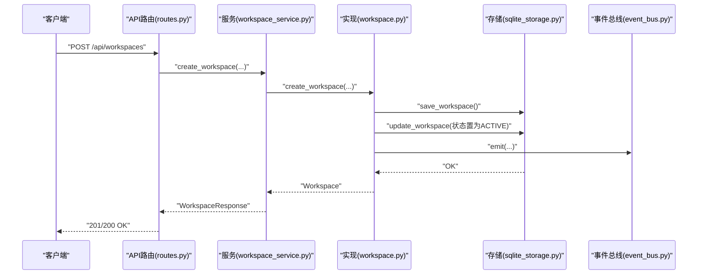
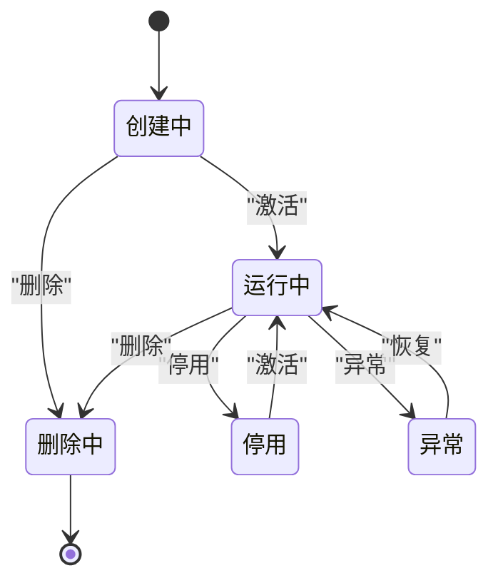
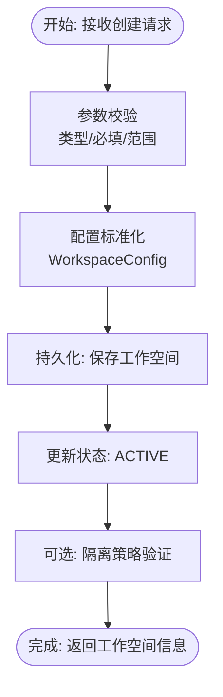
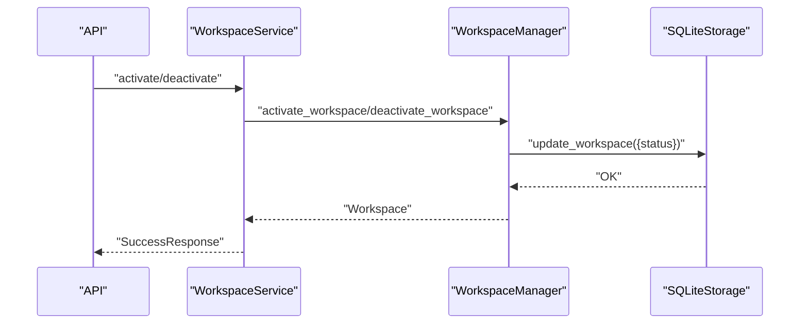
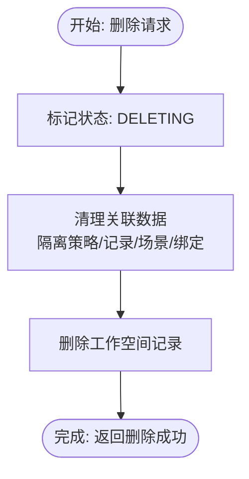
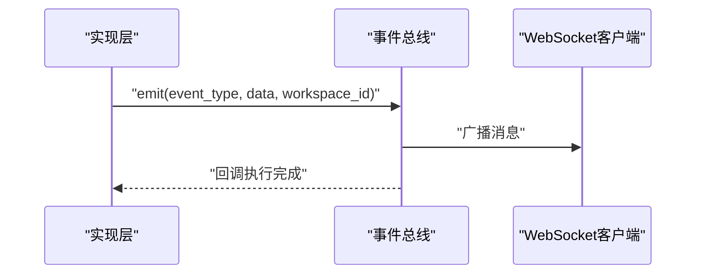
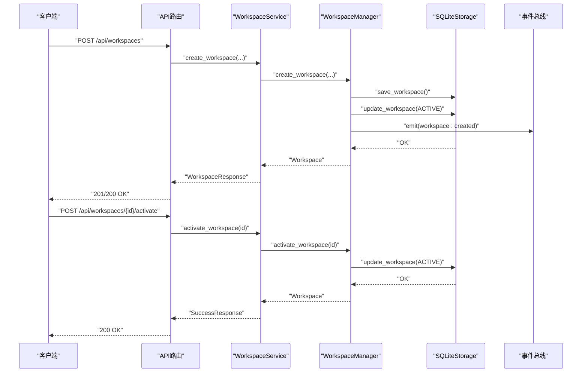

# 工作空间生命周期

<cite>
**本文引用的文件**
- [workspace.py](file://odap/biz/platform/workspace/models/workspace.py)
- [workspace.py](file://odap/biz/platform/workspace/impl/workspace.py)
- [workspace_service.py](file://odap/biz/platform/workspace/services/workspace_service.py)
- [routes.py](file://odap/biz/platform/workspace/api/routes.py)
- [sqlite_storage.py](file://odap/biz/platform/workspace/storage/sqlite_storage.py)
- [isolation_service.py](file://odap/biz/platform/workspace/services/isolation_service.py)
- [isolation.py](file://odap/biz/platform/workspace/impl/isolation.py)
- [import_export.py](file://odap/biz/platform/workspace/impl/import_export.py)
- [event_bus.py](file://odap/web/ws/event_bus.py)
- [app.py](file://odap/web/app.py)
- [test_workspace.py](file://tests/unit/test_workspace.py)
- [test_military_e2e_flow.py](file://tests/e2e/test_military_e2e_flow.py)
- [test_state_machine.py](file://tests/unit/test_state_machine.py)
- [state_machine_engine.py](file://odap/biz/core/ontology/runtime/state_machine/impl/state_machine_engine.py)
</cite>

## 目录
1. [简介](#简介)
2. [项目结构](#项目结构)
3. [核心组件](#核心组件)
4. [架构概览](#架构概览)
5. [详细组件分析](#详细组件分析)
6. [依赖分析](#依赖分析)
7. [性能考虑](#性能考虑)
8. [故障排查指南](#故障排查指南)
9. [结论](#结论)
10. [附录](#附录)

## 简介
本文件系统性阐述工作空间生命周期管理的技术方案，覆盖从创建、初始化、激活、运行、停用、删除到恢复的全链路流程；明确状态管理规则、状态持久化与一致性保障；给出创建与销毁的参数校验、资源配置、初始化与启动检查机制；并建立事件模型与回调机制，确保状态变更通知与异常处理策略的有效落地。

## 项目结构
工作空间相关能力由“模型-实现-服务-接口-存储”五层构成，并通过API路由对外暴露，同时集成隔离策略、导入导出与事件总线等子系统。

```mermaid
graph TB
subgraph "API层"
R[routes.py]
end
subgraph "服务层"
WSvc[workspace_service.py]
ISvc[isolation_service.py]
IE[import_export.py]
end
subgraph "实现层"
WMgr[workspace.py(实现)]
IMgr[isolation.py(实现)]
end
subgraph "模型层"
Mdl[workspace.py(模型)]
end
subgraph "存储层"
Store[sqlite_storage.py]
end
subgraph "事件总线"
Bus[event_bus.py]
end
R --> WSvc
R --> ISvc
R --> IE
WSvc --> WMgr
ISvc --> IMgr
WMgr --> Store
IMgr --> Store
WSvc --> Store
IE --> Store
WMgr --> Bus
```

**图表来源**
- [routes.py:1-758](file://odap/biz/platform/workspace/api/routes.py#L1-L758)
- [workspace_service.py:1-304](file://odap/biz/platform/workspace/services/workspace_service.py#L1-L304)
- [workspace.py:1-178](file://odap/biz/platform/workspace/impl/workspace.py#L1-L178)
- [isolation_service.py:1-122](file://odap/biz/platform/workspace/services/isolation_service.py#L1-L122)
- [isolation.py:1-112](file://odap/biz/platform/workspace/impl/isolation.py#L1-L112)
- [sqlite_storage.py:1-695](file://odap/biz/platform/workspace/storage/sqlite_storage.py#L1-L695)
- [event_bus.py:1-147](file://odap/web/ws/event_bus.py#L1-L147)

**章节来源**
- [routes.py:1-758](file://odap/biz/platform/workspace/api/routes.py#L1-L758)
- [workspace_service.py:1-304](file://odap/biz/platform/workspace/services/workspace_service.py#L1-L304)
- [workspace.py:1-178](file://odap/biz/platform/workspace/impl/workspace.py#L1-L178)
- [sqlite_storage.py:1-695](file://odap/biz/platform/workspace/storage/sqlite_storage.py#L1-L695)

## 核心组件
- 工作空间模型与状态枚举：定义工作空间类型、状态、配置与实体结构，支撑全生命周期状态机。
- 工作空间管理器：封装创建、查询、更新、删除、成员管理、激活/停用、本体绑定等核心操作。
- 工作空间服务：对外提供统一的服务接口，负责参数校验、调用管理器与返回标准化响应。
- API路由：REST接口定义，将HTTP请求映射到服务方法，处理异常与状态码。
- 存储层：基于SQLite的持久化实现，支持工作空间、隔离策略、导入导出记录与场景数据的读写与迁移。
- 隔离服务与管理器：提供隔离策略创建、验证、资源使用统计与配额检查。
- 导入导出管理器：提供工作空间导出/导入的异步流程与进度跟踪。
- 事件总线：提供WebSocket连接、订阅与广播，支持实体变更、动作结果、审计事件等域内事件。

**章节来源**
- [workspace.py:1-52](file://odap/biz/platform/workspace/models/workspace.py#L1-L52)
- [workspace.py:1-178](file://odap/biz/platform/workspace/impl/workspace.py#L1-L178)
- [workspace_service.py:1-304](file://odap/biz/platform/workspace/services/workspace_service.py#L1-L304)
- [routes.py:1-758](file://odap/biz/platform/workspace/api/routes.py#L1-L758)
- [sqlite_storage.py:1-695](file://odap/biz/platform/workspace/storage/sqlite_storage.py#L1-L695)
- [isolation_service.py:1-122](file://odap/biz/platform/workspace/services/isolation_service.py#L1-L122)
- [isolation.py:1-112](file://odap/biz/platform/workspace/impl/isolation.py#L1-L112)
- [import_export.py:1-164](file://odap/biz/platform/workspace/impl/import_export.py#L1-L164)
- [event_bus.py:1-147](file://odap/web/ws/event_bus.py#L1-L147)

## 架构概览
工作空间生命周期由API路由触发，经服务层进入实现层，落库于SQLite存储；同时通过事件总线向客户端推送状态变更与运行事件。



**图表来源**
- [routes.py:31-47](file://odap/biz/platform/workspace/api/routes.py#L31-L47)
- [workspace_service.py:17-55](file://odap/biz/platform/workspace/services/workspace_service.py#L17-L55)
- [workspace.py:16-36](file://odap/biz/platform/workspace/impl/workspace.py#L16-L36)
- [sqlite_storage.py:159-188](file://odap/biz/platform/workspace/storage/sqlite_storage.py#L159-L188)
- [event_bus.py:34-56](file://odap/web/ws/event_bus.py#L34-L56)

## 详细组件分析

### 工作空间状态模型与状态机
- 状态枚举：CREATING、ACTIVE、INACTIVE、DELETING、ERROR，覆盖创建、运行、停用、删除中、异常等关键节点。
- 状态转换：通过服务层的激活/停用接口驱动，管理器直接更新状态并持久化。
- 状态一致性：存储层以原子事务方式写入，配合迁移脚本保证历史字段兼容。



**图表来源**
- [workspace.py:10-16](file://odap/biz/platform/workspace/models/workspace.py#L10-L16)
- [workspace.py:81-87](file://odap/biz/platform/workspace/impl/workspace.py#L81-L87)
- [workspace_service.py:166-200](file://odap/biz/platform/workspace/services/workspace_service.py#L166-L200)

**章节来源**
- [workspace.py:10-16](file://odap/biz/platform/workspace/models/workspace.py#L10-L16)
- [workspace.py:81-87](file://odap/biz/platform/workspace/impl/workspace.py#L81-L87)
- [workspace_service.py:166-200](file://odap/biz/platform/workspace/services/workspace_service.py#L166-L200)

### 创建流程（参数校验、资源配置、初始化与启动检查）
- 参数校验：API层对请求体进行类型约束与必填项校验；服务层对配置对象进行类型转换与默认值填充。
- 资源配置：工作空间配置包含隔离级别、资源配额、网络策略、环境变量与特性开关等字段。
- 初始化：创建完成后立即置状态为运行中并持久化，确保后续操作可用。
- 启动检查：可通过隔离服务进行策略验证与资源使用统计，作为启动前检查的补充。



**图表来源**
- [routes.py:32-47](file://odap/biz/platform/workspace/api/routes.py#L32-L47)
- [workspace_service.py:17-55](file://odap/biz/platform/workspace/services/workspace_service.py#L17-L55)
- [workspace.py:16-36](file://odap/biz/platform/workspace/impl/workspace.py#L16-L36)
- [isolation_service.py:85-94](file://odap/biz/platform/workspace/services/isolation_service.py#L85-L94)

**章节来源**
- [routes.py:32-47](file://odap/biz/platform/workspace/api/routes.py#L32-L47)
- [workspace_service.py:17-55](file://odap/biz/platform/workspace/services/workspace_service.py#L17-L55)
- [workspace.py:16-36](file://odap/biz/platform/workspace/impl/workspace.py#L16-L36)
- [isolation_service.py:85-94](file://odap/biz/platform/workspace/services/isolation_service.py#L85-L94)

### 激活/停用流程
- 激活：将状态从非ACTIVE置为ACTIVE，返回状态变更结果。
- 停用：将状态从ACTIVE置为INACTIVE，便于资源回收或维护。



**图表来源**
- [routes.py:126-151](file://odap/biz/platform/workspace/api/routes.py#L126-L151)
- [workspace_service.py:166-200](file://odap/biz/platform/workspace/services/workspace_service.py#L166-L200)
- [workspace.py:81-87](file://odap/biz/platform/workspace/impl/workspace.py#L81-L87)
- [sqlite_storage.py:225-227](file://odap/biz/platform/workspace/storage/sqlite_storage.py#L225-L227)

**章节来源**
- [routes.py:126-151](file://odap/biz/platform/workspace/api/routes.py#L126-L151)
- [workspace_service.py:166-200](file://odap/biz/platform/workspace/services/workspace_service.py#L166-L200)
- [workspace.py:81-87](file://odap/biz/platform/workspace/impl/workspace.py#L81-L87)

### 成员管理与资源字段
- 成员管理：添加/移除成员，更新时间戳并持久化。
- 资源字段：工作空间模型包含resources字典，用于承载运行期资源元数据，端到端持久化与查询均保留该字段。

**章节来源**
- [workspace.py:89-113](file://odap/biz/platform/workspace/impl/workspace.py#L89-L113)
- [sqlite_storage.py:203-230](file://odap/biz/platform/workspace/storage/sqlite_storage.py#L203-L230)
- [test_military_e2e_flow.py:397-403](file://tests/e2e/test_military_e2e_flow.py#L397-L403)

### 删除流程（资源清理、数据备份与最终删除）
- 标记删除中：将状态置为DELETING，避免并发操作。
- 清理与删除：存储层执行级联删除（工作空间、隔离策略、导入导出记录、场景及其绑定），确保数据完整性。
- 失败回滚：若删除过程中出现异常，应保持一致性，必要时通过事务或补偿机制处理。



**图表来源**
- [workspace.py:58-74](file://odap/biz/platform/workspace/impl/workspace.py#L58-L74)
- [sqlite_storage.py:229-251](file://odap/biz/platform/workspace/storage/sqlite_storage.py#L229-L251)

**章节来源**
- [workspace.py:58-74](file://odap/biz/platform/workspace/impl/workspace.py#L58-L74)
- [sqlite_storage.py:229-251](file://odap/biz/platform/workspace/storage/sqlite_storage.py#L229-L251)
- [test_workspace.py:107-117](file://tests/unit/test_workspace.py#L107-L117)

### 导入导出与进度跟踪
- 导出/导入：异步执行，记录进度、状态、耗时与错误信息。
- 进度查询：支持按记录ID查询进度与状态，便于前端轮询展示。
- 取消操作：在进行中或待处理状态下可取消并标记失败。

**章节来源**
- [import_export.py:16-101](file://odap/biz/platform/workspace/impl/import_export.py#L16-L101)
- [routes.py:239-350](file://odap/biz/platform/workspace/api/routes.py#L239-L350)

### 隔离策略与资源监控
- 策略创建/更新/验证：提供隔离级别、资源配额与网络策略的管理入口。
- 资源使用统计：返回CPU、内存、存储等指标与连接数、进程数等运行态信息。
- 配额检查：基于阈值判断是否存在违规，输出告警信息。

**章节来源**
- [isolation_service.py:14-121](file://odap/biz/platform/workspace/services/isolation_service.py#L14-L121)
- [isolation.py:67-112](file://odap/biz/platform/workspace/impl/isolation.py#L67-L112)

### 事件模型与回调机制
- 事件总线：支持WebSocket连接、按工作空间分组广播、订阅回调与历史事件缓存。
- 事件类型：涵盖实体变更、情报更新、动作结果、OADP进度、OPA校验、审计事件等。
- 回调处理：订阅者回调在事件发出后同步/异步执行，异常被安全捕获并记录。



**图表来源**
- [event_bus.py:34-56](file://odap/web/ws/event_bus.py#L34-L56)
- [workspace.py:30-36](file://odap/biz/platform/workspace/impl/workspace.py#L30-L36)

**章节来源**
- [event_bus.py:13-147](file://odap/web/ws/event_bus.py#L13-L147)
- [workspace.py:30-36](file://odap/biz/platform/workspace/impl/workspace.py#L30-L36)

### 状态持久化与一致性保障
- 数据库存储：工作空间、隔离策略、导入导出记录与场景数据均持久化至SQLite，字段序列化/反序列化处理复杂类型。
- 迁移与兼容：存储层具备迁移逻辑，自动补齐新增字段，保证历史数据可用。
- 一致性：单条记录的读写为原子操作；删除采用级联策略，避免悬挂数据。

**章节来源**
- [sqlite_storage.py:25-117](file://odap/biz/platform/workspace/storage/sqlite_storage.py#L25-L117)
- [sqlite_storage.py:159-306](file://odap/biz/platform/workspace/storage/sqlite_storage.py#L159-L306)

## 依赖分析
- 组件耦合：API路由依赖服务层；服务层依赖实现层；实现层依赖存储层；事件总线独立于业务流程但被实现层触发。
- 外部依赖：SQLite数据库、FastAPI框架、WebSocket通信。
- 循环依赖：未发现循环导入；事件总线为纯工具模块，不依赖业务实现。

```mermaid
graph LR
Routes[routes.py] --> Svc[workspace_service.py]
Svc --> Impl[workspace.py(实现)]
Impl --> Store[sqlite_storage.py]
Impl --> Bus[event_bus.py]
Svc --> Isvc[isolation_service.py]
Isvc --> Imgr[isolation.py(实现)]
Imgr --> Store
Svc --> Iemgr[import_export.py]
Iemgr --> Store
```

**图表来源**
- [routes.py:1-758](file://odap/biz/platform/workspace/api/routes.py#L1-L758)
- [workspace_service.py:1-304](file://odap/biz/platform/workspace/services/workspace_service.py#L1-L304)
- [workspace.py:1-178](file://odap/biz/platform/workspace/impl/workspace.py#L1-L178)
- [sqlite_storage.py:1-695](file://odap/biz/platform/workspace/storage/sqlite_storage.py#L1-L695)
- [isolation_service.py:1-122](file://odap/biz/platform/workspace/services/isolation_service.py#L1-L122)
- [isolation.py:1-112](file://odap/biz/platform/workspace/impl/isolation.py#L1-L112)
- [import_export.py:1-164](file://odap/biz/platform/workspace/impl/import_export.py#L1-L164)
- [event_bus.py:1-147](file://odap/web/ws/event_bus.py#L1-L147)

**章节来源**
- [routes.py:1-758](file://odap/biz/platform/workspace/api/routes.py#L1-L758)
- [workspace_service.py:1-304](file://odap/biz/platform/workspace/services/workspace_service.py#L1-L304)
- [workspace.py:1-178](file://odap/biz/platform/workspace/impl/workspace.py#L1-L178)
- [sqlite_storage.py:1-695](file://odap/biz/platform/workspace/storage/sqlite_storage.py#L1-L695)

## 性能考虑
- 存储层：批量查询使用LIMIT/OFFSET分页，避免一次性加载过多数据；JSON字段序列化/反序列化开销可控。
- 事件总线：广播时维护死连接集合并剔除，降低无效IO；历史事件限制数量，防止内存膨胀。
- 导入导出：进度以百分比更新，避免频繁IO；异常时记录错误并终止流程，减少无效重试。
- 隔离策略：资源使用统计为模拟实现，实际项目建议接入真实监控系统以降低估算误差。

[本节为通用指导，无需特定文件引用]

## 故障排查指南
- 创建失败：检查请求参数类型与必填项；查看服务层返回的错误信息；确认存储层是否抛出异常。
- 激活/停用异常：确认目标工作空间是否存在；检查状态转换是否符合预期；查看存储层更新是否成功。
- 删除异常：确认删除流程是否正确标记DELETING；检查级联删除是否成功；核对存储层日志。
- 导入导出失败：查看记录状态是否变为FAILED；检查错误数组中的具体原因；确认文件路径与权限。
- 事件未到达：检查WebSocket连接状态；确认订阅事件类型；查看事件总线回调异常日志。

**章节来源**
- [workspace_service.py:106-124](file://odap/biz/platform/workspace/services/workspace_service.py#L106-L124)
- [workspace.py:58-74](file://odap/biz/platform/workspace/impl/workspace.py#L58-L74)
- [import_export.py:122-136](file://odap/biz/platform/workspace/impl/import_export.py#L122-L136)
- [event_bus.py:21-32](file://odap/web/ws/event_bus.py#L21-L32)

## 结论
工作空间生命周期管理通过清晰的分层架构与完善的事件机制，实现了从创建到删除的全链路可观测与可追溯。状态模型与持久化策略确保了数据一致性；隔离与导入导出能力提供了运行期资源控制与数据迁移支持；事件总线为实时通知与前端交互提供了基础。建议在生产环境中进一步完善异常补偿、监控埋点与配额校验的自动化。

[本节为总结性内容，无需特定文件引用]

## 附录

### 关键流程时序图：工作空间创建与激活


**图表来源**
- [routes.py:31-47](file://odap/biz/platform/workspace/api/routes.py#L31-L47)
- [routes.py:126-137](file://odap/biz/platform/workspace/api/routes.py#L126-L137)
- [workspace_service.py:17-55](file://odap/biz/platform/workspace/services/workspace_service.py#L17-L55)
- [workspace_service.py:166-182](file://odap/biz/platform/workspace/services/workspace_service.py#L166-L182)
- [workspace.py:16-36](file://odap/biz/platform/workspace/impl/workspace.py#L16-L36)
- [workspace.py:81-83](file://odap/biz/platform/workspace/impl/workspace.py#L81-L83)
- [sqlite_storage.py:159-188](file://odap/biz/platform/workspace/storage/sqlite_storage.py#L159-L188)
- [event_bus.py:34-56](file://odap/web/ws/event_bus.py#L34-L56)