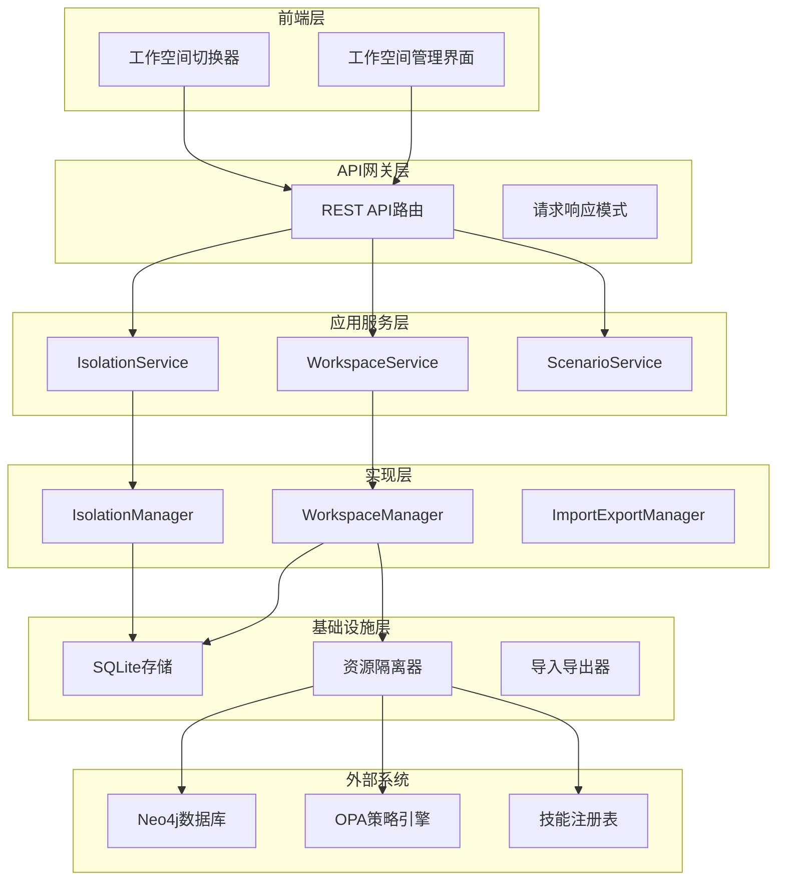
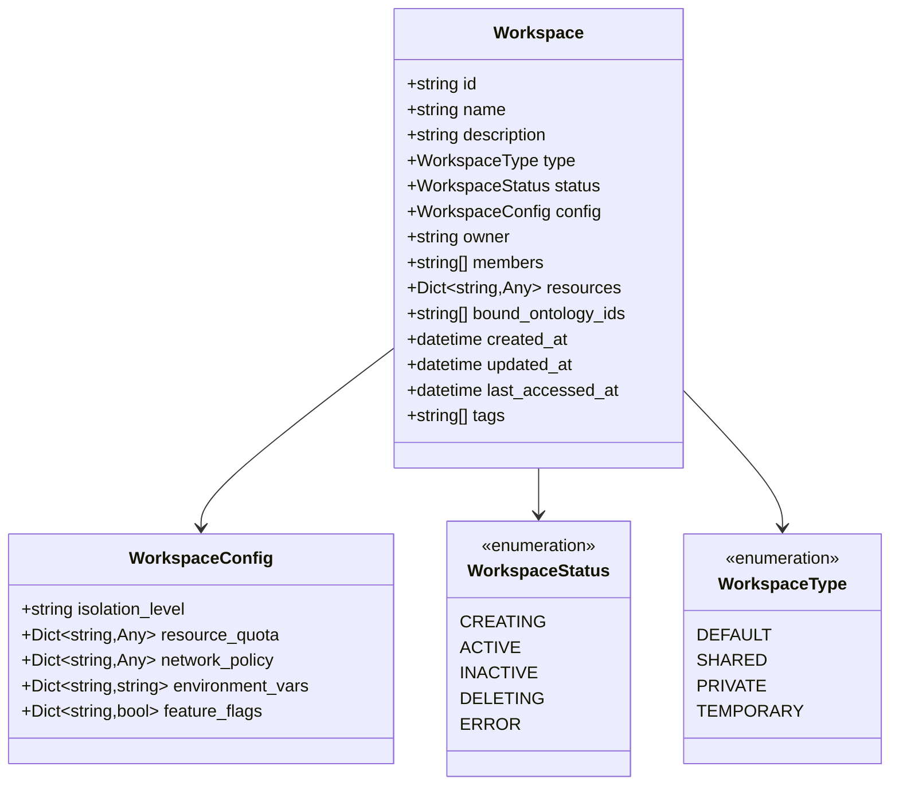
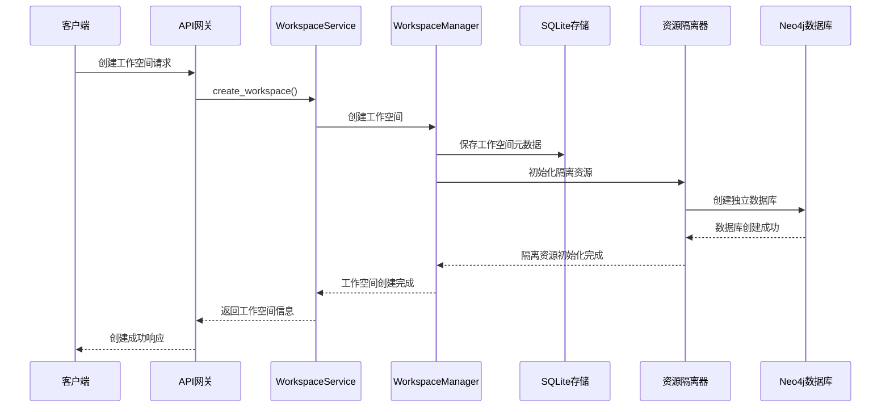
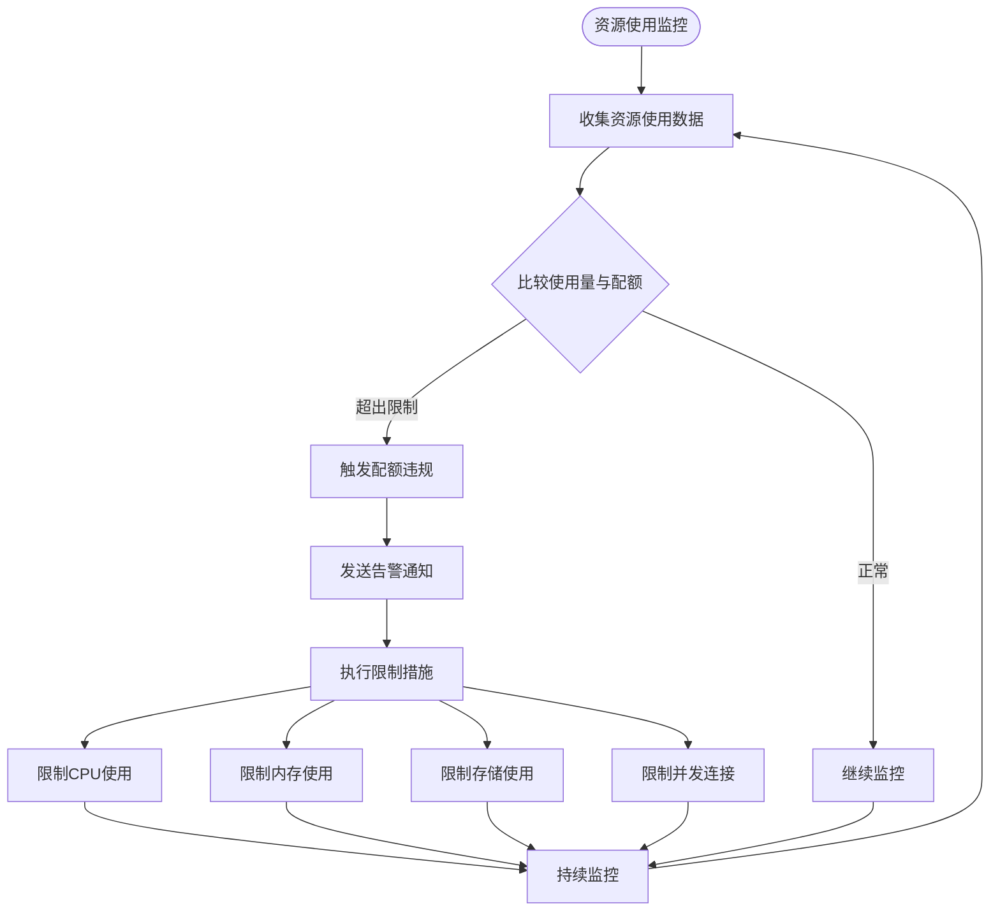
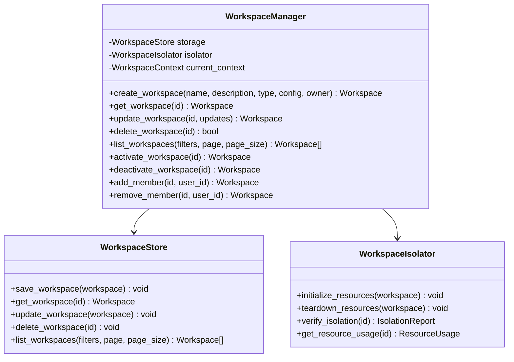
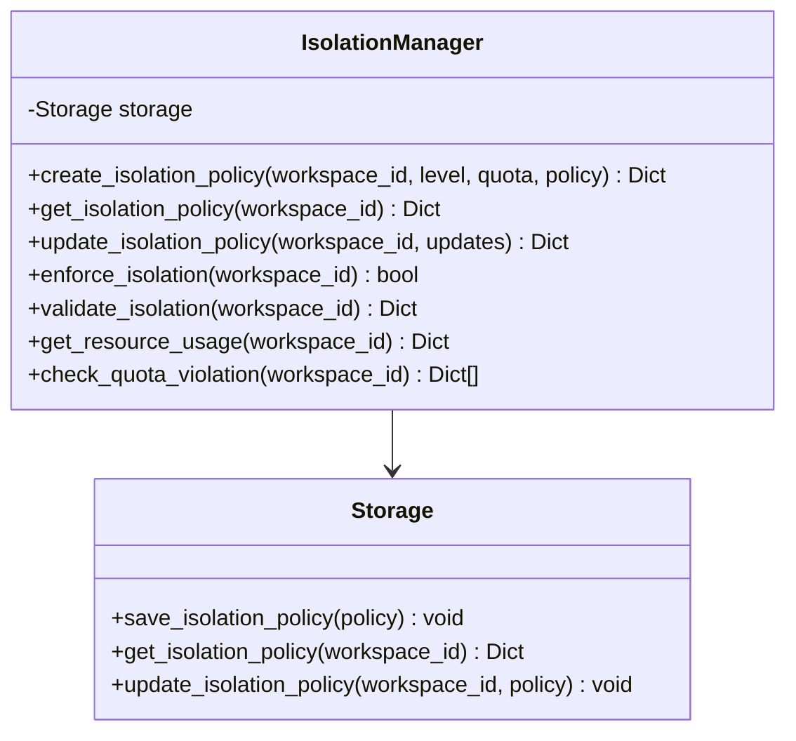
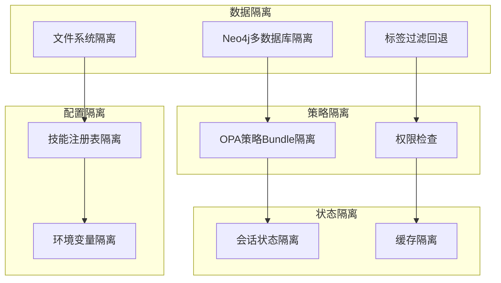
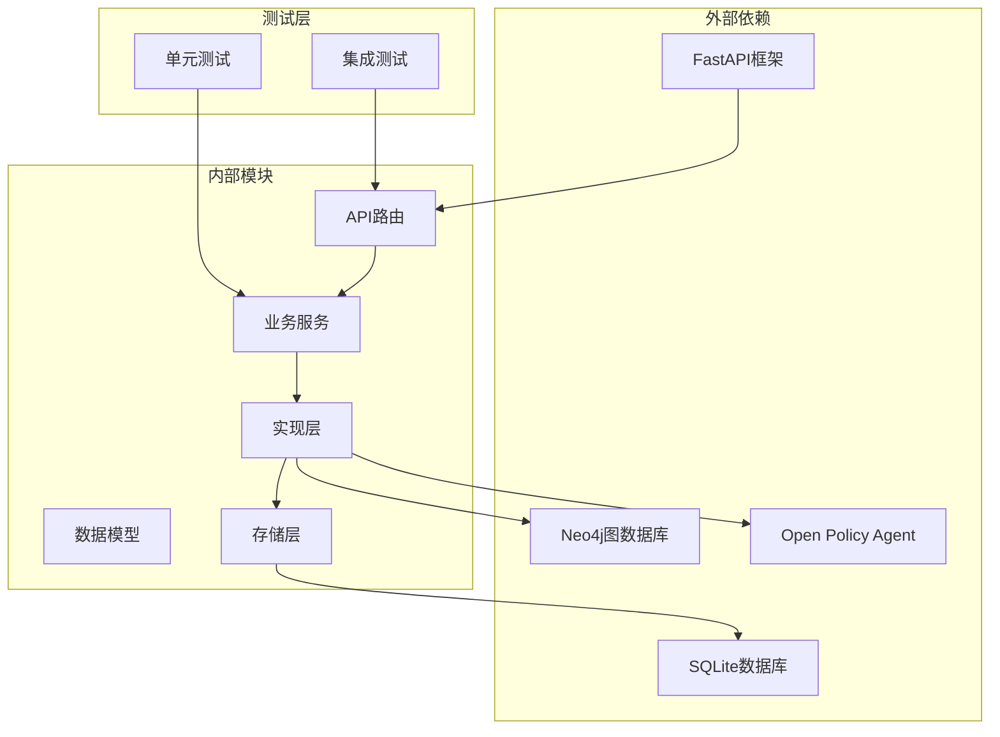

# 工作空间隔离系统

<cite>
**本文档引用的文件**
- [workspace.py](file://odap/biz/platform/workspace/models/workspace.py)
- [isolation.py](file://odap/biz/platform/workspace/impl/isolation.py)
- [sqlite_storage.py](file://odap/biz/platform/workspace/storage/sqlite_storage.py)
- [routes.py](file://odap/biz/platform/workspace/api/routes.py)
- [workspace_service.py](file://odap/biz/platform/workspace/services/workspace_service.py)
- [isolation_service.py](file://odap/biz/platform/workspace/services/isolation_service.py)
- [DESIGN.md](file://docs/03-modules/workspace/DESIGN.md)
- [ADR-041_workspace_resource_isolation.md](file://docs/07-adr/ADR-041_workspace_resource_isolation.md)
- [WorkspaceManager.tsx](file://frontend/src/modules/workspace/pages/WorkspaceManager.tsx)
- [WorkspaceSwitcher.tsx](file://frontend/src/modules/workspace/components/WorkspaceSwitcher.tsx)
- [test_workspace.py](file://tests/unit/test_workspace.py)
- [test_storage_layers.py](file://tests/unit/test_storage_layers.py)
</cite>

## 目录
1. [简介](#简介)
2. [项目结构](#项目结构)
3. [核心组件](#核心组件)
4. [架构概览](#架构概览)
5. [详细组件分析](#详细组件分析)
6. [依赖关系分析](#依赖关系分析)
7. [性能考虑](#性能考虑)
8. [故障排除指南](#故障排除指南)
9. [结论](#结论)
10. [附录](#附录)

## 简介

工作空间隔离系统是ODAP平台的核心基础设施，旨在为多场景并行提供完整的资源隔离解决方案。该系统通过4级隔离机制（low/standard/high/strict）确保不同业务场景间的本体、技能、策略和数据完全隔离，支持从开发测试到生产的全生命周期场景管理。

系统采用"混合隔离"策略，结合Neo4j多数据库隔离和标签过滤机制，既满足社区版的限制要求，又为生产环境升级预留了充分的扩展空间。通过工作空间管理模块，平台实现了从"战争分析专属系统"向"通用本体驱动平台"的演进。

## 项目结构

工作空间隔离系统采用分层架构设计，主要包含以下层次：



**图表来源**
- [DESIGN.md:25-42](file://docs/03-modules/workspace/DESIGN.md#L25-L42)
- [routes.py:20-28](file://odap/biz/platform/workspace/api/routes.py#L20-L28)

**章节来源**
- [DESIGN.md:1-659](file://docs/03-modules/workspace/DESIGN.md#L1-L659)

## 核心组件

### 工作空间模型

工作空间是场景隔离的基本单元，包含完整的元数据和配置信息：



**图表来源**
- [workspace.py:10-52](file://odap/biz/platform/workspace/models/workspace.py#L10-L52)

### 隔离级别定义

系统支持四种隔离级别，每种级别对应不同的安全强度和资源配置：

| 隔离级别 | CPU限制 | 内存限制 | 存储限制 | 网络策略 | 适用场景 |
|---------|---------|---------|---------|---------|---------|
| low | 1核/2GB | 2核/4GB | 10GB | 允许所有IP | 开发测试环境 |
| standard | 2核/4GB | 4核/8GB | 50GB | 白名单IP | 预生产环境 |
| high | 4核/8GB | 8核/16GB | 200GB | 严格ACL | 生产环境 |
| strict | 8核/16GB | 16核/32GB | 500GB | 最小权限 | 敏感数据处理 |

**章节来源**
- [workspace.py:27-52](file://odap/biz/platform/workspace/models/workspace.py#L27-L52)
- [isolation.py:15-48](file://odap/biz/platform/workspace/impl/isolation.py#L15-L48)

## 架构概览

工作空间隔离系统采用"混合隔离"策略，结合Neo4j多数据库隔离和标签过滤机制：



**图表来源**
- [DESIGN.md:142-160](file://docs/03-modules/workspace/DESIGN.md#L142-L160)
- [routes.py:32-47](file://odap/biz/platform/workspace/api/routes.py#L32-L47)

### 资源配额管理

系统提供全面的资源配额管理机制，包括CPU、内存、存储和并发连接的限制：



**图表来源**
- [isolation.py:95-112](file://odap/biz/platform/workspace/impl/isolation.py#L95-L112)

**章节来源**
- [isolation.py:82-112](file://odap/biz/platform/workspace/impl/isolation.py#L82-L112)

## 详细组件分析

### 工作空间管理器

工作空间管理器是系统的核心协调者，负责工作空间的完整生命周期管理：



**图表来源**
- [DESIGN.md:126-190](file://docs/03-modules/workspace/DESIGN.md#L126-L190)

### 隔离管理器

隔离管理器专门负责资源隔离策略的实施和监控：



**图表来源**
- [isolation.py:9-62](file://odap/biz/platform/workspace/impl/isolation.py#L9-L62)

**章节来源**
- [isolation.py:9-112](file://odap/biz/platform/workspace/impl/isolation.py#L9-L112)

### 场景隔离实现

系统通过多种机制实现场景隔离，确保不同工作空间间的完全独立：



**图表来源**
- [ADR-041_workspace_resource_isolation.md:46-64](file://docs/07-adr/ADR-041_workspace_resource_isolation.md#L46-L64)

**章节来源**
- [ADR-041_workspace_resource_isolation.md:1-115](file://docs/07-adr/ADR-041_workspace_resource_isolation.md#L1-L115)

### API接口设计

系统提供完整的REST API接口，支持工作空间的全生命周期管理：

| HTTP方法 | 路径 | 功能描述 | 权限要求 |
|---------|------|---------|---------|
| GET | `/api/workspaces` | 列出工作空间 | workspace:list |
| POST | `/api/workspaces` | 创建工作空间 | workspace:create |
| GET | `/api/workspaces/{id}` | 获取工作空间详情 | workspace:read |
| PUT | `/api/workspaces/{id}` | 更新工作空间 | workspace:update |
| DELETE | `/api/workspaces/{id}` | 删除工作空间 | workspace:delete |
| POST | `/api/workspaces/{id}/activate` | 激活工作空间 | workspace:activate |
| POST | `/api/workspaces/{id}/deactivate` | 停用工作空间 | workspace:deactivate |
| POST | `/api/workspaces/{id}/switch` | 切换工作空间 | workspace:switch |
| GET | `/api/workspaces/{id}/usage` | 获取资源使用情况 | workspace:read |
| POST | `/api/workspaces/{id}/export` | 导出工作空间 | workspace:export |
| POST | `/api/workspaces/import` | 导入工作空间 | workspace:import |

**章节来源**
- [routes.py:32-124](file://odap/biz/platform/workspace/api/routes.py#L32-L124)

## 依赖关系分析

工作空间隔离系统具有清晰的依赖层次结构：



**图表来源**
- [routes.py:3-18](file://odap/biz/platform/workspace/api/routes.py#L3-L18)

**章节来源**
- [test_workspace.py:137-255](file://tests/unit/test_workspace.py#L137-L255)
- [test_storage_layers.py:64-73](file://tests/unit/test_storage_layers.py#L64-L73)

## 性能考虑

系统在设计时充分考虑了性能优化：

### 资源隔离性能指标

| 指标 | 目标值 | 实现策略 |
|------|--------|---------|
| 工作空间创建时间 | < 5秒 | 异步资源初始化 |
| 工作空间切换时间 | < 2秒 | 上下文缓存机制 |
| 导出数据量(10K节点) | < 30秒 | 流式导出和增量打包 |
| 导入数据量(10K节点) | < 60秒 | 批量写入和事务提交 |

### 隔离策略性能影响

系统采用"混合隔离"策略，在保证安全性的同时优化性能：

- **Neo4j多数据库隔离**：提供最强的安全性，但数据库数量有限制
- **标签过滤回退**：在社区版环境下提供灵活的隔离方案
- **动态策略切换**：支持从标签隔离平滑升级到数据库隔离

**章节来源**
- [DESIGN.md:609-617](file://docs/03-modules/workspace/DESIGN.md#L609-L617)
- [ADR-041_workspace_resource_isolation.md:66-80](file://docs/07-adr/ADR-041_workspace_resource_isolation.md#L66-L80)

## 故障排除指南

### 常见问题及解决方案

#### 工作空间创建失败

**症状**：创建工作空间时抛出异常
**原因**：资源初始化失败或数据库连接问题
**解决方案**：
1. 检查Neo4j数据库连接状态
2. 验证OPA策略引擎可用性
3. 确认文件系统权限
4. 查看审计日志获取详细错误信息

#### 隔离验证失败

**症状**：隔离验证返回错误状态
**原因**：跨空间数据访问或配置错误
**解决方案**：
1. 检查工作空间ID过滤条件
2. 验证OPA策略Bundle路径
3. 确认技能注册表作用域
4. 执行一致性检查

#### 资源配额超限

**症状**：工作空间操作被拒绝
**原因**：CPU、内存或存储使用超过配额
**解决方案**：
1. 监控资源使用情况
2. 调整工作空间配额
3. 优化应用程序性能
4. 清理不必要的数据

**章节来源**
- [isolation.py:64-80](file://odap/biz/platform/workspace/impl/isolation.py#L64-L80)
- [workspace_service.py:166-201](file://odap/biz/platform/workspace/services/workspace_service.py#L166-L201)

## 结论

工作空间隔离系统通过精心设计的4级隔离机制和混合隔离策略，为ODAP平台提供了强大而灵活的多场景隔离能力。系统不仅满足了当前的功能需求，还为未来的扩展和升级预留了充足的空间。

关键优势包括：
- **完整的隔离保障**：数据、策略、配置和状态层面的全面隔离
- **灵活的部署选项**：支持从开发到生产的全生命周期场景
- **完善的监控机制**：实时资源使用监控和配额管理
- **友好的用户体验**：直观的前端界面和丰富的API接口

通过持续的优化和改进，该系统将继续支撑ODAP平台向更广泛的本体驱动应用场景扩展。

## 附录

### 配置示例

#### 开发环境配置
```yaml
# 开发环境工作空间配置
workspace:
  isolation_level: low
  resource_quota:
    cpu: "1"
    memory: "2Gi"
    storage: "10Gi"
    connections: 50
  network_policy:
    allowed_ips: ["0.0.0.0/0"]
```

#### 生产环境配置
```yaml
# 生产环境工作空间配置
workspace:
  isolation_level: strict
  resource_quota:
    cpu: "8"
    memory: "16Gi"
    storage: "500Gi"
    connections: 200
  network_policy:
    allowed_ips: ["10.0.0.0/8", "172.16.0.0/12", "192.168.0.0/16"]
```

### 使用场景最佳实践

#### 开发测试环境
- 使用low隔离级别，提供充足的资源
- 允许所有IP访问，便于开发调试
- 定期清理测试数据，避免资源浪费

#### 预生产环境  
- 使用standard隔离级别，平衡安全性和性能
- 配置严格的IP白名单
- 实施资源监控和告警机制

#### 生产环境
- 使用strict隔离级别，确保最高安全性
- 实施最小权限原则
- 建立完善的备份和恢复机制

**章节来源**
- [DESIGN.md:473-491](file://docs/03-modules/workspace/DESIGN.md#L473-L491)