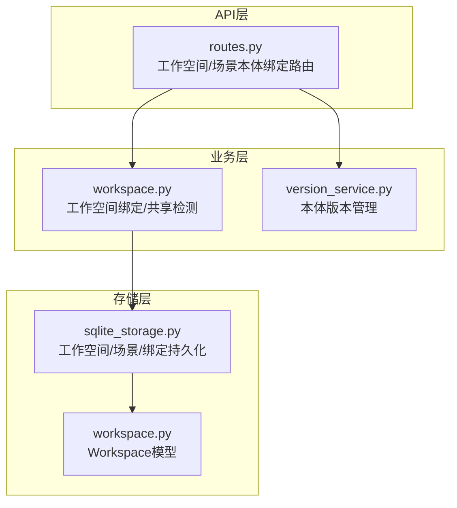
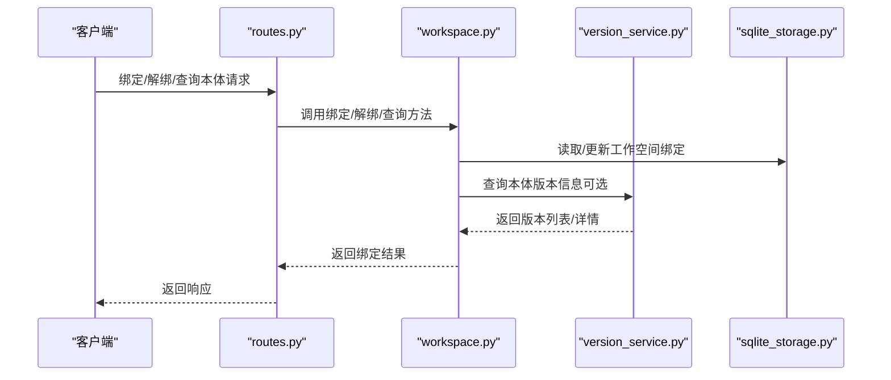
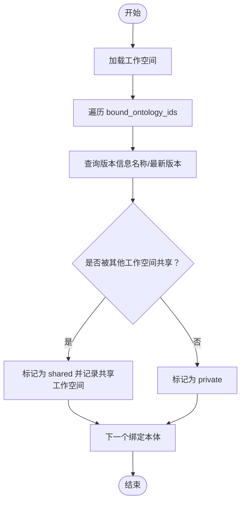
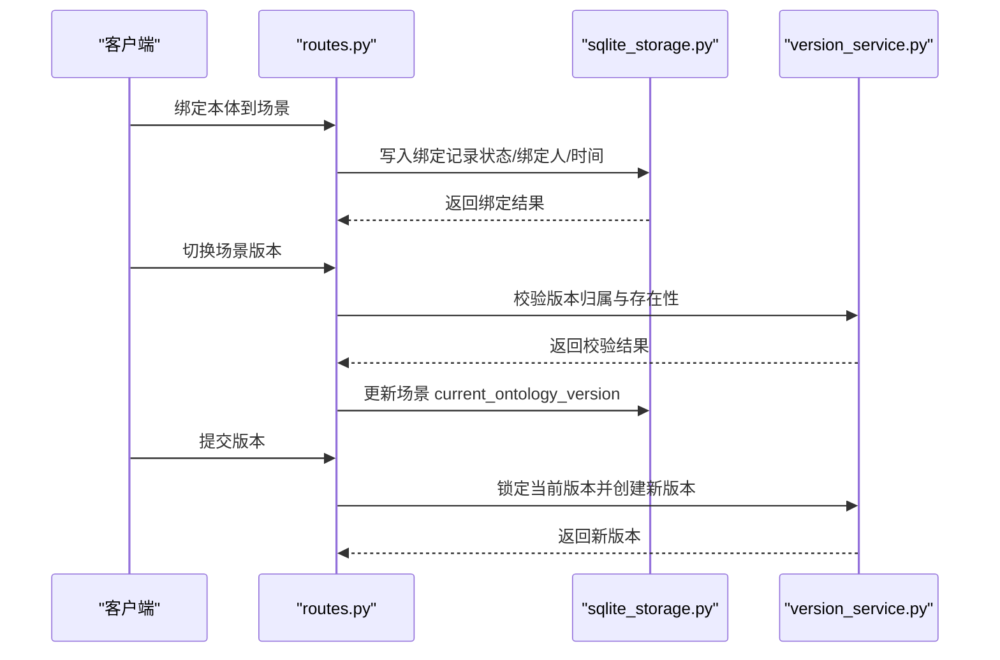
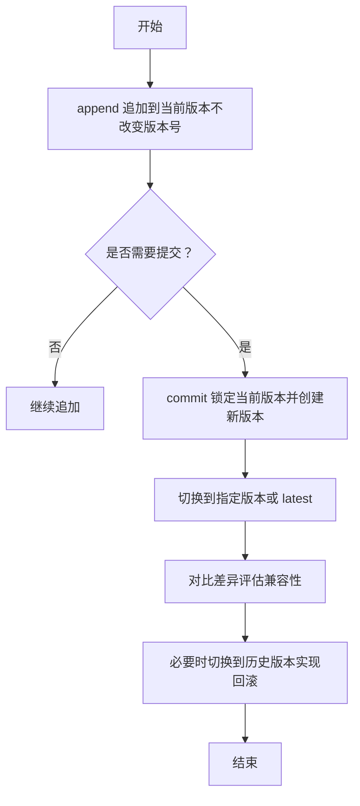
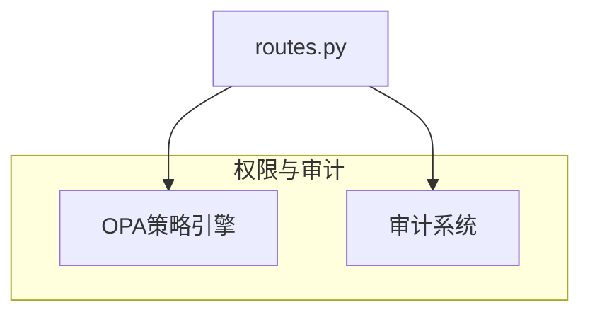
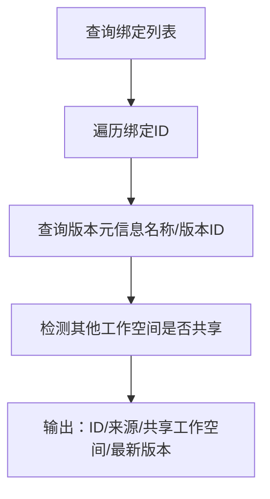
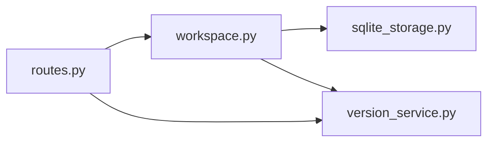

# 本体绑定管理

<cite>
**本文引用的文件**
- [workspace.py](file://odap/biz/platform/workspace/impl/workspace.py)
- [routes.py](file://odap/biz/platform/workspace/api/routes.py)
- [version_service.py](file://odap/biz/core/ontology/services/version_service.py)
- [sqlite_storage.py](file://odap/biz/platform/workspace/storage/sqlite_storage.py)
- [workspace.py](file://odap/biz/platform/workspace/models/workspace.py)
- [ARCHITECTURE_FULL_CHAIN_DEEP.md](file://docs/02-architecture/ARCHITECTURE_FULL_CHAIN_DEEP.md)
- [DESIGN.md](file://docs/03-modules/ontology/DESIGN.md)
- [ARCHITECTURE_FULL_CHAIN_DEEP.md](file://docs/02-architecture/ARCHITECTURE_FULL_CHAIN_DEEP.md)
- [ARCHITECTURE_FULL_CHAIN_DEEP.md](file://docs/02-architecture/ARCHITECTURE_FULL_CHAIN_DEEP.md)
</cite>

## 目录
1. [引言](#引言)
2. [项目结构](#项目结构)
3. [核心组件](#核心组件)
4. [架构总览](#架构总览)
5. [详细组件分析](#详细组件分析)
6. [依赖分析](#依赖分析)
7. [性能考虑](#性能考虑)
8. [故障排查指南](#故障排查指南)
9. [结论](#结论)
10. [附录](#附录)

## 引言
本文件面向“本体绑定管理”的技术文档，围绕工作空间与本体的绑定机制展开，覆盖私有本体绑定与共享本体绑定的差异与实现；阐述绑定生命周期（创建、状态管理、权限控制、解绑）、共享本体的发现与管理（跨工作空间共享、共享状态跟踪、冲突解决）、版本管理（兼容性检查、版本切换与回滚）、查询与检索（已绑定本体列表、共享状态查询、依赖关系分析），并结合实际应用场景（团队协作、项目管理、知识复用）给出落地建议。

## 项目结构
本体绑定管理涉及三层：API路由层、业务服务层、持久化存储层，并与本体版本管理协同工作。关键文件分布如下：
- API路由层：定义工作空间与场景相关的本体绑定接口
- 业务服务层：封装工作空间绑定、共享检测、场景绑定等业务逻辑
- 存储层：SQLite持久化工作空间、场景与绑定关系
- 版本管理：提供版本创建、切换、差异对比等能力

**图表来源**
- [routes.py:490-528](file://odap/biz/platform/workspace/api/routes.py#L490-L528)
- [workspace.py:115-167](file://odap/biz/platform/workspace/impl/workspace.py#L115-L167)
- [version_service.py:84-277](file://odap/biz/core/ontology/services/version_service.py#L84-L277)
- [sqlite_storage.py:159-200](file://odap/biz/platform/workspace/storage/sqlite_storage.py#L159-L200)
- [workspace.py:36-52](file://odap/biz/platform/workspace/models/workspace.py#L36-L52)

**章节来源**
- [routes.py:490-528](file://odap/biz/platform/workspace/api/routes.py#L490-L528)
- [workspace.py:115-167](file://odap/biz/platform/workspace/impl/workspace.py#L115-L167)
- [version_service.py:84-277](file://odap/biz/core/ontology/services/version_service.py#L84-L277)
- [sqlite_storage.py:159-200](file://odap/biz/platform/workspace/storage/sqlite_storage.py#L159-L200)
- [workspace.py:36-52](file://odap/biz/platform/workspace/models/workspace.py#L36-L52)

## 核心组件
- 工作空间绑定服务：提供绑定/解绑、共享检测、绑定列表查询等能力
- 场景绑定服务：提供场景维度的本体绑定、解绑、版本切换
- 版本管理服务：提供版本创建、锁定、切换、差异对比、历史查询
- SQLite存储：持久化工作空间、场景、绑定关系及绑定状态
- Workspace模型：定义工作空间字段（含 bound_ontology_ids）

**章节来源**
- [workspace.py:115-167](file://odap/biz/platform/workspace/impl/workspace.py#L115-L167)
- [version_service.py:84-277](file://odap/biz/core/ontology/services/version_service.py#L84-L277)
- [sqlite_storage.py:159-200](file://odap/biz/platform/workspace/storage/sqlite_storage.py#L159-L200)
- [workspace.py:36-52](file://odap/biz/platform/workspace/models/workspace.py#L36-L52)

## 架构总览
本体绑定管理在平台内的交互路径如下：
- API路由接收请求，调用业务服务
- 业务服务访问存储层进行持久化
- 版本管理服务提供版本能力支撑（如场景版本切换）
- 共享检测在工作空间绑定查询时进行，标注共享来源与共享范围

**图表来源**
- [routes.py:490-528](file://odap/biz/platform/workspace/api/routes.py#L490-L528)
- [workspace.py:115-167](file://odap/biz/platform/workspace/impl/workspace.py#L115-L167)
- [version_service.py:375-425](file://odap/biz/core/ontology/services/version_service.py#L375-L425)
- [sqlite_storage.py:159-200](file://odap/biz/platform/workspace/storage/sqlite_storage.py#L159-L200)

## 详细组件分析

### 工作空间绑定与共享检测
- 绑定/解绑：在工作空间模型的 bound_ontology_ids 中维护绑定集合，更新后持久化
- 共享检测：遍历所有工作空间，若其他工作空间也包含该本体ID，则标记为共享，并记录共享的工作空间名称
- 绑定列表：对每个绑定本体，尝试查询版本信息（名称、最新版本ID），并标注来源（private/shared）

**图表来源**
- [workspace.py:141-167](file://odap/biz/platform/workspace/impl/workspace.py#L141-L167)

**章节来源**
- [workspace.py:115-167](file://odap/biz/platform/workspace/impl/workspace.py#L115-L167)
- [workspace.py:47-47](file://odap/biz/platform/workspace/models/workspace.py#L47-L47)

### 场景绑定与版本切换
- 场景绑定：将本体绑定到场景，记录绑定状态、绑定人、绑定时间等
- 版本切换：支持切换到指定版本或 latest；校验版本归属与存在性
- 提交版本：手动提交当前版本，创建新版本并锁定旧版本

**图表来源**
- [routes.py:490-528](file://odap/biz/platform/workspace/api/routes.py#L490-L528)
- [routes.py:655-700](file://odap/biz/platform/workspace/api/routes.py#L655-L700)
- [routes.py:590-624](file://odap/biz/platform/workspace/api/routes.py#L590-L624)
- [sqlite_storage.py:598-655](file://odap/biz/platform/workspace/storage/sqlite_storage.py#L598-L655)
- [version_service.py:206-277](file://odap/biz/core/ontology/services/version_service.py#L206-L277)

**章节来源**
- [routes.py:490-528](file://odap/biz/platform/workspace/api/routes.py#L490-L528)
- [routes.py:655-700](file://odap/biz/platform/workspace/api/routes.py#L655-L700)
- [routes.py:590-624](file://odap/biz/platform/workspace/api/routes.py#L590-L624)
- [sqlite_storage.py:598-655](file://odap/biz/platform/workspace/storage/sqlite_storage.py#L598-L655)
- [version_service.py:206-277](file://odap/biz/core/ontology/services/version_service.py#L206-L277)

### 版本管理与兼容性
- 版本创建：支持追加（append）与提交（commit）两种模式；commit 会锁定当前版本并创建新版本
- 版本切换：通过场景绑定的 current_ontology_version 字段实现
- 兼容性检查：通过版本差异对比（entities/relations/events 的增删改）评估兼容性
- 回滚：通过切换到历史版本实现（不直接删除版本，而是切换到旧版本）

**图表来源**
- [version_service.py:152-277](file://odap/biz/core/ontology/services/version_service.py#L152-L277)
- [version_service.py:402-425](file://odap/biz/core/ontology/services/version_service.py#L402-L425)
- [routes.py:655-700](file://odap/biz/platform/workspace/api/routes.py#L655-L700)

**章节来源**
- [version_service.py:152-277](file://odap/biz/core/ontology/services/version_service.py#L152-L277)
- [version_service.py:402-425](file://odap/biz/core/ontology/services/version_service.py#L402-L425)
- [routes.py:655-700](file://odap/biz/platform/workspace/api/routes.py#L655-L700)

### 权限控制与审计
- 权限校验：平台采用 OPA（Open Policy Agent）进行权限校验，支持 ABAC 等策略
- 审计事件：与本体相关的创建、版本提交、回滚等事件纳入审计体系
- 场景与工作空间：API 路由中对场景所属工作空间进行校验，防止越权访问

**图表来源**
- [routes.py:490-528](file://odap/biz/platform/workspace/api/routes.py#L490-L528)
- [ARCHITECTURE_FULL_CHAIN_DEEP.md:3338-3427](file://docs/02-architecture/ARCHITECTURE_FULL_CHAIN_DEEP.md#L3338-L3427)
- [ARCHITECTURE_FULL_CHAIN_DEEP.md:1942-2156](file://docs/02-architecture/ARCHITECTURE_FULL_CHAIN_DEEP.md#L1942-L2156)

**章节来源**
- [routes.py:490-528](file://odap/biz/platform/workspace/api/routes.py#L490-L528)
- [ARCHITECTURE_FULL_CHAIN_DEEP.md:3338-3427](file://docs/02-architecture/ARCHITECTURE_FULL_CHAIN_DEEP.md#L3338-L3427)
- [ARCHITECTURE_FULL_CHAIN_DEEP.md:1942-2156](file://docs/02-architecture/ARCHITECTURE_FULL_CHAIN_DEEP.md#L1942-L2156)

### 查询与检索
- 已绑定本体列表：返回绑定ID、来源（private/shared）、共享工作空间列表、最新版本信息
- 共享状态查询：通过遍历其他工作空间的绑定集合判断共享
- 依赖关系分析：结合场景绑定与版本切换，分析场景对本体版本的依赖

**图表来源**
- [workspace.py:141-167](file://odap/biz/platform/workspace/impl/workspace.py#L141-L167)

**章节来源**
- [workspace.py:141-167](file://odap/biz/platform/workspace/impl/workspace.py#L141-L167)

## 依赖分析
- 组件耦合
  - API 路由依赖业务服务（工作空间/场景）
  - 业务服务依赖存储层（SQLite）
  - 场景版本切换依赖版本管理服务
- 外部依赖
  - OPA 权限校验
  - SQLite 数据库存储

**图表来源**
- [routes.py:490-528](file://odap/biz/platform/workspace/api/routes.py#L490-L528)
- [workspace.py:115-167](file://odap/biz/platform/workspace/impl/workspace.py#L115-L167)
- [sqlite_storage.py:159-200](file://odap/biz/platform/workspace/storage/sqlite_storage.py#L159-L200)
- [version_service.py:84-277](file://odap/biz/core/ontology/services/version_service.py#L84-L277)

**章节来源**
- [routes.py:490-528](file://odap/biz/platform/workspace/api/routes.py#L490-L528)
- [workspace.py:115-167](file://odap/biz/platform/workspace/impl/workspace.py#L115-L167)
- [sqlite_storage.py:159-200](file://odap/biz/platform/workspace/storage/sqlite_storage.py#L159-L200)
- [version_service.py:84-277](file://odap/biz/core/ontology/services/version_service.py#L84-L277)

## 性能考虑
- 绑定查询复杂度：对每个绑定本体查询版本信息，再遍历所有工作空间检测共享，整体复杂度与绑定数量和工作空间数量线性相关
- 存储优化：SQLite 表结构包含索引列（如绑定状态、绑定时间），可通过查询条件命中索引提升性能
- 版本对比：版本差异计算基于实体/关系集合差集，建议在大数据量场景下分页对比或增量对比

## 故障排查指南
- 绑定失败
  - 确认工作空间存在且状态正常
  - 检查本体ID有效性与版本存在性
- 共享检测异常
  - 核对其他工作空间的 bound_ontology_ids 是否正确同步
- 版本切换失败
  - 校验版本是否属于绑定的本体
  - 确认场景绑定状态为 active
- 权限问题
  - 检查 OPA 策略是否允许当前用户/角色执行相应操作
  - 查看审计日志定位拒绝原因

**章节来源**
- [routes.py:490-528](file://odap/biz/platform/workspace/api/routes.py#L490-L528)
- [routes.py:655-700](file://odap/biz/platform/workspace/api/routes.py#L655-L700)
- [ARCHITECTURE_FULL_CHAIN_DEEP.md:3338-3427](file://docs/02-architecture/ARCHITECTURE_FULL_CHAIN_DEEP.md#L3338-L3427)

## 结论
本体绑定管理以工作空间与场景为维度，结合 SQLite 存储与版本管理服务，实现了从绑定、共享检测、版本切换到权限控制的完整闭环。通过清晰的 API 路由与业务服务分离，既保证了功能的可扩展性，也为后续的审计与合规提供了基础。

## 附录
- 应用场景建议
  - 团队协作：通过共享检测与权限控制，实现跨团队的本体复用与访问隔离
  - 项目管理：以场景为单位绑定本体并切换版本，保障项目演进的可控性
  - 知识复用：通过共享本体与版本对比，降低重复建设成本，提升一致性