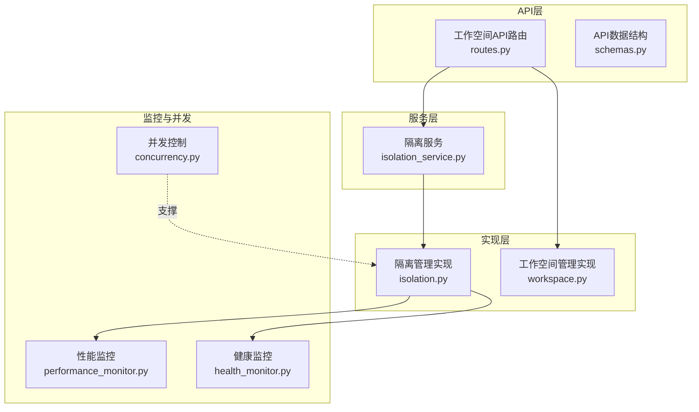
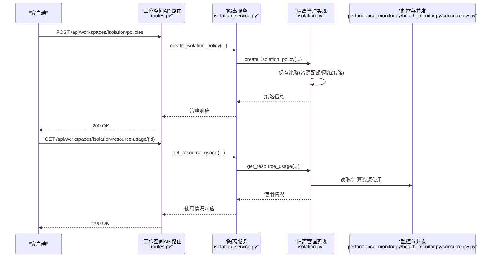
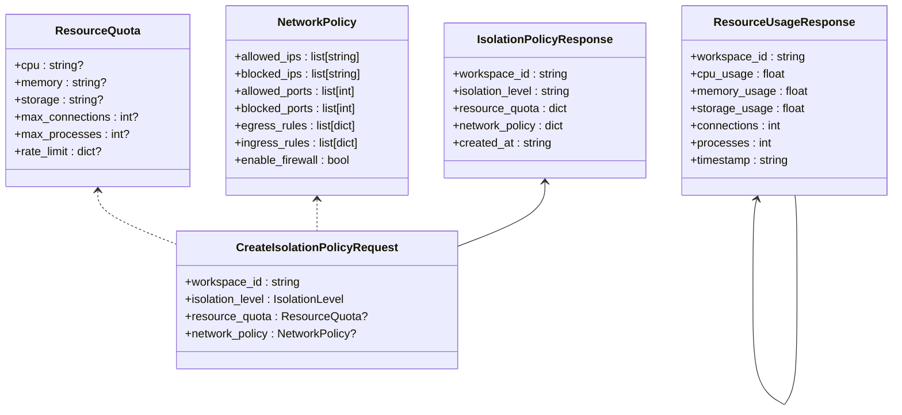
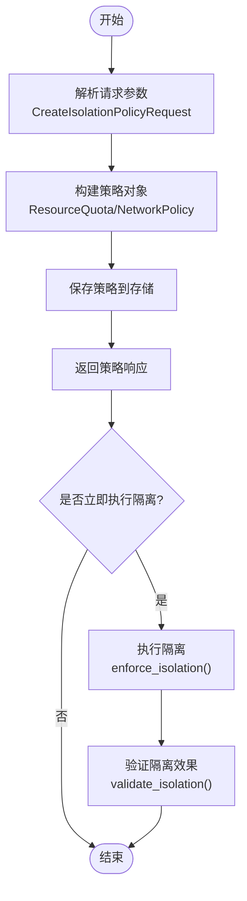
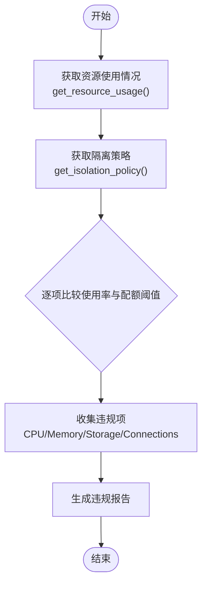
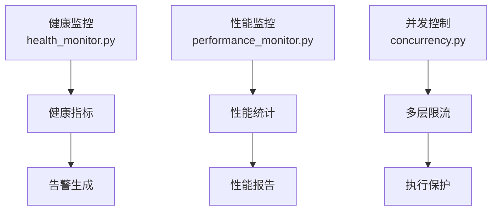
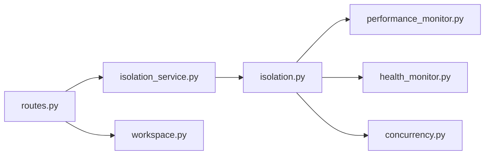

# 资源配额管理

<cite>
**本文档引用的文件**
- [isolation.py](file://odap/biz/platform/workspace/impl/isolation.py)
- [isolation_service.py](file://odap/biz/platform/workspace/services/isolation_service.py)
- [schemas.py](file://odap/biz/platform/workspace/api/schemas.py)
- [routes.py](file://odap/biz/platform/workspace/api/routes.py)
- [isolation.py](file://odap/biz/platform/workspace/models/isolation.py)
- [workspace.py](file://odap/biz/platform/workspace/impl/workspace.py)
- [DESIGN.md](file://docs/03-modules/workspace/DESIGN.md)
- [performance_monitor.py](file://odap/infra/monitoring/performance_monitor.py)
- [health_monitor.py](file://docs/03-modules/swarm_orchestrator/DESIGN.md)
- [concurrency.py](file://docs/02-architecture/ARCHITECTURE_FULL_CHAIN_DEEP.md)
- [test_workspace.py](file://tests/unit/test_workspace.py)
- [test_docker_sandbox_e2e.py](file://openharness/scripts/test_docker_sandbox_e2e.py)
- [docker_backend.py](file://openharness/tests/test_sandbox/test_docker_backend.py)
</cite>

## 目录
1. [引言](#引言)
2. [项目结构](#项目结构)
3. [核心组件](#核心组件)
4. [架构概览](#架构概览)
5. [详细组件分析](#详细组件分析)
6. [依赖关系分析](#依赖关系分析)
7. [性能考量](#性能考量)
8. [故障排查指南](#故障排查指南)
9. [结论](#结论)
10. [附录](#附录)

## 引言
本文件面向资源配额管理，系统性阐述ODAP平台在工作空间维度的资源配额定义、分类与实现，涵盖CPU配额、内存配额、存储配额与并发连接数配额的分配机制、动态调整策略与超额使用处理流程，并结合现有的健康监控、性能监控与并发控制能力，给出配额继承与覆盖规则、API接口设计与配置示例，帮助开发者与运维人员高效落地资源治理。

## 项目结构
资源配额管理主要分布在工作空间平台模块，涉及模型定义、API路由、服务层与实现层，以及监控与并发控制支撑能力：

- 模型与数据结构：定义资源配额、网络策略等数据模型
- API层：提供REST接口用于创建/查询/执行隔离策略与资源使用情况
- 服务层：封装隔离策略的业务逻辑
- 实现层：具体执行隔离策略与资源使用统计
- 监控与并发：健康监控、性能监控与并发控制作为配额治理的支撑能力

**图表来源**
- [routes.py:1-758](file://odap/biz/platform/workspace/api/routes.py#L1-L758)
- [schemas.py:1-270](file://odap/biz/platform/workspace/api/schemas.py#L1-L270)
- [isolation_service.py:1-122](file://odap/biz/platform/workspace/services/isolation_service.py#L1-L122)
- [isolation.py:1-112](file://odap/biz/platform/workspace/impl/isolation.py#L1-L112)
- [workspace.py:1-178](file://odap/biz/platform/workspace/impl/workspace.py#L1-L178)
- [performance_monitor.py:1-183](file://odap/infra/monitoring/performance_monitor.py#L1-L183)
- [health_monitor.py:783-1357](file://docs/03-modules/swarm_orchestrator/DESIGN.md#L783-L1357)
- [concurrency.py:3724-3836](file://docs/02-architecture/ARCHITECTURE_FULL_CHAIN_DEEP.md#L3724-L3836)

**章节来源**
- [DESIGN.md:1-659](file://docs/03-modules/workspace/DESIGN.md#L1-L659)
- [routes.py:1-758](file://odap/biz/platform/workspace/api/routes.py#L1-L758)
- [schemas.py:1-270](file://odap/biz/platform/workspace/api/schemas.py#L1-L270)

## 核心组件
- 资源配额模型：定义CPU、内存、存储、最大连接数、最大进程数等配额字段
- 隔离策略API：提供创建、查询、执行隔离策略与资源使用情况的REST接口
- 隔离服务：封装策略创建、执行、验证与配额违规检查
- 隔离管理实现：负责策略持久化、资源使用统计与违规检测
- 监控与并发支撑：健康监控、性能监控与并发控制为配额治理提供观测与保护

**章节来源**
- [isolation.py:1-112](file://odap/biz/platform/workspace/impl/isolation.py#L1-L112)
- [isolation_service.py:1-122](file://odap/biz/platform/workspace/services/isolation_service.py#L1-L122)
- [schemas.py:77-122](file://odap/biz/platform/workspace/api/schemas.py#L77-L122)
- [routes.py:182-236](file://odap/biz/platform/workspace/api/routes.py#L182-L236)

## 架构概览
资源配额管理在工作空间层面实施，通过隔离策略与API接口实现配额的生命周期管理，并与监控与并发控制协同，形成“观测-治理-防护”的闭环。

**图表来源**
- [routes.py:182-236](file://odap/biz/platform/workspace/api/routes.py#L182-L236)
- [isolation_service.py:14-105](file://odap/biz/platform/workspace/services/isolation_service.py#L14-L105)
- [isolation.py:15-93](file://odap/biz/platform/workspace/impl/isolation.py#L15-L93)
- [performance_monitor.py:1-183](file://odap/infra/monitoring/performance_monitor.py#L1-L183)
- [health_monitor.py:783-1357](file://docs/03-modules/swarm_orchestrator/DESIGN.md#L783-L1357)
- [concurrency.py:3724-3836](file://docs/02-architecture/ARCHITECTURE_FULL_CHAIN_DEEP.md#L3724-L3836)

## 详细组件分析

### 资源配额模型与API
- 资源配额字段：CPU、内存、存储、最大连接数、最大进程数、速率限制等
- 网络策略字段：允许/阻断IP、允许/阻断端口、入站/出站规则、防火墙开关等
- API接口：
  - 创建隔离策略：POST /api/workspaces/isolation/policies
  - 获取隔离策略：GET /api/workspaces/isolation/policies/{workspace_id}
  - 获取资源使用情况：GET /api/workspaces/isolation/resource-usage/{workspace_id}
  - 执行隔离：POST /api/workspaces/isolation/enforce/{workspace_id}

**图表来源**
- [schemas.py:77-122](file://odap/biz/platform/workspace/api/schemas.py#L77-L122)
- [isolation.py:16-35](file://odap/biz/platform/workspace/models/isolation.py#L16-L35)

**章节来源**
- [schemas.py:77-122](file://odap/biz/platform/workspace/api/schemas.py#L77-L122)
- [isolation.py:16-35](file://odap/biz/platform/workspace/models/isolation.py#L16-L35)
- [routes.py:182-236](file://odap/biz/platform/workspace/api/routes.py#L182-L236)

### 隔离策略创建与执行
- 创建流程：接收请求参数，构造策略对象，持久化到存储，返回策略信息
- 执行流程：根据策略对工作空间执行隔离，如网络隔离、资源限制等
- 验证流程：校验策略有效性与隔离效果

**图表来源**
- [isolation_service.py:14-83](file://odap/biz/platform/workspace/services/isolation_service.py#L14-L83)
- [isolation.py:15-62](file://odap/biz/platform/workspace/impl/isolation.py#L15-L62)

**章节来源**
- [isolation_service.py:14-83](file://odap/biz/platform/workspace/services/isolation_service.py#L14-L83)
- [isolation.py:15-62](file://odap/biz/platform/workspace/impl/isolation.py#L15-L62)

### 资源使用统计与配额违规检查
- 资源使用统计：返回CPU、内存、存储使用率、连接数、进程数等指标
- 配额违规检查：基于策略中的配额阈值与当前使用情况进行比对，输出违规列表

**图表来源**
- [isolation_service.py:96-121](file://odap/biz/platform/workspace/services/isolation_service.py#L96-L121)
- [isolation.py:82-112](file://odap/biz/platform/workspace/impl/isolation.py#L82-L112)

**章节来源**
- [isolation_service.py:96-121](file://odap/biz/platform/workspace/services/isolation_service.py#L96-L121)
- [isolation.py:82-112](file://odap/biz/platform/workspace/impl/isolation.py#L82-L112)
- [test_workspace.py:224-255](file://tests/unit/test_workspace.py#L224-L255)

### 监控与并发控制支撑
- 健康监控：系统资源（CPU/内存/磁盘）、外部依赖（Graphiti/OPA/模型API）、性能指标（任务成功率/执行时间/OODA循环时间）等
- 性能监控：LLM调用、数据库查询、API请求、工具执行等指标的统计与导出
- 并发控制：多层限流（单Skill并发、单工作空间并发、全局并发）与执行超时控制

**图表来源**
- [health_monitor.py:783-1357](file://docs/03-modules/swarm_orchestrator/DESIGN.md#L783-L1357)
- [performance_monitor.py:1-183](file://odap/infra/monitoring/performance_monitor.py#L1-L183)
- [concurrency.py:3724-3836](file://docs/02-architecture/ARCHITECTURE_FULL_CHAIN_DEEP.md#L3724-L3836)

**章节来源**
- [health_monitor.py:783-1357](file://docs/03-modules/swarm_orchestrator/DESIGN.md#L783-L1357)
- [performance_monitor.py:1-183](file://odap/infra/monitoring/performance_monitor.py#L1-L183)
- [concurrency.py:3724-3836](file://docs/02-architecture/ARCHITECTURE_FULL_CHAIN_DEEP.md#L3724-L3836)

### 资源配额的继承与覆盖规则
- 父工作空间到子工作空间的配额传递：当前设计未直接体现层级继承，建议在策略中引入“继承”字段或“模板”机制，实现从父工作空间继承默认配额
- 特殊场景下的配额调整：通过API动态更新隔离策略中的资源配额字段，支持临时提升或收紧
- 网络策略继承：允许在子工作空间覆盖父工作空间的网络策略，实现更细粒度的访问控制

[本节为概念性说明，不直接分析具体文件]

### 资源配额管理API接口文档
- 创建隔离策略
  - 方法：POST
  - 路径：/api/workspaces/isolation/policies
  - 请求体：CreateIsolationPolicyRequest
  - 响应体：IsolationPolicyResponse
- 获取隔离策略
  - 方法：GET
  - 路径：/api/workspaces/isolation/policies/{workspace_id}
  - 响应体：IsolationPolicyResponse
- 获取资源使用情况
  - 方法：GET
  - 路径：/api/workspaces/isolation/resource-usage/{workspace_id}
  - 响应体：ResourceUsageResponse
- 执行隔离
  - 方法：POST
  - 路径：/api/workspaces/isolation/enforce/{workspace_id}
  - 响应体：SuccessResponse

**章节来源**
- [routes.py:182-236](file://odap/biz/platform/workspace/api/routes.py#L182-L236)
- [schemas.py:96-122](file://odap/biz/platform/workspace/api/schemas.py#L96-L122)

### 配置示例与使用场景
- CPU与内存配额：通过ResourceQuota的cpu与memory字段设置，结合容器/沙箱资源限制实现
- 存储配额：通过storage字段设置，配合存储用量统计进行监控
- 并发连接数配额：通过max_connections字段设置，结合并发控制与健康监控进行治理
- 速率限制：通过rate_limit字段设置，结合网关限流与并发控制实现

**章节来源**
- [schemas.py:77-85](file://odap/biz/platform/workspace/api/schemas.py#L77-L85)
- [docker_backend.py:160-181](file://openharness/tests/test_sandbox/test_docker_backend.py#L160-L181)
- [test_docker_sandbox_e2e.py:463-513](file://openharness/scripts/test_docker_sandbox_e2e.py#L463-L513)

## 依赖关系分析
- API路由依赖隔离服务，隔离服务依赖隔离管理实现
- 隔离管理实现依赖监控与并发控制能力
- 工作空间管理实现与隔离策略协同，支持本体绑定等场景

**图表来源**
- [routes.py:1-758](file://odap/biz/platform/workspace/api/routes.py#L1-L758)
- [isolation_service.py:1-122](file://odap/biz/platform/workspace/services/isolation_service.py#L1-L122)
- [isolation.py:1-112](file://odap/biz/platform/workspace/impl/isolation.py#L1-L112)
- [workspace.py:1-178](file://odap/biz/platform/workspace/impl/workspace.py#L1-L178)
- [performance_monitor.py:1-183](file://odap/infra/monitoring/performance_monitor.py#L1-L183)
- [health_monitor.py:783-1357](file://docs/03-modules/swarm_orchestrator/DESIGN.md#L783-L1357)
- [concurrency.py:3724-3836](file://docs/02-architecture/ARCHITECTURE_FULL_CHAIN_DEEP.md#L3724-L3836)

**章节来源**
- [routes.py:1-758](file://odap/biz/platform/workspace/api/routes.py#L1-L758)
- [isolation_service.py:1-122](file://odap/biz/platform/workspace/services/isolation_service.py#L1-L122)
- [isolation.py:1-112](file://odap/biz/platform/workspace/impl/isolation.py#L1-L112)
- [workspace.py:1-178](file://odap/biz/platform/workspace/impl/workspace.py#L1-L178)

## 性能考量
- 资源配额治理的性能开销：监控与并发控制应避免成为性能瓶颈，建议合理设置采样频率与历史窗口
- 隔离策略的执行成本：策略变更与执行应异步化，避免阻塞关键路径
- 告警风暴防护：健康监控与并发控制应具备去抖动与分级告警能力

[本节提供一般性指导，不直接分析具体文件]

## 故障排查指南
- 隔离策略未生效
  - 检查策略创建与执行流程，确认返回状态与消息
  - 验证隔离验证接口返回的隔离级别与策略内容
- 资源使用统计异常
  - 对比资源使用接口返回与监控系统的统计数据
  - 检查测试用例中的期望值与实际值
- 并发控制触发限流
  - 检查并发控制配置与当前活跃执行数
  - 关注执行超时与冷却时间设置

**章节来源**
- [isolation_service.py:70-94](file://odap/biz/platform/workspace/services/isolation_service.py#L70-L94)
- [isolation.py:64-80](file://odap/biz/platform/workspace/impl/isolation.py#L64-L80)
- [test_workspace.py:224-255](file://tests/unit/test_workspace.py#L224-L255)
- [concurrency.py:3724-3836](file://docs/02-architecture/ARCHITECTURE_FULL_CHAIN_DEEP.md#L3724-L3836)

## 结论
资源配额管理在ODAP平台以工作空间为边界，通过隔离策略与API实现完整的配额生命周期管理。结合健康监控、性能监控与并发控制，形成了可观测、可治理、可防护的资源治理体系。建议后续完善配额继承与覆盖机制，并持续优化监控与并发控制策略，以满足多场景下的资源治理需求。

## 附录
- 相关设计文档与ADR
  - 工作空间资源隔离设计（ADR-041）
  - 工作空间管理模块设计（DESIGN.md）
  - 技术架构与并发控制（ARCHITECTURE_FULL_CHAIN_DEEP.md）

**章节来源**
- [DESIGN.md:1-659](file://docs/03-modules/workspace/DESIGN.md#L1-L659)
- [ADR-041_workspace_resource_isolation.md:1-115](file://docs/07-adr/ADR-041_workspace_resource_isolation.md#L1-L115)
- [concurrency.py:3724-3836](file://docs/02-architecture/ARCHITECTURE_FULL_CHAIN_DEEP.md#L3724-L3836)