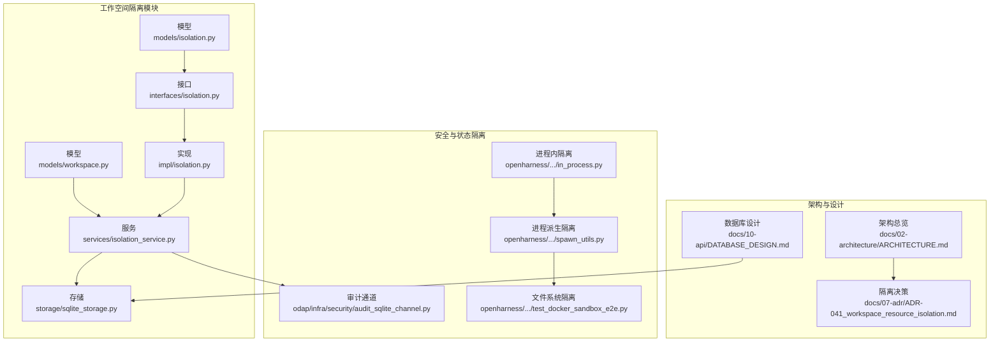
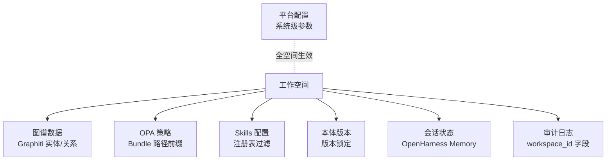
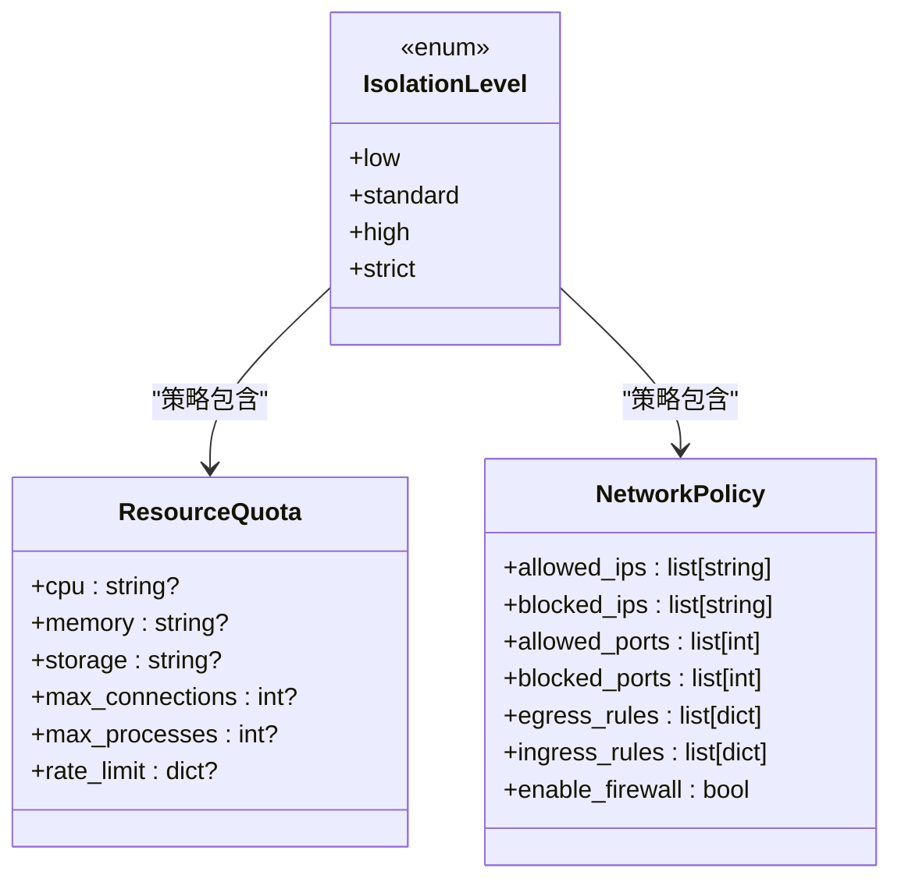
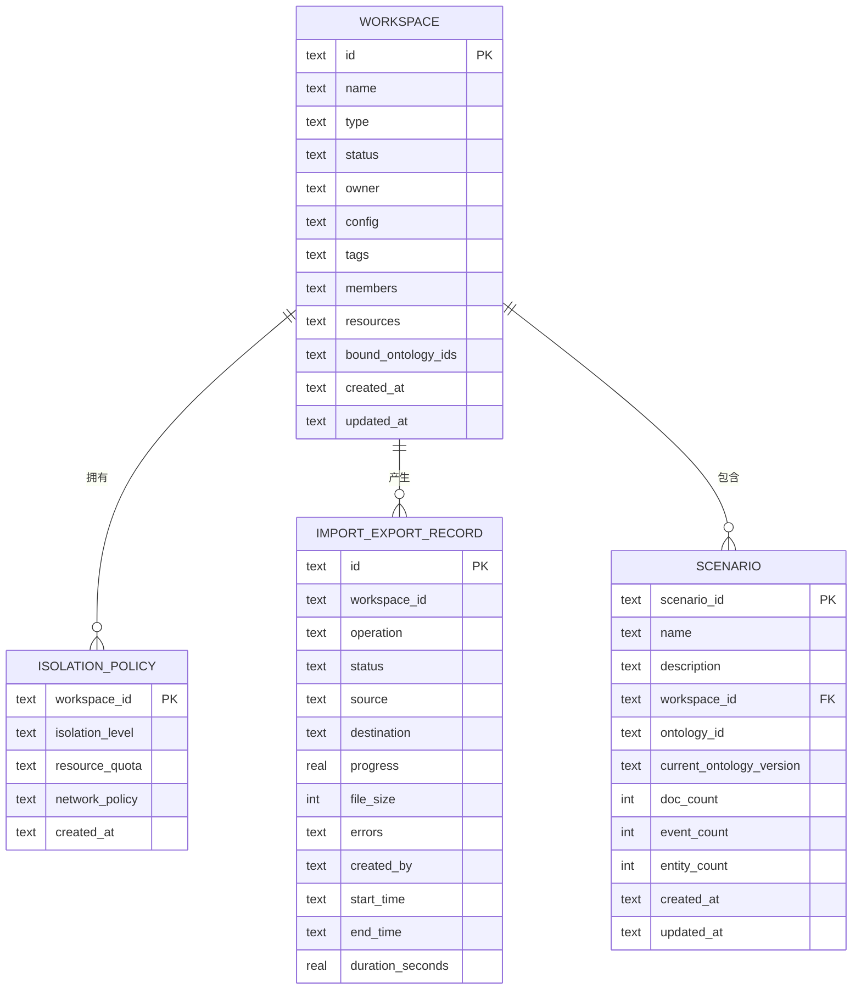
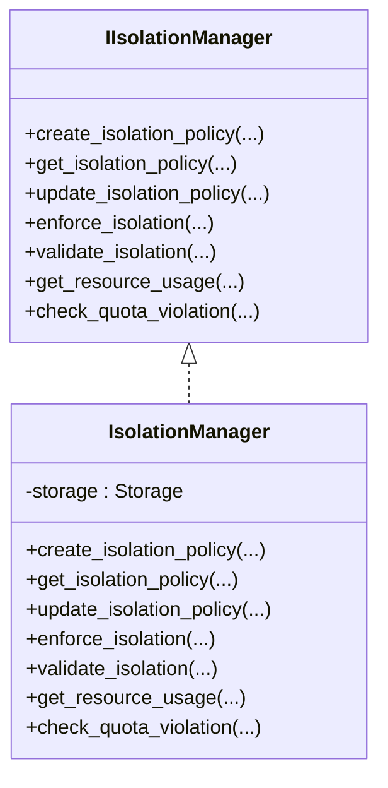
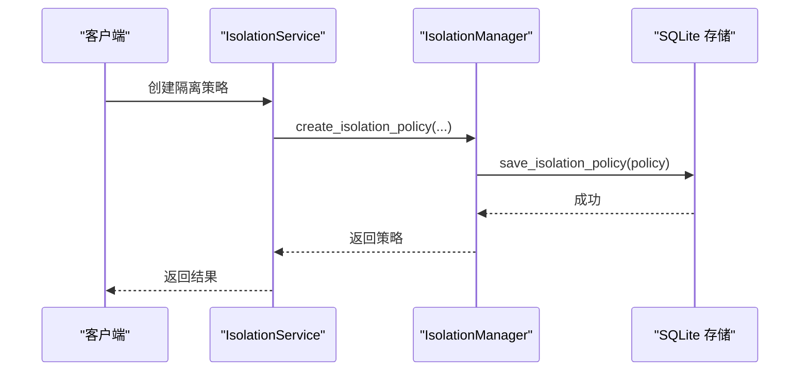
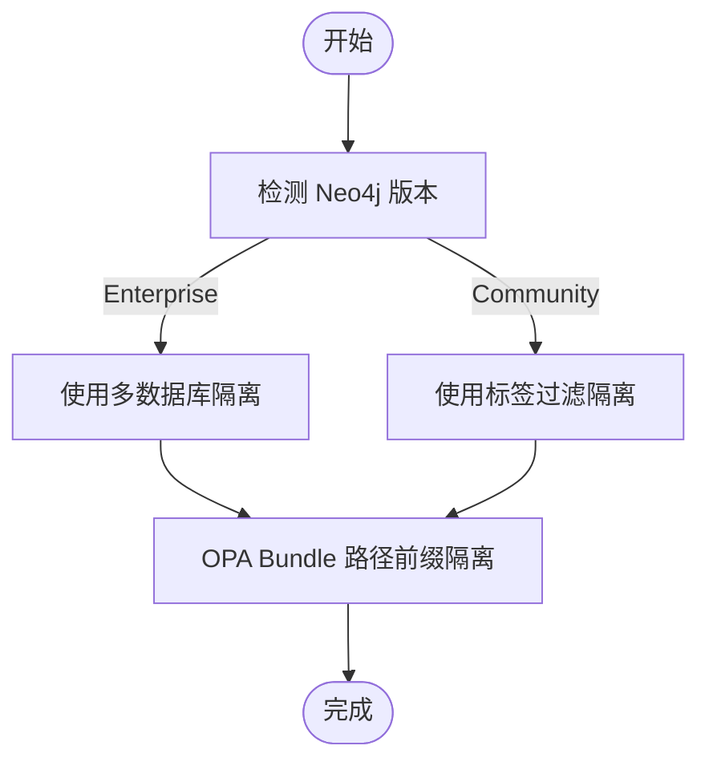
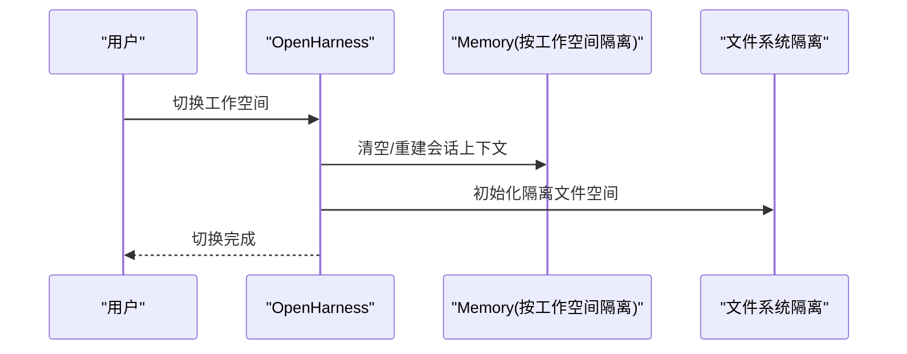
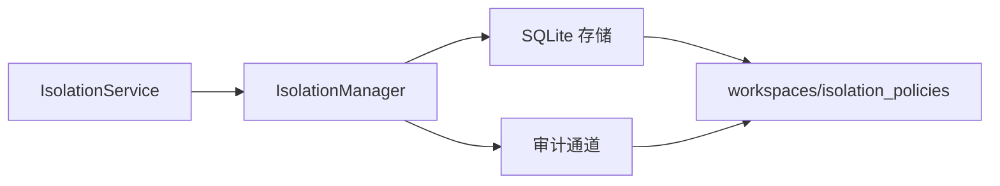

# 隔离机制设计

<cite>
**本文引用的文件**
- [isolation.py](file://odap/biz/platform/workspace/models/isolation.py)
- [workspace.py](file://odap/biz/platform/workspace/models/workspace.py)
- [isolation.py](file://odap/biz/platform/workspace/interfaces/isolation.py)
- [isolation.py](file://odap/biz/platform/workspace/impl/isolation.py)
- [isolation_service.py](file://odap/biz/platform/workspace/services/isolation_service.py)
- [sqlite_storage.py](file://odap/biz/platform/workspace/storage/sqlite_storage.py)
- [DATABASE_DESIGN.md](file://docs/10-api/DATABASE_DESIGN.md)
- [ARCHITECTURE.md](file://docs/02-architecture/ARCHITECTURE.md)
- [ADR-041_workspace_resource_isolation.md](file://docs/07-adr/ADR-041_workspace_resource_isolation.md)
- [test_workspace.py](file://tests/unit/test_workspace.py)
- [test_storage_layers.py](file://tests/unit/test_storage_layers.py)
- [audit_sqlite_channel.py](file://odap/infra/security/audit_sqlite_channel.py)
- [in_process.py](file://openharness/src/openharness/swarm/in_process.py)
- [spawn_utils.py](file://openharness/src/openharness/swarm/spawn_utils.py)
- [test_docker_sandbox_e2e.py](file://openharness/scripts/test_docker_sandbox_e2e.py)
</cite>

## 目录
1. [简介](#简介)
2. [项目结构](#项目结构)
3. [核心组件](#核心组件)
4. [架构总览](#架构总览)
5. [详细组件分析](#详细组件分析)
6. [依赖分析](#依赖分析)
7. [性能考虑](#性能考虑)
8. [故障排查指南](#故障排查指南)
9. [结论](#结论)
10. [附录](#附录)

## 简介
本文件面向“隔离机制设计”，围绕工作空间的4级隔离（low/standard/high/strict）进行系统化技术说明，涵盖隔离级别定义、技术实现、安全边界、数据隔离（数据库/文件系统/内存）、配置隔离（继承/覆盖/优先级）、状态隔离（会话/缓存/临时文件），并提供选择指南与最佳实践。

## 项目结构
隔离机制在 ODAP 平台中由“模型-接口-实现-服务-存储”五层协同完成，并与架构文档、数据库设计、安全审计等模块形成跨层协作。

**图示来源**
- [isolation.py:1-35](file://odap/biz/platform/workspace/models/isolation.py#L1-L35)
- [workspace.py:1-52](file://odap/biz/platform/workspace/models/workspace.py#L1-L52)
- [isolation.py:1-102](file://odap/biz/platform/workspace/interfaces/isolation.py#L1-L102)
- [isolation.py:1-112](file://odap/biz/platform/workspace/impl/isolation.py#L1-L112)
- [isolation_service.py:1-122](file://odap/biz/platform/workspace/services/isolation_service.py#L1-L122)
- [sqlite_storage.py:39-320](file://odap/biz/platform/workspace/storage/sqlite_storage.py#L39-L320)
- [ARCHITECTURE.md:248-260](file://docs/02-architecture/ARCHITECTURE.md#L248-L260)
- [DATABASE_DESIGN.md:42-140](file://docs/10-api/DATABASE_DESIGN.md#L42-L140)
- [ADR-041_workspace_resource_isolation.md:1-115](file://docs/07-adr/ADR-041_workspace_resource_isolation.md#L1-L115)
- [audit_sqlite_channel.py:84-117](file://odap/infra/security/audit_sqlite_channel.py#L84-L117)
- [in_process.py:105-146](file://openharness/src/openharness/swarm/in_process.py#L105-L146)
- [spawn_utils.py:35-175](file://openharness/src/openharness/swarm/spawn_utils.py#L35-L175)
- [test_docker_sandbox_e2e.py:287-325](file://openharness/scripts/test_docker_sandbox_e2e.py#L287-L325)

**章节来源**
- [isolation.py:1-35](file://odap/biz/platform/workspace/models/isolation.py#L1-L35)
- [workspace.py:1-52](file://odap/biz/platform/workspace/models/workspace.py#L1-L52)
- [isolation.py:1-102](file://odap/biz/platform/workspace/interfaces/isolation.py#L1-L102)
- [isolation.py:1-112](file://odap/biz/platform/workspace/impl/isolation.py#L1-L112)
- [isolation_service.py:1-122](file://odap/biz/platform/workspace/services/isolation_service.py#L1-L122)
- [sqlite_storage.py:39-320](file://odap/biz/platform/workspace/storage/sqlite_storage.py#L39-L320)
- [ARCHITECTURE.md:248-260](file://docs/02-architecture/ARCHITECTURE.md#L248-L260)
- [DATABASE_DESIGN.md:42-140](file://docs/10-api/DATABASE_DESIGN.md#L42-L140)
- [ADR-041_workspace_resource_isolation.md:1-115](file://docs/07-adr/ADR-041_workspace_resource_isolation.md#L1-L115)
- [audit_sqlite_channel.py:84-117](file://odap/infra/security/audit_sqlite_channel.py#L84-L117)
- [in_process.py:105-146](file://openharness/src/openharness/swarm/in_process.py#L105-L146)
- [spawn_utils.py:35-175](file://openharness/src/openharness/swarm/spawn_utils.py#L35-L175)
- [test_docker_sandbox_e2e.py:287-325](file://openharness/scripts/test_docker_sandbox_e2e.py#L287-L325)

## 核心组件
- 隔离级别与策略模型
  - 隔离级别枚举：low/standard/high/strict
  - 资源配额：CPU/内存/存储/连接数/进程数/速率限制
  - 网络策略：允许/阻断IP/端口、出入站规则、防火墙开关
- 工作空间配置模型
  - WorkspaceConfig：包含隔离级别、资源配额、网络策略、环境变量、特性开关
- 隔离管理接口与实现
  - IIsolationManager：定义创建/获取/更新/强制/验证/资源使用/配额检查等方法
  - IsolationManager：基于存储实现具体逻辑
- 隔离服务
  - IsolationService：对外暴露统一的隔离策略管理与校验接口
- 存储层
  - SQLite 表：workspaces、isolation_policies、import_export_records、scenarios
- 审计与状态隔离
  - 审计通道：按工作空间字段隔离审计事件
  - 进程内/进程派生/文件系统隔离：OpenHarness 提供的多维隔离

**章节来源**
- [isolation.py:8-35](file://odap/biz/platform/workspace/models/isolation.py#L8-L35)
- [workspace.py:27-33](file://odap/biz/platform/workspace/models/workspace.py#L27-L33)
- [isolation.py:8-102](file://odap/biz/platform/workspace/interfaces/isolation.py#L8-L102)
- [isolation.py:9-112](file://odap/biz/platform/workspace/impl/isolation.py#L9-L112)
- [isolation_service.py:8-122](file://odap/biz/platform/workspace/services/isolation_service.py#L8-L122)
- [sqlite_storage.py:39-320](file://odap/biz/platform/workspace/storage/sqlite_storage.py#L39-L320)
- [audit_sqlite_channel.py:84-117](file://odap/infra/security/audit_sqlite_channel.py#L84-L117)
- [in_process.py:105-146](file://openharness/src/openharness/swarm/in_process.py#L105-L146)
- [spawn_utils.py:35-175](file://openharness/src/openharness/swarm/spawn_utils.py#L35-L175)
- [test_docker_sandbox_e2e.py:287-325](file://openharness/scripts/test_docker_sandbox_e2e.py#L287-L325)

## 架构总览
工作空间隔离贯穿“数据-策略-配置-状态-审计”全链路，确保多场景并行时的零干扰。

**图示来源**
- [ARCHITECTURE.md:248-260](file://docs/02-architecture/ARCHITECTURE.md#L248-L260)
- [ADR-041_workspace_resource_isolation.md:37-42](file://docs/07-adr/ADR-041_workspace_resource_isolation.md#L37-L42)

**章节来源**
- [ARCHITECTURE.md:248-260](file://docs/02-architecture/ARCHITECTURE.md#L248-L260)
- [ADR-041_workspace_resource_isolation.md:37-42](file://docs/07-adr/ADR-041_workspace_resource_isolation.md#L37-L42)

## 详细组件分析

### 隔离级别与策略模型
- 隔离级别
  - low：宽松限制，适合沙箱/测试
  - standard：默认级别，平衡安全与性能
  - high：严格限制，适合敏感场景
  - strict：最高限制，全面资源与网络约束
- 资源配额
  - CPU/内存/存储：字符串表达（如“2”、“4Gi”）
  - 连接数/进程数：整数上限
  - 速率限制：字典结构，支持按资源/接口细化
- 网络策略
  - IP/端口白名单/黑名单
  - 出入站规则数组
  - 防火墙开关，默认开启

**图示来源**
- [isolation.py:8-35](file://odap/biz/platform/workspace/models/isolation.py#L8-L35)

**章节来源**
- [isolation.py:8-35](file://odap/biz/platform/workspace/models/isolation.py#L8-L35)

### 工作空间配置模型与数据库设计
- WorkspaceConfig
  - isolation_level：默认 standard
  - resource_quota/network_policy：字典形式
  - environment_vars/feature_flags：环境变量与特性开关
- 数据库表
  - workspaces：包含 config JSON 字段
  - isolation_policies：workspace_id 主键，存储隔离策略
  - import_export_records/scenarios：与工作空间关联的记录表

**图示来源**
- [DATABASE_DESIGN.md:42-140](file://docs/10-api/DATABASE_DESIGN.md#L42-L140)
- [sqlite_storage.py:39-79](file://odap/biz/platform/workspace/storage/sqlite_storage.py#L39-L79)

**章节来源**
- [workspace.py:27-33](file://odap/biz/platform/workspace/models/workspace.py#L27-L33)
- [DATABASE_DESIGN.md:42-140](file://docs/10-api/DATABASE_DESIGN.md#L42-L140)
- [sqlite_storage.py:39-79](file://odap/biz/platform/workspace/storage/sqlite_storage.py#L39-L79)

### 隔离管理接口与实现
- 接口职责
  - 创建/获取/更新隔离策略
  - 执行隔离（预留实现）
  - 验证隔离（返回策略与资源/网络信息）
  - 获取资源使用与检查配额违规
- 实现要点
  - 通过 Storage 读写 isolation_policies
  - 验证/配额检查为模拟实现，实际项目应对接监控系统
  - enforce_isolation 为占位符，实际应落地网络/资源/容器隔离

**图示来源**
- [isolation.py:8-102](file://odap/biz/platform/workspace/interfaces/isolation.py#L8-L102)
- [isolation.py:9-112](file://odap/biz/platform/workspace/impl/isolation.py#L9-L112)

**章节来源**
- [isolation.py:8-102](file://odap/biz/platform/workspace/interfaces/isolation.py#L8-L102)
- [isolation.py:9-112](file://odap/biz/platform/workspace/impl/isolation.py#L9-L112)

### 隔离服务与存储
- IsolationService
  - 对外提供统一入口，封装错误处理与返回结构
- 存储层
  - isolation_policies 表：主键 workspace_id，字段包含隔离级别、资源配额、网络策略
  - 支持保存/更新/获取策略，以及工作空间 CRUD

**图示来源**
- [isolation_service.py:14-36](file://odap/biz/platform/workspace/services/isolation_service.py#L14-L36)
- [isolation.py:15-31](file://odap/biz/platform/workspace/impl/isolation.py#L15-L31)
- [sqlite_storage.py:309-320](file://odap/biz/platform/workspace/storage/sqlite_storage.py#L309-L320)

**章节来源**
- [isolation_service.py:8-122](file://odap/biz/platform/workspace/services/isolation_service.py#L8-L122)
- [isolation.py:15-31](file://odap/biz/platform/workspace/impl/isolation.py#L15-L31)
- [sqlite_storage.py:309-320](file://odap/biz/platform/workspace/storage/sqlite_storage.py#L309-L320)

### 数据隔离实现原理
- 图谱数据隔离
  - 混合策略：企业版优先多数据库，社区版回退标签过滤
  - OPA 策略隔离：Bundle 路径前缀 /workspaces/{id}/policies/
  - Skill/本体版本：注册表与管理器内按 workspace_id 过滤/关联
- 审计日志隔离
  - 审计事件表包含 workspace_id 字段，便于按空间查询与审计

**图示来源**
- [ADR-041_workspace_resource_isolation.md:46-64](file://docs/07-adr/ADR-041_workspace_resource_isolation.md#L46-L64)

**章节来源**
- [ADR-041_workspace_resource_isolation.md:37-42](file://docs/07-adr/ADR-041_workspace_resource_isolation.md#L37-L42)
- [audit_sqlite_channel.py:84-117](file://odap/infra/security/audit_sqlite_channel.py#L84-L117)

### 配置隔离机制（继承、覆盖与优先级）
- 工作空间配置
  - WorkspaceConfig：包含 isolation_level、resource_quota、network_policy、environment_vars、feature_flags
  - 默认 isolation_level 为 standard
- 配置优先级（参考平台 Config 模块）
  - 环境变量 > config.yaml > config.default.yaml
  - 用于平台级参数；工作空间可通过 environment_vars/feature_flags 控制行为
- 继承与覆盖
  - 平台配置为系统级参数，全空间生效
  - 工作空间可在其 config 中覆盖部分配置项
  - 环境变量可用于临时覆盖

**章节来源**
- [workspace.py:27-33](file://odap/biz/platform/workspace/models/workspace.py#L27-L33)
- [DATABASE_DESIGN.md:58-67](file://docs/10-api/DATABASE_DESIGN.md#L58-L67)
- [ARCHITECTURE.md:248-260](file://docs/02-architecture/ARCHITECTURE.md#L248-L260)
- [spawn_utils.py:35-175](file://openharness/src/openharness/swarm/spawn_utils.py#L35-L175)

### 状态隔离策略
- 会话状态
  - OpenHarness Memory 使用 workspace 路径隔离，避免跨空间会话混叠
- 缓存状态
  - 建议按工作空间键空间化（例如以 workspace_id 为前缀的键名）
- 临时文件
  - Docker Sandbox 文件系统隔离：bind mount 可读/可写，确保容器内文件可见且受控

**图示来源**
- [in_process.py:105-146](file://openharness/src/openharness/swarm/in_process.py#L105-L146)
- [test_docker_sandbox_e2e.py:287-325](file://openharness/scripts/test_docker_sandbox_e2e.py#L287-L325)

**章节来源**
- [in_process.py:105-146](file://openharness/src/openharness/swarm/in_process.py#L105-L146)
- [test_docker_sandbox_e2e.py:287-325](file://openharness/scripts/test_docker_sandbox_e2e.py#L287-L325)

## 依赖分析
- 组件耦合
  - IsolationService 依赖 IsolationManager
  - IsolationManager 依赖 Storage
  - Storage 依赖 SQLite 表结构
- 外部依赖
  - 审计通道依赖 SQLite 表结构与索引
  - OpenHarness 提供进程内/进程派生/文件系统隔离能力

**图示来源**
- [isolation_service.py:11-12](file://odap/biz/platform/workspace/services/isolation_service.py#L11-L12)
- [isolation.py:12-13](file://odap/biz/platform/workspace/impl/isolation.py#L12-L13)
- [sqlite_storage.py:39-79](file://odap/biz/platform/workspace/storage/sqlite_storage.py#L39-L79)
- [audit_sqlite_channel.py:84-117](file://odap/infra/security/audit_sqlite_channel.py#L84-L117)

**章节来源**
- [isolation_service.py:11-12](file://odap/biz/platform/workspace/services/isolation_service.py#L11-L12)
- [isolation.py:12-13](file://odap/biz/platform/workspace/impl/isolation.py#L12-L13)
- [sqlite_storage.py:39-79](file://odap/biz/platform/workspace/storage/sqlite_storage.py#L39-L79)
- [audit_sqlite_channel.py:84-117](file://odap/infra/security/audit_sqlite_channel.py#L84-L117)

## 性能考虑
- 隔离级别与性能
  - low/standard 对性能影响最小，适合开发/测试
  - high/strict 增加资源限制与网络策略检查，可能带来轻微开销
- 查询与隔离
  - 标签过滤在大数据量下性能下降，建议企业版多数据库
- 存储与审计
  - SQLite WAL 模式提升写入吞吐，审计索引优化查询
- 并发与切换
  - 工作空间切换应尽量短路，避免长事务与锁竞争

[本节为通用指导，无需特定文件分析]

## 故障排查指南
- 隔离策略不存在
  - 现象：更新/验证/执行隔离时报错
  - 排查：确认 isolation_policies 是否存在对应 workspace_id
- 配额检查误报/漏报
  - 现象：CPU 使用率 0.75 仍触发告警或 0.9 未触发
  - 排查：核对 get_resource_usage 与 check_quota_violation 的阈值逻辑
- 切换后数据泄露
  - 现象：A 空间可查询到 B 空间数据
  - 排查：确认图谱查询是否强制带 workspace_id 过滤；OPA 策略路径前缀是否正确
- 审计日志缺失
  - 现象：按 workspace_id 查询不到审计事件
  - 排查：确认审计事件表字段与索引是否存在

**章节来源**
- [test_workspace.py:193-207](file://tests/unit/test_workspace.py#L193-L207)
- [test_workspace.py:239-255](file://tests/unit/test_workspace.py#L239-L255)
- [sqlite_storage.py:309-320](file://odap/biz/platform/workspace/storage/sqlite_storage.py#L309-L320)
- [audit_sqlite_channel.py:84-117](file://odap/infra/security/audit_sqlite_channel.py#L84-L117)

## 结论
本设计以“工作空间”为中心，通过“模型-接口-实现-服务-存储”五层协同，结合数据库/文件系统/内存多维隔离与严格的审计通道，实现了从低到严格的四级隔离能力。配合平台配置优先级与 OpenHarness 的状态隔离，满足多场景并行与合规要求。

[本节为总结，无需特定文件分析]

## 附录

### 隔离级别选择指南与最佳实践
- low
  - 适用：开发/测试/沙箱
  - 建议：开启基本网络策略，关闭严格资源限制
- standard
  - 适用：日常开发与演示
  - 建议：默认配置，适度资源限制，启用防火墙
- high
  - 适用：准生产/内部敏感任务
  - 建议：收紧 CPU/内存/连接数，启用端口白名单
- strict
  - 适用：生产敏感任务/合规要求高的场景
  - 建议：严格资源配额与网络策略，启用入侵检测与审计

[本节为通用指导，无需特定文件分析]