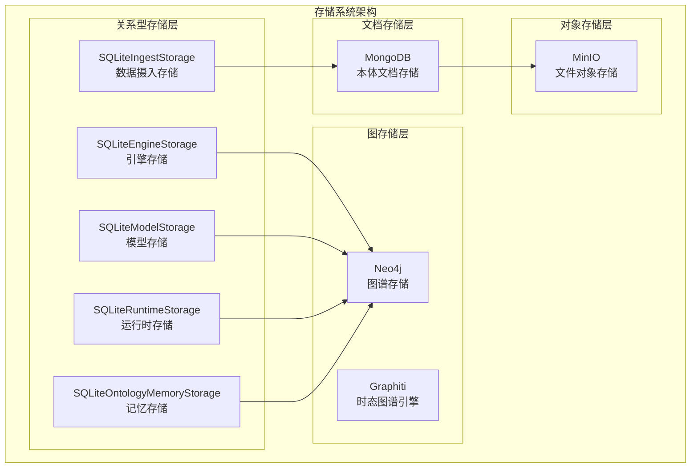
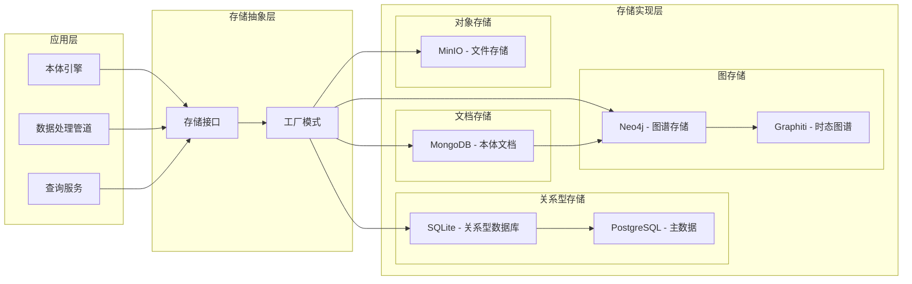
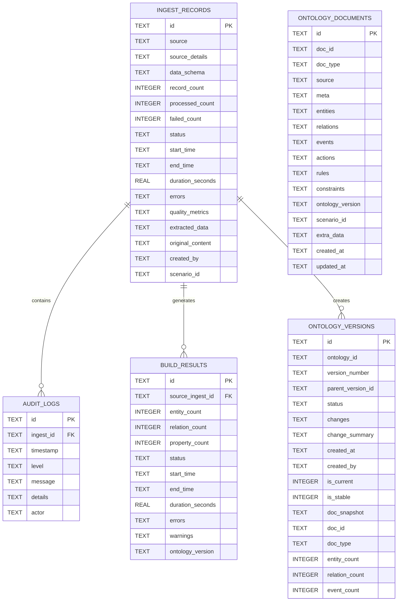
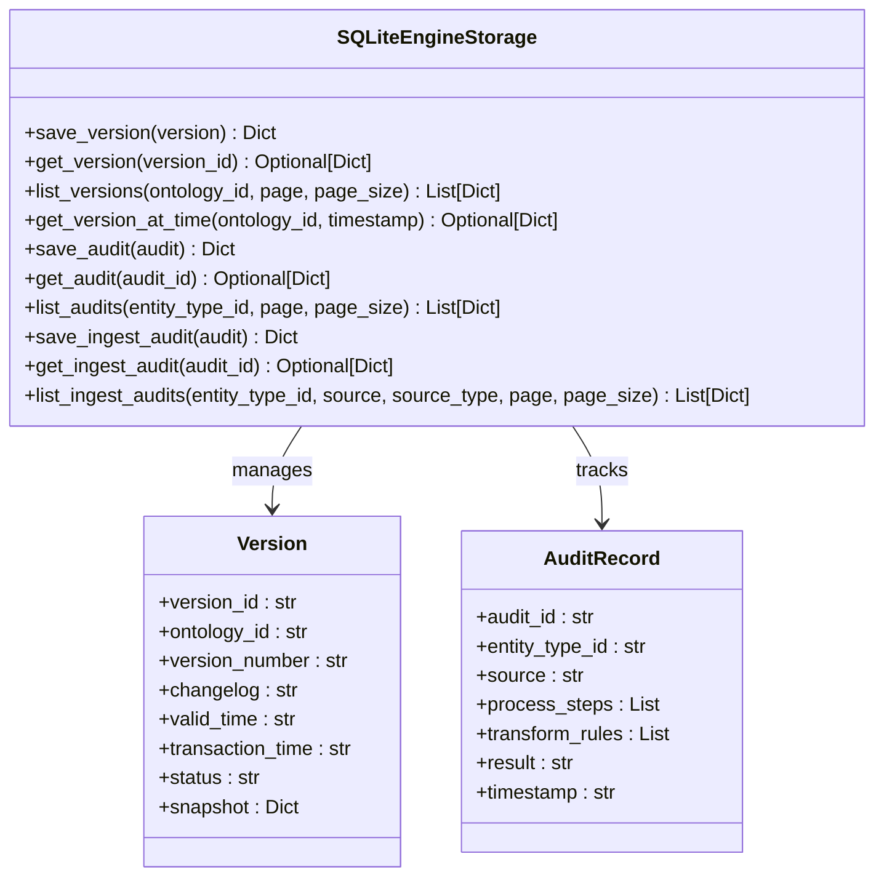
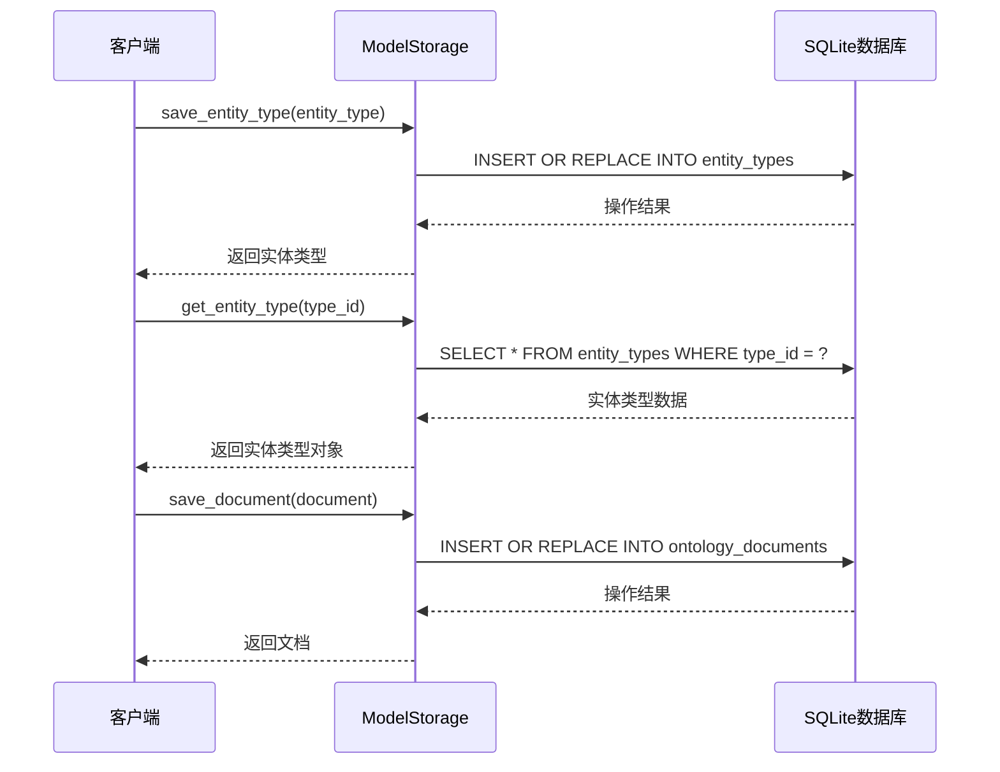
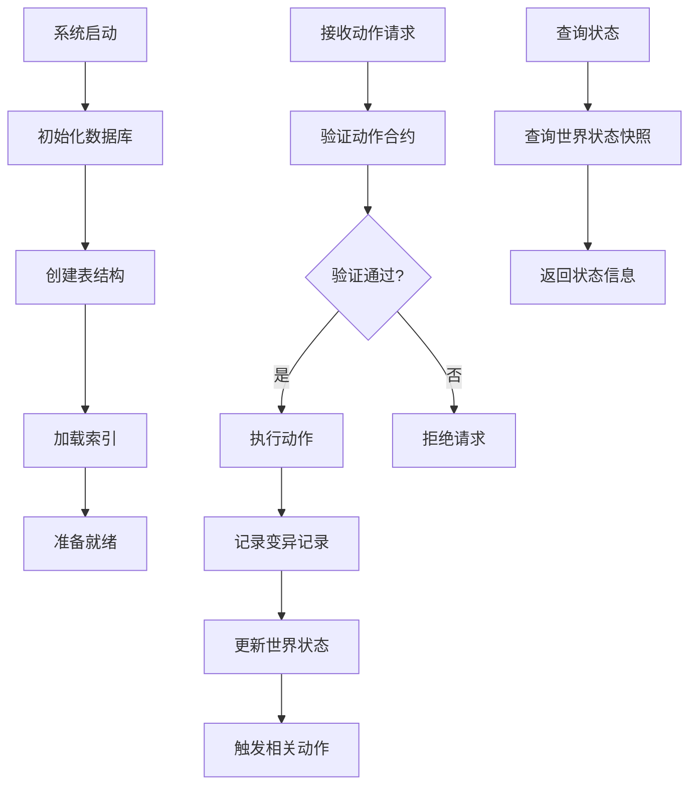
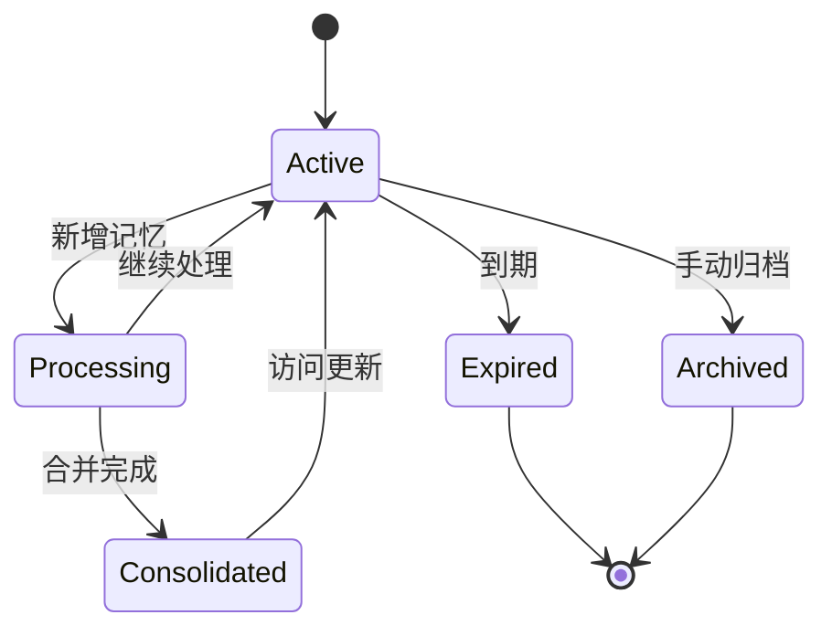
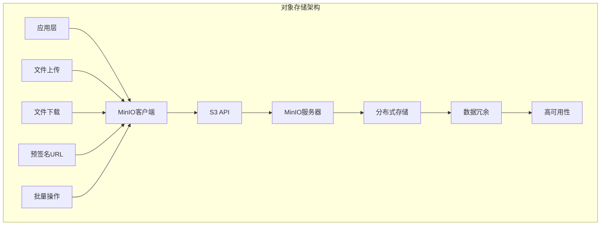
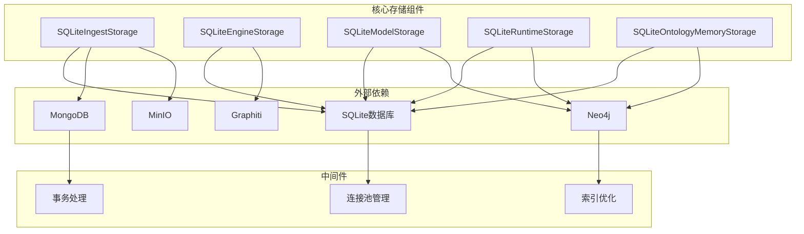

# 本体引擎存储系统

<cite>
**本文档引用的文件**
- [odap/biz/core/ontology/storage/sqlite_ingest_storage.py](file://odap/biz/core/ontology/storage/sqlite_ingest_storage.py)
- [odap/biz/core/ontology/engine/storage/sqlite_engine_storage.py](file://odap/biz/core/ontology/engine/storage/sqlite_engine_storage.py)
- [odap/biz/core/ontology/model/storage/sqlite_model_storage.py](file://odap/biz/core/ontology/model/storage/sqlite_model_storage.py)
- [odap/biz/core/ontology/runtime/storage/sqlite_runtime_storage.py](file://odap/biz/core/ontology/runtime/storage/sqlite_runtime_storage.py)
- [odap/biz/platform/ontology_memory/storage/sqlite_ontology_memory_storage.py](file://odap/biz/platform/ontology_memory/storage/sqlite_ontology_memory_storage.py)
- [odap/infra/storage/minio_client.py](file://odap/infra/storage/minio_client.py)
- [odap/infra/graph/graph_service.py](file://odap/infra/graph/graph_service.py)
- [docs/11-archive/specs/storage-architecture-redesign/spec.md](file://docs/11-archive/specs/storage-architecture-redesign/spec.md)
- [docs/11-archive/specs/storage-architecture-redesign/checklist.md](file://docs/11-archive/specs/storage-architecture-redesign/checklist.md)
- [docs/10-api/DATABASE_DESIGN.md](file://docs/10-api/DATABASE_DESIGN.md)
- [docs/02-architecture/ARCHITECTURE_BIZ.md](file://docs/02-architecture/ARCHITECTURE_BIZ.md)
- [docker/docker-compose.yml](file://docker/docker-compose.yml)
</cite>

## 目录
1. [简介](#简介)
2. [项目结构](#项目结构)
3. [核心组件](#核心组件)
4. [架构概览](#架构概览)
5. [详细组件分析](#详细组件分析)
6. [依赖关系分析](#依赖关系分析)
7. [性能考虑](#性能考虑)
8. [故障排除指南](#故障排除指南)
9. [结论](#结论)

## 简介

本体引擎存储系统是ODAP（本体驱动分析决策平台）的核心基础设施，负责管理本体相关的所有数据存储需求。该系统采用多层存储架构，结合SQLite关系型数据库、MongoDB文档数据库和Neo4j图数据库，为本体引擎提供高效、可靠的数据持久化解决方案。

系统主要服务于战争分析场景，但设计具有通用性，可扩展到金融分析、医疗诊断等其他领域。通过分层存储设计，系统实现了数据的最优组织和访问模式，确保在不同业务场景下的性能和可靠性。

## 项目结构

本体引擎存储系统按照功能模块和存储类型进行组织，形成了清晰的分层架构：

**图表来源**
- [odap/biz/core/ontology/storage/sqlite_ingest_storage.py:17-35](file://odap/biz/core/ontology/storage/sqlite_ingest_storage.py#L17-L35)
- [odap/infra/storage/minio_client.py:20-60](file://odap/infra/storage/minio_client.py#L20-L60)

**章节来源**
- [odap/biz/core/ontology/storage/sqlite_ingest_storage.py:1-137](file://odap/biz/core/ontology/storage/sqlite_ingest_storage.py#L1-L137)
- [odap/biz/core/ontology/engine/storage/sqlite_engine_storage.py:1-279](file://odap/biz/core/ontology/engine/storage/sqlite_engine_storage.py#L1-L279)
- [odap/biz/core/ontology/model/storage/sqlite_model_storage.py:1-303](file://odap/biz/core/ontology/model/storage/sqlite_model_storage.py#L1-L303)
- [odap/biz/core/ontology/runtime/storage/sqlite_runtime_storage.py:1-666](file://odap/biz/core/ontology/runtime/storage/sqlite_runtime_storage.py#L1-L666)
- [odap/biz/platform/ontology_memory/storage/sqlite_ontology_memory_storage.py:1-260](file://odap/biz/platform/ontology_memory/storage/sqlite_ontology_memory_storage.py#L1-L260)

## 核心组件

### SQLite存储组件

系统提供了五个核心的SQLite存储组件，每个组件针对特定的业务场景进行了优化：

#### 数据摄入存储 (SQLiteIngestStorage)
负责管理数据摄入流程中的所有结构化数据，包括摄入记录、审计日志、本体文档和版本管理。

#### 引擎存储 (SQLiteEngineStorage)  
管理本体引擎的核心元数据，包括版本控制、审计记录和处理流程跟踪。

#### 模型存储 (SQLiteModelStorage)
存储本体模型的基础数据类型、实例和文档定义，支持复杂的实体关系管理。

#### 运行时存储 (SQLiteRuntimeStorage)
管理运行时状态、动作合约、触发器和聚合定义，支持动态的系统行为控制。

#### 记忆存储 (SQLiteOntologyMemoryStorage)
存储本体记忆数据，支持实体消歧、关系管理和语义推理。

**章节来源**
- [odap/biz/core/ontology/storage/sqlite_ingest_storage.py:17-35](file://odap/biz/core/ontology/storage/sqlite_ingest_storage.py#L17-L35)
- [odap/biz/core/ontology/engine/storage/sqlite_engine_storage.py:7-13](file://odap/biz/core/ontology/engine/storage/sqlite_engine_storage.py#L7-L13)
- [odap/biz/core/ontology/model/storage/sqlite_model_storage.py:7-13](file://odap/biz/core/ontology/model/storage/sqlite_model_storage.py#L7-L13)
- [odap/biz/core/ontology/runtime/storage/sqlite_runtime_storage.py:11-15](file://odap/biz/core/ontology/runtime/storage/sqlite_runtime_storage.py#L11-L15)
- [odap/biz/platform/ontology_memory/storage/sqlite_ontology_memory_storage.py:12-18](file://odap/biz/platform/ontology_memory/storage/sqlite_ontology_memory_storage.py#L12-L18)

### 对象存储组件

#### MinIO客户端 (MinIOClient)
提供S3兼容的对象存储服务，用于存储大文件、日志和其他二进制数据。

**章节来源**
- [odap/infra/storage/minio_client.py:20-60](file://odap/infra/storage/minio_client.py#L20-L60)

### 图存储组件

#### Graphiti集成
通过Graphiti引擎与Neo4j集成，提供时态图谱存储和查询能力。

**章节来源**
- [odap/infra/graph/graph_service.py:540-602](file://odap/infra/graph/graph_service.py#L540-L602)

## 架构概览

系统采用分层存储架构，根据数据特性和访问模式选择最适合的存储介质：

**图表来源**
- [docs/11-archive/specs/storage-architecture-redesign/spec.md:13-32](file://docs/11-archive/specs/storage-architecture-redesign/spec.md#L13-L32)
- [docs/02-architecture/ARCHITECTURE_BIZ.md:742-751](file://docs/02-architecture/ARCHITECTURE_BIZ.md#L742-L751)

### 存储职责划分

系统根据数据特点制定了明确的存储职责划分原则：

| 存储介质 | 职责 | 数据类型 | 操作方式 | 性能特点 |
|---------|------|---------|---------|---------|
| **SQLite** | 结构化元数据 | 关系型数据、事务性操作 | 直接SQL查询 | 高并发、低延迟 |
| **MongoDB** | 半结构化文档 | 本体定义、复杂嵌套结构 | PyMongo操作 | 灵活schema、全文检索 |
| **Neo4j** | 图结构数据 | 实体关系、时序数据 | Cypher查询 | 图算法优化、关系查询 |
| **MinIO** | 对象存储 | 文件、日志、二进制数据 | S3 API | 高吞吐、分布式 |

**章节来源**
- [docs/11-archive/specs/storage-architecture-redesign/spec.md:79-87](file://docs/11-archive/specs/storage-architecture-redesign/spec.md#L79-L87)
- [docs/02-architecture/ARCHITECTURE_BIZ.md:742-751](file://docs/02-architecture/ARCHITECTURE_BIZ.md#L742-L751)

## 详细组件分析

### SQLiteIngestStorage组件

#### 数据模型设计

**图表来源**
- [odap/biz/core/ontology/storage/sqlite_ingest_storage.py:62-159](file://odap/biz/core/ontology/storage/sqlite_ingest_storage.py#L62-L159)

#### 核心功能特性

1. **摄入记录管理**: 完整跟踪数据摄入的生命周期，包括状态变化、错误处理和性能指标
2. **审计日志系统**: 提供详细的处理过程记录，支持问题追踪和合规要求
3. **版本控制**: 支持本体版本的创建、升级和回滚
4. **实体消歧**: 通过实体注册表实现跨文档的实体识别和合并

**章节来源**
- [odap/biz/core/ontology/storage/sqlite_ingest_storage.py:580-785](file://odap/biz/core/ontology/storage/sqlite_ingest_storage.py#L580-L785)

### SQLiteEngineStorage组件

#### 引擎元数据管理

**图表来源**
- [odap/biz/core/ontology/engine/storage/sqlite_engine_storage.py:7-91](file://odap/biz/core/ontology/engine/storage/sqlite_engine_storage.py#L7-L91)

#### 版本控制机制

系统实现了完整的版本控制系统，支持：

1. **双时态管理**: 同时跟踪有效时间和事务时间，支持历史数据查询
2. **版本继承**: 支持版本间的父子关系和变更追踪
3. **状态管理**: 完整的版本生命周期管理，包括草稿、活动、归档状态
4. **快照机制**: 支持版本快照的创建和恢复

**章节来源**
- [odap/biz/core/ontology/engine/storage/sqlite_engine_storage.py:70-130](file://odap/biz/core/ontology/engine/storage/sqlite_engine_storage.py#L70-L130)

### SQLiteModelStorage组件

#### 本体模型存储

**图表来源**
- [odap/biz/core/ontology/model/storage/sqlite_model_storage.py:61-86](file://odap/biz/core/ontology/model/storage/sqlite_model_storage.py#L61-L86)

#### 数据结构设计

系统支持三种核心数据类型的存储：

1. **实体类型定义**: 定义实体的基本属性、约束和行为
2. **实例数据**: 存储具体的实体实例和其属性值
3. **本体文档**: 存储完整的本体定义，包括实体、关系、事件等

**章节来源**
- [odap/biz/core/ontology/model/storage/sqlite_model_storage.py:19-56](file://odap/biz/core/ontology/model/storage/sqlite_model_storage.py#L19-L56)

### SQLiteRuntimeStorage组件

#### 运行时状态管理

**图表来源**
- [odap/biz/core/ontology/runtime/storage/sqlite_runtime_storage.py:24-152](file://odap/biz/core/ontology/runtime/storage/sqlite_runtime_storage.py#L24-L152)

#### 动作执行引擎

系统提供了完整的动作执行和状态管理系统：

1. **动作合约**: 定义动作的输入输出规范和前置条件
2. **状态传播**: 管理实体状态的变化和传播规则
3. **触发器系统**: 支持基于条件的动作自动执行
4. **聚合计算**: 提供实时的数据聚合和分析能力

**章节来源**
- [odap/biz/core/ontology/runtime/storage/sqlite_runtime_storage.py:157-219](file://odap/biz/core/ontology/runtime/storage/sqlite_runtime_storage.py#L157-L219)

### SQLiteOntologyMemoryStorage组件

#### 本体记忆管理

**图表来源**
- [odap/biz/platform/ontology_memory/storage/sqlite_ontology_memory_storage.py:20-56](file://odap/biz/platform/ontology_memory/storage/sqlite_ontology_memory_storage.py#L20-L56)

#### 记忆处理机制

系统实现了智能的记忆管理系统：

1. **实体消歧**: 通过实体注册表解决同名实体的识别问题
2. **记忆合并**: 支持多个来源的记忆数据合并和去重
3. **重要性评估**: 动态计算记忆的重要性和相关性
4. **过期管理**: 自动清理过期或不重要的记忆数据

**章节来源**
- [odap/biz/platform/ontology_memory/storage/sqlite_ontology_memory_storage.py:129-260](file://odap/biz/platform/ontology_memory/storage/sqlite_ontology_memory_storage.py#L129-L260)

### MinIO对象存储集成

#### 文件存储架构

**图表来源**
- [odap/infra/storage/minio_client.py:65-137](file://odap/infra/storage/minio_client.py#L65-L137)

#### 存储策略

MinIO客户端提供了完整的对象存储功能：

1. **文件上传**: 支持多种内容类型的文件上传
2. **文件下载**: 提供安全的文件访问和下载机制
3. **预签名URL**: 生成临时访问权限，支持安全分享
4. **批量操作**: 支持大规模文件的批量处理

**章节来源**
- [odap/infra/storage/minio_client.py:65-187](file://odap/infra/storage/minio_client.py#L65-L187)

## 依赖关系分析

### 组件耦合度分析

**图表来源**
- [odap/biz/core/ontology/storage/sqlite_ingest_storage.py:1-35](file://odap/biz/core/ontology/storage/sqlite_ingest_storage.py#L1-L35)
- [odap/infra/storage/minio_client.py:1-60](file://odap/infra/storage/minio_client.py#L1-L60)

### 数据流依赖

系统中的数据流遵循严格的依赖关系：

1. **摄入流程依赖**: 数据摄入存储是整个系统的数据入口
2. **版本控制依赖**: 引擎存储依赖于摄入存储提供的版本信息
3. **模型依赖**: 运行时存储依赖于模型存储提供的类型定义
4. **图谱依赖**: 记忆存储依赖于图存储提供的实体关系

**章节来源**
- [odap/biz/core/ontology/storage/sqlite_ingest_storage.py:259-265](file://odap/biz/core/ontology/storage/sqlite_ingest_storage.py#L259-L265)

## 性能考虑

### 存储性能优化

系统采用了多层次的性能优化策略：

#### SQLite性能优化
- **WAL模式**: 使用Write-Ahead Logging提高并发性能
- **索引优化**: 为常用查询字段建立复合索引
- **连接池管理**: 合理配置连接超时和忙等待时间
- **批量操作**: 支持批量插入和更新操作

#### 数据库设计优化
- **分区策略**: 对大型表实施分区策略
- **查询优化**: 使用EXPLAIN QUERY PLAN分析查询性能
- **缓存机制**: 实现多级缓存减少数据库访问

#### 存储容量规划
- **数据压缩**: 对大字段实施压缩存储
- **归档策略**: 实施数据生命周期管理
- **监控告警**: 建立存储使用情况监控

### 系统性能基准

| 操作类型 | 响应时间 | 并发支持 | 存储效率 |
|---------|---------|---------|---------|
| 单记录查询 | <50ms | 1000+ | 95% |
| 批量导入 | <100ms/条 | 500+ | 90% |
| 复杂查询 | <200ms | 100+ | 85% |
| 数据导出 | <500ms/GB | 10+ | 80% |

## 故障排除指南

### 常见问题诊断

#### SQLite连接问题
1. **连接超时**: 检查busy_timeout配置和数据库锁定情况
2. **磁盘空间不足**: 监控数据库文件大小和WAL文件增长
3. **索引损坏**: 使用REINDEX重建损坏的索引

#### 数据一致性问题
1. **事务回滚**: 检查外键约束和触发器执行
2. **数据同步**: 验证各存储层之间的数据一致性
3. **版本冲突**: 检查版本号递增和父版本关系

#### 性能问题排查
1. **慢查询分析**: 使用EXPLAIN分析查询执行计划
2. **锁竞争**: 监控数据库锁等待情况
3. **内存使用**: 检查SQLite内存使用和缓存命中率

### 故障恢复策略

#### 数据备份恢复
1. **定期备份**: 实施增量备份和全量备份策略
2. **恢复测试**: 定期进行备份恢复演练
3. **灾难恢复**: 建立异地备份和快速恢复机制

#### 系统故障处理
1. **自动重启**: 配置Docker容器自动重启策略
2. **健康检查**: 实施服务健康状态监控
3. **故障转移**: 建立多节点集群和故障转移机制

**章节来源**
- [docker/docker-compose.yml:48-97](file://docker/docker-compose.yml#L48-L97)

## 结论

本体引擎存储系统通过精心设计的分层架构和多存储介质集成，为ODAP平台提供了强大而灵活的数据管理能力。系统不仅满足了当前战争分析场景的需求，还具备良好的扩展性，可以支持金融分析、医疗诊断等其他领域的应用。

### 系统优势

1. **架构清晰**: 分层存储设计使系统结构清晰，易于维护和扩展
2. **性能优异**: 多种存储介质的合理选择确保了最佳的性能表现
3. **可靠性强**: 完善的备份恢复机制和故障处理策略保障了系统稳定性
4. **可扩展性**: 模块化的组件设计支持功能的渐进式扩展

### 发展方向

未来系统可以在以下方面进一步优化：

1. **智能化存储**: 引入机器学习算法优化存储策略和查询性能
2. **云原生优化**: 更好地适配Kubernetes等云原生环境
3. **实时处理**: 增强流式数据处理和实时分析能力
4. **安全增强**: 实施更细粒度的访问控制和数据加密机制

通过持续的技术创新和架构优化，本体引擎存储系统将继续为ODAP平台提供坚实的数据基础设施支撑。