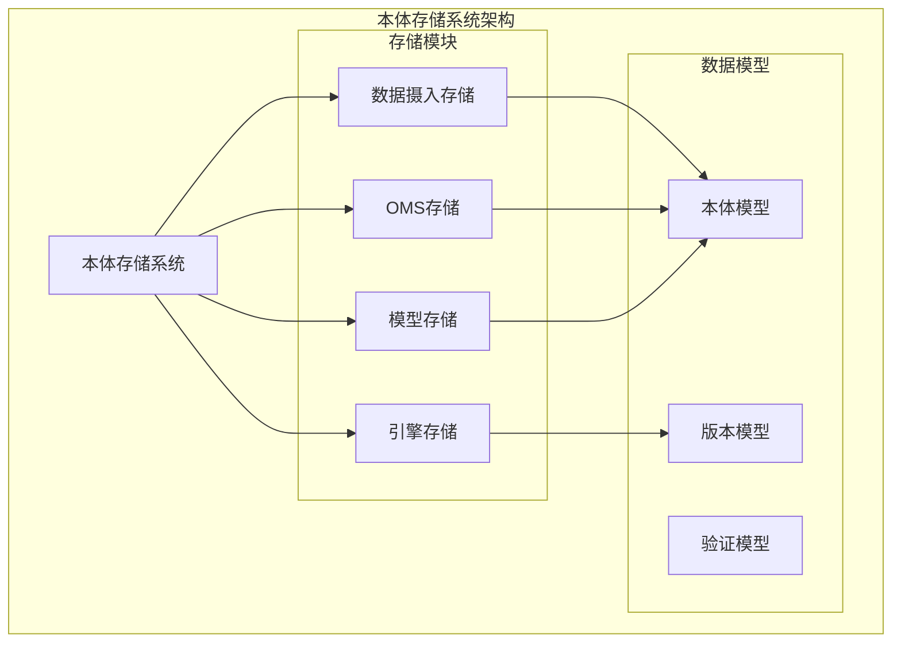
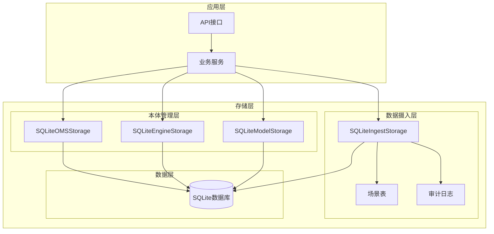
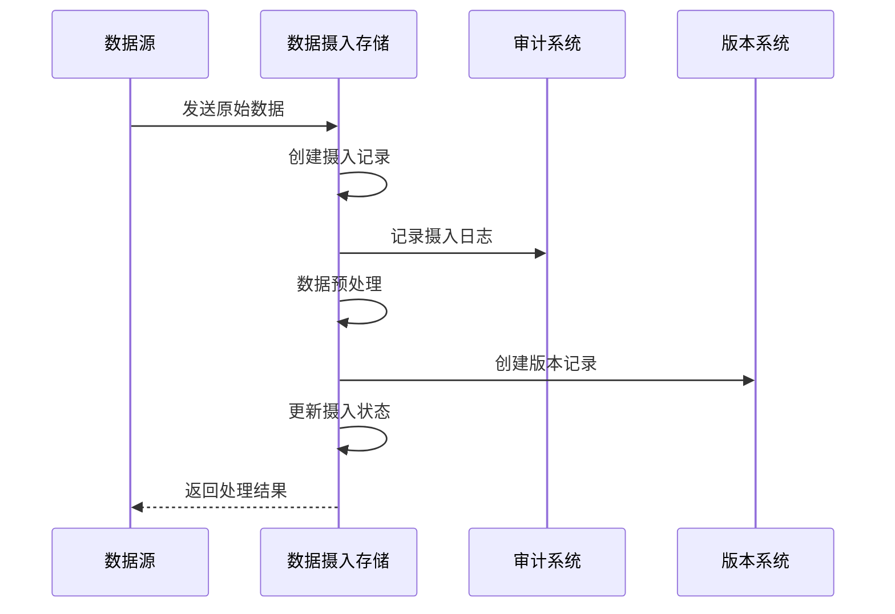
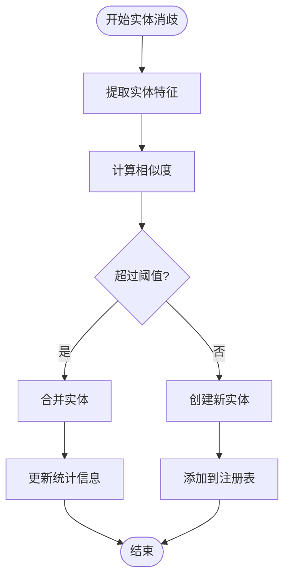
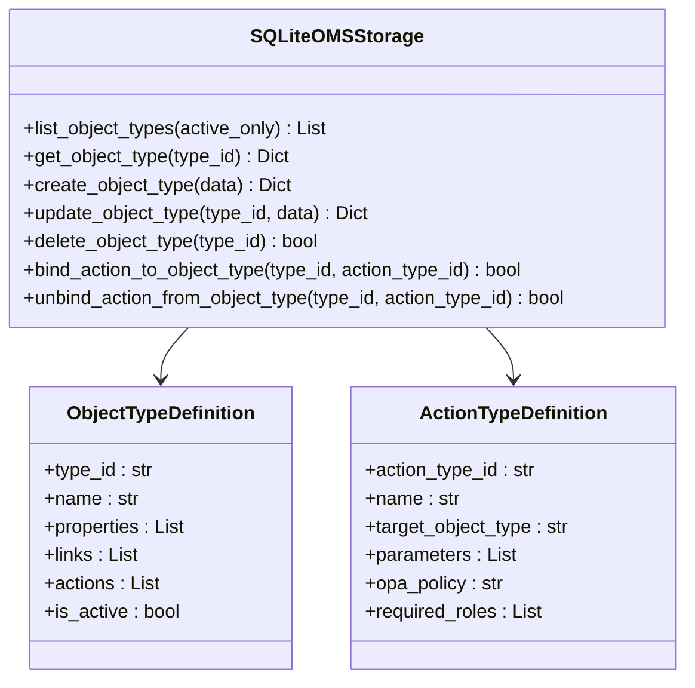
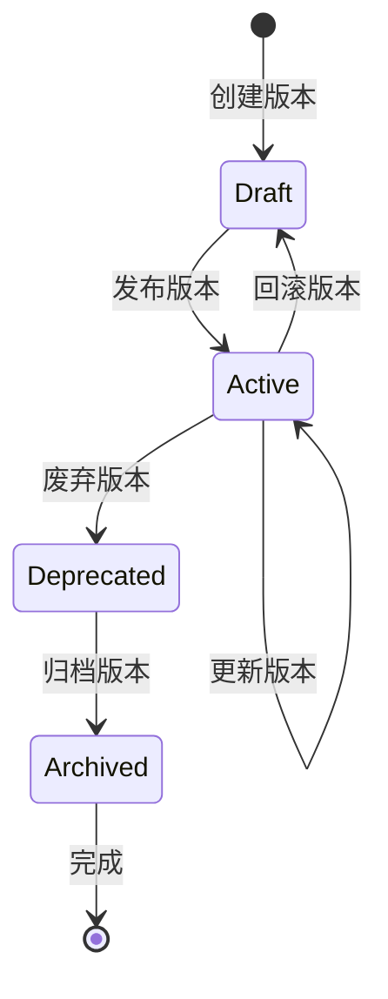
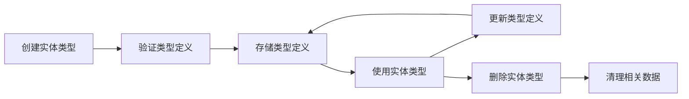
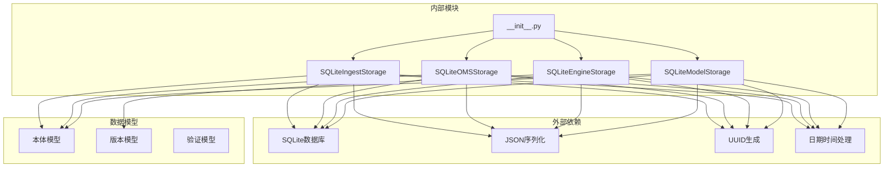

# 本体模型存储系统

<cite>
**本文档引用的文件**
- [README.md](file://README.md)
- [odap/biz/core/ontology/storage/__init__.py](file://odap/biz/core/ontology/storage/__init__.py)
- [odap/biz/core/ontology/storage/sqlite_ingest_storage.py](file://odap/biz/core/ontology/storage/sqlite_ingest_storage.py)
- [odap/biz/core/ontology/oms/storage/sqlite_oms_storage.py](file://odap/biz/core/ontology/oms/storage/sqlite_oms_storage.py)
- [odap/biz/core/ontology/engine/storage/sqlite_engine_storage.py](file://odap/biz/core/ontology/engine/storage/sqlite_engine_storage.py)
- [odap/biz/core/ontology/model/storage/sqlite_model_storage.py](file://odap/biz/core/ontology/model/storage/sqlite_model_storage.py)
- [odap/biz/core/ontology/models/ontology.py](file://odap/biz/core/ontology/models/ontology.py)
- [odap/biz/core/ontology/models/version.py](file://odap/biz/core/ontology/models/version.py)
- [odap/biz/core/ontology/models/validation.py](file://odap/biz/core/ontology/models/validation.py)
</cite>

## 目录
1. [简介](#简介)
2. [项目结构](#项目结构)
3. [核心组件](#核心组件)
4. [架构概览](#架构概览)
5. [详细组件分析](#详细组件分析)
6. [依赖关系分析](#依赖关系分析)
7. [性能考虑](#性能考虑)
8. [故障排除指南](#故障排除指南)
9. [结论](#结论)

## 简介

本体模型存储系统是ODAP（Ontology-Driven Analysis & Decision Platform）的核心基础设施，负责管理和存储本体驱动的分析决策平台中的各种本体数据。该系统基于SQLite数据库实现了多层次的数据存储架构，支持本体模型、数据摄入、版本控制和审计跟踪等功能。

系统采用模块化设计，将不同的本体相关数据分离到独立的存储模块中，包括：
- 数据摄入存储：管理数据摄入流程和审计
- OMS存储：存储本体元模型定义
- 引擎存储：管理本体版本和审计记录
- 模型存储：存储实体类型和实例数据

## 项目结构

本体模型存储系统位于ODAP项目的`odap/biz/core/ontology/`目录下，采用按功能模块划分的层次结构：

**图表来源**
- [odap/biz/core/ontology/storage/__init__.py:1-8](file://odap/biz/core/ontology/storage/__init__.py#L1-L8)
- [odap/biz/core/ontology/models/ontology.py:1-44](file://odap/biz/core/ontology/models/ontology.py#L1-L44)

**章节来源**
- [README.md:27-122](file://README.md#L27-L122)

## 核心组件

### 数据摄入存储系统

数据摄入存储系统是本体存储的核心组件，专门负责管理数据摄入流程和相关的审计跟踪。该系统使用SQLite数据库实现，包含以下主要表结构：

#### 主要数据表

| 表名 | 描述 | 主要字段 |
|------|------|----------|
| `ingest_records` | 数据摄入记录 | id, source, status, timestamps |
| `audit_logs` | 审计日志 | id, ingest_id, level, message |
| `ontology_documents` | 本体文档 | id, doc_id, entities, relations |
| `build_results` | 构建结果 | id, entity_count, relation_count |
| `ontology_versions` | 本体版本 | id, version_number, status |
| `entity_registry` | 实体注册表 | canonical_id, entity_type, name |

#### 关键功能特性

1. **场景化存储**：支持多场景隔离的数据存储
2. **审计跟踪**：完整的数据摄入过程审计
3. **版本管理**：本体版本的完整生命周期管理
4. **实体消歧**：实体识别和消歧功能

**章节来源**
- [odap/biz/core/ontology/storage/sqlite_ingest_storage.py:17-35](file://odap/biz/core/ontology/storage/sqlite_ingest_storage.py#L17-L35)

### OMS存储系统

OMS（Ontology Meta Schema）存储系统负责管理本体元模型的定义和结构。该系统实现了对象类型和动作类型的存储管理：

#### 对象类型管理

- **属性定义**：支持基本属性、统计属性、能力和约束
- **链接定义**：管理实体间的关系和连接
- **动作绑定**：将动作类型绑定到对象类型

#### 动作类型管理

- **参数配置**：支持动作参数的定义和验证
- **权限控制**：集成OPA策略引擎进行权限验证
- **回写配置**：支持数据回写到外部系统的配置

**章节来源**
- [odap/biz/core/ontology/oms/storage/sqlite_oms_storage.py:18-66](file://odap/biz/core/ontology/oms/storage/sqlite_oms_storage.py#L18-L66)

### 引擎存储系统

引擎存储系统专注于本体版本管理和审计跟踪，为本体引擎提供可靠的数据持久化能力：

#### 版本管理系统

- **双时态支持**：支持valid_time和transaction_time
- **版本快照**：完整的本体状态快照存储
- **变更日志**：详细的版本变更记录

#### 审计跟踪系统

- **实体审计**：实体处理过程的完整审计
- **摄入审计**：数据摄入过程的详细记录
- **时间戳管理**：精确的时间戳记录

**章节来源**
- [odap/biz/core/ontology/engine/storage/sqlite_engine_storage.py:7-68](file://odap/biz/core/ontology/engine/storage/sqlite_engine_storage.py#L7-L68)

### 模型存储系统

模型存储系统负责管理本体的基本数据结构，包括实体类型、实例和文档：

#### 实体类型管理

- **类型定义**：实体类型的完整定义
- **属性约束**：支持多种属性约束类型
- **分类级别**：安全分类级别的管理

#### 实例管理

- **实例创建**：实体实例的创建和管理
- **批量导入**：支持大量实例的批量处理
- **工作空间隔离**：实例在不同工作空间中的隔离

**章节来源**
- [odap/biz/core/ontology/model/storage/sqlite_model_storage.py:7-59](file://odap/biz/core/ontology/model/storage/sqlite_model_storage.py#L7-L59)

## 架构概览

本体模型存储系统采用分层架构设计，每个存储模块都有明确的职责分工：

**图表来源**
- [odap/biz/core/ontology/storage/sqlite_ingest_storage.py:52-265](file://odap/biz/core/ontology/storage/sqlite_ingest_storage.py#L52-L265)
- [odap/biz/core/ontology/oms/storage/sqlite_oms_storage.py:32-122](file://odap/biz/core/ontology/oms/storage/sqlite_oms_storage.py#L32-L122)

## 详细组件分析

### 数据摄入存储组件

数据摄入存储组件是整个本体存储系统的核心，负责管理从各种数据源摄入到本体系统中的数据流。

#### 数据摄入流程

**图表来源**
- [odap/biz/core/ontology/storage/sqlite_ingest_storage.py:580-613](file://odap/biz/core/ontology/storage/sqlite_ingest_storage.py#L580-L613)

#### 实体消歧算法

系统实现了复杂的实体消歧算法，通过以下步骤实现：

1. **实体识别**：从文本中提取潜在的实体
2. **特征提取**：计算实体的特征向量
3. **相似度计算**：比较实体间的相似度
4. **消歧决策**：确定实体的最终标识

**图表来源**
- [odap/biz/core/ontology/storage/sqlite_ingest_storage.py:161-178](file://odap/biz/core/ontology/storage/sqlite_ingest_storage.py#L161-L178)

**章节来源**
- [odap/biz/core/ontology/storage/sqlite_ingest_storage.py:17-25](file://odap/biz/core/ontology/storage/sqlite_ingest_storage.py#L17-L25)

### OMS存储组件

OMS存储组件实现了本体元模型的完整管理，支持复杂的本体结构定义。

#### 对象类型管理流程

**图表来源**
- [odap/biz/core/ontology/oms/storage/sqlite_oms_storage.py:168-256](file://odap/biz/core/ontology/oms/storage/sqlite_oms_storage.py#L168-L256)

#### 动作类型绑定机制

系统支持灵活的动作类型绑定机制，允许将动作类型动态绑定到对象类型：

1. **绑定验证**：检查对象类型和动作类型的合法性
2. **重复检查**：避免重复绑定相同的动作类型
3. **更新操作**：将动作类型ID添加到对象类型的actions数组中

**章节来源**
- [odap/biz/core/ontology/oms/storage/sqlite_oms_storage.py:350-370](file://odap/biz/core/ontology/oms/storage/sqlite_oms_storage.py#L350-L370)

### 引擎存储组件

引擎存储组件专注于本体版本管理和审计跟踪，为本体引擎提供可靠的数据持久化能力。

#### 版本管理系统

**图表来源**
- [odap/biz/core/ontology/engine/storage/sqlite_engine_storage.py:70-91](file://odap/biz/core/ontology/engine/storage/sqlite_engine_storage.py#L70-L91)

#### 审计记录管理

系统提供了完整的审计记录管理功能，包括：

- **实体审计**：记录实体处理过程的详细信息
- **摄入审计**：跟踪数据摄入的完整流程
- **查询审计**：记录对本体数据的查询操作

**章节来源**
- [odap/biz/core/ontology/engine/storage/sqlite_engine_storage.py:131-181](file://odap/biz/core/ontology/engine/storage/sqlite_engine_storage.py#L131-L181)

### 模型存储组件

模型存储组件负责管理本体的基本数据结构，包括实体类型、实例和文档。

#### 实体类型生命周期

**图表来源**
- [odap/biz/core/ontology/model/storage/sqlite_model_storage.py:61-86](file://odap/biz/core/ontology/model/storage/sqlite_model_storage.py#L61-L86)

#### 实例批量处理

系统支持高效的批量实例处理功能：

1. **批量导入**：支持大量实例的快速导入
2. **错误处理**：单个实例导入失败不影响整体处理
3. **进度跟踪**：实时跟踪批量处理的进度

**章节来源**
- [odap/biz/core/ontology/model/storage/sqlite_model_storage.py:208-227](file://odap/biz/core/ontology/model/storage/sqlite_model_storage.py#L208-L227)

## 依赖关系分析

本体模型存储系统具有清晰的依赖关系结构，各模块之间通过明确定义的接口进行交互：

**图表来源**
- [odap/biz/core/ontology/storage/__init__.py:1-8](file://odap/biz/core/ontology/storage/__init__.py#L1-L8)
- [odap/biz/core/ontology/models/ontology.py:1-44](file://odap/biz/core/ontology/models/ontology.py#L1-L44)

### 数据模型依赖

系统中的数据模型具有以下依赖关系：

- **本体模型**：被所有存储模块共享使用
- **版本模型**：主要用于引擎存储模块
- **验证模型**：与数据摄入存储模块紧密集成

**章节来源**
- [odap/biz/core/ontology/models/ontology.py:1-44](file://odap/biz/core/ontology/models/ontology.py#L1-L44)
- [odap/biz/core/ontology/models/version.py:1-42](file://odap/biz/core/ontology/models/version.py#L1-L42)
- [odap/biz/core/ontology/models/validation.py:1-58](file://odap/biz/core/ontology/models/validation.py#L1-L58)

## 性能考虑

本体模型存储系统在设计时充分考虑了性能优化，采用了多种技术和策略：

### 数据库优化策略

1. **WAL模式**：启用Write-Ahead Logging模式提高并发性能
2. **索引优化**：为常用查询字段建立索引
3. **连接池管理**：合理管理数据库连接以减少开销
4. **批量操作**：支持批量数据插入和更新操作

### 内存管理

1. **延迟加载**：大对象采用延迟加载策略
2. **缓存机制**：热点数据缓存减少数据库访问
3. **内存映射**：对于大型数据集使用内存映射文件

### 查询优化

1. **分页查询**：大数据集采用分页查询避免内存溢出
2. **条件过滤**：支持多条件组合查询
3. **索引利用**：自动利用数据库索引加速查询

## 故障排除指南

### 常见问题及解决方案

#### 数据库连接问题

**问题描述**：应用程序无法连接到SQLite数据库

**可能原因**：
- 数据库文件权限不足
- 数据库文件被其他进程占用
- 数据库路径不存在

**解决方法**：
1. 检查数据库文件权限设置
2. 确认没有其他进程占用数据库文件
3. 验证数据库目录存在且可写

#### 数据完整性问题

**问题描述**：数据摄入过程中出现数据不一致

**可能原因**：
- 并发访问导致的数据竞争
- 事务处理异常
- 数据验证失败

**解决方法**：
1. 检查并发访问控制
2. 验证事务处理逻辑
3. 审核数据验证规则

#### 性能问题

**问题描述**：查询响应时间过长

**可能原因**：
- 缺少必要的数据库索引
- 查询语句效率低下
- 数据库文件过大

**解决方法**：
1. 添加适当的数据库索引
2. 优化查询语句结构
3. 考虑数据库文件的维护和优化

**章节来源**
- [odap/biz/core/ontology/storage/sqlite_ingest_storage.py:27-50](file://odap/biz/core/ontology/storage/sqlite_ingest_storage.py#L27-L50)

## 结论

本体模型存储系统是一个设计精良、功能完整的数据存储解决方案。系统采用模块化架构，每个存储模块都有明确的职责分工，同时通过统一的接口实现模块间的协作。

### 主要优势

1. **模块化设计**：清晰的功能分离便于维护和扩展
2. **多层次存储**：针对不同类型的本体数据提供专门的存储方案
3. **完整的生命周期管理**：从数据摄入到版本管理的全流程支持
4. **强大的审计功能**：完整的数据操作审计和追踪能力
5. **高性能设计**：采用多种优化策略确保系统性能

### 技术特点

- 基于SQLite的轻量级部署
- 支持场景化隔离的数据管理
- 完整的实体消歧和去重功能
- 双时态版本管理支持
- 灵活的动作类型绑定机制

该系统为ODAP平台提供了坚实的数据存储基础，能够有效支持复杂的本体驱动分析和决策需求。