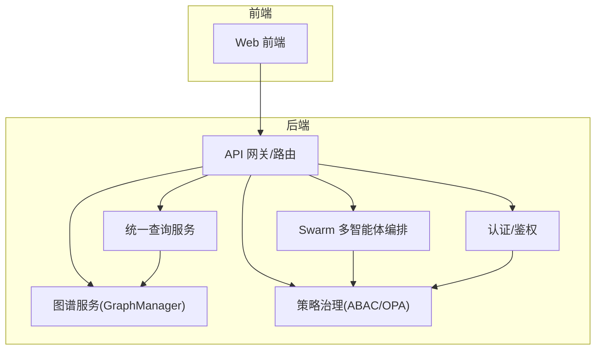
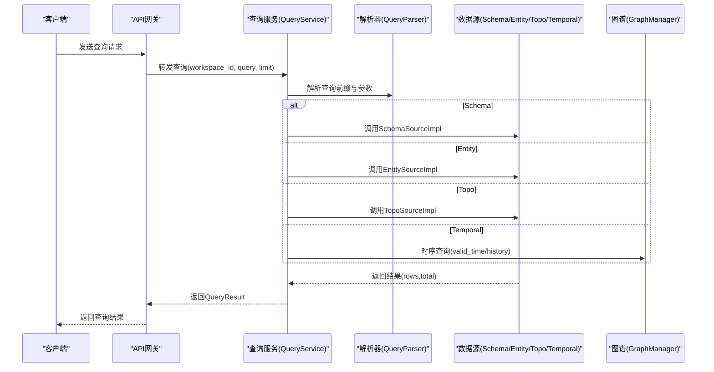
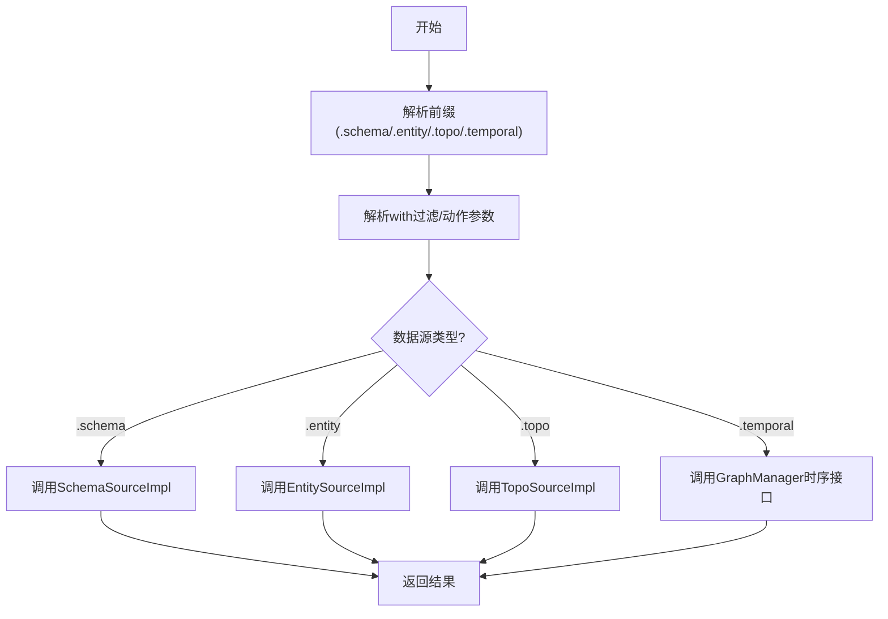
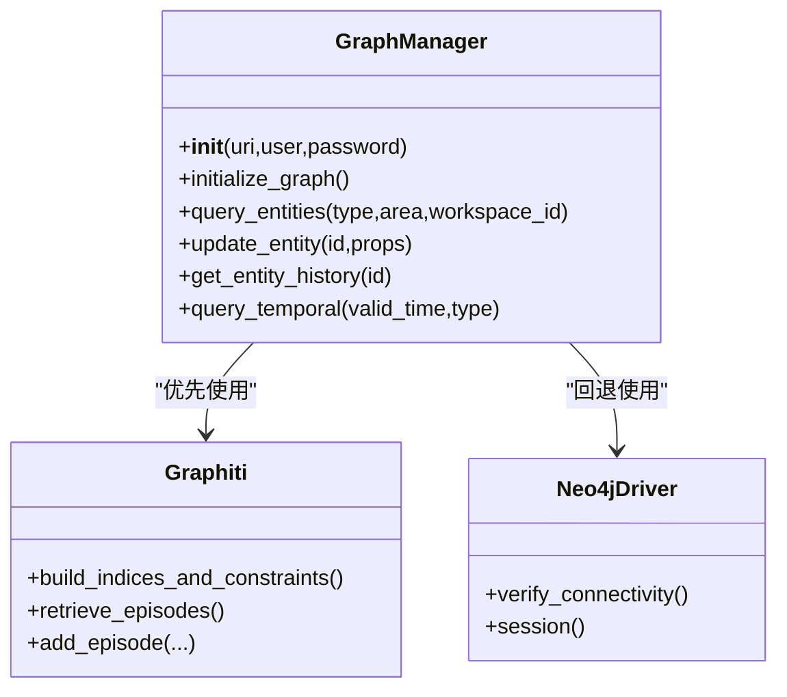
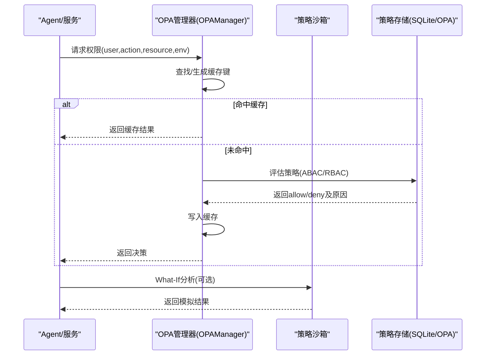
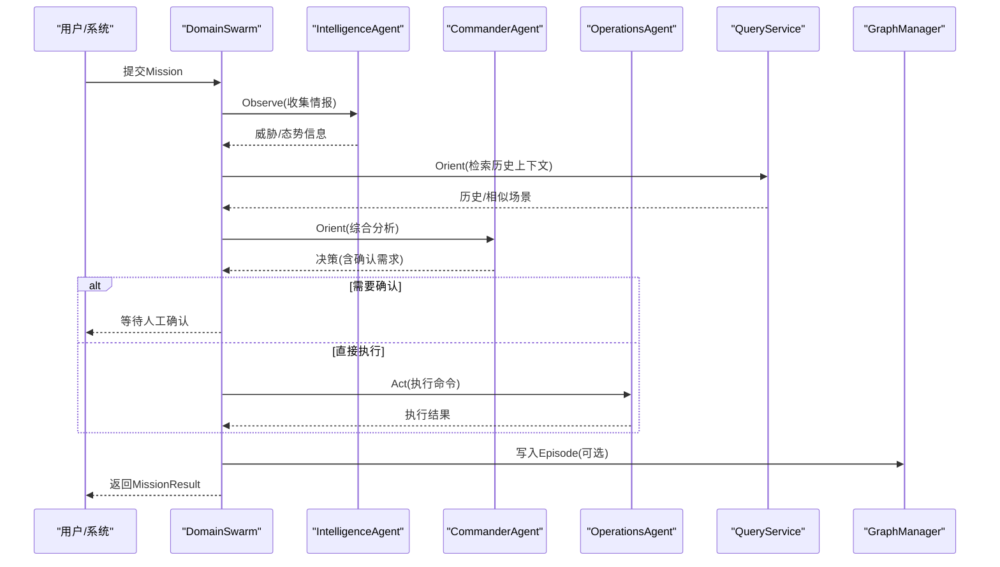
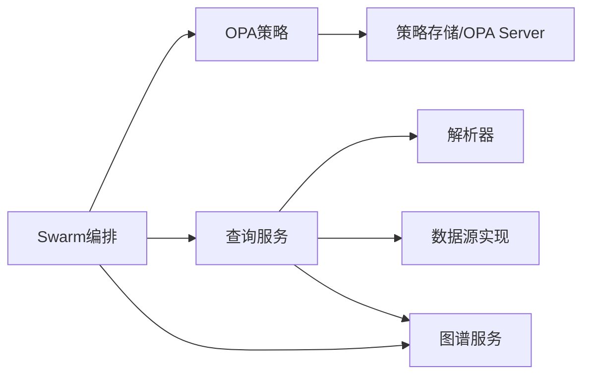

# 核心特性

<cite>
**本文引用的文件**
- [odap/infra/query/service.py](file://odap/infra/query/service.py)
- [odap/infra/query/parser.py](file://odap/infra/query/parser.py)
- [odap/infra/graph/graph_service.py](file://odap/infra/graph/graph_service.py)
- [odap/infra/opa/opa_service.py](file://odap/infra/opa/opa_service.py)
- [odap/infra/opa/routes.py](file://odap/infra/opa/routes.py)
- [odap/infra/opa/opa_policy.rego](file://odap/infra/opa/opa_policy.rego)
- [odap/infra/security/auth_service.py](file://odap/infra/security/auth_service.py)
- [odap/infra/security/auth_routes.py](file://odap/infra/security/auth_routes.py)
- [odap/biz/core/agent/swarm_orchestrator.py](file://odap/biz/core/agent/swarm_orchestrator.py)
- [odap/infra/openharness/decision_engine.py](file://odap/infra/openharness/decision_engine.py)
</cite>

## 目录
1. [简介](#简介)
2. [项目结构](#项目结构)
3. [核心组件](#核心组件)
4. [架构总览](#架构总览)
5. [详细组件分析](#详细组件分析)
6. [依赖分析](#依赖分析)
7. [性能考虑](#性能考虑)
8. [故障排查指南](#故障排查指南)
9. [结论](#结论)
10. [附录](#附录)

## 简介
本文件面向ODAP平台的核心能力，围绕以下关键特性进行系统化说明：OMS元模型框架（四层本体结构）、统一查询服务（Schema/Entity/Topo/Temporal四源查询）、多智能体协同系统（OpenHarness Agent Loop + Swarm三Agent OODA闭环）、双时态知识图谱（Graphiti支持valid_time + transaction_time时序推理）、策略治理（OPA fail-close安全边界 + Agent写操作守卫）、工作空间隔离（4级隔离+资源配额）。我们将从架构、数据流、处理逻辑、集成点、错误处理与性能特征等方面展开，并给出业务价值、技术优势、典型场景与使用建议。

## 项目结构
ODAP平台采用模块化分层设计，核心能力分布在“基础设施层”“业务能力层”“平台能力层”“前端应用层”。其中：
- 基础设施层：查询服务、图谱服务、安全认证、策略治理（OPA）、可观测性与中间件等
- 业务能力层：本体与知识管理、决策与行动、仿真与反馈、工具与技能系统等
- 平台能力层：工作空间与资源隔离、会话记忆、角色与权限、审计与日志等
- 前端应用层：可视化与交互界面

**章节来源**
- [odap/infra/query/service.py:11-126](file://odap/infra/query/service.py#L11-L126)
- [odap/infra/graph/graph_service.py:71-144](file://odap/infra/graph/graph_service.py#L71-L144)
- [odap/infra/opa/opa_service.py:455-717](file://odap/infra/opa/opa_service.py#L455-L717)
- [odap/biz/core/agent/swarm_orchestrator.py:288-360](file://odap/biz/core/agent/swarm_orchestrator.py#L288-L360)

## 核心组件
- 统一查询服务：解析“.schema/.entity/.topo/.temporal”前缀，路由到对应数据源，支持Schema/Entity/Topo/Temporal四源查询与限制返回
- 双时态知识图谱：GraphManager封装Graphiti/Neo4j/回退三层模式，支持valid_time与transaction_time时序推理
- 策略治理：OPA集成ABAC策略、策略热更新Bundle、策略沙箱、批量权限检查与缓存
- 多智能体协同：DomainSwarm三Agent（Commander/Intelligence/Operations）实现OODA闭环，结合OPA写操作守卫
- 工作空间隔离：基于Workspace维度的多租户过滤与权限控制
- 认证与鉴权：本地/OAuth2/JWT、登录限流、刷新/吊销、API Key管理

**章节来源**
- [odap/infra/query/service.py:33-126](file://odap/infra/query/service.py#L33-L126)
- [odap/infra/graph/graph_service.py:540-603](file://odap/infra/graph/graph_service.py#L540-L603)
- [odap/infra/opa/opa_service.py:455-717](file://odap/infra/opa/opa_service.py#L455-L717)
- [odap/biz/core/agent/swarm_orchestrator.py:288-658](file://odap/biz/core/agent/swarm_orchestrator.py#L288-L658)
- [odap/infra/security/auth_service.py:82-439](file://odap/infra/security/auth_service.py#L82-L439)

## 架构总览
下图展示统一查询服务、图谱服务、策略治理与多智能体编排之间的交互关系，以及查询解析与执行的关键流程。

**图表来源**
- [odap/infra/query/service.py:33-126](file://odap/infra/query/service.py#L33-L126)
- [odap/infra/query/parser.py:31-81](file://odap/infra/query/parser.py#L31-L81)
- [odap/infra/graph/graph_service.py:115-126](file://odap/infra/graph/graph_service.py#L115-L126)

**章节来源**
- [odap/infra/query/service.py:11-126](file://odap/infra/query/service.py#L11-L126)
- [odap/infra/query/parser.py:23-113](file://odap/infra/query/parser.py#L23-L113)
- [odap/infra/graph/graph_service.py:115-126](file://odap/infra/graph/graph_service.py#L115-L126)

## 详细组件分析

### 统一查询服务（四源查询）
- 设计要点
  - 前缀路由：.schema/.entity/.topo/.temporal自动识别数据源
  - 参数解析：with(...)过滤、拓扑动作neighbors/path/relations、时序动作at/history
  - 限流与解释：limit限制返回条数；explain输出解析后的来源、过滤与动作
- 处理逻辑
  - Schema：对象类型/链接定义/动作类型查询
  - Entity：按ID/搜索/过滤查询，支持workspace_id多租户过滤
  - Topo：邻居/路径/关系查询，支持方向与深度控制
  - Temporal：按有效时间查询实体历史与时点快照
- 业务价值
  - 降低学习成本：统一语法适配多种数据源
  - 提升开发效率：一次查询覆盖Schema/实体/拓扑/时序
  - 增强可维护性：集中解析与路由，便于扩展新数据源

**图表来源**
- [odap/infra/query/service.py:33-126](file://odap/infra/query/service.py#L33-L126)
- [odap/infra/query/parser.py:31-81](file://odap/infra/query/parser.py#L31-L81)

**章节来源**
- [odap/infra/query/service.py:11-126](file://odap/infra/query/service.py#L11-L126)
- [odap/infra/query/parser.py:23-113](file://odap/infra/query/parser.py#L23-L113)

### 双时态知识图谱（Graphiti支持valid_time + transaction_time）
- 设计要点
  - 三层降级：Graphiti（双时态）→Neo4j Driver直连→NetworkX回退
  - 时序推理：支持at(有效时间)与history(历史轨迹)查询
  - 连接池与断路器：提升稳定性与性能
- 处理逻辑
  - 初始化：优先Graphiti，失败则Neo4j Driver，再失败回退到NetworkX
  - 查询：根据模式选择Cypher或Graphiti接口；支持workspace_id过滤
  - 写入：Episode写入与实体属性更新（Graphiti模式）
- 业务价值
  - 时序可追溯：支持“在某时刻看到的图”和“历史变化”
  - 高可用：三层降级保障系统韧性
  - 低耦合：对外统一接口，内部按需选择实现

**图表来源**
- [odap/infra/graph/graph_service.py:71-144](file://odap/infra/graph/graph_service.py#L71-L144)
- [odap/infra/graph/graph_service.py:540-603](file://odap/infra/graph/graph_service.py#L540-L603)

**章节来源**
- [odap/infra/graph/graph_service.py:71-144](file://odap/infra/graph/graph_service.py#L71-L144)
- [odap/infra/graph/graph_service.py:649-757](file://odap/infra/graph/graph_service.py#L649-L757)

### 策略治理（OPA fail-close安全边界 + Agent写操作守卫）
- 设计要点
  - ABAC策略：基于角色、属性、环境条件的细粒度授权
  - 策略热更新：Bundle版本管理与回滚
  - 策略沙箱：What-If分析与策略模拟
  - 批量检查与缓存：提升并发性能
  - 写操作守卫：对Agent写操作进行OPA审批
- 处理逻辑
  - 权限检查：支持RBAC/ABAC/PBAC/CBAC模型
  - 策略加载：本地策略文件或远程OPA Server
  - 缓存命中：减少重复评估
  - 降级策略：OPA不可用时走Mock评估
- 业务价值
  - fail-closed安全边界：拒绝不满足策略的操作
  - 可审计：策略历史与缓存统计
  - 可演进：策略热更新与版本回滚

**图表来源**
- [odap/infra/opa/opa_service.py:455-717](file://odap/infra/opa/opa_service.py#L455-L717)
- [odap/infra/opa/routes.py:166-240](file://odap/infra/opa/routes.py#L166-L240)
- [odap/infra/opa/opa_policy.rego:11-137](file://odap/infra/opa/opa_policy.rego#L11-L137)

**章节来源**
- [odap/infra/opa/opa_service.py:114-717](file://odap/infra/opa/opa_service.py#L114-L717)
- [odap/infra/opa/routes.py:166-240](file://odap/infra/opa/routes.py#L166-L240)
- [odap/infra/opa/opa_policy.rego:11-137](file://odap/infra/opa/opa_policy.rego#L11-L137)

### 多智能体协同系统（OpenHarness Agent Loop + Swarm三Agent OODA闭环）
- 设计要点
  - 三Agent分工：Intelligence负责感知与分析；Commander负责决策；Operations负责执行
  - OODA闭环：Observe→Orient→Decide→Act，支持人工确认与写入Graphiti Episode
  - 写操作守卫：Operations执行前经OPA审批
  - 流式执行：支持逐步返回进度，便于前端实时反馈
- 处理逻辑
  - 初始化：连接图谱、启动健康监控、加载Agent
  - Mission执行：按阶段推进，保存检查点，异常时记录错误
  - Episode写入：将任务与决策写入Graphiti，形成时序知识
- 业务价值
  - 快速响应：多Agent并行与流式执行
  - 可追溯：Episode记录任务全生命周期
  - 可靠性：健康监控、故障恢复与状态持久化

**图表来源**
- [odap/biz/core/agent/swarm_orchestrator.py:379-658](file://odap/biz/core/agent/swarm_orchestrator.py#L379-L658)
- [odap/infra/openharness/decision_engine.py:25-330](file://odap/infra/openharness/decision_engine.py#L25-L330)

**章节来源**
- [odap/biz/core/agent/swarm_orchestrator.py:288-658](file://odap/biz/core/agent/swarm_orchestrator.py#L288-L658)
- [odap/infra/openharness/decision_engine.py:25-330](file://odap/infra/openharness/decision_engine.py#L25-L330)

### 工作空间隔离（4级隔离+资源配额）
- 设计要点
  - 多租户过滤：查询与图谱操作均支持workspace_id过滤
  - 角色与权限：全局角色与工作空间角色结合，配合OPA策略
  - 资源配额：通过策略与中间件实现访问速率、并发与容量控制
- 实施方式
  - 查询服务：在Entity/Topo/Temporal查询中注入workspace_id
  - 图谱服务：在Cypher/Mutation中加入workspace_id约束
  - 策略治理：在OPA策略中校验资源归属与配额
- 业务价值
  - 数据隔离：避免跨租户数据泄露
  - 合规可控：策略驱动的资源使用边界
  - 稳定运行：防止资源滥用导致系统过载

**章节来源**
- [odap/infra/query/service.py:81-125](file://odap/infra/query/service.py#L81-L125)
- [odap/infra/graph/graph_service.py:649-757](file://odap/infra/graph/graph_service.py#L649-L757)
- [odap/infra/opa/opa_service.py:455-717](file://odap/infra/opa/opa_service.py#L455-L717)

### 认证与鉴权（本地/OAuth2/JWT + 登录限流）
- 设计要点
  - 本地账号：bcrypt哈希（若可用）或SHA256降级
  - OAuth2/OIDC：Authorization Code Flow
  - JWT：Access/Refresh Token，支持刷新与吊销
  - 登录限流：5次失败锁定30分钟
  - API Key：用于服务间调用，支持作用域与过期
- 业务价值
  - 安全可靠：多因子认证与令牌管理
  - 易于集成：标准协议与开放生态
  - 可运维：限流与审计日志

**章节来源**
- [odap/infra/security/auth_service.py:82-439](file://odap/infra/security/auth_service.py#L82-L439)
- [odap/infra/security/auth_routes.py:40-143](file://odap/infra/security/auth_routes.py#L40-L143)

## 依赖分析
- 组件耦合
  - 查询服务依赖解析器与数据源实现，与图谱服务在时序查询上耦合
  - 多智能体编排依赖OPA进行写操作守卫，依赖查询服务与图谱服务
  - 策略治理独立于业务逻辑，通过REST API与策略存储交互
- 外部依赖
  - Graphiti/Neo4j：时序知识图谱
  - OPA Server：策略评估
  - SQLite：策略持久化（本地）

**图表来源**
- [odap/infra/query/service.py:11-126](file://odap/infra/query/service.py#L11-L126)
- [odap/biz/core/agent/swarm_orchestrator.py:288-360](file://odap/biz/core/agent/swarm_orchestrator.py#L288-L360)
- [odap/infra/opa/opa_service.py:455-717](file://odap/infra/opa/opa_service.py#L455-L717)

**章节来源**
- [odap/infra/query/service.py:11-126](file://odap/infra/query/service.py#L11-L126)
- [odap/biz/core/agent/swarm_orchestrator.py:288-360](file://odap/biz/core/agent/swarm_orchestrator.py#L288-L360)
- [odap/infra/opa/opa_service.py:455-717](file://odap/infra/opa/opa_service.py#L455-L717)

## 性能考虑
- 查询服务
  - 限制返回条数与解析缓存，避免复杂表达式导致的解析开销
  - Topo/Temporal查询建议限定深度与时间窗口
- 图谱服务
  - 启用连接池与断路器，避免频繁重建连接
  - 在Graphiti模式下，批量写入Episode以减少网络往返
- 策略治理
  - 启用策略缓存与批量检查，降低OPA调用频率
  - 策略Bundle热更新时注意版本一致性与回滚策略
- 多智能体
  - 流式执行降低前端等待时间，合理设置任务超时与重试次数

[本节为通用指导，无需特定文件引用]

## 故障排查指南
- 查询服务
  - 症状：解析失败或返回空结果
  - 排查：检查查询前缀与with参数格式；查看explain输出
- 图谱服务
  - 症状：连接Neo4j失败或查询超时
  - 排查：确认连接参数、断路器状态与连接池；必要时切换回退模式
- 策略治理
  - 症状：权限检查异常或策略未生效
  - 排查：检查策略Bundle版本、OPA Server健康状态、缓存命中情况
- 多智能体
  - 症状：任务卡在Decide阶段或执行失败
  - 排查：检查Agent状态、OPA审批结果、Episode写入日志

**章节来源**
- [odap/infra/query/service.py:52-59](file://odap/infra/query/service.py#L52-L59)
- [odap/infra/graph/graph_service.py:186-213](file://odap/infra/graph/graph_service.py#L186-L213)
- [odap/infra/opa/opa_service.py:538-558](file://odap/infra/opa/opa_service.py#L538-L558)
- [odap/biz/core/agent/swarm_orchestrator.py:439-451](file://odap/biz/core/agent/swarm_orchestrator.py#L439-L451)

## 结论
ODAP平台通过OMS元模型框架与四层本体结构，构建了统一的Schema/实体/拓扑/时序视图；借助统一查询服务与双时态知识图谱，实现了高效、可追溯的数据访问与推理；以OPA为核心的策略治理提供fail-closed安全边界，并通过Agent写操作守卫强化执行安全；DomainSwarm三Agent OODA闭环与OpenHarness Agent Loop共同实现多智能体协同与流式执行；工作空间隔离与资源配额确保多租户安全与稳定运行。这些能力在实战场景中可显著提升态势感知、决策效率与执行可靠性。

[本节为总结性内容，无需特定文件引用]

## 附录
- 典型使用场景
  - 统一查询：在一张图中同时查询Schema、实体、拓扑与历史
  - 时序分析：在指定有效时间点还原系统状态，追踪变更轨迹
  - 决策支持：通过Swarm编排收集情报、制定方案并执行
  - 合规审计：基于OPA策略与策略沙箱进行权限模拟与审计
- 最佳实践
  - 为复杂查询设置合理limit与过滤条件
  - 在Graphiti模式下批量写入Episode，减少事务开销
  - 使用策略沙箱进行策略变更的What-If分析
  - 对高风险操作启用人工确认与审批流程

[本节为通用指导，无需特定文件引用]