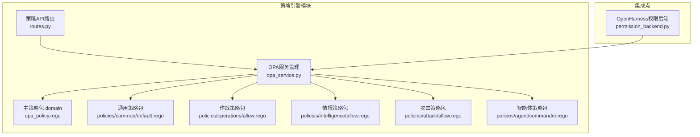
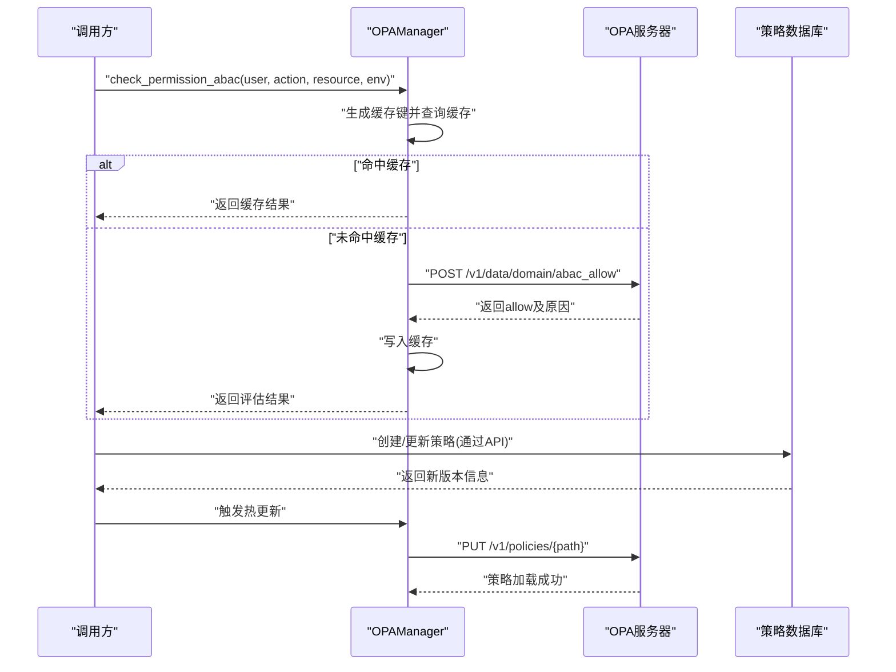
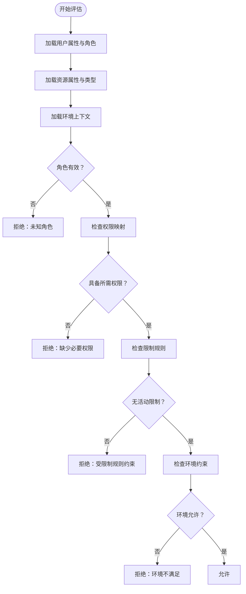
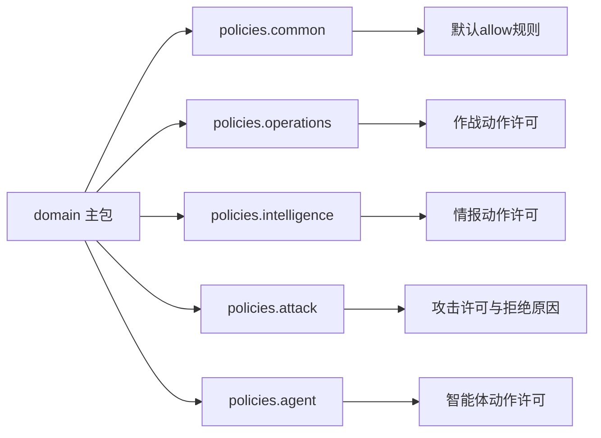
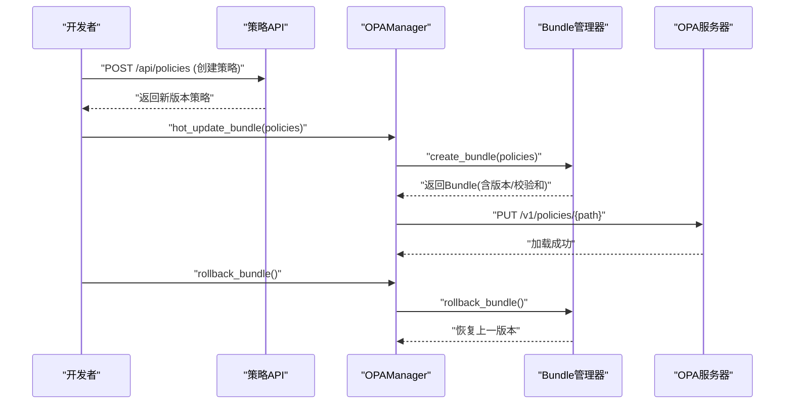
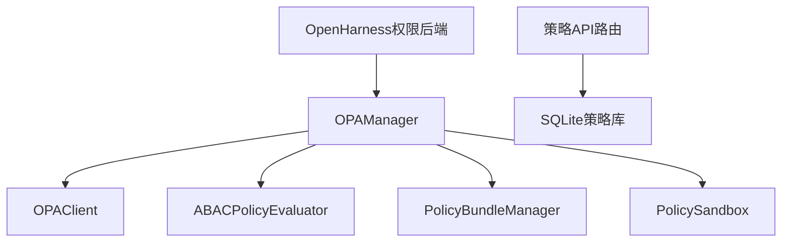

# OPA策略引擎

<cite>
**本文档引用的文件**
- [odap/infra/opa/opa_service.py](file://odap/infra/opa/opa_service.py)
- [odap/infra/opa/routes.py](file://odap/infra/opa/routes.py)
- [odap/infra/opa/opa_policy.rego](file://odap/infra/opa/opa_policy.rego)
- [odap/infra/opa/policies/common/default.rego](file://odap/infra/opa/policies/common/default.rego)
- [odap/infra/opa/policies/operations/allow.rego](file://odap/infra/opa/policies/operations/allow.rego)
- [odap/infra/opa/policies/intelligence/allow.rego](file://odap/infra/opa/policies/intelligence/allow.rego)
- [odap/infra/opa/policies/attack/allow.rego](file://odap/infra/opa/policies/attack/allow.rego)
- [odap/infra/opa/policies/agent/commander.rego](file://odap/infra/opa/policies/agent/commander.rego)
- [odap/infra/opa/__init__.py](file://odap/infra/opa/__init__.py)
- [odap/infra/openharness/permission_backend.py](file://odap/infra/openharness/permission_backend.py)
</cite>

## 目录
1. [简介](#简介)
2. [项目结构](#项目结构)
3. [核心组件](#核心组件)
4. [架构总览](#架构总览)
5. [详细组件分析](#详细组件分析)
6. [依赖分析](#依赖分析)
7. [性能考虑](#性能考虑)
8. [故障排查指南](#故障排查指南)
9. [结论](#结论)
10. [附录](#附录)

## 简介
本文件为本体图-提系统中OPA（开放策略代理）策略引擎的深度技术文档。系统采用ABAC（基于属性的访问控制）策略模型，结合Rego语言实现细粒度的权限控制，并通过策略热更新Bundle机制实现策略的动态演进与回滚。文档涵盖策略规则编写方式、模块组织、规则继承与组合、热更新流程、最佳实践以及常见问题排查。

## 项目结构
OPA策略引擎位于 odap/infra/opa 目录下，主要由Python管理器、Rego策略文件、FastAPI路由与数据库存储构成；同时在 OpenHarness 集成点提供权限后端适配。

**图表来源**
- [odap/infra/opa/opa_service.py:455-717](file://odap/infra/opa/opa_service.py#L455-L717)
- [odap/infra/opa/routes.py:1-422](file://odap/infra/opa/routes.py#L1-L422)
- [odap/infra/opa/opa_policy.rego:1-137](file://odap/infra/opa/opa_policy.rego#L1-L137)
- [odap/infra/opa/policies/common/default.rego:1-26](file://odap/infra/opa/policies/common/default.rego#L1-L26)
- [odap/infra/opa/policies/operations/allow.rego:1-45](file://odap/infra/opa/policies/operations/allow.rego#L1-L45)
- [odap/infra/opa/policies/intelligence/allow.rego:1-37](file://odap/infra/opa/policies/intelligence/allow.rego#L1-L37)
- [odap/infra/opa/policies/attack/allow.rego:1-52](file://odap/infra/opa/policies/attack/allow.rego#L1-L52)
- [odap/infra/opa/policies/agent/commander.rego:1-35](file://odap/infra/opa/policies/agent/commander.rego#L1-L35)
- [odap/infra/openharness/permission_backend.py:1-83](file://odap/infra/openharness/permission_backend.py#L1-L83)

**章节来源**
- [odap/infra/opa/opa_service.py:1-100](file://odap/infra/opa/opa_service.py#L1-L100)
- [odap/infra/opa/routes.py:1-50](file://odap/infra/opa/routes.py#L1-L50)
- [odap/infra/opa/__init__.py:1-5](file://odap/infra/opa/__init__.py#L1-L5)

## 核心组件
- OPAManager：策略管理与调用入口，封装ABAC评估、缓存、批量检查、热更新与回滚、性能指标等能力。
- OPAClient：与OPA服务器交互的REST客户端，负责策略上传、删除与权限检查。
- PolicyBundleManager：策略Bundle的创建、持久化、历史记录与回滚。
- PolicySandbox：策略沙箱，用于What-If分析与策略验证。
- MarkdownPolicyConverter：将Markdown格式策略转换为Rego内容。
- FastAPI路由：提供策略的增删改查、状态切换与版本管理接口。
- ReGo策略包：按功能域划分的策略模块，支持复用与组合。

**章节来源**
- [odap/infra/opa/opa_service.py:455-717](file://odap/infra/opa/opa_service.py#L455-L717)
- [odap/infra/opa/routes.py:96-244](file://odap/infra/opa/routes.py#L96-L244)

## 架构总览
系统采用“策略即代码”的架构，策略以Rego模块形式组织，通过OPA服务管理器进行加载与评估；同时提供Markdown策略编辑与自动转换能力，配合数据库持久化策略元数据与版本信息。

**图表来源**
- [odap/infra/opa/opa_service.py:373-450](file://odap/infra/opa/opa_service.py#L373-L450)
- [odap/infra/opa/routes.py:137-244](file://odap/infra/opa/routes.py#L137-L244)

## 详细组件分析

### ABAC策略模型与Rego实现
- 用户属性：角色、属性集合（如清分级、受限时段、允许IP等）。
- 资源属性：类型、敏感度、地理距离等。
- 环境上下文：时间、IP、工作日等。
- 规则组织：通过包（package）按功能域拆分，主包(domain)聚合各域策略，形成可组合的权限矩阵。

**图表来源**
- [odap/infra/opa/opa_policy.rego:58-130](file://odap/infra/opa/opa_policy.rego#L58-L130)
- [odap/infra/opa/opa_service.py:159-224](file://odap/infra/opa/opa_service.py#L159-L224)

**章节来源**
- [odap/infra/opa/opa_policy.rego:11-137](file://odap/infra/opa/opa_policy.rego#L11-L137)
- [odap/infra/opa/opa_service.py:114-224](file://odap/infra/opa/opa_service.py#L114-L224)

### 策略模块组织与规则继承
- 主策略包(domain)：集中定义角色、权限映射与主allow规则。
- 功能域包(policies.*)：按业务域拆分，如common、operations、intelligence、attack、agent等，每个包独立定义allow规则与辅助函数。
- 继承与组合：通过包内规则组合与辅助谓词（如has_permission、is_protected_target）实现跨域复用。

**图表来源**
- [odap/infra/opa/opa_policy.rego:11-137](file://odap/infra/opa/opa_policy.rego#L11-L137)
- [odap/infra/opa/policies/common/default.rego:1-26](file://odap/infra/opa/policies/common/default.rego#L1-L26)
- [odap/infra/opa/policies/operations/allow.rego:1-45](file://odap/infra/opa/policies/operations/allow.rego#L1-L45)
- [odap/infra/opa/policies/intelligence/allow.rego:1-37](file://odap/infra/opa/policies/intelligence/allow.rego#L1-L37)
- [odap/infra/opa/policies/attack/allow.rego:1-52](file://odap/infra/opa/policies/attack/allow.rego#L1-L52)
- [odap/infra/opa/policies/agent/commander.rego:1-35](file://odap/infra/opa/policies/agent/commander.rego#L1-L35)

**章节来源**
- [odap/infra/opa/policies/common/default.rego:1-26](file://odap/infra/opa/policies/common/default.rego#L1-L26)
- [odap/infra/opa/policies/operations/allow.rego:1-45](file://odap/infra/opa/policies/operations/allow.rego#L1-L45)
- [odap/infra/opa/policies/intelligence/allow.rego:1-37](file://odap/infra/opa/policies/intelligence/allow.rego#L1-L37)
- [odap/infra/opa/policies/attack/allow.rego:1-52](file://odap/infra/opa/policies/attack/allow.rego#L1-L52)
- [odap/infra/opa/policies/agent/commander.rego:1-35](file://odap/infra/opa/policies/agent/commander.rego#L1-L35)

### 策略热更新Bundle机制
- Bundle创建：根据策略内容生成版本号、校验和，持久化当前Bundle与历史记录。
- 自动加载：启动时从本地文件自动加载主策略至OPA。
- 热更新：通过HTTP PUT将策略推送到OPA，支持批量更新与回滚。
- 回滚机制：保留历史Bundle，支持回退至上一版本。

**图表来源**
- [odap/infra/opa/routes.py:137-244](file://odap/infra/opa/routes.py#L137-L244)
- [odap/infra/opa/opa_service.py:227-314](file://odap/infra/opa/opa_service.py#L227-L314)
- [odap/infra/opa/opa_service.py:490-500](file://odap/infra/opa/opa_service.py#L490-L500)

**章节来源**
- [odap/infra/opa/opa_service.py:227-314](file://odap/infra/opa/opa_service.py#L227-L314)
- [odap/infra/opa/routes.py:137-244](file://odap/infra/opa/routes.py#L137-L244)

### 策略配置与最佳实践
- 设计原则
  - 单一职责：每个包聚焦一个业务域，避免规则交叉耦合。
  - 可组合性：通过辅助谓词与数据结构（如role_permissions）提升复用。
  - 可观测性：利用调试辅助规则输出决策原因，便于排障。
- 性能优化
  - 缓存策略：对频繁查询的权限请求进行缓存，降低OPA调用压力。
  - 批量检查：使用批量接口减少网络往返。
  - 策略拆分：将复杂规则拆分为多个小包，提高编译与评估效率。
- 故障排查
  - 健康检查：优先检查OPA服务可用性，异常时降级到本地评估。
  - 日志与错误：记录策略加载、评估与回滚过程的关键事件。
  - What-If分析：通过沙箱模拟不同用户、动作与资源组合，验证策略效果。

**章节来源**
- [odap/infra/opa/opa_service.py:455-717](file://odap/infra/opa/opa_service.py#L455-L717)
- [odap/infra/opa/opa_service.py:316-371](file://odap/infra/opa/opa_service.py#L316-L371)

### 具体策略规则示例
- 角色权限控制
  - 作战域：commander拥有command_units、authorize_attacks、approve_missions等权限；operator仅拥有command_units。
  - 情报域：commander、intelligence_officer、operator、auditor均可view_intelligence，前者还可analyze_data与generate_reports。
- 资源访问限制
  - 攻击目标必须非受保护类别（平民、医疗、历史、外交），且武器射程覆盖目标距离。
- 环境条件检查
  - 默认包提供escalation_risk等风险评估辅助规则，支持在更细粒度策略中使用。

**章节来源**
- [odap/infra/opa/policies/operations/allow.rego:41-44](file://odap/infra/opa/policies/operations/allow.rego#L41-L44)
- [odap/infra/opa/policies/intelligence/allow.rego:31-36](file://odap/infra/opa/policies/intelligence/allow.rego#L31-L36)
- [odap/infra/opa/policies/attack/allow.rego:20-43](file://odap/infra/opa/policies/attack/allow.rego#L20-L43)
- [odap/infra/opa/policies/common/default.rego:19-25](file://odap/infra/opa/policies/common/default.rego#L19-L25)

## 依赖分析
- 模块内聚与解耦
  - OPAManager作为门面，聚合OPAClient、ABAC评估器、Bundle管理器与沙箱，降低上层依赖复杂度。
  - 策略以Rego模块形式独立，通过包命名空间隔离，便于维护与演进。
- 外部依赖
  - OPA服务器：通过REST API进行策略加载与权限评估。
  - SQLite：持久化策略元数据与版本信息，支持策略管理API。
- 集成点
  - OpenHarness权限后端通过OPAManager桥接工具调用与权限判定，实现fail-closed的安全策略。

**图表来源**
- [odap/infra/opa/opa_service.py:455-717](file://odap/infra/opa/opa_service.py#L455-L717)
- [odap/infra/opa/routes.py:17-94](file://odap/infra/opa/routes.py#L17-L94)
- [odap/infra/openharness/permission_backend.py:26-76](file://odap/infra/openharness/permission_backend.py#L26-L76)

**章节来源**
- [odap/infra/opa/opa_service.py:455-717](file://odap/infra/opa/opa_service.py#L455-L717)
- [odap/infra/opa/routes.py:17-94](file://odap/infra/opa/routes.py#L17-L94)
- [odap/infra/openharness/permission_backend.py:1-83](file://odap/infra/openharness/permission_backend.py#L1-L83)

## 性能考虑
- 缓存命中率：通过合理的缓存键与TTL，平衡内存占用与命中率。
- 批量评估：合并多次权限检查为一次批量请求，减少网络开销。
- 策略体积：拆分大策略为多个小包，避免单次编译与评估过重。
- 降级策略：OPA不可用时启用本地评估，保证系统基本可用。

[本节为通用指导，无需列出具体文件来源]

## 故障排查指南
- OPA不可用
  - 现象：调用失败，触发本地降级。
  - 处理：检查OPA服务健康状态，确认网络连通性与策略加载状态。
- 策略加载失败
  - 现象：PUT策略返回错误。
  - 处理：核对Rego语法与包名，确认策略路径正确；必要时回滚到上一版本。
- 权限误判
  - 现象：某用户被拒或放行不符合预期。
  - 处理：启用What-If分析，模拟不同用户、动作与资源组合；检查环境约束与限制规则。
- 缓存异常
  - 现象：缓存命中率异常或数据陈旧。
  - 处理：清理缓存并观察命中率变化；调整TTL与最大容量。

**章节来源**
- [odap/infra/opa/opa_service.py:444-450](file://odap/infra/opa/opa_service.py#L444-L450)
- [odap/infra/opa/opa_service.py:538-583](file://odap/infra/opa/opa_service.py#L538-L583)
- [odap/infra/opa/opa_service.py:316-371](file://odap/infra/opa/opa_service.py#L316-L371)

## 结论
本系统通过ABAC模型与Rego策略包实现了灵活、可观测、可演进的权限控制体系。OPAManager统一管理策略生命周期，结合Bundle热更新与回滚机制，满足生产环境对安全与敏捷的需求。建议在实际部署中遵循模块化、可组合与可观测的设计原则，并配合完善的监控与回滚预案，确保策略变更的可控与安全。

[本节为总结性内容，无需列出具体文件来源]

## 附录

### ReGo语言语法要点
- 包与导入：使用package声明命名空间，import future.keywords.*启用关键字。
- 默认值：default allow := false定义默认拒绝策略。
- 规则断言：通过if子句表达条件集合，支持嵌套与组合。
- 谓词与辅助：通过has_permission、is_protected_target等谓词提升可读性与复用性。

**章节来源**
- [odap/infra/opa/opa_policy.rego:11-137](file://odap/infra/opa/opa_policy.rego#L11-L137)
- [odap/infra/opa/policies/operations/allow.rego:37-44](file://odap/infra/opa/policies/operations/allow.rego#L37-L44)
- [odap/infra/opa/policies/attack/allow.rego:20-51](file://odap/infra/opa/policies/attack/allow.rego#L20-L51)

### OpenHarness集成点
- 权限后端：根据工具名称映射到具体策略包，统一调用OPAManager进行权限检查。
- 错误处理：OPA不可用时采用fail-closed策略，保障系统安全。

**章节来源**
- [odap/infra/openharness/permission_backend.py:1-83](file://odap/infra/openharness/permission_backend.py#L1-L83)