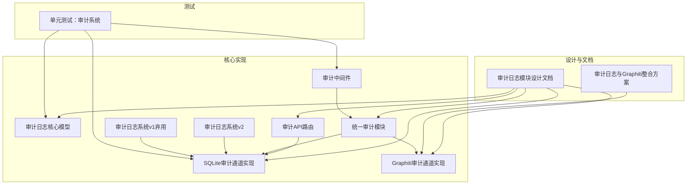
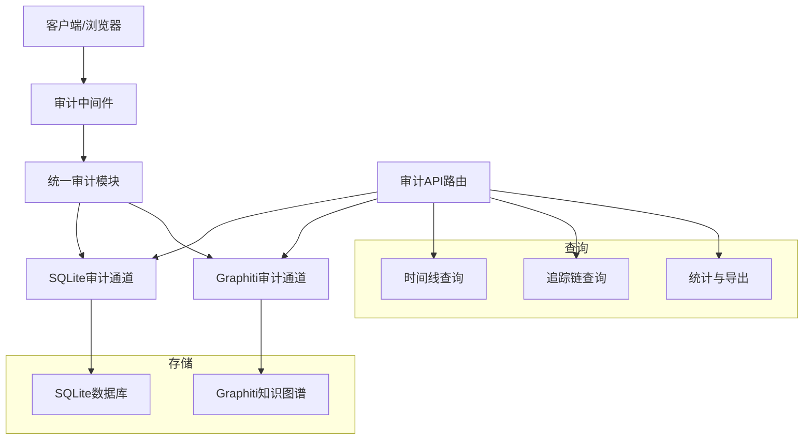
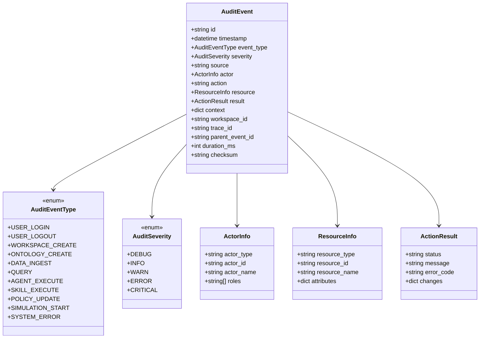
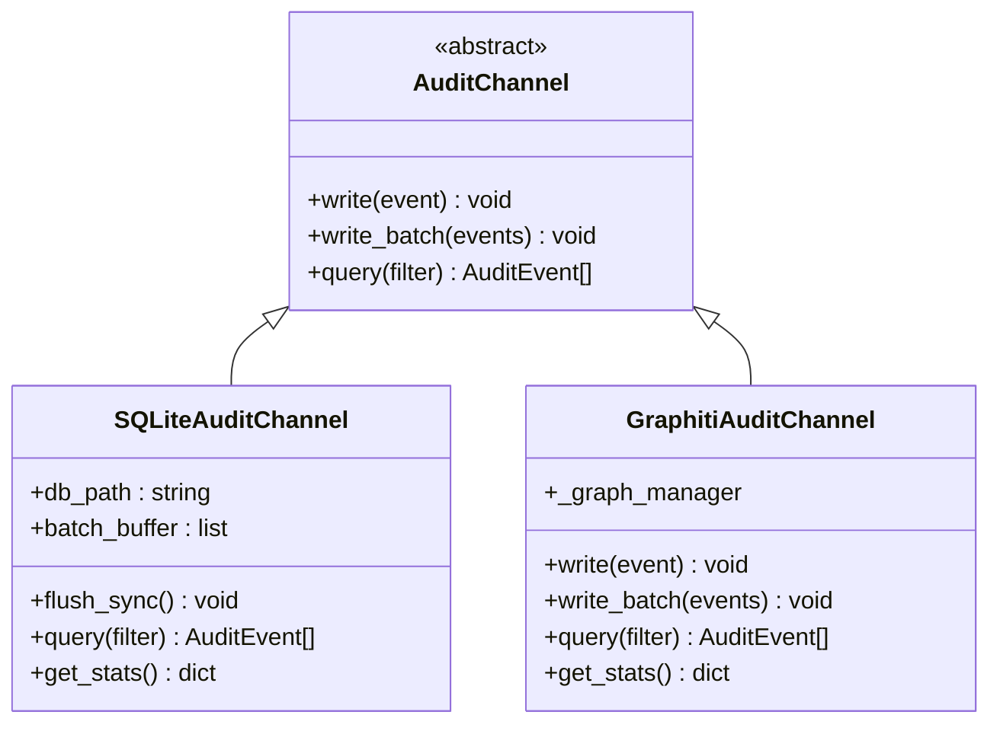
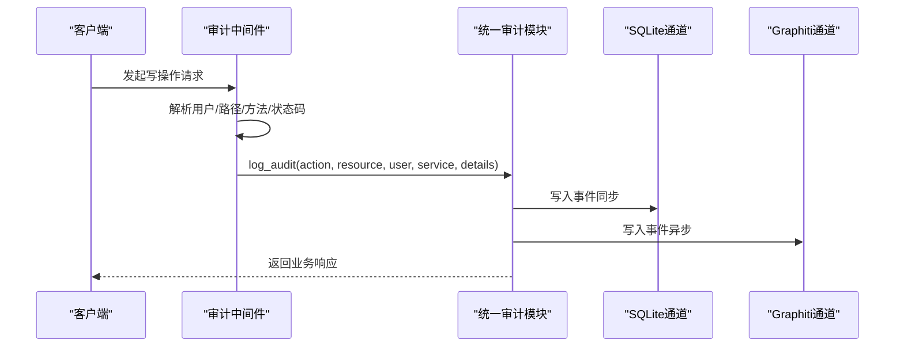
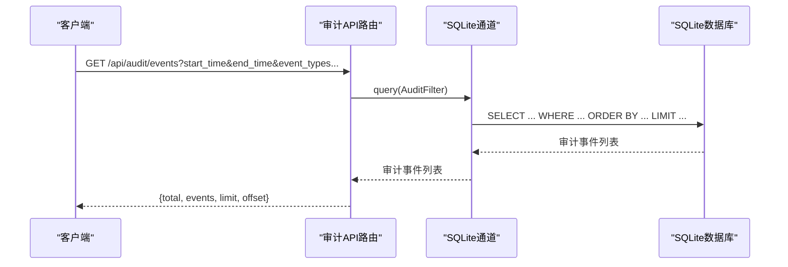
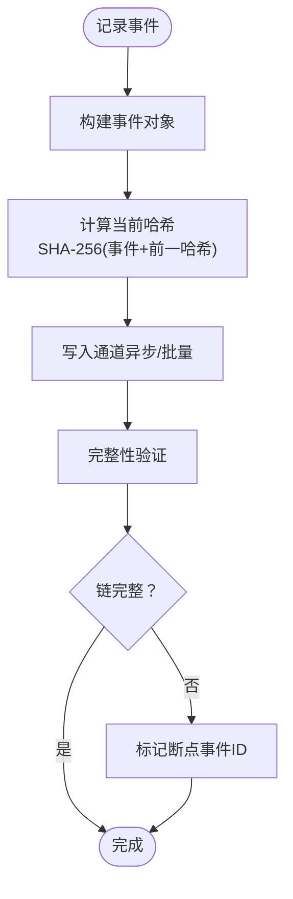
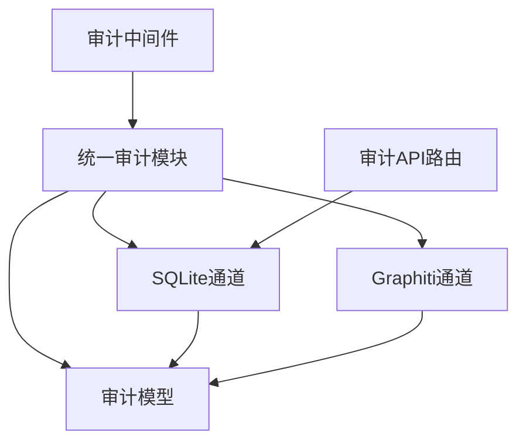
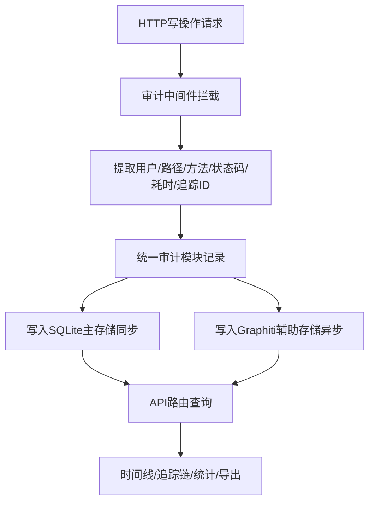

# 审计日志系统

<cite>
**本文引用的文件**
- [审计日志模块设计文档](file://docs/03-modules/audit_log/DESIGN.md)
- [审计日志与Graphiti整合方案](file://docs/03-modules/audit_log/GRAPHITI_INTEGRATION.md)
- [审计日志核心模型](file://odap/infra/security/audit_models.py)
- [SQLite审计通道实现](file://odap/infra/security/audit_sqlite_channel.py)
- [Graphiti审计通道实现](file://odap/infra/security/audit_graphiti_channel.py)
- [统一审计模块](file://odap/infra/security/unified_audit.py)
- [审计API路由](file://odap/infra/security/audit_api.py)
- [审计中间件](file://odap/infra/middleware/audit_middleware.py)
- [审计日志系统v2](file://odap/infra/security/audit_logger_v2.py)
- [审计日志系统v1（弃用）](file://odap/infra/security/audit_logger.py)
- [单元测试：审计系统](file://tests/unit/test_audit_system.py)
</cite>

## 目录
1. [简介](#简介)
2. [项目结构](#项目结构)
3. [核心组件](#核心组件)
4. [架构总览](#架构总览)
5. [详细组件分析](#详细组件分析)
6. [依赖关系分析](#依赖关系分析)
7. [性能考量](#性能考量)
8. [故障排查指南](#故障排查指南)
9. [结论](#结论)
10. [附录](#附录)

## 简介
本审计日志系统是ODAP平台的基础设施层组件，负责对用户操作、Agent行为、系统事件进行全链路追踪与合规记录。系统提供异步写入、批量落盘、防篡改校验链、时间线查询与追踪链分析能力，并支持SQLite与Graphiti双重存储后端，满足从常规审计到图分析、时态查询的多样化需求。系统通过中间件自动拦截写操作、统一审计模块提供简化的装饰器与便捷函数、REST API提供查询与统计能力，形成“自动采集—结构化存储—统一查询”的完整闭环。

## 项目结构
围绕审计日志的关键文件组织如下：
- 设计文档与集成方案：用于定义数据模型、事件类型、通道抽象、存储策略与查询接口
- 核心实现：审计模型、SQLite通道、Graphiti通道、统一审计模块、审计中间件、审计API路由
- 测试：针对事件类型推断、中间件排除规则、SQLite通道写入与查询、统计与过滤等进行验证

**图表来源**
- [审计日志模块设计文档](file://docs/03-modules/audit_log/DESIGN.md)
- [审计日志与Graphiti整合方案](file://docs/03-modules/audit_log/GRAPHITI_INTEGRATION.md)
- [审计日志核心模型](file://odap/infra/security/audit_models.py)
- [SQLite审计通道实现](file://odap/infra/security/audit_sqlite_channel.py)
- [Graphiti审计通道实现](file://odap/infra/security/audit_graphiti_channel.py)
- [统一审计模块](file://odap/infra/security/unified_audit.py)
- [审计API路由](file://odap/infra/security/audit_api.py)
- [审计中间件](file://odap/infra/middleware/audit_middleware.py)
- [审计日志系统v2](file://odap/infra/security/audit_logger_v2.py)
- [审计日志系统v1（弃用）](file://odap/infra/security/audit_logger.py)
- [单元测试：审计系统](file://tests/unit/test_audit_system.py)

**章节来源**
- [审计日志模块设计文档](file://docs/03-modules/audit_log/DESIGN.md)
- [审计日志与Graphiti整合方案](file://docs/03-modules/audit_log/GRAPHITI_INTEGRATION.md)

## 核心组件
- 审计事件模型：定义事件字段、事件类型枚举、严重级别、操作者、资源、结果、上下文、工作空间、追踪ID、持续时间与防篡改校验等
- 通道抽象与实现：SQLite通道（异步缓冲+批量落盘+WAL模式）、Graphiti通道（知识图谱存储+关系建模）
- 统一审计模块：提供装饰器与便捷函数，自动记录写操作；同时写入SQLite主存储与Graphiti辅助存储
- 审计中间件：自动拦截写操作请求，提取用户、路径、方法、状态码、耗时等信息并记录
- 审计API路由：提供事件查询、时间线、追踪链、统计、导出等REST接口
- v2审计系统：引入异步通道、批量落盘、CRITICAL同步写入、防篡改校验链与时间线查询

**章节来源**
- [审计日志核心模型](file://odap/infra/security/audit_models.py)
- [SQLite审计通道实现](file://odap/infra/security/audit_sqlite_channel.py)
- [Graphiti审计通道实现](file://odap/infra/security/audit_graphiti_channel.py)
- [统一审计模块](file://odap/infra/security/unified_audit.py)
- [审计中间件](file://odap/infra/middleware/audit_middleware.py)
- [审计API路由](file://odap/infra/security/audit_api.py)
- [审计日志系统v2](file://odap/infra/security/audit_logger_v2.py)

## 架构总览
系统采用“中间件自动采集 + 统一审计模块 + 多通道存储 + REST API查询”的架构。写操作通过中间件自动触发统一审计模块，后者根据配置选择SQLite主存储与Graphiti辅助存储；查询阶段通过API路由对接SQLite通道或Graphiti通道，支持时间线、追踪链、统计与导出。

**图表来源**
- [审计中间件](file://odap/infra/middleware/audit_middleware.py)
- [统一审计模块](file://odap/infra/security/unified_audit.py)
- [SQLite审计通道实现](file://odap/infra/security/audit_sqlite_channel.py)
- [Graphiti审计通道实现](file://odap/infra/security/audit_graphiti_channel.py)
- [审计API路由](file://odap/infra/security/audit_api.py)

## 详细组件分析

### 数据模型与事件类型
- 事件模型包含：事件ID、时间戳、事件类型、严重级别、来源、操作者、动作、资源、结果、上下文、工作空间ID、追踪ID、父事件ID、持续时间、校验字段等
- 事件类型覆盖用户登录/登出、工作空间创建/切换/删除、本体创建/更新/版本/回滚、Agent执行/决策/错误、Skill注册/执行/禁用、策略更新/评估/违规、推演开始/完成/回滚、系统错误/健康/配置、数据摄入、查询、问答、反馈等
- 严重级别：DEBUG/INFO/WARN/ERROR/CRITICAL
- 资源信息包含类型、ID、名称与受影响属性
- 结果信息包含状态、消息、错误码与变更详情

**图表来源**
- [审计日志核心模型](file://odap/infra/security/audit_models.py)

**章节来源**
- [审计日志核心模型](file://odap/infra/security/audit_models.py)

### 通道抽象与实现
- 通道抽象定义：写入单个事件、批量写入、查询、统计、关闭等接口
- SQLite通道：异步缓冲+批量落盘+WAL模式；支持SQL查询、JSON字段序列化、校验和计算；提供统计接口
- Graphiti通道：将审计日志作为实体写入知识图谱，创建用户/资源/服务实体与EXECUTED/AFFECTED/GENERATED关系；支持Neo4j Cypher查询与搜索回退

**图表来源**
- [SQLite审计通道实现](file://odap/infra/security/audit_sqlite_channel.py)
- [Graphiti审计通道实现](file://odap/infra/security/audit_graphiti_channel.py)

**章节来源**
- [SQLite审计通道实现](file://odap/infra/security/audit_sqlite_channel.py)
- [Graphiti审计通道实现](file://odap/infra/security/audit_graphiti_channel.py)

### 统一审计模块与中间件
- 统一审计模块提供装饰器与便捷函数，自动记录写操作，同时写入SQLite与Graphiti；支持事件类型推断、统计、查询
- 审计中间件自动拦截写操作（POST/PUT/DELETE/PATCH），排除静态资源与审计API自身；提取用户、路径、方法、状态码、耗时与追踪ID并记录

**图表来源**
- [审计中间件](file://odap/infra/middleware/audit_middleware.py)
- [统一审计模块](file://odap/infra/security/unified_audit.py)
- [SQLite审计通道实现](file://odap/infra/security/audit_sqlite_channel.py)
- [Graphiti审计通道实现](file://odap/infra/security/audit_graphiti_channel.py)

**章节来源**
- [统一审计模块](file://odap/infra/security/unified_audit.py)
- [审计中间件](file://odap/infra/middleware/audit_middleware.py)

### 审计API路由与查询
- 提供事件查询、事件详情、时间线、追踪链、统计、导出等REST接口
- 支持按时间范围、事件类型、严重级别、操作者、资源、工作空间、追踪ID、结果状态、关键词等过滤
- 提供总数统计与分页查询

**图表来源**
- [审计API路由](file://odap/infra/security/audit_api.py)
- [SQLite审计通道实现](file://odap/infra/security/audit_sqlite_channel.py)

**章节来源**
- [审计API路由](file://odap/infra/security/audit_api.py)

### v2审计系统与防篡改校验链
- v2引入异步通道、批量落盘、CRITICAL同步写入、防篡改校验链（SHA-256链式哈希）、时间线与追踪链查询
- 通过HashChain维护事件链，支持完整性验证与断点检测

**图表来源**
- [审计日志系统v2](file://odap/infra/security/audit_logger_v2.py)

**章节来源**
- [审计日志系统v2](file://odap/infra/security/audit_logger_v2.py)

### Hook系统集成（设计）
- 设计文档中规划通过Hook系统自动拦截操作，无需业务显式调用
- 预留Pre/Post钩子，自动记录开始时间与结果，构造资源信息与结果状态

**章节来源**
- [审计日志模块设计文档](file://docs/03-modules/audit_log/DESIGN.md)

## 依赖关系分析
- 统一审计模块依赖：审计模型、SQLite通道、Graphiti通道、安全配置
- 审计中间件依赖：JWT解码、安全配置、统一审计模块
- 审计API路由依赖：SQLite通道、审计模型、统一审计模块
- SQLite通道依赖：审计模型、JSON序列化、哈希计算
- Graphiti通道依赖：GraphManager、Neo4j驱动或搜索回退

**图表来源**
- [统一审计模块](file://odap/infra/security/unified_audit.py)
- [审计中间件](file://odap/infra/middleware/audit_middleware.py)
- [审计API路由](file://odap/infra/security/audit_api.py)
- [SQLite审计通道实现](file://odap/infra/security/audit_sqlite_channel.py)
- [Graphiti审计通道实现](file://odap/infra/security/audit_graphiti_channel.py)
- [审计日志核心模型](file://odap/infra/security/audit_models.py)

**章节来源**
- [统一审计模块](file://odap/infra/security/unified_audit.py)
- [审计中间件](file://odap/infra/middleware/audit_middleware.py)
- [审计API路由](file://odap/infra/security/audit_api.py)
- [SQLite审计通道实现](file://odap/infra/security/audit_sqlite_channel.py)
- [Graphiti审计通道实现](file://odap/infra/security/audit_graphiti_channel.py)
- [审计日志核心模型](file://odap/infra/security/audit_models.py)

## 性能考量
- 写入延迟：<5ms（异步+批量）
- 查询延迟：P95 <200ms（分区索引+时间范围剪枝）
- 吞吐量：>10K events/s（批量写入+WAL模式）
- 存储效率：压缩率>60%（JSON列压缩+冷数据归档）
- 可靠性：零丢失（WAL+CRITICAL级别同步写入）

**章节来源**
- [审计日志模块设计文档](file://docs/03-modules/audit_log/DESIGN.md)

## 故障排查指南
- 中间件排除规则：/docs、/openapi.json、/redoc、/health、/favicon.ico、/static、/api/audit等路径与前缀不记录
- 事件类型推断：根据action/service关键字映射到具体事件类型，若无法识别则回落至SYSTEM_HEALTH
- SQLite通道：批量缓冲+WAL模式，异常时会回滚并记录错误；可通过统计接口查看缓冲大小与事件总数
- Graphiti通道：依赖GraphManager与Neo4j驱动，查询失败时回退到搜索；需确认图数据库连通性
- API路由：支持严重级别与事件类型别名映射，查询失败抛出HTTP 500；可先用/get/logs快速验证

**章节来源**
- [审计中间件](file://odap/infra/middleware/audit_middleware.py)
- [统一审计模块](file://odap/infra/security/unified_audit.py)
- [SQLite审计通道实现](file://odap/infra/security/audit_sqlite_channel.py)
- [Graphiti审计通道实现](file://odap/infra/security/audit_graphiti_channel.py)
- [审计API路由](file://odap/infra/security/audit_api.py)
- [单元测试：审计系统](file://tests/unit/test_audit_system.py)

## 结论
本审计日志系统通过统一模型与多通道存储，实现了从自动采集到结构化存储再到统一查询的完整闭环。SQLite通道满足常规审计与合规需求，Graphiti通道提供图分析与时态查询能力。中间件与统一模块降低了业务侵入成本，API路由提供了丰富的查询与统计能力。v2版本进一步强化了可靠性与完整性保障。结合最佳实践（日志级别、敏感信息脱敏、存储策略），系统可在保证性能的同时满足企业级审计与合规要求。

## 附录

### 审计日志生成机制流程

**图表来源**
- [审计中间件](file://odap/infra/middleware/audit_middleware.py)
- [统一审计模块](file://odap/infra/security/unified_audit.py)
- [审计API路由](file://odap/infra/security/audit_api.py)

### 查询与分析功能要点
- 实时监控：中间件自动记录写操作，统一模块写入存储
- 历史查询：API路由支持按时间、事件类型、严重级别、操作者、资源、工作空间、追踪ID、结果状态、关键词过滤
- 趋势分析：统计接口提供按严重级别与事件类型的分布
- 追踪链：按trace_id查询事件链，还原操作时序

**章节来源**
- [审计API路由](file://odap/infra/security/audit_api.py)
- [统一审计模块](file://odap/infra/security/unified_audit.py)

### 配置最佳实践
- 日志级别设置：按风险等级区分DEBUG/INFO/WARN/ERROR/CRITICAL，CRITICAL级别强制同步写入
- 敏感信息脱敏：在统一模块与中间件中对IP、UA等敏感字段进行脱敏处理
- 存储策略：INFO级保留90天，WARN级180天，ERROR级365天，CRITICAL永久；冷数据归档与压缩
- 通道选择：常规审计使用SQLite，需要图分析与时态查询使用Graphiti

**章节来源**
- [审计日志模块设计文档](file://docs/03-modules/audit_log/DESIGN.md)
- [统一审计模块](file://odap/infra/security/unified_audit.py)

### 实际应用场景与合规要求
- 操作追踪：用户登录/登出、工作空间切换、本体版本变更、Agent执行与错误
- 合规审计：系统健康、配置变更、策略违规、数据摄入与查询
- 安全监控：异常操作告警、权限拒绝、错误事件统计与追踪链分析

**章节来源**
- [审计日志模块设计文档](file://docs/03-modules/audit_log/DESIGN.md)
- [统一审计模块](file://odap/infra/security/unified_audit.py)