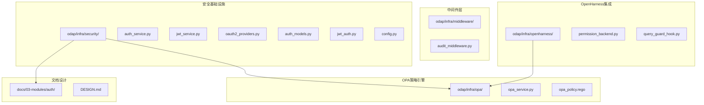
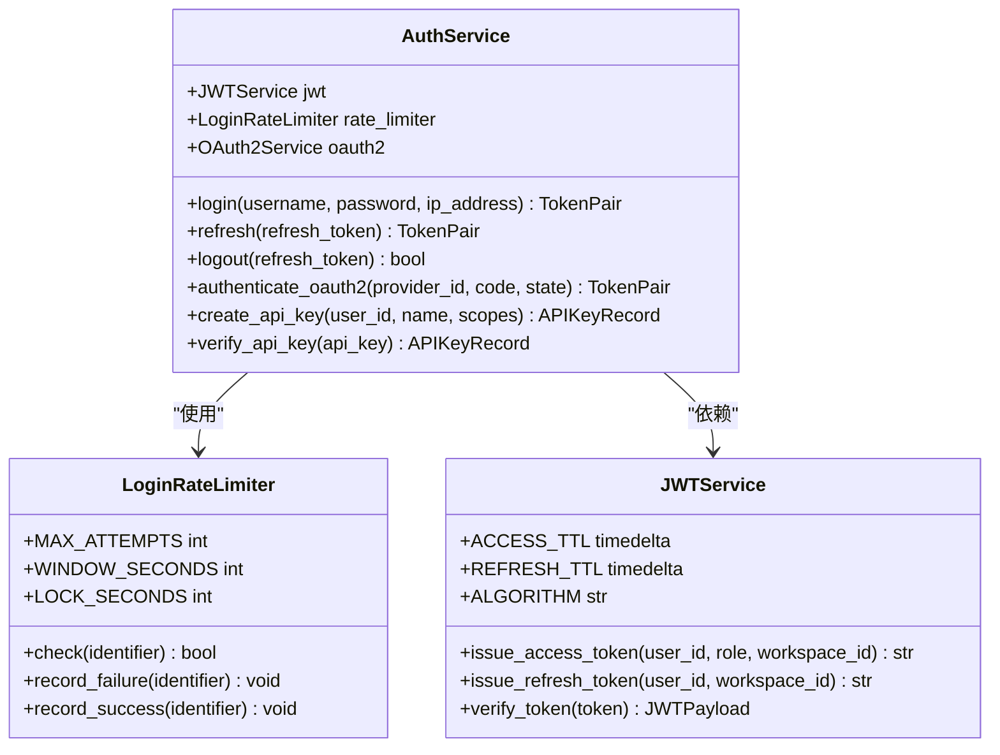
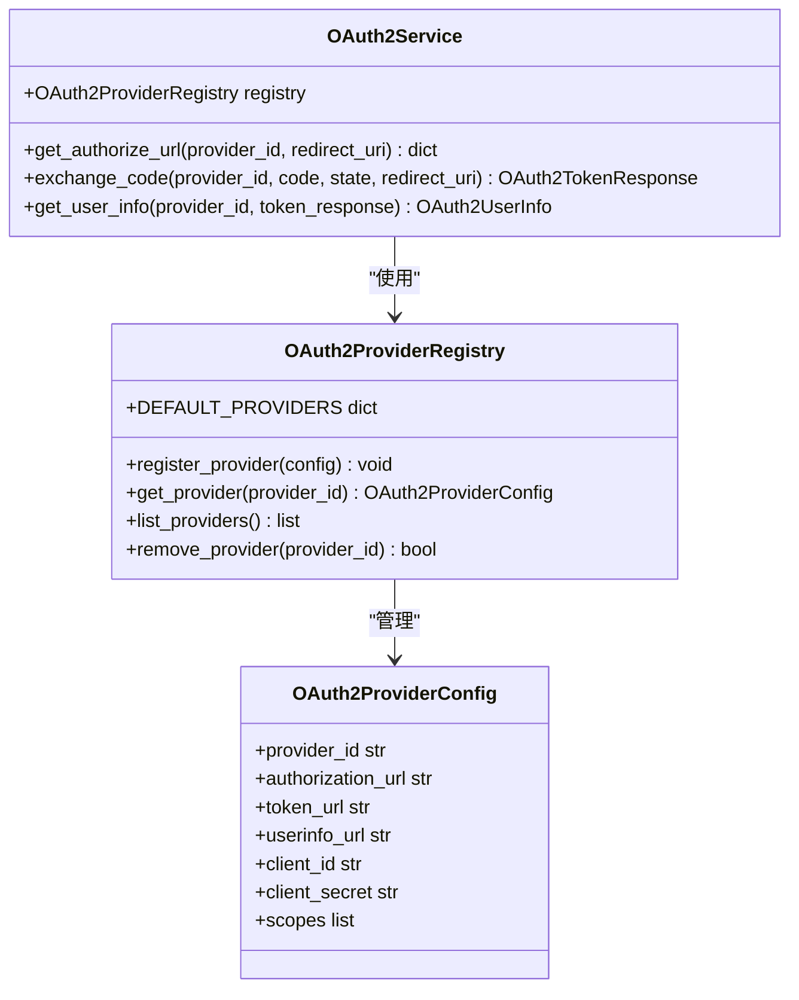
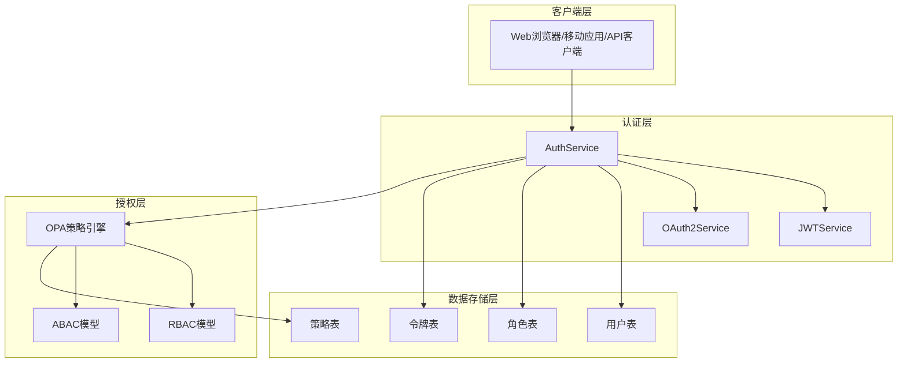
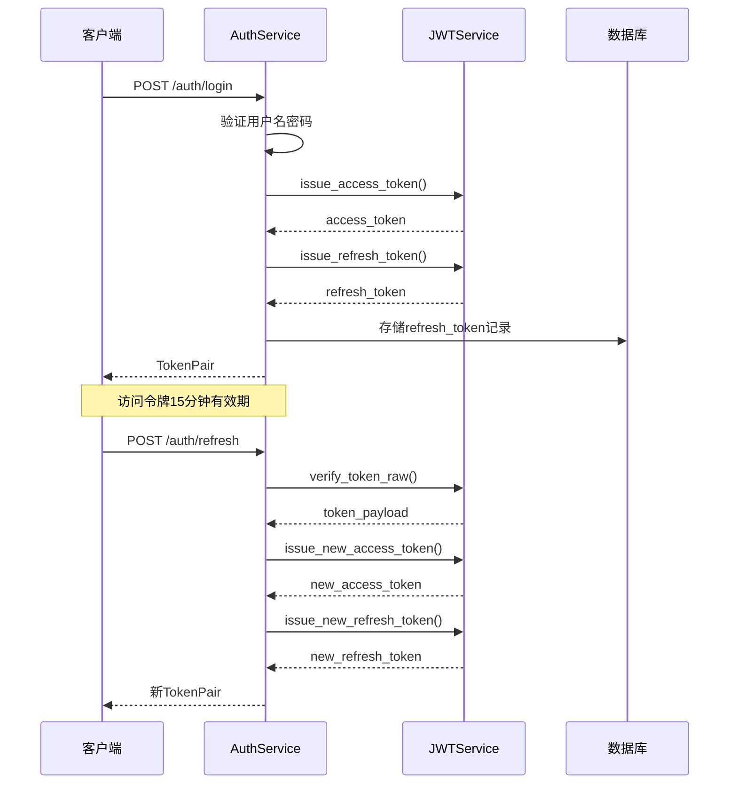
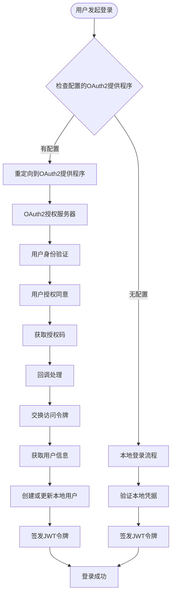
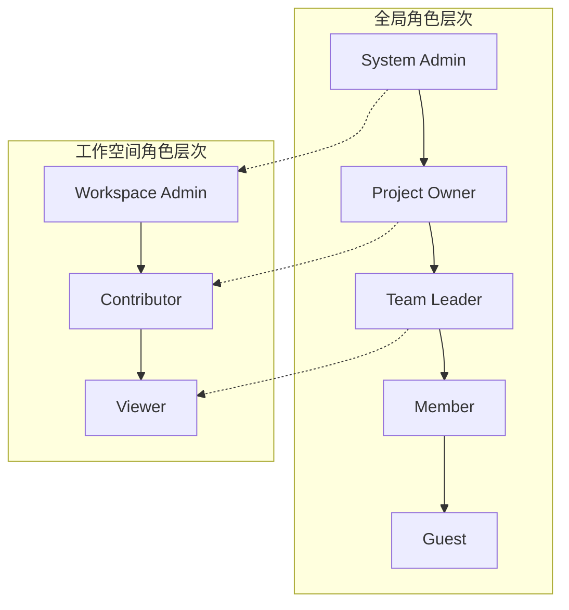
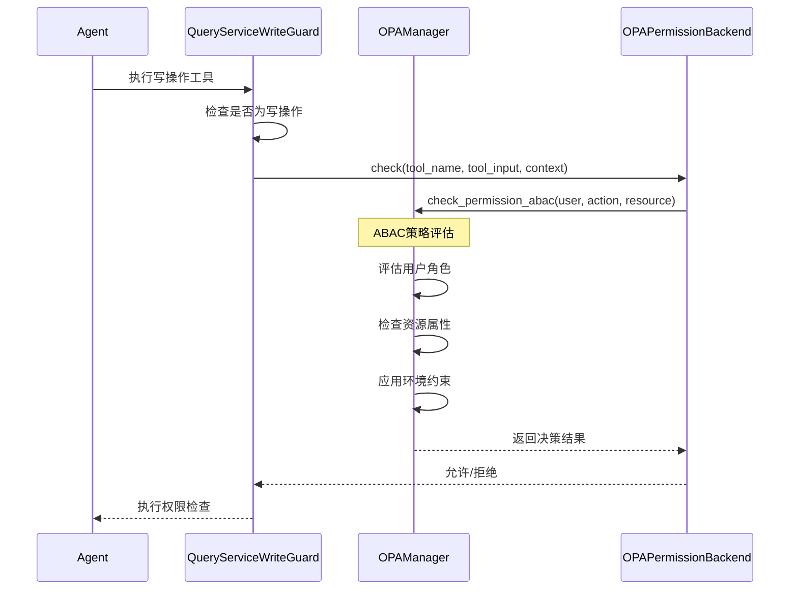
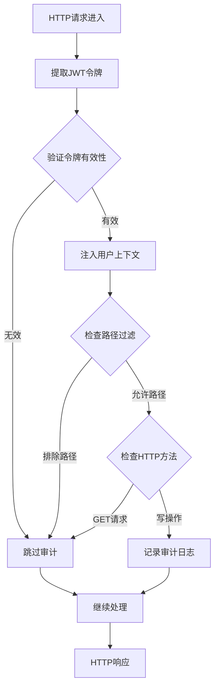
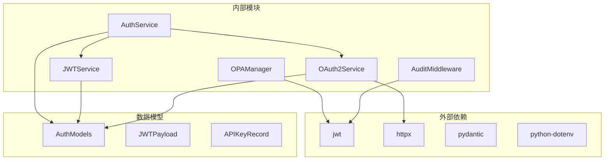

# 权限控制系统

<cite>
**本文档引用的文件**
- [auth_service.py](file://odap/infra/security/auth_service.py)
- [jwt_service.py](file://odap/infra/security/jwt_service.py)
- [oauth2_providers.py](file://odap/infra/security/oauth2_providers.py)
- [auth_models.py](file://odap/infra/security/auth_models.py)
- [jwt_auth.py](file://odap/infra/security/jwt_auth.py)
- [audit_middleware.py](file://odap/infra/middleware/audit_middleware.py)
- [permission_backend.py](file://odap/infra/openharness/permission_backend.py)
- [opa_service.py](file://odap/infra/opa/opa_service.py)
- [opa_policy.rego](file://odap/infra/opa/opa_policy.rego)
- [query_guard_hook.py](file://odap/infra/openharness/query_guard_hook.py)
- [config.py](file://odap/infra/security/config.py)
- [DESIGN.md](file://docs/03-modules/auth/DESIGN.md)
- [test_oauth2.py](file://tests/unit/test_oauth2.py)
- [test_roles.py](file://tests/unit/test_roles.py)
</cite>

## 目录
1. [简介](#简介)
2. [项目结构](#项目结构)
3. [核心组件](#核心组件)
4. [架构概览](#架构概览)
5. [详细组件分析](#详细组件分析)
6. [依赖关系分析](#依赖关系分析)
7. [性能考虑](#性能考虑)
8. [故障排除指南](#故障排除指南)
9. [结论](#结论)

## 简介

权限控制系统是ODAP平台的核心安全基础设施，采用多层防护架构，结合基于角色的权限控制模型（RBAC）、OAuth2/OIDC单点登录、JWT无状态认证和OPA策略引擎，构建了完整的身份认证与授权解决方案。

该系统支持多种认证方式：
- **本地账号密码认证**：基于bcrypt密码哈希的安全用户管理
- **OAuth2/OIDC单点登录**：支持Google、GitHub等主流认证提供商
- **API Key认证**：为系统集成和自动化脚本提供安全访问
- **JWT无状态认证**：15分钟访问令牌+7天刷新令牌的令牌管理

## 项目结构

权限控制系统的文件组织遵循模块化设计原则，主要分布在以下目录：



**图表来源**
- [auth_service.py:1-439](file://odap/infra/security/auth_service.py#L1-L439)
- [opa_service.py:1-750](file://odap/infra/opa/opa_service.py#L1-L750)

**章节来源**
- [auth_service.py:1-439](file://odap/infra/security/auth_service.py#L1-L439)
- [DESIGN.md:1-432](file://docs/03-modules/auth/DESIGN.md#L1-L432)

## 核心组件

### 认证服务（AuthService）

认证服务是权限控制的核心入口，提供统一的认证管理接口：



**图表来源**
- [auth_service.py:82-439](file://odap/infra/security/auth_service.py#L82-L439)
- [jwt_service.py:19-72](file://odap/infra/security/jwt_service.py#L19-L72)

### OAuth2提供程序管理

系统支持多种OAuth2提供程序，包括Google、GitHub等主流服务商：



**图表来源**
- [oauth2_providers.py:57-131](file://odap/infra/security/oauth2_providers.py#L57-L131)
- [oauth2_providers.py:133-264](file://odap/infra/security/oauth2_providers.py#L133-L264)

**章节来源**
- [auth_service.py:82-439](file://odap/infra/security/auth_service.py#L82-L439)
- [oauth2_providers.py:1-264](file://odap/infra/security/oauth2_providers.py#L1-L264)

## 架构概览

权限控制系统采用分层架构设计，确保安全性和可扩展性：



**图表来源**
- [auth_service.py:82-156](file://odap/infra/security/auth_service.py#L82-L156)
- [opa_service.py:30-52](file://odap/infra/opa/opa_service.py#L30-L52)

## 详细组件分析

### JWT认证机制

JWT（JSON Web Token）是系统的核心认证载体，采用HS256算法进行签名：

#### 令牌结构设计

| 字段 | 类型 | 描述 | 示例 |
|------|------|------|------|
| iss | string | 签发者 | "odap" |
| sub | string | 用户标识 | "user_id" |
| exp | integer | 过期时间 | Unix时间戳 |
| iat | integer | 签发时间 | Unix时间戳 |
| role | string | 全局角色 | "admin" |
| ws_id | string | 工作空间ID | "workspace_123" |
| ws_role | string | 工作空间角色 | "project_owner" |

#### 令牌生命周期管理



**图表来源**
- [auth_service.py:118-209](file://odap/infra/security/auth_service.py#L118-L209)
- [jwt_service.py:29-54](file://odap/infra/security/jwt_service.py#L29-L54)

**章节来源**
- [jwt_service.py:1-72](file://odap/infra/security/jwt_service.py#L1-L72)
- [auth_service.py:118-209](file://odap/infra/security/auth_service.py#L118-L209)

### OAuth2单点登录集成

系统支持OAuth2授权码流程，结合PKCE（Proof Key for Code Exchange）增强安全性：

#### OAuth2流程详解



**图表来源**
- [oauth2_providers.py:138-168](file://odap/infra/security/oauth2_providers.py#L138-L168)
- [auth_service.py:359-404](file://odap/infra/security/auth_service.py#L359-L404)

**章节来源**
- [oauth2_providers.py:1-264](file://odap/infra/security/oauth2_providers.py#L1-L264)
- [auth_service.py:359-404](file://odap/infra/security/auth_service.py#L359-L404)

### RBAC权限控制模型

系统采用基于角色的权限控制模型，支持全局角色和工作空间角色的双重权限管理：

#### 角色层次结构



#### 权限映射规则

系统通过策略映射表将工具名称映射到具体的权限规则：

| 工具名称 | 权限策略 |
|----------|----------|
| attack_target | policies.attack.allow |
| command_unit | policies.operations.allow |
| move | policies.operations.allow |
| defend | policies.operations.allow |
| radar_search | policies.intelligence.allow |
| view_intelligence | policies.intelligence.allow |
| analyze_data | policies.intelligence.allow |
| generate_reports | policies.intelligence.allow |

**章节来源**
- [permission_backend.py:10-22](file://odap/infra/openharness/permission_backend.py#L10-L22)
- [opa_service.py:114-225](file://odap/infra/opa/opa_service.py#L114-L225)

### OPA策略引擎集成

OPA（Open Policy Agent）提供强大的策略执行能力，支持ABAC（基于属性的访问控制）：

#### 策略评估流程



**图表来源**
- [query_guard_hook.py:40-82](file://odap/infra/openharness/query_guard_hook.py#L40-L82)
- [permission_backend.py:40-68](file://odap/infra/openharness/permission_backend.py#L40-L68)

**章节来源**
- [opa_service.py:373-450](file://odap/infra/opa/opa_service.py#L373-L450)
- [permission_backend.py:1-83](file://odap/infra/openharness/permission_backend.py#L1-L83)

### 中间件拦截机制

系统通过中间件实现统一的权限拦截和审计功能：

#### 审计中间件设计



**图表来源**
- [audit_middleware.py:54-111](file://odap/infra/middleware/audit_middleware.py#L54-L111)

**章节来源**
- [audit_middleware.py:1-112](file://odap/infra/middleware/audit_middleware.py#L1-L112)

## 依赖关系分析

权限控制系统的依赖关系呈现清晰的分层结构：



**图表来源**
- [auth_service.py:22-27](file://odap/infra/security/auth_service.py#L22-L27)
- [opa_service.py:25-27](file://odap/infra/opa/opa_service.py#L25-L27)

**章节来源**
- [auth_models.py:1-128](file://odap/infra/security/auth_models.py#L1-L128)
- [config.py:1-80](file://odap/infra/security/config.py#L1-L80)

## 性能考虑

### 缓存策略

系统实现了多层次的缓存机制以提升性能：

| 缓存类型 | TTL | 最大容量 | 命中率 | 用途 |
|----------|-----|----------|--------|------|
| 策略缓存 | 300秒 | 1000条 | 可配置 | OPA策略结果缓存 |
| 用户会话 | 15分钟 | 无限 | 高 | JWT令牌验证 |
| API密钥 | 3600秒 | 100条 | 中等 | API Key验证 |

### 性能监控指标

系统提供详细的性能监控能力：

```python
{
    "cache": {
        "hits": 1000,
        "misses": 50,
        "total": 1050,
        "hit_rate_percent": 95.2
    },
    "policy_versions": {
        "current": "2.0.0",
        "previous": "1.0.0"
    },
    "bundle_version": "1.0.1683456789",
    "mode": "opa",
    "history_count": 1200
}
```

## 故障排除指南

### 常见问题诊断

#### JWT令牌验证失败

**症状**：401未认证错误
**可能原因**：
1. 令牌过期（默认15分钟）
2. 签名算法不匹配
3. 秘钥配置错误

**解决步骤**：
1. 检查JWT_SECRET配置
2. 验证令牌签名算法
3. 确认令牌未过期

#### OAuth2认证失败

**症状**：OAuth2回调返回错误
**可能原因**：
1. 客户端ID/密钥配置错误
2. 回调URL配置不匹配
3. 网络连接问题

**解决步骤**：
1. 验证OAuth2提供程序配置
2. 检查回调URL设置
3. 确认网络可达性

#### OPA策略执行异常

**症状**：权限检查返回错误
**可能原因**：
1. OPA服务器不可用
2. 策略规则配置错误
3. 缓存数据过期

**解决步骤**：
1. 检查OPA服务器状态
2. 验证策略规则语法
3. 清除策略缓存

**章节来源**
- [jwt_auth.py:14-63](file://odap/infra/security/jwt_auth.py#L14-L63)
- [oauth2_providers.py:170-217](file://odap/infra/security/oauth2_providers.py#L170-L217)
- [opa_service.py:444-450](file://odap/infra/opa/opa_service.py#L444-L450)

## 结论

ODAP权限控制系统通过模块化设计和分层架构，构建了一个功能完整、安全可靠的权限管理解决方案。系统的主要优势包括：

1. **多认证方式支持**：统一的认证入口，支持本地、OAuth2、API Key等多种认证方式
2. **灵活的授权模型**：RBAC+ABAC混合模型，支持细粒度的权限控制
3. **高可用性设计**：OPA策略引擎提供强大的策略执行能力，支持热更新和回滚
4. **完善的审计功能**：自动记录关键操作，满足合规要求
5. **优秀的性能表现**：多层缓存机制和优化的策略执行

该系统为ODAP平台提供了坚实的安全基础，能够满足复杂的企业级权限管理需求。通过持续的优化和扩展，可以进一步提升系统的安全性和可用性。