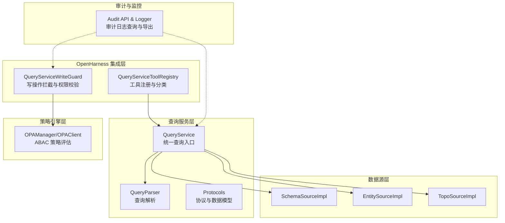
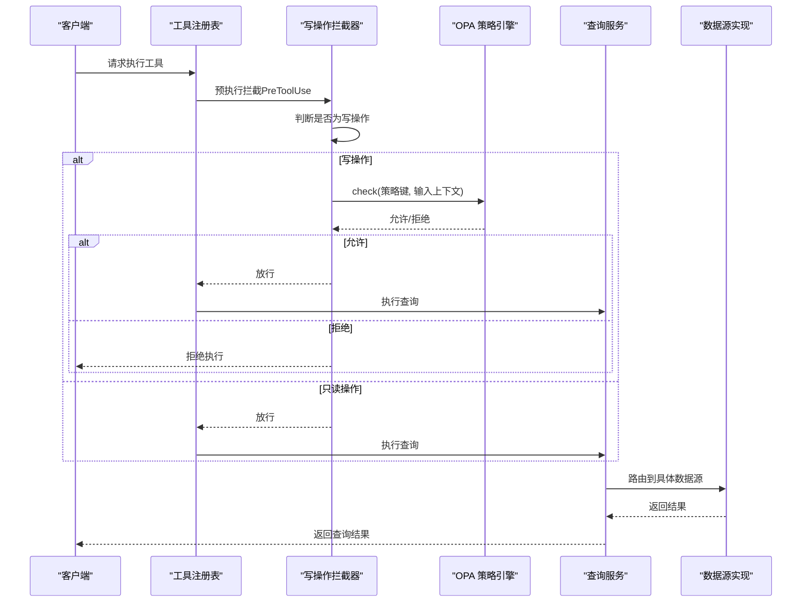
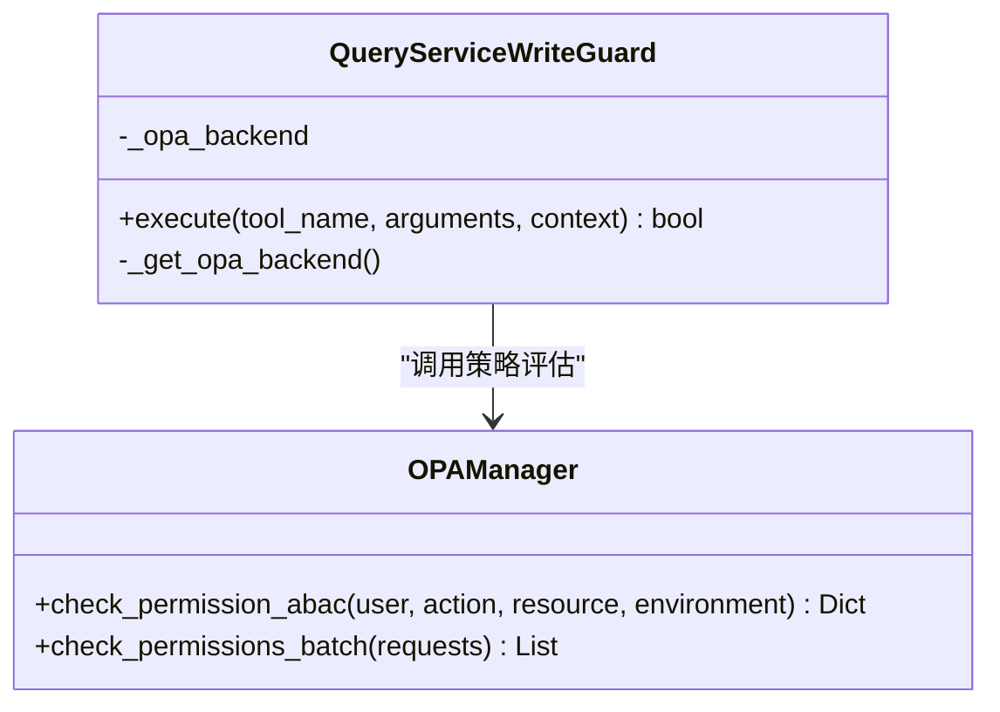
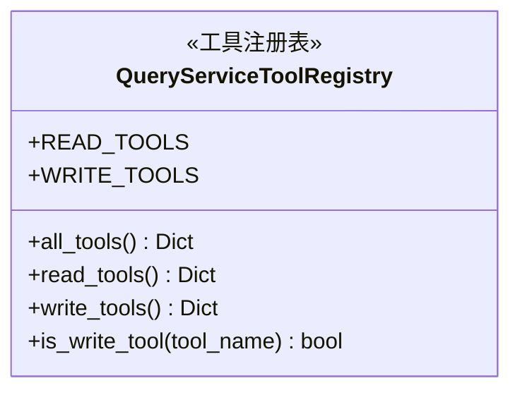
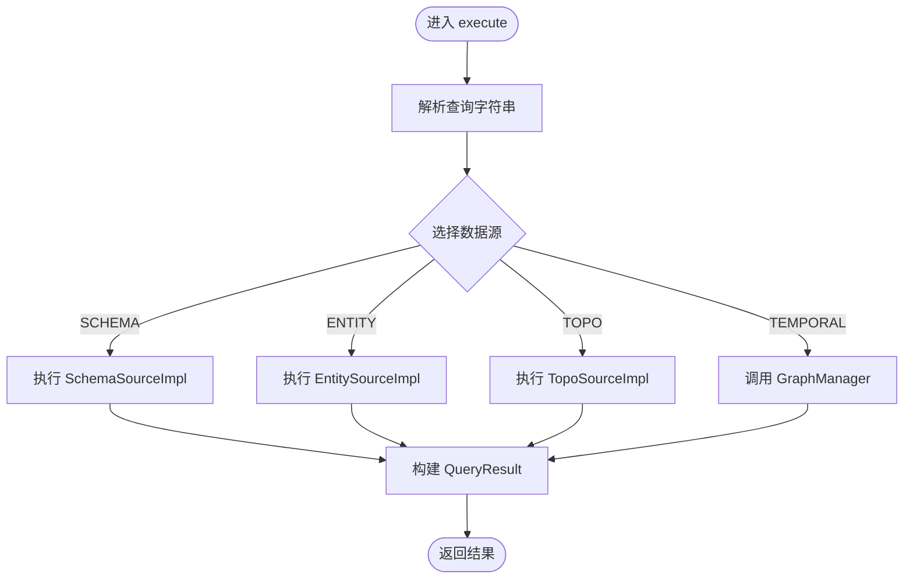
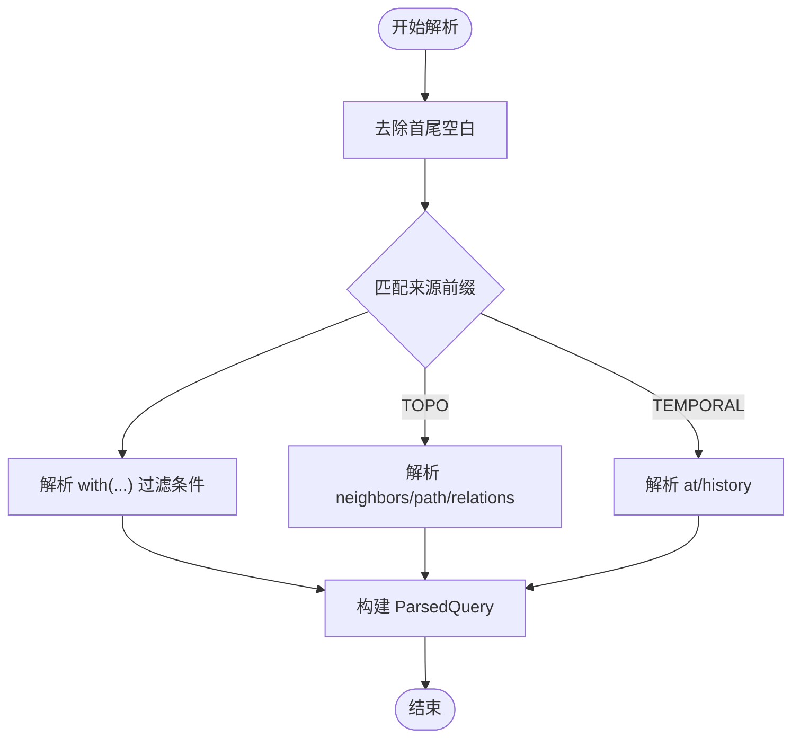
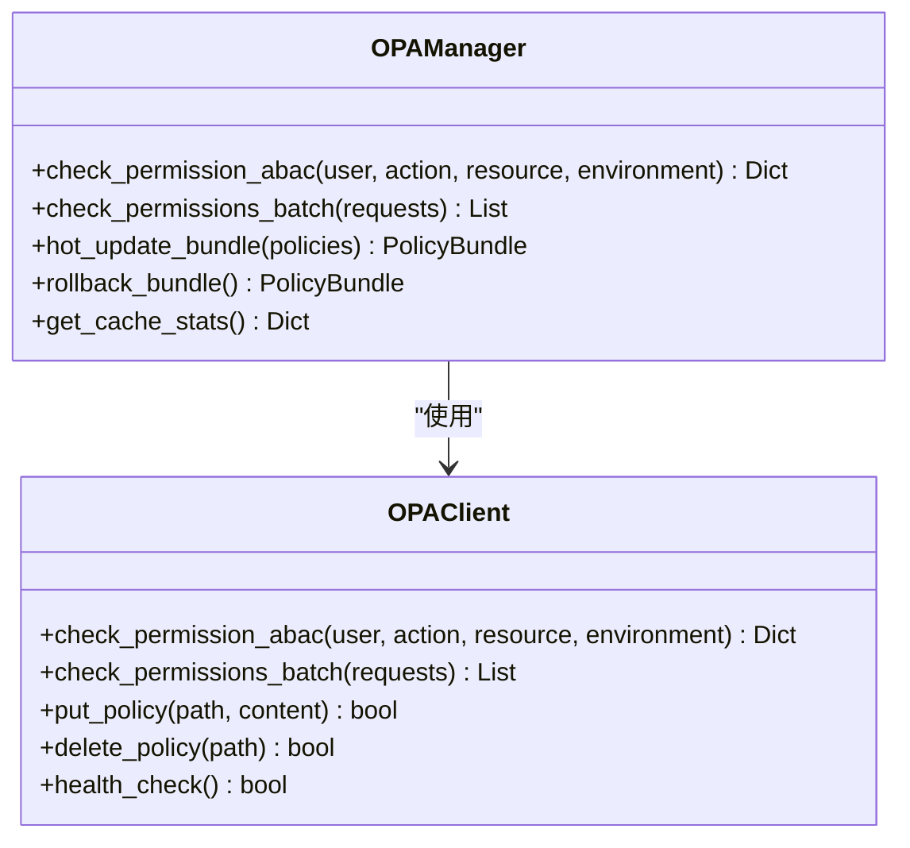
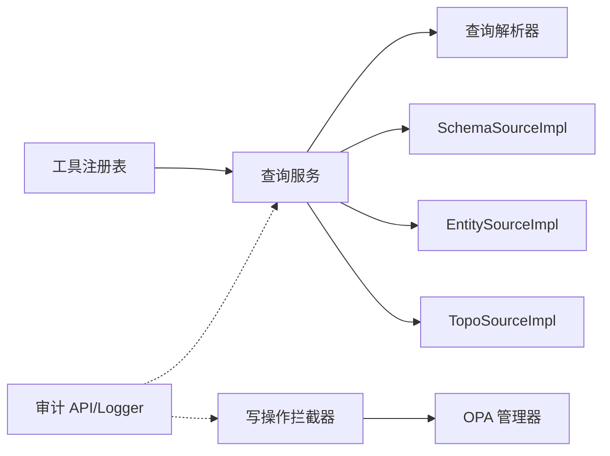

# 查询守卫机制

<cite>
**本文档引用的文件**
- [odap/infra/openharness/query_guard_hook.py](file://odap/infra/openharness/query_guard_hook.py)
- [odap/infra/query/service.py](file://odap/infra/query/service.py)
- [odap/infra/query/parser.py](file://odap/infra/query/parser.py)
- [odap/infra/query/protocols.py](file://odap/infra/query/protocols.py)
- [odap/infra/query/sources/schema_source.py](file://odap/infra/query/sources/schema_source.py)
- [odap/infra/query/sources/entity_source.py](file://odap/infra/query/sources/entity_source.py)
- [odap/infra/query/sources/topo_source.py](file://odap/infra/query/sources/topo_source.py)
- [odap/infra/opa/opa_service.py](file://odap/infra/opa/opa_service.py)
- [odap/infra/security/audit_api.py](file://odap/infra/security/audit_api.py)
- [odap/infra/security/audit_logger.py](file://odap/infra/security/audit_logger.py)
- [tests/unit/test_query_guard.py](file://tests/unit/test_query_guard.py)
</cite>

## 目录
1. [引言](#引言)
2. [项目结构](#项目结构)
3. [核心组件](#核心组件)
4. [架构总览](#架构总览)
5. [详细组件分析](#详细组件分析)
6. [依赖关系分析](#依赖关系分析)
7. [性能考虑](#性能考虑)
8. [故障排除指南](#故障排除指南)
9. [结论](#结论)
10. [附录](#附录)

## 引言
本文件系统性阐述查询守卫机制的设计与实现，重点覆盖以下方面：
- Agent 写操作守卫的工作原理：操作拦截、权限验证与安全策略执行
- 查询守卫的实现机制：Hook 系统集成、查询解析与权限检查流程
- 查询守卫的安全策略：数据访问限制、操作审计与异常处理
- 查询守卫的配置方法：策略规则设置、白名单配置与监控告警
- 使用示例：如何防止未授权的数据修改并确保操作合规
- 在整体安全架构中的作用与重要性

## 项目结构
查询守卫涉及的核心模块分布于以下子系统：
- OpenHarness 集成层：提供工具注册与预执行 Hook，负责拦截写操作并触发权限校验
- 查询服务层：统一的查询入口，封装解析、路由与执行逻辑
- 数据源层：按来源（模式、实体、拓扑、时态）提供具体实现
- 策略引擎层：基于 OPA 的 ABAC/策略评估与热更新
- 审计与监控：统一审计通道与 API，支撑合规追踪与告警

**图表来源**
- [odap/infra/openharness/query_guard_hook.py:17-83](file://odap/infra/openharness/query_guard_hook.py#L17-L83)
- [odap/infra/query/service.py:11-70](file://odap/infra/query/service.py#L11-L70)
- [odap/infra/query/parser.py:23-81](file://odap/infra/query/parser.py#L23-L81)
- [odap/infra/opa/opa_service.py:455-583](file://odap/infra/opa/opa_service.py#L455-L583)
- [odap/infra/security/audit_api.py:16-209](file://odap/infra/security/audit_api.py#L16-L209)

**章节来源**
- [odap/infra/openharness/query_guard_hook.py:1-175](file://odap/infra/openharness/query_guard_hook.py#L1-L175)
- [odap/infra/query/service.py:1-126](file://odap/infra/query/service.py#L1-L126)
- [odap/infra/query/parser.py:1-113](file://odap/infra/query/parser.py#L1-L113)
- [odap/infra/query/protocols.py:1-40](file://odap/infra/query/protocols.py#L1-L40)
- [odap/infra/query/sources/schema_source.py:1-172](file://odap/infra/query/sources/schema_source.py#L1-L172)
- [odap/infra/query/sources/entity_source.py:1-34](file://odap/infra/query/sources/entity_source.py#L1-L34)
- [odap/infra/query/sources/topo_source.py:1-28](file://odap/infra/query/sources/topo_source.py#L1-L28)
- [odap/infra/opa/opa_service.py:1-750](file://odap/infra/opa/opa_service.py#L1-L750)
- [odap/infra/security/audit_api.py:1-487](file://odap/infra/security/audit_api.py#L1-L487)

## 核心组件
- 写操作拦截器：QueryServiceWriteGuard 通过 OpenHarness PreToolUse Hook 拦截写操作，调用 OPA 进行策略校验，实现 fail-closed 的安全策略
- 工具注册表：QueryServiceToolRegistry 将查询能力注册为 OpenHarness 工具，并区分只读与写操作工具
- 查询服务：QueryService 提供统一入口，解析查询字符串，路由到不同数据源并返回结构化结果
- 解析器：QueryParser 将自然语言风格的查询转换为结构化对象，支持模式、实体、拓扑与时态查询
- 数据源实现：SchemaSourceImpl、EntitySourceImpl、TopoSourceImpl 分别对接本体、实体与图遍历能力
- 策略引擎：OPAManager/OPAClient 提供 ABAC 策略评估、策略热更新与缓存，支持批量检查与性能监控
- 审计系统：Audit API 与 Logger 提供统一审计通道，支持事件查询、导出与统计

**章节来源**
- [odap/infra/openharness/query_guard_hook.py:17-83](file://odap/infra/openharness/query_guard_hook.py#L17-L83)
- [odap/infra/openharness/query_guard_hook.py:85-175](file://odap/infra/openharness/query_guard_hook.py#L85-L175)
- [odap/infra/query/service.py:11-70](file://odap/infra/query/service.py#L11-L70)
- [odap/infra/query/parser.py:23-81](file://odap/infra/query/parser.py#L23-L81)
- [odap/infra/opa/opa_service.py:455-583](file://odap/infra/opa/opa_service.py#L455-L583)
- [odap/infra/security/audit_api.py:16-209](file://odap/infra/security/audit_api.py#L16-L209)

## 架构总览
查询守卫的整体流程如下：
- 工具注册：QueryServiceToolRegistry 将只读与写操作工具分别登记
- 预执行拦截：OpenHarness 在工具执行前调用 QueryServiceWriteGuard.execute
- 写操作识别：根据工具名判断是否属于写操作集合
- OPA 校验：构造输入上下文（角色、资源、工作空间等），调用 OPA 策略评估
- 执行控制：允许则放行，拒绝则记录日志并阻断
- 查询执行：QueryService 解析查询字符串，路由到对应数据源，返回结果

**图表来源**
- [odap/infra/openharness/query_guard_hook.py:40-82](file://odap/infra/openharness/query_guard_hook.py#L40-L82)
- [odap/infra/query/service.py:33-59](file://odap/infra/query/service.py#L33-L59)
- [odap/infra/opa/opa_service.py:373-450](file://odap/infra/opa/opa_service.py#L373-L450)

## 详细组件分析

### 写操作拦截器（QueryServiceWriteGuard）
- 设计原则
  - 查询工具默认只读，无需校验
  - 写操作需显式启用，经过 OPA 策略校验
  - OPA 不可用时 fail-closed（拒绝写操作）
- 关键行为
  - 工具识别：通过预设的写操作集合判断是否拦截
  - 上下文提取：从执行上下文中获取用户角色与工作空间标识
  - OPA 调用：构造策略键与输入，进行异步策略评估
  - 异常处理：捕获 OPA 异常并回退拒绝，同时记录错误日志

**图表来源**
- [odap/infra/openharness/query_guard_hook.py:17-83](file://odap/infra/openharness/query_guard_hook.py#L17-L83)
- [odap/infra/opa/opa_service.py:559-583](file://odap/infra/opa/opa_service.py#L559-L583)

**章节来源**
- [odap/infra/openharness/query_guard_hook.py:17-83](file://odap/infra/openharness/query_guard_hook.py#L17-L83)

### 工具注册表（QueryServiceToolRegistry）
- 工具分类
  - 读取类工具：query_schema、query_entity、query_topo、query_temporal
  - 写入类工具：write_entity、write_relation（需 OPA 审批）
- 安全标注
  - 通过 safety 字段区分 read/write
  - 写入类工具可标记 requires_confirmation
- 注册与查询
  - 提供 all_tools/read_tools/write_tools 与 is_write_tool 辅助方法

**图表来源**
- [odap/infra/openharness/query_guard_hook.py:85-175](file://odap/infra/openharness/query_guard_hook.py#L85-L175)

**章节来源**
- [odap/infra/openharness/query_guard_hook.py:85-175](file://odap/infra/openharness/query_guard_hook.py#L85-L175)

### 查询服务（QueryService）
- 单例模式：保证全局唯一实例
- 执行流程
  - 解析：委托 QueryParser 将查询字符串解析为结构化对象
  - 路由：根据来源（SCHEMA/ENTITY/TOPO/TEMPORAL）选择对应数据源
  - 执行：调用相应数据源实现，支持 limit 与 workspace_id
  - 包装：返回 QueryResult，包含来源、行数据、总数与 explain 信息
- 错误处理：捕获异常并返回带错误说明的结果

**图表来源**
- [odap/infra/query/service.py:33-70](file://odap/infra/query/service.py#L33-L70)

**章节来源**
- [odap/infra/query/service.py:11-126](file://odap/infra/query/service.py#L11-L126)

### 查询解析器（QueryParser）
- 解析规则
  - 前缀识别：.schema/.entity/.topo/.temporal 确定来源
  - 过滤条件：with(...) 提取过滤键值对
  - 拓扑与时态：neighbors()/path()/relations() 与 at()/history() 提取动作与参数
  - 参数解析：支持整数与字符串类型转换
- 输出：返回 ParsedQuery 对象，包含 source/filters/action/action_params/limit

**图表来源**
- [odap/infra/query/parser.py:31-81](file://odap/infra/query/parser.py#L31-L81)

**章节来源**
- [odap/infra/query/parser.py:1-113](file://odap/infra/query/parser.py#L1-L113)

### 数据源实现
- SchemaSourceImpl
  - 查询对象类型、链接定义与动作类型
  - 类型校验与属性校验（必填、类型匹配、基数约束）
- EntitySourceImpl
  - 实体查询、获取与混合检索（优先图驱动，回退普通搜索）
- TopoSourceImpl
  - 邻居查询、关系查询与图遍历

**章节来源**
- [odap/infra/query/sources/schema_source.py:1-172](file://odap/infra/query/sources/schema_source.py#L1-L172)
- [odap/infra/query/sources/entity_source.py:1-34](file://odap/infra/query/sources/entity_source.py#L1-L34)
- [odap/infra/query/sources/topo_source.py:1-28](file://odap/infra/query/sources/topo_source.py#L1-L28)

### 策略引擎（OPA）
- ABAC 策略评估：支持角色、属性、环境约束与限制规则
- 策略热更新：Bundle 管理器支持热更新与回滚
- 性能优化：缓存、批量检查与性能指标
- 客户端接口：REST API 客户端，支持单次与批量权限检查

**图表来源**
- [odap/infra/opa/opa_service.py:455-583](file://odap/infra/opa/opa_service.py#L455-L583)
- [odap/infra/opa/opa_service.py:373-450](file://odap/infra/opa/opa_service.py#L373-L450)

**章节来源**
- [odap/infra/opa/opa_service.py:1-750](file://odap/infra/opa/opa_service.py#L1-L750)

### 审计系统
- API 路由：提供事件查询、详情、时间线、统计与导出接口
- 日志记录：支持结构化字段、批量写入与异步/同步接口
- 统一通道：与统一审计系统协同，保障合规追踪

**章节来源**
- [odap/infra/security/audit_api.py:16-487](file://odap/infra/security/audit_api.py#L16-L487)
- [odap/infra/security/audit_logger.py:19-270](file://odap/infra/security/audit_logger.py#L19-L270)

## 依赖关系分析
- 组件耦合
  - QueryServiceWriteGuard 依赖 OPA 管理器，形成策略决策中心
  - QueryService 依赖 QueryParser 与多个数据源实现，形成查询执行中心
  - Audit API/Logger 作为横切关注点，贯穿各层
- 外部依赖
  - OPA 服务器健康检查与 REST 接口
  - SQLite 审计存储（通过审计通道）

**图表来源**
- [odap/infra/openharness/query_guard_hook.py:17-83](file://odap/infra/openharness/query_guard_hook.py#L17-L83)
- [odap/infra/query/service.py:11-70](file://odap/infra/query/service.py#L11-L70)
- [odap/infra/security/audit_api.py:16-209](file://odap/infra/security/audit_api.py#L16-L209)

**章节来源**
- [odap/infra/openharness/query_guard_hook.py:1-175](file://odap/infra/openharness/query_guard_hook.py#L1-L175)
- [odap/infra/query/service.py:1-126](file://odap/infra/query/service.py#L1-L126)
- [odap/infra/security/audit_api.py:1-487](file://odap/infra/security/audit_api.py#L1-L487)

## 性能考虑
- 缓存策略：OPA 管理器内置缓存，减少重复策略评估开销
- 批量检查：支持批量权限检查，降低网络往返次数
- 解析优化：查询解析器采用正则与简单状态机，复杂度与输入长度线性相关
- 数据源优化：图驱动搜索优先，失败回退普通搜索，兼顾性能与准确性

## 故障排除指南
- OPA 不可用
  - 现象：写操作被拒绝，日志出现 OPA 不可用警告
  - 处理：检查 OPA 服务器连通性与策略加载状态；必要时启用 Mock 模式进行降级测试
- 策略评估异常
  - 现象：OPA check 抛出异常，写操作被拒绝
  - 处理：查看 OPA 服务日志与策略内容；确认输入上下文完整性
- 查询解析错误
  - 现象：QueryService 返回错误结果
  - 处理：检查查询字符串格式与过滤条件；参考解析器规则进行修正
- 审计查询无结果
  - 现象：审计 API 查询不到事件
  - 处理：确认审计通道初始化、过滤参数与时间范围；检查 SQLite 文件权限

**章节来源**
- [odap/infra/openharness/query_guard_hook.py:31-82](file://odap/infra/openharness/query_guard_hook.py#L31-L82)
- [odap/infra/opa/opa_service.py:538-583](file://odap/infra/opa/opa_service.py#L538-L583)
- [odap/infra/query/service.py:52-59](file://odap/infra/query/service.py#L52-L59)
- [odap/infra/security/audit_api.py:76-117](file://odap/infra/security/audit_api.py#L76-L117)

## 结论
查询守卫机制通过“只读默认、写操作受控”的设计，结合 OpenHarness Hook 与 OPA 策略引擎，实现了对 Agent 写操作的强约束与可观测性。查询服务统一入口与解析器确保了查询的一致性与可扩展性，而审计系统则提供了完整的合规追踪能力。该机制在保障数据安全的同时，维持了系统的灵活性与可维护性。

## 附录

### 安全策略与配置要点
- 策略规则设置
  - 通过 OPA 策略文件定义角色权限与限制规则
  - 使用 Bundle 管理器进行热更新与回滚
- 白名单配置
  - 工具注册表中仅将必要的写操作工具标记为需要审批
  - requires_confirmation 标记用于二次确认场景
- 监控告警
  - 通过审计 API 查询 deny 事件与异常日志
  - 结合 OPA 性能指标与缓存命中率进行容量规划

**章节来源**
- [odap/infra/openharness/query_guard_hook.py:85-175](file://odap/infra/openharness/query_guard_hook.py#L85-L175)
- [odap/infra/opa/opa_service.py:227-314](file://odap/infra/opa/opa_service.py#L227-L314)
- [odap/infra/security/audit_api.py:120-209](file://odap/infra/security/audit_api.py#L120-L209)

### 使用示例（流程说明）
- 防止未授权修改
  - 将写操作工具纳入拦截器白名单，确保所有写操作均需经 OPA 审批
  - 在策略中限定角色与工作空间范围，避免越权操作
- 确保操作合规
  - 通过审计 API 定期导出 deny 事件与操作轨迹
  - 对异常高发的操作类型进行策略优化与告警联动

**章节来源**
- [odap/infra/openharness/query_guard_hook.py:40-82](file://odap/infra/openharness/query_guard_hook.py#L40-L82)
- [odap/infra/security/audit_api.py:347-401](file://odap/infra/security/audit_api.py#L347-L401)