# 策略治理系统

<cite>
**本文引用的文件**
- [opa_service.py](file://odap/infra/opa/opa_service.py)
- [routes.py](file://odap/infra/opa/routes.py)
- [opa_policy.rego](file://odap/infra/opa/opa_policy.rego)
- [query_guard_hook.py](file://odap/infra/openharness/query_guard_hook.py)
- [permission_backend.py](file://odap/infra/openharness/permission_backend.py)
- [executor.py](file://odap/biz/decision/action_service/executor.py)
- [unified_audit.py](file://odap/infra/security/unified_audit.py)
- [audit_api.py](file://odap/infra/security/audit_api.py)
- [audit_models.py](file://odap/infra/security/audit_models.py)
- [audit_logger.py](file://odap/infra/security/audit_logger.py)
- [audit_logger_v2.py](file://odap/infra/security/audit_logger_v2.py)
- [markdown_compiler.py](file://odap/infra/opa/markdown_compiler.py)
- [markdown_routes.py](file://odap/infra/opa/markdown_routes.py)
- [oauth2_providers.py](file://odap/infra/security/oauth2_providers.py)
- [test_action_service.py](file://tests/unit/test_action_service.py)
- [test_markdown_to_rego.py](file://tests/unit/test_markdown_to_rego.py)
- [test_role_opa_sync.py](file://tests/unit/test_role_opa_sync.py)
- [test_oauth2.py](file://tests/unit/test_oauth2.py)
- [DESIGN.md](file://docs/03-modules/opa_policy/DESIGN.md)
- [ADR-009_markdown_编写_opa_策略.md](file://docs/07-adr/ADR-009_markdown_编写_opa_策略.md)
- [ARCHITECTURE_BIZ.md](file://docs/02-architecture/ARCHITECTURE_BIZ.md)
- [GRAPHITI_INTEGRATION.md](file://docs/03-modules/audit_log/GRAPHITI_INTEGRATION.md)
- [DATABASE_DESIGN.md](file://docs/10-api/DATABASE_DESIGN.md)
- [ADR-028_permission_checker_opa_integration.md](file://docs/07-adr/ADR-028_permission_checker_opa_integration.md)
</cite>

## 更新摘要
**所做更改**
- 新增Markdown到Rego编译器章节，详细介绍策略编译流程
- 新增四维ABAC访问控制章节，阐述Subject/Action/Resource/Environment四维模型
- 新增统一审计系统v2章节，包含防篡改校验链和异步写入机制
- 新增OAuth2/OIDC SSO实现章节，涵盖多提供商认证集成
- 更新核心组件和架构总览，反映新增的安全框架增强
- 新增依赖关系分析，展示新组件间的交互关系

## 目录
1. [简介](#简介)
2. [项目结构](#项目结构)
3. [核心组件](#核心组件)
4. [架构总览](#架构总览)
5. [详细组件分析](#详细组件分析)
6. [依赖关系分析](#依赖关系分析)
7. [性能考量](#性能考量)
8. [故障排查指南](#故障排查指南)
9. [结论](#结论)
10. [附录](#附录)

## 简介
本文件面向策略治理系统，围绕 OPA（开放策略代理）的 fail-closed 安全边界设计与实现展开，系统性阐述 Agent 写操作守卫、权限控制模型（RBAC/ABAC）、策略规则编写（Rego 语法与模块组织）、审计日志体系（操作追踪、事件记录与合规报告），并提供最佳实践、性能优化建议与常见问题排查方法。文档同时给出策略配置示例与安全场景应用案例，帮助读者快速落地与运维。

**更新** 本版本新增了Markdown到Rego编译器、四维ABAC访问控制、统一审计系统v2、OAuth2/OIDC SSO实现等安全框架增强功能。

## 项目结构
策略治理系统由"策略引擎 + 策略编排 + 权限守卫 + 审计日志 + 认证授权"五大部分组成：
- 策略引擎与编排：OPA 客户端、策略热更新 Bundle、Markdown→Rego 转换器、策略沙箱
- 权限守卫：ActionExecutor（动作执行前的 OPA 校验）、OpenHarness 写操作守卫、权限后端
- 审计日志：统一审计接口、SQLite/Graphiti 双通道存储、API 查询与导出、防篡改校验链
- 认证授权：OAuth2/OIDC 多提供商集成、本地账号认证、会话管理
- 文档与 ADR：模块设计文档、策略编写规范、架构与合规文档

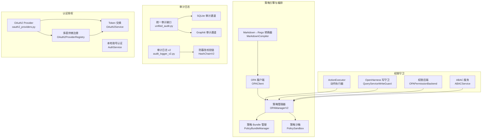

**图表来源**
- [opa_service.py:373-750](file://odap/infra/opa/opa_service.py#L373-L750)
- [routes.py:242-422](file://odap/infra/opa/routes.py#L242-L422)
- [executor.py:10-297](file://odap/biz/decision/action_service/executor.py#L10-L297)
- [query_guard_hook.py:17-175](file://odap/infra/openharness/query_guard_hook.py#L17-L175)
- [permission_backend.py:7-83](file://odap/infra/openharness/permission_backend.py#L7-L83)
- [unified_audit.py:58-340](file://odap/infra/security/unified_audit.py#L58-L340)
- [audit_api.py:16-487](file://odap/infra/security/audit_api.py#L16-L487)
- [audit_logger_v2.py:411-525](file://odap/infra/security/audit_logger_v2.py#L411-L525)
- [oauth2_providers.py:133-264](file://odap/infra/security/oauth2_providers.py#L133-L264)

**章节来源**
- [DESIGN.md:1-270](file://docs/03-modules/opa_policy/DESIGN.md#L1-L270)
- [ADR-009_markdown_编写_opa_策略.md:1-60](file://docs/07-adr/ADR-009_markdown_编写_opa_策略.md#L1-L60)

## 核心组件
- OPA 客户端与策略管理器：提供 ABAC 权限检查、策略热更新、缓存与历史记录、策略沙箱与 What-If 分析
- 策略转换与存储：Markdown→Rego 转换器与策略数据库，支持策略 CRUD 与版本管理
- 权限守卫：ActionExecutor 在动作执行前进行 fail-closed 校验；OpenHarness 写守卫拦截写工具调用
- 审计日志：统一审计接口与 API，支持 SQLite 主存储与 Graphiti 辅助存储，提供查询、导出与完整性报告
- **新增** 四维ABAC访问控制：支持Subject/Action/Resource/Environment四维属性的细粒度权限控制
- **新增** OAuth2/OIDC SSO：多提供商认证集成，支持企业SSO解决方案

**章节来源**
- [opa_service.py:455-750](file://odap/infra/opa/opa_service.py#L455-L750)
- [routes.py:1-422](file://odap/infra/opa/routes.py#L1-L422)
- [executor.py:10-297](file://odap/biz/decision/action_service/executor.py#L10-L297)
- [query_guard_hook.py:17-175](file://odap/infra/openharness/query_guard_hook.py#L17-L175)
- [unified_audit.py:89-340](file://odap/infra/security/unified_audit.py#L89-L340)
- [audit_logger_v2.py:411-525](file://odap/infra/security/audit_logger_v2.py#L411-L525)
- [oauth2_providers.py:133-264](file://odap/infra/security/oauth2_providers.py#L133-L264)

## 架构总览
系统采用"策略即代码"的设计，通过 OPA 提供统一的权限决策能力，并在关键入口（动作执行、Agent 写操作）实施 fail-closed 安全边界。审计日志贯穿全链路，确保可追溯与合规。新增的四维ABAC模型提供更精细的权限控制，OAuth2/OIDC集成支持企业级身份认证。

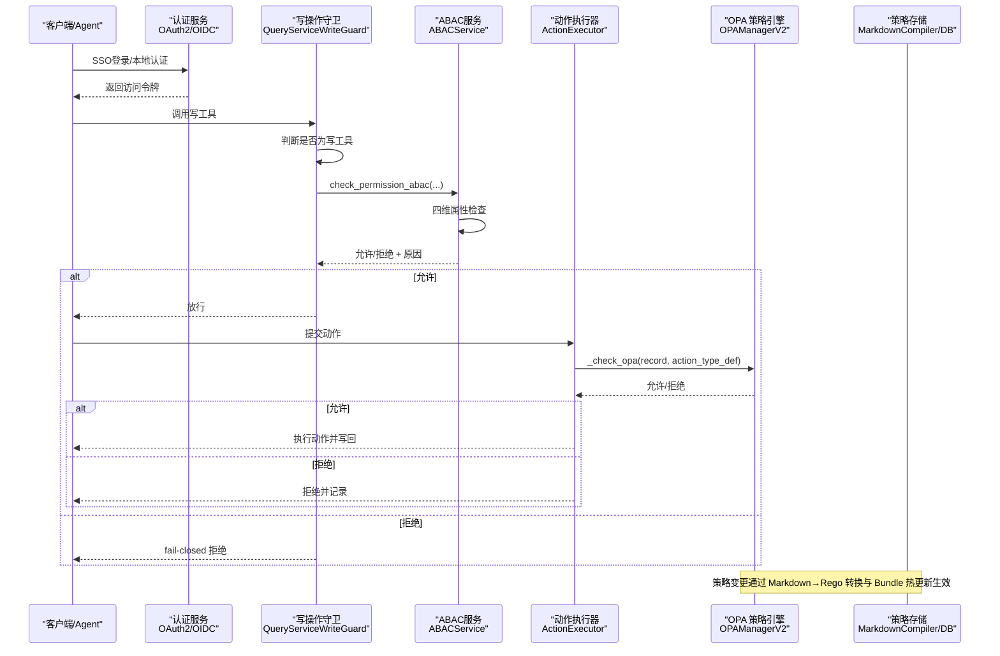

**图表来源**
- [query_guard_hook.py:40-82](file://odap/infra/openharness/query_guard_hook.py#L40-L82)
- [executor.py:119-137](file://odap/biz/decision/action_service/executor.py#L119-L137)
- [opa_service.py:559-583](file://odap/infra/opa/opa_service.py#L559-L583)
- [routes.py:242-422](file://odap/infra/opa/routes.py#L242-L422)
- [oauth2_providers.py:133-264](file://odap/infra/security/oauth2_providers.py#L133-L264)

## 详细组件分析

### OPA 策略引擎与管理
- ABAC 权限模型：支持用户角色、资源属性、环境变量与策略组合的灵活判定
- 策略热更新：Bundle 管理器支持版本化策略包、热更新与回滚
- 缓存与性能：基于 MD5 的请求键、TTL 与命中率统计，降低 OPA 调用开销
- 策略沙箱：支持策略模拟与 What-If 分析，便于策略调试与影响评估

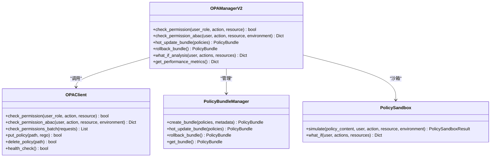

**图表来源**
- [opa_service.py:373-750](file://odap/infra/opa/opa_service.py#L373-L750)

**章节来源**
- [opa_service.py:455-750](file://odap/infra/opa/opa_service.py#L455-L750)

### Markdown到Rego编译器
- **新增** 编译器架构：提供从自然语言策略到Rego代码的自动化转换
- **策略解析**：支持中文策略规则语法，自动识别角色、操作、条件和效果
- **Rego生成**：将解析的策略转换为标准Rego代码，包含包声明、默认规则和条件判断
- **验证机制**：内置语法验证，确保生成的Rego代码符合OPA规范

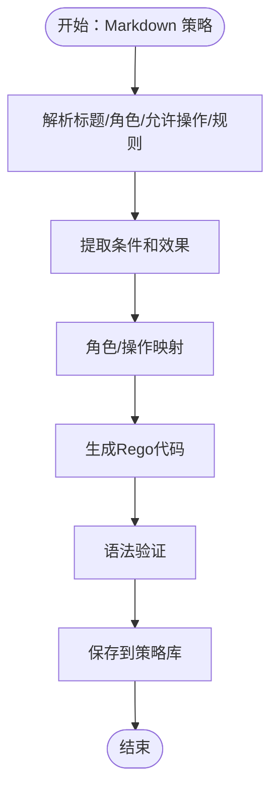

**图表来源**
- [markdown_compiler.py:109-122](file://odap/infra/opa/markdown_compiler.py#L109-L122)
- [markdown_compiler.py:244-290](file://odap/infra/opa/markdown_compiler.py#L244-L290)

**章节来源**
- [markdown_compiler.py:14-290](file://odap/infra/opa/markdown_compiler.py#L14-L290)
- [markdown_routes.py:36-139](file://odap/infra/opa/markdown_routes.py#L36-L139)

### 四维ABAC访问控制
- **新增** ABAC服务：实现Subject/Action/Resource/Environment四维属性的综合权限检查
- **主体维度**：用户ID、角色列表、清密级别、工作空间角色
- **动作维度**：操作类型、操作类别、操作参数
- **资源维度**：资源类型、分类级别、工作空间ID
- **环境维度**：时间、IP地址、隔离级别、限制条件
- **策略规则**：支持基于四维属性的复杂权限组合和数据分类控制

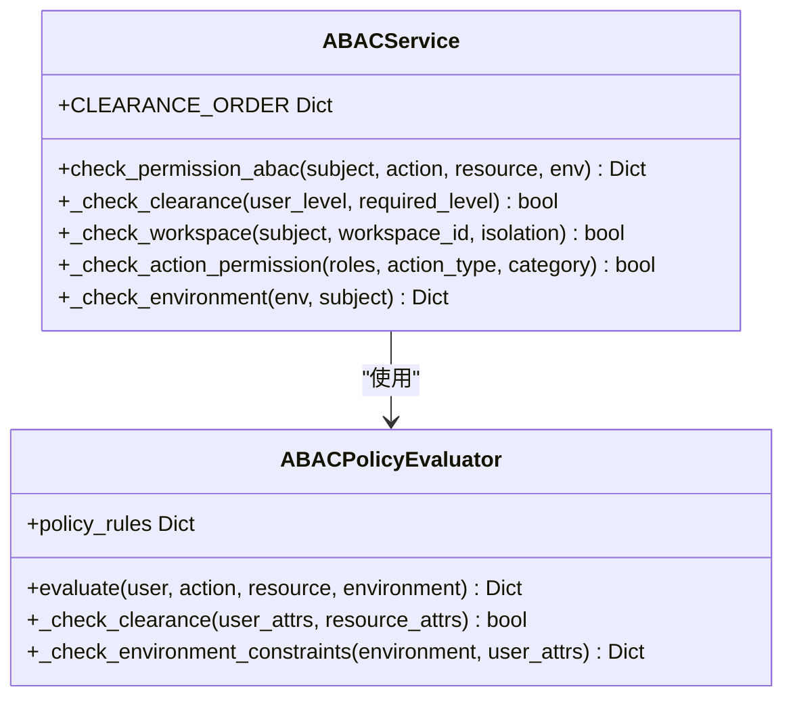

**图表来源**
- [opa_service.py:799-966](file://odap/infra/opa/opa_service.py#L799-L966)

**章节来源**
- [opa_service.py:799-966](file://odap/infra/opa/opa_service.py#L799-L966)

### Agent 写操作守卫
- 写工具识别：对写工具集合进行白名单判断
- fail-closed 安全边界：OPA 不可用或异常时拒绝写操作
- 输入构造：将工具名、参数与上下文（角色、工作空间）封装为 OPA 输入

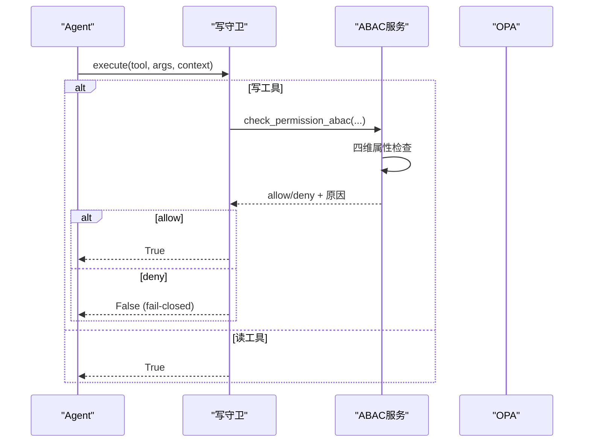

**图表来源**
- [query_guard_hook.py:40-82](file://odap/infra/openharness/query_guard_hook.py#L40-L82)
- [permission_backend.py:40-68](file://odap/infra/openharness/permission_backend.py#L40-L68)

**章节来源**
- [query_guard_hook.py:17-175](file://odap/infra/openharness/query_guard_hook.py#L17-L175)
- [permission_backend.py:7-83](file://odap/infra/openharness/permission_backend.py#L7-L83)

### 动作执行与 fail-closed 校验
- 动作提交：ActionExecutor 校验参数与目标类型，随后进行 OPA 校验
- fail-closed 机制：未配置 OPA 或 OPA 异常时拒绝动作
- 执行与回写：通过图服务执行动作并写回结果

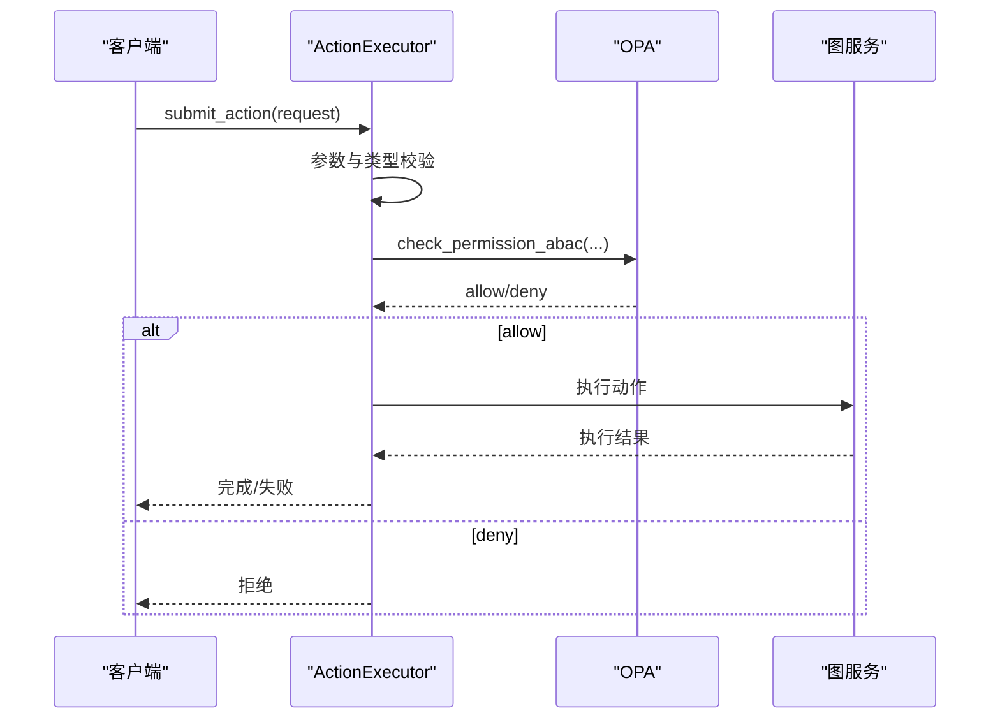

**图表来源**
- [executor.py:48-92](file://odap/biz/decision/action_service/executor.py#L48-L92)
- [executor.py:119-137](file://odap/biz/decision/action_service/executor.py#L119-L137)

**章节来源**
- [executor.py:10-297](file://odap/biz/decision/action_service/executor.py#L10-L297)
- [test_action_service.py:108-201](file://tests/unit/test_action_service.py#L108-L201)

### 统一审计系统v2
- **新增** 防篡改校验链：基于SHA-256的链式哈希，确保审计日志完整性
- **异步写入**：支持批量落盘和异步写入，提高性能
- **多通道存储**：SQLite主存储 + Graphiti辅助存储，支持查询、导出与完整性报告
- **时间线查询**：提供资源审计时间线和追踪链功能
- **CRITICAL级别**：关键事件同步写入，保证审计完整性

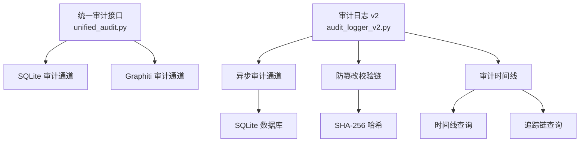

**图表来源**
- [unified_audit.py:292-340](file://odap/infra/security/unified_audit.py#L292-L340)
- [audit_api.py:16-487](file://odap/infra/security/audit_api.py#L16-L487)
- [audit_models.py:110-167](file://odap/infra/security/audit_models.py#L110-L167)
- [audit_logger_v2.py:411-525](file://odap/infra/security/audit_logger_v2.py#L411-L525)

**章节来源**
- [unified_audit.py:89-340](file://odap/infra/security/unified_audit.py#L89-L340)
- [audit_api.py:120-292](file://odap/infra/security/audit_api.py#L120-L292)
- [audit_models.py:15-167](file://odap/infra/security/audit_models.py#L15-L167)
- [audit_logger_v2.py:411-525](file://odap/infra/security/audit_logger_v2.py#L411-L525)

### OAuth2/OIDC SSO实现
- **新增** 多提供商支持：Google、GitHub、Generic OIDC等主流认证提供商
- **授权码流程**：支持PKCE安全挑战响应，防止授权码拦截攻击
- **Token交换**：OAuth2访问令牌与ID令牌的双向交换
- **用户信息获取**：标准化用户信息获取和映射
- **配置管理**：支持环境变量配置和动态提供商注册

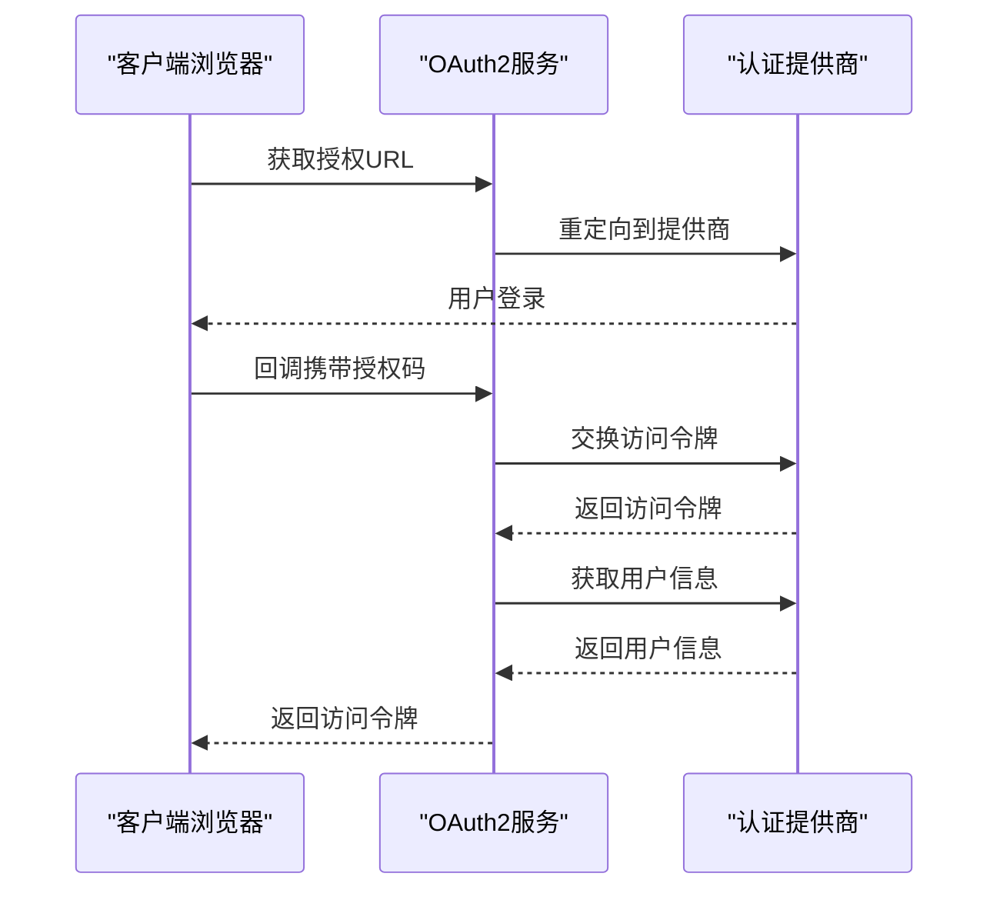

**图表来源**
- [oauth2_providers.py:133-264](file://odap/infra/security/oauth2_providers.py#L133-L264)

**章节来源**
- [oauth2_providers.py:133-264](file://odap/infra/security/oauth2_providers.py#L133-L264)
- [test_oauth2.py:320-359](file://tests/unit/test_oauth2.py#L320-L359)

### 权限控制模型与角色管理
- 角色与权限：系统预定义角色（如指挥官、情报分析员、操作员、管理员、审计员），权限通过策略与规则绑定
- 策略同步：将角色权限转换为 Rego 策略并加载至 OPA，支持热更新与删除
- 控制模型：支持 RBAC、ABAC、PBAC、CBAC 等多种模型，策略表达能力强

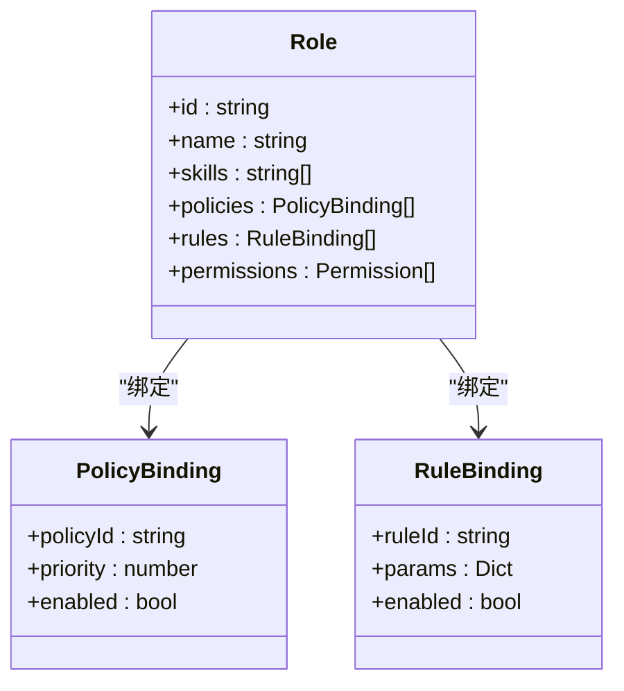

**图表来源**
- [ARCHITECTURE_BIZ.md:1443-1493](file://docs/02-architecture/ARCHITECTURE_BIZ.md#L1443-L1493)
- [test_role_opa_sync.py:48-118](file://tests/unit/test_role_opa_sync.py#L48-L118)

**章节来源**
- [ARCHITECTURE_BIZ.md:1443-1493](file://docs/02-architecture/ARCHITECTURE_BIZ.md#L1443-L1493)
- [test_role_opa_sync.py:48-118](file://tests/unit/test_role_opa_sync.py#L48-L118)

## 依赖关系分析
- 组件耦合：ActionExecutor 与 OpenHarness 写守卫均依赖 OPAManagerV2；OPAManagerV2 依赖 OPAClient 与策略存储
- **新增** ABAC服务依赖：四维ABAC模型独立于传统权限检查，提供更精细的控制
- **新增** 认证集成：OAuth2服务与策略引擎解耦，支持多提供商认证
- **新增** 审计增强：审计日志v2提供独立的防篡改机制，不依赖原有统一审计接口
- 外部依赖：OPA 服务器健康检查、HTTP 客户端、SQLite/Graphiti 存储
- 循环依赖：未发现循环依赖，模块职责清晰

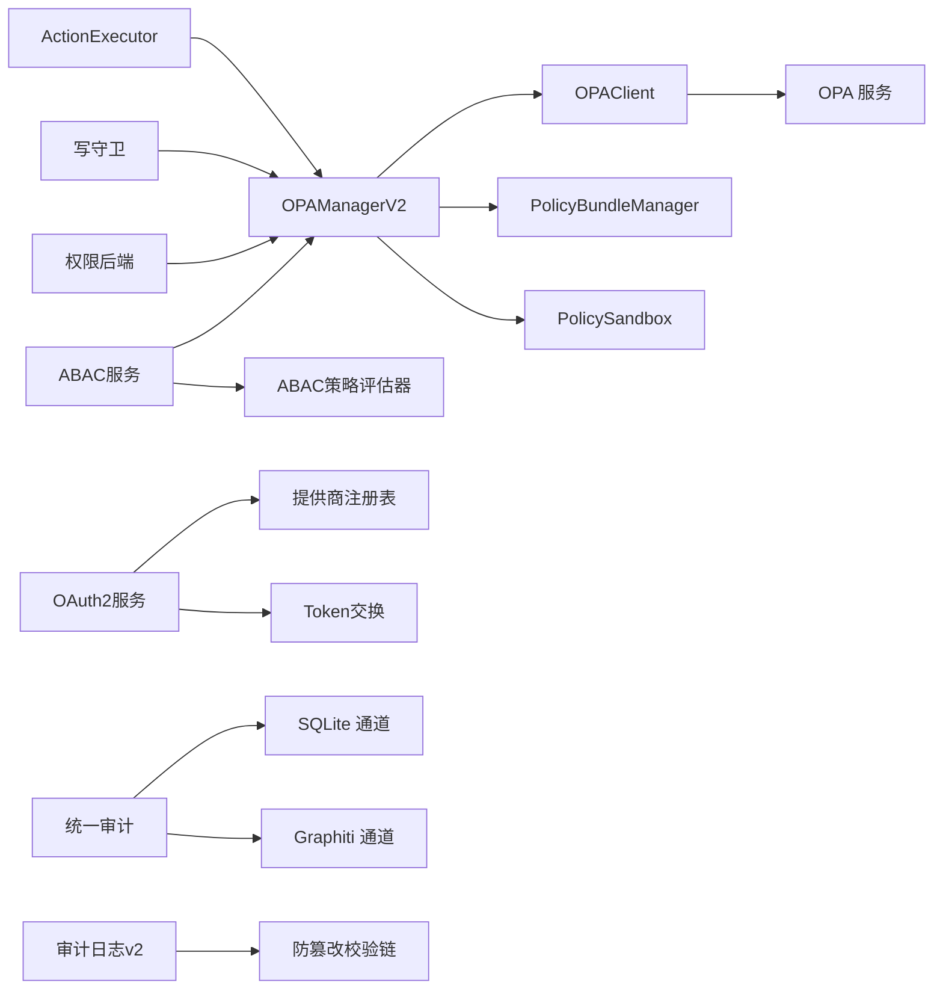

**图表来源**
- [executor.py:37-46](file://odap/biz/decision/action_service/executor.py#L37-L46)
- [query_guard_hook.py:26-38](file://odap/infra/openharness/query_guard_hook.py#L26-L38)
- [permission_backend.py:26-38](file://odap/infra/openharness/permission_backend.py#L26-L38)
- [opa_service.py:455-489](file://odap/infra/opa/opa_service.py#L455-L489)
- [unified_audit.py:58-71](file://odap/infra/security/unified_audit.py#L58-L71)
- [audit_logger_v2.py:411-525](file://odap/infra/security/audit_logger_v2.py#L411-L525)
- [oauth2_providers.py:133-264](file://odap/infra/security/oauth2_providers.py#L133-L264)

**章节来源**
- [opa_service.py:455-750](file://odap/infra/opa/opa_service.py#L455-L750)
- [executor.py:10-297](file://odap/biz/decision/action_service/executor.py#L10-L297)
- [query_guard_hook.py:17-175](file://odap/infra/openharness/query_guard_hook.py#L17-L175)
- [permission_backend.py:7-83](file://odap/infra/openharness/permission_backend.py#L7-L83)
- [unified_audit.py:58-71](file://odap/infra/security/unified_audit.py#L58-L71)
- [audit_logger_v2.py:411-525](file://odap/infra/security/audit_logger_v2.py#L411-L525)
- [oauth2_providers.py:133-264](file://odap/infra/security/oauth2_providers.py#L133-L264)

## 性能考量
- 缓存策略：基于 MD5 的请求键、TTL 与命中率统计，建议合理设置缓存大小与 TTL，避免热点失效
- 批量检查：OPAClient 支持批量权限检查，建议在高并发场景合并请求
- 策略热更新：Bundle 管理器支持热更新与回滚，建议在变更前进行策略沙箱验证
- **新增** 编译优化：Markdown到Rego编译器支持增量编译和缓存，减少重复转换开销
- **新增** 审计性能：审计日志v2采用异步写入和批量处理，建议根据业务量调整批量大小和刷新间隔
- **新增** ABAC性能：四维ABAC检查包含多维度属性验证，建议对常用属性建立索引和缓存

## 故障排查指南
- OPA 不可用或异常
  - 现象：动作执行与写操作被拒绝
  - 排查：检查 OPA 服务健康状态、网络连通性与超时设置
  - 参考：ActionExecutor 与写守卫中的 fail-closed 逻辑
- **新增** 策略编译失败
  - 现象：Markdown→Rego 转换异常或生成的 Rego 语法错误
  - 排查：核对 Markdown 语法、角色与操作映射、规则格式
  - 参考：MarkdownCompiler 的转换流程与单元测试
- **新增** ABAC权限检查异常
  - 现象：四维属性检查失败或权限判定错误
  - 排查：验证Subject/Action/Resource/Environment四维属性完整性
  - 参考：ABACService的权限检查流程和日志输出
- **新增** 审计日志完整性问题
  - 现象：审计事件被篡改或丢失
  - 排查：检查防篡改校验链状态和数据库连接
  - 参考：HashChainV2的完整性验证和审计API
- **新增** OAuth2认证失败
  - 现象：SSO登录失败或Token交换错误
  - 排查：验证提供商配置、回调URL和PKCE参数
  - 参考：OAuth2Service的认证流程和错误处理
- 策略加载失败
  - 现象：策略上传或删除失败
  - 排查：确认 OPA 服务地址、策略路径与内容
  - 参考：OPAClient 的 put_policy/delete_policy 方法
- 审计日志缺失
  - 现象：查询不到审计事件或导出为空
  - 排查：确认 SQLite/Graphiti 通道可用性、过滤条件与时间范围
  - 参考：审计 API 的查询与导出接口

**章节来源**
- [executor.py:119-137](file://odap/biz/decision/action_service/executor.py#L119-L137)
- [query_guard_hook.py:58-82](file://odap/infra/openharness/query_guard_hook.py#L58-L82)
- [routes.py:242-422](file://odap/infra/opa/routes.py#L242-L422)
- [opa_service.py:420-443](file://odap/infra/opa/opa_service.py#L420-L443)
- [audit_api.py:120-292](file://odap/infra/security/audit_api.py#L120-L292)
- [audit_logger_v2.py:497-516](file://odap/infra/security/audit_logger_v2.py#L497-L516)
- [oauth2_providers.py:133-264](file://odap/infra/security/oauth2_providers.py#L133-L264)

## 结论
本策略治理系统通过 fail-closed 的安全边界设计与完善的权限控制模型，结合策略即代码的治理方式与全链路审计能力，实现了高安全性、可追溯与可扩展的策略管控体系。新增的Markdown到Rego编译器简化了策略编写门槛，四维ABAC模型提供了更精细的权限控制，审计日志v2确保了审计完整性，OAuth2/OIDC集成支持了企业级身份认证需求。建议在生产环境中配合策略沙箱、缓存与热更新机制，持续优化性能与稳定性，并严格遵循策略设计与合规要求。

## 附录

### 策略治理最佳实践
- 策略设计原则
  - 最小权限：默认拒绝，显式允许
  - 层次化：角色→策略→规则逐层细化
  - 可审计：每个决策包含原因与追踪 ID
  - **新增** 可编译：优先使用Markdown策略，便于版本管理和审查
  - **新增** 可验证：利用ABAC四维模型进行权限模拟和影响评估
- 性能优化
  - 启用缓存与批量检查
  - 合理划分策略包，避免单包过大
  - 使用策略沙箱进行变更前验证
  - **新增** 编译缓存：利用Markdown编译器的增量编译功能
  - **新增** 审计优化：根据业务量调整审计日志批量大小
- 故障排查
  - 建立 OPA 健康监控与告警
  - 审计日志分级与采样
  - 定期回滚演练与完整性校验
  - **新增** 编译器调试：利用编译器的错误报告功能定位策略问题
  - **新增** ABAC调试：通过What-If分析验证权限规则正确性

### 策略配置示例与安全场景
- 示例：Markdown 策略转换
  - 参考：MarkdownCompiler 的转换流程与单元测试
- **新增** 示例：四维ABAC策略
  - Subject: {"user_id": "user001", "roles": ["commander"], "clearance_level": "secret"}
  - Action: {"type": "attack", "category": "write"}
  - Resource: {"type": "WeaponSystem", "classification": "S", "workspace_id": "ws-1"}
  - Environment: {"time": "09:00", "ip": "10.0.0.1", "isolation": "strict"}
- 场景：禁止攻击民用设施
  - 参考：Rego 策略中的限制规则与 ActionExecutor 的 fail-closed 行为
- 场景：Agent 写操作拦截
  - 参考：写守卫对写工具的拦截与 OPA 校验
- **新增** 场景：多提供商SSO集成
  - 参考：OAuth2ProviderRegistry的提供商配置和OAuth2Service的认证流程

**章节来源**
- [test_markdown_to_rego.py:10-113](file://tests/unit/test_markdown_to_rego.py#L10-L113)
- [opa_policy.rego:94-111](file://odap/infra/opa/opa_policy.rego#L94-L111)
- [executor.py:119-137](file://odap/biz/decision/action_service/executor.py#L119-L137)
- [ADR-028_permission_checker_opa_integration.md:33-73](file://docs/07-adr/ADR-028_permission_checker_opa_integration.md#L33-L73)
- [oauth2_providers.py:133-264](file://odap/infra/security/oauth2_providers.py#L133-L264)