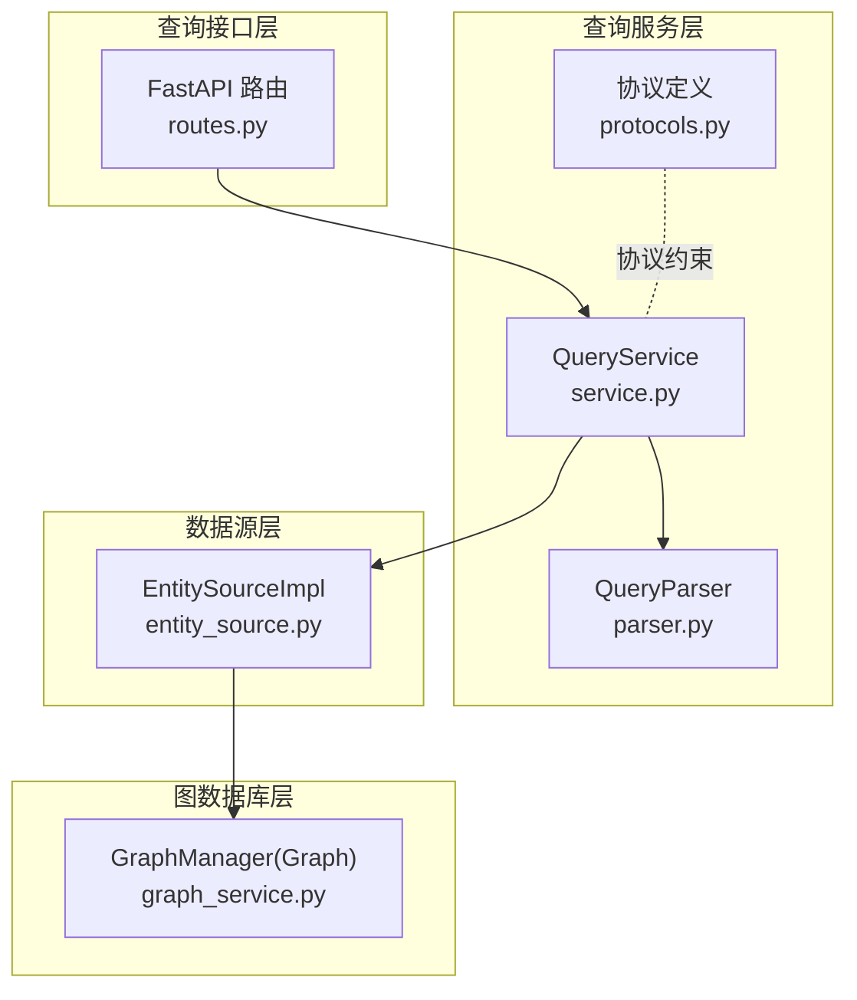
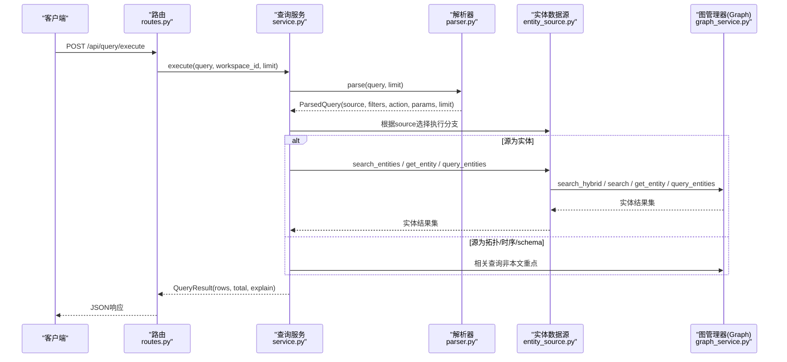
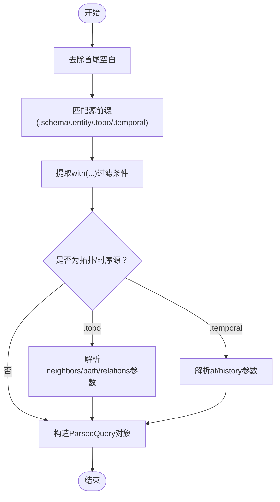
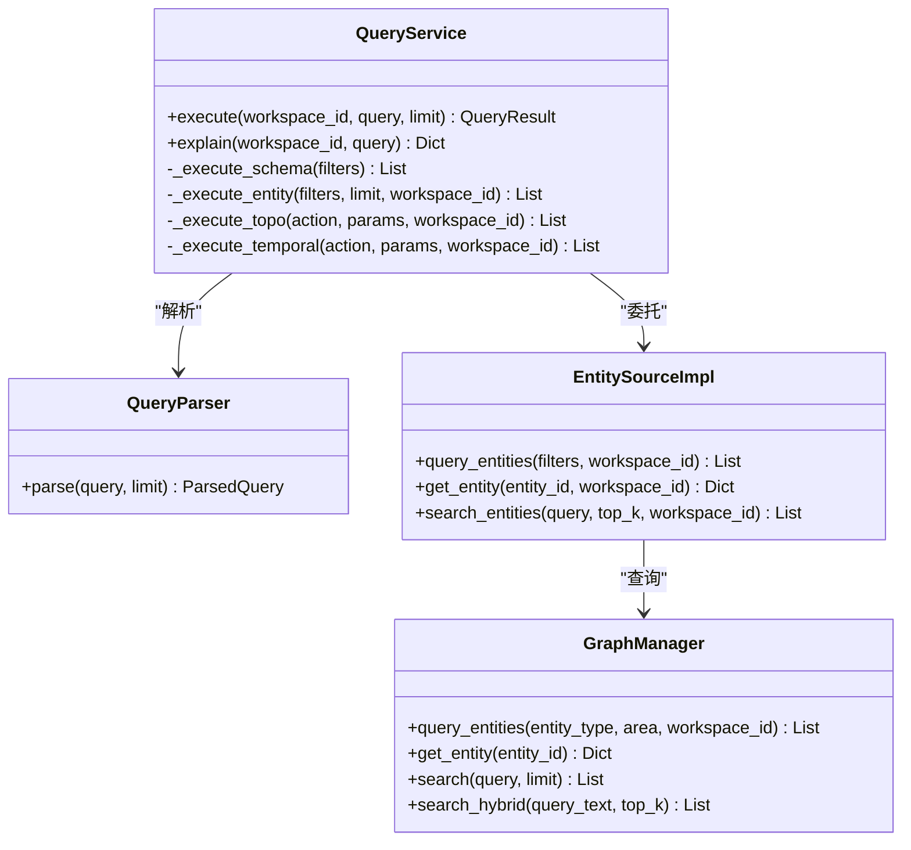
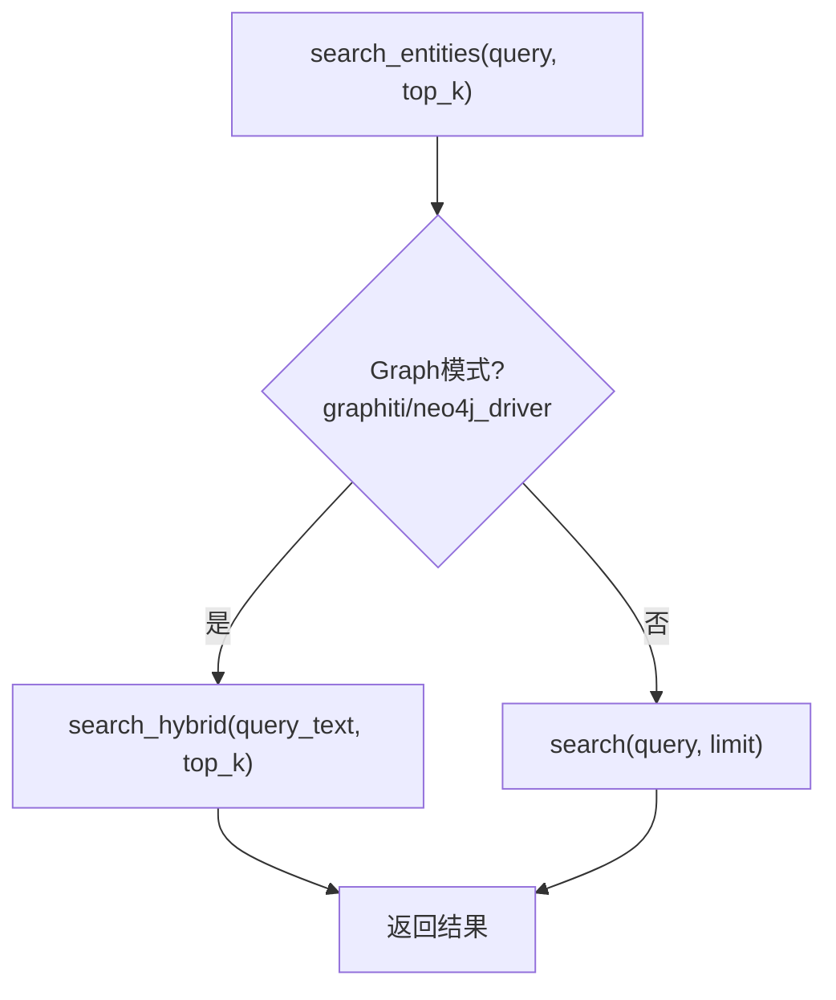
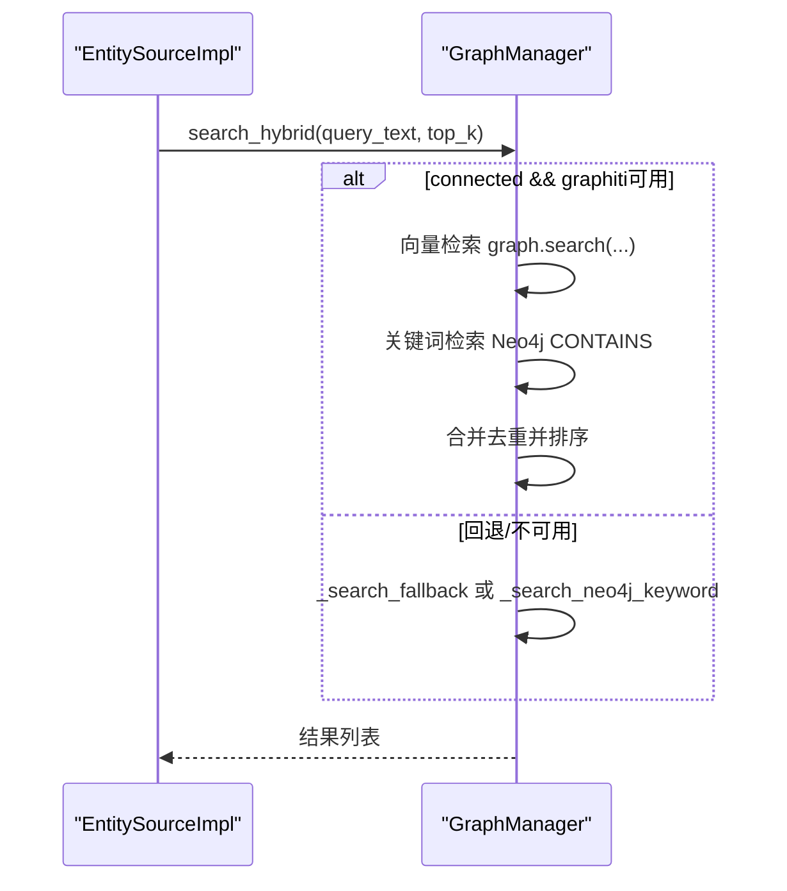
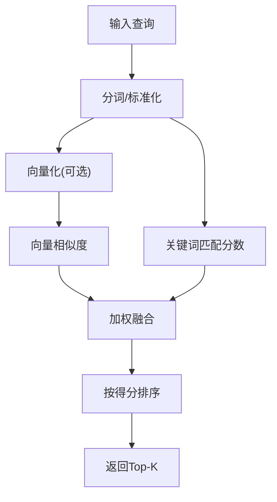
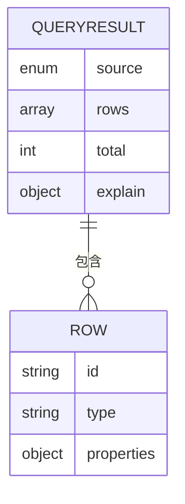
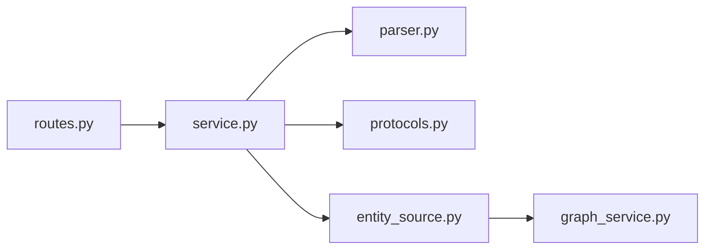

# 实体查询

<cite>
**本文引用的文件**
- [odap/infra/query/service.py](file://odap/infra/query/service.py)
- [odap/infra/query/parser.py](file://odap/infra/query/parser.py)
- [odap/infra/query/routes.py](file://odap/infra/query/routes.py)
- [odap/infra/query/protocols.py](file://odap/infra/query/protocols.py)
- [odap/infra/query/sources/entity_source.py](file://odap/infra/query/sources/entity_source.py)
- [odap/infra/graph/graph_service.py](file://odap/infra/graph/graph_service.py)
- [odap/biz/core/cognition/user_cognition_engine.py](file://odap/biz/core/cognition/user_cognition_engine.py)
- [odap/biz/platform/ontology_memory/impl/memory_engine.py](file://odap/biz/platform/ontology_memory/impl/memory_engine.py)
- [tests/unit/test_graph_service.py](file://tests/unit/test_graph_service.py)
</cite>

## 目录
1. [简介](#简介)
2. [项目结构](#项目结构)
3. [核心组件](#核心组件)
4. [架构总览](#架构总览)
5. [组件详解](#组件详解)
6. [依赖关系分析](#依赖关系分析)
7. [性能考量](#性能考量)
8. [故障排查指南](#故障排查指南)
9. [结论](#结论)
10. [附录](#附录)

## 简介
本文件围绕“实体查询”能力进行系统化技术说明，覆盖以下主题：
- 多种查询模式：ID精确查询、全文搜索查询、条件过滤查询
- EntitySourceImpl实现机制：与Graphiti图数据库的连接方式与查询执行流程
- 搜索算法设计：全文索引构建、相似度计算与结果排序策略
- 查询示例：复杂过滤条件组合与性能优化技巧
- 结果标准化格式：实体标识、属性值与关系链接的结构化输出

## 项目结构
实体查询能力由“查询路由层 → 查询服务层 → 查询解析层 → 数据源层 → 图数据库层”构成，形成清晰的分层架构。

**图表来源**
- [odap/infra/query/routes.py:18-50](file://odap/infra/query/routes.py#L18-L50)
- [odap/infra/query/service.py:33-59](file://odap/infra/query/service.py#L33-L59)
- [odap/infra/query/parser.py:31-81](file://odap/infra/query/parser.py#L31-L81)
- [odap/infra/query/sources/entity_source.py:4-33](file://odap/infra/query/sources/entity_source.py#L4-L33)
- [odap/infra/graph/graph_service.py:71-144](file://odap/infra/graph/graph_service.py#L71-L144)

**章节来源**
- [odap/infra/query/routes.py:18-101](file://odap/infra/query/routes.py#L18-L101)
- [odap/infra/query/service.py:11-126](file://odap/infra/query/service.py#L11-L126)
- [odap/infra/query/parser.py:23-113](file://odap/infra/query/parser.py#L23-L113)
- [odap/infra/query/protocols.py:7-40](file://odap/infra/query/protocols.py#L7-L40)
- [odap/infra/query/sources/entity_source.py:4-33](file://odap/infra/query/sources/entity_source.py#L4-L33)
- [odap/infra/graph/graph_service.py:71-200](file://odap/infra/graph/graph_service.py#L71-L200)

## 核心组件
- 查询路由层：提供统一的HTTP接口，负责参数校验与错误处理。
- 查询服务层：解析查询表达式，调度不同数据源，组装标准化结果。
- 查询解析层：将自然语言风格的查询表达式解析为结构化参数。
- 数据源层：封装实体查询的具体实现，支持ID、全文搜索、条件过滤。
- 图数据库层：提供Graphiti/Neo4j/内存图三种后端模式，支持混合检索与时序查询。

**章节来源**
- [odap/infra/query/routes.py:18-50](file://odap/infra/query/routes.py#L18-L50)
- [odap/infra/query/service.py:33-89](file://odap/infra/query/service.py#L33-L89)
- [odap/infra/query/parser.py:31-81](file://odap/infra/query/parser.py#L31-L81)
- [odap/infra/query/sources/entity_source.py:14-33](file://odap/infra/query/sources/entity_source.py#L14-L33)
- [odap/infra/graph/graph_service.py:145-200](file://odap/infra/graph/graph_service.py#L145-L200)

## 架构总览
下面以序列图展示一次典型实体查询的端到端流程。

**图表来源**
- [odap/infra/query/routes.py:18-50](file://odap/infra/query/routes.py#L18-L50)
- [odap/infra/query/service.py:33-89](file://odap/infra/query/service.py#L33-L89)
- [odap/infra/query/parser.py:31-81](file://odap/infra/query/parser.py#L31-L81)
- [odap/infra/query/sources/entity_source.py:14-33](file://odap/infra/query/sources/entity_source.py#L14-L33)
- [odap/infra/graph/graph_service.py:1459-1533](file://odap/infra/graph/graph_service.py#L1459-L1533)

## 组件详解

### 查询表达式解析（QueryParser）
- 支持四种源前缀：.schema、.entity、.topo、.temporal
- 提取with(...)中的过滤条件，解析.neighbors()/path()/relations()等动作参数
- 默认limit为20，可通过请求参数覆盖

**图表来源**
- [odap/infra/query/parser.py:31-81](file://odap/infra/query/parser.py#L31-L81)
- [odap/infra/query/parser.py:94-112](file://odap/infra/query/parser.py#L94-L112)

**章节来源**
- [odap/infra/query/parser.py:23-113](file://odap/infra/query/parser.py#L23-L113)

### 查询服务调度（QueryService）
- 单例模式，避免重复初始化
- 根据解析结果选择执行分支：
  - SCHEMA：调用SchemaSourceImpl
  - ENTITY：调用EntitySourceImpl（支持search/id/type过滤）
  - TOPO：调用TopoSourceImpl（邻居/路径/关系）
  - TEMPORAL：调用GraphManager（历史/时态查询）

**图表来源**
- [odap/infra/query/service.py:19-32](file://odap/infra/query/service.py#L19-L32)
- [odap/infra/query/service.py:33-89](file://odap/infra/query/service.py#L33-L89)
- [odap/infra/query/sources/entity_source.py:14-33](file://odap/infra/query/sources/entity_source.py#L14-L33)
- [odap/infra/graph/graph_service.py:71-144](file://odap/infra/graph/graph_service.py#L71-L144)

**章节来源**
- [odap/infra/query/service.py:11-126](file://odap/infra/query/service.py#L11-L126)

### 实体数据源（EntitySourceImpl）
- 支持三类查询：
  - 全文搜索：search_entities，优先走Graphiti混合检索，失败则回退
  - ID精确：get_entity
  - 条件过滤：query_entities（按type/area等过滤）
- 当未显式传入GraphManager时，惰性初始化GraphManager

**图表来源**
- [odap/infra/query/sources/entity_source.py:26-33](file://odap/infra/query/sources/entity_source.py#L26-L33)
- [odap/infra/graph/graph_service.py:1459-1533](file://odap/infra/graph/graph_service.py#L1459-L1533)

**章节来源**
- [odap/infra/query/sources/entity_source.py:4-33](file://odap/infra/query/sources/entity_source.py#L4-L33)

### 图数据库层（GraphManager）
- 三层降级策略：Graphiti → Neo4j Driver → NetworkX fallback
- 混合检索search_hybrid：结合向量检索与关键词检索，合并去重并按得分排序
- 支持时序查询与实体历史查询

**图表来源**
- [odap/infra/graph/graph_service.py:1459-1533](file://odap/infra/graph/graph_service.py#L1459-L1533)

**章节来源**
- [odap/infra/graph/graph_service.py:71-200](file://odap/infra/graph/graph_service.py#L71-L200)
- [odap/infra/graph/graph_service.py:1459-1533](file://odap/infra/graph/graph_service.py#L1459-L1533)

### 搜索算法设计
- 全文索引构建：Graphiti模式下通过graphiti-core的嵌入与索引能力实现向量检索；Neo4j模式下使用CONTAINS进行关键词匹配。
- 相似度计算：
  - 文本相似度：对中英文混合文本进行分词，计算Jaccard系数与TF加权
  - 向量相似度：余弦相似度
  - 图结构相似度：基于实体集合的Jaccard相似度
- 结果排序策略：混合检索时对向量与关键词结果进行加权融合，最终按得分降序排列。

**图表来源**
- [odap/biz/platform/ontology_memory/impl/memory_engine.py:85-117](file://odap/biz/platform/ontology_memory/impl/memory_engine.py#L85-L117)
- [odap/biz/platform/ontology_memory/impl/memory_engine.py:256-288](file://odap/biz/platform/ontology_memory/impl/memory_engine.py#L256-L288)

**章节来源**
- [odap/biz/platform/ontology_memory/impl/memory_engine.py:85-117](file://odap/biz/platform/ontology_memory/impl/memory_engine.py#L85-L117)
- [odap/biz/platform/ontology_memory/impl/memory_engine.py:256-288](file://odap/biz/platform/ontology_memory/impl/memory_engine.py#L256-L288)

### 查询示例与最佳实践
- ID精确查询
  - 表达式：.entity with(id='entity-mil-abc123')
  - 适用场景：已知实体ID，快速定位
- 全文搜索查询
  - 表达式：.entity with(search='装甲部队')
  - 适用场景：模糊匹配实体名称、属性、描述
  - 性能建议：合理设置limit；在Graphiti可用时优先获得更佳召回
- 条件过滤查询
  - 表达式：.entity with(type='MilitaryUnit', area='Europe')
  - 适用场景：按类型、区域等维度筛选
  - 复杂组合：支持多字段过滤，建议配合limit控制返回规模
- 组合使用与优化
  - 先做全文搜索缩小候选集，再用条件过滤进一步收敛
  - 对高频查询开启缓存（若上层有缓存层）
  - 控制limit，避免一次性返回过多数据

**章节来源**
- [odap/infra/query/routes.py:53-100](file://odap/infra/query/routes.py#L53-L100)
- [odap/infra/query/service.py:81-89](file://odap/infra/query/service.py#L81-L89)

### 结果标准化格式
- 统一响应模型：QueryResult包含source、rows、total、explain
- 实体结果结构：包含id、type、properties等关键字段
- 上下游一致性：前端与后端均遵循该结构，便于展示与二次加工

**图表来源**
- [odap/infra/query/protocols.py:14-18](file://odap/infra/query/protocols.py#L14-L18)

**章节来源**
- [odap/infra/query/protocols.py:14-18](file://odap/infra/query/protocols.py#L14-L18)
- [tests/unit/test_graph_service.py:110-118](file://tests/unit/test_graph_service.py#L110-L118)

## 依赖关系分析
- 路由层依赖查询服务；查询服务依赖解析器与数据源；数据源依赖图管理器；图管理器根据环境自动选择后端。
- 协议层定义了各组件间的契约，保证替换与扩展的灵活性。

**图表来源**
- [odap/infra/query/routes.py:18-50](file://odap/infra/query/routes.py#L18-L50)
- [odap/infra/query/service.py:19-32](file://odap/infra/query/service.py#L19-L32)
- [odap/infra/query/parser.py:31-81](file://odap/infra/query/parser.py#L31-L81)
- [odap/infra/query/protocols.py:7-40](file://odap/infra/query/protocols.py#L7-L40)
- [odap/infra/query/sources/entity_source.py:14-33](file://odap/infra/query/sources/entity_source.py#L14-L33)
- [odap/infra/graph/graph_service.py:71-144](file://odap/infra/graph/graph_service.py#L71-L144)

**章节来源**
- [odap/infra/query/service.py:19-32](file://odap/infra/query/service.py#L19-L32)
- [odap/infra/query/protocols.py:21-40](file://odap/infra/query/protocols.py#L21-L40)

## 性能考量
- 混合检索优先：在Graphiti可用时，search_hybrid能同时利用向量与关键词优势，提升召回与排序质量
- 降级策略：当Graphiti不可用或异常时，自动回退到Neo4j关键词检索或内存图，保障可用性
- 连接与断路器：图管理器内置连接池与断路器，减少抖动影响
- 结果裁剪：严格控制limit，避免大结果集传输与渲染压力

**章节来源**
- [odap/infra/graph/graph_service.py:1459-1533](file://odap/infra/graph/graph_service.py#L1459-L1533)
- [odap/infra/graph/graph_service.py:145-200](file://odap/infra/graph/graph_service.py#L145-L200)

## 故障排查指南
- 无法连接图数据库
  - 检查Neo4j URI/凭据配置；确认网络可达
  - 观察日志中“连接失败/初始化失败”的提示
- 查询无结果
  - 确认查询表达式前缀与过滤条件正确
  - 使用/explain接口查看解析后的filters与action
- 性能问题
  - 适当降低limit
  - 在Graphiti可用时启用混合检索
  - 避免全表扫描型过滤，尽量提供type/area等限定条件

**章节来源**
- [odap/infra/query/routes.py:41-50](file://odap/infra/query/routes.py#L41-L50)
- [odap/infra/query/service.py:52-59](file://odap/infra/query/service.py#L52-L59)

## 结论
本文档系统梳理了实体查询的表达式解析、服务调度、数据源实现与图数据库集成，并给出了搜索算法设计与性能优化建议。通过明确的标准化结果格式与丰富的查询示例，开发者可以快速构建稳定高效的实体查询能力。

## 附录
- 与其他模块的集成点
  - 认知引擎在获取实体上下文时会复用查询服务，体现查询能力在业务层的应用
  - 单元测试验证了查询结果的基本结构与行为

**章节来源**
- [odap/biz/core/cognition/user_cognition_engine.py:415-454](file://odap/biz/core/cognition/user_cognition_engine.py#L415-L454)
- [tests/unit/test_graph_service.py:110-171](file://tests/unit/test_graph_service.py#L110-L171)