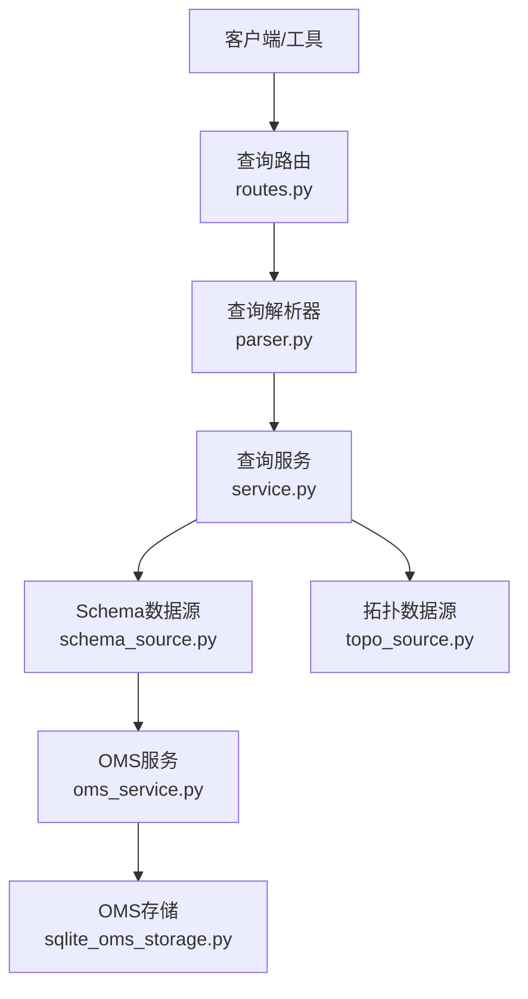
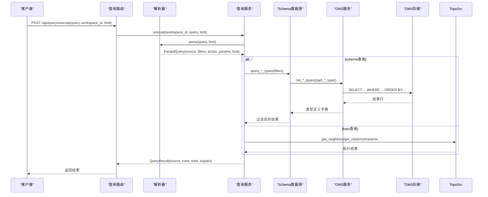
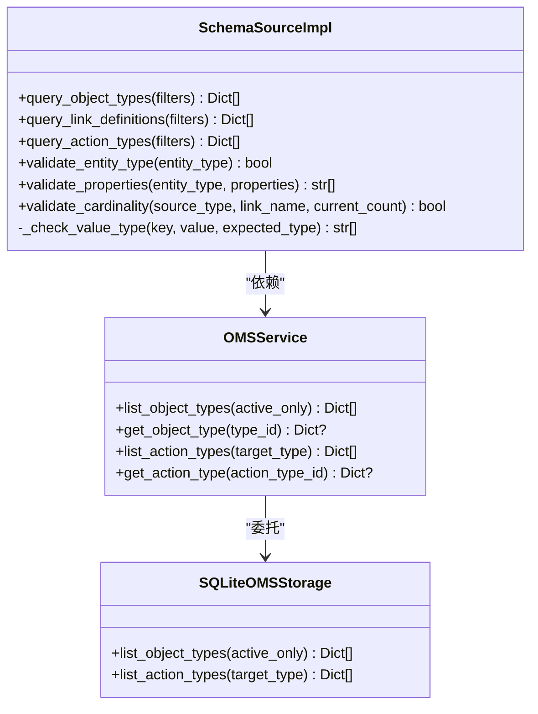
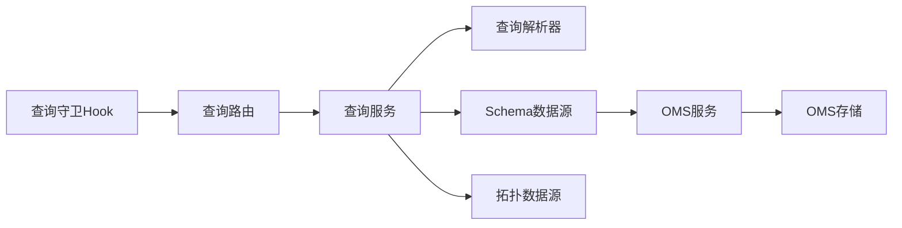

# Schema查询

<cite>
**本文引用的文件**
- [odap/infra/query/routes.py](file://odap/infra/query/routes.py)
- [odap/infra/query/service.py](file://odap/infra/query/service.py)
- [odap/infra/query/parser.py](file://odap/infra/query/parser.py)
- [odap/infra/query/protocols.py](file://odap/infra/query/protocols.py)
- [odap/infra/query/sources/schema_source.py](file://odap/infra/query/sources/schema_source.py)
- [odap/biz/core/ontology/oms/schemas.py](file://odap/biz/core/ontology/oms/schemas.py)
- [odap/biz/core/ontology/oms/services/oms_service.py](file://odap/biz/core/ontology/oms/services/oms_service.py)
- [odap/biz/core/ontology/oms/storage/sqlite_oms_storage.py](file://odap/biz/core/ontology/oms/storage/sqlite_oms_storage.py)
- [odap/biz/core/ontology/oms/routes.py](file://odap/biz/core/ontology/oms/routes.py)
- [odap/infra/query/sources/topo_source.py](file://odap/infra/query/sources/topo_source.py)
- [odap/infra/security/query_guard_hook.py](file://odap/infra/security/query_guard_hook.py)
</cite>

## 目录
1. [简介](#简介)
2. [项目结构](#项目结构)
3. [核心组件](#核心组件)
4. [架构总览](#架构总览)
5. [详细组件分析](#详细组件分析)
6. [依赖分析](#依赖分析)
7. [性能考虑](#性能考虑)
8. [故障排查指南](#故障排查指南)
9. [结论](#结论)
10. [附录](#附录)

## 简介
本文件面向Schema查询功能，系统性阐述在OMS元模型中对Object Types、Link Definitions与Action Types的查询机制。内容涵盖查询语法设计（过滤条件、排序规则、分页参数）、SchemaSourceImpl的实现原理（与SQLite存储的交互与查询优化策略）、查询结果的数据结构与字段含义，并提供完整的查询示例与最佳实践。

## 项目结构
Schema查询位于统一查询服务之下，采用“解析-路由-执行”的分层设计：
- 路由层：提供REST接口，暴露统一查询入口与查询源清单
- 解析层：解析查询表达式，提取来源、过滤条件、动作与参数
- 服务层：调度各数据源，组装结果并返回
- 数据源层：SchemaSourceImpl负责从OMS存储读取类型定义；TopoSourceImpl负责图谱拓扑查询
- 存储层：SQLiteOMSStorage持久化Object Types与Action Types

**图表来源**
- [odap/infra/query/routes.py:1-101](file://odap/infra/query/routes.py#L1-L101)
- [odap/infra/query/parser.py:1-113](file://odap/infra/query/parser.py#L1-L113)
- [odap/infra/query/service.py:1-126](file://odap/infra/query/service.py#L1-L126)
- [odap/infra/query/sources/schema_source.py:1-172](file://odap/infra/query/sources/schema_source.py#L1-L172)
- [odap/infra/query/sources/topo_source.py:1-27](file://odap/infra/query/sources/topo_source.py#L1-L27)
- [odap/biz/core/ontology/oms/services/oms_service.py:1-53](file://odap/biz/core/ontology/oms/services/oms_service.py#L1-L53)
- [odap/biz/core/ontology/oms/storage/sqlite_oms_storage.py:1-200](file://odap/biz/core/ontology/oms/storage/sqlite_oms_storage.py#L1-L200)

**章节来源**
- [odap/infra/query/routes.py:1-101](file://odap/infra/query/routes.py#L1-L101)
- [odap/infra/query/service.py:1-126](file://odap/infra/query/service.py#L1-L126)
- [odap/infra/query/parser.py:1-113](file://odap/infra/query/parser.py#L1-L113)

## 核心组件
- 查询路由与接口
  - 统一执行接口：POST /api/query/execute，支持查询表达式、工作空间ID与返回条数限制
  - 解析接口：POST /api/query/explain，返回解析后的查询结构
  - 查询源清单：GET /api/query/sources，列举.schema/.entity/.topo/.temporal四类查询源及示例
- 查询解析器
  - 解析前缀（.schema/.entity/.topo/.temporal），提取with(...)过滤条件
  - 拓扑查询解析neighbors/path/relations等动作与参数
- 查询服务
  - 单例模式，按来源选择SchemaSourceImpl或TopoSourceImpl执行
  - 统一结果封装，包含source、rows、total与explain
- Schema数据源
  - 从OMS服务读取类型定义，支持按类型ID、名称、激活状态过滤
  - 支持Link Definitions与Action Types的过滤查询
  - 提供类型校验、属性校验与基数校验能力
- OMS服务与存储
  - OMSService封装SQLiteOMSStorage的CRUD与查询
  - SQLiteOMSStorage以JSON字段存储属性、链接、参数等复杂结构

**章节来源**
- [odap/infra/query/routes.py:1-101](file://odap/infra/query/routes.py#L1-L101)
- [odap/infra/query/parser.py:1-113](file://odap/infra/query/parser.py#L1-L113)
- [odap/infra/query/service.py:1-126](file://odap/infra/query/service.py#L1-L126)
- [odap/infra/query/sources/schema_source.py:1-172](file://odap/infra/query/sources/schema_source.py#L1-L172)
- [odap/biz/core/ontology/oms/services/oms_service.py:1-53](file://odap/biz/core/ontology/oms/services/oms_service.py#L1-L53)
- [odap/biz/core/ontology/oms/storage/sqlite_oms_storage.py:1-200](file://odap/biz/core/ontology/oms/storage/sqlite_oms_storage.py#L1-L200)

## 架构总览
统一查询服务将不同来源的查询请求抽象为一致的执行流程，Schema查询通过SchemaSourceImpl与OMS服务/存储协作完成。

**图表来源**
- [odap/infra/query/routes.py:1-101](file://odap/infra/query/routes.py#L1-L101)
- [odap/infra/query/parser.py:1-113](file://odap/infra/query/parser.py#L1-L113)
- [odap/infra/query/service.py:1-126](file://odap/infra/query/service.py#L1-L126)
- [odap/infra/query/sources/schema_source.py:1-172](file://odap/infra/query/sources/schema_source.py#L1-L172)
- [odap/biz/core/ontology/oms/services/oms_service.py:1-53](file://odap/biz/core/ontology/oms/services/oms_service.py#L1-L53)
- [odap/biz/core/ontology/oms/storage/sqlite_oms_storage.py:1-200](file://odap/biz/core/ontology/oms/storage/sqlite_oms_storage.py#L1-L200)

## 详细组件分析

### 查询语法设计
- 语法结构
  - 前缀：.schema/.entity/.topo/.temporal
  - 过滤：with(...)，键值对形式，值自动去引号
  - 动作与参数：.topo.neighbors(id=..., depth=...) 等
- 过滤条件
  - .schema with(kind='...')：kind可为object_types、link_definitions、action_types
  - object_types：type_id、name、is_active
  - link_definitions：source_type、target_type、name
  - action_types：action_type_id、target_object_type、name
- 排序规则
  - SQLiteOMSStorage按name排序返回
- 分页参数
  - 通过limit参数限制返回条数
  - 服务层对结果截断并返回total

**章节来源**
- [odap/infra/query/parser.py:1-113](file://odap/infra/query/parser.py#L1-L113)
- [odap/infra/query/service.py:1-126](file://odap/infra/query/service.py#L1-L126)
- [odap/infra/query/routes.py:1-101](file://odap/infra/query/routes.py#L1-L101)
- [odap/biz/core/ontology/oms/storage/sqlite_oms_storage.py:168-177](file://odap/biz/core/ontology/oms/storage/sqlite_oms_storage.py#L168-L177)

### SchemaSourceImpl实现原理
- 依赖注入与懒加载
  - 缺省情况下通过get_oms_service()获取OMS实例
- 查询方法
  - query_object_types：遍历所有类型，按过滤条件匹配
  - query_link_definitions：遍历每个类型的links数组，按过滤条件匹配
  - query_action_types：遍历所有动作类型，按过滤条件匹配
- 校验能力
  - validate_entity_type：校验实体类型是否注册
  - validate_properties：校验属性必填与类型匹配
  - validate_cardinality：校验关系基数（1:1/1:N等）

**图表来源**
- [odap/infra/query/sources/schema_source.py:1-172](file://odap/infra/query/sources/schema_source.py#L1-L172)
- [odap/biz/core/ontology/oms/services/oms_service.py:1-53](file://odap/biz/core/ontology/oms/services/oms_service.py#L1-L53)
- [odap/biz/core/ontology/oms/storage/sqlite_oms_storage.py:1-200](file://odap/biz/core/ontology/oms/storage/sqlite_oms_storage.py#L1-L200)

**章节来源**
- [odap/infra/query/sources/schema_source.py:1-172](file://odap/infra/query/sources/schema_source.py#L1-L172)

### OMS元模型数据结构
- ObjectTypeDefinition
  - 字段：type_id、name、display_name、description、properties、links、actions、图标/颜色、激活状态、父类型、时间戳
- LinkDefinition
  - 字段：name、display_name、source_type、target_type、cardinality、description、属性列表、双向标志、反向名
- ActionTypeDefinition
  - 字段：action_type_id、name、display_name、description、target_object_type、parameters、OPA策略、所需角色、回写配置、确认要求、激活状态
- 属性与参数
  - PropertyDefinition：name/display_name/property_type/required/default/description/reference_type/enum_values/constraints
  - ActionParameter：name/display_name/param_type/required/default/description

**章节来源**
- [odap/biz/core/ontology/oms/schemas.py:1-136](file://odap/biz/core/ontology/oms/schemas.py#L1-L136)

### 与Graphiti图数据库的交互
- Schema查询本身不直接访问Graphiti，而是查询OMS元模型
- 拓扑查询（.topo）通过TopoSourceImpl与GraphManager交互，实现邻居查询、关系查询与子图遍历
- 时态查询（.temporal）通过GraphManager实现历史版本与有效时间查询

**章节来源**
- [odap/infra/query/sources/topo_source.py:1-27](file://odap/infra/query/sources/topo_source.py#L1-L27)
- [odap/infra/query/service.py:115-126](file://odap/infra/query/service.py#L115-L126)

### 查询示例
- 查询实体类型定义
  - .schema with(kind='object_types', type_id='Unit')
  - .schema with(kind='object_types', name='Unit')
  - .schema with(kind='object_types', is_active=true)
- 查询关系链接定义
  - .schema with(kind='link_definitions', source_type='Unit', target_type='Location')
  - .schema with(kind='link_definitions', name='command_of')
- 查询动作类型信息
  - .schema with(kind='action_types', target_object_type='Unit')
  - .schema with(kind='action_types', action_type_id='attack')
- 解析查询结构
  - POST /api/query/explain?query=.schema%20with(kind='object_types')

**章节来源**
- [odap/infra/query/routes.py:53-101](file://odap/infra/query/routes.py#L53-L101)
- [odap/infra/query/service.py:61-70](file://odap/infra/query/service.py#L61-L70)

### 查询结果数据结构
- QueryResult
  - source：查询来源（schema/entity/topo/temporal）
  - rows：查询结果列表（字典）
  - total：结果总数
  - explain：解析后的查询解释（可选）
- Schema查询返回的类型定义字典包含：
  - ObjectTypeDefinition：type_id/name/properties/links/actions等
  - LinkDefinition：name/source_type/target_type/cardinality/properties等
  - ActionTypeDefinition：action_type_id/name/target_object_type/parameters等

**章节来源**
- [odap/infra/query/protocols.py:1-40](file://odap/infra/query/protocols.py#L1-L40)
- [odap/biz/core/ontology/oms/schemas.py:72-86](file://odap/biz/core/ontology/oms/schemas.py#L72-L86)

## 依赖分析
- 组件耦合
  - 路由层仅依赖查询服务协议；服务层依赖解析器与数据源协议
  - SchemaSourceImpl依赖OMS服务；OMS服务依赖SQLite存储
- 外部依赖
  - FastAPI路由与HTTP异常处理
  - SQLite数据库与JSON序列化
- 查询守卫
  - OpenHarness查询守卫对query_schema等工具参数进行安全描述与默认值声明

**图表来源**
- [odap/infra/query/routes.py:1-101](file://odap/infra/query/routes.py#L1-L101)
- [odap/infra/query/service.py:1-126](file://odap/infra/query/service.py#L1-L126)
- [odap/infra/query/parser.py:1-113](file://odap/infra/query/parser.py#L1-L113)
- [odap/infra/query/sources/schema_source.py:1-172](file://odap/infra/query/sources/schema_source.py#L1-L172)
- [odap/biz/core/ontology/oms/services/oms_service.py:1-53](file://odap/biz/core/ontology/oms/services/oms_service.py#L1-L53)
- [odap/biz/core/ontology/oms/storage/sqlite_oms_storage.py:1-200](file://odap/biz/core/ontology/oms/storage/sqlite_oms_storage.py#L1-L200)
- [odap/infra/security/query_guard_hook.py:95-120](file://odap/infra/security/query_guard_hook.py#L95-L120)

**章节来源**
- [odap/infra/security/query_guard_hook.py:95-120](file://odap/infra/security/query_guard_hook.py#L95-L120)

## 性能考虑
- 查询优化策略
  - SchemaSourceImpl采用内存过滤：先全量读取再过滤，适合类型定义规模较小的场景
  - SQLiteOMSStorage按name排序，便于稳定输出
- 建议
  - 对高频过滤字段（如type_id、action_type_id）在存储层建立索引
  - 对大结果集启用limit并结合explain分析
  - 将复杂过滤拆分为多步查询，减少单次过滤成本

[本节为通用建议，无需特定文件来源]

## 故障排查指南
- 常见问题
  - 查询无结果：检查kind与过滤键是否正确；确认is_active与目标类型存在
  - 解析错误：确保with(...)格式正确，键值对之间用逗号分隔
  - 工具调用受限：检查查询守卫对query_schema的参数描述与默认值
- 定位步骤
  - 使用POST /api/query/explain确认解析结果
  - 检查OMS存储中是否存在对应类型定义
  - 查看服务层日志与异常返回

**章节来源**
- [odap/infra/query/service.py:52-59](file://odap/infra/query/service.py#L52-L59)
- [odap/infra/security/query_guard_hook.py:95-120](file://odap/infra/security/query_guard_hook.py#L95-L120)

## 结论
Schema查询通过统一的解析与执行框架，将OMS元模型中的Object Types、Link Definitions与Action Types以一致的方式对外提供。SchemaSourceImpl承担了类型读取与校验职责，配合SQLite存储实现轻量高效的数据访问。未来可在存储层引入索引与分页、在服务层引入缓存与并发控制，进一步提升查询性能与稳定性。

## 附录
- OMS REST API（与Schema查询相关）
  - GET /api/ontology/oms/object-types?active_only={bool}
  - GET /api/ontology/oms/object-types/{type_id}
  - GET /api/ontology/oms/action-types?target_type={type}
  - GET /api/ontology/oms/action-types/{action_type_id}

**章节来源**
- [odap/biz/core/ontology/oms/routes.py:1-99](file://odap/biz/core/ontology/oms/routes.py#L1-L99)