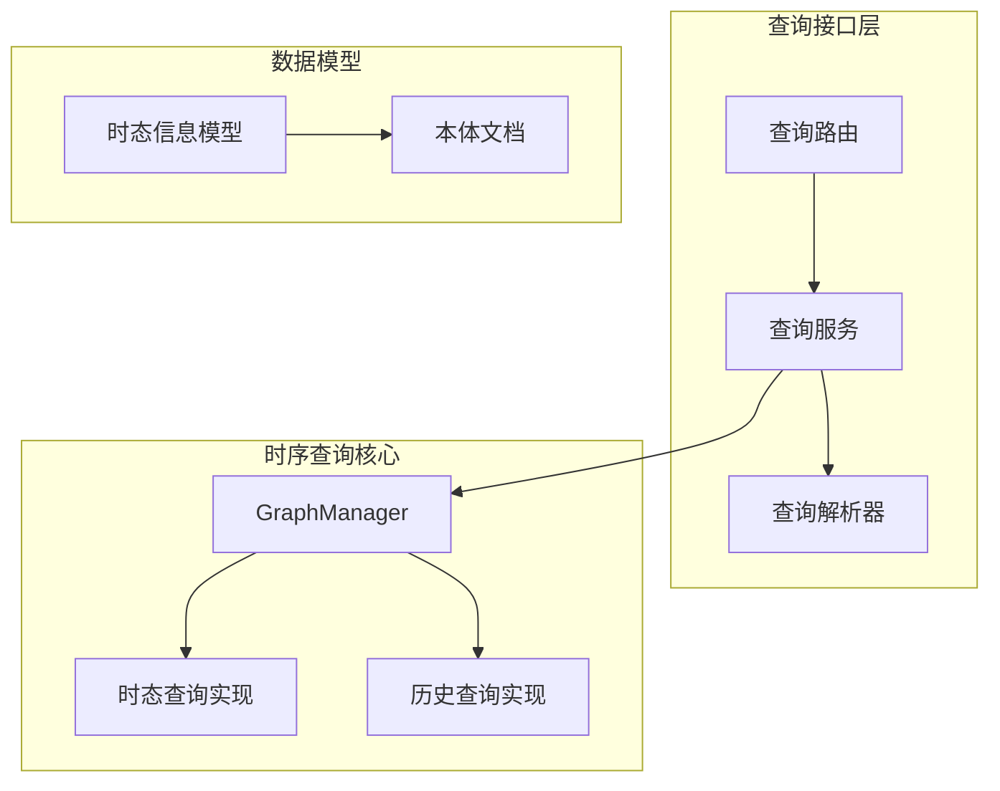
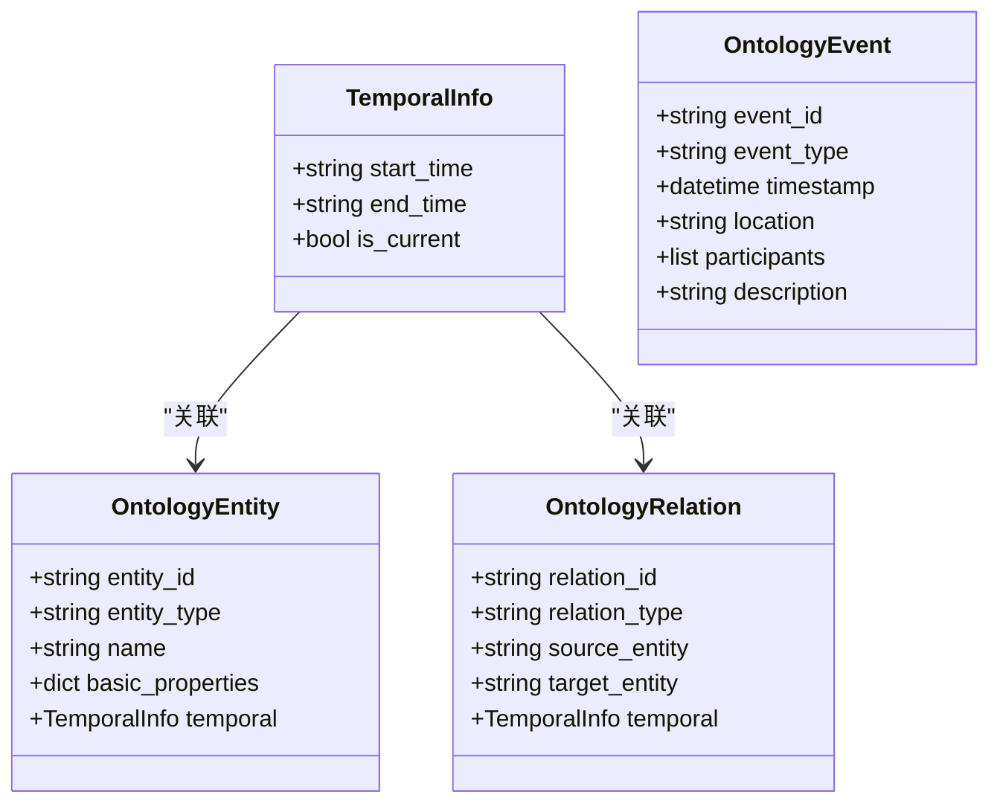
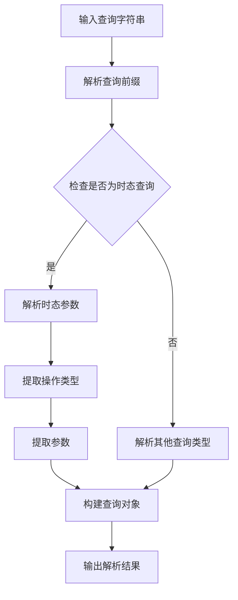
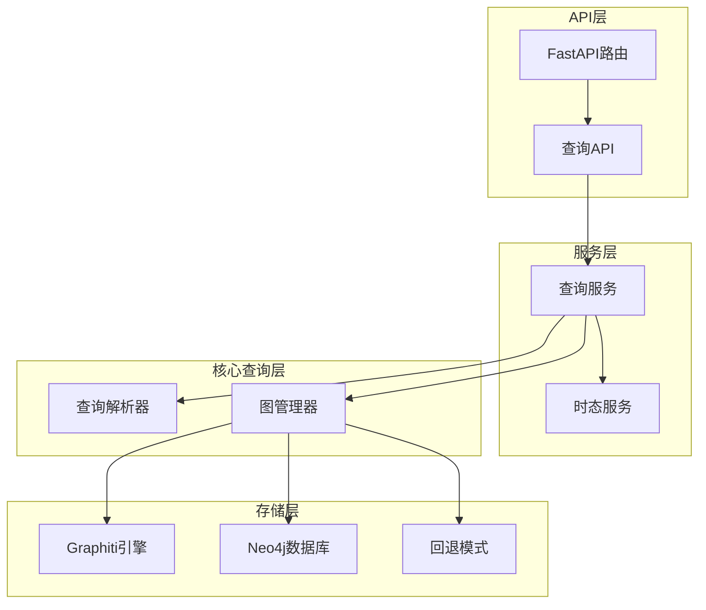
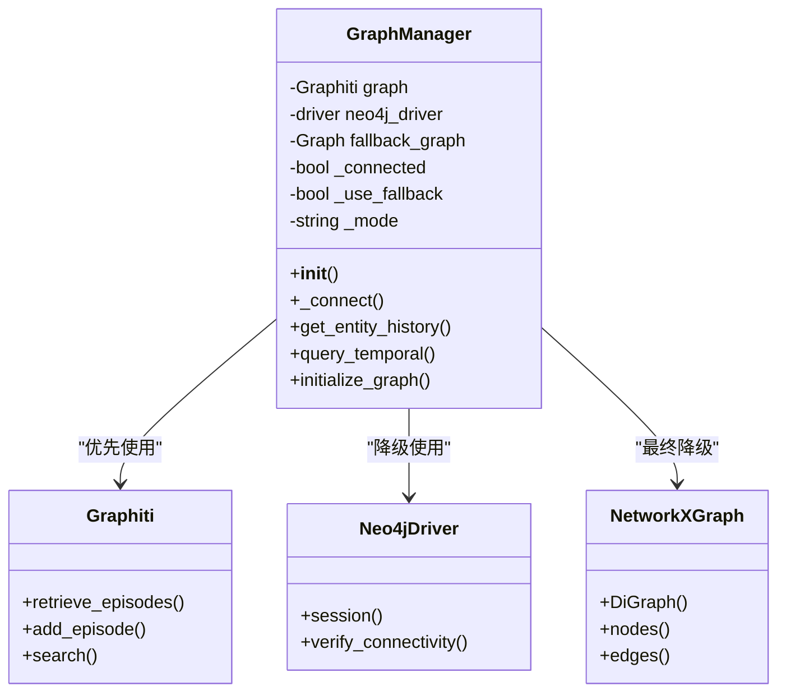
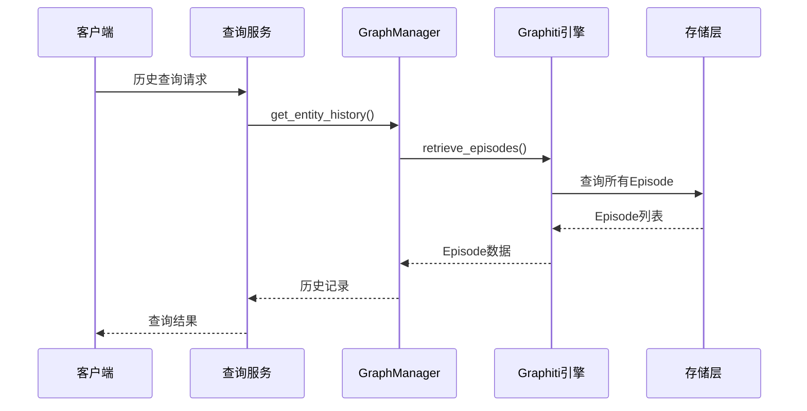
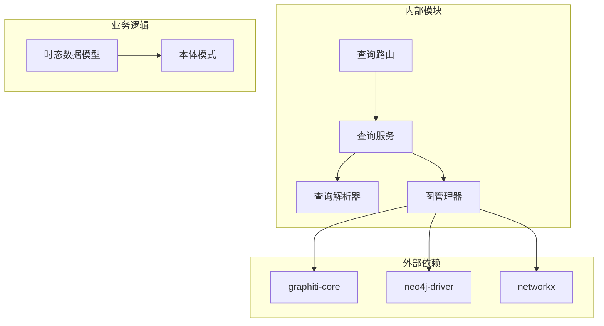
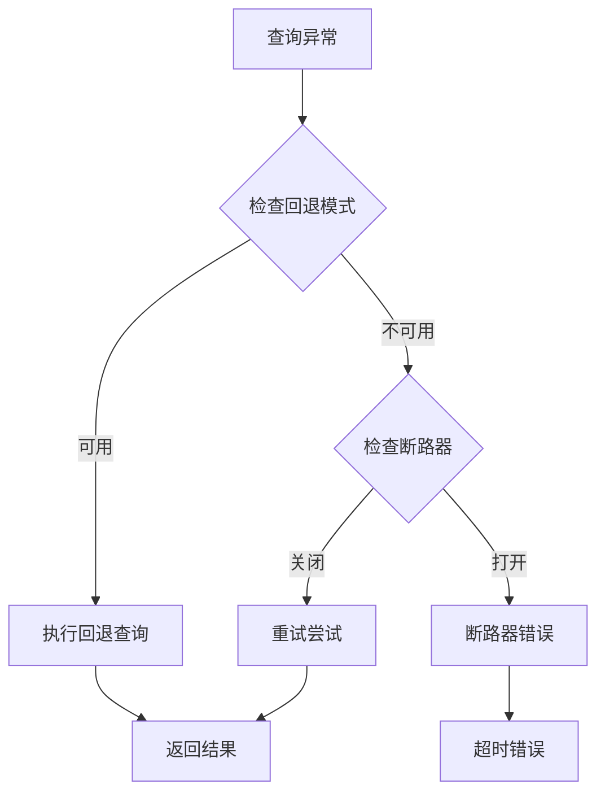

# Temporal时序查询

<cite>
**本文档引用的文件**
- [graph_service.py](file://odap/infra/graph/graph_service.py)
- [service.py](file://odap/infra/query/service.py)
- [parser.py](file://odap/infra/query/parser.py)
- [routes.py](file://odap/infra/query/routes.py)
- [DESIGN.md](file://docs/03-modules/qa_engine/DESIGN.md)
- [document.py](file://odap/biz/core/ontology/schema/document.py)
- [ingestion.py](file://odap/biz/core/ontology/ingestion_split/ingestion.py)
- [query_guard_hook.py](file://odap/infra/openharness/query_guard_hook.py)
</cite>

## 目录
1. [简介](#简介)
2. [项目结构](#项目结构)
3. [核心组件](#核心组件)
4. [架构概览](#架构概览)
5. [详细组件分析](#详细组件分析)
6. [依赖关系分析](#依赖关系分析)
7. [性能考虑](#性能考虑)
8. [故障排除指南](#故障排除指南)
9. [结论](#结论)

## 简介

Temporal时序查询功能是基于Graphiti双时态知识图谱的核心特性，提供了强大的历史数据查询和时态关系分析能力。该功能支持两种关键的时间维度：valid_time（有效时间）和transaction_time（事务时间），能够精确追踪实体状态的历史变化和数据的记录时间。

Graphiti作为双时态知识图谱引擎，通过EpisodicNode概念实现了时间序列化的知识表示，每个实体状态都被封装为具有时间戳的Episode，从而支持复杂的历史查询场景。

## 项目结构

Temporal时序查询功能在代码库中的组织结构如下：

**图表来源**
- [routes.py:18-101](file://odap/infra/query/routes.py#L18-L101)
- [service.py:11-126](file://odap/infra/query/service.py#L11-L126)
- [graph_service.py:71-1457](file://odap/infra/graph/graph_service.py#L71-L1457)

**章节来源**
- [routes.py:18-101](file://odap/infra/query/routes.py#L18-L101)
- [service.py:11-126](file://odap/infra/query/service.py#L11-L126)
- [graph_service.py:71-1457](file://odap/infra/graph/graph_service.py#L71-L1457)

## 核心组件

### 双时态数据模型

Temporal时序查询的核心在于理解两种时间维度的区别和应用场景：

**有效时间（Valid Time）**
- 表示实体状态在现实世界中有效的时间段
- 用于回答"在某个时间点，实体处于什么状态"的问题
- 支持时间范围查询和历史快照查询

**事务时间（Transaction Time）**
- 表示数据被记录到系统中的时间点
- 用于回答"何时记录了某个事实"的问题
- 支持数据完整性检查和审计追踪

**图表来源**
- [document.py:85-123](file://odap/biz/core/ontology/schema/document.py#L85-L123)

**章节来源**
- [document.py:85-123](file://odap/biz/core/ontology/schema/document.py#L85-L123)
- [ingestion.py:600-635](file://odap/biz/core/ontology/ingestion_split/ingestion.py#L600-L635)

### 查询解析器

查询解析器负责将自然语言查询转换为结构化的查询参数：

**图表来源**
- [parser.py:31-81](file://odap/infra/query/parser.py#L31-L81)

**章节来源**
- [parser.py:31-81](file://odap/infra/query/parser.py#L31-L81)

## 架构概览

Temporal时序查询的整体架构采用分层设计，确保了功能的模块化和可扩展性：

**图表来源**
- [routes.py:18-101](file://odap/infra/query/routes.py#L18-L101)
- [service.py:11-126](file://odap/infra/query/service.py#L11-L126)
- [graph_service.py:71-1457](file://odap/infra/graph/graph_service.py#L71-L1457)

## 详细组件分析

### GraphManager实现机制

GraphManager是时序查询的核心组件，实现了三层降级策略以确保系统的可靠性：

**图表来源**
- [graph_service.py:71-1457](file://odap/infra/graph/graph_service.py#L71-L1457)

#### 时序数据存储结构

Graphiti通过EpisodicNode实现时序数据的存储，每个实体状态都被封装为具有时间戳的Episode：

**章节来源**
- [graph_service.py:1368-1457](file://odap/infra/graph/graph_service.py#L1368-L1457)

### 关键查询操作实现

#### 历史轨迹查询

历史轨迹查询用于获取实体的完整历史变更记录：

**图表来源**
- [graph_service.py:1368-1403](file://odap/infra/graph/graph_service.py#L1368-L1403)
- [service.py:115-125](file://odap/infra/query/service.py#L115-L125)

#### 快照查询

快照查询用于获取指定时间点的实体状态：

**章节来源**
- [graph_service.py:1405-1457](file://odap/infra/graph/graph_service.py#L1405-L1457)

#### 时态范围查询

时态范围查询支持在指定时间范围内检索相关实体：

**章节来源**
- [graph_service.py:1422-1457](file://odap/infra/graph/graph_service.py#L1422-L1457)

### 查询优化策略

时序查询实现了多种优化策略以提升性能：

1. **连接池管理**：通过连接池减少数据库连接开销
2. **断路器模式**：防止级联故障影响系统稳定性
3. **降级策略**：在不同组件不可用时提供备选方案
4. **缓存机制**：利用性能监控数据优化查询效率

**章节来源**
- [graph_service.py:299-443](file://odap/infra/graph/graph_service.py#L299-L443)

## 依赖关系分析

Temporal时序查询功能的依赖关系体现了清晰的分层架构：

**图表来源**
- [graph_service.py:51-69](file://odap/infra/graph/graph_service.py#L51-L69)
- [routes.py:18-101](file://odap/infra/query/routes.py#L18-L101)

**章节来源**
- [graph_service.py:51-69](file://odap/infra/graph/graph_service.py#L51-L69)
- [routes.py:18-101](file://odap/infra/query/routes.py#L18-L101)

## 性能考虑

### 查询性能优化

时序查询在设计时充分考虑了性能优化：

1. **异步查询处理**：使用async/await模式提升并发性能
2. **连接池优化**：合理配置连接池大小和超时时间
3. **断路器保护**：防止下游服务故障影响整体性能
4. **降级策略**：在组件失效时提供快速响应

### 内存管理

回退模式使用NetworkX进行内存图存储，适合小规模数据集：

**章节来源**
- [graph_service.py:477-517](file://odap/infra/graph/graph_service.py#L477-L517)

## 故障排除指南

### 常见问题诊断

1. **Graphiti连接失败**
   - 检查graphiti-core安装状态
   - 验证Neo4j数据库连接配置
   - 查看断路器状态

2. **查询超时**
   - 检查连接池配置
   - 监控数据库性能指标
   - 调整查询参数范围

3. **历史查询为空**
   - 确认实体ID格式正确
   - 验证时间戳格式
   - 检查数据加载状态

### 错误处理机制

系统实现了多层次的错误处理：

**图表来源**
- [graph_service.py:370-405](file://odap/infra/graph/graph_service.py#L370-L405)

**章节来源**
- [graph_service.py:370-405](file://odap/infra/graph/graph_service.py#L370-L405)

## 结论

Temporal时序查询功能通过Graphiti双时态知识图谱提供了强大的历史数据查询能力。该系统的设计充分考虑了可靠性、性能和可扩展性，通过三层降级策略确保了在各种故障情况下的稳定运行。

核心优势包括：
- **双时态支持**：有效时间和事务时间的精确区分
- **灵活查询**：支持历史轨迹、快照和范围查询
- **高可用性**：多层降级和断路器保护
- **性能优化**：连接池管理和异步处理

该功能为复杂的历史数据分析和时态关系探索提供了坚实的技术基础，适用于军事态势感知、供应链追踪、金融风控等多个应用场景。