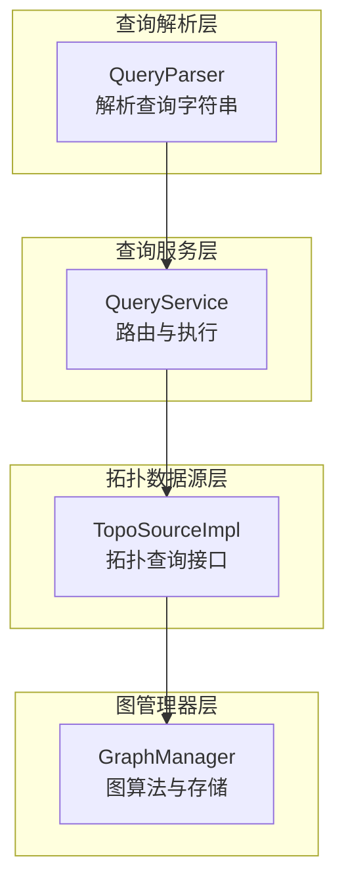
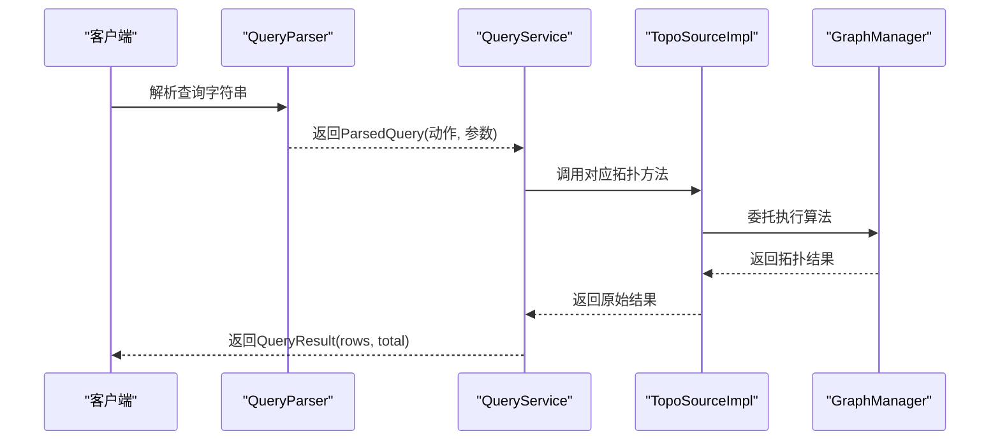
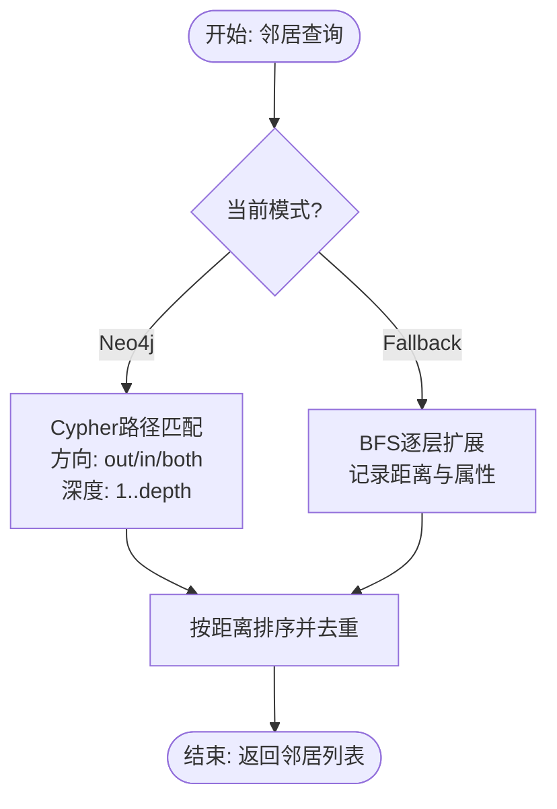
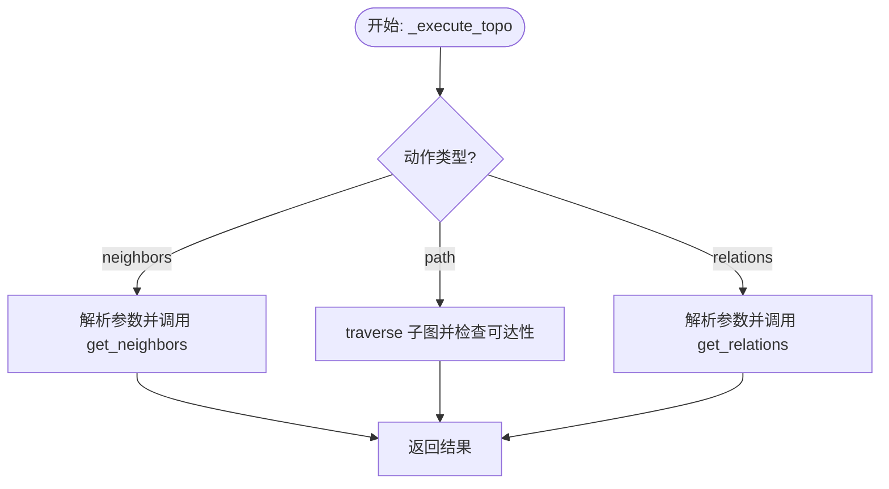
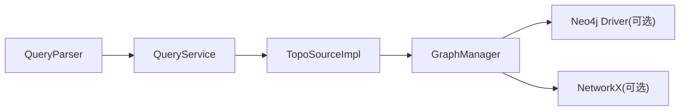

# Topo拓扑查询

<cite>
**本文档引用的文件**
- [topo_source.py](file://odap/infra/query/sources/topo_source.py)
- [graph_service.py](file://odap/infra/graph/graph_service.py)
- [service.py](file://odap/infra/query/service.py)
- [parser.py](file://odap/infra/query/parser.py)
- [user_cognition_engine.py](file://odap/biz/core/cognition/user_cognition_engine.py)
- [test_graph_service.py](file://tests/unit/test_graph_service.py)
</cite>

## 目录
1. [简介](#简介)
2. [项目结构](#项目结构)
3. [核心组件](#核心组件)
4. [架构总览](#架构总览)
5. [详细组件分析](#详细组件分析)
6. [依赖分析](#依赖分析)
7. [性能考虑](#性能考虑)
8. [故障排除指南](#故障排除指南)
9. [结论](#结论)
10. [附录](#附录)

## 简介
本文件针对Topo拓扑查询功能进行深入技术文档编制，重点解释以下内容：
- 拓扑查询的核心算法：邻居查询、路径查找、关系遍历的实现原理
- TopoSourceImpl的图算法设计：广度优先搜索（BFS）、关系遍历与子图提取
- 查询参数设计：方向性设置（in/out/both）、遍历深度限制、关系类型过滤
- 查询结果数据结构：节点信息、边关系、路径详情的组织方式
- 实际查询示例：如何通过查询语法表达复杂网络关系的探索与分析

## 项目结构
Topo拓扑查询功能位于查询子系统中，主要由以下层次构成：
- 查询解析层：负责解析自然语言风格的查询字符串，识别来源、动作与参数
- 查询服务层：根据解析结果路由到具体的数据源实现
- 拓扑数据源层：对外暴露拓扑查询接口（邻居、关系、遍历）
- 图管理器层：承载底层图存储与算法实现（Neo4j直连、Graphiti双时态、NetworkX回退）

**图表来源**
- [parser.py:31-81](file://odap/infra/query/parser.py#L31-L81)
- [service.py:33-59](file://odap/infra/query/service.py#L33-L59)
- [topo_source.py:4-27](file://odap/infra/query/sources/topo_source.py#L4-L27)
- [graph_service.py:71-143](file://odap/infra/graph/graph_service.py#L71-L143)

**章节来源**
- [parser.py:1-113](file://odap/infra/query/parser.py#L1-L113)
- [service.py:11-126](file://odap/infra/query/service.py#L11-L126)
- [topo_source.py:1-28](file://odap/infra/query/sources/topo_source.py#L1-L28)
- [graph_service.py:1-300](file://odap/infra/graph/graph_service.py#L1-L300)

## 核心组件
- TopoSourceImpl：对外提供拓扑查询接口，内部委托给GraphManager执行具体算法
- GraphManager：实现三层降级模式（Graphiti → Neo4j Driver → NetworkX fallback），提供邻居查询、关系查询、图遍历等能力
- QueryService：解析查询字符串，路由到拓扑查询的具体动作（neighbors/path/relations）
- QueryParser：解析查询前缀、with过滤条件、拓扑动作与参数

关键职责与交互：
- QueryParser识别查询来源（.topo）与动作（neighbors/path/relations），并解析参数
- QueryService根据动作调用TopoSourceImpl对应方法，并对结果进行裁剪与封装
- TopoSourceImpl将请求转发至GraphManager，GraphManager根据当前模式选择最优算法实现

**章节来源**
- [topo_source.py:4-27](file://odap/infra/query/sources/topo_source.py#L4-L27)
- [graph_service.py:71-143](file://odap/infra/graph/graph_service.py#L71-L143)
- [service.py:91-113](file://odap/infra/query/service.py#L91-L113)
- [parser.py:31-81](file://odap/infra/query/parser.py#L31-L81)

## 架构总览
拓扑查询的端到端流程如下：

**图表来源**
- [parser.py:31-81](file://odap/infra/query/parser.py#L31-L81)
- [service.py:33-59](file://odap/infra/query/service.py#L33-L59)
- [topo_source.py:14-27](file://odap/infra/query/sources/topo_source.py#L14-L27)
- [graph_service.py:2136-2256](file://odap/infra/graph/graph_service.py#L2136-L2256)

## 详细组件分析

### 组件一：TopoSourceImpl（拓扑数据源）
- 职责：提供拓扑查询的统一入口，屏蔽底层图存储差异
- 方法：
  - get_neighbors：按方向与深度查询邻居
  - get_relations：查询实体关系，支持按关系类型过滤
  - traverse：从起点开始按最大深度遍历，返回子图（节点与边集合）

实现要点：
- 延迟初始化GraphManager，避免不必要的依赖
- 将查询参数透传给GraphManager，保持接口一致性

**章节来源**
- [topo_source.py:4-27](file://odap/infra/query/sources/topo_source.py#L4-L27)

### 组件二：GraphManager（图算法与存储）
- 模式降级：Graphiti（核心）→ Neo4j Driver（直连）→ NetworkX fallback（纯内存）
- 邻居查询算法：
  - Neo4j模式：使用Cypher的路径匹配，支持方向控制（out/in/both）与深度限制
  - 回退模式：使用BFS逐层扩展，记录距离与节点属性
- 图遍历算法：
  - Neo4j模式：先查节点再查边，去重并补充起始节点
  - 回退模式：BFS队列扩展，收集节点与边，支持最大深度限制
- 关系查询：
  - Neo4j模式：双向关系查询并返回目标、关系类型与属性
  - 回退模式：遍历邻接关系并返回标准化结构

**图表来源**
- [graph_service.py:2064-2134](file://odap/infra/graph/graph_service.py#L2064-L2134)
- [graph_service.py:2153-2208](file://odap/infra/graph/graph_service.py#L2153-L2208)

**章节来源**
- [graph_service.py:2064-2134](file://odap/infra/graph/graph_service.py#L2064-L2134)
- [graph_service.py:2153-2208](file://odap/infra/graph/graph_service.py#L2153-L2208)
- [graph_service.py:1937-1953](file://odap/infra/graph/graph_service.py#L1937-L1953)

### 组件三：QueryService（查询路由）
- 动作路由：
  - neighbors：解析id、direction、depth，调用TopoSourceImpl.get_neighbors
  - path：解析from、to、max_depth，先traverse获取子图，再判断目标是否可达
  - relations：解析id与type，调用TopoSourceImpl.get_relations
- 结果封装：将结果裁剪到limit并封装为QueryResult

**图表来源**
- [service.py:91-113](file://odap/infra/query/service.py#L91-L113)

**章节来源**
- [service.py:91-113](file://odap/infra/query/service.py#L91-L113)

### 组件四：QueryParser（查询解析）
- 识别来源前缀：.topo/.entity/.schema/.temporal
- 解析with过滤条件与动作参数：
  - neighbors/relations：解析id、direction、depth、type等
  - path：解析from、to、max_hops（映射为max_depth）
- 返回ParsedQuery对象供QueryService使用

**章节来源**
- [parser.py:31-81](file://odap/infra/query/parser.py#L31-L81)
- [parser.py:94-112](file://odap/infra/query/parser.py#L94-L112)

## 依赖分析
- 模块耦合：
  - QueryService依赖QueryParser与TopoSourceImpl
  - TopoSourceImpl依赖GraphManager
  - GraphManager根据运行环境自动选择Neo4j或NetworkX实现
- 外部依赖：
  - Neo4j Driver（可选）：用于Cypher直连与图遍历
  - graphiti-core（可选）：提供双时态知识图谱能力
  - NetworkX（可选）：作为回退方案

**图表来源**
- [service.py:27-31](file://odap/infra/query/service.py#L27-L31)
- [topo_source.py:8-12](file://odap/infra/query/sources/topo_source.py#L8-L12)
- [graph_service.py:52-69](file://odap/infra/graph/graph_service.py#L52-L69)

**章节来源**
- [service.py:27-31](file://odap/infra/query/service.py#L27-L31)
- [topo_source.py:8-12](file://odap/infra/query/sources/topo_source.py#L8-L12)
- [graph_service.py:52-69](file://odap/infra/graph/graph_service.py#L52-L69)

## 性能考虑
- 模式选择：
  - Graphiti与Neo4j Driver具备更强的索引与查询优化能力，适合大规模图谱
  - NetworkX回退模式适合小规模或离线场景，但扩展性有限
- 查询限制：
  - 邻居查询与遍历均对深度进行范围限制（如1-5），防止指数爆炸
  - Neo4j模式使用LIMIT与DISTINCT减少结果集大小
- 缓存与断路器：
  - GraphManager内置查询时间统计、缓存命中计数与断路器逻辑，提升稳定性

**章节来源**
- [graph_service.py:2148-2149](file://odap/infra/graph/graph_service.py#L2148-L2149)
- [graph_service.py:2156-2162](file://odap/infra/graph/graph_service.py#L2156-L2162)
- [graph_service.py:135-138](file://odap/infra/graph/graph_service.py#L135-L138)
- [graph_service.py:129-133](file://odap/infra/graph/graph_service.py#L129-L133)

## 故障排除指南
- Neo4j连接失败：
  - 观察重连尝试次数与模式切换日志；确认凭据与网络连通性
- 查询超时或结果为空：
  - 检查workspace_id过滤条件与实体是否存在
  - 调整max_depth或direction参数以缩小搜索范围
- 关系查询无结果：
  - 确认关系类型是否正确；GraphManager会返回标准化的关系列表

**章节来源**
- [graph_service.py:186-212](file://odap/infra/graph/graph_service.py#L186-L212)
- [graph_service.py:2097-2099](file://odap/infra/graph/graph_service.py#L2097-L2099)
- [graph_service.py:1937-1953](file://odap/infra/graph/graph_service.py#L1937-L1953)

## 结论
Topo拓扑查询通过清晰的分层设计实现了灵活而高效的图查询能力。其核心优势在于：
- 明确的查询语法与参数模型，便于表达复杂的网络探索需求
- 三层降级的图存储与算法实现，兼顾性能与可靠性
- BFS与Cypher路径匹配相结合，既保证了可扩展性又提供了精确的拓扑分析

## 附录

### 查询参数设计与示例
- 邻居查询（neighbors）
  - 参数：id（必填）、direction（in/out/both，默认both）、depth（1-5，默认1）
  - 示例：.topo neighbors(id='E001', direction='out', depth=2)
- 路径查询（path）
  - 参数：from（起点）、to（终点）、max_depth（最大深度，默认5，映射自max_hops）
  - 示例：.topo path(from='E001', to='E005', max_depth=3)
- 关系查询（relations）
  - 参数：id（必填）、type（可选，按关系类型过滤）
  - 示例：.topo relations(id='E001', type='PART_OF')

**章节来源**
- [parser.py:48-63](file://odap/infra/query/parser.py#L48-L63)
- [parser.py:94-112](file://odap/infra/query/parser.py#L94-L112)
- [service.py:91-113](file://odap/infra/query/service.py#L91-L113)

### 查询结果数据结构
- 邻居查询结果（List[Dict]）：
  - 字段：id、type、name、distance
- 关系查询结果（List[Dict]）：
  - 字段：target、type、properties
- 图遍历结果（Dict）：
  - 字段：nodes（List[Dict]）、edges（List[Dict]）、start_id、max_depth
  - nodes条目字段：id、type、name、properties
  - edges条目字段：source、target、type、properties

**章节来源**
- [graph_service.py:2090-2096](file://odap/infra/graph/graph_service.py#L2090-L2096)
- [graph_service.py:2182-2201](file://odap/infra/graph/graph_service.py#L2182-L2201)
- [graph_service.py:2219-2225](file://odap/infra/graph/graph_service.py#L2219-L2225)
- [graph_service.py:2230-2235](file://odap/infra/graph/graph_service.py#L2230-L2235)
- [graph_service.py:1948-1953](file://odap/infra/graph/graph_service.py#L1948-L1953)

### 实际使用示例（来自业务集成）
- 用户认知引擎通过查询服务执行拓扑邻居查询，获取实体上下文中的邻居信息
- 示例调用路径：.topo neighbors(id='某实体ID', depth=1)

**章节来源**
- [user_cognition_engine.py:416-420](file://odap/biz/core/cognition/user_cognition_engine.py#L416-L420)
- [user_cognition_engine.py:443-448](file://odap/biz/core/cognition/user_cognition_engine.py#L443-L448)