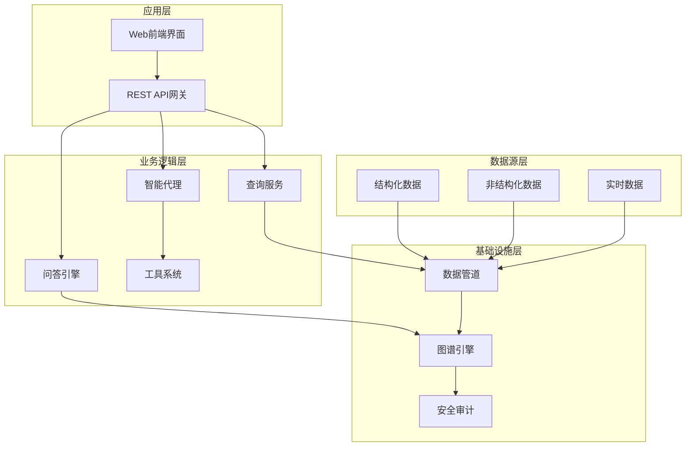
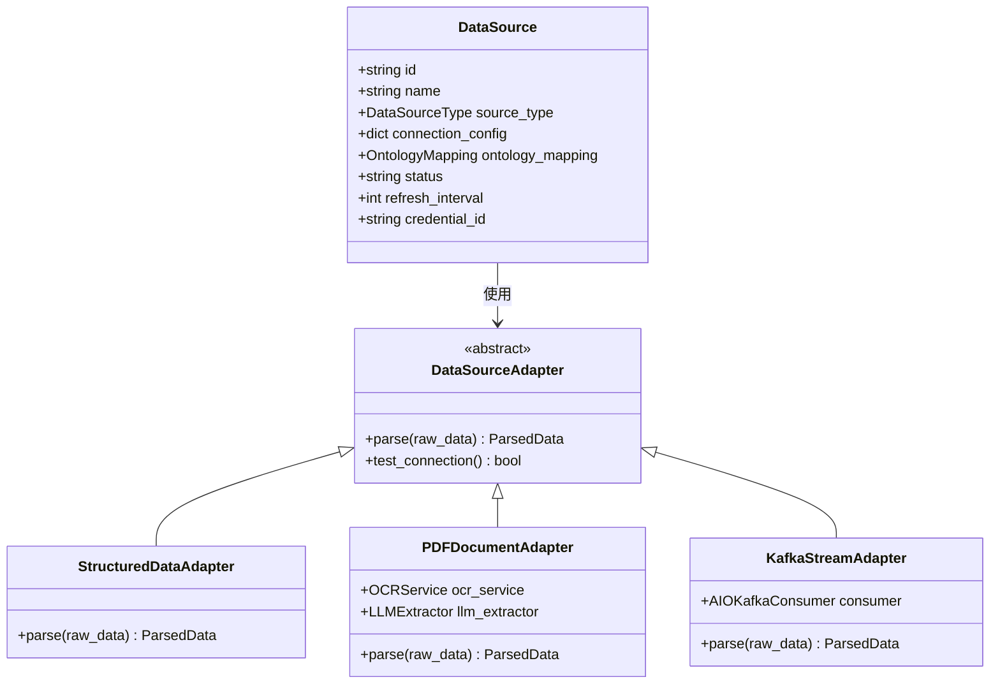
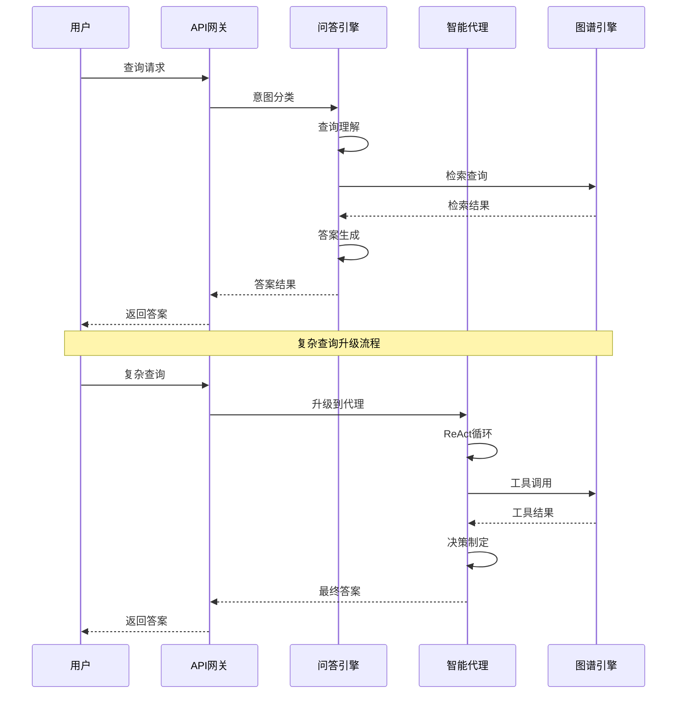
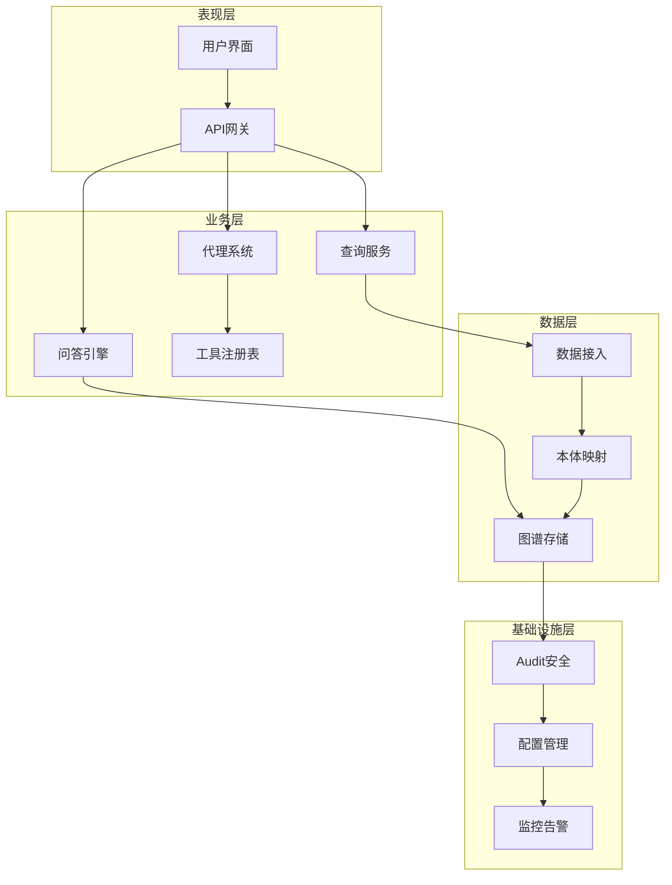
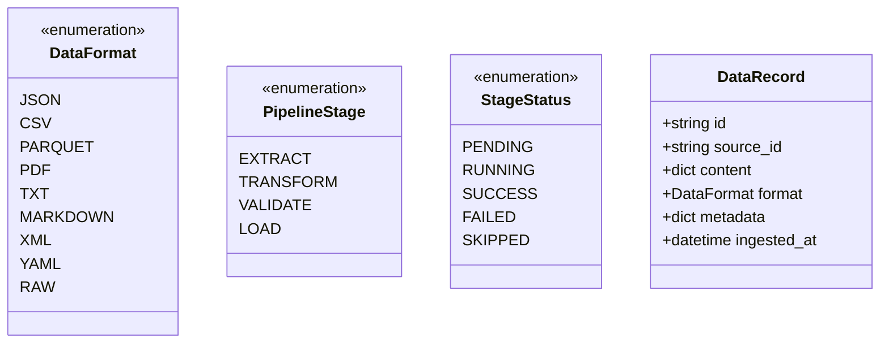
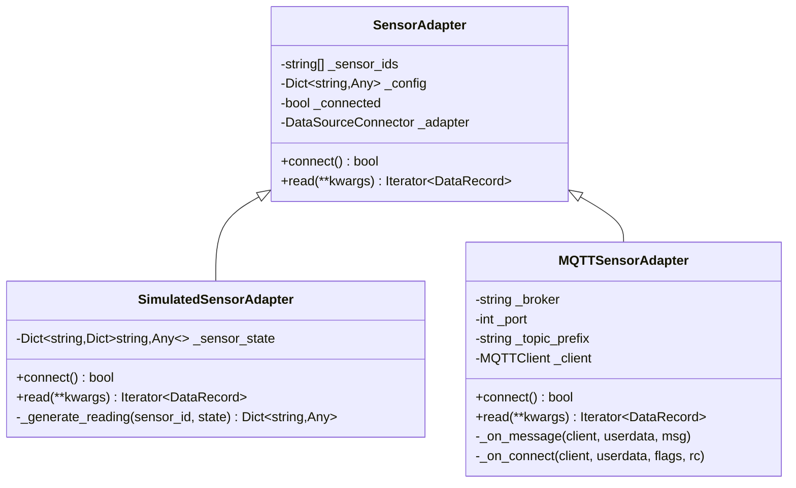
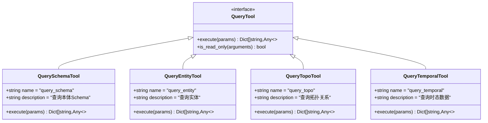
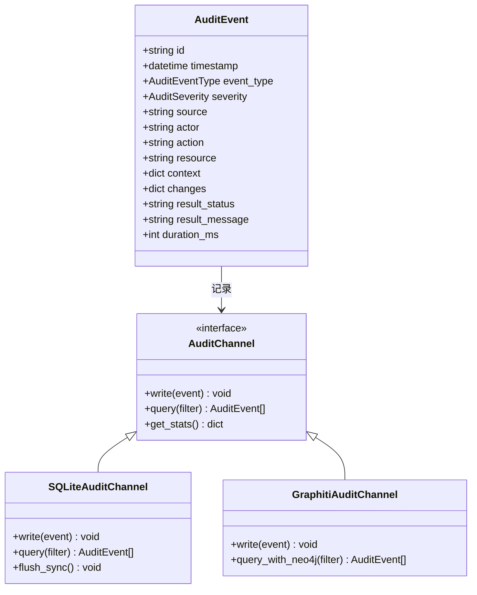
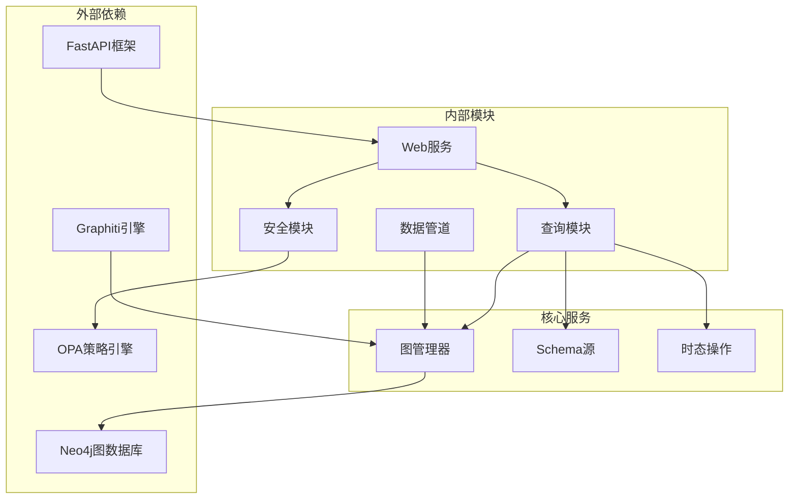
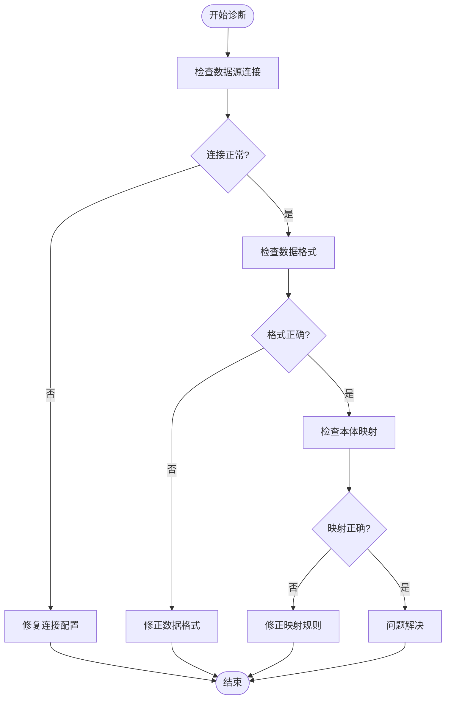

# 多源查询处理系统

<cite>
**本文档引用的文件**
- [ARCHITECTURE_BIZ.md](file://docs/02-architecture/ARCHITECTURE_BIZ.md)
- [ARCHITECTURE.md](file://docs/02-architecture/ARCHITECTURE.md)
- [ADR-039_qa_engine_architecture.md](file://docs/07-adr/ADR-039_qa_engine_architecture.md)
- [data_pipeline.py](file://odap/infra/data_pipeline.py)
- [sensor_adapter.py](file://odap/infra/data_pipeline/adapters/sensor_adapter.py)
- [routes.py](file://odap/infra/query/routes.py)
- [query_tools.py](file://odap/infra/query/query_tools.py)
- [temporal_ops.py](file://odap/infra/graph/temporal_ops.py)
- [api_gateway.py](file://odap/web/gateway/api_gateway.py)
- [test_query.py](file://tests/unit/test_query.py)
- [api-contracts.md](file://specs/005-data-collection-opt/contracts/api-contracts.md)
- [unified_audit.py](file://odap/infra/security/unified_audit.py)
- [audit_api.py](file://odap/infra/security/audit_api.py)
- [audit_sqlite_channel.py](file://odap/infra/security/audit_sqlite_channel.py)
</cite>

## 目录
1. [简介](#简介)
2. [项目结构](#项目结构)
3. [核心组件](#核心组件)
4. [架构概览](#架构概览)
5. [详细组件分析](#详细组件分析)
6. [依赖分析](#依赖分析)
7. [性能考虑](#性能考虑)
8. [故障排除指南](#故障排除指南)
9. [结论](#结论)

## 简介

多源查询处理系统是一个基于本体图谱的知识管理系统，旨在整合多种数据源并提供统一的查询接口。该系统的核心特点包括：

- **多数据源接入**：支持结构化、非结构化和实时数据源的统一接入
- **本体映射**：将异构数据映射到统一的本体模型
- **双时态查询**：基于Graphiti的四维时空查询能力
- **智能路由**：结合问答引擎和智能代理的混合查询架构
- **安全审计**：完整的操作审计和权限控制

系统采用分层架构设计，从底层的数据接入层到上层的应用服务层，形成了完整的数据处理流水线。

## 项目结构

系统采用模块化的项目结构，主要分为以下几个核心层次：

**图表来源**
- [ARCHITECTURE_BIZ.md:953-998](file://docs/02-architecture/ARCHITECTURE_BIZ.md#L953-L998)
- [api_gateway.py:398-436](file://odap/web/gateway/api_gateway.py#L398-L436)

**章节来源**
- [ARCHITECTURE_BIZ.md:953-998](file://docs/02-architecture/ARCHITECTURE_BIZ.md#L953-L998)
- [ARCHITECTURE.md:469-478](file://docs/02-architecture/ARCHITECTURE.md#L469-L478)

## 核心组件

### 多数据源接入层

系统支持三种类型的数据源接入：

1. **结构化数据源**：PostgreSQL、MySQL、MongoDB、Elasticsearch
2. **非结构化数据源**：PDF文档、图像/视频、语音转文本、网页爬虫
3. **实时数据源**：WebSocket、Kafka、MQTT、Redis PubSub

**图表来源**
- [ARCHITECTURE_BIZ.md:1000-1056](file://docs/02-architecture/ARCHITECTURE_BIZ.md#L1000-L1056)
- [ARCHITECTURE_BIZ.md:1214-1282](file://docs/02-architecture/ARCHITECTURE_BIZ.md#L1214-L1282)

### 查询服务架构

系统采用混合查询架构，结合了问答引擎和智能代理的优势：

**图表来源**
- [ADR-039_qa_engine_architecture.md:31-50](file://docs/7-adr/ADR-039_qa_engine_architecture.md#L31-L50)

**章节来源**
- [ADR-039_qa_engine_architecture.md:1-101](file://docs/7-adr/ADR-039_qa_engine_architecture.md#L1-L101)

## 架构概览

系统采用分层架构设计，每层都有明确的职责分工：

**图表来源**
- [ARCHITECTURE_BIZ.md:953-998](file://docs/02-architecture/ARCHITECTURE_BIZ.md#L953-L998)

## 详细组件分析

### 数据管道组件

数据管道是系统的核心基础设施，负责处理各种类型的数据源：

#### 数据格式定义

系统支持多种数据格式，包括JSON、CSV、Parquet、PDF、TXT等：

**图表来源**
- [data_pipeline.py:23-57](file://odap/infra/data_pipeline.py#L23-L57)

#### 传感器适配器

系统提供了多种传感器适配器以支持不同的数据采集场景：

**图表来源**
- [sensor_adapter.py:13-181](file://odap/infra/data_pipeline/adapters/sensor_adapter.py#L13-L181)

**章节来源**
- [data_pipeline.py:1-57](file://odap/infra/data_pipeline.py#L1-L57)
- [sensor_adapter.py:1-181](file://odap/infra/data_pipeline/adapters/sensor_adapter.py#L1-L181)

### 查询服务组件

查询服务是系统的核心功能模块，支持多种查询模式：

#### 查询DSL语法

系统定义了统一的查询DSL语法，支持四种查询源：

| 查询源 | 读取对象 | 数据源 | 对标 UModel |
|--------|---------|--------|-------------|
| `.schema` | OMS 类型定义 | OMS SQLite | `.umodel` |
| `.entity` | 运行时实体 | GraphManager | `.entity` |
| `.topo` | 拓扑关系 | GraphManager | `.topo` |
| `.temporal` | 双时态数据 | Graphiti | 无 |

#### 查询工具集成

系统提供了多种查询工具，支持不同的查询场景：

**图表来源**
- [query_tools.py:43-87](file://odap/infra/query/query_tools.py#L43-L87)

**章节来源**
- [ARCHITECTURE.md:469-478](file://docs/02-architecture/ARCHITECTURE.md#L469-L478)
- [query_tools.py:43-87](file://odap/infra/query/query_tools.py#L43-L87)

### 安全审计组件

系统实现了完整的安全审计功能，确保所有操作的可追溯性：

#### 审计日志架构

**图表来源**
- [unified_audit.py:92-128](file://odap/infra/security/unified_audit.py#L92-L128)
- [audit_sqlite_channel.py:309-339](file://odap/infra/security/audit_sqlite_channel.py#L309-L339)

**章节来源**
- [unified_audit.py:87-128](file://odap/infra/security/unified_audit.py#L87-L128)
- [audit_api.py:430-475](file://odap/infra/security/audit_api.py#L430-L475)

## 依赖分析

系统采用了清晰的依赖关系设计，确保各模块间的松耦合：

**图表来源**
- [api_gateway.py:398-436](file://odap/web/gateway/api_gateway.py#L398-L436)
- [temporal_ops.py:38-64](file://odap/infra/graph/temporal_ops.py#L38-L64)

**章节来源**
- [api_gateway.py:398-436](file://odap/web/gateway/api_gateway.py#L398-L436)
- [temporal_ops.py:38-64](file://odap/infra/graph/temporal_ops.py#L38-L64)

## 性能考虑

系统在设计时充分考虑了性能优化：

### 缓存策略

- **查询结果缓存**：对频繁访问的查询结果进行缓存
- **图遍历优化**：使用索引和剪枝算法减少图遍历开销
- **批量处理**：支持批量数据处理以提高吞吐量

### 异步处理

- **非阻塞I/O**：使用异步编程模型处理并发请求
- **流式处理**：支持大数据集的流式处理
- **任务队列**：后台任务异步执行

### 资源管理

- **连接池**：数据库连接池管理
- **内存优化**：大对象的内存管理和垃圾回收
- **资源限制**：防止资源耗尽的保护机制

## 故障排除指南

### 常见问题诊断

#### 查询执行失败

当查询执行失败时，系统会返回详细的错误信息：

1. **检查查询语法**：确保使用正确的DSL语法
2. **验证权限**：确认用户具有相应的查询权限
3. **查看日志**：通过审计日志定位具体错误

#### 数据接入问题

#### 性能问题排查

1. **监控指标**：查看系统性能指标
2. **查询分析**：分析慢查询日志
3. **资源检查**：检查系统资源使用情况

**章节来源**
- [audit_api.py:430-475](file://odap/infra/security/audit_api.py#L430-L475)

## 结论

多源查询处理系统是一个功能完整、架构清晰的知识管理系统。系统的主要优势包括：

1. **多数据源支持**：能够处理结构化、非结构化和实时数据
2. **智能查询**：结合问答引擎和智能代理提供灵活的查询体验
3. **安全可靠**：完整的审计和权限控制机制
4. **高性能**：优化的缓存和异步处理机制
5. **可扩展性**：模块化的架构设计便于功能扩展

该系统为用户提供了一个强大而易用的知识查询平台，能够满足复杂的企业级应用场景需求。