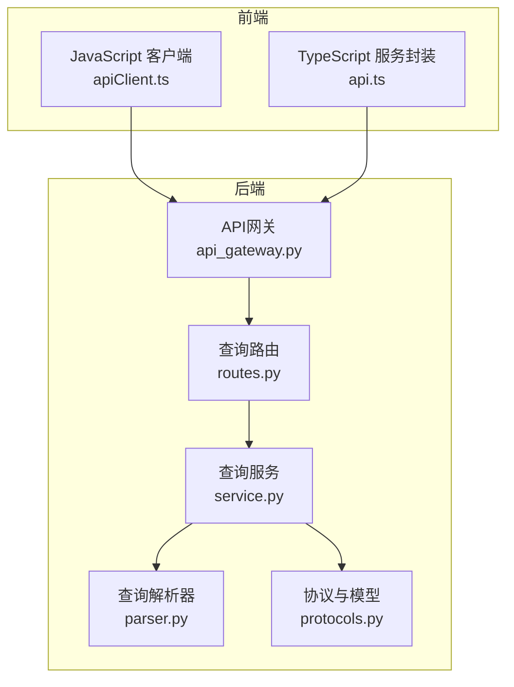
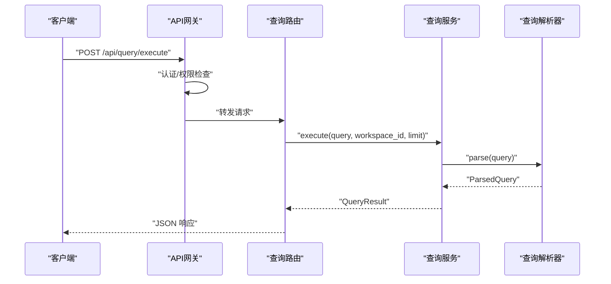
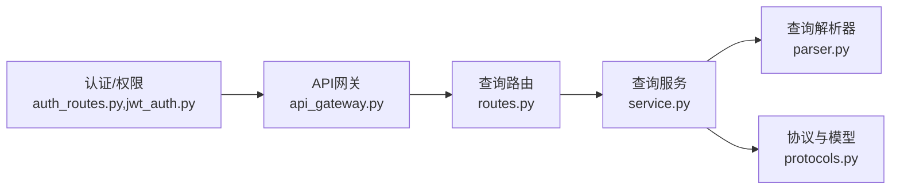

# 查询API接口

<cite>
**本文引用的文件**
- [odap/infra/query/routes.py](file://odap/infra/query/routes.py)
- [odap/infra/query/service.py](file://odap/infra/query/service.py)
- [odap/infra/query/parser.py](file://odap/infra/query/parser.py)
- [odap/infra/query/protocols.py](file://odap/infra/query/protocols.py)
- [odap/web/gateway/api_gateway.py](file://odap/web/gateway/api_gateway.py)
- [odap/infra/security/auth_routes.py](file://odap/infra/security/auth_routes.py)
- [odap/infra/security/jwt_auth.py](file://odap/infra/security/jwt_auth.py)
- [docs/10-api/BACKEND_API_DESIGN.md](file://docs/10-api/BACKEND_API_DESIGN.md)
- [frontend/src/modules/shared/services/apiClient.ts](file://frontend/src/modules/shared/services/apiClient.ts)
- [frontend/src/modules/shared/services/api.ts](file://frontend/src/modules/shared/services/api.ts)
- [tests/integration/test_api_integration.py](file://tests/integration/test_api_integration.py)
</cite>

## 目录
1. [简介](#简介)
2. [项目结构](#项目结构)
3. [核心组件](#核心组件)
4. [架构总览](#架构总览)
5. [详细组件分析](#详细组件分析)
6. [依赖关系分析](#依赖关系分析)
7. [性能考虑](#性能考虑)
8. [故障排查指南](#故障排查指南)
9. [结论](#结论)
10. [附录](#附录)

## 简介
本文件面向“查询API接口”的完整文档，聚焦统一查询服务的HTTP接口，包括：
- 统一查询执行接口与解释接口
- 查询表达式语法与支持的查询源
- 认证与权限控制机制
- 错误码与异常处理
- API版本控制与兼容性策略
- 客户端集成指南（JavaScript/Python等）

## 项目结构
查询API位于基础设施层的查询子系统，通过FastAPI路由暴露，并由网关统一接入。前端通过封装的HTTP客户端发起请求。

**图表来源**
- [odap/web/gateway/api_gateway.py:360-424](file://odap/web/gateway/api_gateway.py#L360-L424)
- [odap/infra/query/routes.py:11-101](file://odap/infra/query/routes.py#L11-L101)
- [odap/infra/query/service.py:11-126](file://odap/infra/query/service.py#L11-L126)
- [odap/infra/query/parser.py:23-113](file://odap/infra/query/parser.py#L23-L113)
- [odap/infra/query/protocols.py:7-40](file://odap/infra/query/protocols.py#L7-L40)

**章节来源**
- [odap/web/gateway/api_gateway.py:382-424](file://odap/web/gateway/api_gateway.py#L382-L424)
- [odap/infra/query/routes.py:11-101](file://odap/infra/query/routes.py#L11-L101)

## 核心组件
- 统一查询路由模块：提供查询执行与解释接口，支持多种查询源（schema/entity/topo/temporal）。
- 查询服务：解析查询表达式，调度不同数据源执行并聚合结果。
- 查询解析器：将自然语言风格的查询表达式解析为结构化参数。
- 协议与模型：定义查询源枚举、结果模型及数据源协议。
- API网关：统一路由、认证、鉴权、限流与代理转发。

**章节来源**
- [odap/infra/query/routes.py:18-101](file://odap/infra/query/routes.py#L18-L101)
- [odap/infra/query/service.py:11-126](file://odap/infra/query/service.py#L11-L126)
- [odap/infra/query/parser.py:23-113](file://odap/infra/query/parser.py#L23-L113)
- [odap/infra/query/protocols.py:7-40](file://odap/infra/query/protocols.py#L7-L40)
- [odap/web/gateway/api_gateway.py:360-424](file://odap/web/gateway/api_gateway.py#L360-L424)

## 架构总览
查询请求在进入网关后，经过认证与权限校验，再由查询路由交由查询服务执行；查询服务解析表达式并调用对应数据源实现，最终返回统一的结果模型。

**图表来源**
- [odap/web/gateway/api_gateway.py:435-476](file://odap/web/gateway/api_gateway.py#L435-L476)
- [odap/infra/query/routes.py:18-50](file://odap/infra/query/routes.py#L18-L50)
- [odap/infra/query/service.py:33-70](file://odap/infra/query/service.py#L33-L70)
- [odap/infra/query/parser.py:31-81](file://odap/infra/query/parser.py#L31-L81)

## 详细组件分析

### 统一查询接口
- 路由前缀：/api/query
- 支持方法：POST（执行查询）、GET（列举查询源）、POST（解释查询）

接口定义与参数说明：
- 执行查询
  - 方法：POST
  - 路径：/api/query/execute
  - 查询参数：
    - query：字符串，查询表达式（见“查询表达式语法”）
    - workspace_id：字符串，默认"default"
    - limit：整数，1~100，默认20
  - 响应：QueryResult（包含source、rows、total、explain）
- 解释查询
  - 方法：POST
  - 路径：/api/query/explain
  - 查询参数：
    - query：字符串，查询表达式
    - workspace_id：字符串，默认"default"
  - 响应：解析后的结构（source、filters、action、action_params、limit、workspace_id）
- 列举查询源
  - 方法：GET
  - 路径：/api/query/sources
  - 响应：包含schema/entity/topo/temporal等查询源的描述与示例

查询表达式语法与示例：
- .schema with(...)：查询本体类型定义（对象类型、链接定义、动作类型）
- .entity with(...)：查询运行时实体（支持按类型、ID、关键词搜索）
- .topo neighbors(...) / relations(...) / path(...)：拓扑查询
- .temporal at(...) / history(...)：时态查询

错误处理：
- 执行过程中异常将返回HTTP 500与错误详情
- 解析阶段异常将抛出HTTP 422/400（由框架自动处理）

**章节来源**
- [odap/infra/query/routes.py:18-101](file://odap/infra/query/routes.py#L18-L101)
- [odap/infra/query/service.py:33-126](file://odap/infra/query/service.py#L33-L126)
- [odap/infra/query/parser.py:31-113](file://odap/infra/query/parser.py#L31-L113)
- [odap/infra/query/protocols.py:14-18](file://odap/infra/query/protocols.py#L14-L18)

### 认证与权限控制
- 认证机制
  - 使用JWT Bearer Token，前端在请求头携带Authorization: Bearer <token>
  - 网关在请求到达时进行认证与权限校验
- 权限控制
  - 网关根据路由配置的permission进行OPA策略评估
  - 未通过认证返回401，权限不足返回403
- 前端集成
  - JavaScript客户端在请求头自动附加Authorization头
  - 401/403时触发统一的鉴权错误处理

**章节来源**
- [odap/web/gateway/api_gateway.py:435-476](file://odap/web/gateway/api_gateway.py#L435-L476)
- [odap/infra/security/auth_routes.py:40-72](file://odap/infra/security/auth_routes.py#L40-L72)
- [odap/infra/security/jwt_auth.py:14-47](file://odap/infra/security/jwt_auth.py#L14-L47)
- [frontend/src/modules/shared/services/apiClient.ts:80-105](file://frontend/src/modules/shared/services/apiClient.ts#L80-L105)

### 错误码与异常处理
- 网关层错误码
  - 401：认证失败（缺失或无效Token）
  - 403：权限不足（OPA拒绝）
  - 429：请求频率超限（限流）
  - 404：路由不存在
  - 500：网关内部错误
- 查询服务错误
  - 执行异常：返回HTTP 500与错误详情
  - 解析异常：由FastAPI参数校验抛出422/400
- 前端错误处理
  - 401/403时触发统一鉴权错误处理
  - 其他错误抛出HTTP状态异常

**章节来源**
- [odap/web/gateway/api_gateway.py:435-476](file://odap/web/gateway/api_gateway.py#L435-L476)
- [tests/integration/test_api_integration.py:695-736](file://tests/integration/test_api_integration.py#L695-L736)
- [frontend/src/modules/shared/services/apiClient.ts:96-102](file://frontend/src/modules/shared/services/apiClient.ts#L96-L102)

### API版本控制与兼容性
- 版本策略
  - 通过路由前缀区分版本（如/api/v1、/api/v2等）
  - 版本控制器提供版本信息、兼容性检查与迁移指南
- 兼容性保证
  - 通过比较端点集合判断破坏性变更
  - 提供迁移步骤与示例，确保客户端平滑升级
- 当前查询API
  - 路由前缀为/api/query，未强制绑定特定版本号
  - 建议客户端固定使用明确的版本前缀以获得长期稳定契约

**章节来源**
- [docs/10-api/BACKEND_API_DESIGN.md:1-617](file://docs/10-api/BACKEND_API_DESIGN.md#L1-L617)

### 客户端集成指南

#### JavaScript（浏览器/Node）
- 使用apiClient.ts封装的请求方法
  - GET/POST/PUT/DELETE均支持，自动附加Authorization头
  - 401/403时触发统一鉴权错误处理
- 调用示例（概念性）
  - 执行查询：POST /api/query/execute，传入query、workspace_id、limit
  - 解释查询：POST /api/query/explain，传入query、workspace_id
  - 列举查询源：GET /api/query/sources

**章节来源**
- [frontend/src/modules/shared/services/apiClient.ts:56-105](file://frontend/src/modules/shared/services/apiClient.ts#L56-L105)
- [odap/infra/query/routes.py:18-101](file://odap/infra/query/routes.py#L18-L101)

#### Python
- 使用requests或httpx发送HTTP请求
  - 在请求头添加Authorization: Bearer <token>
  - 执行查询：POST /api/query/execute
  - 解释查询：POST /api/query/explain
  - 列举查询源：GET /api/query/sources
- 响应处理
  - 成功：解析JSON中的data字段
  - 错误：捕获HTTP状态码并处理401/403/429/500

**章节来源**
- [odap/infra/query/routes.py:18-101](file://odap/infra/query/routes.py#L18-L101)

#### 其他语言
- 任何支持HTTP的客户端均可通过标准REST方式调用
- 关键点
  - 使用Bearer Token进行认证
  - 正确设置Content-Type为application/json
  - 处理常见HTTP状态码与错误响应

## 依赖关系分析

**图表来源**
- [odap/infra/query/routes.py:11-101](file://odap/infra/query/routes.py#L11-L101)
- [odap/infra/query/service.py:11-126](file://odap/infra/query/service.py#L11-L126)
- [odap/infra/query/parser.py:23-113](file://odap/infra/query/parser.py#L23-L113)
- [odap/infra/query/protocols.py:7-40](file://odap/infra/query/protocols.py#L7-L40)
- [odap/web/gateway/api_gateway.py:360-424](file://odap/web/gateway/api_gateway.py#L360-L424)
- [odap/infra/security/auth_routes.py:1-143](file://odap/infra/security/auth_routes.py#L1-L143)
- [odap/infra/security/jwt_auth.py:1-47](file://odap/infra/security/jwt_auth.py#L1-L47)

**章节来源**
- [odap/infra/query/service.py:19-32](file://odap/infra/query/service.py#L19-L32)

## 性能考虑
- 查询限制
  - limit参数限制返回条目数量（1~100），避免过大负载
- 网关限流
  - 网关内置令牌桶/滑动窗口限流，可通过Route配置启用
- 异步代理
  - 网关使用异步HTTP客户端转发请求，降低延迟
- 结果裁剪
  - 服务端对结果按limit进行截断，减少传输体积

**章节来源**
- [odap/infra/query/routes.py:18-23](file://odap/infra/query/routes.py#L18-L23)
- [odap/web/gateway/api_gateway.py:175-216](file://odap/web/gateway/api_gateway.py#L175-L216)

## 故障排查指南
- 401 未认证
  - 检查Authorization头是否正确设置为Bearer <token>
  - 确认Token未过期且签名有效
- 403 权限不足
  - 检查用户角色与目标API的权限映射
  - 确认OPA策略允许该操作
- 429 请求过于频繁
  - 降低请求频率或调整限流阈值
- 500 查询执行失败
  - 查看服务端日志，确认查询表达式与数据源可用性
- 前端鉴权错误
  - 401/403时触发统一错误处理，建议重新登录或刷新Token

**章节来源**
- [odap/web/gateway/api_gateway.py:435-476](file://odap/web/gateway/api_gateway.py#L435-L476)
- [frontend/src/modules/shared/services/apiClient.ts:96-102](file://frontend/src/modules/shared/services/apiClient.ts#L96-L102)

## 结论
查询API提供了统一、可扩展的查询能力，支持Schema/实体/拓扑/时态四类数据源。通过网关的认证与权限控制，结合限流与代理机制，保障了安全性与稳定性。建议客户端固定使用明确的版本前缀，并遵循查询表达式语法，以获得最佳兼容性与性能。

## 附录

### 查询表达式语法与示例
- .schema with(...)
  - 示例：.schema with(type='Unit')
  - 说明：查询本体类型定义
- .entity with(...)
  - 示例：.entity with(type='MilitaryUnit'), .entity with(search='装甲部队'), .entity with(id='entity-mil-abc123')
  - 说明：查询运行时实体（类型过滤/关键词搜索/按ID获取）
- .topo neighbors(...) / relations(...) / path(...)
  - 示例：.topo neighbors(id='entity-mil-abc123', depth=2), .topo relations(id='entity-mil-abc123', type='located_at'), .topo path(from='id1', to='id2', max_hops=5)
  - 说明：拓扑邻居、关系与路径查询
- .temporal at(...) / history(...)
  - 示例：.temporal at('2025-01-01'), .temporal history(id='entity-mil-abc123')
  - 说明：时态数据查询（快照与历史）

**章节来源**
- [odap/infra/query/routes.py:24-98](file://odap/infra/query/routes.py#L24-L98)

### 请求与响应示例（概念性）
- 成功响应（执行查询）
  - 请求：POST /api/query/execute
  - 响应：包含source、rows、total、explain
- 成功响应（解释查询）
  - 请求：POST /api/query/explain
  - 响应：解析后的结构（source、filters、action、action_params、limit、workspace_id）
- 成功响应（列举查询源）
  - 请求：GET /api/query/sources
  - 响应：包含各查询源的名称、前缀、描述与示例
- 错误响应（401/403/429/500）
  - 请求：任意受保护端点
  - 响应：包含错误信息与状态码

**章节来源**
- [odap/infra/query/routes.py:18-101](file://odap/infra/query/routes.py#L18-L101)
- [odap/web/gateway/api_gateway.py:435-476](file://odap/web/gateway/api_gateway.py#L435-L476)