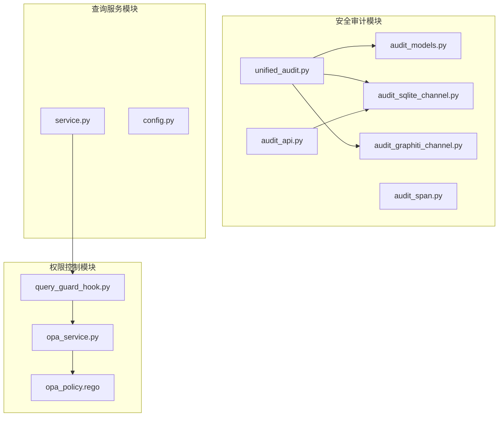
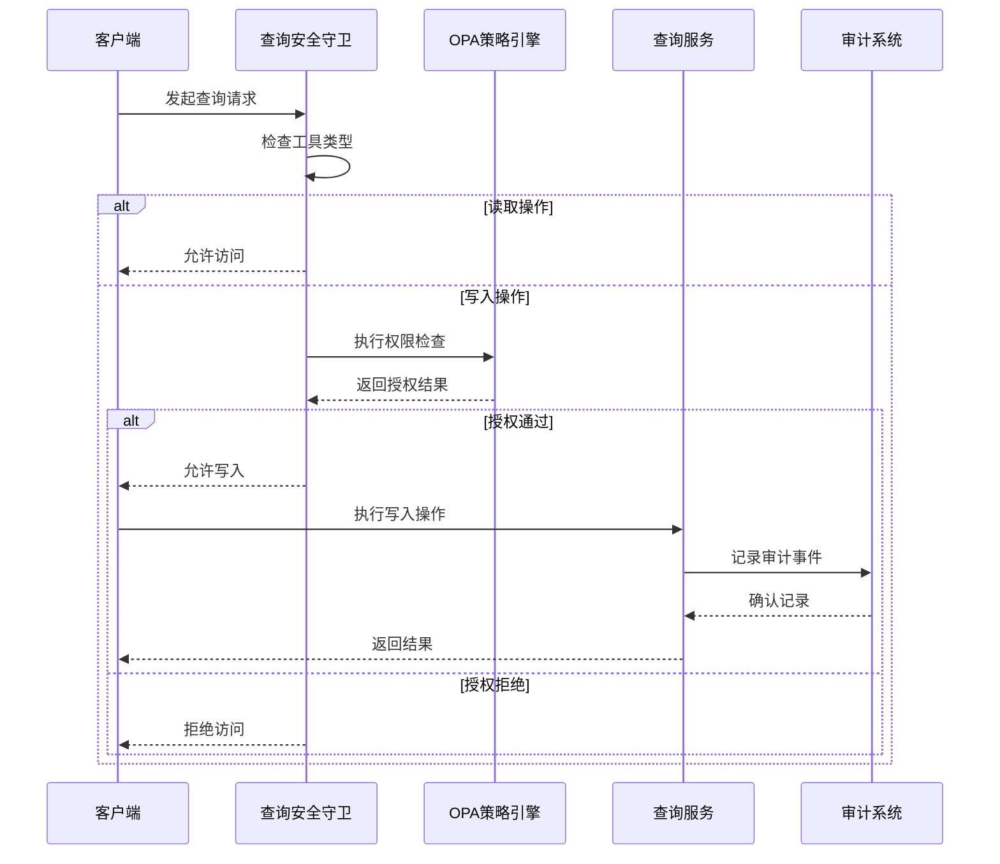
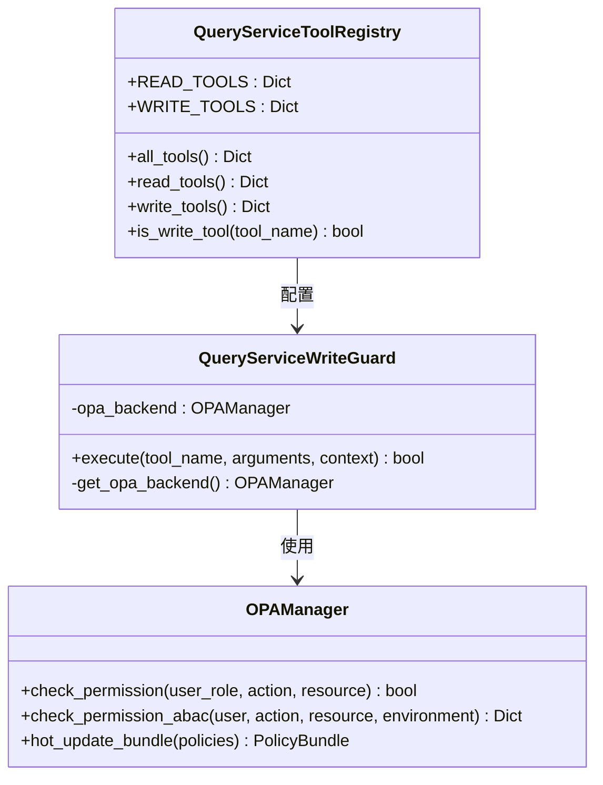
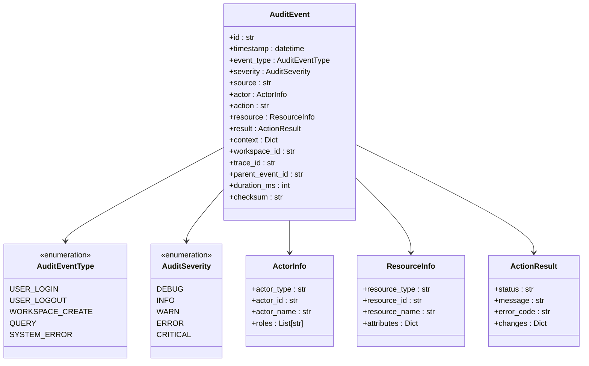
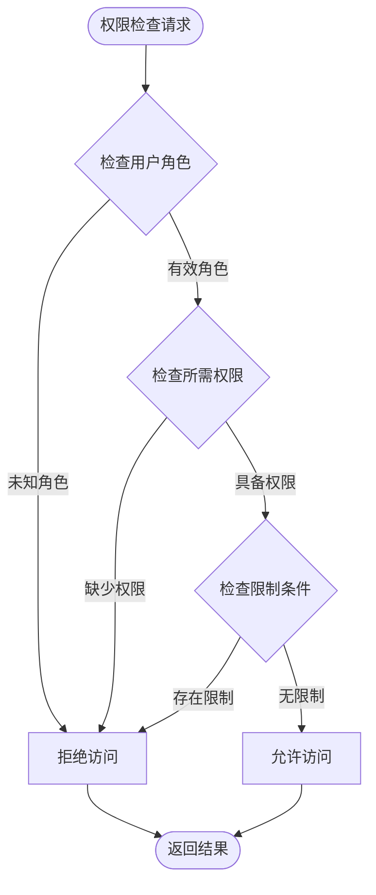
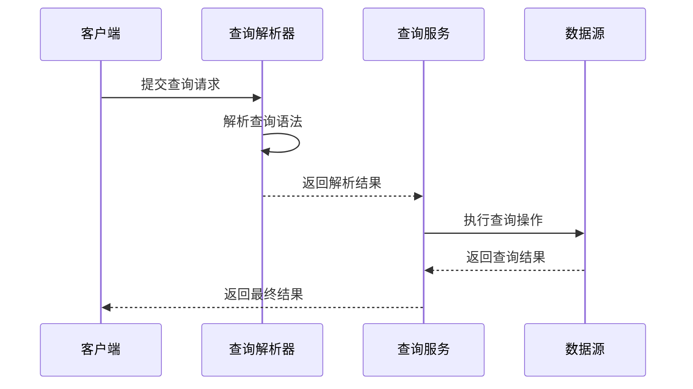
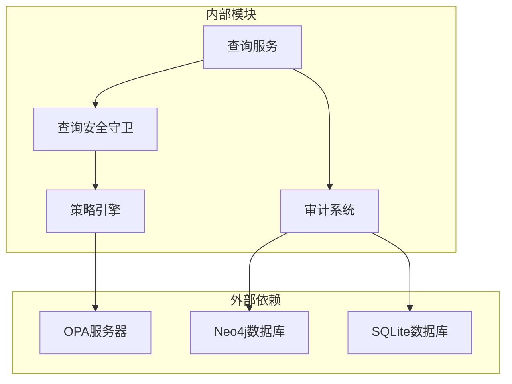

# 查询安全机制

<cite>
**本文档引用的文件**
- [unified_audit.py](file://odap/infra/security/unified_audit.py)
- [audit_api.py](file://odap/infra/security/audit_api.py)
- [audit_models.py](file://odap/infra/security/audit_models.py)
- [audit_sqlite_channel.py](file://odap/infra/security/audit_sqlite_channel.py)
- [audit_graphiti_channel.py](file://odap/infra/security/audit_graphiti_channel.py)
- [audit_span.py](file://odap/infra/security/audit_span.py)
- [query_guard_hook.py](file://odap/infra/openharness/query_guard_hook.py)
- [opa_service.py](file://odap/infra/opa/opa_service.py)
- [opa_policy.rego](file://odap/infra/opa/opa_policy.rego)
- [service.py](file://odap/infra/query/service.py)
- [DESIGN.md](file://docs/03-modules/audit_log/DESIGN.md)
- [ADR-042_audit_log_storage_query.md](file://docs/07-adr/ADR-042_audit_log_storage_query.md)
- [config.py](file://odap/infra/security/config.py)
</cite>

## 目录
1. [简介](#简介)
2. [项目结构](#项目结构)
3. [核心组件](#核心组件)
4. [架构概览](#架构概览)
5. [详细组件分析](#详细组件分析)
6. [依赖关系分析](#依赖关系分析)
7. [性能考虑](#性能考虑)
8. [故障排除指南](#故障排除指南)
9. [结论](#结论)

## 简介

本文档详细阐述了Ontology Graphiti平台的查询安全机制，重点介绍Agent Safe默认只读的安全设计原则、查询权限控制系统、数据访问限制机制以及统一审计日志体系。该系统通过多层次的安全防护确保查询操作的安全性和可追溯性。

## 项目结构

查询安全机制主要分布在以下模块中：



**图表来源**
- [unified_audit.py:1-406](file://odap/infra/security/unified_audit.py#L1-L406)
- [audit_api.py:1-487](file://odap/infra/security/audit_api.py#L1-L487)
- [query_guard_hook.py:1-175](file://odap/infra/openharness/query_guard_hook.py#L1-L175)

**章节来源**
- [unified_audit.py:1-406](file://odap/infra/security/unified_audit.py#L1-L406)
- [audit_api.py:1-487](file://odap/infra/security/audit_api.py#L1-L487)
- [query_guard_hook.py:1-175](file://odap/infra/openharness/query_guard_hook.py#L1-L175)

## 核心组件

### 审计日志统一管理器

统一审计日志管理器提供了简化的接口来使用审计日志系统，支持多种存储后端和统一的数据模型。

### 审计通道系统

系统实现了多种审计通道，包括SQLite主存储和Graphiti图存储，确保数据的完整性和可查询性。

### 查询安全守卫

Agent Safe安全守卫通过OpenHarness钩子系统拦截写操作，实施严格的权限控制。

**章节来源**
- [unified_audit.py:58-72](file://odap/infra/security/unified_audit.py#L58-L72)
- [audit_sqlite_channel.py:36-46](file://odap/infra/security/audit_sqlite_channel.py#L36-L46)
- [query_guard_hook.py:17-26](file://odap/infra/openharness/query_guard_hook.py#L17-L26)

## 架构概览

查询安全机制采用分层架构设计，确保查询操作的安全性和可追溯性：



**图表来源**
- [query_guard_hook.py:40-83](file://odap/infra/openharness/query_guard_hook.py#L40-L83)
- [opa_service.py:538-557](file://odap/infra/opa/opa_service.py#L538-L557)
- [service.py:33-59](file://odap/infra/query/service.py#L33-L59)

## 详细组件分析

### Agent Safe默认只读设计

Agent Safe设计原则确保查询工具默认只读，无需额外的权限校验：



**图表来源**
- [query_guard_hook.py:17-83](file://odap/infra/openharness/query_guard_hook.py#L17-L83)
- [opa_service.py:455-717](file://odap/infra/opa/opa_service.py#L455-L717)

#### 查询工具分类

系统将查询工具分为两类：

1. **只读工具**（无需OPA校验）
   - `query_schema`: 查询本体类型定义
   - `query_entity`: 查询运行时实体
   - `query_topo`: 查询拓扑关系和图遍历
   - `query_temporal`: 查询时态数据

2. **写入工具**（需OPA审批）
   - `write_entity`: 写入/更新实体
   - `write_relation`: 写入/更新关系

**章节来源**
- [query_guard_hook.py:95-175](file://odap/infra/openharness/query_guard_hook.py#L95-L175)

### 审计日志系统

审计日志系统提供完整的操作追踪和合规保障：

#### 审计事件模型



**图表来源**
- [audit_models.py:110-167](file://odap/infra/security/audit_models.py#L110-L167)

#### 审计通道实现

系统提供两种存储后端：

1. **SQLite主存储**（默认方案）
   - WAL模式提升并发性能
   - 批量写入减少I/O开销
   - 防篡改哈希链保护数据完整性

2. **Graphiti图存储**（补充方案）
   - 将审计日志存储到知识图谱中
   - 支持图遍历查询和时态分析
   - 与本体数据关联分析

**章节来源**
- [audit_sqlite_channel.py:36-106](file://odap/infra/security/audit_sqlite_channel.py#L36-L106)
- [audit_graphiti_channel.py:15-44](file://odap/infra/security/audit_graphiti_channel.py#L15-L44)

### 权限控制策略

OPA（Open Policy Agent）提供强大的策略引擎支持：

#### ABAC策略模型



**图表来源**
- [opa_policy.rego:58-69](file://odap/infra/opa/opa_policy.rego#L58-L69)

#### 策略规则示例

系统内置了针对军事应用场景的权限策略：

| 角色 | 权限 | 限制 |
|------|------|------|
| pilot | view_intelligence, request_support | cannot_attack, cannot_command |
| commander | view_intelligence, command_units, authorize_attacks, approve_missions | cannot_attack_civilian_infrastructure |
| intelligence_analyst | view_intelligence, analyze_data, generate_reports | cannot_command, cannot_attack |

**章节来源**
- [opa_policy.rego:21-34](file://odap/infra/opa/opa_policy.rego#L21-L34)
- [opa_service.py:114-225](file://odap/infra/opa/opa_service.py#L114-L225)

### 查询服务安全

查询服务提供统一的查询接口，支持多种数据源：

#### 查询执行流程



**图表来源**
- [service.py:33-59](file://odap/infra/query/service.py#L33-L59)

**章节来源**
- [service.py:11-126](file://odap/infra/query/service.py#L11-L126)

## 依赖关系分析

查询安全机制的依赖关系如下：



**图表来源**
- [query_guard_hook.py:31-38](file://odap/infra/openharness/query_guard_hook.py#L31-L38)
- [audit_sqlite_channel.py:39-43](file://odap/infra/security/audit_sqlite_channel.py#L39-L43)

**章节来源**
- [query_guard_hook.py:1-175](file://odap/infra/openharness/query_guard_hook.py#L1-L175)
- [audit_sqlite_channel.py:1-449](file://odap/infra/security/audit_sqlite_channel.py#L1-L449)

## 性能考虑

### 写入性能优化

系统采用异步写入和批量处理机制：

- **异步通道缓冲**：内存中的事件缓冲区
- **批量落盘**：达到阈值或超时后批量写入
- **WAL模式**：SQLite的预写日志模式提升并发性能
- **防篡改校验**：事件链式哈希保证数据完整性

### 查询性能优化

- **索引优化**：为常用查询字段建立索引
- **分区策略**：按时间范围分区存储
- **缓存机制**：OPA策略结果缓存
- **批量权限检查**：支持批量权限验证

## 故障排除指南

### 常见问题及解决方案

#### OPA服务不可用

当OPA服务不可用时，系统采用fail-closed策略拒绝所有写操作：

```python
# OPA不可用时的处理逻辑
if opa is None:
    logger.warning("OPA 不可用，写操作将被拒绝 (fail-closed)")
    return False
```

#### 审计日志写入失败

系统提供多重备份机制：

1. **SQLite主存储**：默认的可靠存储
2. **Graphiti辅助存储**：图数据库备份
3. **日志记录**：失败时记录警告信息

#### 权限检查异常

当权限检查出现异常时，系统会：
- 记录详细的错误信息
- 返回默认的拒绝结果
- 提供降级处理机制

**章节来源**
- [query_guard_hook.py:58-82](file://odap/infra/openharness/query_guard_hook.py#L58-L82)
- [unified_audit.py:332-339](file://odap/infra/security/unified_audit.py#L332-L339)

## 结论

Ontology Graphiti平台的查询安全机制通过多层次的设计实现了全面的安全防护：

1. **默认只读设计**：确保Agent Safe的查询工具默认只读，无需额外权限校验
2. **严格的写操作控制**：通过OpenHarness钩子系统和OPA策略引擎实施严格的写操作权限控制
3. **完整的审计追踪**：提供统一的审计日志系统，支持操作溯源和合规审计
4. **高性能实现**：采用异步写入、批量处理和缓存机制确保系统性能
5. **灵活的存储方案**：支持SQLite和Graphiti两种存储后端，满足不同场景需求

该安全机制为平台提供了坚实的安全基础，确保查询操作的安全性、可追溯性和合规性。