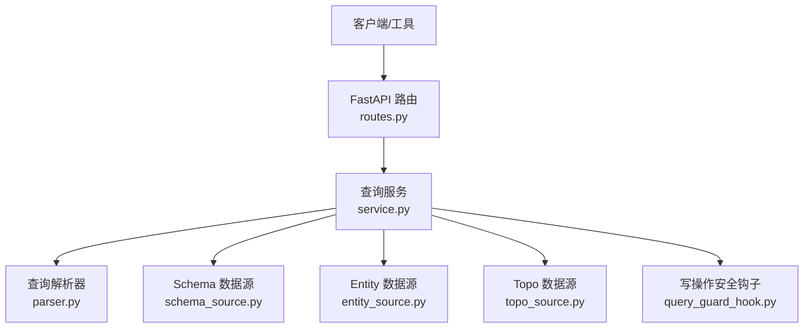
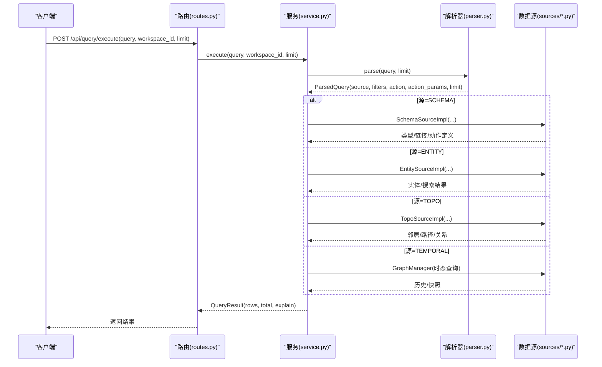
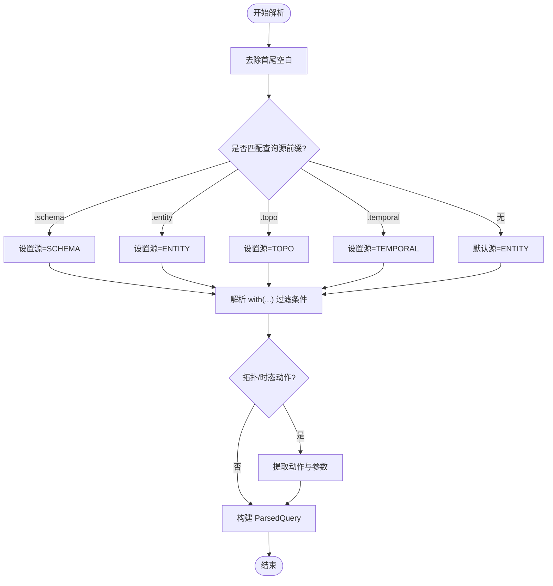
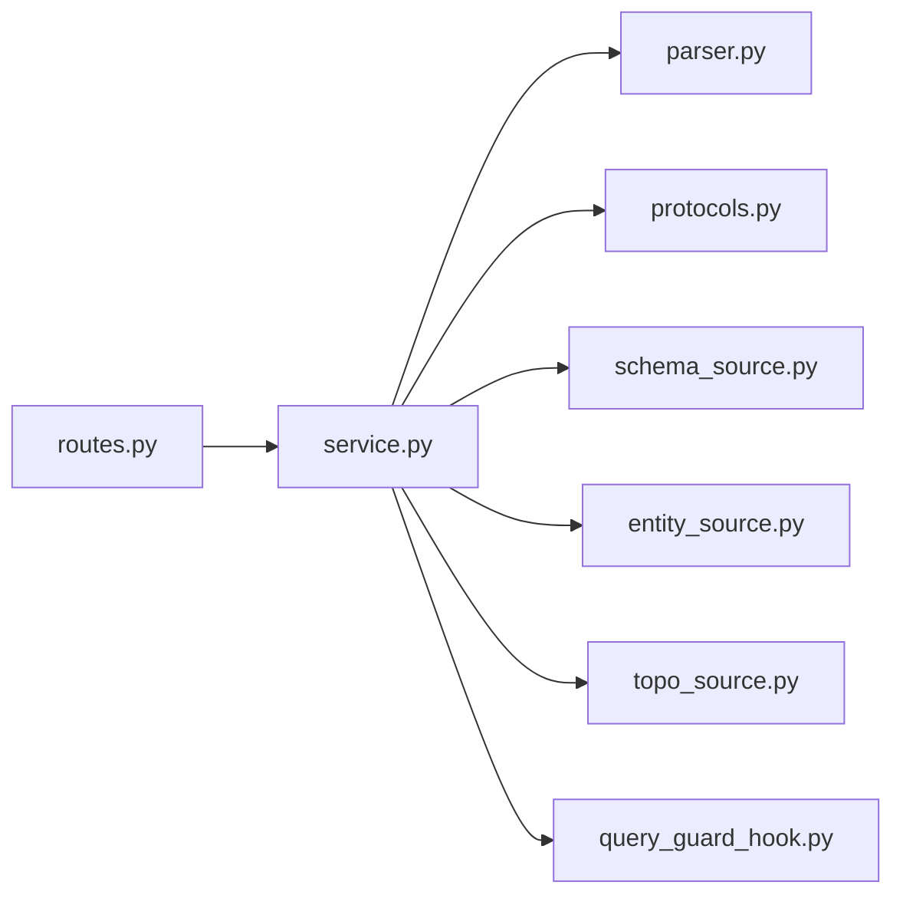

# 查询解析器

<cite>
**本文档引用的文件**
- [odap/infra/query/parser.py](file://odap/infra/query/parser.py)
- [odap/infra/query/service.py](file://odap/infra/query/service.py)
- [odap/infra/query/routes.py](file://odap/infra/query/routes.py)
- [odap/infra/query/protocols.py](file://odap/infra/query/protocols.py)
- [odap/infra/query/sources/schema_source.py](file://odap/infra/query/sources/schema_source.py)
- [odap/infra/query/sources/entity_source.py](file://odap/infra/query/sources/entity_source.py)
- [odap/infra/query/sources/topo_source.py](file://odap/infra/query/sources/topo_source.py)
- [odap/infra/openharness/query_guard_hook.py](file://odap/infra/openharness/query_guard_hook.py)
- [tests/unit/test_query_guard.py](file://tests/unit/test_query_guard.py)
</cite>

## 目录
1. [简介](#简介)
2. [项目结构](#项目结构)
3. [核心组件](#核心组件)
4. [架构总览](#架构总览)
5. [详细组件分析](#详细组件分析)
6. [依赖关系分析](#依赖关系分析)
7. [性能考虑](#性能考虑)
8. [故障排查指南](#故障排查指南)
9. [结论](#结论)
10. [附录：查询语法规范](#附录查询语法规范)

## 简介
本文件面向“查询解析器”模块，系统性阐述其语法设计、词法分析与语法树构建过程、查询优化策略、查询语言规范以及典型示例的解析流程。该模块提供统一的查询入口，支持四种查询源（本体类型、运行时实体、拓扑关系、时态数据），并内置只读安全边界与可选的写操作策略。

## 项目结构
查询解析器位于 odap/infra/query 目录，核心文件包括：
- parser.py：查询解析器与解析结果模型
- service.py：查询服务，负责解析、路由与执行
- routes.py：FastAPI 路由，暴露统一查询接口
- protocols.py：查询源枚举、结果模型与数据源协议
- sources/：具体数据源实现（Schema/Entity/Topo）
- openharness/query_guard_hook.py：OpenHarness 安全钩子与工具注册表（只读/写）

**图表来源**
- [odap/infra/query/routes.py:18-50](file://odap/infra/query/routes.py#L18-L50)
- [odap/infra/query/service.py:33-59](file://odap/infra/query/service.py#L33-L59)
- [odap/infra/query/parser.py:31-81](file://odap/infra/query/parser.py#L31-L81)
- [odap/infra/query/sources/schema_source.py:4-68](file://odap/infra/query/sources/schema_source.py#L4-L68)
- [odap/infra/query/sources/entity_source.py:4-33](file://odap/infra/query/sources/entity_source.py#L4-L33)
- [odap/infra/query/sources/topo_source.py:4-27](file://odap/infra/query/sources/topo_source.py#L4-L27)
- [odap/infra/openharness/query_guard_hook.py:17-82](file://odap/infra/openharness/query_guard_hook.py#L17-L82)

**章节来源**
- [odap/infra/query/parser.py:1-113](file://odap/infra/query/parser.py#L1-L113)
- [odap/infra/query/service.py:1-126](file://odap/infra/query/service.py#L1-L126)
- [odap/infra/query/routes.py:1-101](file://odap/infra/query/routes.py#L1-L101)
- [odap/infra/query/protocols.py:1-40](file://odap/infra/query/protocols.py#L1-L40)
- [odap/infra/query/sources/schema_source.py:1-172](file://odap/infra/query/sources/schema_source.py#L1-L172)
- [odap/infra/query/sources/entity_source.py:1-34](file://odap/infra/query/sources/entity_source.py#L1-L34)
- [odap/infra/query/sources/topo_source.py:1-28](file://odap/infra/query/sources/topo_source.py#L1-L28)
- [odap/infra/openharness/query_guard_hook.py:1-175](file://odap/infra/openharness/query_guard_hook.py#L1-L175)

## 核心组件
- 解析器（QueryParser）：从字符串中提取查询源、过滤条件、动作与参数，并构造 ParsedQuery 对象。
- 查询服务（QueryService）：统一调度解析、路由到不同数据源并返回结构化结果。
- 路由（routes.py）：对外暴露 /api/query/execute 与 /api/query/explain 等接口。
- 协议与模型（protocols.py）：定义查询源枚举、结果模型与数据源协议。
- 数据源实现：SchemaSourceImpl、EntitySourceImpl、TopoSourceImpl。
- 安全钩子（query_guard_hook.py）：对写操作进行 OPA 策略校验，默认只读。

**章节来源**
- [odap/infra/query/parser.py:7-21](file://odap/infra/query/parser.py#L7-L21)
- [odap/infra/query/service.py:11-31](file://odap/infra/query/service.py#L11-L31)
- [odap/infra/query/routes.py:18-50](file://odap/infra/query/routes.py#L18-L50)
- [odap/infra/query/protocols.py:7-39](file://odap/infra/query/protocols.py#L7-L39)
- [odap/infra/openharness/query_guard_hook.py:17-82](file://odap/infra/openharness/query_guard_hook.py#L17-L82)

## 架构总览
查询请求自上而下的处理链路如下：

**图表来源**
- [odap/infra/query/routes.py:18-50](file://odap/infra/query/routes.py#L18-L50)
- [odap/infra/query/service.py:33-59](file://odap/infra/query/service.py#L33-L59)
- [odap/infra/query/parser.py:31-81](file://odap/infra/query/parser.py#L31-L81)
- [odap/infra/query/sources/schema_source.py:14-68](file://odap/infra/query/sources/schema_source.py#L14-L68)
- [odap/infra/query/sources/entity_source.py:14-33](file://odap/infra/query/sources/entity_source.py#L14-L33)
- [odap/infra/query/sources/topo_source.py:14-27](file://odap/infra/query/sources/topo_source.py#L14-L27)

## 详细组件分析

### 1) 语法设计与解析阶段
- 词法分析：基于前缀匹配与正则表达式扫描，识别查询源前缀（.schema/.entity/.topo/.temporal）、with(...) 过滤块、以及拓扑与时态的动作与参数。
- 语法分析：根据查询源与动作，构造 ParsedQuery，其中包含 source、filters、action、action_params、limit。
- 语义检查：在执行阶段由各数据源实现进行类型/属性/基数等校验；安全钩子对写操作进行 OPA 校验。

**图表来源**
- [odap/infra/query/parser.py:31-81](file://odap/infra/query/parser.py#L31-L81)
- [odap/infra/query/parser.py:83-112](file://odap/infra/query/parser.py#L83-L112)

**章节来源**
- [odap/infra/query/parser.py:31-112](file://odap/infra/query/parser.py#L31-L112)

### 2) 查询语言语法规范
- 查询源前缀
  - .schema：查询本体类型定义（对象类型、链接定义、动作类型）
  - .entity：查询运行时实体（支持按类型、区域或全文检索）
  - .topo：查询拓扑关系（邻居、路径、关系）
  - .temporal：查询时态数据（历史版本、有效时间快照）
- 过滤条件 with(...)
  - 键值对形式，键为字段名，值为字符串或整数（自动尝试转换）
  - 多键值以逗号分隔
- 拓扑动作
  - neighbors(id=..., depth=...)：获取指定实体的邻居，支持方向与深度
  - path(from=..., to=..., max_hops=...)：两点间路径，内部转换为 max_depth
  - relations(id=..., type=...)：列出指定实体的关系
- 时态动作
  - at('YYYY-MM-DD')：查询有效时间为某时刻的数据
  - history(id=...)：查询实体的历史版本
- 限制与返回
  - limit 参数控制最大返回条数（默认20，范围1-100）

**章节来源**
- [odap/infra/query/routes.py:24-98](file://odap/infra/query/routes.py#L24-L98)
- [odap/infra/query/parser.py:83-112](file://odap/infra/query/parser.py#L83-L112)

### 3) 语义检查与执行
- Schema 源：按 filters 匹配对象类型、链接定义、动作类型；支持类型定义校验与属性类型检查。
- Entity 源：支持按类型/区域查询、按 ID 获取、全文混合检索（优先图驱动模式）。
- Topo 源：提供邻居、关系、图遍历能力；路径查询在子图内判断可达性。
- Temporal 源：通过 GraphManager 执行 at 与 history 查询。
- 安全策略：默认只读，写操作需经 OPA 校验；未启用 OPA 时写操作 fail-closed。

**章节来源**
- [odap/infra/query/service.py:72-125](file://odap/infra/query/service.py#L72-L125)
- [odap/infra/query/sources/schema_source.py:14-171](file://odap/infra/query/sources/schema_source.py#L14-L171)
- [odap/infra/query/sources/entity_source.py:14-33](file://odap/infra/query/sources/entity_source.py#L14-L33)
- [odap/infra/query/sources/topo_source.py:14-27](file://odap/infra/query/sources/topo_source.py#L14-L27)
- [odap/infra/openharness/query_guard_hook.py:17-82](file://odap/infra/openharness/query_guard_hook.py#L17-L82)

### 4) 查询优化策略
- 查询重写
  - 拓扑 path 参数自动重写：max_hops → max_depth，确保内部一致性
- 索引与检索
  - Entity 搜索优先使用图驱动的混合检索（当可用时），否则回退到通用搜索
- 执行计划
  - 依据查询源与动作选择对应数据源实现，避免跨源复杂度
  - 时态查询通过 GraphManager 直接路由至底层存储
- 性能边界
  - 限制返回条数（limit），避免大结果集
  - 拓扑路径查询先生成子图再判定可达，减少无效遍历

**章节来源**
- [odap/infra/query/parser.py:108-112](file://odap/infra/query/parser.py#L108-L112)
- [odap/infra/query/service.py:81-125](file://odap/infra/query/service.py#L81-L125)
- [odap/infra/query/sources/entity_source.py:26-33](file://odap/infra/query/sources/entity_source.py#L26-L33)

### 5) 示例解析过程
以下示例展示典型查询的解析与执行要点（仅描述流程，不展示具体代码内容）：
- .schema with(kind='link_definitions')
  - 识别源为 SCHEMA，解析 filters 为 kind='link_definitions'
  - 执行 SchemaSourceImpl.query_link_definitions
- .entity with(type='MilitaryUnit')
  - 识别源为 ENTITY，解析 filters 为 type='MilitaryUnit'
  - 执行 EntitySourceImpl.query_entities
- .entity with(search='装甲部队')
  - 识别源为 ENTITY，解析 filters 为 search='装甲部队'
  - 执行 EntitySourceImpl.search_entities
- .topo neighbors(id='entity-mil-abc123', depth=2)
  - 识别源为 TOPO，动作 neighbors，解析参数 id、depth
  - 执行 TopoSourceImpl.get_neighbors
- .topo path(from='id1', to='id2', max_hops=5)
  - 识别源为 TOPO，动作 path，解析参数并重写为 max_depth
  - 执行 TopoSourceImpl.traverse 并判定可达
- .temporal at('2025-01-01')
  - 识别源为 TEMPORAL，动作 at，解析 valid_time
  - 通过 GraphManager 执行时态查询
- .temporal history(id='entity-mil-abc123')
  - 识别源为 TEMPORAL，动作 history，解析 id
  - 通过 GraphManager 获取历史版本

**章节来源**
- [odap/infra/query/routes.py:53-98](file://odap/infra/query/routes.py#L53-L98)
- [odap/infra/query/service.py:33-59](file://odap/infra/query/service.py#L33-L59)
- [odap/infra/query/parser.py:44-81](file://odap/infra/query/parser.py#L44-L81)

## 依赖关系分析
- 组件耦合
  - routes.py 仅依赖 service.py 的单例接口，保持路由层薄逻辑
  - service.py 依赖 parser.py 与三个数据源实现，形成清晰的职责分离
  - 各数据源实现依赖 GraphManager 或 OMS 服务，封装具体存储细节
- 外部依赖
  - FastAPI 提供路由与请求/响应模型
  - OPA（可选）用于写操作安全校验
- 循环依赖
  - 未见循环导入；解析器与服务相互独立，通过协议与模型解耦

**图表来源**
- [odap/infra/query/routes.py:18-50](file://odap/infra/query/routes.py#L18-L50)
- [odap/infra/query/service.py:27-31](file://odap/infra/query/service.py#L27-L31)
- [odap/infra/query/parser.py:4](file://odap/infra/query/parser.py#L4)
- [odap/infra/query/protocols.py:4](file://odap/infra/query/protocols.py#L4)

**章节来源**
- [odap/infra/query/service.py:19-31](file://odap/infra/query/service.py#L19-L31)
- [odap/infra/query/protocols.py:21-39](file://odap/infra/query/protocols.py#L21-L39)

## 性能考虑
- 限制返回规模：通过 limit 控制输出大小，避免内存与网络压力
- 优先图驱动检索：当图驱动可用时优先使用混合检索，提升召回质量
- 拓扑路径短路：先生成子图再判断可达，避免全图遍历
- 异常降级：服务层捕获异常并返回 explain 信息，便于诊断

[本节为通用建议，无需特定文件引用]

## 故障排查指南
- 常见错误
  - 查询源前缀缺失：默认源为 ENTITY，可能导致不符合预期的结果
  - 过滤条件格式错误：with(...) 内需为 key=value 形式，字符串值需去引号处理
  - 拓扑参数缺失：neighbors/path/relations 需要必要参数（如 id/from/to）
  - 时态查询参数缺失：at 需要有效时间字符串，history 需要实体 id
- 安全相关
  - 写操作被拒绝：确认 OPA 后端可用且策略允许；或使用只读工具
- 调试手段
  - 使用 /api/query/explain 接口查看解析结果（不执行）
  - 查看 QueryResult.explain 字段，定位源、过滤条件与动作

**章节来源**
- [odap/infra/query/routes.py:41-50](file://odap/infra/query/routes.py#L41-L50)
- [odap/infra/query/service.py:52-59](file://odap/infra/query/service.py#L52-L59)
- [odap/infra/openharness/query_guard_hook.py:40-82](file://odap/infra/openharness/query_guard_hook.py#L40-L82)

## 结论
该查询解析器以“查询优先”的架构设计，统一了多种查询源与动作，提供简洁一致的查询语言与安全边界。通过解析器、服务层与数据源的清晰分工，既保证了易用性，也为后续扩展（如更多查询源、更复杂的过滤与排序）预留了空间。

[本节为总结性内容，无需特定文件引用]

## 附录：查询语法规范
- 查询源前缀
  - .schema：查询本体类型定义
  - .entity：查询运行时实体
  - .topo：查询拓扑关系
  - .temporal：查询时态数据
- 过滤条件 with(...)
  - 键值对，逗号分隔
  - 数值自动尝试转为整型
- 拓扑动作
  - neighbors(id=..., depth=..., direction=...)
  - path(from=..., to=..., max_hops=...)
  - relations(id=..., type=...)
- 时态动作
  - at('YYYY-MM-DD')
  - history(id=...)
- 限制
  - limit：1-100，默认20

**章节来源**
- [odap/infra/query/routes.py:24-98](file://odap/infra/query/routes.py#L24-L98)
- [odap/infra/query/parser.py:83-112](file://odap/infra/query/parser.py#L83-L112)