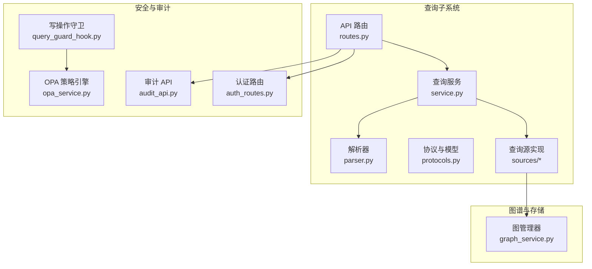
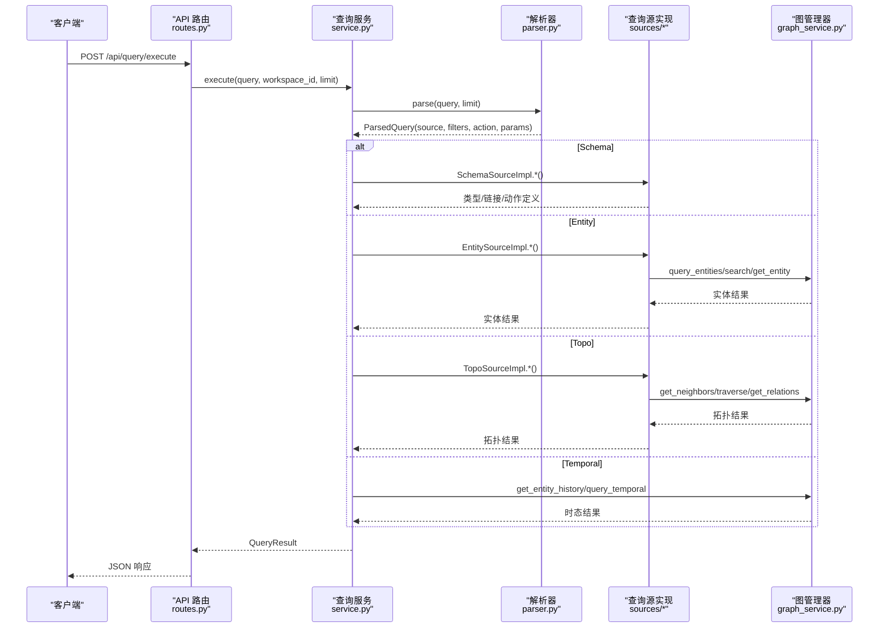
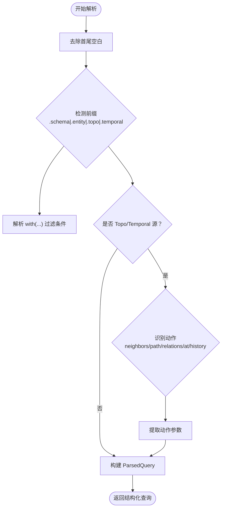
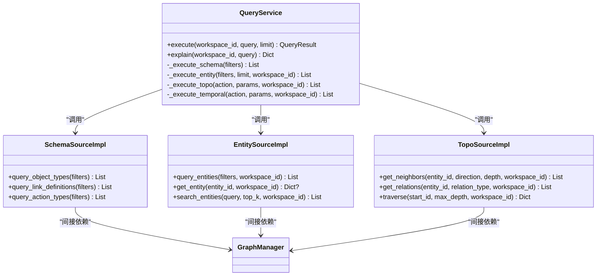
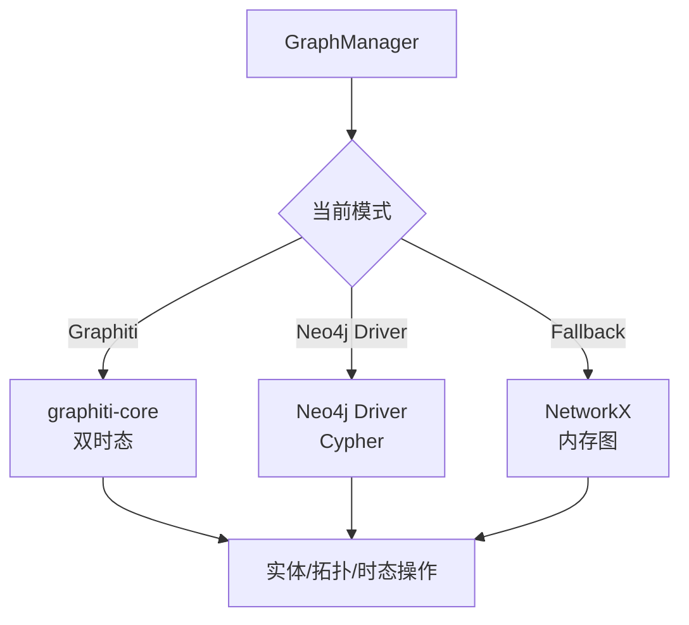
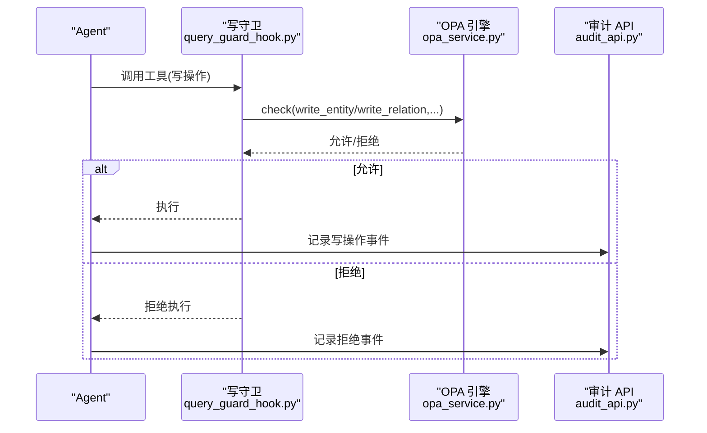
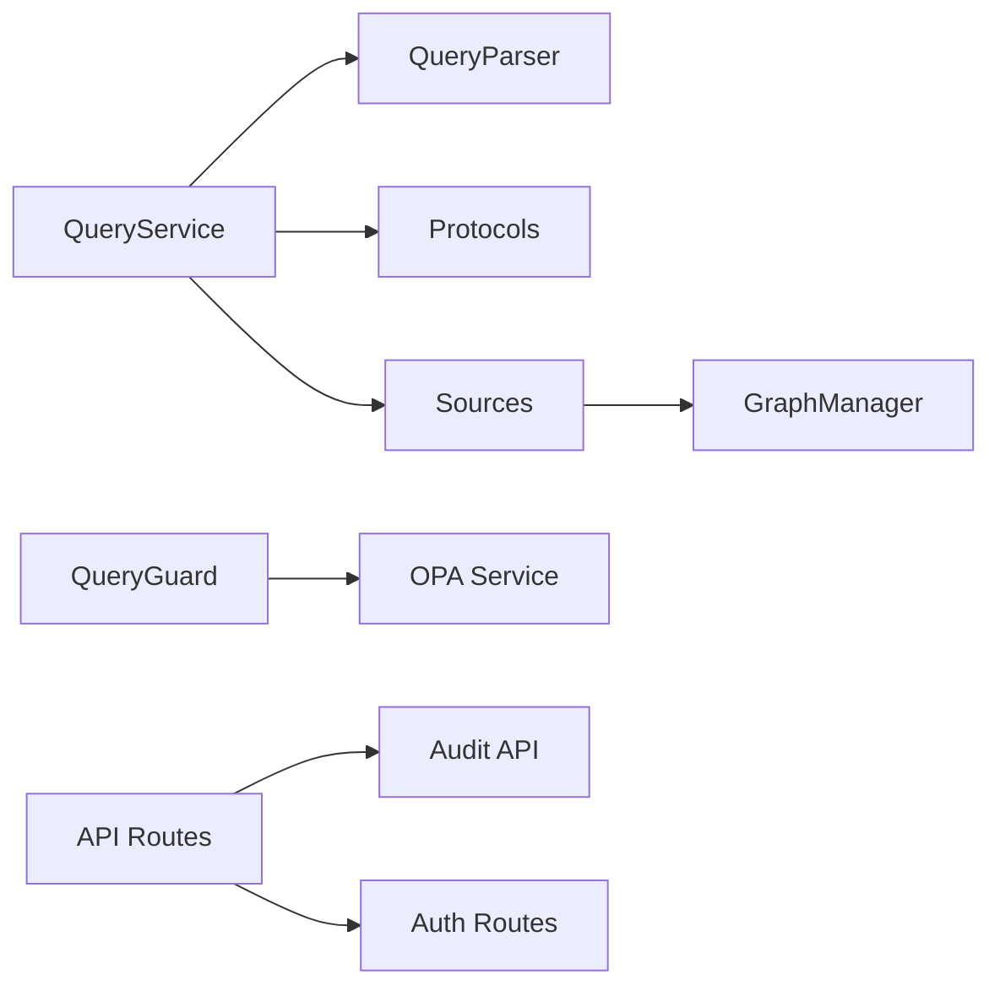

# 统一查询服务

<cite>
**本文引用的文件**
- [odap/infra/query/service.py](file://odap/infra/query/service.py)
- [odap/infra/query/parser.py](file://odap/infra/query/parser.py)
- [odap/infra/query/routes.py](file://odap/infra/query/routes.py)
- [odap/infra/query/protocols.py](file://odap/infra/query/protocols.py)
- [odap/infra/query/__init__.py](file://odap/infra/query/__init__.py)
- [odap/infra/query/schemas.py](file://odap/infra/query/schemas.py)
- [odap/infra/query/sources/schema_source.py](file://odap/infra/query/sources/schema_source.py)
- [odap/infra/query/sources/entity_source.py](file://odap/infra/query/sources/entity_source.py)
- [odap/infra/query/sources/topo_source.py](file://odap/infra/query/sources/topo_source.py)
- [odap/infra/query/sources/__init__.py](file://odap/infra/query/sources/__init__.py)
- [odap/infra/graph/graph_service.py](file://odap/infra/graph/graph_service.py)
- [odap/infra/openharness/query_guard_hook.py](file://odap/infra/openharness/query_guard_hook.py)
- [odap/infra/security/audit_api.py](file://odap/infra/security/audit_api.py)
- [odap/infra/security/auth_routes.py](file://odap/infra/security/auth_routes.py)
- [odap/infra/opa/opa_service.py](file://odap/infra/opa/opa_service.py)
</cite>

## 目录
1. [简介](#简介)
2. [项目结构](#项目结构)
3. [核心组件](#核心组件)
4. [架构总览](#架构总览)
5. [详细组件分析](#详细组件分析)
6. [依赖分析](#依赖分析)
7. [性能考虑](#性能考虑)
8. [故障排查指南](#故障排查指南)
9. [结论](#结论)
10. [附录](#附录)

## 简介
统一查询服务提供“四源一体”的统一查询能力，覆盖本体类型定义（Schema）、运行时实体（Entity）、拓扑关系（Topo）与时态数据（Temporal）。通过简洁的查询语法，用户以单一入口即可完成跨源查询，并由解析器将自然语言风格的查询表达式映射为具体的数据源与动作，最终由查询服务协调各数据源执行并返回标准化结果。

该服务强调安全与可观测性：默认只读、写操作经 OPA 策略校验；内置审计通道，支持查询与写操作的全链路追踪与统计。

## 项目结构
统一查询服务位于 odap/infra/query 子模块，包含解析器、协议定义、服务编排、路由与查询源实现；同时与图谱管理、安全与审计模块紧密集成。

**图表来源**
- [odap/infra/query/service.py:11-126](file://odap/infra/query/service.py#L11-L126)
- [odap/infra/query/parser.py:23-113](file://odap/infra/query/parser.py#L23-L113)
- [odap/infra/query/routes.py:11-101](file://odap/infra/query/routes.py#L11-L101)
- [odap/infra/query/protocols.py:7-40](file://odap/infra/query/protocols.py#L7-L40)
- [odap/infra/query/sources/schema_source.py:4-172](file://odap/infra/query/sources/schema_source.py#L4-L172)
- [odap/infra/query/sources/entity_source.py:4-34](file://odap/infra/query/sources/entity_source.py#L4-L34)
- [odap/infra/query/sources/topo_source.py:4-28](file://odap/infra/query/sources/topo_source.py#L4-L28)
- [odap/infra/graph/graph_service.py:71-800](file://odap/infra/graph/graph_service.py#L71-L800)
- [odap/infra/openharness/query_guard_hook.py:17-175](file://odap/infra/openharness/query_guard_hook.py#L17-L175)
- [odap/infra/opa/opa_service.py:455-750](file://odap/infra/opa/opa_service.py#L455-L750)
- [odap/infra/security/audit_api.py:16-487](file://odap/infra/security/audit_api.py#L16-L487)
- [odap/infra/security/auth_routes.py:9-143](file://odap/infra/security/auth_routes.py#L9-L143)

**章节来源**
- [odap/infra/query/service.py:11-126](file://odap/infra/query/service.py#L11-L126)
- [odap/infra/query/parser.py:23-113](file://odap/infra/query/parser.py#L23-L113)
- [odap/infra/query/routes.py:11-101](file://odap/infra/query/routes.py#L11-L101)
- [odap/infra/query/protocols.py:7-40](file://odap/infra/query/protocols.py#L7-L40)
- [odap/infra/query/sources/schema_source.py:4-172](file://odap/infra/query/sources/schema_source.py#L4-L172)
- [odap/infra/query/sources/entity_source.py:4-34](file://odap/infra/query/sources/entity_source.py#L4-L34)
- [odap/infra/query/sources/topo_source.py:4-28](file://odap/infra/query/sources/topo_source.py#L4-L28)
- [odap/infra/graph/graph_service.py:71-800](file://odap/infra/graph/graph_service.py#L71-L800)
- [odap/infra/openharness/query_guard_hook.py:17-175](file://odap/infra/openharness/query_guard_hook.py#L17-L175)
- [odap/infra/opa/opa_service.py:455-750](file://odap/infra/opa/opa_service.py#L455-L750)
- [odap/infra/security/audit_api.py:16-487](file://odap/infra/security/audit_api.py#L16-L487)
- [odap/infra/security/auth_routes.py:9-143](file://odap/infra/security/auth_routes.py#L9-L143)

## 核心组件
- 查询服务（QueryService）：统一编排器，负责解析、路由与执行，封装结果与错误。
- 解析器（QueryParser）：将查询表达式解析为结构化对象，识别数据源、过滤条件、动作与参数。
- 协议与模型（protocols.py）：定义查询源枚举、结果模型与数据源协议接口。
- 查询源实现（sources/*）：Schema/Entity/Topo 三类数据源的具体实现，均委托底层图管理器或 OMS 服务。
- 图管理器（GraphManager）：提供实体查询、邻接关系、路径遍历、时态查询等能力，具备多模式降级。
- 安全与审计（query_guard_hook.py、opa_service.py、audit_api.py、auth_routes.py）：默认只读、写操作经 OPA 校验、审计日志与认证。

**章节来源**
- [odap/infra/query/service.py:11-126](file://odap/infra/query/service.py#L11-L126)
- [odap/infra/query/parser.py:23-113](file://odap/infra/query/parser.py#L23-L113)
- [odap/infra/query/protocols.py:7-40](file://odap/infra/query/protocols.py#L7-L40)
- [odap/infra/query/sources/schema_source.py:4-172](file://odap/infra/query/sources/schema_source.py#L4-L172)
- [odap/infra/query/sources/entity_source.py:4-34](file://odap/infra/query/sources/entity_source.py#L4-L34)
- [odap/infra/query/sources/topo_source.py:4-28](file://odap/infra/query/sources/topo_source.py#L4-L28)
- [odap/infra/graph/graph_service.py:71-800](file://odap/infra/graph/graph_service.py#L71-L800)
- [odap/infra/openharness/query_guard_hook.py:17-175](file://odap/infra/openharness/query_guard_hook.py#L17-L175)
- [odap/infra/opa/opa_service.py:455-750](file://odap/infra/opa/opa_service.py#L455-L750)
- [odap/infra/security/audit_api.py:16-487](file://odap/infra/security/audit_api.py#L16-L487)
- [odap/infra/security/auth_routes.py:9-143](file://odap/infra/security/auth_routes.py#L9-L143)

## 架构总览
统一查询服务采用“解析—编排—执行—返回”的流水线架构。解析器负责语法识别与参数抽取；查询服务根据数据源选择对应源实现；源实现进一步委派至图管理器或 OMS 服务；结果统一包装为标准模型返回；安全与审计贯穿始终。

**图表来源**
- [odap/infra/query/routes.py:18-50](file://odap/infra/query/routes.py#L18-L50)
- [odap/infra/query/service.py:33-126](file://odap/infra/query/service.py#L33-L126)
- [odap/infra/query/parser.py:31-81](file://odap/infra/query/parser.py#L31-L81)
- [odap/infra/query/sources/schema_source.py:14-68](file://odap/infra/query/sources/schema_source.py#L14-L68)
- [odap/infra/query/sources/entity_source.py:14-33](file://odap/infra/query/sources/entity_source.py#L14-L33)
- [odap/infra/query/sources/topo_source.py:14-27](file://odap/infra/query/sources/topo_source.py#L14-L27)
- [odap/infra/graph/graph_service.py:649-756](file://odap/infra/graph/graph_service.py#L649-L756)

## 详细组件分析

### 查询语法与解析器
- 语法前缀：.schema/.entity/.topo/.temporal 识别数据源。
- 过滤条件：with(...) 提取键值对，支持字符串与数字自动类型推断。
- 动作与参数：
  - Topo：neighbors(id, depth, direction)、path(from, to, max_hops/max_depth)、relations(id, type)
  - Temporal：at('YYYY-MM-DD')、history(id)
- 限制：默认 limit=20，可通过查询参数覆盖。

**图表来源**
- [odap/infra/query/parser.py:31-113](file://odap/infra/query/parser.py#L31-L113)

**章节来源**
- [odap/infra/query/parser.py:23-113](file://odap/infra/query/parser.py#L23-L113)

### 查询服务与四源执行
- Schema 查询：按 kind 选择对象类型、链接定义或动作类型查询。
- Entity 查询：支持按 ID 获取、按过滤条件查询、全文/混合检索搜索。
- Topo 查询：邻居、关系、路径遍历，支持方向与深度控制。
- Temporal 查询：历史版本与双时态查询，基于图管理器的时序能力。

**图表来源**
- [odap/infra/query/service.py:11-126](file://odap/infra/query/service.py#L11-L126)
- [odap/infra/query/sources/schema_source.py:4-172](file://odap/infra/query/sources/schema_source.py#L4-L172)
- [odap/infra/query/sources/entity_source.py:4-34](file://odap/infra/query/sources/entity_source.py#L4-L34)
- [odap/infra/query/sources/topo_source.py:4-28](file://odap/infra/query/sources/topo_source.py#L4-L28)
- [odap/infra/graph/graph_service.py:71-800](file://odap/infra/graph/graph_service.py#L71-L800)

**章节来源**
- [odap/infra/query/service.py:33-126](file://odap/infra/query/service.py#L33-L126)
- [odap/infra/query/sources/schema_source.py:14-68](file://odap/infra/query/sources/schema_source.py#L14-L68)
- [odap/infra/query/sources/entity_source.py:14-33](file://odap/infra/query/sources/entity_source.py#L14-L33)
- [odap/infra/query/sources/topo_source.py:14-27](file://odap/infra/query/sources/topo_source.py#L14-L27)
- [odap/infra/graph/graph_service.py:649-756](file://odap/infra/graph/graph_service.py#L649-L756)

### 图管理器与时态能力
- 多模式降级：Graphiti（双时态知识图谱）→ Neo4j Driver（Cypher 直连）→ NetworkX 回退。
- 实体查询：支持类型过滤、区域过滤、工作空间隔离。
- 拓扑查询：邻居、关系、路径遍历，支持方向与深度。
- 时态查询：历史版本与双时态查询，基于图管理器的时序能力。

**图表来源**
- [odap/infra/graph/graph_service.py:71-144](file://odap/infra/graph/graph_service.py#L71-L144)
- [odap/infra/graph/graph_service.py:649-756](file://odap/infra/graph/graph_service.py#L649-L756)

**章节来源**
- [odap/infra/graph/graph_service.py:71-800](file://odap/infra/graph/graph_service.py#L71-L800)

### 安全与审计（Agent Safe 默认只读）
- 写操作守卫：仅允许白名单工具（如写实体/关系）执行，其余工具默认只读。
- OPA 集成：写操作需经 OPA 策略校验，OPA 不可用时 fail-closed。
- 审计日志：统一 SQLite 通道，支持事件查询、时间线、追踪与统计导出。
- 认证：提供登录、刷新、用户管理等认证路由。

**图表来源**
- [odap/infra/openharness/query_guard_hook.py:17-83](file://odap/infra/openharness/query_guard_hook.py#L17-L83)
- [odap/infra/opa/opa_service.py:455-750](file://odap/infra/opa/opa_service.py#L455-L750)
- [odap/infra/security/audit_api.py:16-487](file://odap/infra/security/audit_api.py#L16-L487)

**章节来源**
- [odap/infra/openharness/query_guard_hook.py:17-175](file://odap/infra/openharness/query_guard_hook.py#L17-L175)
- [odap/infra/opa/opa_service.py:455-750](file://odap/infra/opa/opa_service.py#L455-L750)
- [odap/infra/security/audit_api.py:16-487](file://odap/infra/security/audit_api.py#L16-L487)
- [odap/infra/security/auth_routes.py:9-143](file://odap/infra/security/auth_routes.py#L9-L143)

## 依赖分析
- 组件内聚与耦合
  - QueryService 与解析器、协议、查询源松耦合，通过协议接口交互。
  - 查询源实现均依赖图管理器，形成清晰的抽象边界。
- 外部依赖
  - 图管理器依赖 graphiti-core、Neo4j Driver 或 NetworkX，具备降级能力。
  - 安全模块依赖 OPA 服务，提供策略评估与缓存。
  - 审计模块依赖 SQLite 通道，提供统一事件存储与查询接口。
- 循环依赖
  - 未发现循环依赖迹象，模块职责清晰。

**图表来源**
- [odap/infra/query/service.py:11-126](file://odap/infra/query/service.py#L11-L126)
- [odap/infra/query/parser.py:23-113](file://odap/infra/query/parser.py#L23-L113)
- [odap/infra/query/protocols.py:7-40](file://odap/infra/query/protocols.py#L7-L40)
- [odap/infra/query/sources/schema_source.py:4-172](file://odap/infra/query/sources/schema_source.py#L4-L172)
- [odap/infra/query/sources/entity_source.py:4-34](file://odap/infra/query/sources/entity_source.py#L4-L34)
- [odap/infra/query/sources/topo_source.py:4-28](file://odap/infra/query/sources/topo_source.py#L4-L28)
- [odap/infra/graph/graph_service.py:71-800](file://odap/infra/graph/graph_service.py#L71-L800)
- [odap/infra/openharness/query_guard_hook.py:17-175](file://odap/infra/openharness/query_guard_hook.py#L17-L175)
- [odap/infra/opa/opa_service.py:455-750](file://odap/infra/opa/opa_service.py#L455-L750)
- [odap/infra/security/audit_api.py:16-487](file://odap/infra/security/audit_api.py#L16-L487)
- [odap/infra/security/auth_routes.py:9-143](file://odap/infra/security/auth_routes.py#L9-L143)

**章节来源**
- [odap/infra/query/service.py:11-126](file://odap/infra/query/service.py#L11-L126)
- [odap/infra/query/parser.py:23-113](file://odap/infra/query/parser.py#L23-L113)
- [odap/infra/query/protocols.py:7-40](file://odap/infra/query/protocols.py#L7-L40)
- [odap/infra/query/sources/schema_source.py:4-172](file://odap/infra/query/sources/schema_source.py#L4-L172)
- [odap/infra/query/sources/entity_source.py:4-34](file://odap/infra/query/sources/entity_source.py#L4-L34)
- [odap/infra/query/sources/topo_source.py:4-28](file://odap/infra/query/sources/topo_source.py#L4-L28)
- [odap/infra/graph/graph_service.py:71-800](file://odap/infra/graph/graph_service.py#L71-L800)
- [odap/infra/openharness/query_guard_hook.py:17-175](file://odap/infra/openharness/query_guard_hook.py#L17-L175)
- [odap/infra/opa/opa_service.py:455-750](file://odap/infra/opa/opa_service.py#L455-L750)
- [odap/infra/security/audit_api.py:16-487](file://odap/infra/security/audit_api.py#L16-L487)
- [odap/infra/security/auth_routes.py:9-143](file://odap/infra/security/auth_routes.py#L9-L143)

## 性能考虑
- 连接池与断路器：图管理器维护 Neo4j 连接池与断路器，避免抖动与雪崩。
- 批量加载与回退：Neo4j 批量插入失败时回退单条插入；回退模式使用 NetworkX，适合小规模数据。
- 查询缓存与命中率：OPA 管理器内置缓存，降低重复策略评估开销。
- 降级策略：三层模式（Graphiti→Neo4j→NetworkX），确保系统可用性。
- 建议
  - 合理设置 limit，避免一次性返回过多数据。
  - Topo 查询控制 depth，防止指数爆炸。
  - 使用 with(...) 过滤条件缩小搜索范围。
  - 在高并发场景下启用连接池与缓存策略。

**章节来源**
- [odap/infra/graph/graph_service.py:299-443](file://odap/infra/graph/graph_service.py#L299-L443)
- [odap/infra/opa/opa_service.py:501-557](file://odap/infra/opa/opa_service.py#L501-L557)

## 故障排查指南
- 查询异常
  - 检查解析器前缀与动作参数是否正确。
  - 确认数据源是否存在（如实体 ID 是否存在）。
  - 查看服务日志中的错误信息与 explain 结果。
- 写操作被拒
  - 确认工具是否在写操作白名单。
  - 检查 OPA 策略是否允许该角色执行该动作。
  - 若 OPA 不可用，将 fail-closed，需修复 OPA 服务。
- 审计与追踪
  - 使用审计 API 查询事件、时间线与追踪链。
  - 导出日志进行离线分析。
- 认证问题
  - 检查登录凭据与令牌刷新流程。
  - 确认用户角色与工作空间权限。

**章节来源**
- [odap/infra/query/service.py:52-59](file://odap/infra/query/service.py#L52-L59)
- [odap/infra/openharness/query_guard_hook.py:58-82](file://odap/infra/openharness/query_guard_hook.py#L58-L82)
- [odap/infra/security/audit_api.py:120-292](file://odap/infra/security/audit_api.py#L120-L292)
- [odap/infra/security/auth_routes.py:40-80](file://odap/infra/security/auth_routes.py#L40-L80)

## 结论
统一查询服务通过简洁的语法与清晰的分层架构，实现了 Schema、Entity、Topo、Temporal 四源一体化查询。结合默认只读的安全策略、OPA 策略引擎与完善的审计体系，既保证了易用性，也兼顾了安全性与可追溯性。建议在生产环境中合理设置查询限制、控制拓扑遍历深度，并充分利用缓存与降级策略提升稳定性与性能。

## 附录

### API 接口文档

- 执行查询
  - 方法：POST
  - 路径：/api/query/execute
  - 参数：
    - query: 字符串，查询表达式（如 .entity with(type='MilitaryUnit')）
    - workspace_id: 字符串，默认 default
    - limit: 整数，1-100，默认 20
  - 返回：QueryResult（包含 source、rows、total、explain）
  - 错误：500 服务器错误，返回错误详情

- 解释查询
  - 方法：POST
  - 路径：/api/query/explain
  - 参数：同上
  - 返回：解析后的结构化信息（source、filters、action、action_params、limit、workspace_id）

- 列出可用查询源
  - 方法：GET
  - 路径：/api/query/sources
  - 返回：包含 schema/entity/topo/temporal 的描述与示例

- 审计查询
  - 方法：GET
  - 路径：/api/audit/events
  - 参数：start_time、end_time、event_types、severities、actor_ids、resource_ids、workspace_id、trace_id、result_status、keyword、limit、offset、order_by、order_desc
  - 返回：total、events、limit、offset

- 审计时间线
  - 方法：GET
  - 路径：/api/audit/timeline
  - 参数：start_time、end_time、workspace_id、limit
  - 返回：events、total

- 审计追踪
  - 方法：GET
  - 路径：/api/audit/trace/{trace_id}
  - 返回：trace_id、chain

- 审计统计
  - 方法：GET
  - 路径：/api/audit/stats
  - 参数：start_time、end_time
  - 返回：total、by_severity、by_type、by_status、time_range

- 审计导出
  - 方法：POST
  - 路径：/api/audit/export
  - 参数：start_time、end_time、event_types、severities、format=json
  - 返回：format、data、count

- 认证
  - 登录：POST /api/auth/login
  - 我的信息：GET /api/auth/me
  - 刷新：POST /api/auth/refresh
  - 用户管理：GET/POST/PUT/DELETE /api/auth/users

**章节来源**
- [odap/infra/query/routes.py:18-101](file://odap/infra/query/routes.py#L18-L101)
- [odap/infra/security/audit_api.py:120-487](file://odap/infra/security/audit_api.py#L120-L487)
- [odap/infra/security/auth_routes.py:40-143](file://odap/infra/security/auth_routes.py#L40-L143)

### 查询示例与最佳实践
- Schema 查询
  - 示例：.schema with(type='Unit')
  - 最佳实践：先用 .schema with(kind='object_types') 获取类型清单，再细化过滤条件
- Entity 查询
  - 示例：.entity with(type='MilitaryUnit')、.entity with(search='装甲部队')
  - 最佳实践：优先使用 with(...) 过滤，避免全表扫描；搜索时限定 limit
- Topo 查询
  - 示例：.topo neighbors(id='entity-mil-abc123', depth=2)、.topo path(from='id1', to='id2', max_hops=5)
  - 最佳实践：控制 depth，避免大规模遍历；先 neighbors 再 path 判断是否可达
- Temporal 查询
  - 示例：.temporal at('2025-01-01')、.temporal history(id='entity-mil-abc123')
  - 最佳实践：时态查询需依赖图管理器的时序能力，注意数据加载与索引

**章节来源**
- [odap/infra/query/routes.py:24-98](file://odap/infra/query/routes.py#L24-L98)
- [odap/infra/query/service.py:72-126](file://odap/infra/query/service.py#L72-L126)