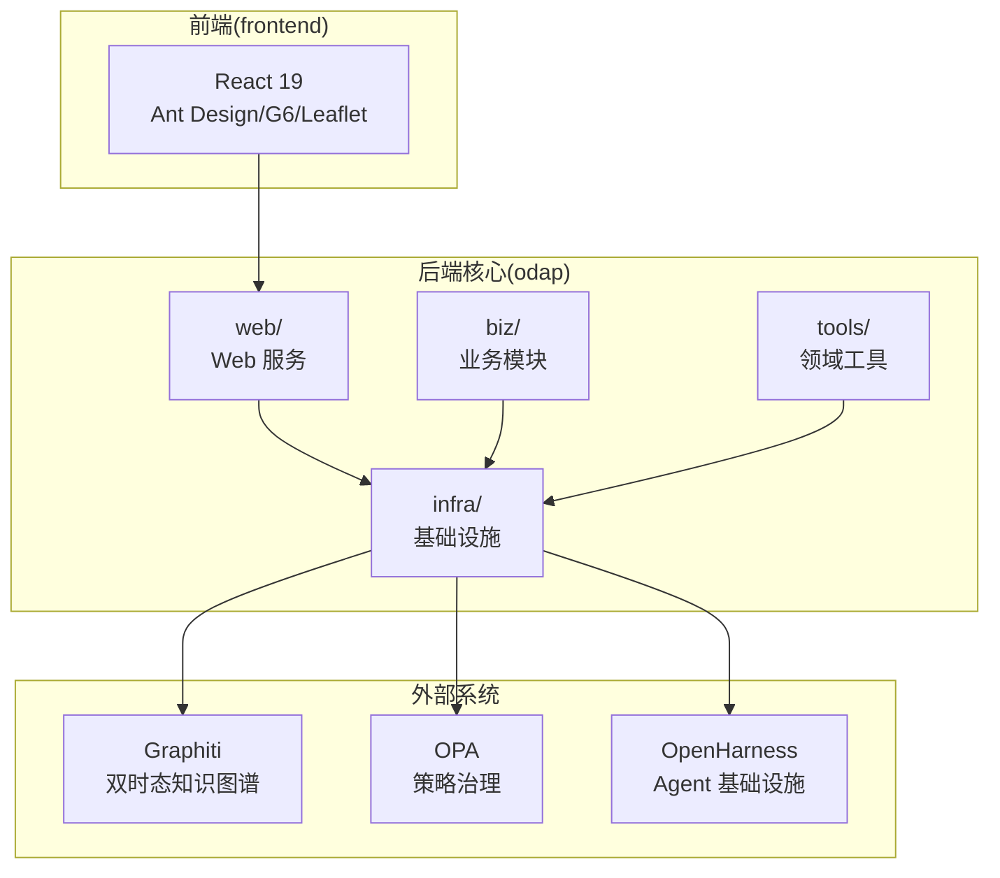
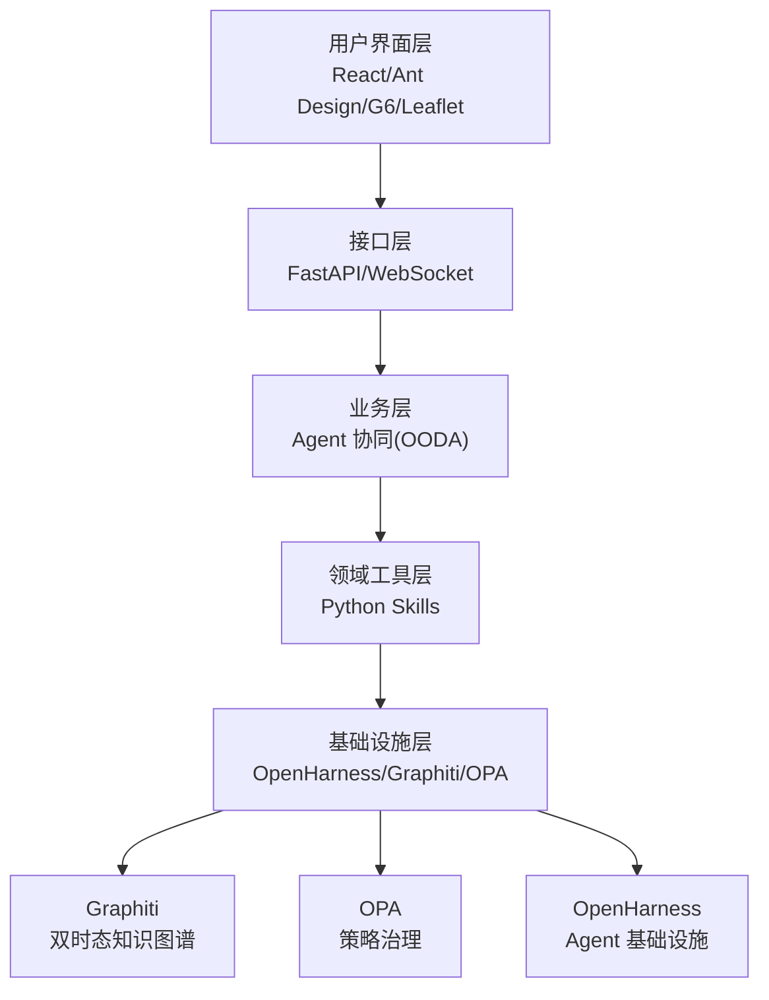
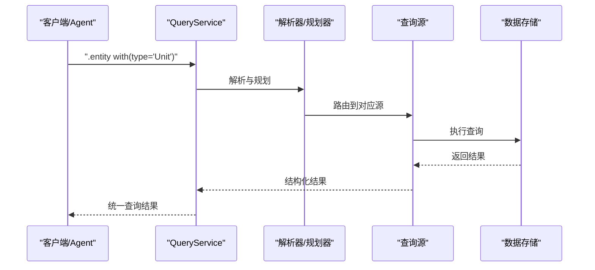
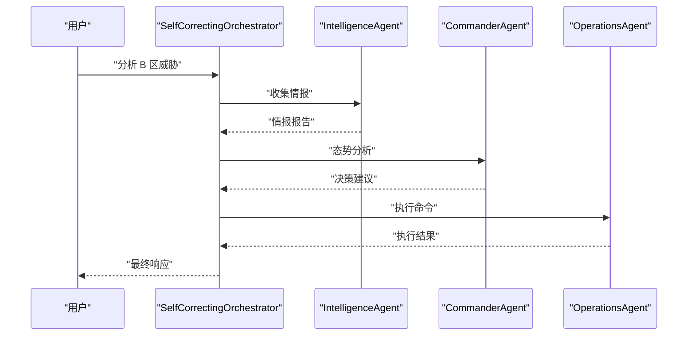
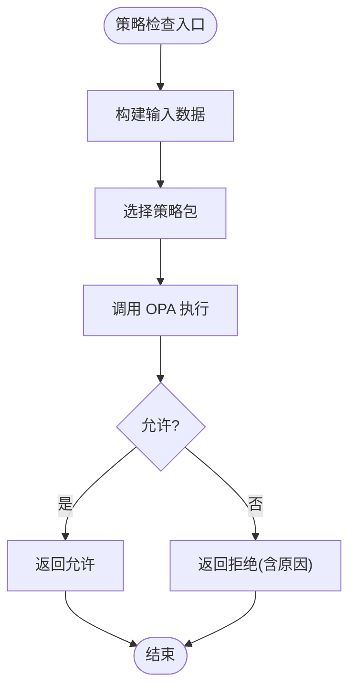
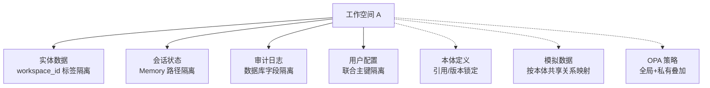
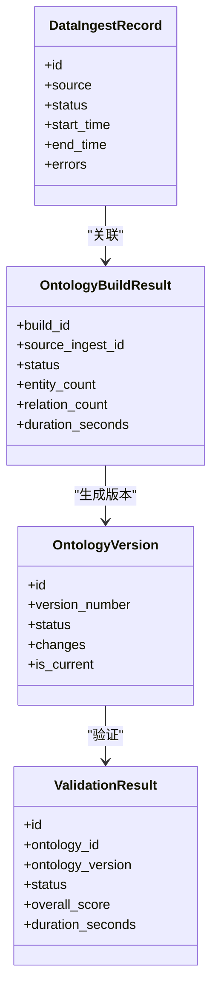
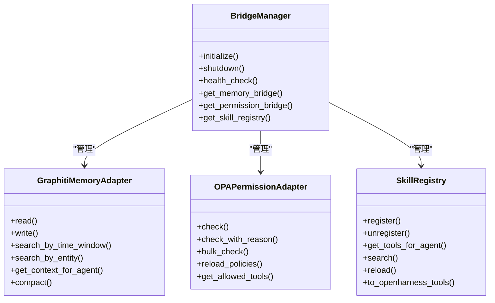
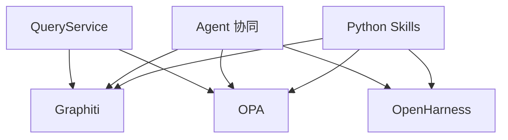

# 项目概述

<cite>
**本文档引用的文件**
- [README.md](file://README.md)
- [ARCHITECTURE.md](file://docs/02-architecture/ARCHITECTURE.md)
- [DESIGN.md（本体模块）](file://docs/03-modules/ontology/DESIGN.md)
- [DESIGN.md（本体管理引擎）](file://docs/03-modules/ontology_management_engine/DESIGN.md)
- [DESIGN.md（Agent 模块）](file://docs/03-modules/agent/DESIGN.md)
- [DESIGN.md（Swarm 编排模块）](file://docs/03-modules/swarm_orchestrator/DESIGN.md)
- [DESIGN.md（OPA 策略模块）](file://docs/03-modules/opa_policy/DESIGN.md)
- [DESIGN.md（OpenHarness 桥接模块）](file://docs/03-modules/openharness_bridge/DESIGN.md)
</cite>

## 目录
1. [项目简介](#项目简介)
2. [项目结构](#项目结构)
3. [核心组件](#核心组件)
4. [架构总览](#架构总览)
5. [详细组件分析](#详细组件分析)
6. [依赖关系分析](#依赖关系分析)
7. [性能考量](#性能考量)
8. [故障排查指南](#故障排查指南)
9. [结论](#结论)
10. [附录](#附录)

## 项目简介
ODAP（本体驱动分析决策平台）是一个通用的本体驱动分析决策平台，通过工作空间机制实现多场景隔离，支持任意领域的本体建模与分析决策。平台以“本体为核心”，结合双时态知识图谱、统一查询服务、多智能体协同、策略治理与工作空间隔离等关键技术，形成从数据到决策再到执行的闭环体系。

- 核心价值主张
  - 本体驱动：OMS 元模型框架 + 四层本体结构 + 版本链管理
  - 统一查询服务：QueryService 四源查询（Schema/Entity/Topo/Temporal），Agent Safe 默认只读
  - 多智能体协同：OpenHarness Agent Loop + Swarm 三 Agent OODA 闭环
  - 双时态知识图谱：Graphiti 支持 valid_time + transaction_time 时序推理
  - 策略治理：OPA fail-close 安全边界 + Agent 写操作守卫
  - 工作空间隔离：4 级隔离（low/standard/high/strict）+ 资源配额

- 技术栈概览
  - 后端：Python 3.11+、FastAPI、Neo4j / NetworkX
  - 前端：React 19、TypeScript、Ant Design、G6、Leaflet
  - Agent：OpenHarness（Agent Loop + Swarm + MCP）
  - 知识图谱：Graphiti（双时态知识图谱）
  - 策略治理：OPA（开放策略代理）
  - LLM：OpenAI / Anthropic / DeepSeek

- 服务访问
  - 前端（开发）：http://localhost:5173
  - 前端（生产）：http://localhost:80
  - 后端 API：http://localhost:8000
  - API 文档：http://localhost:8000/docs
  - 健康检查：http://localhost:8000/health
  - Neo4j Browser：http://localhost:7474
  - OPA：http://localhost:8181

**章节来源**
- [README.md: 1-241:1-241](file://README.md#L1-L241)

## 项目结构
项目采用模块化分层架构，核心目录与职责如下：
- odap/：核心平台代码
  - biz/：业务模块（按领域分层）
    - core/：核心领域（本体、认知、Agent 协同）
    - decision/：决策领域（推荐、管道、动作执行）
    - integration/：集成领域（OpenHarness、MCP、Hook、前端兼容）
    - platform/：平台领域（工作空间、角色、技能、工具、会话记忆）
    - simulation/：仿真领域（事件模拟、沙箱、反馈、可视化）
    - management/：管理领域（Agent 管理、业务管理）
  - infra/：基础设施（查询服务、图谱、OpenHarness 适配、OPA、安全、存储、数据管道、监控、韧性）
  - tools/：领域工具（Python Skills）
  - web/：Web 服务（FastAPI 应用、网关、WebSocket、静态资源）
- frontend/：React 前端项目，按业务模块组织
- openharness/：OpenHarness 子模块（Git Submodule）
- docs/：12 个分类文档，涵盖架构、产品设计、模块设计、ADR 等
- tests/：单元、集成、端到端测试
- docker/：Docker 配置与编排
- scripts/：辅助脚本

**章节来源**
- [README.md: 27-122:27-122](file://README.md#L27-L122)

## 核心组件
- 本体管理层（Ontology）
  - 定义领域实体类型、关系类型与约束规则，是 Graphiti 图谱的数据模式基础
  - 支持实体与关系的验证、版本管理与导出
- 本体管理引擎（Ontology Management Engine）
  - 负责数据摄入审计、本体构建、版本管理、验证与审计仪表盘
  - 提供数据质量与一致性保障
- Agent 协同系统（Agent + Swarm）
  - 三 Agent（Commander/Intelligence/Operations）+ OODA 闭环
  - 基于 OpenHarness 的 Agent Loop 与 Swarm 编排
- 统一查询服务（QueryService）
  - 四源查询（Schema/Entity/Topo/Temporal），Agent Safe 默认只读
  - 通过 OpenHarness Hook 实现写操作守卫
- 策略治理（OPA）
  - Fail-Close 安全边界，权限校验、规则执行、合规检查与审计追溯
- 工作空间隔离（Workspace）
  - 4 级隔离（low/standard/high/strict）+ 资源配额
  - 支持本体共享绑定、技能平台共用、策略叠加与跨空间合规操作

**章节来源**
- [DESIGN.md（本体模块）: 1-800:1-800](file://docs/03-modules/ontology/DESIGN.md#L1-L800)
- [DESIGN.md（本体管理引擎）: 1-800:1-800](file://docs/03-modules/ontology_management_engine/DESIGN.md#L1-L800)
- [DESIGN.md（Agent 模块）: 1-409:1-409](file://docs/03-modules/agent/DESIGN.md#L1-L409)
- [DESIGN.md（Swarm 编排模块）: 1-800:1-800](file://docs/03-modules/swarm_orchestrator/DESIGN.md#L1-L800)
- [DESIGN.md（OPA 策略模块）: 1-658:1-658](file://docs/03-modules/opa_policy/DESIGN.md#L1-L658)
- [DESIGN.md（OpenHarness 桥接模块）: 1-800:1-800](file://docs/03-modules/openharness_bridge/DESIGN.md#L1-L800)

## 架构总览
ODAP 采用四层架构理念：
- L1 基础设施层：OpenHarness（Agent Loop + Swarm + 工具调度）、Graphiti（双时态知识图谱 + 时序推理）、OPA（策略治理 + 权限校验）
- L2 领域工具层：Python Skills（可插拔的领域能力）
- L3-L4 业务层：Agent 协同（OODA 闭环）、数据架构、本体管理、角色权限、配置
- L5-L6 接口层：前端界面、管理后台、API 端点

**章节来源**
- [ARCHITECTURE.md: 392-446:392-446](file://docs/02-architecture/ARCHITECTURE.md#L392-L446)

## 详细组件分析

### 统一查询服务（QueryService）
- 设计动机：解决多条独立图谱查询路径导致的意图识别重复、接口断裂、安全边界缺失等问题
- 三源查询模型：Schema（OMS 类型定义）、Entity（运行时实体）、Topo（拓扑关系）、Temporal（双时态数据）
- Agent 安全默认：查询工具默认只读，写操作需经 OPA 策略校验
- 架构守卫：通过测试强制执行边界规则，禁止在 QueryService 之外暴露域读取 API

**章节来源**
- [ARCHITECTURE.md: 457-562:457-562](file://docs/02-architecture/ARCHITECTURE.md#L457-L562)

### 多智能体协同（Agent + Swarm）
- 三 Agent 角色：Commander（决策中枢）、Intelligence（情报中心）、Operations（执行中心）
- OODA 闭环：Observe → Orient → Decide → Act，支持链路追踪与自校正机制
- Swarm 编排：DomainSwarm 协调 Agent 执行，支持流式进度与状态管理

**章节来源**
- [DESIGN.md（Agent 模块）: 1-409:1-409](file://docs/03-modules/agent/DESIGN.md#L1-L409)
- [DESIGN.md（Swarm 编排模块）: 1-800:1-800](file://docs/03-modules/swarm_orchestrator/DESIGN.md#L1-L800)

### 策略治理（OPA）
- Fail-Close 安全机制：未知操作默认拒绝
- 策略包结构：attack/intelligence/agent/common 等
- 管理接口：OPAManager 提供 check、bulk_check、reload_policies 等能力
- 调试与监控：策略沙盒、可视化跟踪、性能优化与监控审计

**章节来源**
- [DESIGN.md（OPA 策略模块）: 1-658:1-658](file://docs/03-modules/opa_policy/DESIGN.md#L1-L658)

### 工作空间隔离（Workspace）
- 资源分类：强制隔离（实体数据/会话状态/审计日志/用户配置）与可选共享（本体定义/模拟数据/OPA 策略）
- 共享绑定：本体库引用 + 版本锁定；技能平台共用；策略叠加
- 空间交互规则：同一空间内 Agent 互访、Skill 调用 Graphiti 操作本空间实体、跨空间需合规中转

**章节来源**
- [ARCHITECTURE.md: 144-287:144-287](file://docs/02-architecture/ARCHITECTURE.md#L144-L287)

### 本体管理引擎（OME）
- 核心职责：数据摄入审计、本体构建、版本管理、验证引擎、审计仪表盘
- 数据模型：数据摄入记录、本体构建结果、版本变更、验证结果等
- 接口设计：IDataIngestAudit、IOntologyBuilder、IVersionManager、IValidationEngine、IAuditDashboard

**章节来源**
- [DESIGN.md（本体管理引擎）: 59-294:59-294](file://docs/03-modules/ontology_management_engine/DESIGN.md#L59-L294)

### OpenHarness 桥接（适配层）
- 适配职责：将 OpenHarness 的通用框架适配到三 Agent 角色、Graphiti 记忆、OPA 权限、Skill 标准化与 Hooks 管理
- 核心组件：BridgeManager、Memory Bridge（Graphiti）、Permission Bridge（OPA）、Skill Bridge（Tools）

**章节来源**
- [DESIGN.md（OpenHarness 桥接模块）: 61-134:61-134](file://docs/03-modules/openharness_bridge/DESIGN.md#L61-L134)

## 依赖关系分析
- 组件耦合与内聚
  - QueryService 作为统一入口，降低业务模块对底层存储的直接依赖
  - Agent 与 Swarm 通过 OpenHarness 解耦，便于扩展与替换
  - OPA 作为横切关注点，通过 Hook 与权限检查实现统一治理
- 直接与间接依赖
  - Graphiti 为本体与实体存储提供双时态能力
  - OPA 为所有高危操作提供 fail-close 安全边界
  - OpenHarness 为 Agent 生命周期与工具调度提供基础设施
- 外部依赖与集成点
  - LLM API（OpenAI / Anthropic / DeepSeek）
  - Neo4j（生产）/ NetworkX（开发回退）
  - MCP（Model Context Protocol）用于外部系统集成

**章节来源**
- [ARCHITECTURE.md: 563-588:563-588](file://docs/02-architecture/ARCHITECTURE.md#L563-L588)

## 性能考量
- 查询性能
  - 统一查询服务避免重复解析与分散实现，提升查询效率与一致性
  - Graphiti 双时态查询支持时序过滤，减少不必要的全量扫描
- 策略执行
  - OPA 策略预编译缓存与批量评估优化，降低策略检查开销
  - 策略执行监控与慢查询追踪，便于定位瓶颈
- Agent 执行
  - Swarm 编排支持并发与重试，结合断路器与降级模式提升韧性
  - 记忆桥接支持压缩与上下文生成，减少无关信息干扰

[本节提供一般性指导，无需引用具体文件]

## 故障排查指南
- OPA 策略拒绝
  - 现象：工具执行被拒绝，返回拒绝原因
  - 排查：检查策略包映射、输入数据结构、权限级别与域状态
  - 参考：OPA 策略调试工具与可视化跟踪
- Agent 执行失败
  - 现象：Agent 超时、网络错误、工具执行错误
  - 排查：查看故障恢复管理器记录、断路器状态与降级模式
  - 参考：状态持久化与健康检查
- 查询异常
  - 现象：查询结果为空或报错
  - 排查：确认 QueryService 路由、工作空间过滤与数据源可用性
  - 参考：统一查询服务架构与架构守卫

**章节来源**
- [DESIGN.md（OPA 策略模块）: 297-430:297-430](file://docs/03-modules/opa_policy/DESIGN.md#L297-L430)
- [DESIGN.md（Swarm 编排模块）: 278-782:278-782](file://docs/03-modules/swarm_orchestrator/DESIGN.md#L278-L782)
- [ARCHITECTURE.md: 556-562:556-562](file://docs/02-architecture/ARCHITECTURE.md#L556-L562)

## 结论
ODAP 通过“本体驱动 + 双时态知识图谱 + 统一查询 + 多智能体协同 + 策略治理 + 工作空间隔离”的技术组合，构建了从数据到决策再到执行的完整闭环。其模块化分层与适配层设计，既保证了通用性与可扩展性，又满足了不同领域的本体建模与分析决策需求。对于初学者，建议从统一查询服务与 Agent 协同入手；对于有经验的开发者，可深入研究 OPA 策略、Swarm 编排与 OpenHarness 桥接的实现细节。

[本节为总结性内容，无需引用具体文件]

## 附录
- 快速开始与部署
  - 环境准备：Podman/Docker、Python 3.11+、Node.js 18+
  - 配置环境变量：复制 .env.example 至 .env.docker 并填写密钥
  - Docker 部署：使用 bootstep.py 管理镜像拉取、开发/生产模式启动
  - 本地开发：安装后端/前端依赖，分别启动后端与前端服务
- 测试
  - 单元测试：pytest tests/unit/
  - 集成测试：pytest tests/integration/（需 Neo4j + MongoDB）
  - 全部测试：python -m pytest tests/
  - 前端测试：cd frontend && npm test
  - 前端类型检查：cd frontend && npm run typecheck

**章节来源**
- [README.md: 124-217:124-217](file://README.md#L124-L217)