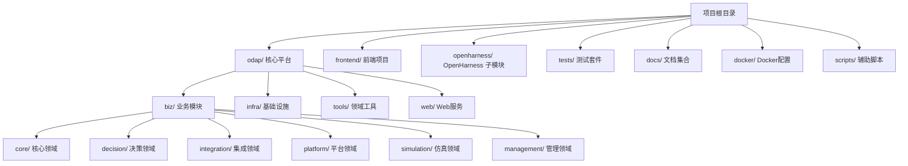
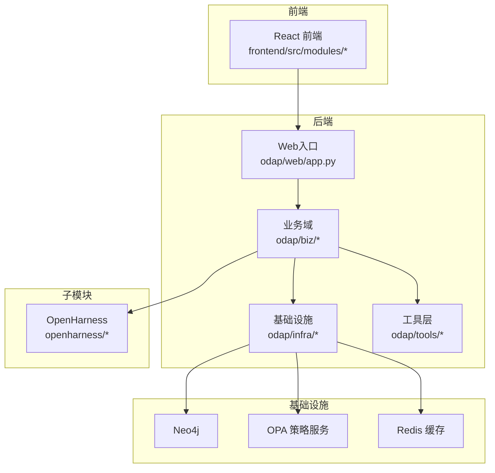
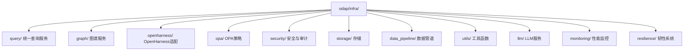
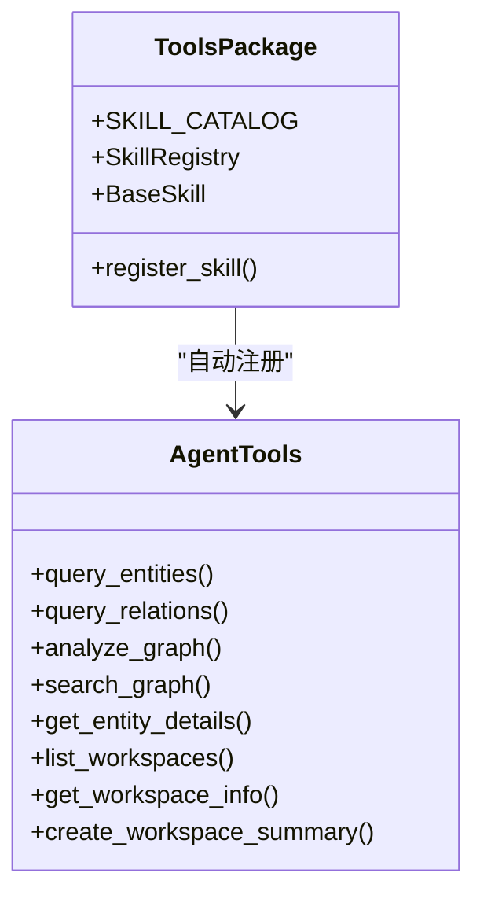
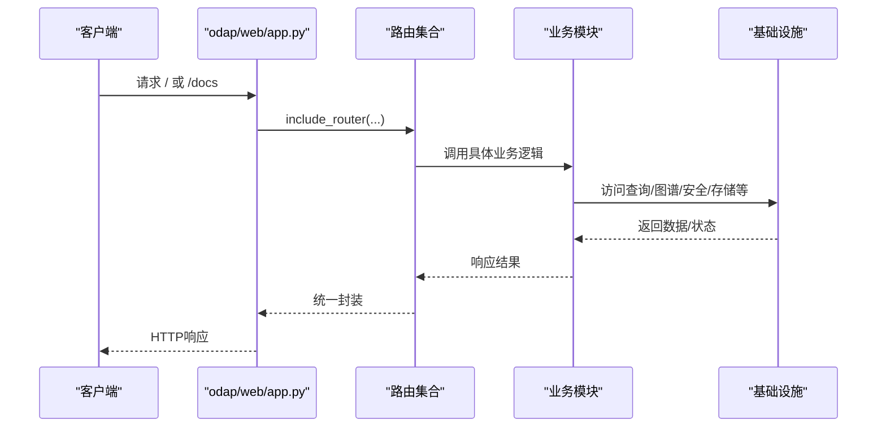
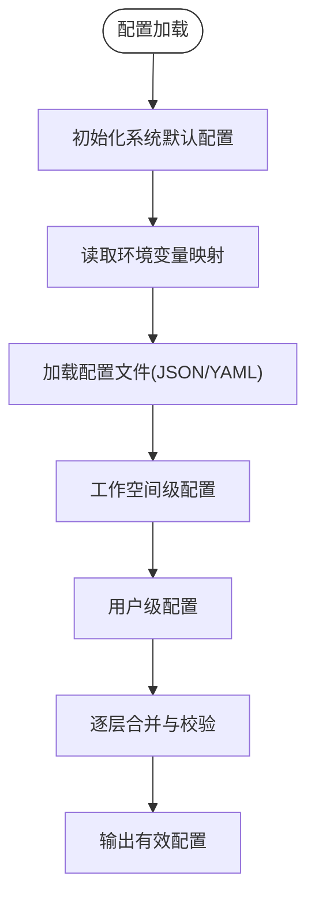

# 项目结构

<cite>
**本文引用的文件**
- [README.md](file://README.md)
- [odap/__init__.py](file://odap/__init__.py)
- [odap/web/app.py](file://odap/web/app.py)
- [odap/infra/config_composer.py](file://odap/infra/config_composer.py)
- [odap/infra/query/service.py](file://odap/infra/query/service.py)
- [odap/tools/__init__.py](file://odap/tools/__init__.py)
- [odap/biz/core/ontology/__init__.py](file://odap/biz/core/ontology/__init__.py)
- [odap/biz/platform/workspace/__init__.py](file://odap/biz/platform/workspace/__init__.py)
- [frontend/package.json](file://frontend/package.json)
- [openharness/README.md](file://openharness/README.md)
- [tests/README.md](file://tests/README.md)
- [docker/docker-compose.yml](file://docker/docker-compose.yml)
- [pyproject.toml](file://pyproject.toml)
- [main.py](file://main.py)
</cite>

## 目录
1. [简介](#简介)
2. [项目结构](#项目结构)
3. [核心组件](#核心组件)
4. [架构总览](#架构总览)
5. [详细组件分析](#详细组件分析)
6. [依赖分析](#依赖分析)
7. [性能考虑](#性能考虑)
8. [故障排查指南](#故障排查指南)
9. [结论](#结论)
10. [附录](#附录)

## 简介
本文件面向ODAP平台（本体驱动分析决策平台），系统性说明项目顶层目录与关键子模块的职责、组织方式与协作关系，并提供从根目录到关键文件的导航路径，帮助开发者与使用者快速理解与定位代码。

## 项目结构
项目采用“平台内核 + 前端 + 子模块 + 测试 + 文档 + 容器化 + 脚本”的分层布局，核心目录与职责如下：
- odap/：核心平台内核，包含biz/（业务模块）、infra/（基础设施）、tools/（领域工具）、web/（Web服务）等子模块
- frontend/：React前端工程，按业务模块组织页面与组件
- openharness/：OpenHarness子模块（Git submodule），提供Agent编排与工具生态
- tests/：测试套件（unit/integration/e2e）
- docs/：文档体系（需求、架构、模块设计、UI、安全、DFX、ADR、任务、API等）
- docker/：Docker与Compose配置，支撑本地与生产部署
- scripts/：辅助脚本（数据生成、技能验证等）

**图表来源**
- [README.md:27-122](file://README.md#L27-L122)
- [odap/__init__.py:1-2](file://odap/__init__.py#L1-L2)

**章节来源**
- [README.md:27-122](file://README.md#L27-L122)

## 核心组件
- odap/biz/：业务域分层，覆盖本体管理、认知引擎、Agent协同、决策与执行、仿真、平台能力（工作空间、角色、技能、工具注册表、会话记忆）、数据感知与知识库、集成适配等
- odap/infra/：基础设施层，包括统一查询服务（QueryService）、图谱服务、OpenHarness适配、OPA策略、安全认证、存储、数据管道、工具函数、LLM服务、监控与韧性
- odap/tools/：领域工具（技能）层，提供情报、操作、规划、分析、推荐、计算、任务管理等工具的注册与分发
- odap/web/：Web服务层，基于FastAPI提供统一API入口与路由聚合，集成审计、异常处理、CORS、健康检查与性能监控端点
- frontend/：React前端工程，模块化组织本体、Agent聊天、工作空间、数据摄入等功能
- openharness/：Agent编排与工具生态，提供Agent Loop、多Agent协调、权限与Hook、终端UI、CLI等
- tests/：测试分层（unit/integration/e2e），配合pytest与测试数据管理
- docs/：完整的SDD文档体系，覆盖需求、架构、模块设计、UI、安全、DFX、ADR、任务、API等
- docker/：Compose编排Neo4j、OPA、Redis与应用/前端服务，提供开发与生产环境
- scripts/：数据生成、技能验证等辅助脚本

**章节来源**
- [README.md:27-122](file://README.md#L27-L122)
- [odap/web/app.py:122-192](file://odap/web/app.py#L122-L192)
- [frontend/package.json:1-55](file://frontend/package.json#L1-55)
- [openharness/README.md:445-466](file://openharness/README.md#L445-L466)
- [tests/README.md:3-14](file://tests/README.md#L3-L14)

## 架构总览
ODAP采用“平台内核 + 前端 + 子模块 + 文档 + 容器化”的整体架构，核心交互路径如下：
- Web入口：odap/web/app.py注册各业务路由，统一CORS与中间件，提供健康检查与性能监控
- 业务域：odap/biz/按领域分层，核心能力通过odap/infra/提供的基础设施（查询、图谱、安全、策略、存储、监控）支撑
- 工具层：odap/tools/提供技能注册与工具分发，结合OpenHarness进行Agent编排与执行
- 前端：frontend/提供可视化与交互界面，对接后端API
- 子模块：openharness/作为Agent基础设施，提供工具、技能、权限、Hook、多Agent协调等
- 测试与文档：tests/与docs/保障质量与知识沉淀
- 容器化：docker/通过Compose编排后端、前端、Neo4j、OPA、Redis

**图表来源**
- [odap/web/app.py:122-192](file://odap/web/app.py#L122-L192)
- [docker/docker-compose.yml:1-97](file://docker/docker-compose.yml#L1-L97)

**章节来源**
- [odap/web/app.py:122-192](file://odap/web/app.py#L122-L192)
- [docker/docker-compose.yml:1-97](file://docker/docker-compose.yml#L1-L97)

## 详细组件分析

### odap/biz/ 业务模块组织
- core/ 核心领域
  - ontology/：本体管理（OMS + Schema + 摄入管道）、运行时、Harness蓝图、Abution图、Servitization等
  - cognition/：认知引擎（用户认知引擎、思维图谱）
  - agent/：Agent协同（Swarm + OODA闭环）
- decision/ 决策领域
  - decision_recommendation/、decision_pipeline/、action_service/
- integration/ 集成领域
  - openharness_agent/、mcp_adapter/、hook_system/、frontend_compat/
- platform/ 平台领域
  - workspace/、roles/、skill_system/、tool_registry/、session_memory/、ontology_memory/
- simulation/ 仿真领域
  - event_simulator/、simulation_sandbox/、feedback/、visualization/
- management/ 管理领域
  - agent_management/、business/

```mermaid
graph TB
biz["odap/biz/"] --> core["core/ 核心领域"]
biz --> decision["decision/ 决策领域"]
biz --> integration["integration/ 集成领域"]
biz --> platform["platform/ 平台领域"]
biz --> simulation["simulation/ 仿真领域"]
biz --> management["management/ 管理领域"]
core --> core_ontology["ontology/ 本体管理"]
core --> core_cognition["cognition/ 认知引擎"]
core --> core_agent["agent/ Agent协同"]
decision --> dec_recommend["recommendation/ 推荐"]
decision --> dec_pipeline["pipeline/ 管道"]
decision --> dec_action["action_service/ 动作执行"]
integration --> int_oh["openharness_agent/"]
integration --> int_mcp["mcp_adapter/"]
integration --> int_hook["hook_system/"]
integration --> int_fe["frontend_compat/"]
platform --> plat_ws["workspace/ 工作空间"]
platform --> plat_roles["roles/ 角色"]
platform --> plat_skill["skill_system/ 技能系统"]
platform --> plat_tool["tool_registry/ 工具注册表"]
platform --> plat_sess["session_memory/ 会话记忆"]
platform --> plat_omem["ontology_memory/ 本体记忆"]
simulation --> sim_event["event_simulator/ 事件模拟"]
simulation --> sim_sandbox["simulation_sandbox/ 沙箱"]
simulation --> sim_feed["feedback/ 反馈"]
simulation --> sim_vis["visualization/ 可视化"]
management --> mgmt_agent["agent_management/"]
management --> mgmt_bus["business/"]
```

**图表来源**
- [README.md:32-64](file://README.md#L32-L64)

**章节来源**
- [README.md:32-64](file://README.md#L32-L64)

### odap/infra/ 基础设施职责
- query/：统一查询服务（QueryService），支持Schema/Entity/Topo/Temporal四源查询，含解析器、协议与数据源适配
- graph/：图谱服务（GraphManager）与思维图谱
- openharness/：OpenHarness v1/v2适配层（Agent Loop、工具/内存/权限适配、查询守卫Hook）
- opa/：OPA策略引擎（策略文件、服务、路由）
- security/：安全（JWT、OAuth2、审计API与日志）
- storage/：场景与版本存储
- data_pipeline/：多模态处理器与适配器
- utils/：数据生成与网页抓取工具
- llm/：LLM服务封装
- monitoring/：性能监控
- resilience/：韧性系统（容错、健康监控、状态持久化）

**图表来源**
- [README.md:65-87](file://README.md#L65-L87)

**章节来源**
- [README.md:65-87](file://README.md#L65-L87)

### odap/tools/ 领域工具
- 按职能分为intelligence/、operations/、planning/、analysis/、computation/、policy/、recommendation/、task_management/、visualization/等
- 提供工具注册与技能目录（SKILL_CATALOG），自动注册Agent工具集

**图表来源**
- [odap/tools/__init__.py:1-35](file://odap/tools/__init__.py#L1-L35)

**章节来源**
- [odap/tools/__init__.py:1-35](file://odap/tools/__init__.py#L1-L35)

### odap/web/ Web服务
- FastAPI应用入口，集中注册各业务路由（本体、工作空间、角色、技能、Hook、MCP、事件模拟、Agent、Agent管理、知识库、OMS、对象服务、动作、感知、决策管道、沙箱、业务、策略、会话记忆、数据仓库、查询、QA、认知、反馈、推理、运行时、Harness蓝图、思维图、状态机、Abution图、记忆衰减、共识等）
- 配置CORS、异常处理、审计中间件
- 健康检查端点返回OpenHarness v1/v2、Graphiti状态与版本信息
- 提供性能监控端点（获取与重置指标）

**图表来源**
- [odap/web/app.py:146-191](file://odap/web/app.py#L146-L191)

**章节来源**
- [odap/web/app.py:122-192](file://odap/web/app.py#L122-L192)

### 前端 frontend/
- 采用React 19 + TypeScript + Ant Design + G6 + Leaflet
- 模块化组织：ontology/、agent/、workspace/、ingest/ 等
- 依赖管理与脚本在package.json中定义

**章节来源**
- [frontend/package.json:1-55](file://frontend/package.json#L1-L55)

### OpenHarness 子模块
- 提供Agent Loop、工具集、技能系统、权限与Hook、多Agent协调、终端UI、CLI等
- 与ODAP集成，通过odap/infra/openharness适配层对接

**章节来源**
- [openharness/README.md:445-466](file://openharness/README.md#L445-L466)

### 测试 tests/
- tests/README.md提供目录结构与运行说明
- pytest配置在pyproject.toml中定义（markers、testpaths等）

**章节来源**
- [tests/README.md:3-14](file://tests/README.md#L3-L14)
- [pyproject.toml:1-17](file://pyproject.toml#L1-L17)

### 文档 docs/
- 文档中心README列出12个分类目录，涵盖需求、产品设计、架构、模块设计、UI、安全、DFX、ADR、任务、API、归档等
- 与README中的架构文档索引相呼应

**章节来源**
- [docs/README.md:1-103](file://docs/README.md#L1-L103)

### Docker与容器化
- docker/docker-compose.yml定义应用、前端、Neo4j、OPA、Redis服务，网络与卷配置，健康检查

**章节来源**
- [docker/docker-compose.yml:1-97](file://docker/docker-compose.yml#L1-L97)

### 辅助脚本 scripts/
- 提供数据生成、技能验证等脚本（例如init_demo_data.py、verify_skills.py等）

**章节来源**
- [README.md:117-118](file://README.md#L117-L118)

## 依赖分析
- 配置组合引擎：odap/infra/config_composer.py提供五层配置（系统默认、环境变量、配置文件、工作空间、用户）合并与校验，支持Schema定义、类型强制与敏感字段标记
- 查询服务：odap/infra/query/service.py封装四源查询（Schema/Entity/Topo/Temporal），统一解析与执行
- 业务导出：odap/biz/core/ontology/__init__.py与odap/biz/platform/workspace/__init__.py提供模块级导出，便于上层引用

**图表来源**
- [odap/infra/config_composer.py:74-259](file://odap/infra/config_composer.py#L74-L259)

**章节来源**
- [odap/infra/config_composer.py:74-259](file://odap/infra/config_composer.py#L74-L259)
- [odap/infra/query/service.py:11-126](file://odap/infra/query/service.py#L11-L126)
- [odap/biz/core/ontology/__init__.py:1-19](file://odap/biz/core/ontology/__init__.py#L1-L19)
- [odap/biz/platform/workspace/__init__.py:1-10](file://odap/biz/platform/workspace/__init__.py#L1-L10)

## 性能考虑
- Web服务提供性能监控端点，支持获取与重置指标
- 健康检查端点返回OpenHarness v1/v2、Graphiti状态与版本信息，便于运维观测
- 建议在生产环境中开启缓存（Redis）、合理设置限流与CORS白名单

**章节来源**
- [odap/web/app.py:244-261](file://odap/web/app.py#L244-L261)
- [docker/docker-compose.yml:77-86](file://docker/docker-compose.yml#L77-L86)

## 故障排查指南
- 启动与运行
  - 使用main.py启动演示场景或Web模拟器；参考README中的命令与端口
- 容器化部署
  - 使用docker/docker-compose.yml编排服务，确认Neo4j、OPA、Redis端口映射与卷挂载
- 测试运行
  - 使用pytest运行tests/下测试；参考tests/README.md与pyproject.toml配置
- 配置问题
  - 使用odap/infra/config_composer.py的diff/get_schema方法诊断配置差异与Schema定义
- 查询问题
  - 使用odap/infra/query/service.py的explain接口查看解析后的查询计划

**章节来源**
- [README.md:124-174](file://README.md#L124-L174)
- [docker/docker-compose.yml:1-97](file://docker/docker-compose.yml#L1-L97)
- [tests/README.md:86-100](file://tests/README.md#L86-L100)
- [pyproject.toml:1-17](file://pyproject.toml#L1-L17)
- [odap/infra/config_composer.py:217-227](file://odap/infra/config_composer.py#L217-L227)
- [odap/infra/query/service.py:61-70](file://odap/infra/query/service.py#L61-L70)

## 结论
本项目通过清晰的目录划分与模块化设计，实现了本体驱动的分析决策平台能力：业务域覆盖全面、基础设施稳定可靠、工具层灵活可扩展、Web服务统一接入、前端交互友好、子模块（OpenHarness）深度集成、测试与文档体系完善、容器化部署便捷。建议在实际开发中遵循模块边界与职责分工，充分利用配置组合引擎与统一查询服务，确保系统的可维护性与可扩展性。

## 附录
- 从根目录到关键文件的导航指南
  - 核心平台入口：odap/web/app.py
  - 业务模块导出：odap/biz/core/ontology/__init__.py、odap/biz/platform/workspace/__init__.py
  - 配置组合引擎：odap/infra/config_composer.py
  - 统一查询服务：odap/infra/query/service.py
  - 工具层：odap/tools/__init__.py
  - 前端依赖与脚本：frontend/package.json
  - OpenHarness子模块：openharness/README.md
  - 测试与pytest配置：tests/README.md、pyproject.toml
  - 容器化编排：docker/docker-compose.yml
  - 项目入口与演示：main.py
  - 项目总览与快速开始：README.md