# Semantic Admin Suite 语义管理台设计文档

> **优先级**: P0 | **相关 ADR**: ADR-061
> **规格文档**: [specs/007-semantic-admin-suite/spec.md](file:///e:/DEMO/AI/ontology-graphiti/specs/007-semantic-admin-suite/spec.md)
> **实现计划**: [specs/007-semantic-admin-suite/plan.md](file:///e:/DEMO/AI/ontology-graphiti/specs/007-semantic-admin-suite/plan.md)

---

## 1. 模块概述

### 1.1 模块定位

`semantic_admin` 是 ODAP 第 8 个顶级业务域，承担统一语义层（USL, Unified Semantic Layer）的生产治理职责：从业务文档中自动挖掘语义候选、通过 6 层 Ontology Learning 流水线标准化、经 16 指标质量闸过滤、进入 10 状态机二级审批（人机协同 HITL 飞轮）、最终写回本体 TBox 成为正式的 ObjectType / LinkType / Property 定义。

本模块**不包含**问答时的认知能力（意图解析 / 任务规划 / 实体消歧），该部分归位于 `data/qa/cognition/`，路由前缀 `/api/qa/cognition/*`。

### 1.2 核心子服务职责表

| 子服务 | 模块路径 | 输入 | 输出 | 延迟 SLA |
|--------|----------|------|------|---------|
| **usl_manager** | `usl_manager/` | USL 创建/更新/发布请求 | USL 元数据记录 + 版本快照 | P95 < 50ms |
| **ol_pipeline** | `ol_pipeline/` | 原始文档（txt/md/pdf 文本） | 候选草稿（Candidate 列表） | P95 < 30s / 千条 |
| **candidate_store** | `candidate_store/` | 去重/聚类/合并请求 | 合并后的唯一 Candidate | P95 < 100ms |
| **quality_gate** | `quality_gate/` | Candidate + 预取验证结果 | 16 指标评分 + 综合分 | P95 < 100ms / 百条 |
| **approval_workflow** | `approval_workflow/` | 审批动作（通过/驳回/回退） | 状态流转 + 审计日志 | P95 < 80ms |
| **usl_writeback** | `usl_writeback/` | APPROVED_WRITEBACK 状态 Candidate | 本体 TBox 写入 + 语义地图同步 | P95 < 2s |

---

## 2. 包结构（7 层标准目录树）

```
odap/biz/semantic_admin/
├── api/
│   ├── routes.py                          # FastAPI 路由聚合：include 6 个子路由
│   ├── routes_usl.py                      #   /api/semantic-admin/usl/*         (9 接口)
│   ├── routes_pipeline.py                 #   /api/semantic-admin/pipeline/*    (4 接口)
│   ├── routes_candidates.py               #   /api/semantic-admin/candidates/*  (3 接口)
│   ├── routes_quality.py                  #   /api/semantic-admin/quality/*     (3 接口)
│   ├── routes_approval.py                 #   /api/semantic-admin/approval/*    (2 接口)
│   └── schemas.py                         # 全部 Pydantic 请求/响应模型
├── models/
│   ├── usl.py                             # USL 元数据模型 + Category 分类模型
│   ├── candidate.py                       # Candidate 草稿 + QualityScore 模型
│   ├── pipeline.py                        # Pipeline 任务 + Stage 结果模型
│   ├── approval.py                        # ApprovalRecord + StateTransition 模型
│   └── enums.py                           # 全部 (str, Enum) 枚举定义
├── interfaces/
│   ├── IUSLManager.py                     # USL 管理 ABC
│   ├── IOLPipeline.py                     # OL 6 层流水线 ABC
│   ├── ICandidateStore.py                 # Candidate 存储 ABC
│   ├── IQualityGate.py                    # 质量闸 ABC
│   ├── IApprovalWorkflow.py               # 审批工作流 ABC
│   └── IUSLWriteback.py                   # 本体写回 ABC
├── impl/
│   ├── usl_manager_impl.py                # IUSLManager 实现 + SQLite 读写
│   ├── ol_pipeline_impl.py                # L1~L6 6 层流水线实现
│   ├── candidate_store_impl.py            # 去重 MinHash + 层次聚类实现
│   ├── quality_gate_impl.py               # 16 子指标公式化纯算
│   ├── approval_workflow_impl.py          # 10 状态机 + OPA 校验
│   └── usl_writeback_impl.py              # 本体 TBox 写入 + Neo4j 从副本同步
├── services/
│   ├── usl_service.py                     # 路由 → impl 编排（返回 Dict[str, Any]）
│   ├── pipeline_service.py                # 任务调度编排（Semaphore 4 + Outbox）
│   ├── candidate_service.py               # 候选查询/合并/聚类编排
│   ├── quality_service.py                 # 质量闸触发 + 报告生成
│   ├── approval_service.py                # 审批动作编排 + OPA 调用
│   └── writeback_service.py               # 写回编排 + 审计记录
└── storage/
    ├── __init__.py                        # Storage = SQLiteSemanticAdminStorage (别名导出)
    └── sqlite_semantic_admin_storage.py   # 12 张表 DDL + DML，每次 connect/close
```

### 2.1 接口契约引用

本模块 6 个抽象基类（interfaces/）严格对齐 specs 目录下 3 份契约文档：

| 契约文档 | 对应 interfaces | 字段签名约束 |
|----------|----------------|-------------|
| [contracts/usl_metadata.md](file:///e:/DEMO/AI/ontology-graphiti/specs/007-semantic-admin-suite/contracts/usl_metadata.md) | `IUSLManager`, `IUSLWriteback` | `category_path` 分隔符固定 `::`，`version_semver` 必须 SemVer 格式 |
| [contracts/quality_gate.md](file:///e:/DEMO/AI/ontology-graphiti/specs/007-semantic-admin-suite/contracts/quality_gate.md) | `IQualityGate` | 16 指标全部输出 `float ∈ [0, 1]`，`sub_scores_<0.4` 为数组格式 |
| [contracts/approval_workflow.md](file:///e:/DEMO/AI/ontology-graphiti/specs/007-semantic-admin-suite/contracts/approval_workflow.md) | `IApprovalWorkflow` | 10 状态严格按状态机迁移，非法迁移必须抛 `ValueError("illegal transition: X→Y")` |

---

## 3. 数据流（Mermaid）

```mermaid
flowchart LR
    A[Input Doc<br/>txt/md/pdf 文本] --> B[L1 文本分段<br/>ol_pipeline]
    B --> C[L2 术语抽取<br/>LLM + 词典匹配]
    C --> D[Candidate 草稿<br/>candidate_store]
    D --> E[去重 + 聚类<br/>MinHash + LSH]
    E --> F[L3~L6 流水线<br/>L3 合并 L4 分类 L5 关系 L6 预评]
    F --> G[候选池<br/>SQLite sa_candidate]
    G --> H[Quality Gate<br/>16 指标 3 关纯算]
    H -->|overall < 0.4| I[REJECTED_QG<br/>自动驳回打标]
    H -->|overall ≥ 0.4| J[PENDING_FIRST<br/>初审队列]
    J --> K{Fast Track?<br/>≥0.7 + 无<0.4 + L2cos≥0.3 + soft≥0.5}
    K -->|是| L[PENDING_FINAL 跳过<br/>直接 WRITTEN? —→ 审批=1 步]
    K -->|否| M[schema_auditor<br/>初审 OPA 校验]
    M -->|驳回| N[REJECTED_FIRST<br/>专家驳回原因]
    M -->|通过| O[PENDING_FINAL<br/>全局 admin 终局]
    O --> P[global admin<br/>终局 OPA 校验]
    P -->|驳回| N
    P -->|通过| Q[APPROVED_WRITEBACK<br/>Outbox 异步双写]
    Q --> R[SQLite 主写 USL]
    R --> S[Neo4j 从写 USL__*]
    Q --> T[Ontology TBox 写入<br/>ObjectType / LinkType]
    T --> U[语义地图 SemanticMap<br/>引用 USL 数据可视化]
    L --> Q
```



**存储位置标注**：
- **SQLite 主存储**：A→G 各阶段结果、H 评分矩阵、J/O/Q 审批记录、R USL 元数据、Outbox 消息表。
- **Neo4j 从存储（USL__* 命名空间）**：S 分类层级树、G 候选相似度边、T→U USL 与 Ontology TBox 映射关系。
- **外部依赖（只读）**：本体 TBox `odap/biz/core/ontology/` OPA 策略引擎 `odap/infra/opa/`。

---

## 4. 核心流程

### 4.1 HITL 飞轮 5 步

```
Step 1 自动生成：运营上传领域文档 → OL 流水线 L1~L6 批量生成 Candidate（无人介入）
      ↓
Step 2 质量闸：Quality Gate 16 指标评分，overall ≥ 0.4 进入审批池，< 0.4 自动驳回打标（无人介入）
      ↓
Step 3 加速通道判定：Fast Track 4 条件同时满足 → approvals_required = 1，仅 schema_auditor 即通过
                   不满足 → approvals_required = 2，需二级审批
      ↓
Step 4 人工审核：schema_auditor 初审（工作空间级）→ global admin 终局（全局级）
                  审核动作：通过 / 驳回（附原因） / 回退到 PIPELINING 重跑
      ↓
Step 5 写回 + 反馈：审批通过 → USL Writeback 写本体 TBox + 同步 Neo4j 从副本 + 通知 semantic_map 前端
                   驳回原因写入 Candidate.rejection_reason → 反馈 OL 流水线 prompt 优化
      ↓
（回到 Step 1，飞轮持续迭代：驳回原因积累 → prompt 优化 → 下一批质量提升 → 加速通道通过率↑）
```

### 4.2 状态机 10 状态流转

| 序号 | 状态 (status) | 允许转出 | 触发动作 | 执行者 |
|------|--------------|---------|---------|--------|
| 1 | `DRAFT` | PIPELINING, ARCHIVED | 创建草稿 / 手动归档 | User (提交者) |
| 2 | `PIPELINING` | QUALITY_CHECK, REJECTED_QG, DRAFT | 启动流水线 / 流水线失败回退 | 系统 (ol_pipeline) |
| 3 | `QUALITY_CHECK` | PENDING_FIRST, REJECTED_QG | 质量闸执行完成 | 系统 (quality_gate) |
| 4 | `REJECTED_QG` | PIPELINING, ARCHIVED | 重跑流水线 / 归档 | User (提交者) |
| 5 | `PENDING_FIRST` | REJECTED_FIRST, PENDING_FINAL, APPROVED_WRITEBACK | 初审通过 / 驳回 / Fast Track 直通 | schema_auditor (ws_role) |
| 6 | `REJECTED_FIRST` | PIPELINING, ARCHIVED | 重跑流水线 / 归档 | User (提交者) |
| 7 | `PENDING_FINAL` | APPROVED_WRITEBACK, REJECTED_FIRST | 终局通过 / 驳回 | global admin |
| 8 | `APPROVED_WRITEBACK` | WRITTEN | Writeback Outbox 消费完成 | 系统 (usl_writeback) |
| 9 | `WRITTEN` | ARCHIVED | 归档（运营整理） | User (运营) |
| 10 | `ARCHIVED` | —— | 终态，不可转出 | —— |

### 4.3 加速通道（Fast Track）判定公式

当且仅当以下 **4 个布尔条件同时为 True** 时，`approvals_required = 1`（跳过 global admin）：

```python
fast_track = (
    overall_score >= 0.7
    and len([s for s in sub_16_scores.values() if s < 0.4]) == 0
    and l2_term_extraction_mean_cosine >= 0.3
    and soft_coverage_score >= 0.5
)
```

**定义说明**：
- `overall_score`：质量闸综合分（完整性×0.35 + 准确性×0.45 + 有用性×0.20）。
- `sub_16_scores`：16 个原子子指标，要求无任何一项 < 0.4（单项短板一票否决加速）。
- `l2_term_extraction_mean_cosine`：L2 术语抽取阶段，所有抽取术语与候选标准术语的余弦相似度均值，≥ 0.3 表示术语抽取质量稳定。
- `soft_coverage_score`：软覆盖度（同义词簇覆盖率），≥ 0.5 表示候选同义词簇覆盖了已有 USL 同义词的 50% 以上。

### 4.4 OL 6 层 Pipeline 状态机与 L3~L6 算法实现

PipelineService 通过 `_STEP_ORDER = [DRAFT, RUNNING, L1_DONE, L2_DONE, L3_DONE, L4_DONE, L5_DONE, L6_DONE, COMPLETED, FAILED]` 描述状态机推进；`advance_run(target_step)` / `execute_all()` 按序推进，每层执行完毕写入 `stats_json`（HTTP GET run 时在 `stats` 字段中展开）。幂等：若 stats 中 L3~L6 已标记为 `ok/skipped/error` 则不再重算，避免 LLM 重复浪费。

| 层 | 实现文件 | 算法 | 核心 stats 字段（写入 run.stats_json） |
|----|---------|------|----------------------------------------|
| L1 术语分词 | [impl/l1_ngram_extractor.py](file:///e:/DEMO/AI/ontology-graphiti/odap/biz/semantic_admin/ol_pipeline/impl/l1_ngram_extractor.py) | N-gram (2/3/4) + 停用词过滤 + 词频阈值 | `L1=ok, L1_tokens=int` |
| L2 概念合并 | [impl/l2_concept_merge.py](file:///e:/DEMO/AI/ontology-graphiti/odap/biz/semantic_admin/ol_pipeline/impl/l2_concept_merge.py) | Jaccard + 编辑距离 + 同义词近邻聚类 | `L2=ok, L2_concepts=int` |
| **L3 形式概念分析 (FCA)** | [impl/l3_formal_concept.py](file:///e:/DEMO/AI/ontology-graphiti/odap/biz/semantic_admin/ol_pipeline/impl/l3_formal_concept.py) | 形式背景 (G,M,I) 构建 + BordNet 属性概念枚举 + 稳定性过滤 + 直接子概念层级边 | `L3=ok, l3_concept_count, l3_suggested_edges, l3_context_size (objects/attributes/incidence)` |
| **L4 关系分类** | [impl/l4_relation_extraction.py](file:///e:/DEMO/AI/ontology-graphiti/odap/biz/semantic_admin/ol_pipeline/impl/l4_relation_extraction.py) | 关键词规则 (是一种/part-of/具有/关联) + 词频 → 4 类关系 {is_a, part_of, attribute_of, related_to} + provenance 三元组 | `L4=ok, l4_relation_count, l4_relations_by_type (Dict[str,int])` |
| **L5 本体融合** | [impl/l5_ontology_fusion.py](file:///e:/DEMO/AI/ontology-graphiti/odap/biz/semantic_admin/ol_pipeline/impl/l5_ontology_fusion.py) | 加权相似度 (Jaccard 0.4 + 编辑距离 0.3 + 同义词重叠 0.3) + 同名 boost → 三分类决策 {merge, keep-as-new, flag-conflict}，阈值 0.82/0.55 | `L5=ok, l5_merged_count, l5_kept_new_count, l5_flagged_count` |
| **L6 公理推导** | [impl/l6_axiom_deriver.py](file:///e:/DEMO/AI/ontology-graphiti/odap/biz/semantic_admin/ol_pipeline/impl/l6_axiom_deriver.py) | 层级边 → subClassOf(直传+传递闭包)；同父兄弟 → disjointClasses；L4 关系三元组 → object_property_domain/range/cardinality(min=0 max=*) | `L6=ok, l6_axiom_total, l6_axioms_by_type (5 类 breakdown)` |

**关键设计**：
1. 纯 Python 零外部依赖 — L3 FCA 的 BordNet 枚举无需 `concept_analysis` pip 包，`RuleBasedRelationExtractor` 纯关键词规则无 `sklearn`；保证纯逻辑部分能在无 graphiti/openharness 容器独立跑通（解决 `openharness.tools` 缺失导致的 `ImportError`）。
2. 服务层返回 `Dict[str, Any]`，错误用 `{"status":"error", "message":"...", "code":"XYZ_4xx"}`；由 `ol_pipeline/api/routes.py::_map_error` 翻译成 HTTP 状态码。禁止 impl 层抛 HTTPException。
3. L3/L4/L5/L6 每步 stats_patch 以 merge 方式写入（update_pipeline_run_stats(..., merge=True)），不覆盖 L1/L2 已有的统计。
4. 「run_pipeline → status=succeeded」 到 「execute_all 推进 L3~L6」的兼容：SQLiteCandidateStorage._RUN_STATUS_COMPAT 将 `succeeded` 归一化 `COMPLETED` 会导致 range(cur_idx+1, 8) 空循环。PipelineService 会在推进前检查 L3~L6 四层是否有未完成标记，必要时强制回退 cur_idx 到 L2_DONE (index=3) 之后再推进，保证状态机不会被旧值"短路"。

---

## 5. 存储设计

### 5.1 SQLite 12 表清单（sa_ 前缀，每次 connect/close）

| 表名 | 主键 | 核心字段 | JSON TEXT 字段 | 用途 |
|------|------|---------|---------------|------|
| `sa_usl` | `usl_id` | name, version_semver, category_path, status, workspace_id | `metadata JSON`, `synonyms JSON`, `properties JSON` | USL 主表 |
| `sa_category` | `category_id` | parent_id, name, level, path, workspace_id | `display_labels JSON` | 分类层级树 |
| `sa_candidate` | `candidate_id` | usl_id (nullable), status, category_path, submitter_id, created_at | `raw_terms JSON`, `extracted_relations JSON`, `llm_evidence JSON`, `rejection_reason JSON` | 语义草稿 |
| `sa_quality_score` | `score_id` | candidate_id (FK), overall, coverage, accuracy, usefulness | `sub_16_scores JSON`, `failed_checks JSON` | 质量闸评分 |
| `sa_approval_record` | `record_id` | candidate_id (FK), approver_id, role, action, comment, created_at | `opa_decision JSON` | 审批审计 |
| `sa_state_transition` | `transition_id` | candidate_id (FK), from_status, to_status, trigger, actor_id, at | `context_snapshot JSON` | 状态机审计 |
| `sa_pipeline_task` | `task_id` | candidate_id (FK), stage, status, progress, started_at, finished_at | `stage_results JSON`, `error_message JSON` | 流水线任务 |
| `sa_outbox` | `outbox_id` | event_type, payload_hash, status, retry_count, next_retry_at, created_at | `payload JSON`, `error_message JSON` | 双写 / 长任务 Outbox |
| `sa_task_log` | `log_id` | task_id (FK), level, message, stack, created_at | — | 短批任务异常兜底日志 |
| `sa_config` | `config_key` | config_value, updated_by, updated_at | — | 运行时配置（替换 semantic_config.py 硬编码） |
| `sa_version_snapshot` | `snapshot_id` | usl_id (FK), version_semver, diff_from_prev, created_by, created_at | `snapshot_data JSON` | USL 版本快照（发布/回滚） |
| `sa_workspace_setting` | `ws_id` | fast_track_enabled, quality_threshold, notify_channels, created_at | `custom_quality_weights JSON` | 工作空间级个性化设置 |

### 5.2 Neo4j USL__* 命名空间 Cypher 示例

**分类层级树写入**（Outbox 异步双写）：
```cypher
MERGE (c:USL__Category {category_id: $category_id, usl_workspace_id: $ws_id})
SET c.name = $name, c.level = $level, c.path = $path
WITH c
OPTIONAL MATCH (p:USL__Category {category_id: $parent_id, usl_workspace_id: $ws_id})
WHERE $parent_id IS NOT NULL
MERGE (c)-[:USL__BELONGS_TO]->(p)
```

**候选相似度边写入**（LSH 聚类后）：
```cypher
MATCH (a:USL__Candidate {candidate_id: $a_id, usl_workspace_id: $ws_id}),
      (b:USL__Candidate {candidate_id: $b_id, usl_workspace_id: $ws_id})
MERGE (a)-[s:USL__SIMILAR_TO {method: $method}]->(b)
SET s.cosine = $cosine, s.minhash = $minhash, s.created_at = $ts
```

**USL → Ontology TBox 映射边**（写回成功后）：
```cypher
MATCH (u:USL__Candidate {candidate_id: $cid, usl_workspace_id: $ws_id})
MATCH (ot:ObjectType {id: $object_type_id}) // Ontology TBox 节点
MERGE (u)-[:USL__MAPS_TO {writeback_at: $ts, version: $ver}]->(ot)
```

**日巡检重建 USL__* 命名空间**（UTC 02:00 触发）：
```cypher
MATCH (n) WHERE n:USL__Candidate OR n:USL__Category OR n:USL__SynonymCluster
DETACH DELETE n;
```
→ 然后以 SQLite 12 表为源全量重写。

---

## 6. API 清单（3 组，共 21 接口）

### 6.1 组 1：USL 管理（9 接口）

| # | 方法 | 路径 | 作用 | 权限（OPA） |
|---|------|------|------|------------|
| 1 | POST | `/api/semantic-admin/usl` | 创建 USL 条目 | `semantic_admin.usl.create` |
| 2 | PUT | `/api/semantic-admin/usl/{usl_id}` | 更新 USL 元数据 | `semantic_admin.usl.update` |
| 3 | DELETE | `/api/semantic-admin/usl/{usl_id}` | 删除 USL（软删 archived） | `semantic_admin.usl.delete` |
| 4 | GET | `/api/semantic-admin/usl/{usl_id}` | 查询单个 USL 详情 | `semantic_admin.usl.read` |
| 5 | GET | `/api/semantic-admin/usl` | 分页列表（按分类 / 版本 / 状态筛选） | `semantic_admin.usl.read` |
| 6 | POST | `/api/semantic-admin/usl/{usl_id}/publish` | 发布版本（创建 snapshot） | `semantic_admin.usl.publish` |
| 7 | POST | `/api/semantic-admin/usl/{usl_id}/rollback` | 回滚到指定 snapshot | `semantic_admin.usl.publish` |
| 8 | GET | `/api/semantic-admin/usl/{usl_id}/snapshots` | 版本快照列表 | `semantic_admin.usl.read` |
| 9 | GET | `/api/semantic-admin/categories/tree` | 分类层级树（按 workspace_id） | `semantic_admin.usl.read` |

### 6.2 组 2：流水线 + 候选（7 接口）

| # | 方法 | 路径 | 作用 | 权限（OPA） |
|---|------|------|------|------------|
| 10 | POST | `/api/semantic-admin/pipeline/run` | 提交文档触发 OL 流水线（批量 L1~L6） | `semantic_admin.pipeline.run` |
| 11 | GET | `/api/semantic-admin/pipeline/tasks/{task_id}` | 查询流水线进度 | `semantic_admin.pipeline.read` |
| 12 | POST | `/api/semantic-admin/pipeline/tasks/{task_id}/cancel` | 取消长流水线 | `semantic_admin.pipeline.run` |
| 13 | GET | `/api/semantic-admin/pipeline/tasks` | 流水线任务列表（分页） | `semantic_admin.pipeline.read` |
| 14 | GET | `/api/semantic-admin/candidates` | 候选池查询（按状态 / 质量分 / 分类筛选） | `semantic_admin.candidate.read` |
| 15 | POST | `/api/semantic-admin/candidates/merge` | 手动合并多个 Candidate | `semantic_admin.candidate.write` |
| 16 | PUT | `/api/semantic-admin/candidates/{cid}` | 手动编辑候选元数据 | `semantic_admin.candidate.write` |

### 6.3 组 3：质量闸 + 审批面板（5 接口）

| # | 方法 | 路径 | 作用 | 权限（OPA） |
|---|------|------|------|------------|
| 17 | POST | `/api/semantic-admin/quality/run` | 手动触发质量闸（重算分） | `semantic_admin.quality.run` |
| 18 | GET | `/api/semantic-admin/quality/{candidate_id}` | 查看 16 指标雷达图数据 | `semantic_admin.quality.read` |
| 19 | POST | `/api/semantic-admin/approval/{candidate_id}/action` | 审批动作（approve / reject / rollback） | `approval.first_review` 或 `approval.final_review` |
| 20 | GET | `/api/semantic-admin/approval/queue` | 审批队列（按我待审 / 工作空间 / 全局） | `semantic_admin.approval.read_queue` |
| 21 | GET | `/api/semantic-admin/approval/history/{candidate_id}` | 审批历史 + 状态迁移审计链 | `semantic_admin.approval.read` |

---

## 7. 错误处理 + 降级矩阵

### 7.1 错误处理分层原则

| 层 | 错误类型 | 处理方式 |
|----|---------|---------|
| **impl/** | 业务校验失败、非法状态迁移、OPA 拒绝 | `raise ValueError("human readable reason")` |
| **services/** | impl 抛出 / 资源不存在 / 权限不足 | 返回 `{"status": "error", "message": "...", "code": "SA_xxx"}`，不抛 HTTPException |
| **routes/** | services 返回 error / HTTPException 透传 / 未捕获异常 | `except HTTPException: raise` → 翻译为 HTTP 4xx/5xx，其他 → 500 |
| **Outbox daemon** | Neo4j 双写失败、本体 TBox 写入失败 | 记录 `sa_outbox.error_message`，指数退避重试，5 次后标记 dead 且告警 |

### 7.2 5 类失败降级规则

| 失败场景 | 检测信号 | 降级策略 | 恢复条件 |
|---------|---------|---------|---------|
| **① LLM 调用失败（OL L2 术语抽取）** | OpenAI API 5xx / 超时 | 回退到规则词典（停用词 + TF-IDF + 领域词典），标记 `llm_fallback=True`，quality_accuracy 下调 0.1 | LLM 连续 3 次恢复成功 |
| **② Neo4j 从副本双写失败** | Outbox `status=dead`, `event_type='neomatch'` 占比 > 10% | 暂停 semantic_map 前端 USL 视图刷新，前端展示"数据可能滞后" banner，不阻塞审批主流程 | 日巡检重建完成 + dead 队列清空 |
| **③ OPA 策略引擎不可达** | OPA_URL /v1/data 5xx / 超时 | 降级为内存 RBAC（JWT payload 中 `role` + `ws_role` 字面量比对），但所有审批强制 `approvals_required=2`（关闭加速通道） | OPA 健康检查恢复 200 |
| **④ 本体 TBox 写回失败** | ObjectType API 返回 4xx | Candidate 停在 `APPROVED_WRITEBACK` 状态，Outbox 重试，运营面板显示"写回失败"标记，不阻断后续审批 | 本体 API 恢复 + 人工触发 retry |
| **⑤ SQLite 瞬时锁定（WAL checkpoint 冲突）** | `sqlite3.OperationalError: database is locked` | 指数退避重试 3 次（100ms / 500ms / 1.5s），仍失败返回 `SA_DB_LOCKED` 错误 | 下次请求成功即恢复 |

---

## 8. 测试策略

### 8.1 TDD 必测单元（8 项，必须 `tests/unit/test_semantic_admin_*.py` 真实 tmp_path SQLite）

| # | 测试类 | 必测场景 |
|---|--------|---------|
| U1 | `TestSQLiteSemanticAdminStorage` | 12 表 CRUD 全流程、get 不存在返回 None、delete 不存在返回 False、JSON 字段序列化/反序列化、非法 JSON 容错 |
| U2 | `TestUSLModels` | 必填字段验证、`Field(default_factory=...)` 容器字段不共享引用、Enum (str, Enum) 序列化、category_path `::` 分隔符校验 |
| U3 | `TestQualityGateImpl` | 16 指标 ∈ [0,1]、overall 加权正确、Fast Track 4 条件全排列（16 组）、`O(N) 纯算 P95 ≤ 100ms（benchmark 1000 次平均）` |
| U4 | `TestApprovalStateMachine` | 10 状态合法迁移 100% 覆盖、每条非法迁移必抛 `ValueError("illegal transition")`、Fast Track 下 PENDING_FIRST→APPROVED_WRITEBACK 直通 |
| U5 | `TestUSLService` | 成功返回扁平 Dict、资源不存在返回 `{"status":"error"}`、Enum→`.value`、datetime→`.isoformat()` 类型转换 |
| U6 | `TestPipelineService` | Semaphore(4) 并发上限（5 并发必有 1 等待）、`asyncio.create_task` 异常不中断事件循环、sa_task_log 记录 |
| U7 | `TestOutboxDaemon` | 指数退避（30s/1min/2min/5min/15min）、5 次后 dead、daemon 启动 10s 优雅关闭 |
| U8 | `TestRoutes_HTTPException` | 路由层 `except HTTPException: raise` 透传、404/400/403/500 各场景 HTTP 状态码正确映射 |

### 8.2 集成测试（4 项，`tests/integration/`，需 Neo4j 可用否则 skip）

| # | 测试 | 覆盖场景 |
|---|------|---------|
| I1 | `TestDoubleWriteConsistency` | SQLite 写入 → Outbox daemon → Neo4j USL__* 节点/边计数匹配、Neo4j 注入失败时不回滚 SQLite |
| I2 | `TestOPAIntegration` | schema_auditor 初审通过但 global admin 终局拒绝、Fast Track 4 条件满足时 OPA 不触发 final_review |
| I3 | `TestOntologyWriteback` | APPROVED_WRITEBACK → ObjectType 实际创建、usl_writeback 失败回滚 Outbox 重试 |
| I4 | `TestDegradeMatrix` | 5 类失败注入，验证降级策略生效 + 恢复条件触发后恢复 |

### 8.3 E2E Feature 测试（1 项，`tests/e2e/`，`-m e2e` 标记）

| # | Feature | 步骤链路 |
|---|---------|---------|
| E1 | `Test_HITL_FullCycle_FastTrack` | 上传《电商领域 SKU 标准文档》→ OL L1~L6 → 产生 50+ Candidate → Quality Gate 3 条满足 Fast Track → schema_auditor 初审 3 条通过 → 3 条自动跳过 admin → USL 写回 → ObjectType 存在 + semantic_map 分类树展示电商 SKU 层级 |

---

## 9. 依赖关系 + 与他模块边界

### 9.1 本模块依赖

| 依赖模块 | 依赖方式 | 边界约束 |
|---------|---------|---------|
| `odap/biz/core/ontology/` | 通过 **OntologyService** 公开接口写回 TBox（ObjectType / LinkType / Property） | 禁止直接 import ontology storage 层、禁止跨层直接操作 ontology SQLite |
| `odap/infra/opa/` | 通过 OPA REST `/v1/data/semantic_admin/approval/...` | 仅审批阶段调用，降级时回退内存 RBAC，不做本地 policy copy |
| `odap/infra/graph/` | GraphManager Neo4j 执行 Cypher（USL__* 命名空间） | 仅 Outbox daemon 调用，路由层禁止直接 Cypher |
| `odap/infra/security/unified_audit.py` | 审批 / 状态迁移 / 写回动作写审计日志 | 100% 操作覆盖，CRITICAL 级同步写 |
| `odap/infra/llm/` | L2 术语抽取、L5 关系抽取 LLM 调用 | 仅 impl 内部使用，超时降级回规则词典 |
| `odap/biz/data/semantic_map/` | **仅被引用**（semantic_map 前端读 USL__* Neo4j） | 本模块从不 import semantic_map 任何代码，数据单向流动 |

### 9.2 与 semantic_map 的边界（**不合并，仅可视化引用**）

| 维度 | semantic_admin（本模块） | semantic_map |
|------|--------------------------|-------------|
| 核心职责 | USL 生产治理（生成→审核→写回） | 本体可视化（G6 图谱 + 分类树 UI） |
| 数据操作 | USL__* 命名空间**读写**，Ontology TBox **写入** | USL__* 命名空间**只读**，Ontology TBox **只读** |
| 路由前缀 | `/api/semantic-admin/*` | `/api/semantic-map/*` |
| 合并决策 | **不合并**。理由：语义管理台是"写路径"（强一致、审计、权限重），语义地图是"读路径"（高可用、可视化、弱一致），读写分离符合 CQRS 原则；强行合并会导致 10 状态机与 G6 渲染逻辑耦合、测试矩阵爆炸。 |

---

## 10. 迭代交付计划（4 Iter）

| 迭代 | 目标 | 交付物 | 质量闸门 |
|------|------|--------|---------|
| **Iter 1** | USL 管理基础 + 旧路由清理 | 1) `sa_usl` / `sa_category` / `sa_config` / `sa_version_snapshot` 4 表 DDL<br/>2) usl_manager 子服务 7 层代码 + 组 1（9 接口）中 1-8 接口<br/>3) 旧 `semantic_layer/api/routes.py` 中 parse-intent/plan-tasks/disambiguate 3 路由移除<br/>4) `data/qa/cognition/` 新问答路由注册 | U1/U2/U5 单元全绿、80% 覆盖率 |
| **Iter 2** | OL 流水线 L1~L2 + 双写 SQLite/Neo4j | 1) `sa_candidate` / `sa_pipeline_task` / `sa_outbox` / `sa_task_log` 4 表 DDL<br/>2) ol_pipeline + candidate_store 子服务 7 层 + 组 2（7 接口）全部<br/>3) Neo4j USL__Candidate/USL__Category/USL__BELONGS_TO 节点边双写<br/>4) Outbox daemon Thread 上线 | U6/U7 单元 + I1 集成全绿 |
| **Iter 3** | 质量闸 16 指标 + 二级审批 + 审核台 UI | 1) `sa_quality_score` / `sa_approval_record` / `sa_state_transition` / `sa_workspace_setting` 4 表 DDL（12 表齐）<br/>2) quality_gate + approval_workflow 子服务 7 层 + 组 3（5 接口）全部<br/>3) OPA approval policy 包<br/>4) 前端 semantic-admin 模块：/usl /pipeline /candidates /quality 4 子页 | U3/U4/U8 单元 + I2/I4 集成全绿，10 状态机迁移 100% 覆盖 |
| **Iter 4** | USL 写回本体 + L3~L6 完整流水线 + 清理 + 管理面板 + 电商 E2E | 1) usl_writeback 子服务 7 层<br/>2) OL L3~L6（合并/分类/关系/预评）<br/>3) semantic_map USL__* 分类树可视化接入<br/>4) 日巡检 Neo4j 重建脚本<br/>5) 电商领域 Feature E2E（E1）通过<br/>6) 遗留 `semantic_config.py` 全部常量迁移 `sa_config` 表并删除硬编码文件 | 8U+4I+1E2E 全绿、硬编码 100% 消除、semantic_config.py 文件删除 |
