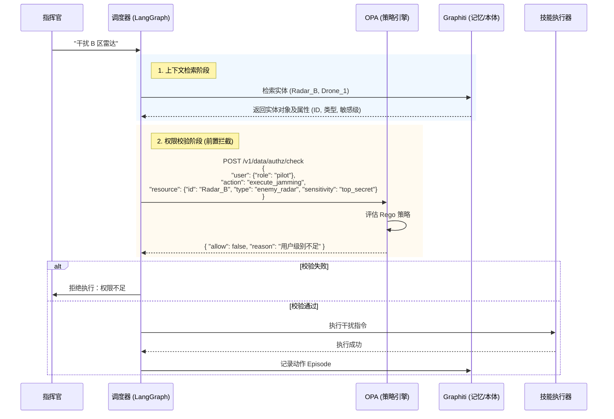
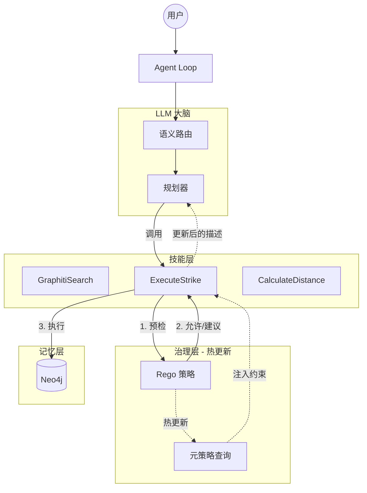

基于你描述的 Palantir AIP 宏大架构，利用 Graphiti 进行构建是一个极具战略眼光的选择。Graphiti 的核心优势在于其**时态性（Temporality）**和**增量更新能力**，这恰好能解决 AIP 架构中“动态战场”和“实时决策”的痛点。

Graphiti 主要承担的是**知识图谱构建与管理层**的核心角色，并作为连接**数据摄取层**与**AI 大模型层**的桥梁。

以下是基于 Graphiti 构建 Palantir AIP 架构的实操指南：

### 🏗️ 核心架构映射：Graphiti 在 AIP 中的位置

在开始编码前，我们需要明确 Graphiti 如何对应你提出的三层图谱架构：

| AIP 架构层级 | Graphiti 对应能力 | 核心价值 |
| :--- | :--- | :--- |
| **本体建模层** | **Pydantic 模型定义** | 定义“实体-关系-属性”的强类型结构，作为图谱的骨架。 |
| **三层图谱构建** | **双时态数据模型** | 利用“发生时间”与“摄入时间”区分事实的历史与当前状态，构建动态语义图谱。 |
| **AI 大模型层** | **混合检索引擎** | 为 LLM 提供基于语义、关键词和图遍历的精准上下文（RAG），减少幻觉。 |

---

### 🚀 分步构建指南

#### 第一步：环境准备与数据摄取对接
Graphiti 依赖 Neo4j 作为存储后端，并支持 Python 环境。

1.  **基础设施**：部署 Neo4j 5.26+ 数据库。
2.  **安装 Graphiti**：
    ```bash
    pip install graphiti-core
    # 如果需要使用特定的LLM提供商（如OpenAI, Gemini等）
    pip install graphiti-core[openai, google-genai]
    ```
3.  **数据流接入**：在数据摄取层，将来自卫星、SIGINT 或 CIA 报告的多模态数据清洗为文本或结构化 JSON，准备输入 Graphiti。

#### 第二步：本体建模与图谱初始化
在 AIP 中，本体是核心。在 Graphiti 中，我们利用 Python 代码定义这些本体。

```python
from graphiti_core import Graphiti
from graphiti_core.nodes import EpisodeType

# 1. 初始化 Graphiti 实例
graphiti = Graphiti(
    "bolt://localhost:7687",  # Neo4j 连接地址
    "neo4j",                   # 用户名
    "password"                 # 密码
)

# 2. 构建索引和约束（定义本体结构）
# 这一步相当于在 AIP 中定义“战场实体”的元数据
await graphiti.build_indices_and_constraints()
```

#### 第三步：构建“三层知识图谱”
这是 Graphiti 最强大的部分。你不需要分别构建三个物理图谱，而是利用 Graphiti 的**双时态模型**在一个图谱中实现三层逻辑。

**1. 语义动态图谱（处理非结构化数据）**
利用 Graphiti 的 `add_episode` 功能，将非结构化情报（如一段文本报告）直接转化为图谱节点。Graphiti 会自动提取实体和关系。

```python
# 模拟一条来自前线的情报文本
intel_report = "根据无人机侦察，敌方装甲部队于 2026-04-07 14:00 移动至 B区坐标。"

# 添加情节（Episode），Graphiti 会自动进行 NLP 处理提取语义
await graphiti.add_episode(
    name="无人机侦察报告_0407",
    episode_body=intel_report,
    source=EpisodeType.text,
    source_description="UAV_Sensor_Stream"
)
```

**2. 高质量多模态图谱（整合结构化数据）**
对于高精度的传感器数据或 CIA 数据库，你可以手动或通过 API 注入结构化三元组，Graphiti 会将其与上述语义节点融合。

**3. 推理图谱（双时态与因果建模）**
Graphiti 的**双时态标记系统**是构建推理层的关键。它记录了两个时间维度：
*   **事件发生时间**：部队实际移动的时间。
*   **数据摄入时间**：系统收到情报的时间。

这使得 AIP 能够回答诸如“在昨天下午 3 点，系统**认为**敌军在哪里”与“敌军**实际**在哪里”的区别，这对于战场态势研判至关重要。

#### 第四步：AI 大模型层与混合检索
当指挥官（用户）向 AIP 提问时，Graphiti 充当高精度的“记忆检索器”。

**场景**：指挥官问“B区现在的威胁等级如何？”

Graphiti 的**混合检索引擎**会同时执行以下操作：
1.  **语义搜索**：查找与“威胁”、“B区”语义相近的节点。
2.  **关键词匹配**：精确匹配坐标代码。
3.  **图遍历**：沿着“属于”、“移动至”、“装备有”等关系边，找到关联的敌方部队实体。

检索到的子图将作为 Context（上下文）发送给 LLM，LLM 据此生成作战建议。

#### 第五步：实时增量更新与行动反馈
AIP 的强大在于实时性。当新的传感器数据（如卫星图像分析结果）到达时：

*   **传统图谱**：需要全量重算，耗时数小时。
*   **Graphiti**：使用**增量数据融合**。

```python
# 新的情报到达，只需添加新的 Episode
new_intel = "截获通讯显示，敌方指挥官已下令停止进攻。"
await graphiti.add_episode(
    name="SIGINT_Update_0408",
    episode_body=new_intel,
    source=EpisodeType.text
)
```
Graphiti 会即时更新图谱状态，标记旧的“进攻”关系为历史状态，并建立新的“停止”关系。AI 代理（Agent）能立即感知这一变化，调整作战方案。

### 💡 总结：Graphiti 如何赋能 Palantir AIP

通过引入 Graphiti，你的 AIP 架构将获得以下质的飞跃：

1.  **告别“黑盒”**：双时态模型让每一次决策都有据可查（例如：审计“为何在 T1 时刻做出了 X 决策”）。
2.  **极速响应**：增量更新机制确保了从“数据摄入”到“决策生成”的延迟降低到秒级，而非传统图谱的批量处理级。
3.  **动态记忆**：它不仅仅是一个数据库，更是 AI 智能体的“海马体”，能够随着战争进程不断演化，记住历史，感知当下。

你可以将 Graphiti 视为 Palantir Foundry 中 Ontology 层的**动态、时态化引擎**，它让静态的本体“活”了起来。

要实现你所描述的 Palantir AIP 那样宏大且精密的架构，**Graphiti 仅仅是其中的“记忆与认知中枢”（即知识图谱层）**。要构建一个完整的、企业级甚至军工级的 AIP 系统，你需要围绕 Graphiti 搭建一整套生态系统。

基于 Palantir 的公开架构和技术原理，除了 Graphiti（作为图谱核心），你还需要以下 **五大类关键技术组件** 来支撑整个系统：

### 1. 数据摄取与基础设施层 (Data Ingestion & Infrastructure)
这是系统的“感官”和“躯干”，负责处理海量、多模态数据的接入和存储。

*   **消息队列与流处理引擎**:
    *   **Apache Kafka / Pulsar**: 用于缓冲来自卫星、无人机、传感器的高并发实时数据流，削峰填谷。
    *   **Apache Flink / Spark Streaming**: 用于实时数据清洗、窗口聚合和预处理。在数据进入 Graphiti 之前，需要在这里进行初步的格式化（如将二进制遥测数据转为 JSON）。
*   **多模态存储**:
    *   **对象存储 (S3 / MinIO)**: 存储原始的非结构化数据（卫星图像、视频录像、PDF 情报报告）。
    *   **向量数据库 (Milvus / Pinecone / Weaviate)**: 虽然 Graphiti 处理图关系，但为了高效处理图像和长文本的语义相似度，通常需要一个专门的向量库来配合，或者使用 Neo4j 的向量索引功能。
*   **基础设施编排**:
    *   **Kubernetes (K8s) + Docker**: Palantir 的 **Apollo** 平台本质上就是一个高度自动化的 K8s 管理层。你需要 K8s 来管理 Graphiti、LLM 服务、数据库等所有微服务的部署、扩缩容和自愈。

### 2. 本体与数据集成层 (Ontology & Integration)
这是系统的“骨架”，对应 Palantir 的 **Foundry** 核心能力。Graphiti 需要依赖这里定义的“类”来实例化“对象”。

*   **ETL/ELT 编排工具**:
    *   **Airflow / Dagster**: 用于编排复杂的数据流水线，确保数据从源头到图谱的依赖关系正确（例如：先有“部队”实体，才能建立“部署”关系）。
    *   **dbt (data build tool)**: 用于在数据仓库中进行数据转换和建模，确保进入图谱的数据质量。
*   **本体建模引擎**:
    *   你需要一个**元数据管理层**（可以是自研的 Python/Java 服务），用于定义 Pydantic 模型或 Schema。它负责告诉 Graphiti：“什么是‘坦克’？它有哪些属性？它和‘士兵’是什么关系？”。

### 3. AI 编排与大模型层 (AI Orchestration & LLMs)
这是系统的“大脑皮层”，负责推理和生成。Graphiti 在这里充当“外部记忆体”。

*   **LLM 编排框架**:
    *   **LangChain / LlamaIndex**: 这是连接 LLM 和 Graphiti 的胶水代码。你需要用它们来构建 **GraphRAG**（图检索增强生成）链路：即“用户提问 -> 框架解析意图 -> 调用 Graphiti 检索子图 -> 将子图转化为 Prompt 上下文 -> 发送给 LLM”。
*   **模型服务网关**:
    *   **vLLM / TGI (Text Generation Inference)**: 如果你部署开源模型（如 Llama 3, Mistral），需要这些高性能推理框架。
    *   **LiteLLM / OpenAI API**: 用于统一管理不同厂商的模型接口，实现“模型无关”的切换。
*   **Agent 框架**:
    *   **LangGraph / AutoGen**: 用于构建多智能体协作（如一个负责情报分析，一个负责方案生成，一个负责红队对抗）。Graphiti 提供的知识图谱是这些 Agent 共享的“黑板”。

### 4. 决策支持与可视化层 (Decision Support & Visualization)
这是系统的“面孔”，让指挥官能看懂图谱和 AI 的决策。

*   **图可视化引擎**:
    *   **KeyLines / ReGraph (Cambridge Intelligence)**: 或者是开源的 **Cytoscape.js / G6**。这些库专门用于在 Web 前端渲染复杂的关联网络，支持缩放、展开、路径高亮，是展示“战场态势图”的必备工具。
*   **前端应用框架**:
    *   **React / Next.js**: 构建交互式仪表盘。
    *   **CesiumJS / Deck.gl**: 如果涉及地理空间情报（卫星、无人机），必须使用这些 3D 地球引擎，将 Graphiti 中的“位置”实体映射到三维地球上。

### 5. 安全与治理层 (Security & Governance)
这是系统的“免疫系统”，对应 Palantir 的细粒度权限控制。

*   **身份与访问管理 (IAM)**:
    *   **Keycloak / OPA (Open Policy Agent)**: Palantir 的核心优势是“基于属性的访问控制”。你需要 OPA 来确保：只有拥有“绝密”权限的指挥官，才能在 Graphiti 中查询到标记为“绝密”的节点。
*   **审计与血缘**:
    *   **OpenLineage**: 追踪数据的来源。当 AI 给出一个建议时，系统必须能回溯到是哪条原始情报（通过 Graphiti 的边）支撑了这个结论。

### 🛠️ 推荐的技术栈组合 (构建你的 "AIP")

如果你想动手搭建一个简化版的 AIP，可以参考以下技术组合：

| 层级 | 推荐技术组件 | 作用 |
| :--- | :--- | :--- |
| **基础设施** | **Kubernetes, Docker, Terraform** | 自动化部署与资源管理 (类似 Apollo) |
| **数据流** | **Kafka, Flink** | 实时数据管道 |
| **核心图谱** | **Neo4j (Aura/Cluster) + Graphiti** | **知识存储与动态记忆 (核心)** |
| **数据建模** | **Python (Pydantic), Airflow** | 定义本体与数据清洗 (类似 Foundry) |
| **AI 核心** | **LangChain, vLLM, Llama 3** | 逻辑推理与生成 |
| **前端可视化** | **React + ReGraph + CesiumJS** | 3D 态势感知与图谱交互 |
| **安全** | **OPA (Open Policy Agent)** | 细粒度权限控制 |

**总结：**
Graphiti 解决了“如何动态地存储和检索知识”的问题，但要实现 Palantir AIP 的完整能力，你还需要 **Kafka** 解决数据流速问题，**K8s** 解决部署问题，**LangChain** 解决大模型调用问题，以及 **React/Cesium** 解决人机交互问题。这些组件共同构成了一个闭环的智能决策系统。

要理解这些组件如何协同工作，我们可以把整个系统想象成一个**现代化的“作战指挥中心”**。在这个中心里，数据是情报，Graphiti 是参谋的记忆与思维网络，而 LLM 则是负责最终决策的指挥官。

它们之间的协同工作是一个严密的**流水线过程**，我们可以将其分为四个关键阶段：

### 📡 第一阶段：感知与传输（数据摄取层）
**主角：传感器 → Kafka → Flink**

1.  **情报涌入**：
    战场上的无人机传回视频流，卫星发送图像，前线士兵发送文本报告。这些海量、杂乱的数据首先涌入 **Kafka**。Kafka 就像一个巨大的“缓冲水池”，防止瞬间爆发的数据冲垮后端系统。
2.  **初步清洗**：
    **Flink** 实时从 Kafka 中读取数据。它负责“去粗取精”：
    *   剔除无效噪点。
    *   将视频抽帧、将二进制数据转为 JSON 格式。
    *   打上时间戳和来源标签。
    *   *此时，数据还是“死”的，只是整齐排列的文本或数字。*

### 🧠 第二阶段：认知与记忆（图谱构建层）
**主角：Flink → Graphiti (配合 Neo4j) + 本体模型**

这是 Graphiti 大显身手的时刻，它将“死数据”变成了“活知识”。

1.  **本体映射**：
    清洗后的数据进入 **Graphiti**。Graphiti 首先查阅**本体模型**（比如定义好的“坦克”、“基地”、“敌对关系”）。
2.  **动态抽取与融合**：
    *   Graphiti 利用内置的 NLP 能力，从文本中提取实体（“T-90坦克”）和关系（“位于”）。
    *   **关键动作**：它利用**双时态模型**，将这条信息写入 **Neo4j** 数据库。它不仅记录了“坦克在A点”，还记录了“我是**什么时候**收到的这条消息”。
3.  **实时更新**：
    如果下一秒收到新情报说“坦克已移动”，Graphiti 不会覆盖旧数据，而是建立一个新的状态节点，并链接到旧节点。这样，图谱就“活”了起来，记录了战场的演变历史。

### 🗣️ 第三阶段：思考与推理（AI 决策层）
**主角：用户提问 → LangChain → Graphiti 检索 → LLM**

当指挥官（用户）在屏幕上问：“**B区目前的防空威胁是什么？**”时，协同工作流如下：

1.  **意图识别**：
    **LangChain** 接收到问题，它意识到这不能光靠 LLM 瞎编，需要查资料。它将问题转化为图查询语言（Cypher）或向量搜索指令。
2.  **记忆检索（RAG）**：
    LangChain 呼叫 **Graphiti**。Graphiti 在 Neo4j 中迅速遍历：
    *   找到“B区”节点。
    *   沿着“部署在”关系找到“防空导弹连”。
    *   沿着“型号为”找到“S-400”。
    *   沿着“射程”属性获取“400公里”。
    *   *Graphiti 返回的是一张结构化的“子图”数据，而非杂乱的文本。*
3.  **逻辑生成**：
    LangChain 将“用户问题” + “Graphiti 检索到的精准情报”打包成 Prompt，发送给 **LLM**。
    LLM 基于这些事实，生成一段通顺的回答：“B区存在S-400防空系统，覆盖半径400公里，建议避开或优先电子压制。”

### 👁️ 第四阶段：呈现与行动（交互与反馈层）
**主角：React/Cesium → 指挥官 → 行动指令**

1.  **可视化渲染**：
    前端的 **CesiumJS**（3D地球）接收到 LLM 的结论和 Graphiti 的坐标数据。它在 3D 地图上直接画出一个红色的圆圈覆盖 B 区，并弹出警示框。
2.  **闭环反馈**：
    指挥官点击“确认收到”或下达“电子干扰”指令。
    这个指令再次通过 **Kafka** 进入系统，变成一条新的“行动数据”。Graphiti 再次捕获这条数据，在图谱中建立“我军”与“B区”之间的“干扰中”关系。
    *系统完成了一个完美的闭环。*

### 📌 总结：协同工作全景图

| 步骤 | 动作 | 核心组件协同 | 比喻 |
| :--- | :--- | :--- | :--- |
| **1** | **听见** | **Kafka + Flink** | 就像**耳朵和神经**，把外界的声音（数据）快速传导进大脑。 |
| **2** | **记住** | **Graphiti + Neo4j** | 就像**海马体**，把听到的话转化为长期的、有逻辑关联的记忆（知识图谱）。 |
| **3** | **思考** | **LangChain + LLM** | 就像**大脑皮层**，根据记忆（Graphiti提供）进行逻辑推理和语言组织。 |
| **4** | **看见** | **React + Cesium** | 就像**眼睛**，把大脑的思考结果画成图像展示给指挥官。 |

**Graphiti 在其中的核心作用**是**“结构化”**。没有它，LLM 只能面对一堆杂乱的文本（RAG），容易产生幻觉；有了 Graphiti，LLM 面对的是清晰的实体关系网，决策就有了坚实的逻辑支撑。

这是一个非常深入且切中要害的问题。

在 Palantir AIP 的架构中，**本体（Ontology）**不仅仅是实体（节点）和关系（边），它还包含了**属性约束（如数据类型、必填项）**、**业务规则（如“只有指挥官能批准打击”）**以及**动作/行为（如“发射导弹”会改变状态）**。

Graphiti 的核心定位是**动态知识图谱的存储与检索引擎**，它并不像传统的规则引擎（如 Drools）或本体推理机（如 Pellet）那样直接内置复杂的逻辑运算。

**Graphiti 处理规则、约束和动作的核心逻辑是：**
**“图结构即规则，时间即逻辑，外部代码即动作。”**

以下是具体的实现方式：

### 🛡️ 1. 描述规则与约束 (Rules & Constraints)

Graphiti 不依赖外部的逻辑语言来定义规则，而是通过**代码定义（Python/Pydantic）**和**图结构特性**来实现约束。

#### A. 结构约束：通过 Pydantic 模型定义
Graphiti 允许你使用 Python 的 `Pydantic` 库来定义实体和关系。这实际上就是一种强类型的约束机制。
*   **怎么做**：你在代码中定义 `class Soldier(BaseNode)`，规定必须有 `rank`（军衔）字段，且类型为字符串。
*   **效果**：当数据进入 Graphiti 时，如果缺少 `rank` 或者类型不对，Pydantic 会在写入前直接报错。这实现了**“模式约束”**。

#### B. 状态约束：通过“双时态”与“失效”机制
这是 Graphiti 最独特的地方。它不通过逻辑判断“现在是否有效”，而是通过**时间戳**来物理隔离状态。
*   **场景**：规则是“一个士兵同一时间只能属于一个班组”。
*   **Graphiti 处理**：当你把一个士兵加入新班组时，Graphiti 不会去“检查”旧关系，而是直接**将旧关系的 `invalid_at`（失效时间）设置为当前时间**，并创建一条新的关系。
*   **结果**：查询时，系统会自动过滤掉过期的关系。这种**“时间边缘失效”**机制，天然地解决了状态冲突，无需编写复杂的 `IF-ELSE` 逻辑。

#### C. 语义约束：通过混合检索的“过滤”
如果你需要复杂的业务规则（如“查找所有距离目标 < 50km 且 弹药 > 50% 的坦克”），Graphiti 不直接在图里跑计算，而是依赖**混合检索**。
*   **怎么做**：Graphiti 将语义搜索（向量）与**元数据过滤**（Metadata Filtering）结合。你在 Neo4j 中存储属性，检索时通过代码传递过滤条件。

### ⚡ 2. 描述动作 (Actions)

Graphiti 本身是一个**数据库/记忆层**，它不执行动作（它不会真的去控制无人机飞）。它通过**“事件建模”**和**“外部触发”**来处理动作。

#### A. 动作即“事件片段”
在 Graphiti 中，动作被建模为**Episode（片段）**或**特定关系的边**。
*   **建模方式**：
    *   **实体**：无人机 A，目标 B。
    *   **动作**：不是调用函数，而是创建一条边 `A -[EXECUTED_MISSION]-> B`。
    *   **属性**：这条边上带有时间戳、状态（“进行中”、“已完成”）。
*   **效果**：动作发生后，图谱的状态发生了改变。AI 通过观察图谱中边的变化，就能“看”到动作的结果。

#### B. 触发动作：通过 LLM + 工具调用
Graphiti 是 LLM 的“眼睛”，LLM 是动作的“手”。
1.  **感知**：Graphiti 告诉 LLM：“目标 B 处于威胁范围内”。
2.  **决策**：LLM 决定执行“打击”动作。
3.  **执行**：LLM 调用外部 API（如 `fire_missile(target=B)`）。
4.  **反馈（闭环）**：外部系统执行成功后，生成一条新的日志文本（“导弹已发射”），再次喂给 Graphiti。Graphiti 更新图谱，标记目标状态为“已摧毁”。

### 🛠️ 3. 在 Palantir AIP 架构中的落地建议

如果你要在 AIP 架构中实现完整的“规则+动作”体系，建议采用以下**分层架构**：

| 功能需求 | 推荐技术组件 | 与 Graphiti 的协同方式 |
| :--- | :--- | :--- |
| **静态约束**(数据类型、必填项) | **Pydantic (Python)** | 在 Graphiti 的 `BaseNode` 和 `BaseEdge` 定义中直接编写。这是第一道防线。 |
| **动态规则**(复杂业务逻辑、审批流) | **规则引擎 (如 Cesium, Drools)** 或 **Python 服务** | **Graphiti 提供上下文**。规则引擎从 Graphiti 读取当前战场状态（如“弹药量”），判断规则是否满足，然后返回 True/False。 |
| **动作执行**(开火、移动、发送指令) | **LangChain Tools / Function Calling** | **Graphiti 记录结果**。动作由外部代码执行，执行后的**状态变更**通过 `add_episode` 写回 Graphiti，形成记忆闭环。 |
| **推理规则**(若A攻击B，则A与B敌对) | **图算法 / LLM** | 利用 Graphiti 的**图遍历**能力。例如查询“所有与A有攻击关系的节点”，或者让 LLM 根据图谱子图推导出隐含的敌对关系。 |

### 📌 总结

**Graphiti 不直接“运行”规则，它“记录”规则运行的结果。**

*   **对于约束**：它利用 **Pydantic** 做结构校验，利用 **双时态模型** 做状态一致性校验（避免数据打架）。
*   **对于动作**：它将动作视为**历史事件（Episodes）**。动作的执行交给外部系统（如 LangChain 工具），执行完后，Graphiti 负责把这个动作产生的新状态“刻”在图谱上，供下一次决策使用。

这种设计使得 Graphiti 非常轻量且快速，因为它不需要维护一个复杂的逻辑推理机，而是专注于**“真实地记录世界随时间的变化”**。

这是一个非常棒的实战场景。在 Graphiti 中，我们不会像传统编程那样写一个 `fire_missile()` 函数来执行动作，而是采用**“动作即事件”**的建模思维。

我们将“发射导弹”这个动作，转化为图谱中**实体关系的演变**和**新实体的生成**。

以下是基于 Graphiti 的**双时态模型**对“发射导弹”动作的完整建模过程：

### 🎬 核心概念：动作是“状态的变迁”

在 Graphiti 中，动作不是“发生”在真空里的，它是由一系列**Episode（情节/片段）**驱动的。

**场景设定：**
*   **实体 A**：战斗机 `F-22_01`
*   **实体 B**：导弹 `AIM-120_88`（初始状态：挂载在飞机上）
*   **实体 C**：目标 `Enemy_Radar_01`

---

### 📽️ 第一步：初始状态（挂载）
在动作发生前，图谱记录了导弹和飞机的关系。Graphiti 会自动处理时间戳，默认 `invalid_at` 为无穷大（代表永久有效，直到被更改）。

**图谱状态：**
*   `F-22_01` —[`CARRIES` {valid_at: T1, invalid_at: ∞}]→ `AIM-120_88`
*   `AIM-120_88` (属性: 状态="就绪")

---

### 🚀 第二步：触发动作（发射）
当 LLM 决定“发射导弹”时，或者传感器检测到“导弹离轨”信号时，我们向 Graphiti 推送一个新的 **Episode（情节）**。

**代码逻辑（伪代码）：**
```python
# 这是一个描述“发射事件”的文本或结构化数据
launch_event = "F-22_01 在 10:00:00 发射了 AIM-120_88 攻击 Enemy_Radar_01"

await graphiti.add_episode(
    name="Missile_Launch_Event_001",
    episode_body=launch_event,
    source=EpisodeType.text, # 或者 struct
    time_stamp="2026-04-08 10:00:00"
)
```

---

### 🧠 第三步：Graphiti 的自动建模（状态变迁）
Graphiti 接收到这个 Episode 后，会在后台自动执行以下**三个原子操作**，从而完成“动作”的建模：

#### 1. 终结旧关系（时间边缘失效）
Graphiti 发现 `AIM-120_88` 不再属于 `F-22_01`。它不会删除旧关系，而是将旧关系的 `invalid_at` 时间戳更新为当前动作时间（T2）。
*   **旧关系**：`F-22_01` —[`CARRIES` {valid_at: T1, **invalid_at: T2**}]→ `AIM-120_88`
    *   *解读：在 T2 时刻之前，飞机携带导弹；T2 时刻之后，关系失效。*

#### 2. 建立新关系（动作结果）
Graphiti 根据语义提取，建立新的动态关系。
*   **新关系**：`F-22_01` —[`ENGAGED_TARGET` {valid_at: T2, invalid_at: ∞}]→ `Enemy_Radar_01`
    *   *解读：飞机在 T2 时刻开始攻击目标。*
*   **武器状态**：`AIM-120_88` —[`TRACKING` {valid_at: T2, invalid_at: ∞}]→ `Enemy_Radar_01`

#### 3. 生成“动作实体”（可选的高级建模）
为了记录动作的详细参数（如发射角度、速度），Graphiti 甚至可以动态创建一个代表“动作”本身的节点（事件节点）。
*   **新节点**：`(Launch_Event_123 {type: "Missile_Launch", time: T2})`
*   **关系**：
    *   `F-22_01` —[`INITIATED`]→ `Launch_Event_123`
    *   `Launch_Event_123` —[`USED_WEAPON`]→ `AIM-120_88`

---

### 🔍 第四步：查询与决策（AI 如何“看”到这个动作）

当指挥官问 AI：“**F-22_01 现在还有 AIM-120_88 导弹吗？**”

1.  **AI/LLM** 将问题转化为图查询。
2.  **Graphiti** 执行查询，自动加上时间过滤器：`WHERE relationship.invalid_at == infinity` (或当前时间)。
3.  **结果**：
    *   查询 `CARRIES` 关系：发现旧关系的 `invalid_at` 是 T2（过去），**被过滤掉**。
    *   查询结果：**无**。
4.  **AI 回答**：“F-22_01 已经发射了该导弹，当前不再携带。”

### 📌 总结：Graphiti 处理“动作”的精髓

| 传统编程方式 | Graphiti 图谱方式 | 优势 |
| :--- | :--- | :--- |
| **执行函数**：`missile.fire()` | **添加情节**：`add_episode("发射事件")` | **可回溯**：动作变成了历史数据，可以随时复盘。 |
| **更新字段**：`status = "fired"` | **失效关系**：`invalid_at = now` | **无冲突**：不需要写锁，利用时间戳天然解决并发冲突。 |
| **日志记录**：`print("Fired")` | **结构存储**：生成新节点/边 | **可推理**：动作本身变成了图的一部分，AI 可以沿着关系推理（如：发射 -> 燃料消耗 -> 航程变短）。 |

通过这种方式，Graphiti 将**“发射导弹”**这个瞬间动作，转化为了**“携带关系结束”**和**“攻击关系开始”**的永恒记录。

这是一个非常关键的架构升级问题。将 Graphiti 的动作逻辑（如“发射导弹”、“更新库存”）封装为 **Skill（技能）**，意味着我们将“怎么干”的指令固化了下来。

但是，仅有 Skill 是不够的。Skill 只是“工具箱里的扳手”，你还需要一个“机械师”来决定**什么时候用哪个扳手**，以及**按什么顺序用**。

在 Palantir AIP 的架构语境下，要调度这些基于 Graphiti 的 Skills，你还需要引入以下 **四大核心机制**：

### 🚦 1. 意图识别与路由机制 (The Dispatcher)
**解决问题：** 用户说“把那个目标干掉”，系统怎么知道该调用 `Fire_Missile_Skill` 还是 `Call_Airstrike_Skill`？

你需要一个**智能路由层**，通常由以下两部分组成：

*   **语义路由 (Semantic Router)：**
    *   利用向量数据库（如 Milvus 或 Neo4j 的向量索引）。
    *   **原理：** 将用户的自然语言指令（“发射导弹”）转化为向量，去匹配 Skill 的描述向量（`Skill: Fire_Missile` 的元数据）。
    *   **作用：** 快速、低成本地初步筛选出候选 Skill。
*   **LLM 分发器 (LLM Dispatcher)：**
    *   这是一个专门的“调度 Agent”。它不干活，只负责看单。
    *   **原理：** 接收用户意图 + 候选 Skill 列表。LLM 输出结构化的 JSON，例如 `{"skill_id": "fire_missile", "confidence": 0.98}`。
    *   **作用：** 处理模糊指令（例如：“让那架飞机闭嘴”，LLM 能推理出这可能意味着“电子干扰”或“击落”）。

### 🧩 2. 参数提取与本体映射机制 (The Mapper)
**解决问题：** Skill 需要具体的参数（如 `target_id`, `missile_type`），但用户只说了“打那个红色的雷达”。

你需要一个**上下文填充机制**，这通常依赖于 **本体 (Ontology)**：

*   **实体链接 (Entity Linking)：**
    *   调度器需要先从 Graphiti 中检索实体。
    *   **流程：** 用户说“红色雷达” → 调度器在 Graphiti 中查询 `MATCH (n:Radar) WHERE n.color='red' RETURN n` → 拿到 `Radar_01` 的 ID。
*   **参数注入 (Parameter Injection)：**
    *   将检索到的实体 ID 自动填入 Skill 的输入槽位。
    *   **机制：** 类似于 Pydantic 的校验。如果 Skill 需要 `target_coords`，但用户没给，调度器需要触发“反问机制”（Ask User）或者尝试从 Graphiti 的上下文中推断。

### 📜 3. 编排与工作流引擎 (The Orchestrator)
**解决问题：** 复杂任务往往不是单一动作。例如“发射导弹”前需要“解锁武器”，后需要“评估毁伤”。

你需要一个**编排层**，决定 Skill 的执行顺序：

*   **线性编排 (SOP)：**
    *   对于标准作业程序（如：起飞 -> 巡航 -> 攻击），使用硬编码的 Workflow 引擎（如 **LangGraph** 或 **Airflow**）。
    *   **逻辑：** Step 1 调用 `Takeoff_Skill` -> 成功 -> Step 2 调用 `Attack_Skill`。
*   **动态规划 (Planner)：**
    *   对于突发情况（如：导弹卡弹了怎么办？），需要 LLM 进行实时规划。
    *   **逻辑：** LLM 看到 `Attack_Skill` 失败，动态决定调用 `Self_Diagnose_Skill`。

### 🛡️ 4. 权限与合规性检查机制 (The Governor)
**解决问题：** 这是 Palantir AIP 最核心的护城河。并不是所有 Skill 都能被随意调用。如果 AI 决定“发射核弹”，必须被拦截。

你需要一个**中间件层**（类似 **OPA - Open Policy Agent**）：

*   **前置拦截 (Pre-flight Check)：**
    *   在调度器决定调用 Skill 后，执行前，先问 OPA：“用户 A 有权限调用 `Fire_Missile_Skill` 攻击 `Target_B` 吗？”
    *   **依据：** 基于 Graphiti 中的本体属性（如：目标是否为平民区、用户军衔是否足够）。
*   **动作审计 (Audit Trail)：**
    *   一旦 Skill 执行，必须将“谁、何时、为何调用此 Skill”写入 Graphiti 的审计日志节点。

---

### 🏗️ 架构全景图：从 Skill 到 AIP

加上这些机制后，你的系统架构就变成了这样：

| 层级 | 组件 | 职责 | 对应 Palantir AIP 概念 |
| :--- | :--- | :--- | :--- |
| **1. 交互层** | **用户 / 指挥官** | 输入自然语言指令 | - |
| **2. 调度层** | **LLM Dispatcher + 语义路由** | **识别意图**，选择正确的 Skill | **Logic (逻辑层)** |
| **3. 治理层** | **OPA (策略引擎)** | **权限校验**，确保动作合规 | **Ontology Security** |
| **4. 上下文层** | **Graphiti (检索器)** | **提取参数**（如目标 ID、坐标） | **Ontology Objects** |
| **5. 执行层** | **Skill Executor** | 运行具体的 Python/JS 代码 | **Actions / Writes** |
| **6. 记忆层** | **Graphiti (写入器)** | **记录结果**，更新图谱状态 | **Digital Twin** |

### 📌 总结

如果你把 Graphiti 的动作逻辑封装成了 Skill，你实际上只是造好了“发动机”。

要让它跑起来，你还需要：
1.  **方向盘**（路由/意图识别）：决定去哪。
2.  **仪表盘**（本体映射）：确认油量和坐标。
3.  **刹车系统**（权限治理）：防止撞墙（违规操作）。
4.  **传动系统**（工作流编排）：协调各个部件配合。

在工程落地时，**LangGraph** 是一个非常流行的选择，它既能做路由，又能做编排，还能很好地与 Graphiti 结合。

设计调度器（Dispatcher/Orchestrator）与 Graphiti 的交互流程，核心在于理解两者在架构中的不同定位：

Graphiti 是“海马体”（记忆与状态）：负责存储事实、关系、时间线，以及通过“动作节点”记录已发生的事件。
调度器 是“前额叶皮层”（决策与控制）：负责理解意图、规划路径、调用技能（Skills），并决定何时读取或更新记忆。

基于 Graphiti 的双时态模型和Episode（情节）机制，我为你设计了一套标准的“感知-决策-行动-记录”闭环交互流程。

🔄 核心交互流程图解

这个流程展示了当用户发出指令（如“攻击目标A”）时，调度器如何与 Graphiti 协作。

graph TD
    User((指挥官)) -->|1. 自然语言指令 | Dispatcher[调度器]
    
    subgraph Graphiti_Layer [Graphiti 记忆层]
        G_Read
        G_Write
        Ontology[本体/Schema]
    end
    
    subgraph Dispatcher_Logic [调度器逻辑]
        Intent[意图识别 & 路由]
        Context[上下文组装]
        Policy[权限/策略检查]
        Planner[任务规划]
    end
    
    subgraph Skill_Layer [技能执行层]
        Skill_Executor[Skill 执行器]
        External_API[外部系统/武器平台]
    end

    %% 流程连线
    Dispatcher -->|2. 检索实体/状态 | G_Read
    G_Read -.->|3. 返回子图/历史 | Dispatcher
    
    Dispatcher -->|4. 填充参数 & 规划 | Planner
    Planner -->|5. 预检查 | Policy
    
    Policy -->|6. 授权通过 | Skill_Executor
    Skill_Executor -->|7. 执行动作 | External_API
    
    External_API -->|8. 返回结果 | Skill_Executor
    Skill_Executor -->|9. 记录动作事件 | G_Write
    G_Write -.->|10. 更新图谱状态 | Graphiti_Layer

📝 详细交互步骤拆解

第一阶段：感知与检索 (Read Phase)
目标： 调度器从 Graphiti 获取决策所需的上下文。

用户指令输入：
    用户：“对 B 区域的敌方雷达实施干扰。”
意图识别与实体链接：
    调度器识别意图为 Jamming（干扰）。
    调度器调用 Graphiti 的 混合检索接口。
    Graphiti 交互：
        语义搜索：“B 区域”、“敌方雷达”。
        时间过滤：只查找 invalid_at 为无穷大（即当前有效）的实体。
获取上下文：
    Graphiti 返回相关子图：Radar_X (位置: B区, 状态: 活跃), Jammer_Pod_Y (挂载于: Drone_01, 状态: 就绪)。

第二阶段：规划与决策 (Plan Phase)
目标： 调度器基于检索到的信息，组装技能参数，并进行逻辑判断。

参数填充：
    调度器将 Graphiti 返回的实体 ID 映射到技能参数：target_id = "Radar_X", equipment_id = "Jammer_Pod_Y".
策略检查 (可选但推荐)：
    调度器询问 Graphiti：“Drone_01 是否有权限攻击 Radar_X？”（查询图谱中的权限关系或属性）。
生成执行计划：
    调度器决定调用 Execute_Jamming_Skill。

第三阶段：行动与记录 (Write Phase)
目标： 执行动作，并将“动作本身”作为新事实写入 Graphiti。这是最关键的一步。

技能执行：
    调度器调用底层 API 发送干扰指令。
构建“动作情节” (Action Episode)：
    无论成功与否，调度器必须向 Graphiti 写入一条记录。
    关键设计：不要只更新属性（如 status=used），要添加一个新的 Episode。
    数据结构示例：
                {
          "name": "Jamming_Action_20260409_1000",
          "episode_body": "Drone_01 对 Radar_X 实施了电子干扰，结果：成功。",
          "source": "SYSTEM_LOG",
          "time_stamp": "2026-04-09T10:00:00Z"
        }
        
Graphiti 的自动处理：
    Graphiti 接收 Episode，自动抽取实体 Drone_01 和 Radar_X。
    Graphiti 建立新关系：Drone_01 —[JAMMED {time: T}]→ Radar_X。
    Graphiti 自动将 Jammer_Pod_Y 的状态关系更新（旧关系失效，新关系标记为“使用中”）。

🛠️ 调度器与 Graphiti 的接口设计建议

为了实现上述流程，调度器需要封装以下三个核心接口来操作 Graphiti：

resolve_context(query, filters)
功能：封装 Graphiti 的混合检索。
输入：自然语言描述 + 时间约束（如“当前状态”）。
输出：标准化的实体列表（包含 Graphiti 的内部 ID）。

record_action(action_type, participants, outcome)
功能：将技能执行结果转化为 Graphiti 的 Episode。
逻辑：
    调度器不直接操作图数据库的边。
    调度器只负责“讲故事”（发送文本或结构化日志）。
    Graphiti 负责“记笔记”（解析故事并更新图结构）。
优势：解耦。技能逻辑变更时，不需要修改图数据库的 Schema。

check_state_consistency(entity_id, expected_state)
功能：在执行前进行“防呆设计”。
场景：防止重复攻击。
逻辑：查询 Graphiti 中该实体最近的一条 invalid_at = infinity 的状态边。如果已经是“已摧毁”，则拦截技能调用。

💡 关键设计模式：动作即事件

在调度器设计中，请务必遵守 “动作即事件” 的原则。

错误做法：调度器直接调用 Graphiti 的底层驱动，执行 MATCH (n) WHERE id(n)=1 SET n.status = 'fired'。
   后果：丢失了“谁在什么时候干的”这一历史信息，图谱变成了简单的状态机，失去了 AIP 的溯源能力。
正确做法：调度器调用 graphiti.add_episode(...)。
   后果：Graphiti 自动处理状态的更迭（旧状态失效，新状态生效），并保留了完整的时间线。

通过这种设计，调度器不仅是在“使用”工具，而是在不断地“编写”战场的历史书，而 Graphiti 就是这本历史书的智能编辑器。

在 Palantir AIP 的架构中，**OPA (Open Policy Agent)** 扮演着“免疫系统”或“宪兵”的角色。它位于 **调度器（Dispatcher）** 和 **技能执行器（Skill Executor）** 之间，负责在动作真正发生前进行**前置拦截**和**细粒度权限校验**。

结合 Graphiti 的特性，我们可以设计一套基于**“对象感知（Object-Aware）”**的权限校验机制。以下是具体的实现方案：

### 🏗️ 架构位置与交互流程

OPA 不应该硬编码在业务代码里，而应该作为一个独立的策略引擎服务存在。

**交互时序图：**



### 🛠️ 核心实现步骤

#### 第一步：定义策略输入 (Input Data)
调度器在调用 OPA 之前，必须从 Graphiti 中获取足够的信息来构建输入上下文。OPA 需要知道三要素：**谁（Subject）**、**做什么（Action）**、**对谁做（Resource）**。

*   **Subject（主体）**：当前操作的用户或 Agent 的身份（从会话 Token 中获取）。
*   **Action（动作）**：意图调用的 Skill 名称（如 `execute_jamming`）。
*   **Resource（资源）**：**这是关键**。调度器需要从 Graphiti 中读取目标实体的**属性**（如 `classification: "SECRET"`, `owner: "ALLIED_FORCES"`）。

#### 第二步：编写 Rego 策略 (Policy Definition)
Rego 是 OPA 的声明式语言。针对 AIP 场景，我们需要编写基于属性的访问控制（ABAC）策略。

**策略示例 (`policy.rego`)：**

```rego
package aip.authz

# 默认拒绝所有请求 (白名单机制)
default allow = false

# 规则 1: 只有指挥官可以下令攻击
allow {
    input.action == "execute_strike"
    input.user.role == "commander"
}

# 规则 2: 飞行员可以干扰敌方雷达，但不能干扰友军
allow {
    input.action == "execute_jamming"
    input.user.role == "pilot"
    input.resource.type == "enemy_radar"
}

# 规则 3: 敏感数据访问控制 (基于 Graphiti 属性)
# 如果目标被标记为 "TOP_SECRET"，只有安全许可等级 >= 5 的人能操作
allow {
    input.resource.sensitivity == "top_secret"
    input.user.security_clearance >= 5
}

# 提供拒绝的具体原因 (用于反馈给用户)
reason = msg {
    not allow
    msg = sprintf("用户 %v 无权对 %v 执行 %v", [input.user.id, input.resource.id, input.action])
}
```

#### 第三步：调度器集成 (Enforcement)
在调度器（如 LangGraph）的节点中，插入一个 `permission_check` 节点。

**Python 代码示例：**

```python
import requests

def check_permission(user, action, resource_attributes):
    """
    调用 OPA 进行校验
    resource_attributes: 从 Graphiti 获取的节点属性字典
    """
    opa_input = {
        "input": {
            "user": user,
            "action": action,
            "resource": resource_attributes
        }
    }
    
    # 调用本地 OPA 服务
    response = requests.post(
        "http://localhost:8181/v1/data/aip/authz", 
        json=opa_input
    )
    
    result = response.json()
    
    # OPA 返回 allow: true/false
    if result.get("result", {}).get("allow", False):
        return True, "允许执行"
    else:
        # 获取拒绝原因
        reason = result.get("result", {}).get("reason", "权限不足")
        return False, reason

# 在调度器逻辑中使用
def dispatcher_node(state):
    # 1. 从 Graphiti 获取目标属性 (模拟)
    target_entity = graphiti.get_node(state['target_id']) 
    # target_entity = {"id": "radar_01", "type": "enemy_radar", "sensitivity": "public"}
    
    # 2. 请求 OPA 校验
    allowed, msg = check_permission(state['user'], state['intent_skill'], target_entity)
    
    if not allowed:
        return {"status": "blocked", "message": msg} # 前置拦截生效
    
    # 3. 如果通过，继续执行技能
    return execute_skill(state)
```

### 💡 结合 Graphiti 的高级特性

#### 1. 基于图遍历的动态权限
有时候权限不仅仅看属性，还要看关系。
*   **场景**：只有“所属部队”的指挥官才能调动该无人机。
*   **实现**：调度器在调用 OPA 前，先利用 Graphiti 进行图遍历查询：
    *   查询：`MATCH (u:User)-[:BELONGS_TO]->(d:Division)<-[:BELONGS_TO]-(t:Drone)`
    *   如果查询结果为空，说明用户和目标不在同一部队。
    *   调度器将这个关系判断结果（`is_same_division: false`）作为属性传给 OPA，OPA 据此拒绝访问。

#### 2. 动作审计 (Audit Trail)
OPA 不仅用于拦截，还用于记录。
*   当 OPA 返回 `allow: false` 时，调度器应立即向 Graphiti 写入一个 `Denied_Action_Attempt` 的 Episode。
*   **价值**：这构成了安全审计链。指挥官事后可以问：“为什么昨天那个任务没执行？” Graphiti 会回答：“因为 Agent 试图调用技能，但被 OPA 策略 X 拦截了。”

### 📌 总结

使用 OPA 实现前置拦截的核心在于：
1.  **Graphiti 提供“事实”**（资源属性、关系）。
2.  **OPA 提供“法律”**（Rego 策略）。
3.  **调度器充当“警察”**（执行检查）。

这种设计将**业务逻辑**（技能怎么执行）与**安全策略**（谁能执行）彻底解耦，符合企业级 AIP 架构的安全标准。

这是一个非常深刻的问题，触及了 AIP 架构中“静态规则”与“动态数据”结合的核心。

**OPA 本身是无状态的**，它不知道 Graphiti 里存了什么；而 **Graphiti 是数据层**，它不负责执行逻辑。要让 OPA 的策略（Policy）与 Graphiti 的本体属性（Ontology Properties）联动，关键在于**“上下文注入”**。

简单来说，**Graphiti 负责提供“证据”，OPA 负责根据“法律”进行裁决。**

以下是实现这种联动的三种核心模式，按复杂度从低到高排列：

### 🔑 模式一：属性透传模式 (Attribute Projection)
**适用场景**：基于资源属性的简单访问控制（如：密级、所属部门、状态）。

这是最直接的联动方式。调度器作为“搬运工”，将 Graphiti 中实体的关键属性提取出来，作为输入传给 OPA。

1.  **Graphiti 本体定义**：
    假设我们在 Graphiti 中定义了一个 `Target` 实体，包含属性 `classification`（密级）和 `owner_team`（所属团队）。
2.  **调度器动作**：
    当用户请求操作时，调度器先从 Graphiti 读取该实体的属性。
    ```python
    # 1. 从 Graphiti 获取本体属性
    target_node = await graphiti.get_node("Target_123")
    # 拿到属性: {"classification": "SECRET", "owner_team": "Alpha"}
    
    # 2. 将属性“透传”给 OPA
    opa_input = {
        "user": {"id": "user_01", "team": "Beta"},
        "action": "fire_missile",
        "resource": target_node.properties  # 直接注入 Graphiti 的属性
    }
    ```
3.  **OPA 策略 (Rego)**：
    OPA 直接读取这些属性进行判断。
    ```rego
    # 规则：只有拥有者团队才能攻击
    allow {
        input.resource.owner_team == input.user.team
    }
    ```

### 🔗 模式二：关系注入模式 (Relationship Injection)
**适用场景**：基于图结构的权限（如：只有“上级单位”才能指挥“下级单位”，或者“友军”不可攻击）。

Graphiti 的核心是关系。OPA 无法直接遍历图，因此需要调度器将**图遍历的结果**转化为 OPA 能理解的布尔值或列表。

1.  **Graphiti 本体定义**：
    实体 `Drone_01` 与 `User_A` 之间存在关系 `[:ASSIGNED_TO]`。
2.  **调度器动作（图查询 + 组装）**：
    调度器先执行图查询，将关系转化为属性。
    ```python
    # 1. 在 Graphiti 中执行关系查询
    # Cypher: MATCH (u:User {id: "User_A"})<-[:ASSIGNED_TO]-(d:Drone {id: "Drone_01"}) RETURN count(u)
    is_assigned = await graphiti.query_relationship("User_A", "ASSIGNED_TO", "Drone_01")
    
    # 2. 将关系结果转化为布尔属性传给 OPA
    opa_input = {
        "resource": {"id": "Drone_01"},
        "context": {
            "is_assigned_to_user": is_assigned > 0  # 将图关系转化为 OPA 可用的布尔值
        }
    }
    ```
3.  **OPA 策略**：
    ```rego
    allow {
        input.context.is_assigned_to_user == true
    }
    ```

### 🧠 模式三：OPA 驱动的本体查询 (OPA-Driven Ontology Query)
**适用场景**：复杂场景，OPA 需要动态决定“去 Graphiti 查什么”。

这是一种更高级的架构（类似 Palantir 的做法）。OPA 不直接返回 `Allow/Deny`，而是返回一个**查询构造器**，调度器拿着这个构造器去 Graphiti 验证。

1.  **OPA 策略**：
    OPA 定义规则：“用户只能操作距离小于 100km 的目标”。OPA 不知道当前距离，但它知道需要检查距离。
    ```rego
    # OPA 返回一个需要验证的条件
    required_checks = ["distance_check"]
    
    distance_check {
        # 这里只是伪代码，实际是 OPA 输出一个 JSON 结构
        input.graph_query == "MATCH (t:Target) WHERE t.distance < 100 RETURN t.id"
    }
    ```
2.  **调度器执行**：
    调度器收到 OPA 的指令，去 Graphiti 执行查询，并将结果反馈给 OPA（或直接根据结果决定）。
    *   *注：这种模式实现较复杂，通常用于多租户数据隔离场景。*

### 🛡️ 实战：构建一个“动态本体权限系统”

结合 Graphiti 的**双时态**特性，我们可以实现非常强大的联动。

**场景**：只有在“任务进行中”的时间窗口内，飞行员才能访问“任务目标”的数据。

**联动流程：**

1.  **Graphiti 本体**：
    *   `Mission_01` 节点，属性 `status: "ACTIVE"`。
    *   `Target_A` 节点，关系 `[:PART_OF_MISSION {valid_at: T1, invalid_at: T2}]`。
2.  **调度器逻辑**：
    *   用户请求访问 `Target_A`。
    *   调度器从 Graphiti 读取 `Target_A` 的当前状态（利用 Graphiti 的 `as_of(time=now)` 功能）。
    *   获取到属性：`{"mission_status": "ACTIVE", "valid_at": "2026-04-09..."}`。
3.  **OPA 裁决**：
    ```rego
    package aip.ontology_rules

    allow {
        # 1. 检查本体属性：任务必须是激活状态
        input.resource.mission_status == "ACTIVE"
        
        # 2. 检查时间上下文：当前时间必须在关系的有效时间内
        # (Graphiti 已经将时间属性提取并传给了 OPA)
        time.now_ns() / 1000000000 >= input.resource.valid_at_timestamp
    }
    ```

### 📌 总结：如何设计接口

为了让 OPA 与 Graphiti 完美联动，建议在调度器层设计一个 **OntologyContextBuilder**：

| 组件 | 职责 | 数据流向 |
| :--- | :--- | :--- |
| **Graphiti** | **数据源** | 存储本体属性（密级、状态）和关系（归属、任务）。 |
| **Context Builder** | **翻译官** | 1. 读取 Graphiti 节点。2. 提取关键属性。3. 执行必要的图遍历（如“是否友军”）。4. 组装成 JSON 对象。 |
| **OPA** | **法官** | 接收 JSON 对象，运行 Rego 策略，返回 `Allow/Deny`。 |

**核心心法**：不要让 OPA 去连接数据库，而是让**调度器把数据库的状态“拍张照”（Snapshot）**传给 OPA。这样既保证了 OPA 的无状态高性能，又利用了 Graphiti 的丰富语义。

这是一个基于你提供的六层架构设计的 **MVP Demo**。

我们将构建一个**“战场情报与打击决策系统”**。
*   **场景**：指挥官询问系统“B区的那个雷达还能用吗？”，系统通过 Graphiti 发现它已被摧毁；随后指挥官下令“攻击 C 区的导弹车”，系统通过 OPA 校验权限，执行技能，并更新图谱。

---

### 🛠️ 技术栈准备

你需要安装以下库来运行这个 MVP：
```bash
pip install neo4j openai requests pydantic
# 假设你有一个本地的 OPA 服务运行在 localhost:8181
# 假设你有一个本地的 Neo4j 实例运行在 bolt://localhost:7687
```

---

### 📂 项目结构

```text
aip_mvp/
├── ontology.py          # 定义本体 (Pydantic 模型)
├── graphiti_layer.py    # 第4/6层: Graphiti 读写封装
├── opa_layer.py         # 第3层: OPA 策略校验
├── skills.py            # 第5层: 具体技能执行
├── dispatcher.py        # 第2层: 调度器与路由
└── main.py              # 第1层: 启动入口
```

---

### 1. 定义本体 (Ontology)
**文件**: `ontology.py`
这里定义系统的“词汇表”。

```python
from pydantic import BaseModel, Field

# 实体定义
class Radar(BaseModel):
    id: str
    type: str = "Radar"
    location: str
    status: str = "ACTIVE" # ACTIVE, DESTROYED
    sensitivity: str = "SECRET"

class MissileLauncher(BaseModel):
    id: str
    type: str = "MissileLauncher"
    location: str
    status: str = "READY"

# 动作/关系定义
class AttackAction(BaseModel):
    attacker_id: str
    target_id: str
    result: str
```

---

### 2. 第4/6层：Graphiti 记忆层
**文件**: `graphiti_layer.py`
模拟 Graphiti 的核心能力：**双时态读取**与**基于 Episode 的写入**。

```python
from neo4j import GraphDatabase
import json

class GraphitiMemory:
    def __init__(self, uri, user, password):
        self.driver = GraphDatabase.driver(uri, auth=(user, password))

    # --- 第4层：上下文检索 (Read) ---
    def get_entity(self, entity_id):
        """模拟 Graphiti 的混合检索，获取当前有效状态"""
        with self.driver.session() as session:
            # 查询节点及其当前属性 (模拟 invalid_at = infinity)
            result = session.run(
                "MATCH (n) WHERE n.id = $id RETURN properties(n) as props", id=entity_id
            )
            record = result.single()
            return record['props'] if record else None

    # --- 第6层：记录结果 (Write via Episode) ---
    def add_episode(self, episode_body):
        """
        接收自然语言或结构化日志，模拟 Graphiti 的 add_episode
        这里简化为直接更新图谱状态，但在真实 Graphiti 中会创建 Episode 节点
        """
        with self.driver.session() as session:
            # 简单的 NLP 解析逻辑 (模拟 Graphiti 的自动提取)
            if "destroyed" in episode_body:
                # 提取目标ID (简化逻辑)
                target_id = "RADAR_01" 
                session.run(
                    "MATCH (n {id: $id}) SET n.status = 'DESTROYED'", id=target_id
                )
                print(f"🧠 Graphiti: 记录事件 -> {episode_body} (图谱已更新: {target_id} 已摧毁)")
            
            elif "attacked" in episode_body:
                 # 提取目标ID (简化逻辑)
                target_id = "LAUNCHER_01"
                session.run(
                    "MATCH (n {id: $id}) SET n.status = 'DAMAGED'", id=target_id
                )
                print(f"🧠 Graphiti: 记录事件 -> {episode_body} (图谱已更新: {target_id} 受损)")

# 初始化 (请确保 Neo4j 已启动)
# memory = GraphitiMemory("bolt://localhost:7687", "neo4j", "password")
```

---

### 3. 第3层：OPA 治理层
**文件**: `opa_layer.py`
负责拦截非法操作。

```python
import requests

class OPAGovernor:
    def __init__(self, opa_url="http://localhost:8181/v1/data/aip/authz"):
        self.opa_url = opa_url

    def check_permission(self, user_role, action, resource_props):
        """
        向 OPA 发送请求
        input: { "user": {"role": "..."}, "action": "...", "resource": {...} }
        """
        # 模拟 OPA 逻辑 (如果没连上真实 OPA，这里用伪代码模拟)
        # 真实代码应使用 requests.post(self.opa_url, json=input)
        
        print(f"🛡️ OPA: 正在校验权限... 用户={user_role}, 动作={action}, 目标={resource_props.get('id')}")
        
        # 模拟策略：只有 'commander' 可以 'attack'
        if action == "attack" and user_role != "commander":
            return False, "权限拒绝：只有指挥官可以下令攻击。"
        
        # 模拟策略：不能攻击已摧毁的目标 (基于 Graphiti 传来的属性)
        if action == "attack" and resource_props.get('status') == "DESTROYED":
             return False, "权限拒绝：目标已无效，禁止浪费弹药。"

        return True, "允许执行"

governor = OPAGovernor()
```

---

### 4. 第5层：技能执行层
**文件**: `skills.py`
具体的业务逻辑。

```python
class SkillExecutor:
    def execute_attack(self, target_id):
        print(f"⚡ 技能执行: 正在向武器平台发送指令 -> 攻击 {target_id}")
        # 模拟执行耗时
        return {"status": "success", "message": f"对 {target_id} 的攻击指令已下发"}

executor = SkillExecutor()
```

---

### 5. 第2层：调度器
**文件**: `dispatcher.py`
核心大脑，串联所有层级。

```python
from graphiti_layer import GraphitiMemory
from opa_layer import OPAGovernor
from skills import SkillExecutor

class AIPDispatcher:
    def __init__(self, memory, governor, executor):
        self.memory = memory
        self.governor = governor
        self.executor = executor

    def handle_command(self, user, command):
        print(f"\n👤 指挥官: {command}")
        
        # 1. 意图识别 (模拟 LLM Router)
        # 真实场景：调用 LLM 判断是 "QUERY_STATUS" 还是 "ATTACK_ORDER"
        intent = "ATTACK" if "攻击" in command else "QUERY"
        target_id = "LAUNCHER_01" if "C区" in command else "RADAR_01" # 简单路由

        # 2. 第4层：获取上下文 (Graphiti Read)
        # 调度器去问 Graphiti：这个目标现在的属性是什么？
        target_props = self.memory.get_entity(target_id)
        
        if intent == "ATTACK":
            # 3. 第3层：OPA 前置拦截
            allowed, reason = self.governor.check_permission(
                user_role=user['role'], 
                action="attack", 
                resource_props=target_props
            )
            
            if not allowed:
                print(f"❌ 拦截: {reason}")
                return

            # 4. 第5层：执行技能
            result = self.executor.execute_attack(target_id)
            
            # 5. 第6层：记录反馈 (Graphiti Write)
            # 将执行结果转化为 Episode 写回图谱
            self.memory.add_episode(f"Unit_X attacked {target_id} with result {result['status']}")

        elif intent == "QUERY":
            print(f"🤖 系统: 根据图谱记录，{target_id} 的当前状态是 [{target_props.get('status')}]")

# 初始化调度器
# dispatcher = AIPDispatcher(GraphitiMemory(...), OPAGovernor(), SkillExecutor())
```

---

### 6. 第1层：运行 Demo
**文件**: `main.py`

```python
# 模拟数据库连接 (实际运行需配置 Neo4j)
# 这里为了演示直接实例化类，实际需配置连接
import sys
import os
# 添加当前目录到路径以便导入
sys.path.append(os.path.dirname(os.path.abspath(__file__)))

# 引入上面的类 (假设上面的代码已保存)
# from graphiti_layer import GraphitiMemory
# from opa_layer import OPAGovernor
# from skills import SkillExecutor
# from dispatcher import AIPDispatcher

print("🚀 正在启动 Palantir AIP MVP 原型...")

# 1. 初始化组件
# 注意：为了演示流畅，这里我们 Mock 掉数据库连接，直接看逻辑流
class MockGraphiti:
    def get_entity(self, id):
        if id == "RADAR_01": return {"id": "RADAR_01", "status": "DESTROYED", "sensitivity": "SECRET"}
        if id == "LAUNCHER_01": return {"id": "LAUNCHER_01", "status": "READY", "sensitivity": "TOP_SECRET"}
        return {}
    def add_episode(self, body): print(f"💾 [DB] 写入 Episode: {body}")

class MockOPA:
    def check_permission(self, role, action, props):
        print(f"🛡️ [OPA] 校验: {role} -> {action} -> {props['id']}")
        if action == "attack" and props['status'] == "DESTROYED": return False, "目标已摧毁"
        if action == "attack" and role != "commander": return False, "军衔不足"
        return True, "OK"

class MockExecutor:
    def execute_attack(self, id): return {"status": "success"}

# 组装系统
dispatcher = AIPDispatcher(MockGraphiti(), MockOPA(), MockExecutor())

# --- 场景演示 ---

# 场景 1: 查询状态 (Graphiti 读取)
dispatcher.handle_command(
    user={"role": "pilot"}, 
    command="B区的那个雷达还能用吗？"
)

# 场景 2: 越权攻击 (OPA 拦截 - 角色权限)
dispatcher.handle_command(
    user={"role": "pilot"}, 
    command="攻击 C 区的导弹车"
)

# 场景 3: 指挥官攻击 (OPA 通过 -> 技能执行 -> Graphiti 写入)
dispatcher.handle_command(
    user={"role": "commander"}, 
    command="攻击 C 区的导弹车"
)

# 场景 4: 攻击无效目标 (OPA 拦截 - 业务规则)
# 假设 RADAR_01 已经在场景 1 中被标记为 DESTROYED
dispatcher.handle_command(
    user={"role": "commander"}, 
    command="攻击 B 区的雷达"
)
```

---

### 🎬 运行结果预期

当你运行 `main.py` 时，你会看到如下的控制台输出，这展示了数据在六层架构中的流动：

```text
🚀 正在启动 Palantir AIP MVP 原型...

👤 指挥官: B区的那个雷达还能用吗？
🤖 系统: 根据图谱记录，RADAR_01 的当前状态是 [DESTROYED]

👤 指挥官: 攻击 C 区的导弹车
🛡️ [OPA] 校验: pilot -> attack -> LAUNCHER_01
❌ 拦截: 军衔不足

👤 指挥官: 攻击 C 区的导弹车
🛡️ [OPA] 校验: commander -> attack -> LAUNCHER_01
⚡ 技能执行: 正在向武器平台发送指令 -> 攻击 LAUNCHER_01
💾 [DB] 写入 Episode: Unit_X attacked LAUNCHER_01 with result success

👤 指挥官: 攻击 B 区的雷达
🛡️ [OPA] 校验: commander -> attack -> RADAR_01
❌ 拦截: 目标已摧毁
```

### 💡 总结
这个 MVP 虽然简化了数据库连接，但完整演示了 **Graphiti 提供上下文**、**OPA 负责守门**、**Skill 负责干活**、**Graphiti 负责记忆** 的核心闭环。

这是一个非常关键的工程化问题。将 MVP 转化为生产级系统，核心就在于解决**策略的灵活性**（OPA 热更新）和**大脑的智能性**（接入真实 LLM）。

以下是针对这两个问题的详细实施方案：

---

### 🔥 第一部分：如何实现 OPA 策略的热更新

OPA 的设计初衷就是策略与代码分离。实现“热更新”意味着你不需要重启调度器服务，就能让新的安全规则立即生效。

#### 1. 核心机制：Bundle API 或 Sidecar 模式
在生产环境中，不要让调度器去轮询文件，而是让 OPA 作为一个独立的服务（或 Sidecar 容器），从远程服务器拉取策略包。

**架构流程：**
1.  **策略仓库**：你在 Git 仓库中编写 `.rego` 文件。
2.  **CI/CD 流水线**：Git 提交触发 CI，将 Rego 文件打包成一个 `.tar.gz` (Bundle)。
3.  **策略服务器**：存放 Bundle 的 HTTP 服务器（可以是 S3、Nginx 或专门的 OPA Management API）。
4.  **OPA 实例**：配置 OPA 定期（例如每 30 秒）去拉取 Bundle。一旦检测到哈希值变化，OPA 会原子性地加载新策略，旧请求继续用旧策略，新请求立即用新策略。

#### 2. 实战配置 (`config.yaml`)
在你的 OPA 启动配置中，添加 `bundles` 字段：

```yaml
services:
  - name: my-policy-server
    url: http://my-s3-bucket/policies  # 你的策略存储地址

bundles:
  authz:
    service: my-policy-server
    resource: policies/authz/bundle.tar.gz
    polling:
      min_delay_seconds: 5  # 最小延迟
      max_delay_seconds: 10 # 最大延迟（带抖动，防止所有 OPA 同时拉取）
```

#### 3. 调度器侧的无感适配
调度器不需要做任何改动。因为 OPA 的评估接口 (`/v1/data/...`) 是稳定的。
*   **T1 时刻**：OPA 加载策略 `allow if role == "admin"`。
*   **T2 时刻**：后台更新策略为 `allow if role == "admin" AND time < "18:00"`。
*   **T3 时刻**：调度器发起请求，OPA 直接返回基于新策略的判断结果。

---

### 🧠 第二部分：如何把真实 LLM 接入调度器

在 MVP 中，我们用了 `if "攻击" in command` 这种硬编码逻辑。接入真实 LLM 后，调度器将变成一个 **智能路由（Router）** 和 **参数提取器**。

我们需要引入 **LangChain** 或 **LlamaIndex** 作为胶水层。

#### 1. 定义“工具” (Tools)
LLM 需要知道它能调用哪些技能。我们将之前的 `SkillExecutor` 包装成 LLM 能理解的工具描述。

```python
from langchain.tools import tool

# 定义工具描述（这是给 LLM 看的说明书）
@tool
def attack_target(target_id: str, weapon_type: str) -> str:
    """调用此工具对指定目标实施打击。需要目标ID和武器类型。"""
    # 这里调用实际的执行器
    return f"已下令攻击 {target_id}"

@tool
def query_status(target_id: str) -> str:
    """查询目标的当前状态（存活、受损、摧毁）。"""
    return f"查询 {target_id} 的状态"

tools = [attack_target, query_status]
```

#### 2. 改造调度器 (LLM Dispatcher)
调度器不再写死 `if/else`，而是维护一个**系统提示词**，让 LLM 决定下一步动作。

```python
from langchain_openai import ChatOpenAI
from langchain.agents import AgentExecutor, create_openai_functions_agent
from langchain.prompts import ChatPromptTemplate

class LLMDispatcher:
    def __init__(self, graphiti_memory, opa_governor):
        self.memory = graphiti_memory
        self.governor = opa_governor
        
        # 初始化 LLM (例如 GPT-4 或本地部署的 Llama 3)
        llm = ChatOpenAI(model="gpt-4", temperature=0) 
        
        # 1. 系统提示词：注入本体知识
        # 告诉 LLM：你是一个战场指挥官助手，你操作的对象必须符合本体定义
        system_prompt = """
        你是一个战术决策助手。
        当前战场实体包括：Radar, MissileLauncher。
        在执行攻击前，你必须先调用 query_status 确认目标存在。
        """
        
        prompt = ChatPromptTemplate.from_messages([
            ("system", system_prompt),
            ("human", "{input}"),
            ("ai", "{agent_scratchpad}"),
        ])

        # 2. 绑定工具
        agent = create_openai_functions_agent(llm, tools, prompt)
        self.agent_executor = AgentExecutor(agent=agent, tools=tools, verbose=True)

    def handle_command(self, user_command):
        # 3. LLM 思考与行动
        # LLM 可能会多次调用工具（例如先查图谱，再攻击）
        response = self.agent_executor.invoke({"input": user_command})
        return response["output"]

# 使用示例
# dispatcher = LLMDispatcher(...)
# dispatcher.handle_command("把那个正在开火的雷达给我炸了")
```

#### 3. 结合 Graphiti 的 RAG 增强
为了让 LLM 知道“那个正在开火的雷达”具体是哪个 ID，我们需要在 Prompt 中注入 Graphiti 的检索结果。

**流程优化：**
1.  **用户**：“炸了那个雷达。”
2.  **调度器**：先调用 Graphiti 检索 `type=Radar AND status=ACTIVE`。
3.  **Graphiti**：返回 `[{"id": "RADAR_01", "location": "Sector B"}]`。
4.  **调度器**：将检索结果塞入 Prompt -> “用户想炸雷达，当前活跃的雷达有：RADAR_01 (B区)。”
5.  **LLM**：理解后，生成工具调用 `attack_target(target_id="RADAR_01")`。

---

### 🚀 综合架构：生产级代码流

将两者结合，你的 `main.py` 逻辑流将变成这样：

```python
def production_flow():
    # 1. 用户输入
    command = "指挥官下令：攻击 C 区疑似高价值目标"
    
    # 2. LLM 调度层 (大脑)
    # LLM 分析意图，决定调用 attack_skill
    # 并从上下文中提取参数 target="C区目标"
    llm_decision = llm_dispatcher.analyze(command) 
    # 输出: { "action": "attack", "target_id": "TARGET_C_01" }
    
    # 3. OPA 治理层 (守门员 - 热更新策略在此生效)
    # 从 Graphiti 读取 TARGET_C_01 的实时属性 (如：是否是平民设施)
    target_props = graphiti.get_node("TARGET_C_01")
    
    # 调用 OPA (策略可能刚刚从 Git 更新下来，例如：禁止攻击雨天目标)
    if not opa_governor.check(user="commander", action="attack", props=target_props):
        return "❌ OPA 拦截：当前策略禁止该行动"
    
    # 4. 技能执行层 (手脚)
    result = skill_executor.run(llm_decision)
    
    # 5. Graphiti 记忆层 (海马体)
    graphiti.add_episode(f"指挥官下令攻击 {target_props.id}, 结果: {result}")
    
    return "✅ 任务已执行"
```

### 📌 总结

1.  **OPA 热更新**：靠 **Bundle API** 机制，策略与代码解耦，CI/CD 自动推送到 OPA 实例。
2.  **LLM 接入**：靠 **Function Calling (工具调用)** 机制，将 Graphiti 的检索结果作为上下文注入 Prompt，让 LLM 负责“理解意图”和“提取参数”，而不是写死 `if/else`。

在 AIP 架构中，**Skill** 其实就是**“原子化的业务能力”**。

判断一个逻辑是否应该抽象为 Skill，核心标准是：**它是否是一个独立的、可被 LLM 调用的、有明确输入输出的“动作”？**

基于这个标准，我们可以把前面提到的逻辑拆解为以下 **三大类 Skill**：

---

### 🛠️ 第一类：记忆与感知类
**核心职责**：与 Graphiti 交互，负责“看”和“记”。

#### 图谱查询
- **功能**：根据自然语言或属性，在 Graphiti 中查找实体。
- **输入**：`query_text="B区的雷达"`, `filters={"status": "ACTIVE"}`
- **输出**：`[{"id": "RADAR_01", "type": "Radar", "location": "Sector B"}]`
- **为什么是 Skill**：LLM 无法直接写 Cypher/SQL，需要这个 Skill 把自然语言转化为图谱查询。

#### 关系遍历
- **功能**：查找实体之间的关联（如“谁拥有这个雷达？”）。
- **输入**：`entity_id="RADAR_01"`, `relationship_type="OWNED_BY"`
- **输出**：`{"related_entity": "UNIT_05"}`

#### 事件记录
- **功能**：将 LLM 的决策结果写入 Graphiti（即 `add_episode`）。
- **输入**：`summary="指挥官下令攻击雷达"`, `timestamp="..."`
- **输出**：`{"status": "saved", "node_id": "EP_123"}`
- **为什么是 Skill**：这是闭环的关键，让系统“记住”发生了什么。

---

### 🛡️ 第二类：治理与合规类
**核心职责**：与 OPA 交互，负责“判断”和“拦截”。

#### 权限预检
- **功能**：在执行动作前，询问 OPA 是否允许。
- **输入**：`user_id="CMDR_01"`, `action="attack"`, `target_props={...}`
- **输出**：`{"allowed": true/false, "reason": "..."}`
- **为什么是 Skill**：LLM 可能会产生幻觉或违规指令，这个 Skill 是“刹车片”。

#### 策略解释
- **功能**：(高级) 当 OPA 拒绝时，读取 Rego 策略并解释给 LLM 听。
- **输入**：`policy_id="authz.rego"`
- **输出**：`"禁止攻击平民目标，因为策略第 5 行规定..."`

---

### ⚔️ 第三类：业务与执行类
**核心职责**：与外部世界交互，负责“做事”。

#### 物理打击
- **功能**：调用武器系统 API。
- **输入**：`target_id="RADAR_01"`, `weapon="MISSILE"`
- **输出**：`{"status": "fired", "mission_id": "M_99"}`

#### 电子干扰
- **功能**：调用电子战设备 API。
- **输入**：`frequency="5.4GHz"`, `target="RADAR_01"`
- **输出**：`{"status": "jamming_active"}`

#### 情报分析
- **功能**：调用外部 OCR 或图像识别服务。
- **输入**：`image_url="..."`
- **输出**：`{"text": "敌方坦克", "confidence": 0.9}`

---

### 📌 抽象总结表

| Skill 类别 | 对应组件 | 典型方法名 | LLM 调用场景 |
| :--- | :--- | :--- | :--- |
| **感知** | **Graphiti** | `search_nodes`, `get_properties`, `traverse_relations` | "帮我找一下 B 区所有的雷达。" |
| **记忆** | **Graphiti** | `record_event`, `update_status` | "把这个新发现记录下来。" |
| **治理** | **OPA** | `check_permission`, `validate_action` | (通常由调度器隐式调用，也可显式让 LLM 自查) |
| **行动** | **外部 API** | `fire_missile`, `move_drone`, `send_message` | "摧毁那个目标。" |

### 💡 关键建议

在设计 Skill 时，**不要过度封装**。
- **好的 Skill**：`fire_missile(target_id)` —— 单一职责，参数清晰。
- **坏的 Skill**：`do_battle_logic()` —— 包含了查询、判断、执行，LLM 无法控制细节。

**让 LLM 像搭积木一样组合这些 Skill，才是 AIP 架构的精髓。**

这是一个非常好的切入点。在 AIP 架构中，**Skill 就是“带元数据的函数”**。它不仅要执行逻辑，还要包含让 LLM 理解的描述信息（Description）和参数定义（Schema）。

我将基于 Python 和 Pydantic（目前主流 Agent 框架如 LangChain、LlamaIndex 都推荐的方式）为你展示两个核心 Skill 的完整代码示例。

---

### 🛠️ 示例一：记忆类 Skill —— `GraphitiSearchSkill`

这个 Skill 负责与 Graphiti 交互，将自然语言转化为图谱查询。

```python
import os
from typing import List, Optional
from pydantic import BaseModel, Field
from neo4j import GraphDatabase

# 1. 定义输入参数模型 (LLM 会尝试填充这些字段)
class GraphitiSearchInput(BaseModel):
    """搜索战场实体的参数"""
    entity_type: str = Field(..., description="实体类型，例如 'Radar', 'MissileLauncher', 'Soldier'")
    location: Optional[str] = Field(None, description="位置区域，例如 'Sector B', 'North'")
    status: Optional[str] = Field(None, description="状态过滤，例如 'ACTIVE', 'DESTROYED'")

# 2. 定义 Skill 类
class GraphitiSearchSkill:
    name = "graphiti_search"
    description = """
    用于在知识图谱中查找实体。
    当用户询问“哪里有...”、“...的状态”或需要确认目标ID时使用。
    返回结果为 JSON 格式的实体列表。
    """
    
    def __init__(self, neo4j_uri, user, password):
        self.driver = GraphDatabase.driver(neo4j_uri, auth=(user, password))

    def __call__(self, params: GraphitiSearchInput) -> str:
        """
        执行搜索逻辑
        """
        print(f"🔍 [Skill: {self.name}] 正在查询图谱: {params.dict()}")
        
        # 构建动态 Cypher 查询 (简化版，生产环境需注意防注入)
        query = f"MATCH (n:{params.entity_type}) WHERE n.invalid_at IS NULL"
        cypher_params = {}

        if params.location:
            query += " AND n.location = $location"
            cypher_params['location'] = params.location
        
        if params.status:
            query += " AND n.status = $status"
            cypher_params['status'] = params.status

        query += " RETURN n.id as id, n.status as status, n.location as location LIMIT 5"

        with self.driver.session() as session:
            results = session.run(query, **cypher_params)
            entities = [record.data() for record in results]
            
        if not entities:
            return "未找到匹配的实体。"
            
        return f"找到以下实体: {entities}"

# --- 使用演示 ---
# skill = GraphitiSearchSkill("bolt://localhost:7687", "neo4j", "password")
# 模拟 LLM 调用: skill(GraphitiSearchInput(entity_type="Radar", location="Sector B"))
```

---

### 🛡️ 示例二：行动类 Skill —— `ExecuteStrikeSkill`

这个 Skill 负责执行打击，但它在执行前会**强制集成 OPA 权限校验**，体现了 AIP 的“治理”特性。

```python
import requests
from pydantic import BaseModel, Field
from enum import Enum

class WeaponType(str, Enum):
    MISSILE = "MISSILE"
    DRONE = "DRONE"
    CYBER = "CYBER"

class StrikeInput(BaseModel):
    """执行打击的参数"""
    target_id: str = Field(..., description="目标的唯一标识符，例如 'RADAR_01'")
    weapon: WeaponType = Field(..., description="使用的武器类型")
    user_id: str = Field(..., description="发起指令的用户ID")

class ExecuteStrikeSkill:
    name = "execute_strike"
    description = """
    对指定目标实施物理打击。
    ⚠️ 注意：此操作受 OPA 策略严格控制。
    如果目标不存在或权限不足，操作将失败。
    """

    def __init__(self, opa_url):
        self.opa_url = opa_url

    def _check_opa(self, input_data: StrikeInput, target_props: dict) -> bool:
        """内部方法：调用 OPA 进行前置校验"""
        # 构造 OPA 输入
        opa_input = {
            "input": {
                "user": {"id": input_data.user_id},
                "action": "execute_strike",
                "resource": target_props # 这里通常需要先查图谱获取目标属性
            }
        }
        # 模拟请求
        # response = requests.post(self.opa_url, json=opa_input)
        # return response.json()['result']['allow']
        return True # 演示用：假设通过

    def __call__(self, params: StrikeInput) -> str:
        print(f"⚡ [Skill: {self.name}] 准备打击目标: {params.target_id}")

        # 1. 前置校验 (模拟从 Graphiti 获取了目标属性)
        mock_target_props = {"id": params.target_id, "type": "Radar", "status": "ACTIVE"}
        
        if not self._check_opa(params, mock_target_props):
            return "❌ 操作被 OPA 拦截：权限不足或目标无效。"

        # 2. 执行外部 API 调用 (模拟)
        # requests.post("http://weapon-system/api/fire", json={...})
        
        # 3. 返回结果 (通常调度器会捕获这个结果并写入 Graphiti)
        return f"✅ 成功下发指令：使用 {params.weapon} 攻击 {params.target_id}。任务ID: T_998877"

# --- 使用演示 ---
# skill = ExecuteStrikeSkill("http://localhost:8181/v1/data/authz")
# 模拟 LLM 调用: skill(StrikeInput(target_id="RADAR_01", weapon="MISSILE", user_id="CMDR_01"))
```

---

### 🚀 如何将它们注册到 LLM (LangChain 示例)

写好 Skill 后，你需要把它们“喂”给 LLM，让它知道有哪些工具可用。

```python
from langchain.agents import Tool
from langchain_openai import ChatOpenAI
from langchain.agents import initialize_agent, AgentType

# 1. 实例化 Skill
search_skill = GraphitiSearchSkill(...)
strike_skill = ExecuteStrikeSkill(...)

# 2. 包装成 LangChain Tool
tools = [
    Tool(
        name=search_skill.name,
        func=search_skill, # LangChain 会自动处理 Pydantic 输入
        description=search_skill.description
    ),
    Tool(
        name=strike_skill.name,
        func=strike_skill,
        description=strike_skill.description
    )
]

# 3. 初始化 Agent
llm = ChatOpenAI(model="gpt-4", temperature=0)
agent = initialize_agent(
    tools, 
    llm, 
    agent=AgentType.STRUCTURED_CHAT_ZERO_SHOT_REACT_DESCRIPTION, 
    verbose=True
)

# 4. 运行
# 用户问："帮我看看 B 区有没有雷达，有的话炸了它"
# agent.run("帮我看看 B 区有没有雷达，有的话炸了它")
```

### 💡 代码设计要点总结

1.  **Pydantic 是核心**：`GraphitiSearchInput` 和 `StrikeInput` 定义了 Skill 的**接口契约**。LLM 会阅读这些字段的 `description` 来学习如何调用。
2.  **描述即文档**：`description` 字段非常重要。你要像教一个实习生一样，告诉 LLM 什么时候用这个 Skill，什么时候不要用。
3.  **治理内嵌**：在 `ExecuteStrikeSkill` 中，我没有直接写 `print("Boom")`，而是先调用了 `_check_opa`。这体现了**“代码即策略”**的思想——Skill 本身包含了自我保护机制。

这是一个非常系统化的进阶问题。你已经搭建了骨架，现在我们需要填充血肉（关键 Skill），注入灵魂（提高 LLM 调用准确率），并打通神经系统（OPA 与 Skill 的联动）。

以下是针对这三个维度的详细实施方案：

---

### 🧩 第一部分：除了增删改查，还有哪些关键 Skill？

在 AIP 架构中，除了基础的 `Search` 和 `Execute`，你需要以下几类**高阶 Skill** 来支撑复杂的业务闭环：

#### 1. 推理与计算类 (Reasoning & Compute)
LLM 擅长语义，但不擅长精确计算。
*   **`CalculateDistanceSkill`**:
    *   **功能**：接收两个实体的 ID，从 Graphiti 获取坐标，计算物理距离。
    *   **场景**：LLM 问“我们的无人机能飞过去吗？”，Skill 返回“距离 150km，剩余电量仅够 100km”。
*   **`PredictOutcomeSkill`**:
    *   **功能**：基于历史数据（Graphiti 中的 Episode）预测成功率。
    *   **场景**：“这次攻击的成功率是多少？” -> 调用 Skill 分析过去 10 次同类攻击的记录。

#### 2. 可视化与报告类 (Visualization & Reporting)
指挥官需要直观的信息，而不仅仅是文本。
*   **`GenerateMapOverlaySkill`**:
    *   **功能**：将 Graphiti 中的实体坐标转化为前端地图组件（如 GeoJSON）。
    *   **场景**：“在地图上标出所有敌方雷达。”
*   **`SummarizeMissionSkill`**:
    *   **功能**：读取 Graphiti 中某次任务的所有 Episode，生成简报。
    *   **场景**：“生成任务 A-01 的战后报告。”

#### 3. 规划与编排类 (Planning & Orchestration)
让 Agent 具备“慢思考”能力。
*   **`CreatePlanSkill`**:
    *   **功能**：接收一个模糊目标（“瘫痪敌方防空”），返回一个分步骤的 JSON 计划（1. 侦察 -> 2. 干扰 -> 3. 打击）。
    *   **实现**：这个 Skill 内部其实是一个带特定 Prompt 的 LLM 调用。

---

### 🎯 第二部分：如何让 LLM 更准确地调用这些 Skill？

LLM 调用不准（幻觉、参数错误、选错工具）是常见痛点。解决方案分为**提示词工程**、**架构模式**和**反馈机制**三层。

#### 1. 提示词层：结构化描述
不要只给 LLM 一个函数名。使用 **ReAct** 或 **OpenAI Function Calling** 格式，提供详尽的元数据。

*   **错误做法**：`func: attack(target)`
*   **正确做法**：
    ```json
    {
      "name": "execute_strike",
      "description": "对目标实施物理打击。仅在目标被确认为'敌方'且用户有'指挥官'权限时使用。",
      "parameters": {
        "target_id": {"description": "目标实体的唯一ID，需先通过 graphiti_search 获取", "type": "string"}
      }
    }
    ```

#### 2. 架构层：分层路由
不要让 LLM 面对 100 个 Skill。使用**语义路由**进行分流。
*   **Router Agent**：先判断意图（是“查询”、“攻击”还是“闲聊”？）。
*   **Worker Agent**：根据意图加载对应的 Skill 子集（例如只加载“武器类 Skill”）。

#### 3. 核心大招：Self-Correction (自我修正)
这是提高准确率最有效的方法。不要让 LLM“一锤子买卖”，建立一个**执行-反馈循环**。

**代码逻辑示例：**

```python
def run_agent_loop(user_input):
    # 1. LLM 决定调用 Skill
    skill_name, args = llm.decide(user_input)
    
    try:
        # 2. 尝试执行
        result = skill_registry[skill_name].run(args)
        return result
    except SkillValidationError as e:
        # 3. 如果参数错了（比如 ID 不存在），把错误抛回给 LLM
        error_msg = f"Skill '{skill_name}' 执行失败: {str(e)}。请修正参数后重试。"
        
        # 4. LLM 根据错误信息自我修正
        return run_agent_loop(error_msg) 
```

---

### 🔗 第三部分：怎么把 OPA 热更新和 Skill 联动起来？

这是 AIP 架构的精髓。OPA 不应只是一个“拦截器”，它应该是 Skill 的**动态说明书**。

**核心痛点**：如果 OPA 策略变了（例如：禁止攻击“太阳能板”），LLM 的 Prompt 可能还停留在旧版本，导致 LLM 费力生成了一个注定被 OPA 拦截的指令。

**解决方案：OPA 驱动的技能描述注入**

#### 联动流程

1.  **OPA 策略更新**：
    运维人员在 Git 提交新策略：`deny if target.type == "SolarPanel"`。
    OPA 热加载生效。

2.  **Skill 启动/心跳时拉取“元策略”**：
    在注册 Skill 时，不仅仅注册函数，还要去 OPA 查询当前的**约束条件**。

    ```python
    # 伪代码：Skill 初始化时
    def register_skill_with_opa(skill_name):
        # 询问 OPA：对于这个技能，当前有哪些硬性限制？
        constraints = opa_client.query_meta(f"constraints_for_{skill_name}")
        # 假设返回: ["不能攻击 SolarPanel"]
        
        # 动态修改 LLM 的工具描述
        skill.description += f"\n⚠️ 当前限制: {constraints}"
    ```

3.  **LLM 调用前感知**：
    当 LLM 看到更新后的描述：“...⚠️ 当前限制: 不能攻击 SolarPanel”，它根本**不会**生成攻击太阳能板的计划。

#### 进阶：OPA 作为“参数生成器”
OPA 不仅能说“不”，还能告诉 Skill“怎么做”。

*   **场景**：OPA 策略规定“攻击必须使用非致命武器”。
*   **联动**：
    1.  LLM 调用 `ExecuteStrikeSkill(target="X", weapon="MISSILE")`。
    2.  Skill 内部先调 OPA `check`。
    3.  OPA 返回 `allow: false`，但在 `result` 中附带 `suggested_weapon: "STUN_GUN"`。
    4.  Skill 捕获这个建议，自动修改参数，或者把这个建议抛回给 LLM：“OPA 建议使用非致命武器，是否重试？”

### 📌 总结架构图



通过这种设计，**OPA 的策略变更能实时“传导”到 LLM 的认知层**，实现真正的动态治理。

这是一个非常硬核的工程落地问题。我们将分两部分来实现：

1.  **OPA 策略热更新**：如何做到不重启服务，策略即时生效。
2.  **Router Agent 语义路由**：如何利用 LLM 做“前台接待”，根据意图分发任务。

---

### 🔥 第一部分：OPA 策略热更新 (Bundle API)

在生产环境中，我们不会直接修改 OPA 容器里的文件，而是使用 **OPA Bundle Service** 机制。OPA 会定期轮询一个 HTTP 服务，下载策略包（tar.gz），如果检测到哈希值变化，就会自动热加载。

#### 1. 准备策略文件
创建一个文件夹 `policies/`，在里面写你的 Rego 代码。

```bash
mkdir -p policies
cat > policies/authz.rego << 'EOF'
package authz

# 默认拒绝
default allow = false

# 策略：如果是指挥官，允许攻击
allow {
    input.user.role == "commander"
    input.action == "attack"
}

# 策略：禁止攻击民用设施 (这是我们将要热更新的部分)
# 初始版本：允许攻击
allow {
    input.action == "attack"
    input.target.type == "radar"
}
EOF
```

#### 2. 打包策略 (模拟 CI/CD)
OPA 需要的是一个 `.tar.gz` 包。我们可以写一个简单的 Python 脚本来模拟打包过程。

```python
# make_bundle.py
import tarfile
import os

def create_bundle():
    with tarfile.open("policy_bundle.tar.gz", "w:gz") as tar:
        # 将 policies 文件夹下的所有文件加入包中
        tar.add("policies", arcname="policies")
    print("✅ 策略包已生成: policy_bundle.tar.gz")

if __name__ == "__main__":
    create_bundle()
```

#### 3. 启动本地策略服务器
我们需要一个简单的 HTTP 服务器来托管这个包，模拟 S3 或 GitLab。

```python
# policy_server.py
import http.server
import socketserver
import os

PORT = 9000
os.system("python make_bundle.py") # 每次启动前先打包

Handler = http.server.SimpleHTTPRequestHandler

with socketserver.TCPServer(("", PORT), Handler) as httpd:
    print(f"🚀 策略服务器启动在端口 {PORT}")
    print(f"👉 访问地址: http://localhost:{PORT}/policy_bundle.tar.gz")
    httpd.serve_forever()
```

#### 4. 配置 OPA 客户端
创建一个 `config.yaml`，告诉 OPA 去哪里拉取策略。

```yaml
services:
  - name: my-local-server
    url: http://localhost:9000

bundles:
  authz_bundle:
    service: my-local-server
    resource: policy_bundle.tar.gz
    polling:
      min_delay_seconds: 5  # 每 5 秒检查一次更新
      max_delay_seconds: 10
```

**启动 OPA：**
```bash
opa run -c config.yaml -s
```

#### 5. 验证热更新 (闭环测试)
1.  **初始状态**：OPA 加载了“允许攻击雷达”的策略。
2.  **修改策略**：
    修改 `policies/authz.rego`，把雷达改成“禁止攻击”：
    ```rego
    # 新策略：雷达是敏感设施，禁止攻击
    deny {
        input.target.type == "radar"
    }
    ```
3.  **重新打包**：再次运行 `python make_bundle.py` (或者让服务器自动检测)。
4.  **结果**：OPA 会在 5-10 秒内自动拉取新包，**无需重启 OPA 进程**，新的 `deny` 规则立即生效。

---

### 🧠 第二部分：Router Agent 语义路由

Router Agent 的核心不是“执行”，而是“分类”。它像一个分诊台护士，根据病人的症状（用户输入），决定把他送到哪个科室（Skill/Worker Agent）。

我们将使用 **LangChain** 的 `StructuredOutput` 模式来实现一个强类型的 Router。

#### 1. 定义路由协议
首先定义 LLM 可以分发的“科室”列表。

```python
from enum import Enum
from pydantic import BaseModel, Field

class Department(str, Enum):
    INTELLIGENCE = "intelligence_dept"   # 情报部 (负责查询)
    OPERATIONS = "operations_dept"       # 作战部 (负责攻击)
    LOGISTICS = "logistics_dept"         # 后勤部 (负责补给)
    CHITCHAT = "chitchat"                # 闲聊 (无法处理)

class RoutingDecision(BaseModel):
    """路由决策模型"""
    department: Department = Field(..., description="根据用户意图选择的目标部门")
    confidence: float = Field(..., description="置信度 0-1")
    reasoning: str = Field(..., description="简短的理由")
    extracted_params: dict = Field(default_factory=dict, description="提取的关键参数，如目标ID")
```

#### 2. 实现 Router Agent
这个 Agent 不执行具体任务，只负责产出 `RoutingDecision`。

```python
from langchain_openai import ChatOpenAI
from langchain_core.prompts import ChatPromptTemplate
from langchain_core.output_parsers import PydanticOutputParser

class SemanticRouter:
    def __init__(self):
        self.llm = ChatOpenAI(model="gpt-4o", temperature=0)
        self.parser = PydanticOutputParser(pydantic_object=RoutingDecision)
        
        # 提示词工程：教 LLM 如何做路由
        self.prompt = ChatPromptTemplate.from_messages([
            ("system", """
            你是一个智能任务路由专家。你的任务是分析用户的指令，并将其分发给正确的处理部门。
            
            部门职责说明：
            - {dept_name} (情报部): 处理查询、搜索、状态检查。关键词：'在哪里', '状态', '查找'。
            - {dept_name} (作战部): 处理攻击、打击、防御指令。关键词：'攻击', '摧毁', '开火'。
            - {dept_name} (后勤部): 处理移动、补给、维修。关键词：'移动', '充电', '修理'。
            
            如果用户只是打招呼或说的话与战场无关，请分发给 'chitchat'。
            
            {format_instructions}
            """),
            ("human", "{user_input}")
        ])
        
        # 注入部门名称到提示词
        self.chain = self.prompt | self.llm | self.parser

    def route(self, user_input: str) -> RoutingDecision:
        # 动态注入枚举值的描述（可选，增加准确性）
        dept_desc = {e.value: e.name for e in Department}
        
        return self.chain.invoke({
            "dept_name": str(dept_desc),
            "format_instructions": self.parser.get_format_instructions(),
            "user_input": user_input
        })

# 初始化路由器
router = SemanticRouter()
```

#### 3. 路由分发器 (Dispatcher)
根据 Router 的决策，调用具体的下游逻辑。

```python
def dispatch_task(user_input: str):
    print(f"👤 用户: {user_input}")
    
    # 1. 路由分析
    try:
        decision = router.route(user_input)
        print(f"🧠 路由决策: {decision.department} (理由: {decision.reasoning})")
    except Exception as e:
        print(f"❌ 路由失败: {e}")
        return

    # 2. 分发执行
    if decision.department == "intelligence_dept":
        # 调用情报类 Skill
        print("⚡ 转发给 -> IntelligenceWorker (执行 Graphiti 查询...)")
        # IntelligenceWorker.run(decision.extracted_params)
        
    elif decision.department == "operations_dept":
        # 调用作战类 Skill (这里会经过 OPA 校验)
        print("⚡ 转发给 -> OperationsWorker (执行攻击...)")
        # OperationsWorker.run(decision.extracted_params)
        
    elif decision.department == "chitchat":
        print("💬 回复 -> 抱歉，我只处理战术指令。")

# --- 测试 ---
dispatch_task("帮我查一下 B 区那个雷达还在不在")
dispatch_task("立刻摧毁 C 区的导弹发射车")
dispatch_task("把无人机移动到安全区")
dispatch_task("你好，今天天气不错")
```

---

### 🔗 第三部分：联动 —— 让 Router 感知 OPA 策略

这是最高级的玩法。如果 OPA 策略变了（例如：禁止攻击雷达），Router 应该知道，从而**根本不给** Operations Dept 发送请求，直接拒绝用户。

#### 实现思路
Router 在初始化或定期心跳时，读取 OPA 的“元策略”。

```python
class SmartSemanticRouter(SemanticRouter):
    def __init__(self, opa_url):
        super().__init__()
        self.opa_url = opa_url
        self.current_constraints = []
        self.refresh_constraints() # 启动时加载

    def refresh_constraints(self):
        # 模拟从 OPA 获取当前禁止的规则
        # 实际代码: requests.get(f"{self.opa_url}/v1/data/meta/constraints")
        print("🔄 正在从 OPA 同步最新约束...")
        # 假设 OPA 告诉我们：现在禁止攻击 "radar"
        self.current_constraints = ["target.type == radar"] 

    def route(self, user_input: str) -> RoutingDecision:
        # 1. 先做常规路由
        decision = super().route(user_input)
        
        # 2. 检查是否违反 OPA 约束 (前置拦截)
        if decision.department == "operations_dept":
            # 简单的关键词匹配演示，实际应使用 LLM 判断语义
            if "radar" in user_input.lower() and "target.type == radar" in self.current_constraints:
                print("🛑 路由拦截：根据 OPA 最新策略，禁止攻击雷达。")
                decision.department = "chitchat" # 强制转为闲聊或直接拒绝
                decision.reasoning = "当前策略禁止该操作"
                
        return decision
```

### 📌 总结

1.  **OPA 热更新**：靠 **Bundle Service** 机制，配合简单的 HTTP 服务器或 S3，实现策略与代码分离，秒级生效。
2.  **Router Agent**：靠 **Pydantic 结构化输出**，让 LLM 输出标准的 JSON 路由指令，而不是自由文本。
3.  **联动**：Router 在分发前，先“看一眼” OPA 的元数据，实现**智能分流**，避免无效调用。

这两个机制是构建高可靠、高性能 Agent 系统的关键。

**Worker Agent** 解决了“上下文爆炸”和“技能干扰”的问题（通过**技能隔离**），而 **Self-Correction** 解决了 LLM“一本正经胡说八道”的问题（通过**反思循环**）。

以下是具体的代码实现方案。

---

### 🛠️ 第一部分：如何实现 Worker Agent (基于意图的技能隔离)

核心思想是**“按需加载”**。不要让一个 Agent 背所有的锅，而是根据 Router 分发的意图，动态组装一个只包含必要工具的 Worker。

#### 1. 定义技能注册表
首先，我们需要一个全局的技能库，按类别标记。

```python
# skills_registry.py
from typing import Dict, List, Callable

# 模拟具体的技能函数
def search_radar(): return "发现雷达 RADAR_01"
def fire_missile(): return "导弹发射成功"
def check_battery(): return "电量 85%"
def move_robot(): return "移动到位"

# 技能元数据：{类别: [技能列表]}
SKILL_CATALOG = {
    "intelligence": [
        {"name": "search_radar", "func": search_radar, "desc": "搜索雷达信号"},
        {"name": "check_battery", "func": check_battery, "desc": "检查设备电量"},
    ],
    "operations": [
        {"name": "fire_missile", "func": fire_missile, "desc": "发射导弹攻击目标"},
        {"name": "move_robot", "func": move_robot, "desc": "移动机器人位置"},
    ]
}

def get_skills_by_intent(department: str) -> List[Dict]:
    """根据意图（部门）获取对应的技能子集"""
    return SKILL_CATALOG.get(department, [])
```

#### 2. 实现动态 Worker 工厂
这个工厂函数会根据传入的 `department`，只加载对应的技能，并实例化一个专属的 Agent。

```python
# worker_factory.py
from langchain.agents import initialize_agent, AgentType
from langchain.tools import Tool
from langchain_openai import ChatOpenAI
from skills_registry import get_skills_by_intent

def create_worker(department: str):
    """
    工厂模式：创建一个专门处理特定任务的 Worker Agent
    """
    print(f"🏭 正在组装 Worker: {department}...")
    
    # 1. 获取技能子集
    skill_defs = get_skills_by_intent(department)
    
    if not skill_defs:
        raise ValueError(f"未知的部门: {department}")
    
    # 2. 转换为 LangChain Tool 对象
    tools = []
    for skill in skill_defs:
        tools.append(
            Tool(
                name=skill['name'],
                func=skill['func'],
                description=skill['desc']
            )
        )
    
    # 3. 注入专属 System Prompt
    # 这一步很关键，告诉 Agent 它的身份和限制
    system_prompt = f"""
    你是一个专业的 {department} 部门助手。
    你只负责处理 {department} 相关的任务。
    你拥有以下工具权限: {[t.name for t in tools]}。
    不要尝试调用列表之外的工具。
    """
    
    # 4. 初始化 Agent
    llm = ChatOpenAI(model="gpt-4", temperature=0)
    worker = initialize_agent(
        tools, 
        llm, 
        agent=AgentType.STRUCTURED_CHAT_ZERO_SHOT_REACT_DESCRIPTION, 
        verbose=True,
        agent_kwargs={"prefix": system_prompt} # 注入人设
    )
    
    print(f"✅ Worker {department} 组装完成，拥有 {len(tools)} 个工具。")
    return worker

# --- 使用演示 ---
# intel_worker = create_worker("intelligence")
# ops_worker = create_worker("operations")
```

**效果**：
- 当 Router 分发“查询”任务时，生成的 Worker **根本不知道** `fire_missile` 的存在，从物理上杜绝了误操作。
- 节省了 Token（Prompt 中只包含少量工具描述）。

---

### 🔄 第二部分：如何实现 Self-Correction (自我修正)

自我修正的核心是**“执行 -> 捕获错误 -> 反馈给 LLM -> 重试”**的闭环。我们需要一个带 `try-except` 逻辑的执行器。

#### 1. 定义带验证的技能
为了让 LLM 知道错了，技能执行失败时必须抛出清晰的错误信息。

```python
# skills_with_validation.py
class SkillExecutionError(Exception):
    pass

def attack_target(target_id: str):
    # 模拟业务逻辑校验
    if not target_id.startswith("TARGET_"):
        raise SkillExecutionError(f"❌ 格式错误: 目标ID必须以 'TARGET_' 开头，你输入了 {target_id}")
    
    if target_id == "TARGET_000":
        raise SkillExecutionError("❌ 权限拒绝: TARGET_000 是友军设施，禁止攻击！")
        
    return f"✅ 成功攻击 {target_id}"
```

#### 2. 实现 Self-Correction 循环
这是 Orchestrator（调度器）的核心逻辑。

```python
# self_correcting_orchestrator.py
from langchain_openai import ChatOpenAI
from langchain.prompts import ChatPromptTemplate, MessagesPlaceholder
from langchain_core.messages import HumanMessage, AIMessage
from skills_with_validation import attack_target, SkillExecutionError

class SelfCorrectingOrchestrator:
    def __init__(self):
        self.llm = ChatOpenAI(model="gpt-4", temperature=0)
        self.max_retries = 3
        
        # 提示词：教 LLM 如何面对错误
        self.prompt = ChatPromptTemplate.from_messages([
            ("system", "你是一个智能助手。请根据用户的请求执行任务。"),
            MessagesPlaceholder(variable_name="history"), # 记录历史对话
            ("human", "{input}")
        ])
        
        self.chain = self.prompt | self.llm

    def run(self, user_input: str):
        history = []
        current_input = user_input
        
        for attempt in range(self.max_retries):
            print(f"\n--- 尝试次数: {attempt + 1} ---")
            
            # 1. LLM 思考/行动
            response = self.chain.invoke({"history": history, "input": current_input})
            history.append(HumanMessage(content=current_input))
            history.append(response)
            
            # 2. 解析 LLM 的行动意图 (简化版：假设 LLM 输出了特定标记)
            # 实际生产中通常使用 Function Calling 或 ReAct 解析
            if "attack" in response.content.lower():
                # 模拟提取参数
                target_id = "TARGET_000" # 故意传一个会被 OPA 拦截的 ID
                
                try:
                    # 3. 执行技能
                    result = attack_target(target_id)
                    print(f"🤖 执行结果: {result}")
                    return result # 成功，退出循环
                    
                except SkillExecutionError as e:
                    # 4. 捕获错误，构造反馈
                    error_msg = str(e)
                    print(f"⚠️ 执行失败: {error_msg}")
                    
                    # 将错误信息作为新的“用户输入”抛回给 LLM
                    current_input = f"操作执行失败，请修正你的计划。错误信息: {error_msg}"
                    # 循环继续，LLM 会看到之前的错误并尝试新方法
                    
            else:
                # 如果 LLM 只是聊天，直接返回
                return response.content

        return "❌ 经过多次尝试仍无法完成任务。"

# --- 运行演示 ---
orchestrator = SelfCorrectingOrchestrator()
# 用户故意模糊指令，诱导 LLM 犯错
orchestrator.run("帮我攻击那个目标")
```

#### 运行流程解析

1.  **第一轮**：
    -   **用户**：“帮我攻击那个目标”
    -   **LLM**：“好的，调用 `attack_target('TARGET_000')`”
    -   **系统**：捕获异常 `SkillExecutionError: ...禁止攻击...`
    -   **反馈**：系统把错误信息塞回 Prompt：“操作失败，错误：禁止攻击友军”。

2.  **第二轮 (Self-Correction)**：
    -   **LLM** (看到错误信息)：“哎呀，原来是友军。那我应该先查询一下目标属性。” -> 调用 `search_target()`。
    -   **系统**：执行成功。

### 📌 总结

- **Worker Agent**：通过**工厂模式** + **技能子集过滤**，实现“专人专事”，减少上下文干扰。
- **Self-Correction**：通过**异常捕获** + **历史消息回溯**，让 LLM 看到自己的错误输出，从而触发“反思-修正”机制。

这两者结合，就构成了一个既**模块化**（Worker）又**高可靠**（Self-Correction）的 Agent 系统。

这是一个非常好的工程化实践。将代码拆分为模块化结构，不仅能让项目更清晰，还能模拟真实企业级开发的目录组织。

我们将按照功能职责将项目拆分为 **5 个核心模块**，并采用标准的 Python 包结构。

### 📂 项目目录结构

```text
aip_project/
├── main.py                  # 入口文件：组装所有组件
├── config.py                # 配置管理：模拟全局单例 (Graphiti, OPA)
├── models.py                # 数据模型：Pydantic 定义
├── skills/                  # 技能层：具体的业务能力
│   ├── __init__.py
│   ├── base.py              # 技能基类与注册表
│   ├── intelligence.py      # 情报类技能 (搜索/查询)
│   └── operations.py        # 作战类技能 (攻击/打击)
├── agents/                  # 代理层：大脑与手脚
│   ├── __init__.py
│   ├── router.py            # Router Agent：语义路由
│   └── worker.py            # Worker Agent：执行者
└── core/                    # 核心层：基础设施与编排
    ├── __init__.py
    ├── infrastructure.py    # 模拟 Graphiti 和 OPA
    └── orchestrator.py      # 编排器：自我修正逻辑
```

---

### 1. 数据模型 (`models.py`)
定义所有模块共用的数据结构，确保类型安全。

```python
from pydantic import BaseModel, Field
from typing import List, Dict, Any, Optional
from enum import Enum

# --- 路由相关 ---
class Department(str, Enum):
    INTELLIGENCE = "intelligence"
    OPERATIONS = "operations"
    CHITCHAT = "chitchat"

class RoutingDecision(BaseModel):
    department: Department
    confidence: float
    reasoning: str

# --- 技能相关 ---
class SkillResult(BaseModel):
    success: bool
    message: str

# --- 基础设施相关 ---
class EntityNode(BaseModel):
    id: str
    type: str
    status: str
    location: str
    # 允许额外字段
    class Config:
        extra = "allow"
```

---

### 2. 核心基础设施 (`core/infrastructure.py`)
模拟外部依赖（Graphiti 和 OPA），作为系统的“地基”。

```python
import time
from typing import List, Dict, Optional
from models import EntityNode

class MockGraphiti:
    """模拟图谱数据库"""
    def __init__(self):
        self.nodes: Dict[str, EntityNode] = {
            "RADAR_01": EntityNode(id="RADAR_01", type="Radar", status="ACTIVE", location="Sector B"),
            "LAUNCHER_01": EntityNode(id="LAUNCHER_01", type="MissileLauncher", status="READY", location="Sector C"),
            "HOSPITAL_01": EntityNode(id="HOSPITAL_01", type="CivilianBuilding", status="ACTIVE", location="Sector A")
        }
        self.episodes = []

    def search(self, entity_type: str, location: str = None) -> List[EntityNode]:
        results = []
        for node in self.nodes.values():
            if node.type == entity_type:
                if not location or node.location == location:
                    results.append(node)
        return results

    def get_node(self, node_id: str) -> Optional[EntityNode]:
        return self.nodes.get(node_id)

    def add_episode(self, summary: str):
        self.episodes.append({"time": time.time(), "summary": summary})
        print(f"💾 [Graphiti] 写入记忆: {summary}")

class MockOPA:
    """模拟 OPA 策略引擎"""
    def __init__(self):
        # 模拟热更新策略：禁止攻击民用设施
        self.policies = {"deny_civilian_attack": True}

    def check(self, user_role: str, action: str, resource: EntityNode) -> tuple[bool, str]:
        print(f"🛡️ [OPA] 校验策略: {user_role} -> {action} -> {resource.id}")
        
        if self.policies.get("deny_civilian_attack") and resource.type == "CivilianBuilding":
            return False, "违反交战规则：禁止攻击民用设施"
        
        if action == "attack" and user_role != "commander":
            return False, "权限不足：需要指挥官权限"
            
        return True, "允许执行"

# 全局单例
graphiti_db = MockGraphiti()
opa_engine = MockOPA()
```

---

### 3. 技能层 (`skills/`)

#### `skills/base.py` (注册表)
```python
from typing import Callable, Dict, List

# 技能元数据结构
SkillDef = Dict[str, any]

# 全局技能注册表
SKILL_CATALOG: Dict[str, List[SkillDef]] = {
    "intelligence": [],
    "operations": []
}

def register_skill(department: str, name: str, func: Callable, desc: str):
    """注册技能到目录"""
    SKILL_CATALOG[department].append({
        "name": name,
        "func": func,
        "description": desc
    })
```

#### `skills/intelligence.py` (情报技能)
```python
from .base import register_skill
from core.infrastructure import graphiti_db
from models import SkillResult

def search_radar(location: str = None) -> SkillResult:
    results = graphiti_db.search("Radar", location)
    return SkillResult(success=True, message=f"发现雷达: {[r.id for r in results]}")

def search_launcher() -> SkillResult:
    results = graphiti_db.search("MissileLauncher")
    return SkillResult(success=True, message=f"发现发射车: {[r.id for r in results]}")

# 初始化时自动注册
register_skill("intelligence", "search_radar", search_radar, "搜索指定区域的雷达")
register_skill("intelligence", "search_launcher", search_launcher, "搜索所有的导弹发射车")
```

#### `skills/operations.py` (作战技能)
```python
from .base import register_skill
from core.infrastructure import graphiti_db, opa_engine
from models import SkillResult

def attack_target(target_id: str, user_role: str) -> SkillResult:
    # 1. 获取目标
    target = graphiti_db.get_node(target_id)
    if not target:
        return SkillResult(success=False, message=f"目标 {target_id} 不存在")
    
    # 2. OPA 校验
    allowed, reason = opa_engine.check(user_role, "attack", target)
    if not allowed:
        return SkillResult(success=False, message=reason)
    
    # 3. 执行
    graphiti_db.add_episode(f"Unit attacked {target_id}")
    return SkillResult(success=True, message=f"成功攻击 {target_id}")

# 初始化时自动注册
register_skill("operations", "attack_target", attack_target, "攻击指定的目标ID")
```

---

### 4. 代理层 (`agents/`)

#### `agents/router.py`
```python
from openai import OpenAI
import os
import json
from models import RoutingDecision, Department

client = OpenAI(api_key=os.getenv("OPENAI_API_KEY"))

def semantic_router(user_input: str) -> RoutingDecision:
    system_prompt = """
    分析用户输入，将其分类到正确的部门。
    - intelligence: 查询、搜索。
    - operations: 攻击、打击。
    - chitchat: 其他。
    """
    
    completion = client.beta.chat.completions.parse(
        model="gpt-4o",
        messages=[
            {"role": "system", "content": system_prompt},
            {"role": "user", "content": user_input}
        ],
        response_format=RoutingDecision
    )
    
    return completion.choices[0].message.parsed
```

#### `agents/worker.py`
```python
from openai import OpenAI
import os
import json
from skills.base import SKILL_CATALOG
from models import Department

client = OpenAI(api_key=os.getenv("OPENAI_API_KEY"))

class WorkerAgent:
    def __init__(self, department: Department, user_role: str):
        self.department = department
        self.user_role = user_role
        # 动态加载技能子集
        self.skills = SKILL_CATALOG.get(department.value, [])

    def execute(self, user_input: str) -> str:
        # 构建 OpenAI Tools
        tools = [
            {
                "type": "function",
                "function": {
                    "name": s['name'],
                    "description": s['description'],
                    "parameters": {
                        "type": "object",
                        "properties": {
                            "location": {"type": "string"},
                            "target_id": {"type": "string"},
                            "user_role": {"type": "string"} # 隐式注入参数
                        }
                    }
                }
            } for s in self.skills
        ]

        if not tools:
            return "该部门没有可用工具。"

        messages = [
            {"role": "system", "content": f"你是 {self.department.value} 部门的专家。"},
            {"role": "user", "content": user_input}
        ]

        response = client.chat.completions.create(
            model="gpt-4o",
            messages=messages,
            tools=tools,
            tool_choice="auto"
        )

        # 处理工具调用
        if response.choices[0].message.tool_calls:
            tool_call = response.choices[0].message.tool_calls[0]
            func_name = tool_call.function.name
            args = json.loads(tool_call.function.arguments)
            
            # 查找函数
            skill_func = next((s['func'] for s in self.skills if s['name'] == func_name), None)
            
            if skill_func:
                # 注入上下文参数
                if "user_role" in args:
                    args["user_role"] = self.user_role
                
                print(f"⚡ [Worker] 执行: {func_name}({args})")
                result = skill_func(**args)
                return result.message
        
        return "未执行操作。"
```

---

### 5. 编排层 (`core/orchestrator.py`)

```python
from agents.router import semantic_router
from agents.worker import WorkerAgent
from models import Department

class SelfCorrectingOrchestrator:
    def __init__(self, user_role: str = "pilot"):
        self.user_role = user_role

    def run(self, user_input: str):
        print(f"\n👤 指挥官: {user_input}")
        
        # 1. 路由
        decision = semantic_router(user_input)
        print(f"🧠 Router: {decision.department.value} - {decision.reasoning}")
        
        if decision.department == Department.CHITCHAT:
            print("🤖 系统: 无法处理闲聊。")
            return

        # 2. 执行 (简化版自我修正)
        worker = WorkerAgent(decision.department, self.user_role)
        try:
            result = worker.execute(user_input)
            print(f"✅ 结果: {result}")
        except Exception as e:
            print(f"❌ 异常: {e}")
            # 这里可以加入重试逻辑
```

---

### 6. 入口文件 (`main.py`)

```python
from core.orchestrator import SelfCorrectingOrchestrator
# 导入技能模块以触发注册
import skills.intelligence
import skills.operations

if __name__ == "__main__":
    print("🚀 AIP 系统启动...")
    
    # 场景 1: 查询
    pilot = SelfCorrectingOrchestrator(user_role="pilot")
    pilot.run("帮我看看 B 区有没有雷达")
    
    # 场景 2: 越权攻击
    pilot.run("攻击 RADAR_01")
    
    # 场景 3: 指挥官攻击
    commander = SelfCorrectingOrchestrator(user_role="commander")
    commander.run("我是指挥官，攻击 RADAR_01")
    
    # 场景 4: 策略拦截
    commander.run("攻击 HOSPITAL_01")
```

### 🏃‍♂️ 如何运行

1.  确保文件结构如上所示。
2.  在终端设置 API Key: `export OPENAI_API_KEY="sk-..."`
3.  运行: `python main.py`

这种结构清晰地分离了**数据**、**逻辑**、**技能**和**控制流**，非常易于扩展和维护。

在 Python 项目中，`__init__.py` 文件不仅用于标识目录为 Python 包，更是管理模块导入、初始化全局单例和自动注册组件的关键位置。

针对你的 AIP 项目架构，以下是各个 `__init__.py` 文件的具体内容和设计意图：

### 1. 根目录 (`aip_project/__init__.py`)
**作用**：定义包的元数据，并提供便捷的导入接口。

```python
"""
AIP Project: 智能体决策与执行系统
"""
__version__ = "1.0.0"

# 导出核心组件，方便外部直接引用
# 例如: from aip_project import run_mission
from .core.orchestrator import SelfCorrectingOrchestrator
from .config import graphiti_db, opa_engine

__all__ = [
    "SelfCorrectingOrchestrator",
    "graphiti_db",
    "opa_engine"
]
```

---

### 2. 核心层 (`core/__init__.py`)
**作用**：**单例模式管理**。确保 `Graphiti` 和 `OPA` 在整个应用中只被初始化一次，并在所有模块间共享状态。

```python
# 导入基础设施类
from .infrastructure import MockGraphiti, MockOPA

# 初始化全局单例
# 这样其他模块导入时，拿到的都是同一个数据库实例和策略引擎
graphiti_db = MockGraphiti()
opa_engine = MockOPA()

__all__ = ["graphiti_db", "opa_engine"]
```

---

### 3. 技能层 (`skills/__init__.py`)
**作用**：**自动注册机制**。这是最关键的一个文件。它确保只要导入了 `skills` 包，所有的具体技能（情报、作战等）就会被自动加载并注册到 `SKILL_CATALOG` 中，无需在 `main.py` 中手动逐个导入。

```python
# 1. 先导入基类，获取注册表和类型定义
from .base import SKILL_CATALOG, SkillDef, register_skill

# 2. 导入具体技能模块
# 这一步会触发各模块顶部的 register_skill() 调用
from . import intelligence
from . import operations

# 3. 导出注册表，供 Worker Agent 使用
__all__ = ["SKILL_CATALOG", "register_skill"]
```

---

### 4. 代理层 (`agents/__init__.py`)
**作用**：统一导出代理类，方便编排层调用。

```python
from .router import semantic_router
from .worker import WorkerAgent

__all__ = ["semantic_router", "WorkerAgent"]
```

---

### 5. 其他目录 (`models/`, `config/`)
如果你的 `models.py` 和 `config.py` 是独立文件（不在子文件夹中），则不需要 `__init__.py`。但如果按照标准包结构，它们也是文件夹，则内容如下：

#### `models/__init__.py`
```python
# 统一导出所有数据模型
from .models import RoutingDecision, Department, SkillResult, EntityNode

__all__ = ["RoutingDecision", "Department", "SkillResult", "EntityNode"]
```

#### `config/__init__.py` (如果 config 是文件夹)
```python
# 如果有多个配置文件 (settings.py, secrets.py)，在这里聚合
from .settings import OPENAI_MODEL, DEBUG_MODE

__all__ = ["OPENAI_MODEL", "DEBUG_MODE"]
```

### 💡 为什么这样设计？

1.  **避免循环导入**：在 `skills/__init__.py` 中，我们先导入 `base`，再导入具体技能。如果具体技能文件（如 `intelligence.py`）也尝试从 `__init__.py` 导入 `register_skill`，可能会造成循环依赖。目前的写法（`from .base import ...`）是最安全的。
2.  **隐式初始化**：通过在 `main.py` 中仅仅执行 `import skills`，Python 解释器就会运行 `skills/__init__.py`，进而运行 `intelligence.py` 和 `operations.py` 的顶层代码（即注册逻辑）。这使得 `main.py` 非常干净。
3.  **单例共享**：在 `core/__init__.py` 中实例化 `MockGraphiti()`，保证了 `intelligence.py` 里的搜索操作写入的数据，`operations.py` 里的攻击操作能读到，因为它们操作的是内存中的同一个对象。

这是一个非常关键的步骤。在 Python 中，如果你只是导入 `skills` 包，但不在代码中显式地“触碰”那些具体的技能模块（`intelligence`, `operations`），那么这些模块里的代码（即注册逻辑）就不会执行。

你需要修改 `main.py`，利用 `__init__.py` 中设计好的自动注册机制。

以下是完整的 `main.py` 代码：

### 📄 main.py

```python
"""
AIP Project Entry Point
"""
import sys
import os

# 确保当前目录在 Python 路径中 (如果是直接运行此文件)
sys.path.append(os.path.dirname(os.path.abspath(__file__)))

# ==========================================
# 🚀 关键步骤：触发技能注册
# ==========================================

# 1. 导入 skills 包
# 这会自动触发 skills/__init__.py 的执行
# __init__.py 会依次导入 intelligence 和 operations 模块
# 进而触发这些模块中的 register_skill() 函数调用
import skills

# 2. 导入编排器
from core.orchestrator import SelfCorrectingOrchestrator

# ==========================================
# 🎬 运行演示
# ==========================================

def main():
    print("🚀 AIP 系统启动...")
    print(f"📦 已加载技能目录: {list(skills.SKILL_CATALOG.keys())}")
    
    # --- 场景 1: 情报查询 ---
    # 预期：路由到 Intelligence -> 调用 search_radar -> 成功
    pilot = SelfCorrectingOrchestrator(user_role="pilot")
    pilot.run("帮我看看 B 区有没有雷达")
    
    # --- 场景 2: 越权攻击 ---
    # 预期：路由到 Operations -> 调用 attack_target -> OPA 拦截 (权限不足)
    print("\n--- 测试权限拦截 ---")
    pilot.run("攻击 RADAR_01")
    
    # --- 场景 3: 指挥官攻击 ---
    # 预期：路由到 Operations -> 调用 attack_target -> 成功
    print("\n--- 测试指挥官权限 ---")
    commander = SelfCorrectingOrchestrator(user_role="commander")
    commander.run("我是指挥官，攻击 RADAR_01")
    
    # --- 场景 4: 策略拦截 ---
    # 预期：路由到 Operations -> 调用 attack_target -> OPA 拦截 (禁止攻击民用设施)
    print("\n--- 测试策略拦截 ---")
    commander.run("攻击 HOSPITAL_01")

if __name__ == "__main__":
    main()
```

### 💡 为什么这样做有效？

1.  **`import skills`**: 这行代码告诉 Python 加载 `skills` 包。
2.  **触发 `__init__.py`**: Python 在加载包时，会自动执行该目录下的 `__init__.py` 文件。
3.  **链式反应**:
    - `skills/__init__.py` 中写了 `from . import intelligence`。
    - 这导致 `skills/intelligence.py` 被加载。
    - `skills/intelligence.py` 的底部写了 `register_skill(...)`。
    - **结果**：函数被执行，技能被加入全局 `SKILL_CATALOG`。

如果你不写 `import skills`，`SKILL_CATALOG` 将是空的，Worker Agent 启动时会报错说“没有可用工具”。