# Task Dependency Graph: ODAP 本体驱动分析决策平台

> 从 [tasks.md](./tasks.md) 派生的 DAG，展示 Phase 间依赖、并行执行波次与关键路径。
> 任务数 434 较多，按 Phase 聚合展示；Phase 11 含 4 个子里程碑。

```mermaid
flowchart LR

    %% Wave 1: Setup
    subgraph W1["Wave 1: Setup"]
        P1[("P1: Setup<br/>T001-T025 (25)<br/>后端基础设施+前端组件<br/>+OpenHarness适配")]
    end

    %% Wave 2: Foundational
    subgraph W2["Wave 2: Foundational"]
        P2[("P2: 阻塞前置<br/>T026-T053 (28)<br/>本体模型层+引擎层<br/>+Graphiti双时态+安全")]
    end

    %% Wave 3: US1 MVP
    subgraph W3["Wave 3: US1 MVP ⭐"]
        P3[("P3: US1 本体设计<br/>T054-T133 (80)<br/>FR-001/002/003/004<br/>+012/013/029/030")]
    end

    %% Wave 4: US2 + US3
    subgraph W4["Wave 4: US2 + US3 (并行)"]
        P4["P4: US2 Agent协同<br/>T134-T162 (29)<br/>FR-005/006/014"]
        P5["P5: US3 策略治理<br/>T163-T183 (21)<br/>FR-007/008/021"]
    end

    %% Wave 5: US6
    subgraph W5["Wave 5: US6 认知引擎"]
        P6["P6: US6 认知<br/>T184-T239 (56)<br/>FR-016/023/024/025<br/>+018/022/026"]
    end

    %% Wave 6: US4 + US5
    subgraph W6["Wave 6: US4 + US5 (并行)"]
        P7["P7: US4 模拟推演<br/>T240-T264 (25)<br/>FR-009/010/020"]
        P8["P8: US5 问答引擎<br/>T265-T291 (27)<br/>FR-011/017/019"]
    end

    %% Wave 7: Polish
    subgraph W7["Wave 7: Polish & Cross-Cutting"]
        P9["P9: 质量收尾<br/>T292-T312 (21)<br/>测试+ADR+性能优化"]
    end

    %% Wave 8: Brainstorm Edge Cases
    subgraph W8["Wave 8: Brainstorm 边缘场景"]
        P10["P10: 边缘场景补全<br/>T313-T330 (18)<br/>SC-01..SC-06 (6组并行)"]
    end

    %% Wave 9: P4 M1
    subgraph W9["Wave 9: Palantir M1"]
        M1["M1: Data Health + Branch<br/>T331-T363 (33)<br/>FR-031, FR-032"]
    end

    %% Wave 10: P4 M2
    subgraph W10["Wave 10: Palantir M2"]
        M2["M2: Inheritance + Action<br/>T364-T389 (26)<br/>FR-033, FR-034"]
    end

    %% Wave 11: P4 M3
    subgraph W11["Wave 11: Palantir M3"]
        M3["M3: Computed + View<br/>T390-T414 (25)<br/>FR-035, FR-036"]
    end

    %% Wave 12: P4 M4
    subgraph W12["Wave 12: OntoFlow M4"]
        M4["M4: OntoFlow Goal<br/>T415-T430 (16)<br/>FR-037"]
    end

    %% Wave 13: P4 Integration
    subgraph W13["Wave 13: P4 集成"]
        INT["集成与文档<br/>T431-T434 (4)<br/>ADR-055+设计文档+契约+集成测试"]
    end

    %% Edges (dependencies)
    P1 ==> P2
    P2 ==> P3
    P3 ==> P4
    P3 ==> P5
    P4 ==> P6
    P5 ==> P6
    P6 ==> P7
    P6 ==> P8
    P7 ==> P9
    P8 ==> P9
    P9 ==> P10
    P10 ==> M1
    P3 -.->|FR-001/002 基础| M1
    M1 ==> M2
    M2 ==> M3
    M3 ==> M4
    M4 ==> INT

    %% Styling
    classDef mvp fill:#FFD700,stroke:#FF6B35,stroke-width:3px,color:#000
    classDef critical fill:#FF6B6B,stroke:#C92A2A,stroke-width:2px,color:#fff
    classDef phase1 fill:#A5D8FF,stroke:#1971C2,color:#000
    classDef phase2 fill:#D0BFFF,stroke:#7048E8,color:#000
    classDef enhancement fill:#B2F2BB,stroke:#2F9E44,color:#000
    classDef integration fill:#FFE066,stroke:#F08C00,color:#000

    class P3 mvp
    class P1,P2 phase1
    class P4,P5,P6,P7,P8 critical
    class P9,P10,M1,M2,M3,M4 enhancement
    class INT integration
```



## Critical Path

```
P1 → P2 → P3 → P4 → P6 → P7 → P9 → P10 → M1 → M2 → M3 → M4 → INT
│   │   │   │   │   │   │   │    │    │   │   │   │   │
T001 T026 T054 T134 T184 T240 T292 T313 T331 T364 T390 T415 T431
```

**关键路径长度**: 13 阶段，约 32-40 周（含 4 周 Phase 10 + 12-15 周 Phase 11）

**MVP 临界**: 必须在 **Wave 3 (P3 US1)** 完成后即可内部演示，再启动后续并行波次。

## Execution Statistics

| 指标 | 值 |
|------|---|
| 总任务数 | 434 |
| 阶段数 | 11 |
| 用户故事 | 6 (P1 MVP + P2/P2/P0/P3/P3) |
| 增强 FR | 7 (FR-031..FR-037) |
| 执行波次 | 13 |
| 并行组 | 6 (P4+P5, P7+P8) + 6 (SC-01..SC-06) + 4 (M1-M4) |
| 已完成 (假设从 0 开始) | 0 (0%) |
| 准备就绪 (Wave 1) | 25 (P1) |
| 阻塞 | 409 |

## Parallel Opportunities

### Phase 4 + 5 并行
```
P4 (US2 Agent)  ──→ P6
P5 (US3 策略)  ──→ P6
```

### Phase 7 + 8 并行
```
P7 (US4 推演)  ──→ P9
P8 (US5 问答)  ──→ P9
```

### Phase 10: 6 边缘场景组全部并行
```
SC-01 冲突解决  ─┐
SC-02 冷启动    ─┤
SC-03 分片      ─┼─→ M1
SC-04 多租户    ─┤
SC-05 审计保留  ─┤
SC-06 熔断      ─┘
```

### Phase 11: 4 里程碑按序交付，但组内可并行
```
M1 (Data Health + Branch)   ──→ M2
M2 (Inheritance + Action)   ──→ M3
M3 (Computed + View)        ──→ M4
M4 (OntoFlow Goal)          ──→ 集成
```

## Status Legend

- 🟡 **Gold**: MVP 阶段 (US1 本体设计)
- 🔴 **Red**: 关键路径上的阶段（不可并行）
- 🔵 **Blue**: Setup / Foundational 基础阶段
- 🟢 **Green**: 增强层（Brainstorm + Palantir/OntoFlow）
- 🟠 **Orange**: 集成收尾阶段
